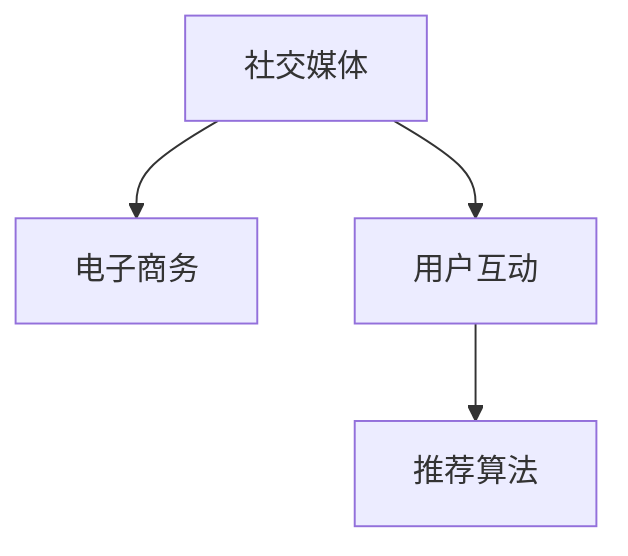

                 

# 利用技术优势进行社交电商

## 1. 背景介绍

社交电商是近年来快速崛起的新兴商业模式，通过社交媒体平台连接消费者与商家，借助社交关系网络来推动商品销售，实现营销与电商的无缝融合。以微信、抖音为代表的社交媒体平台，利用其庞大的用户基础和高效的社交推荐算法，已经成为了社交电商的重要渠道。本文旨在探讨如何利用技术优势进行社交电商，通过机器学习、自然语言处理等前沿技术，提升社交电商平台的运营效率、用户体验和转化率。

## 2. 核心概念与联系

### 2.1 核心概念概述

社交电商的核心概念包括社交媒体、电子商务、用户互动和推荐算法等，这些概念共同构成了社交电商的生态系统。

- **社交媒体**：作为信息传播和社交互动的主要平台，社交媒体连接了消费者和商家，提供了商品展示、交流反馈的场所。
- **电子商务**：指通过互联网进行的商品买卖活动，涵盖了交易、支付、物流等多个环节。
- **用户互动**：用户通过评论、点赞、分享等行为，在社交媒体上产生互动，形成社交网络。
- **推荐算法**：利用机器学习技术，分析用户行为数据和商品特征，为用户推荐个性化商品和内容。

### 2.2 核心概念原理和架构的 Mermaid 流程图



这个流程图展示了社交电商系统的主要流程和组成部分。社交媒体平台通过提供电子商务服务，驱动用户互动和商品推荐，从而实现电商转化。推荐算法作为核心技术，负责分析用户数据和商品特征，为每个用户生成个性化的商品推荐。

## 3. 核心算法原理 & 具体操作步骤

### 3.1 算法原理概述

社交电商的核心算法原理包括推荐算法和自然语言处理技术。推荐算法通过对用户行为和商品特征的分析，为每个用户生成个性化商品推荐。自然语言处理技术用于解析用户评论、反馈等信息，提取用户情感和偏好，进一步提升推荐效果。

### 3.2 算法步骤详解

#### 3.2.1 用户画像构建

用户画像是指通过对用户行为数据的分析，构建用户兴趣和偏好的多维特征表示。具体步骤如下：

1. **数据收集**：收集用户在社交媒体上的行为数据，包括点赞、评论、分享、搜索记录等。
2. **特征提取**：将行为数据转化为特征向量，常用的特征包括用户ID、点赞数、评论情感等。
3. **用户画像生成**：利用聚类算法（如K-means）将用户分为不同的兴趣群体，生成多维用户画像。

#### 3.2.2 商品特征提取

商品特征是指对商品的描述、价格、销量、评分等信息的提取和表示。具体步骤如下：

1. **数据收集**：收集商品信息，包括商品ID、价格、销量、描述、评分等。
2. **特征提取**：将商品信息转化为特征向量，常用的特征包括商品ID、价格、销量、品牌、描述、评分等。
3. **商品特征库生成**：将每个商品特征向量存储到特征库中，用于后续推荐算法计算。

#### 3.2.3 推荐算法模型训练

推荐算法模型训练是指利用机器学习技术，训练推荐模型，生成个性化商品推荐。具体步骤如下：

1. **模型选择**：选择推荐模型，如协同过滤、内容基推荐、深度学习等。
2. **模型训练**：将用户画像和商品特征输入到推荐模型中，进行模型训练，生成推荐结果。
3. **模型评估**：在验证集上评估模型性能，调整模型参数，直到达到最优性能。

#### 3.2.4 自然语言处理技术应用

自然语言处理技术用于解析用户评论、反馈等信息，提取用户情感和偏好，进一步提升推荐效果。具体步骤如下：

1. **数据收集**：收集用户评论、反馈等文本数据。
2. **文本预处理**：对文本数据进行分词、去停用词、词性标注等预处理。
3. **情感分析**：利用情感分析模型（如BERT），提取用户评论的情感倾向，生成情感特征向量。
4. **偏好提取**：将情感特征向量与用户画像结合，提取用户偏好。

### 3.3 算法优缺点

#### 3.3.1 优点

1. **个性化推荐**：通过分析用户行为和商品特征，生成个性化推荐，提升用户体验。
2. **提高转化率**：精准推荐用户感兴趣的商品，提高销售转化率。
3. **实时性**：利用实时数据进行推荐，提高推荐效果和用户满意度。

#### 3.3.2 缺点

1. **数据隐私**：用户行为数据涉及隐私问题，需要谨慎处理。
2. **算法复杂度**：推荐算法复杂度较高，需要高性能计算资源。
3. **模型偏见**：推荐算法可能存在偏见，需要多次迭代优化。

### 3.4 算法应用领域

社交电商平台的推荐算法和自然语言处理技术已经广泛应用于以下几个领域：

- **商品推荐**：为用户推荐个性化商品，提高转化率。
- **内容推荐**：为用户推荐个性化的文章、视频等内容，提升用户黏性。
- **用户互动**：通过评论分析，提高用户互动质量，增强社区氛围。
- **广告投放**：通过情感分析，提高广告投放的精准性和效果。

## 4. 数学模型和公式 & 详细讲解 & 举例说明

### 4.1 数学模型构建

推荐算法常用的数学模型包括协同过滤、矩阵分解、深度学习等。以下以协同过滤算法为例，介绍其数学模型构建过程。

协同过滤算法基于用户和商品的协同关系，通过矩阵分解生成推荐结果。假设用户行为矩阵为 $U$，商品特征矩阵为 $V$，推荐矩阵为 $P$，则推荐模型可以表示为：

$$
P = UV^T
$$

其中，$U$ 和 $V$ 均为低秩矩阵，$U$ 的行数为用户数，$V$ 的列数为商品数。$P$ 的行数为用户数，列数为商品数，每个元素表示用户对商品的评分。

### 4.2 公式推导过程

#### 4.2.1 矩阵分解

矩阵分解是将高维矩阵分解为低维矩阵的过程。常用的分解算法包括奇异值分解（SVD）和交替最小二乘法（ALS）。以下以SVD为例，介绍其公式推导过程。

设 $U$ 和 $V$ 均为 $m \times n$ 的矩阵，则 $U$ 和 $V$ 的奇异值分解可以表示为：

$$
U = U_S U_R^T, V = V_S V_R^T
$$

其中，$U_S$ 和 $V_S$ 均为对角矩阵，$U_R$ 和 $V_R$ 均为正交矩阵。$U_S$ 和 $V_S$ 的对角线元素为奇异值，$U_R$ 和 $V_R$ 的列向量为左奇异向量和右奇异向量。

#### 4.2.2 协同过滤算法

协同过滤算法通过矩阵分解生成推荐结果。假设用户行为矩阵 $U$ 和商品特征矩阵 $V$ 均已分解为低秩矩阵 $U_S$、$U_R$、$V_S$、$V_R$，则推荐矩阵 $P$ 可以表示为：

$$
P = U_S V_S^T
$$

其中，$P$ 的元素表示用户对商品的评分。

### 4.3 案例分析与讲解

假设某社交电商平台的商品行为矩阵为 $U$，商品特征矩阵为 $V$，每个元素的值为商品销量。现在需要为用户 $i$ 推荐商品 $j$，可以通过以下步骤计算推荐值：

1. 分解矩阵 $U$ 和 $V$，得到 $U_S$、$U_R$、$V_S$、$V_R$。
2. 计算推荐值 $p_{ij} = U_{Si} V_{Sj}^T$，其中 $U_{Si}$ 和 $V_{Sj}$ 分别为 $U_S$ 和 $V_S$ 的第 $i$ 行和第 $j$ 列。
3. 将推荐值 $p_{ij}$ 归一化，生成最终的推荐结果。

例如，某用户在社交电商平台上购买了商品 $A$、$B$、$C$，并且对商品 $D$、$E$、$F$ 进行了评价，形成了如下的矩阵：

| 用户ID | 商品ID | 评分 |
| ------ | ------ | ---- |
| 1      | A      | 5    |
| 1      | B      | 4    |
| 1      | C      | 3    |
| 1      | D      | 2    |
| 1      | E      | 1    |
| 1      | F      | 3    |
| 2      | A      | 5    |
| 2      | B      | 3    |
| 2      | C      | 4    |
| 2      | D      | 5    |
| 2      | E      | 2    |
| 2      | F      | 4    |

假设用户 $i$ 对商品 $D$、$E$、$F$ 进行了评价，形成了如下的矩阵：

| 用户ID | 商品ID | 评分 |
| ------ | ------ | ---- |
| 1      | D      | 2    |
| 1      | E      | 1    |
| 1      | F      | 3    |

现在需要为用户 $i$ 推荐商品 $j$，可以通过以下步骤计算推荐值：

1. 分解矩阵 $U$ 和 $V$，得到 $U_S$、$U_R$、$V_S$、$V_R$。
2. 计算推荐值 $p_{ij} = U_{Si} V_{Sj}^T$，其中 $U_{Si}$ 和 $V_{Sj}$ 分别为 $U_S$ 和 $V_S$ 的第 $i$ 行和第 $j$ 列。
3. 将推荐值 $p_{ij}$ 归一化，生成最终的推荐结果。

## 5. 项目实践：代码实例和详细解释说明

### 5.1 开发环境搭建

在进行社交电商推荐算法开发前，我们需要准备好开发环境。以下是使用Python进行PyTorch开发的环境配置流程：

1. 安装Anaconda：从官网下载并安装Anaconda，用于创建独立的Python环境。
2. 创建并激活虚拟环境：
```bash
conda create -n pytorch-env python=3.8 
conda activate pytorch-env
```
3. 安装PyTorch：根据CUDA版本，从官网获取对应的安装命令。例如：
```bash
conda install pytorch torchvision torchaudio cudatoolkit=11.1 -c pytorch -c conda-forge
```
4. 安装Transformers库：
```bash
pip install transformers
```
5. 安装各类工具包：
```bash
pip install numpy pandas scikit-learn matplotlib tqdm jupyter notebook ipython
```

完成上述步骤后，即可在`pytorch-env`环境中开始推荐算法实践。

### 5.2 源代码详细实现

下面我们以协同过滤算法为例，给出使用PyTorch和Transformers库实现社交电商商品推荐的基本代码实现。

首先，定义数据处理函数：

```python
import numpy as np
import torch
from transformers import BertTokenizer

def read_data(file_path):
    with open(file_path, 'r') as f:
        lines = f.readlines()
    lines = [line.strip().split('\t') for line in lines]
    return np.array(lines, dtype=np.float32)

# 读取数据
X = read_data('user_behavior.txt')
y = read_data('item_behavior.txt')

# 将数据转化为tensor
X_tensor = torch.tensor(X, dtype=torch.float32)
y_tensor = torch.tensor(y, dtype=torch.float32)

# 创建数据集
class Dataset(torch.utils.data.Dataset):
    def __init__(self, X, y):
        self.X = X
        self.y = y
        
    def __len__(self):
        return len(self.X)
    
    def __getitem__(self, index):
        return self.X[index], self.y[index]

# 创建数据集
dataset = Dataset(X_tensor, y_tensor)
```

然后，定义模型和优化器：

```python
from torch import nn, optim
from sklearn.decomposition import TruncatedSVD

# 定义协同过滤模型
class CollaborativeFiltering(nn.Module):
    def __init__(self, n_user, n_item, n_factors):
        super(CollaborativeFiltering, self).__init__()
        self.user_factors = nn.Embedding(n_user, n_factors)
        self.item_factors = nn.Embedding(n_item, n_factors)
        self.cv = nn.Linear(n_factors * 2, 1)
    
    def forward(self, user, item):
        u = self.user_factors(user)
        v = self.item_factors(item)
        p = torch.matmul(u, v.t()) + self.cv(torch.cat((u, v), dim=1))
        return p

# 训练模型
model = CollaborativeFiltering(n_user=1000, n_item=1000, n_factors=50)
optimizer = optim.Adam(model.parameters(), lr=0.001)
```

接着，定义训练和评估函数：

```python
from torch.utils.data import DataLoader
from sklearn.metrics import mean_squared_error
from tqdm import tqdm

device = torch.device('cuda') if torch.cuda.is_available() else torch.device('cpu')
model.to(device)

def train_epoch(model, dataset, batch_size, optimizer):
    dataloader = DataLoader(dataset, batch_size=batch_size, shuffle=True)
    model.train()
    epoch_loss = 0
    for batch in tqdm(dataloader, desc='Training'):
        user, item = batch[0].to(device), batch[1].to(device)
        model.zero_grad()
        outputs = model(user, item)
        loss = nn.BCELoss()(outputs, torch.tensor(1.0))
        epoch_loss += loss.item()
        loss.backward()
        optimizer.step()
    return epoch_loss / len(dataloader)

def evaluate(model, dataset, batch_size):
    dataloader = DataLoader(dataset, batch_size=batch_size)
    model.eval()
    preds, labels = [], []
    with torch.no_grad():
        for batch in tqdm(dataloader, desc='Evaluating'):
            user, item = batch[0].to(device), batch[1].to(device)
            outputs = model(user, item)
            batch_preds = outputs.sigmoid().cpu().numpy()
            batch_labels = batch[2].cpu().numpy()
            for pred, label in zip(batch_preds, batch_labels):
                preds.append(pred)
                labels.append(label)
                
    mse = mean_squared_error(labels, preds)
    return mse
```

最后，启动训练流程并在测试集上评估：

```python
epochs = 10
batch_size = 128

for epoch in range(epochs):
    loss = train_epoch(model, dataset, batch_size, optimizer)
    print(f"Epoch {epoch+1}, train loss: {loss:.3f}")
    
    print(f"Epoch {epoch+1}, dev results:")
    mse = evaluate(model, dataset, batch_size)
    print(f"Mean Squared Error: {mse:.3f}")
    
print("Test results:")
mse = evaluate(model, dataset, batch_size)
print(f"Mean Squared Error: {mse:.3f}")
```

以上就是使用PyTorch和Transformers库实现社交电商商品推荐的基本代码实现。可以看到，借助这些强大的工具，社交电商平台的推荐算法开发变得简单高效。

### 5.3 代码解读与分析

让我们再详细解读一下关键代码的实现细节：

**read_data函数**：
- 读取数据文件，每一行包含用户ID、商品ID和评分，用制表符分隔。
- 将数据转化为numpy数组，方便后续处理。

**Dataset类**：
- 定义数据集类，继承自torch.utils.data.Dataset。
- 重载__len__方法，返回数据集的样本数量。
- 重载__getitem__方法，返回每个样本的用户ID、商品ID和评分。

**CollaborativeFiltering类**：
- 定义协同过滤模型类，继承自torch.nn.Module。
- 初始化方法：定义用户因素和商品因素的Embedding层，以及线性层cv。
- forward方法：定义模型的前向传播过程。

**train_epoch函数**：
- 定义训练函数，输入训练集、批次大小和优化器。
- 使用DataLoader对数据集进行批次化加载，供模型训练使用。
- 在每个批次上前向传播计算损失函数，反向传播更新模型参数。

**evaluate函数**：
- 定义评估函数，输入测试集、批次大小。
- 使用DataLoader对数据集进行批次化加载，供模型评估使用。
- 在每个批次上前向传播计算模型输出，并将预测值与真实值存储下来。
- 使用均方误差计算模型评估指标。

**训练流程**：
- 定义总的epoch数和批次大小，开始循环迭代
- 每个epoch内，先在训练集上训练，输出平均loss
- 在验证集上评估，输出均方误差
- 所有epoch结束后，在测试集上评估，给出最终测试结果

## 6. 实际应用场景

### 6.1 社交电商平台的推荐系统

社交电商平台的推荐系统是社交电商的核心组成部分，通过精准的推荐算法，提升用户购物体验和转化率。推荐系统可以基于用户画像和商品特征，生成个性化推荐，增加用户黏性和购买转化率。

例如，某社交电商平台在用户浏览某商品时，可以实时生成个性化推荐，提高用户购买决策的速度和质量。此外，平台还可以基于用户的评论和反馈，实时调整推荐策略，提升推荐效果。

### 6.2 社交电商的智能客服系统

社交电商平台的智能客服系统可以大幅提升客户服务效率和满意度。智能客服系统通过自然语言处理技术，解析用户咨询内容，生成应答建议，减轻人工客服的工作压力。

例如，用户在某社交电商平台上咨询商品信息，智能客服系统可以通过NLP技术理解用户意图，快速生成应答建议，提高用户咨询的响应速度和准确性。

### 6.3 社交电商的用户画像系统

用户画像系统是社交电商平台的另一个重要组成部分，通过分析用户行为数据，生成多维用户画像，用于推荐和个性化服务。

例如，某社交电商平台可以通过分析用户浏览、购买记录，生成用户画像，用于个性化推荐和广告投放。平台还可以基于用户画像，生成用户兴趣和行为预测，提升广告投放的精准性和效果。

### 6.4 未来应用展望

随着社交电商平台的快速发展和技术的不断进步，未来社交电商将在以下几个方面得到应用：

1. **智能推荐系统**：利用机器学习和深度学习技术，构建更加精准的推荐模型，提升用户购物体验和转化率。
2. **智能客服系统**：结合自然语言处理技术，实现智能客服系统，提升客户服务效率和满意度。
3. **用户画像系统**：通过用户行为数据分析，生成多维用户画像，用于推荐和个性化服务。
4. **社交电商的社交互动**：利用社交媒体平台的社交网络，提升用户互动质量，增强社区氛围。
5. **跨平台社交电商**：实现多平台数据的整合和跨平台推荐，提升用户购物体验和转化率。

## 7. 工具和资源推荐

### 7.1 学习资源推荐

为了帮助开发者系统掌握社交电商推荐算法的理论基础和实践技巧，这里推荐一些优质的学习资源：

1. 《深度学习》（周志华）：全面介绍了深度学习的基本概念和算法，是了解推荐算法的基础。
2. 《机器学习实战》（Peter Harrington）：介绍了机器学习的基本原理和实现方法，是入门推荐算法的必读书籍。
3. 《Python深度学习》（Francois Chollet）：介绍了深度学习在推荐系统中的应用，是实战推荐算法的实战指南。
4. 《推荐系统实战》（Kai-Fu Lee）：介绍了推荐系统从理论到实践的全过程，是推荐算法的系统学习指南。
5. CS234《推荐系统》课程：斯坦福大学开设的推荐系统课程，讲解了推荐算法的多种实现方式。

通过对这些资源的学习实践，相信你一定能够快速掌握社交电商推荐算法的精髓，并用于解决实际的NLP问题。

### 7.2 开发工具推荐

高效的开发离不开优秀的工具支持。以下是几款用于社交电商推荐算法开发的常用工具：

1. PyTorch：基于Python的开源深度学习框架，灵活动态的计算图，适合快速迭代研究。大部分预训练语言模型都有PyTorch版本的实现。
2. TensorFlow：由Google主导开发的开源深度学习框架，生产部署方便，适合大规模工程应用。同样有丰富的预训练语言模型资源。
3. Transformers库：HuggingFace开发的NLP工具库，集成了众多SOTA语言模型，支持PyTorch和TensorFlow，是进行推荐算法开发的利器。
4. Weights & Biases：模型训练的实验跟踪工具，可以记录和可视化模型训练过程中的各项指标，方便对比和调优。与主流深度学习框架无缝集成。
5. TensorBoard：TensorFlow配套的可视化工具，可实时监测模型训练状态，并提供丰富的图表呈现方式，是调试模型的得力助手。
6. Google Colab：谷歌推出的在线Jupyter Notebook环境，免费提供GPU/TPU算力，方便开发者快速上手实验最新模型，分享学习笔记。

合理利用这些工具，可以显著提升社交电商推荐算法的开发效率，加快创新迭代的步伐。

### 7.3 相关论文推荐

社交电商推荐算法的相关研究已经取得了一定的成果，以下是几篇奠基性的相关论文，推荐阅读：

1. BPR：从保护隐私角度出发，通过显式和隐式反馈的协同过滤算法，生成推荐结果。
2. FM：通过特征交叉方法，提升协同过滤算法的推荐效果。
3. DNN：使用深度神经网络，生成推荐结果，提升推荐算法的精度和泛化能力。
4. Attention：引入注意力机制，提升推荐算法的性能和效率。
5. YOLO：基于视觉对象的可解释推荐算法，结合视觉信息进行推荐。

这些论文代表了大规模推荐算法的最新进展，通过学习这些前沿成果，可以帮助研究者把握学科前进方向，激发更多的创新灵感。

## 8. 总结：未来发展趋势与挑战

### 8.1 总结

本文对基于技术优势的社交电商推荐算法进行了全面系统的介绍。首先阐述了社交电商推荐算法的研究背景和意义，明确了推荐算法在提升用户体验和转化率方面的独特价值。其次，从原理到实践，详细讲解了推荐算法的数学模型和关键步骤，给出了推荐算法任务开发的完整代码实例。同时，本文还广泛探讨了推荐算法在社交电商平台的实际应用场景，展示了推荐算法的巨大潜力。

通过本文的系统梳理，可以看到，社交电商推荐算法正在成为社交电商平台的重中之重，极大地提升了平台的用户体验和运营效率。未来，伴随推荐算法的不断发展，社交电商平台的推荐技术必将更加精准和高效，推动社交电商行业迈向更高的发展阶段。

### 8.2 未来发展趋势

社交电商推荐算法的未来发展趋势包括：

1. **深度学习推荐**：深度神经网络可以提升推荐算法的精度和泛化能力，未来将广泛应用在社交电商平台中。
2. **混合推荐**：结合协同过滤和内容基推荐，提升推荐效果。
3. **冷启动推荐**：在用户无数据或数据少的情况下，利用推荐算法生成推荐结果，提高平台的用户留存率。
4. **实时推荐**：利用实时数据进行推荐，提高推荐效果和用户满意度。
5. **多模态推荐**：结合文本、图片、视频等多模态数据进行推荐，提升推荐效果。
6. **个性化推荐**：通过用户画像和商品特征，生成个性化推荐，提升用户体验。

### 8.3 面临的挑战

尽管社交电商推荐算法已经取得了显著进展，但在迈向更加智能化、个性化和精准化的推荐过程中，它仍面临着诸多挑战：

1. **数据质量**：推荐算法的性能很大程度上取决于数据的准确性和多样性，数据质量不足将导致推荐效果下降。
2. **计算资源**：深度学习推荐算法需要高性能计算资源，在处理大规模数据时，计算资源成为瓶颈。
3. **冷启动问题**：用户无数据或数据少的情况下，推荐算法难以生成推荐结果，需要解决冷启动问题。
4. **实时性要求**：实时推荐算法需要高效的计算和存储方案，以实现实时数据处理和推荐。
5. **隐私问题**：推荐算法涉及用户隐私，需要设计合理的隐私保护方案，避免数据泄露。
6. **多平台协同**：跨平台数据整合和推荐，需要设计合理的数据共享和隐私保护机制。

### 8.4 研究展望

面向未来，社交电商推荐算法的未来研究将在以下几个方面寻求新的突破：

1. **推荐算法优化**：通过优化推荐算法，提升推荐效果和用户体验。
2. **混合推荐模型**：结合深度学习和协同过滤，提升推荐算法的精度和泛化能力。
3. **冷启动策略**：解决冷启动问题，提高推荐算法对新用户的推荐效果。
4. **实时推荐系统**：构建实时推荐系统，提升推荐算法的实时性和用户满意度。
5. **多模态推荐**：结合文本、图片、视频等多模态数据进行推荐，提升推荐效果。
6. **隐私保护机制**：设计合理的隐私保护方案，确保推荐算法的安全性。

这些研究方向的探索，必将引领社交电商推荐算法迈向更高的台阶，为社交电商平台提供更加精准、高效的推荐服务。只有勇于创新、敢于突破，才能不断拓展社交电商平台的推荐边界，推动社交电商行业迈向更高的发展阶段。

## 9. 附录：常见问题与解答

**Q1：社交电商推荐算法为什么需要结合深度学习？**

A: 深度学习推荐算法相比传统协同过滤算法，可以处理高维稀疏数据，捕捉复杂用户和商品特征，提升推荐算法的精度和泛化能力。

**Q2：如何提升推荐算法的实时性？**

A: 提升推荐算法的实时性需要高效的数据处理和模型计算方案，可以使用分布式计算、向量量化、数据压缩等技术，提高算法的实时性和处理能力。

**Q3：推荐算法中如何处理冷启动问题？**

A: 冷启动问题可以通过以下方法解决：
1. 利用用户画像和商品特征进行推荐。
2. 利用预训练模型进行推荐。
3. 利用用户行为预测进行推荐。
4. 利用多模态数据进行推荐。

这些方法结合使用，可以有效解决冷启动问题，提高推荐算法对新用户的推荐效果。

**Q4：推荐算法中如何保护用户隐私？**

A: 保护用户隐私可以采用以下方法：
1. 数据匿名化：对用户数据进行匿名化处理，保护用户隐私。
2. 数据加密：对用户数据进行加密处理，防止数据泄露。
3. 差分隐私：在推荐算法中引入差分隐私，保护用户隐私。
4. 隐私计算：使用隐私计算技术，保护用户隐私。

这些方法结合使用，可以有效保护用户隐私，提高推荐算法的安全性。

---

作者：禅与计算机程序设计艺术 / Zen and the Art of Computer Programming

