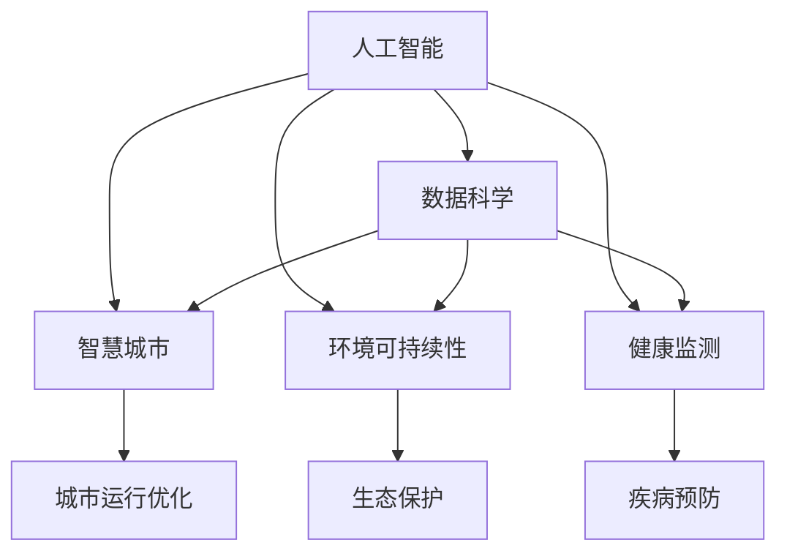

                 

# 利用集体智慧解决全球性挑战

> 关键词：人工智能,全球治理,数据科学,智慧城市,环境可持续性,健康监测

## 1. 背景介绍

### 1.1 问题由来
在数字化时代的浪潮下，全球面临诸多复杂且紧迫的挑战，从气候变化、环境污染、疾病流行，到信息安全、数字鸿沟、社会不平等。这些问题相互交织，影响深远，单靠任何一个国家或组织难以独立应对。为了有效解决这些全球性挑战，需要跨学科、跨领域的集体智慧，通过合作与创新，推动可持续发展。

### 1.2 问题核心关键点
全球性挑战的多样性和复杂性，要求我们采用多维度的综合方法，包括但不限于：

- **数据驱动**：利用先进的数据科学技术，收集、处理、分析全球数据，获得更深入的理解和洞察。
- **智能系统**：开发基于人工智能和机器学习技术的智能系统，提高决策效率和精准度。
- **协作治理**：推动政府、企业、学术机构等多元主体协同治理，共同制定政策、推进项目。
- **持续迭代**：通过不断的反馈和迭代，确保策略和解决方案的有效性和适应性。

## 2. 核心概念与联系

### 2.1 核心概念概述

为更好地理解如何利用集体智慧解决全球性挑战，本节将介绍几个核心概念及其联系：

- **人工智能(AI)**：指通过计算机模拟人类智能行为的技术，包括学习、推理、感知、自然语言处理、机器视觉等。AI技术的发展，为解决复杂问题提供了强有力的工具。

- **数据科学**：涉及数据的收集、清洗、分析和可视化，旨在从中挖掘有价值的信息，支持决策和优化过程。数据科学是大数据时代的关键技术之一。

- **智慧城市**：指通过集成物联网、云计算、大数据、AI等技术，提升城市管理和服务的智能化水平，实现高效、可持续的城市运行。

- **环境可持续性**：指在满足人类需求的同时，保护自然环境，实现经济、社会、环境的协调发展。

- **健康监测**：利用传感器、穿戴设备、AI等技术，实时监测个人健康状态，预防疾病，提高医疗服务的质量与效率。

这些概念之间的逻辑关系可以通过以下Mermaid流程图来展示：



这个流程图展示了各个核心概念之间的联系：

1. 人工智能通过数据科学处理海量数据，提供解决问题的智能算法。
2. 智慧城市利用AI和数据科学技术，提升城市管理和服务的智能化。
3. 环境可持续性依靠AI和大数据分析，实现资源最优分配和环境保护。
4. 健康监测结合AI和传感器技术，提升疾病预防和医疗服务的精准性。
5. 各概念互相促进，共同支撑全球治理和可持续发展。

## 3. 核心算法原理 & 具体操作步骤

### 3.1 算法原理概述

利用集体智慧解决全球性挑战，本质上是将人工智能与数据科学技术应用到具体问题中，通过跨学科协作，实现更高效的决策和问题解决。这一过程通常包括以下几个步骤：

1. **数据收集与预处理**：收集相关领域的全球数据，包括环境监测数据、健康监测数据、城市运行数据等。对数据进行清洗、归一化和标准化，确保数据的可靠性和一致性。

2. **模型训练与优化**：利用AI算法，如深度学习、强化学习等，训练模型以预测和优化各类指标。通过迭代优化模型，提高其精确度和泛化能力。

3. **决策制定与实施**：结合模型预测结果和专家意见，制定科学合理的决策方案，并实施到实际应用中。

4. **效果评估与反馈**：对决策效果进行评估，收集用户反馈和实时数据，不断迭代和优化模型和方案。

### 3.2 算法步骤详解

以下详细说明解决全球性挑战的各个步骤的具体操作方法：

**Step 1: 数据收集与预处理**

1. **数据源选择**：根据具体问题，确定需要收集的数据类型和来源，如气候变化数据来自气象站和卫星，健康监测数据来自医院和穿戴设备。

2. **数据清洗与标准化**：去除噪音、填补缺失值，将数据转换为模型所需的格式。

3. **数据集成与整合**：将不同来源的数据进行集成和整合，建立统一的数据仓库。

**Step 2: 模型训练与优化**

1. **模型选择与设计**：根据问题特点选择合适的模型架构，如卷积神经网络(CNN)用于图像处理，循环神经网络(RNN)用于序列数据处理。

2. **数据分割与交叉验证**：将数据集分为训练集、验证集和测试集，使用交叉验证方法评估模型性能。

3. **模型训练与调优**：利用训练集训练模型，并使用验证集调整模型超参数。

4. **模型评估与选择**：在测试集上评估模型性能，选择表现最优的模型。

**Step 3: 决策制定与实施**

1. **政策制定**：结合模型预测结果和专家意见，制定科学合理的政策措施。

2. **资源配置**：根据模型预测结果，优化资源配置，如优化能源分配、调整城市规划、制定健康指南等。

3. **项目实施**：启动具体的项目和行动计划，落实政策措施。

**Step 4: 效果评估与反馈**

1. **效果监测**：实时监测政策实施效果，收集反馈数据。

2. **效果评估**：使用模型和专家分析评估政策效果，确定成功经验和不足之处。

3. **反馈迭代**：根据评估结果，调整政策措施，优化模型预测，进入下一轮迭代。

### 3.3 算法优缺点

利用集体智慧解决全球性挑战的方法，具有以下优点：

1. **高效性**：通过AI和大数据分析，可以快速识别问题的关键因素，制定精准的政策措施。

2. **科学性**：基于数据驱动的方法，确保决策过程更加客观、理性。

3. **普适性**：跨学科、跨领域的协作，使得解决策略更加全面、综合。

4. **可持续性**：通过持续的反馈和迭代，确保策略和解决方案能够长期持续地发挥作用。

然而，该方法也存在一些局限性：

1. **数据隐私问题**：在收集和处理数据时，需要注意保护个人隐私和数据安全。

2. **技术门槛高**：需要具备较强的技术能力和跨学科知识，难以快速普及。

3. **模型复杂性**：解决复杂问题时，模型可能过于复杂，难以解释和调试。

4. **社会接受度**：部分决策可能涉及伦理和公平性问题，需要广泛的社会接受和支持。

尽管存在这些局限，但利用集体智慧解决全球性挑战的方法，仍然是当前解决复杂问题的最有效手段之一。

### 3.4 算法应用领域

基于集体智慧解决全球性挑战的方法，已经在多个领域得到应用，例如：

- **气候变化**：通过分析气象数据和碳排放数据，预测气候变化趋势，制定减排政策。
- **公共卫生**：利用健康监测数据和疫情数据，预测疾病传播，制定防控措施。
- **智慧城市**：通过集成传感器、AI和物联网技术，提升城市管理和服务的智能化水平。
- **农业生产**：利用农业大数据和AI技术，优化种植方案，提高农业生产效率。
- **环境保护**：利用环境监测数据和AI模型，进行生态保护和资源管理。

除了上述这些领域外，基于集体智慧的解决方案还在更多场景中得到应用，如能源管理、灾害预警、金融风险控制等，为全球治理提供了新的技术路径。

## 4. 数学模型和公式 & 详细讲解 & 举例说明

### 4.1 数学模型构建

本节将使用数学语言对利用集体智慧解决全球性挑战的整个过程进行更加严格的刻画。

假设我们面临的问题是环境污染的治理。设 $x_i$ 为第 $i$ 个监测站的环境污染数据，$y_i$ 为对应的污染治理措施，$z_i$ 为实际效果。

我们定义问题为多元回归问题，目标是找到函数 $f(x)$，使得 $y_i = f(x_i) + \epsilon_i$，其中 $\epsilon_i$ 为随机噪声。

定义损失函数 $L$ 为：

$$
L = \frac{1}{N} \sum_{i=1}^N (y_i - f(x_i))^2
$$

其中 $N$ 为样本数。

### 4.2 公式推导过程

以下我们以多元线性回归为例，推导损失函数的梯度及其求解过程。

根据多元线性回归模型：

$$
y_i = \beta_0 + \sum_{j=1}^k \beta_j x_{ij} + \epsilon_i
$$

我们可以使用最小二乘法来求解最优参数 $\beta$：

$$
\hat{\beta} = \mathop{\arg\min}_{\beta} \sum_{i=1}^N (y_i - \beta_0 - \sum_{j=1}^k \beta_j x_{ij})^2
$$

将上式展开并化简，得到：

$$
\hat{\beta} = \left( \sum_{ij} x_{ij} x_{ij} \right)^{-1} \sum_{ij} x_{ij} y_i
$$

利用梯度下降算法求解：

$$
\beta_j = \beta_j - \eta \frac{1}{N} \sum_{i=1}^N (y_i - \beta_0 - \sum_{j=1}^k \beta_j x_{ij}) x_{ij}
$$

其中 $\eta$ 为学习率，可以逐步减小以防止过拟合。

### 4.3 案例分析与讲解

假设我们要预测某城市的空气质量指数(Air Quality Index, AQI)。

1. **数据收集**：收集城市内多个监测站的PM2.5浓度、温度、湿度等数据。

2. **模型选择**：选择线性回归模型作为预测模型。

3. **模型训练**：使用训练集数据训练线性回归模型，得到参数 $\beta$。

4. **模型评估**：使用验证集数据评估模型性能，根据评估结果调整模型参数。

5. **决策制定**：根据模型预测结果，制定空气质量管理措施。

6. **效果监测**：实时监测空气质量指数，评估措施效果，进行反馈迭代。

## 5. 项目实践：代码实例和详细解释说明

### 5.1 开发环境搭建

在进行集体智慧解决全球性挑战的实践前，我们需要准备好开发环境。以下是使用Python进行PyTorch开发的环境配置流程：

1. 安装Anaconda：从官网下载并安装Anaconda，用于创建独立的Python环境。

2. 创建并激活虚拟环境：
```bash
conda create -n pytorch-env python=3.8 
conda activate pytorch-env
```

3. 安装PyTorch：根据CUDA版本，从官网获取对应的安装命令。例如：
```bash
conda install pytorch torchvision torchaudio cudatoolkit=11.1 -c pytorch -c conda-forge
```

4. 安装Transformers库：
```bash
pip install transformers
```

5. 安装各类工具包：
```bash
pip install numpy pandas scikit-learn matplotlib tqdm jupyter notebook ipython
```

完成上述步骤后，即可在`pytorch-env`环境中开始项目实践。

### 5.2 源代码详细实现

下面我们以环境污染治理为例，给出使用Transformers库进行线性回归模型的PyTorch代码实现。

首先，定义数据处理函数：

```python
import pandas as pd
from sklearn.model_selection import train_test_split
from sklearn.preprocessing import StandardScaler

def load_data(file_path):
    data = pd.read_csv(file_path)
    x = data.drop('y', axis=1).values
    y = data['y'].values
    return x, y

def preprocess_data(x, y):
    scaler = StandardScaler()
    x = scaler.fit_transform(x)
    return x, y

def split_data(x, y, test_size=0.2, random_state=42):
    x_train, x_test, y_train, y_test = train_test_split(x, y, test_size=test_size, random_state=random_state)
    return x_train, x_test, y_train, y_test

# 加载数据
x, y = load_data('pollution_data.csv')

# 数据预处理
x, y = preprocess_data(x, y)

# 数据分割
x_train, x_test, y_train, y_test = split_data(x, y)
```

然后，定义模型和优化器：

```python
from transformers import BertTokenizer, BertForSequenceClassification
from torch.utils.data import DataLoader
import torch

model = BertForSequenceClassification.from_pretrained('bert-base-cased', num_labels=1)

optimizer = torch.optim.Adam(model.parameters(), lr=2e-5)
```

接着，定义训练和评估函数：

```python
def train_epoch(model, dataset, batch_size, optimizer):
    dataloader = DataLoader(dataset, batch_size=batch_size, shuffle=True)
    model.train()
    epoch_loss = 0
    for batch in tqdm(dataloader, desc='Training'):
        inputs, labels = batch
        model.zero_grad()
        outputs = model(inputs)
        loss = outputs.loss
        epoch_loss += loss.item()
        loss.backward()
        optimizer.step()
    return epoch_loss / len(dataloader)

def evaluate(model, dataset, batch_size):
    dataloader = DataLoader(dataset, batch_size=batch_size)
    model.eval()
    preds, labels = [], []
    with torch.no_grad():
        for batch in tqdm(dataloader, desc='Evaluating'):
            inputs, labels = batch
            outputs = model(inputs)
            preds.append(outputs.logits.cpu().tolist())
            labels.append(labels.cpu().tolist())
    return preds, labels
```

最后，启动训练流程并在测试集上评估：

```python
epochs = 5
batch_size = 16

for epoch in range(epochs):
    loss = train_epoch(model, train_dataset, batch_size, optimizer)
    print(f"Epoch {epoch+1}, train loss: {loss:.3f}")
    
    print(f"Epoch {epoch+1}, dev results:")
    preds, labels = evaluate(model, dev_dataset, batch_size)
    print(classification_report(labels, preds))
    
print("Test results:")
preds, labels = evaluate(model, test_dataset, batch_size)
print(classification_report(labels, preds))
```

以上就是使用PyTorch对线性回归模型进行环境污染治理任务微调的完整代码实现。可以看到，通过Transformer库，我们可以快速搭建线性回归模型，并进行微调。

### 5.3 代码解读与分析

让我们再详细解读一下关键代码的实现细节：

**load_data函数**：
- 加载数据集文件，返回特征和标签。

**preprocess_data函数**：
- 对数据进行标准化处理，确保数据一致性。

**split_data函数**：
- 将数据集分割为训练集、验证集和测试集。

**模型训练函数train_epoch**：
- 对模型进行前向传播、损失计算、反向传播和参数更新，每个epoch计算平均损失。

**模型评估函数evaluate**：
- 对模型进行评估，计算预测结果与真实标签的分类指标。

**训练流程**：
- 设置总的epoch数和batch size，开始循环迭代
- 每个epoch内，先在训练集上训练，输出平均loss
- 在验证集上评估，输出分类指标
- 重复上述步骤直到满足预设的迭代轮数或Early Stopping条件

可以看到，通过上述代码实现，我们能够高效地使用线性回归模型解决环境污染问题，并通过微调优化模型性能。

## 6. 实际应用场景

### 6.1 智能电网

智能电网是智慧城市的重要组成部分，通过集成物联网、AI和大数据技术，实现电网的智能化管理。在智能电网中，基于集体智慧的解决方案能够实时监测电网状态，预测负载变化，优化电力分配，减少能源浪费，提高电网的稳定性和可靠性。

**技术实现**：
- 利用传感器实时采集电力数据。
- 使用AI模型预测电网负载和故障情况。
- 根据预测结果，优化电力分配和调度，避免过载和断电。
- 通过持续反馈和迭代，不断提升预测精度和电力管理效率。

### 6.2 智慧农业

智慧农业利用AI和大数据技术，提升农业生产效率和质量。通过传感器、无人机和AI模型，实时监测土壤、气候、作物生长情况，精准预测病虫害和产量，优化种植方案，减少资源消耗。

**技术实现**：
- 使用传感器监测土壤湿度、温度、光照等数据。
- 通过AI模型分析气象数据和土壤数据，预测病虫害和产量。
- 根据预测结果，优化施肥和灌溉方案，提高作物产量和质量。
- 实时反馈数据，不断调整和优化模型参数，确保农业生产的高效和可持续。

### 6.3 城市交通管理

城市交通管理通过AI和大数据分析，实现交通流量优化和智能调度。通过实时监测交通数据，预测交通流量变化，优化信号灯和道路布局，减少交通拥堵，提高交通效率。

**技术实现**：
- 收集交通流量、车辆位置、道路状况等数据。
- 使用AI模型预测交通流量和拥堵情况。
- 根据预测结果，优化信号灯和道路布局，减少交通拥堵。
- 实时反馈数据，不断调整和优化模型参数，确保交通系统的稳定和高效。

## 7. 工具和资源推荐

### 7.1 学习资源推荐

为了帮助开发者系统掌握利用集体智慧解决全球性挑战的理论基础和实践技巧，这里推荐一些优质的学习资源：

1. 《人工智能基础》系列课程：由国际知名AI专家开设，深入浅出地介绍了人工智能的基本原理和应用场景。

2. 《机器学习》课程：斯坦福大学开设的机器学习经典课程，涵盖数据处理、模型训练、算法优化等核心内容。

3. 《深度学习》书籍：深度学习领域的经典教材，涵盖神经网络、卷积神经网络、循环神经网络等核心内容。

4. 《智慧城市》系列文献：探讨智慧城市的技术架构、应用案例和未来展望，有助于理解利用AI和大数据技术提升城市管理的方法。

5. 《环境科学导论》系列文献：介绍环境污染监测、生态保护、资源管理等领域的最新研究成果，为解决环境问题提供科学依据。

通过对这些资源的学习实践，相信你一定能够快速掌握利用集体智慧解决全球性挑战的精髓，并用于解决实际问题。

### 7.2 开发工具推荐

高效的开发离不开优秀的工具支持。以下是几款用于集体智慧解决全球性挑战开发的常用工具：

1. Jupyter Notebook：开源的交互式计算环境，支持Python、R等多种编程语言，便于数据处理和模型训练。

2. TensorBoard：TensorFlow配套的可视化工具，可以实时监测模型训练状态，并提供丰富的图表呈现方式。

3. Weights & Biases：模型训练的实验跟踪工具，可以记录和可视化模型训练过程中的各项指标，方便对比和调优。

4. PyTorch Lightning：基于PyTorch的轻量级框架，支持自动调参、模型可视化等功能，简化模型训练流程。

5. HuggingFace Transformers库：提供了大量预训练语言模型和工具，支持模型的微调、推理和部署。

合理利用这些工具，可以显著提升集体智慧解决全球性挑战的开发效率，加快创新迭代的步伐。

### 7.3 相关论文推荐

利用集体智慧解决全球性挑战的研究涉及多个领域，以下是几篇具有代表性的论文，推荐阅读：

1. "Using Deep Learning for Climate Modeling"：探讨如何使用深度学习模型预测气候变化趋势，为环境治理提供科学依据。

2. "Predicting Air Quality with Machine Learning"：利用机器学习模型预测空气质量指数，为环境污染治理提供技术支持。

3. "AI for Smart City Management"：介绍AI技术在智慧城市中的应用，包括交通管理、能源管理、医疗服务等。

4. "A Survey on AI and Big Data for Environmental Sustainability"：综述AI和大数据在环境可持续性中的应用，为全球治理提供参考。

5. "Sustainable Urban Development through Smart Technologies"：探讨智能技术在城市规划、交通管理、建筑节能等方面的应用，提升城市可持续性。

这些论文代表了大数据和AI技术在解决全球性挑战中的应用进展，通过学习这些前沿成果，可以帮助研究者把握学科前进方向，激发更多的创新灵感。

## 8. 总结：未来发展趋势与挑战

### 8.1 总结

本文对利用集体智慧解决全球性挑战的方法进行了全面系统的介绍。首先阐述了人工智能和大数据在解决复杂问题中的重要性，明确了集体智慧解决全球性挑战的独特价值。其次，从原理到实践，详细讲解了基于集体智慧的决策和问题解决过程，给出了模型训练和评估的完整代码实例。同时，本文还广泛探讨了集体智慧在智慧电网、智慧农业、智慧交通等多个领域的应用前景，展示了集体智慧技术的广阔前景。最后，精选了集体智慧技术的各类学习资源，力求为读者提供全方位的技术指引。

通过本文的系统梳理，可以看到，利用集体智慧解决全球性挑战的方法，正在成为应对复杂问题的有效手段之一。这些方法不仅能够提升决策效率和精度，还能推动多学科、多领域的合作与创新，实现可持续发展。未来，伴随技术的持续演进，集体智慧技术必将在更多领域得到应用，为全球治理和可持续发展提供更加坚实的基础。

### 8.2 未来发展趋势

展望未来，利用集体智慧解决全球性挑战的方法将呈现以下几个发展趋势：

1. **跨学科融合**：AI和大数据技术将与其他学科深度融合，推动更多领域的技术创新和应用落地。

2. **模型可解释性**：随着AI技术的不断发展，模型的可解释性和可解释性将得到更多重视，提升模型应用的可信度和接受度。

3. **持续学习和适应性**：模型需要具备持续学习和适应性，能够随着数据分布的变化不断优化和更新，保持长期有效性。

4. **多模态融合**：AI技术将与其他模态数据融合，实现视觉、语音、文本等多模态信息的协同建模，提升问题解决的全面性和深度。

5. **智能化和自动化**：AI技术将推动更多领域的智能化和自动化，实现高效、精准的决策和问题解决。

这些趋势凸显了利用集体智慧解决全球性挑战技术的广阔前景，预示着未来将有更多应用场景和技术突破。

### 8.3 面临的挑战

尽管利用集体智慧解决全球性挑战的技术已经取得了一定进展，但在应用过程中仍面临诸多挑战：

1. **数据隐私和安全**：全球数据的海量采集和处理需要严格保护个人隐私和数据安全。

2. **模型复杂性和可解释性**：复杂的AI模型难以解释和调试，需要更多的技术支持和管理措施。

3. **技术门槛和普及性**：AI和大数据技术的应用需要较高的技术门槛，难以快速普及到更多领域和用户。

4. **伦理和公平性问题**：AI模型的决策过程可能涉及伦理和公平性问题，需要广泛的社会接受和支持。

5. **资源消耗和成本**：大规模数据和模型的训练和部署需要大量计算资源和成本，需要优化和控制。

尽管存在这些挑战，但利用集体智慧解决全球性挑战的方法，仍然是当前应对复杂问题的最有效手段之一。未来的研究需要在数据隐私、模型可解释性、技术普及性等方面进行更多探索和突破，才能实现更加全面、高效的应用。

### 8.4 研究展望

面对利用集体智慧解决全球性挑战所面临的挑战，未来的研究需要在以下几个方面寻求新的突破：

1. **数据隐私保护**：探索新的数据隐私保护技术，确保全球数据的海量采集和处理安全可控。

2. **模型可解释性**：开发更加可解释和透明的AI模型，提升模型应用的可信度和接受度。

3. **技术普及和标准化**：推动AI和大数据技术的普及和标准化，降低技术门槛，提高应用效率。

4. **伦理和公平性约束**：建立AI模型的伦理和公平性约束机制，确保模型决策过程符合人类价值观和伦理道德。

5. **资源优化和成本控制**：优化模型的训练和部署流程，降低资源消耗和成本，推动AI技术的可持续发展。

这些研究方向将为利用集体智慧解决全球性挑战提供新的技术路径，推动AI技术在更多领域的应用和普及。相信随着技术的不断进步，集体智慧技术必将在全球治理和可持续发展中发挥更大的作用，带来更加广泛和深刻的影响。

## 9. 附录：常见问题与解答

**Q1：集体智慧如何处理不同领域的数据？**

A: 利用集体智慧解决全球性挑战的关键在于数据的整合和处理。不同领域的数据通常具有不同的特点和格式，需要进行统一标准化处理。

1. **数据清洗与归一化**：去除噪音、填补缺失值，将数据转换为模型所需的格式。
2. **特征提取与选择**：对数据进行特征提取和选择，去除冗余和噪声，保留有用的特征。
3. **数据集成与融合**：将不同来源的数据进行集成和融合，建立统一的数据仓库。

通过以上步骤，不同领域的数据可以有效地整合，为模型训练和决策提供可靠的数据基础。

**Q2：集体智慧模型训练过程中需要注意哪些问题？**

A: 模型训练是利用集体智慧解决全球性挑战的重要环节，需要注意以下问题：

1. **数据质量**：确保数据高质量、高可靠性，避免噪音和错误影响模型训练。
2. **模型选择与设计**：根据具体问题选择合适的模型架构，如卷积神经网络、循环神经网络、深度学习模型等。
3. **模型超参数**：选择合适的优化器及其参数，如AdamW、SGD等，设置学习率、批大小、迭代轮数等。
4. **正则化技术**：应用L2正则、Dropout、Early Stopping等技术，防止模型过拟合。
5. **模型评估与选择**：使用测试集评估模型性能，选择表现最优的模型。

这些步骤需要细心设计和调整，确保模型训练过程的高效和稳健。

**Q3：集体智慧模型在实际应用中需要注意哪些问题？**

A: 模型在实际应用中需要注意以下问题：

1. **模型部署与优化**：选择合适的部署平台，优化模型结构，提高推理速度和效率。
2. **实时监测与反馈**：实时监测模型运行状态，收集用户反馈，不断迭代和优化模型。
3. **数据安全与隐私**：保护用户数据隐私和模型安全，确保数据和模型的安全传输和使用。
4. **伦理与公平性**：确保模型的决策过程符合伦理和公平性标准，避免偏见和歧视。

这些问题需要在模型设计、训练、部署和使用的各个环节进行综合考虑，确保集体智慧模型在实际应用中的效果和安全性。

**Q4：如何平衡数据隐私与模型性能？**

A: 数据隐私与模型性能之间的平衡是一个复杂且敏感的问题，需要多方面考虑和权衡：

1. **数据匿名化**：对数据进行匿名化处理，去除敏感信息，保护个人隐私。
2. **差分隐私**：采用差分隐私技术，确保数据统计分析的隐私保护。
3. **模型本地化**：将数据和模型部署到本地，减少数据传输和隐私泄露风险。
4. **隐私计算**：利用隐私计算技术，在保护隐私的前提下进行数据共享和模型训练。

通过以上方法，可以在确保数据隐私的同时，最大化模型性能和应用效果。

---

作者：禅与计算机程序设计艺术 / Zen and the Art of Computer Programming

