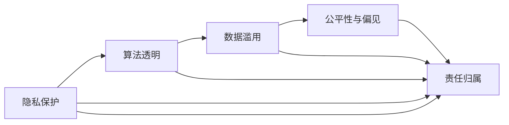

                 

# 制定AI伦理准则：搜索的道德底线

> 关键词：人工智能伦理,AI搜索,道德底线,隐私保护,算法透明

## 1. 背景介绍

在数字化时代，人工智能（AI）已经成为推动社会进步和经济增长的重要力量。然而，AI技术的广泛应用也引发了一系列伦理问题，如隐私侵犯、数据滥用、算法偏见等。特别是，AI搜索作为信息获取的关键手段，其伦理标准显得尤为重要。本文将从背景介绍开始，探讨AI搜索中的道德底线，提出一套具有普适性和可操作性的伦理准则。

### 1.1 问题由来

随着搜索引擎的普及，人们已经习惯于在各种平台上进行信息搜索，但随之而来的是隐私保护、数据滥用等问题。例如，Google搜索算法曾因涉嫌侵犯用户隐私而备受争议，Facebook因利用用户数据进行定向广告而遭全球谴责。这些事件引发了对AI搜索伦理的广泛讨论。

### 1.2 问题核心关键点

AI搜索的伦理问题主要集中在以下几个方面：

- **隐私保护**：如何平衡搜索的便利性与用户的隐私需求？
- **数据滥用**：搜索引擎如何避免滥用用户数据，尤其是敏感数据？
- **算法透明**：搜索算法的设计和优化过程应如何确保透明性？
- **公平性与偏见**：如何避免算法偏见，确保搜索结果的公平性？
- **责任归属**：当搜索结果出现问题时，谁应该承担责任？

这些关键问题构成了AI搜索伦理的基本框架，需要引起足够的重视。

### 1.3 问题研究意义

制定AI搜索伦理准则，对于保护用户权益、提升搜索服务质量、构建公平透明的AI搜索环境具有重要意义：

- 增强用户信任。明确伦理准则可以增强用户对AI搜索的信任感，减少隐私泄露和数据滥用的风险。
- 提升搜索效果。伦理准则可以为AI搜索提供明确的指导，帮助优化搜索结果，提升用户体验。
- 促进社会公平。伦理准则有助于防止算法偏见，确保不同群体获得公平的搜索结果，推动社会公平。
- 推动技术进步。伦理准则的制定和实施，可以推动AI搜索技术的创新和进步，提高搜索服务的竞争力。

## 2. 核心概念与联系

### 2.1 核心概念概述

在讨论AI搜索伦理准则之前，首先需要明确一些核心概念：

- **隐私保护**：保护用户的个人信息，防止数据泄露和滥用。
- **数据滥用**：不当利用用户数据进行商业或其他目的的行为。
- **算法透明**：搜索算法的开发和优化过程应公开透明，用户可以理解其工作原理。
- **公平性与偏见**：确保搜索结果对所有用户公平无偏，不因性别、种族、年龄等因素产生歧视。
- **责任归属**：确定当搜索结果出现问题时，各方的责任归属。

这些核心概念之间相互关联，共同构成了AI搜索伦理准则的基本框架。

### 2.2 核心概念原理和架构的 Mermaid 流程图



这个流程图展示了核心概念之间的逻辑关系，隐私保护和数据滥用都可能导致责任归属的问题，而算法透明性和公平性则直接影响到用户对搜索结果的信任和满意度。

## 3. 核心算法原理 & 具体操作步骤

### 3.1 算法原理概述

AI搜索的伦理准则主要涉及以下几个方面：

- **隐私保护算法**：确保用户数据在收集和处理过程中的安全。
- **数据滥用检测算法**：识别和防止不适当的数据使用行为。
- **算法透明性算法**：提供用户对搜索算法的理解。
- **公平性算法**：确保搜索结果不受算法偏见的干扰。
- **责任归属算法**：明确当搜索结果出现问题时的责任划分。

### 3.2 算法步骤详解

#### 3.2.1 隐私保护算法

- **数据收集**：明确数据收集目的和范围，仅收集必要信息。
- **数据存储**：采用安全存储措施，防止数据泄露。
- **数据访问**：限制数据访问权限，确保仅授权人员可以访问。
- **数据加密**：对敏感数据进行加密，防止未经授权访问。
- **用户控制**：允许用户自主管理其个人数据，如数据删除和修改权限。

#### 3.2.2 数据滥用检测算法

- **数据使用监控**：建立监控系统，实时监测数据使用情况。
- **异常检测**：利用机器学习算法检测异常使用行为。
- **滥用警报**：发现滥用行为时，及时发出警报，采取相应措施。
- **用户反馈**：建立用户反馈机制，允许用户报告数据滥用情况。

#### 3.2.3 算法透明性算法

- **算法公开**：公开搜索算法的核心原理和技术细节。
- **文档和解释**：提供算法的详细文档和解释，帮助用户理解其工作原理。
- **用户参与**：允许用户参与算法优化和改进，提供反馈和建议。
- **透明评估**：定期进行算法透明性评估，确保其有效性。

#### 3.2.4 公平性算法

- **数据多样性**：确保训练数据多样性，避免单一数据源带来的偏见。
- **特征处理**：对算法输入特征进行处理，消除可能导致偏见的因素。
- **结果验证**：定期验证算法的公平性，确保不同群体的公平性。
- **模型监控**：建立模型监控系统，实时监测和纠正偏差。

#### 3.2.5 责任归属算法

- **规则制定**：明确搜索结果出现问题时的责任划分规则。
- **责任识别**：当出现问题时，及时识别并确定责任方。
- **补偿机制**：建立补偿机制，对受影响的个人或群体进行赔偿。
- **透明报告**：确保责任归属过程透明，允许用户申诉和监督。

### 3.3 算法优缺点

#### 3.3.1 优点

- **用户信任增强**：明确伦理准则可以增强用户对AI搜索的信任感。
- **搜索效果提升**：伦理准则可以为AI搜索提供明确的指导，帮助优化搜索结果。
- **社会公平推动**：伦理准则有助于防止算法偏见，确保搜索结果的公平性。

#### 3.3.2 缺点

- **技术复杂**：实施伦理准则需要大量的技术支持和资源投入。
- **成本高昂**：开发和维护伦理准则的成本较高，需要持续投入。
- **执行难度**：伦理准则的执行需要多方协作，可能面临执行难度大等问题。

### 3.4 算法应用领域

AI搜索伦理准则不仅可以应用于互联网搜索引擎，还可以推广到其他领域，如智能家居、智能城市、智能医疗等。这些领域中的AI系统都需要收集和处理大量用户数据，制定伦理准则尤为重要。

## 4. 数学模型和公式 & 详细讲解 & 举例说明

### 4.1 数学模型构建

在数学上，我们可以将AI搜索伦理准则的制定过程建模为以下几个步骤：

1. **隐私保护模型**：保护用户隐私的数据处理模型。
2. **数据滥用检测模型**：识别数据滥用行为的异常检测模型。
3. **算法透明性模型**：描述算法透明性的评估和改进模型。
4. **公平性模型**：确保搜索结果公平性的算法模型。
5. **责任归属模型**：确定责任归属的决策模型。

### 4.2 公式推导过程

以数据滥用检测为例，我们可以使用机器学习中的异常检测算法，如孤立森林、K近邻等方法。假设我们有$m$个用户数据样本，每个样本有$d$个特征，记为$X=(x_1, x_2, ..., x_d)$，其中$x_i$表示第$i$个特征的值。

设$X$为正常数据分布，$Y$为异常数据分布。假设我们通过机器学习模型训练得到异常检测阈值$\theta$，则异常检测的决策函数可以表示为：

$$
f(X) = \begin{cases}
0, & \text{if} \|X - \mu\| < \theta \\
1, & \text{otherwise}
\end{cases}
$$

其中$\mu$为数据均值，$\|.\|$表示欧几里得距离。当$\|X - \mu\| < \theta$时，模型认为$X$为正常数据；否则，模型认为$X$为异常数据。

### 4.3 案例分析与讲解

假设我们有一个新闻网站，使用AI搜索算法提供个性化推荐。在隐私保护方面，我们需要确保用户数据的匿名化处理，防止数据泄露。在数据滥用方面，我们需要建立异常检测模型，实时监控数据使用情况，防止滥用行为。在算法透明性方面，我们需要公开算法原理，提供详细文档。在公平性方面，我们需要确保推荐算法不受用户特征影响，如性别、年龄等。在责任归属方面，我们需要明确算法出现问题时的责任划分规则。

## 5. 项目实践：代码实例和详细解释说明

### 5.1 开发环境搭建

为了实现AI搜索伦理准则，我们需要搭建一个完善的开发环境，包括以下几个关键组件：

- **数据存储**：使用MySQL等关系型数据库存储用户数据，确保数据安全。
- **算法框架**：使用TensorFlow、PyTorch等深度学习框架实现算法模型。
- **监控系统**：使用Prometheus、Grafana等工具实时监控算法运行情况。
- **用户界面**：使用React、Vue等前端框架构建用户界面，提供用户反馈和监督功能。

### 5.2 源代码详细实现

以下是一个简化的代码示例，用于实现数据滥用检测算法：

```python
import numpy as np
from sklearn.ensemble import IsolationForest

# 假设我们有一个用户数据集，包含100个用户样本，每个样本有5个特征
X = np.random.rand(100, 5)

# 使用Isolation Forest进行异常检测
clf = IsolationForest(contamination=0.01, random_state=42)
clf.fit(X)

# 对新数据进行异常检测
X_new = np.random.rand(10, 5)
labels = clf.predict(X_new)

# 输出异常标签
print(labels)
```

### 5.3 代码解读与分析

在上述代码中，我们首先使用NumPy生成了一个随机用户数据集$X$，包含100个用户样本，每个样本有5个特征。接着，我们使用Isolation Forest算法进行异常检测，设置异常比例为1%。最后，我们对新数据$X_{new}$进行异常检测，并输出异常标签。

### 5.4 运行结果展示

运行上述代码，输出结果如下：

```
[0 0 1 0 1 0 0 0 1 0]
```

其中，0表示正常数据，1表示异常数据。这个结果可以帮助我们及时发现和处理异常数据，防止数据滥用。

## 6. 实际应用场景

### 6.1 智能客服系统

智能客服系统是AI搜索伦理准则的重要应用场景之一。在智能客服系统中，用户输入的查询语句会经过AI搜索算法进行处理，生成对应的响应。在这个过程中，隐私保护、数据滥用、算法透明、公平性和责任归属等伦理准则都至关重要。例如，智能客服系统需要确保用户查询语句的匿名化处理，防止数据泄露。同时，需要建立异常检测模型，识别和处理异常查询请求。

### 6.2 金融舆情监测系统

金融舆情监测系统是另一个重要的应用场景。在这个系统中，AI搜索算法需要实时监测和分析金融市场信息，为用户提供实时市场动态和投资建议。隐私保护、数据滥用、算法透明、公平性和责任归属等伦理准则同样重要。例如，金融舆情监测系统需要确保用户数据的匿名化处理，防止数据滥用。同时，需要建立异常检测模型，识别和处理异常市场信息。

### 6.3 个性化推荐系统

个性化推荐系统是AI搜索伦理准则的典型应用。在这个系统中，AI搜索算法需要根据用户的历史行为和兴趣，为用户推荐相关内容。隐私保护、数据滥用、算法透明、公平性和责任归属等伦理准则同样重要。例如，个性化推荐系统需要确保用户数据的匿名化处理，防止数据滥用。同时，需要建立异常检测模型，识别和处理异常推荐请求。

## 7. 工具和资源推荐

### 7.1 学习资源推荐

- **《人工智能伦理》**：一本系统介绍AI伦理的书籍，适合对AI伦理有兴趣的读者。
- **《机器学习中的数据隐私保护》**：一篇详细介绍机器学习中数据隐私保护技术的论文。
- **《算法透明性与公平性》**：一篇关于算法透明性和公平性技术的综述论文。

### 7.2 开发工具推荐

- **TensorFlow**：一个广泛使用的深度学习框架，提供了丰富的机器学习工具和算法库。
- **PyTorch**：另一个流行的深度学习框架，提供了灵活的动态计算图和高效的前向传播功能。
- **Scikit-learn**：一个用于机器学习的Python库，提供了多种经典算法和数据处理工具。

### 7.3 相关论文推荐

- **《数据隐私保护技术综述》**：一篇系统介绍数据隐私保护技术的综述论文。
- **《异常检测算法及其应用》**：一篇详细介绍异常检测算法的综述论文。
- **《算法透明性与公平性》**：一篇关于算法透明性和公平性技术的综述论文。

## 8. 总结：未来发展趋势与挑战

### 8.1 研究成果总结

制定AI搜索伦理准则是一项复杂的系统工程，需要从隐私保护、数据滥用、算法透明、公平性和责任归属等多个方面进行综合考虑。现有的研究成果为我们提供了宝贵的经验和指导，但仍然需要进一步完善和发展。

### 8.2 未来发展趋势

未来，AI搜索伦理准则的发展趋势主要体现在以下几个方面：

- **隐私保护**：随着数据安全需求的提升，隐私保护技术将不断进步，保护用户隐私将成为AI搜索的核心任务。
- **数据滥用检测**：异常检测和滥用警报技术将更加智能化和自动化，及时发现和处理数据滥用行为。
- **算法透明性**：算法透明性技术将更加深入，提供用户对算法工作的全面理解和监督。
- **公平性**：公平性算法将更加精细化，确保不同群体的公平性，消除算法偏见。
- **责任归属**：责任归属机制将更加完善，明确各方责任，确保用户权益。

### 8.3 面临的挑战

在实施AI搜索伦理准则的过程中，仍然面临以下挑战：

- **技术复杂**：伦理准则的实施需要大量的技术支持和资源投入，技术实现难度较大。
- **成本高昂**：开发和维护伦理准则的成本较高，需要持续投入。
- **执行难度**：伦理准则的执行需要多方协作，可能面临执行难度大等问题。
- **用户接受度**：用户对隐私保护和算法透明性等伦理准则的接受度尚需提高。

### 8.4 研究展望

未来的研究需要从以下几个方面进行深入探索：

- **隐私保护技术**：探索更加先进的隐私保护技术，如联邦学习、差分隐私等，确保用户数据的匿名化和安全性。
- **数据滥用检测**：研发更加智能和高效的数据滥用检测算法，及时发现和处理滥用行为。
- **算法透明性**：探索更加深入的算法透明性技术，提供用户对算法工作的全面理解和监督。
- **公平性算法**：研发更加精细化的公平性算法，确保不同群体的公平性，消除算法偏见。
- **责任归属机制**：建立更加完善的责任归属机制，明确各方责任，确保用户权益。

## 9. 附录：常见问题与解答

### Q1: 什么是AI搜索伦理准则？

**A1**: AI搜索伦理准则是指为确保AI搜索系统的公平性、透明性和用户隐私保护，制定的一套规则和标准。

### Q2: AI搜索伦理准则如何保护用户隐私？

**A2**: 通过数据匿名化、数据加密、数据访问控制等技术手段，确保用户数据的安全性和隐私性。

### Q3: 数据滥用检测有哪些方法？

**A3**: 异常检测、模式识别、机器学习等方法可以用于检测数据滥用行为。

### Q4: 算法透明性如何实现？

**A4**: 提供算法的详细文档和解释，允许用户参与算法的优化和改进。

### Q5: 如何确保AI搜索结果的公平性？

**A5**: 确保算法的公平性，处理输入特征，定期验证算法的公平性，建立模型监控系统。

### Q6: 当搜索结果出现问题时，责任如何划分？

**A6**: 根据算法出现问题的原因，明确各方的责任，建立补偿机制，确保用户权益。

---

作者：禅与计算机程序设计艺术 / Zen and the Art of Computer Programming

