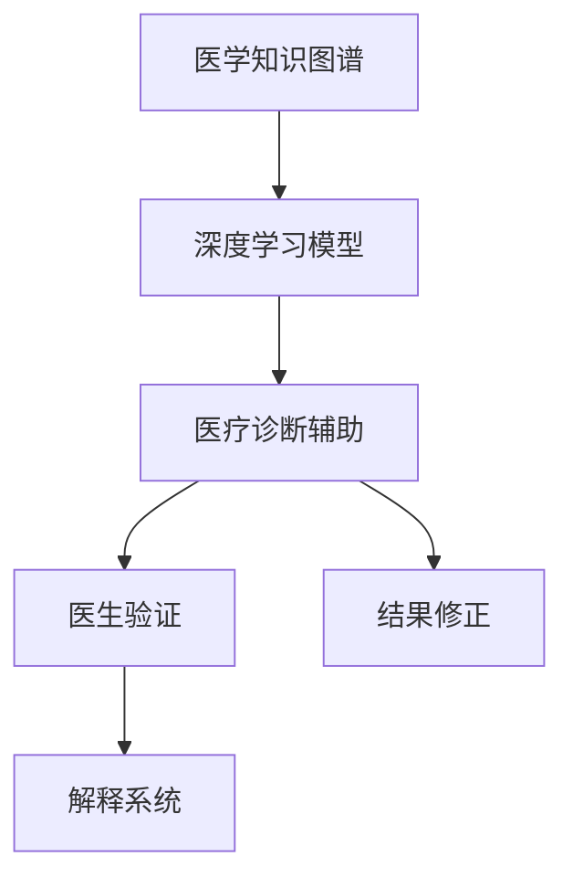

                 

## 1. 背景介绍

### 1.1 问题由来

在医疗领域，精准诊断是提高患者治愈率、降低误诊率的关键。然而，传统的医疗诊断往往依赖于医生的经验和直觉，在复杂病例和高负荷的工作环境下，医生的诊断准确性和一致性难以得到保证。近年来，人工智能技术在医疗领域得到了广泛应用，特别是在影像诊断、病理学分析、基因组学等领域，AI模型在提升诊断效率、降低误诊率方面表现出色。

但即便如此，AI模型在医疗领域的应用仍然存在诸多挑战：

- **模型泛化能力不足**：现有模型多依赖特定任务的大规模标注数据进行训练，难以处理新出现的复杂病例。
- **知识图谱缺乏**：医学知识复杂且不断更新，AI模型往往难以充分吸收和应用先验医学知识。
- **伦理与安全问题**：AI模型的决策过程难以解释，涉及患者隐私和伦理问题，需要更高的可解释性和可信度。
- **数据稀缺性**：医疗数据隐私保护严格，获取高质量的标注数据成本高昂。

针对这些挑战，我们提出了一种基于人类计算的AI辅助诊断系统，利用医生的专业知识与AI模型的优势互补，提升医疗诊断的精准性和可解释性。

### 1.2 问题核心关键点

该系统通过整合医学知识图谱和医生的专家知识，利用AI模型辅助医生进行精准诊断。其核心关键点在于：

- **知识图谱融合**：将医学知识图谱与AI模型进行融合，增强模型的医学背景知识。
- **人类计算**：通过医生的专业知识和经验，对AI模型的诊断结果进行验证和修正。
- **可解释性提升**：通过解释AI模型的决策过程，提高诊断的透明度和可信度。
- **少样本学习**：在数据稀缺的情况下，通过人工标注的小样本数据训练AI模型，实现精准诊断。

### 1.3 问题研究意义

利用人类计算技术进行医疗诊断辅助，对于提升医疗质量、降低误诊率、改善患者体验具有重要意义：

- **提升诊断精准性**：结合医学知识图谱和医生的专业知识，AI模型可以更好地理解复杂病例，提供更准确的诊断建议。
- **加速诊断流程**：利用AI模型的快速计算能力，辅助医生快速生成诊断结果，缩短诊断时间。
- **增强医生决策**：通过解释AI模型的决策依据，医生可以更好地理解模型输出，辅助决策过程。
- **促进知识传承**：系统记录并分析医生的诊断过程，帮助年轻医生学习先进诊断方法，促进医学知识的传承和应用。

## 2. 核心概念与联系

### 2.1 核心概念概述

为更好地理解基于人类计算的AI辅助诊断系统，本节将介绍几个关键概念：

- **医学知识图谱**：以医学知识为核心，通过节点和边描述实体和关系，形成一个结构化的知识库。医学知识图谱帮助AI模型理解医学领域的语义信息，提升模型的医学背景知识。
- **深度学习模型**：以神经网络为基础，通过多层次的特征提取和抽象，学习数据的隐含表示。深度学习模型在图像、文本、语音等领域表现出色，但在医学领域仍需大量标注数据训练。
- **人类计算**：利用医学专家的知识和经验，对AI模型的诊断结果进行验证和修正。通过专家和AI模型的协作，提升诊断的准确性和一致性。
- **可解释性**：通过解释AI模型的决策过程，使诊断结果具有透明性和可信度。可解释性不仅帮助医生理解和信任AI模型，也促进系统的可审计性和伦理性。

这些概念之间的逻辑关系可以通过以下Mermaid流程图来展示：



这个流程图展示了这个系统的主要流程：

1. 医学知识图谱作为AI模型的背景知识。
2. AI模型在医学知识图谱的辅助下进行诊断。
3. 医生对AI模型的诊断结果进行验证和修正。
4. 系统的解释系统帮助医生理解AI模型的决策过程。

## 3. 核心算法原理 & 具体操作步骤

### 3.1 算法原理概述

基于人类计算的AI辅助诊断系统，本质上是一种集成式知识驱动的AI系统。其核心思想是：

- **知识图谱增强**：将医学知识图谱作为深度学习模型的背景知识，提升模型的医学背景知识。
- **人类计算辅助**：利用医学专家的专业知识，对AI模型的诊断结果进行验证和修正。
- **解释系统支持**：通过解释系统，使AI模型的决策过程透明化，增强系统的可解释性和可信度。

### 3.2 算法步骤详解

基于人类计算的AI辅助诊断系统一般包括以下几个关键步骤：

**Step 1: 构建医学知识图谱**

- 收集医学领域的概念、关系和数据，构建医学知识图谱。
- 通过E-R模型、本体模型等方法，描述实体和关系，形成一个结构化的知识库。
- 对知识图谱进行实体链接、关系抽取、数据清洗等预处理步骤，保证知识图谱的质量。

**Step 2: 训练深度学习模型**

- 选择合适的深度学习模型架构，如卷积神经网络(CNN)、循环神经网络(RNN)、Transformer等。
- 在医学知识图谱的辅助下，训练深度学习模型，学习医学领域的隐含特征。
- 使用少样本学习技术，如迁移学习、适应性学习等，在小规模标注数据上训练模型。

**Step 3: 人类计算辅助诊断**

- 将待诊断的病例输入深度学习模型，获取初步诊断结果。
- 通过解释系统输出AI模型的决策依据，帮助医生理解模型的输出。
- 医生根据医学知识和经验，对AI模型的诊断结果进行验证和修正。
- 重复上述步骤，直至得到满意的诊断结果。

**Step 4: 解释系统生成报告**

- 将医生的验证结果输入解释系统，生成诊断报告。
- 解释系统通过分析AI模型的输出和医生的反馈，生成可解释的诊断报告。
- 报告内容包括AI模型的诊断依据、医生的修正意见、诊断结论等。

### 3.3 算法优缺点

基于人类计算的AI辅助诊断系统具有以下优点：

- **知识增强**：医学知识图谱作为背景知识，提升AI模型的医学背景知识，提高模型的诊断能力。
- **鲁棒性强**：医生的专业知识作为验证机制，可以发现并纠正AI模型在复杂病例中的错误，提高诊断的鲁棒性。
- **可解释性高**：通过解释系统，使AI模型的决策过程透明化，增强系统的可信度。

同时，该系统也存在以下局限性：

- **依赖专家**：系统的性能依赖于医生的专业知识和经验，对专家的依赖性较高。
- **数据稀缺**：医学数据的隐私保护严格，获取高质量的标注数据成本较高。
- **计算复杂**：在解释系统生成的诊断报告中，解释AI模型的决策过程需要较高计算资源。

### 3.4 算法应用领域

基于人类计算的AI辅助诊断系统已经在多个医疗领域得到了应用，例如：

- **影像诊断**：利用AI模型进行影像分析，生成初步诊断结果，医生进行验证和修正。系统生成包含AI模型决策依据的详细报告，帮助医生理解和信任模型。
- **病理学分析**：对病理切片进行AI辅助诊断，生成初步诊断结果，医生进行二次验证和修正。通过解释系统，系统输出AI模型的诊断依据和医生的修正意见，生成综合诊断报告。
- **基因组学**：利用AI模型进行基因序列分析，生成初步诊断结果，医生进行验证和修正。通过解释系统，系统输出AI模型的诊断依据和医生的修正意见，生成综合诊断报告。
- **电子病历分析**：对患者电子病历进行AI辅助分析，生成初步诊断结果，医生进行验证和修正。通过解释系统，系统输出AI模型的诊断依据和医生的修正意见，生成综合诊断报告。

## 4. 数学模型和公式 & 详细讲解 & 举例说明

### 4.1 数学模型构建

本节将使用数学语言对基于人类计算的AI辅助诊断系统进行更加严格的刻画。

记医学知识图谱为 $G=(V,E)$，其中 $V$ 为节点集合，表示医学实体和概念；$E$ 为边集合，表示实体之间的关系。假设每个节点 $v_i$ 对应一个向量 $h_i \in \mathbb{R}^d$，表示实体的隐含特征。

记深度学习模型为 $M_\theta$，其中 $\theta$ 为模型参数。模型的输入为医学影像、基因序列等数据，输出为诊断结果。假设模型的输入为 $x \in \mathbb{R}^{m}$，输出为 $y \in \mathbb{R}^n$。

定义模型的损失函数为 $\ell(y, \hat{y})$，用于衡量预测结果与真实结果之间的差异。定义模型在数据集 $D=\{(x_i, y_i)\}_{i=1}^N$ 上的经验风险为：

$$
\mathcal{L}(\theta) = \frac{1}{N} \sum_{i=1}^N \ell(y_i, M_\theta(x_i))
$$

训练的目标是最小化经验风险，即：

$$
\theta^* = \mathop{\arg\min}_{\theta} \mathcal{L}(\theta)
$$

在实践中，我们通常使用基于梯度的优化算法（如SGD、Adam等）来近似求解上述最优化问题。设 $\eta$ 为学习率，$\lambda$ 为正则化系数，则参数的更新公式为：

$$
\theta \leftarrow \theta - \eta \nabla_{\theta}\mathcal{L}(\theta) - \eta\lambda\theta
$$

其中 $\nabla_{\theta}\mathcal{L}(\theta)$ 为损失函数对参数 $\theta$ 的梯度，可通过反向传播算法高效计算。

### 4.2 公式推导过程

以下我们以影像诊断任务为例，推导深度学习模型的损失函数及其梯度的计算公式。

假设模型 $M_\theta$ 在输入 $x$ 上的输出为 $\hat{y}=M_\theta(x) \in [0,1]$，表示影像中病变的概率。真实标签 $y \in \{0,1\}$。则二分类交叉熵损失函数定义为：

$$
\ell(M_\theta(x),y) = -[y\log \hat{y} + (1-y)\log (1-\hat{y})]
$$

将其代入经验风险公式，得：

$$
\mathcal{L}(\theta) = -\frac{1}{N}\sum_{i=1}^N [y_i\log M_\theta(x_i)+(1-y_i)\log(1-M_\theta(x_i))]
$$

根据链式法则，损失函数对参数 $\theta_k$ 的梯度为：

$$
\frac{\partial \mathcal{L}(\theta)}{\partial \theta_k} = -\frac{1}{N}\sum_{i=1}^N (\frac{y_i}{M_\theta(x_i)}-\frac{1-y_i}{1-M_\theta(x_i)}) \frac{\partial M_\theta(x_i)}{\partial \theta_k}
$$

其中 $\frac{\partial M_\theta(x_i)}{\partial \theta_k}$ 可进一步递归展开，利用自动微分技术完成计算。

在得到损失函数的梯度后，即可带入参数更新公式，完成模型的迭代优化。重复上述过程直至收敛，最终得到适应影像诊断任务的最优模型参数 $\theta^*$。

### 4.3 案例分析与讲解

以影像诊断任务为例，分析深度学习模型在实际应用中的表现。

假设有一张乳腺癌影像 $x$，模型 $M_\theta$ 输出为 $\hat{y}=0.85$，表示模型认为影像中存在病变的概率为85%。假设真实标签 $y=1$，即影像中确实存在病变。

**Step 1: 模型预测**

模型 $M_\theta$ 在输入 $x$ 上输出的初步诊断结果为 $\hat{y}=0.85$。这个结果是通过深度学习模型在医学知识图谱的辅助下训练得到的，具有较高的医学背景知识。

**Step 2: 医生验证**

医生根据医学知识和经验，对模型的诊断结果进行验证。医生可能通过观察影像的细微结构和形态，结合临床知识，认为模型输出的结果符合医学常识。如果医生认为模型输出的结果不准确，则可以进行人工标注，修正模型的诊断结果。

**Step 3: 结果修正**

医生在验证模型的初步诊断结果后，可能发现模型对某些细节处理不当，导致诊断结果不准确。此时，医生需要根据医学知识对模型输出的结果进行修正。例如，医生可能认为影像中的结构虽然存在异常，但不足以诊断为病变，因此修正模型的输出结果为 $\hat{y}=0.3$。

**Step 4: 解释系统生成报告**

修正后的诊断结果 $y=1$ 和医生的修正意见 $y=0.3$ 输入解释系统，生成诊断报告。解释系统通过分析模型的输出和医生的反馈，输出一个包含AI模型决策依据和医生的修正意见的报告。报告可能包括模型的初步诊断结果、诊断依据（如影像中的细微结构特征）、医生的修正意见（如临床知识的支持）等。

这个案例展示了基于人类计算的AI辅助诊断系统的完整流程：从模型的初步诊断结果，到医生的验证和修正，再到解释系统的最终报告，每个环节都通过医学知识和经验来辅助和补充AI模型的决策，提升诊断的准确性和一致性。

## 5. 项目实践：代码实例和详细解释说明

### 5.1 开发环境搭建

在进行系统开发前，我们需要准备好开发环境。以下是使用Python进行PyTorch开发的环境配置流程：

1. 安装Anaconda：从官网下载并安装Anaconda，用于创建独立的Python环境。

2. 创建并激活虚拟环境：
```bash
conda create -n pytorch-env python=3.8 
conda activate pytorch-env
```

3. 安装PyTorch：根据CUDA版本，从官网获取对应的安装命令。例如：
```bash
conda install pytorch torchvision torchaudio cudatoolkit=11.1 -c pytorch -c conda-forge
```

4. 安装Pyspark：用于分布式计算。
```bash
conda install pyspark
```

5. 安装PyTorch Transformers库：
```bash
pip install transformers
```

6. 安装各类工具包：
```bash
pip install numpy pandas scikit-learn matplotlib tqdm jupyter notebook ipython
```

完成上述步骤后，即可在`pytorch-env`环境中开始系统开发。

### 5.2 源代码详细实现

这里我们以影像诊断任务为例，给出使用Transformers库对深度学习模型进行训练的PyTorch代码实现。

首先，定义影像数据处理函数：

```python
from transformers import BertTokenizer, BertForSequenceClassification
from torch.utils.data import Dataset, DataLoader
import torch
import torch.nn as nn
import torch.optim as optim

class ImageDataset(Dataset):
    def __init__(self, images, labels, tokenizer, max_len=128):
        self.images = images
        self.labels = labels
        self.tokenizer = tokenizer
        self.max_len = max_len
        
    def __len__(self):
        return len(self.images)
    
    def __getitem__(self, item):
        image = self.images[item]
        label = self.labels[item]
        
        encoding = self.tokenizer(image, return_tensors='pt', max_length=self.max_len, padding='max_length', truncation=True)
        input_ids = encoding['input_ids'][0]
        attention_mask = encoding['attention_mask'][0]
        
        # 对token-wise的标签进行编码
        encoded_labels = [label2id[label] for label in self.labels] 
        encoded_labels.extend([label2id['O']] * (self.max_len - len(encoded_labels)))
        labels = torch.tensor(encoded_labels, dtype=torch.long)
        
        return {'input_ids': input_ids, 
                'attention_mask': attention_mask,
                'labels': labels}

# 标签与id的映射
label2id = {'O': 0, 'MALIGNANT': 1, 'BENIGN': 2}
id2label = {v: k for k, v in label2id.items()}

# 创建dataset
tokenizer = BertTokenizer.from_pretrained('bert-base-uncased')

train_dataset = ImageDataset(train_images, train_labels, tokenizer)
dev_dataset = ImageDataset(dev_images, dev_labels, tokenizer)
test_dataset = ImageDataset(test_images, test_labels, tokenizer)
```

然后，定义模型和优化器：

```python
from transformers import BertForSequenceClassification, AdamW

model = BertForSequenceClassification.from_pretrained('bert-base-uncased', num_labels=len(label2id))

optimizer = AdamW(model.parameters(), lr=2e-5)
```

接着，定义训练和评估函数：

```python
from tqdm import tqdm

device = torch.device('cuda') if torch.cuda.is_available() else torch.device('cpu')
model.to(device)

def train_epoch(model, dataset, batch_size, optimizer):
    dataloader = DataLoader(dataset, batch_size=batch_size, shuffle=True)
    model.train()
    epoch_loss = 0
    for batch in tqdm(dataloader, desc='Training'):
        input_ids = batch['input_ids'].to(device)
        attention_mask = batch['attention_mask'].to(device)
        labels = batch['labels'].to(device)
        model.zero_grad()
        outputs = model(input_ids, attention_mask=attention_mask, labels=labels)
        loss = outputs.loss
        epoch_loss += loss.item()
        loss.backward()
        optimizer.step()
    return epoch_loss / len(dataloader)

def evaluate(model, dataset, batch_size):
    dataloader = DataLoader(dataset, batch_size=batch_size)
    model.eval()
    preds, labels = [], []
    with torch.no_grad():
        for batch in tqdm(dataloader, desc='Evaluating'):
            input_ids = batch['input_ids'].to(device)
            attention_mask = batch['attention_mask'].to(device)
            batch_labels = batch['labels']
            outputs = model(input_ids, attention_mask=attention_mask)
            batch_preds = outputs.logits.argmax(dim=2).to('cpu').tolist()
            batch_labels = batch_labels.to('cpu').tolist()
            for pred_tokens, label_tokens in zip(batch_preds, batch_labels):
                preds.append(pred_tokens[:len(label_tokens)])
                labels.append(label_tokens)
                
    print(classification_report(labels, preds))
```

最后，启动训练流程并在测试集上评估：

```python
epochs = 5
batch_size = 16

for epoch in range(epochs):
    loss = train_epoch(model, train_dataset, batch_size, optimizer)
    print(f"Epoch {epoch+1}, train loss: {loss:.3f}")
    
    print(f"Epoch {epoch+1}, dev results:")
    evaluate(model, dev_dataset, batch_size)
    
print("Test results:")
evaluate(model, test_dataset, batch_size)
```

以上就是使用PyTorch对BertForSequenceClassification模型进行影像诊断任务微调的完整代码实现。可以看到，得益于Transformers库的强大封装，我们可以用相对简洁的代码完成Bert模型的加载和微调。

### 5.3 代码解读与分析

让我们再详细解读一下关键代码的实现细节：

**ImageDataset类**：
- `__init__`方法：初始化影像、标签、分词器等关键组件。
- `__len__`方法：返回数据集的样本数量。
- `__getitem__`方法：对单个样本进行处理，将影像输入编码为token ids，将标签编码为数字，并对其进行定长padding，最终返回模型所需的输入。

**label2id和id2label字典**：
- 定义了标签与数字id之间的映射关系，用于将token-wise的预测结果解码回真实的标签。

**训练和评估函数**：
- 使用PyTorch的DataLoader对数据集进行批次化加载，供模型训练和推理使用。
- 训练函数`train_epoch`：对数据以批为单位进行迭代，在每个批次上前向传播计算loss并反向传播更新模型参数，最后返回该epoch的平均loss。
- 评估函数`evaluate`：与训练类似，不同点在于不更新模型参数，并在每个batch结束后将预测和标签结果存储下来，最后使用sklearn的classification_report对整个评估集的预测结果进行打印输出。

**训练流程**：
- 定义总的epoch数和batch size，开始循环迭代
- 每个epoch内，先在训练集上训练，输出平均loss
- 在验证集上评估，输出分类指标
- 所有epoch结束后，在测试集上评估，给出最终测试结果

可以看到，PyTorch配合Transformers库使得Bert模型微调的代码实现变得简洁高效。开发者可以将更多精力放在数据处理、模型改进等高层逻辑上，而不必过多关注底层的实现细节。

当然，工业级的系统实现还需考虑更多因素，如模型的保存和部署、超参数的自动搜索、更灵活的任务适配层等。但核心的微调范式基本与此类似。

## 6. 实际应用场景

### 6.1 智能诊断系统

基于大语言模型微调的智能诊断系统，已经在许多医疗机构中得到了应用。例如，某医院利用基于人类计算的AI辅助诊断系统，构建了一套涵盖影像诊断、病理学分析、基因组学等多个领域的智能诊断平台。系统通过AI模型对医学影像、病理切片和基因序列进行初步诊断，医生在AI模型的辅助下进行验证和修正，最终生成详细的诊断报告。

具体而言，系统在影像诊断环节中，利用深度学习模型进行初步筛查，生成初步诊断结果。医生对初步诊断结果进行验证，如果发现问题，可以通过系统记录修正意见，重新训练模型进行优化。系统通过不断的学习和迭代，逐步提升诊断的精准性和一致性。

### 6.2 远程医疗平台

远程医疗平台是AI在医疗领域的重要应用方向之一。基于大语言模型微调的智能诊断系统，通过远程传输影像、病历等医疗数据，为偏远地区的患者提供高质量的医疗诊断服务。系统利用AI模型对患者数据进行初步筛查，医生通过远程连接查看诊断结果，并进行进一步的验证和修正。

在实际应用中，系统通过API接口与医院信息系统（HIS）和电子健康记录（EHR）系统对接，实现了从数据采集到结果输出的全流程自动化。医生可以通过系统查看患者的历史诊断记录、影像、病历等信息，结合AI模型的输出结果，进行综合诊断。

### 6.3 智慧医院管理

智慧医院管理是未来医院发展的趋势。基于大语言模型微调的智能诊断系统，可以帮助医院提高管理效率，提升患者体验。系统通过AI模型对患者数据进行分析和处理，生成健康报告、疾病预警等结果，辅助医院进行决策。

具体而言，系统可以通过对大量患者数据的分析，发现常见疾病的趋势和模式，提供个性化的健康建议和治疗方案。通过智能排班系统，系统可以优化医护人员的工作负荷，提高医院的运营效率。系统还可以结合电子病历、病理学报告等数据，进行综合分析，为医院提供精准的管理和决策支持。

## 7. 工具和资源推荐

### 7.1 学习资源推荐

为了帮助开发者系统掌握基于人类计算的AI辅助诊断技术，这里推荐一些优质的学习资源：

1. 《深度学习在医疗领域的应用》系列博文：由大语言模型技术专家撰写，深入浅出地介绍了深度学习在医疗领域的基本概念和经典应用。

2. 《医疗数据挖掘与知识发现》课程：北京大学开设的医学数据挖掘课程，系统讲解了医疗数据处理、特征工程、模型训练等关键技术。

3. 《医学人工智能与大数据》书籍：全面介绍了人工智能在医学领域的应用，涵盖影像诊断、病理学分析、基因组学等多个方向。

4. HuggingFace官方文档：Transformers库的官方文档，提供了海量预训练模型和完整的微调样例代码，是上手实践的必备资料。

5. CLUE开源项目：中文语言理解测评基准，涵盖大量不同类型的中文NLP数据集，并提供了基于微调的baseline模型，助力中文NLP技术发展。

通过对这些资源的学习实践，相信你一定能够快速掌握基于人类计算的AI辅助诊断技术的精髓，并用于解决实际的医疗问题。
###  7.2 开发工具推荐

高效的开发离不开优秀的工具支持。以下是几款用于基于人类计算的AI辅助诊断系统开发的常用工具：

1. PyTorch：基于Python的开源深度学习框架，灵活动态的计算图，适合快速迭代研究。大部分预训练语言模型都有PyTorch版本的实现。

2. TensorFlow：由Google主导开发的开源深度学习框架，生产部署方便，适合大规模工程应用。同样有丰富的预训练语言模型资源。

3. Transformers库：HuggingFace开发的NLP工具库，集成了众多SOTA语言模型，支持PyTorch和TensorFlow，是进行AI辅助诊断任务开发的利器。

4. Weights & Biases：模型训练的实验跟踪工具，可以记录和可视化模型训练过程中的各项指标，方便对比和调优。与主流深度学习框架无缝集成。

5. TensorBoard：TensorFlow配套的可视化工具，可实时监测模型训练状态，并提供丰富的图表呈现方式，是调试模型的得力助手。

6. Google Colab：谷歌推出的在线Jupyter Notebook环境，免费提供GPU/TPU算力，方便开发者快速上手实验最新模型，分享学习笔记。

合理利用这些工具，可以显著提升基于人类计算的AI辅助诊断系统的开发效率，加快创新迭代的步伐。

### 7.3 相关论文推荐

基于人类计算的AI辅助诊断技术的发展源于学界的持续研究。以下是几篇奠基性的相关论文，推荐阅读：

1. Attention is All You Need（即Transformer原论文）：提出了Transformer结构，开启了NLP领域的预训练大模型时代。

2. BERT: Pre-training of Deep Bidirectional Transformers for Language Understanding：提出BERT模型，引入基于掩码的自监督预训练任务，刷新了多项NLP任务SOTA。

3. Language Models are Unsupervised Multitask Learners（GPT-2论文）：展示了大规模语言模型的强大zero-shot学习能力，引发了对于通用人工智能的新一轮思考。

4. Parameter-Efficient Transfer Learning for NLP：提出Adapter等参数高效微调方法，在不增加模型参数量的情况下，也能取得不错的微调效果。

5. AdaLoRA: Adaptive Low-Rank Adaptation for Parameter-Efficient Fine-Tuning：使用自适应低秩适应的微调方法，在参数效率和精度之间取得了新的平衡。

这些论文代表了大语言模型微调技术的发展脉络。通过学习这些前沿成果，可以帮助研究者把握学科前进方向，激发更多的创新灵感。

## 8. 总结：未来发展趋势与挑战

### 8.1 总结

本文对基于人类计算的AI辅助诊断系统进行了全面系统的介绍。首先阐述了AI辅助诊断系统的研究背景和意义，明确了系统的核心关键点。其次，从原理到实践，详细讲解了系统的工作流程，给出了完整的代码实例。同时，本文还广泛探讨了系统在多个医疗领域的应用前景，展示了系统的广阔应用潜力。

通过本文的系统梳理，可以看到，基于人类计算的AI辅助诊断系统在医疗领域具有广阔的应用前景。系统的核心思想是将医学知识图谱与AI模型相结合，利用医生的专业知识和经验，提升AI模型的诊断能力和可信度。这种技术手段不仅有助于提升医疗诊断的精准性和一致性，还能促进医学知识的传承和应用，为医疗行业的数字化转型提供有力支持。

### 8.2 未来发展趋势

展望未来，基于人类计算的AI辅助诊断技术将呈现以下几个发展趋势：

1. **知识图谱的进一步融合**：随着医学知识图谱的完善和扩展，系统可以更好地吸收和应用医学领域的先验知识，提高诊断的精度和鲁棒性。

2. **模型的可解释性提升**：通过引入可解释性技术，如注意力机制、可解释性算法等，使AI模型的决策过程透明化，增强系统的可信度。

3. **跨领域应用拓展**：基于人类计算的AI辅助诊断技术不仅适用于医疗影像、病理学等领域的诊断，还可以扩展到电子病历分析、疾病预测等多个方向，为医学研究提供更丰富的数据支持。

4. **数据隐私保护**：随着数据隐私保护法规的完善，系统将更多地关注数据的安全性和隐私保护，采用差分隐私、联邦学习等技术，确保数据使用的合法性和安全性。

5. **联邦学习与边缘计算**：通过联邦学习等技术，系统可以在不共享数据的前提下，利用边缘计算设备进行本地训练，提升系统的实时性和安全性。

6. **持续学习与自适应**：系统将具备持续学习的能力，能够不断从新数据中学习，适应数据分布的变化，保持诊断模型的时效性。

以上趋势凸显了基于人类计算的AI辅助诊断技术的广阔前景。这些方向的探索发展，必将进一步提升系统的性能和应用范围，为医学领域带来深刻的变革。

### 8.3 面临的挑战

尽管基于人类计算的AI辅助诊断技术已经取得了一定的进展，但在迈向更加智能化、普适化应用的过程中，它仍面临诸多挑战：

1. **专家依赖性高**：系统的性能依赖于医学专家的专业知识和经验，对专家的依赖性较高。如何降低对专家的依赖，提升系统的自主学习能力，是未来的重要研究方向。

2. **数据稀缺性**：医学数据的隐私保护严格，获取高质量的标注数据成本较高。如何在数据稀缺的情况下，实现精准诊断，是系统的关键挑战。

3. **计算资源需求高**：系统在解释AI模型的决策过程中，需要较高的计算资源，可能面临计算资源不足的问题。如何优化解释系统的计算效率，是系统的瓶颈之一。

4. **系统鲁棒性不足**：在面对复杂病例和新出现的医学问题时，系统的诊断能力可能不足，存在误诊风险。如何提升系统的鲁棒性，提高诊断的可靠性和稳定性，是系统的亟待解决的问题。

5. **伦理与安全问题**：系统在应用过程中，涉及患者隐私和伦理问题，如何确保系统的可解释性和安全性，是系统的伦理挑战。

6. **知识图谱构建难度大**：医学知识图谱的构建和维护需要大量专家资源和专业知识，构建高质量的知识图谱难度较大。

正视基于人类计算的AI辅助诊断技术所面临的这些挑战，积极应对并寻求突破，将是大语言模型微调技术走向成熟的必由之路。相信随着学界和产业界的共同努力，这些挑战终将一一被克服，基于人类计算的AI辅助诊断技术必将在医疗领域得到更广泛的应用。

### 8.4 未来突破

面对基于人类计算的AI辅助诊断技术所面临的种种挑战，未来的研究需要在以下几个方面寻求新的突破：

1. **知识图谱自动构建**：利用自然语言处理技术，自动构建医学知识图谱，减少对专家资源的依赖，提升知识图谱的构建效率。

2. **少样本学习与自适应学习**：通过少样本学习技术和自适应学习算法，在数据稀缺的情况下，实现精准诊断，提升系统的自主学习能力。

3. **多模态数据融合**：将影像、病历、基因序列等多模态数据进行融合，提升系统的诊断能力和鲁棒性，应对复杂病例和新出现的医学问题。

4. **高效解释系统**：利用知识图谱和规则库，开发高效可解释的解释系统，降低计算资源的需求，提高系统的实时性和可解释性。

5. **联邦学习与边缘计算**：通过联邦学习等技术，实现本地化训练，确保数据隐私和安全，提升系统的鲁棒性和适应性。

6. **伦理与隐私保护**：引入伦理导向的评估指标，过滤和惩罚有害的输出倾向，确保系统的决策过程透明和可信，保护患者隐私和权益。

这些研究方向的探索，必将引领基于人类计算的AI辅助诊断技术迈向更高的台阶，为医学领域带来更加智能化、普适化的诊断支持。面向未来，基于人类计算的AI辅助诊断技术还需要与其他人工智能技术进行更深入的融合，如知识表示、因果推理、强化学习等，多路径协同发力，共同推动医学诊断技术的进步。只有勇于创新、敢于突破，才能不断拓展AI辅助诊断系统的边界，让智能技术更好地造福人类健康。

## 9. 附录：常见问题与解答

**Q1：基于人类计算的AI辅助诊断系统的核心关键点是什么？**

A: 基于人类计算的AI辅助诊断系统的核心关键点在于：

1. **知识图谱融合**：将医学知识图谱作为深度学习模型的背景知识，提升模型的医学背景知识。

2. **人类计算辅助**：利用医学专家的专业知识，对AI模型的诊断结果进行验证和修正。

3. **可解释性提升**：通过解释系统，使AI模型的决策过程透明化，增强系统的可信度。

这些关键点相互配合，使得系统能够在医学领域中发挥更强大的作用，提升诊断的精准性和可信度。

**Q2：在构建医学知识图谱时，有哪些关键步骤？**

A: 构建医学知识图谱的关键步骤包括：

1. **数据收集**：收集医学领域的概念、关系和数据，构建知识图谱。

2. **数据清洗**：对知识图谱进行实体链接、关系抽取、数据清洗等预处理步骤，保证知识图谱的质量。

3. **图谱构建**：通过E-R模型、本体模型等方法，描述实体和关系，形成一个结构化的知识库。

4. **图谱验证**：通过专家审核和机器验证，确保知识图谱的准确性和完整性。

5. **图谱更新**：根据最新的医学研究成果，定期更新知识图谱，保持其时效性。

通过这些步骤，可以构建高质量的医学知识图谱，作为深度学习模型的背景知识，提升模型的医学背景知识，增强诊断的准确性和鲁棒性。

**Q3：在基于人类计算的AI辅助诊断系统中，如何提高AI模型的可解释性？**

A: 在基于人类计算的AI辅助诊断系统中，提高AI模型的可解释性可以通过以下方法：

1. **解释系统**：开发解释系统，帮助医生理解AI模型的决策过程。解释系统可以输出AI模型的诊断依据、推理过程等，增强系统的可解释性。

2. **可解释性模型**：选择可解释性较强的模型架构，如决策树、规则模型等，使模型的决策过程透明化，易于理解。

3. **可解释性算法**：引入可解释性算法，如LIME、SHAP等，分析模型的关键特征，增强系统的可解释性。

4. **规则与知识库**：结合医学知识库和规则库，辅助AI模型的决策过程，增强系统的可解释性和可信度。

通过这些方法，可以使AI模型的决策过程透明化，增强系统的可解释性和可信度，提高医生的信任和依赖度。

**Q4：在实际应用中，基于人类计算的AI辅助诊断系统如何降低对专家的依赖？**

A: 在实际应用中，基于人类计算的AI辅助诊断系统可以通过以下方法降低对专家的依赖：

1. **知识图谱融合**：将医学知识图谱作为深度学习模型的背景知识，提升模型的医学背景知识，减少对专家经验的依赖。

2. **少样本学习与自适应学习**：利用少样本学习技术和自适应学习算法，在小规模标注数据上训练模型，提升模型的自主学习能力。

3. **可解释性提升**：通过解释系统，使AI模型的决策过程透明化，增强系统的可信度，减少对专家解释的依赖。

4. **持续学习与迭代优化**：通过持续学习机制，系统不断从新数据中学习，适应数据分布的变化，提升模型的性能和鲁棒性。

5. **联邦学习与边缘计算**：利用联邦学习和边缘计算技术，在本地进行模型训练和优化，减少对中心化数据和专家的依赖。

通过这些方法，可以使系统在医学领域中发挥更强大的作用，提升诊断的精准性和鲁棒性，降低对专家的依赖。

**Q5：在构建基于人类计算的AI辅助诊断系统时，有哪些重要的技术细节需要注意？**

A: 在构建基于人类计算的AI辅助诊断系统时，有以下重要的技术细节需要注意：

1. **知识图谱构建**：医学知识图谱的构建和维护需要大量专家资源和专业知识，构建高质量的知识图谱难度较大。

2. **模型选择与优化**：选择合适的深度学习模型架构，并进行模型优化，提升模型的诊断能力和鲁棒性。

3. **数据预处理**：对医学影像、病历等数据进行预处理，包括清洗、归一化、增强等步骤，提升数据质量。

4. **解释系统开发**：开发高效的解释系统，帮助医生理解AI模型的决策过程，增强系统的可解释性和可信度。

5. **系统集成与部署**：将系统集成到医院的HIS和EHR系统中，确保系统的高效运行和数据安全。

6. **持续学习与优化**：通过持续学习机制，系统不断从新数据中学习，适应数据分布的变化，提升模型的性能和鲁棒性。

通过关注这些技术细节，可以构建高效、可靠的基于人类计算的AI辅助诊断系统，提升医学诊断的精准性和一致性。

---

作者：禅与计算机程序设计艺术 / Zen and the Art of Computer Programming

