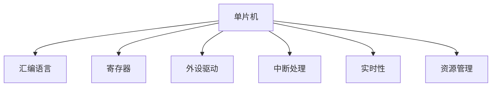

                 

# 单片机编程：嵌入式系统的基石

> 关键词：单片机,嵌入式系统,汇编语言,寄存器,外设驱动,中断处理,实时性,资源管理

## 1. 背景介绍

### 1.1 问题由来
在当今信息化时代，嵌入式系统已经深入到各个领域，如智能家居、汽车电子、工业控制等。嵌入式系统的核心部件是单片机，而单片机编程是嵌入式系统开发的基础。然而，单片机编程不同于通用编程语言，它具有其独特性，需要开发人员具备较强的硬件知识和系统理解能力。

### 1.2 问题核心关键点
单片机编程的核心在于掌握其硬件资源管理、外设驱动编写、中断处理等方面。单片机的资源管理包括内存、I/O口、定时器等，外设驱动是单片机与外设（如串口、ADC、DMA等）通信的关键，中断处理则保证了系统的实时性和响应速度。因此，掌握单片机编程技术是开发高效、可靠嵌入式系统的前提。

### 1.3 问题研究意义
单片机编程技术在嵌入式系统开发中具有不可替代的作用。通过对单片机编程的深入学习，开发人员可以高效地控制硬件资源，实现复杂的功能，提升系统的性能和可靠性。掌握单片机编程技术，有助于开发人员在短时间内完成高难度的嵌入式系统开发任务，促进嵌入式技术的发展和应用。

## 2. 核心概念与联系

### 2.1 核心概念概述

为更好地理解单片机编程，本节将介绍几个密切相关的核心概念：

- 单片机(Single-chip Microcomputer, SCM)：一种集成处理器、存储器、I/O接口等功能的微处理器，广泛应用于嵌入式系统。
- 汇编语言(Assembler)：一种低级编程语言，直接操作处理器硬件，与二进制机器码一一对应。
- 寄存器(Register)：CPU内部临时存储数据的高速存储器，用于临时存储数据和控制指令。
- 外设驱动(Peripheral Driver)：实现单片机与外设通信的驱动程序，用于控制外设硬件，实现特定的功能。
- 中断处理(Interrupt Handling)：一种使系统能够快速响应外部事件的技术，通过中断控制器触发，处理外部事件的代码。
- 实时性(Real-time)：指系统能够及时、准确地响应外部事件，是嵌入式系统的重要特性。
- 资源管理(Resource Management)：指系统对内存、I/O口、定时器等资源进行合理分配和管理，以提高系统性能和可靠性。

这些核心概念之间的逻辑关系可以通过以下Mermaid流程图来展示：



这个流程图展示了她单片机编程的核心概念及其之间的关系：

1. 单片机通过汇编语言进行操作。
2. 寄存器是单片机内部存储数据的关键部件。
3. 外设驱动实现单片机与外设通信。
4. 中断处理使系统能够快速响应外部事件。
5. 实时性是嵌入式系统的关键特性。
6. 资源管理是系统性能和可靠性的基础。

这些概念共同构成了单片机编程的基础框架，是开发人员必须掌握的基本知识。

## 3. 核心算法原理 & 具体操作步骤
### 3.1 算法原理概述

单片机编程的核心算法原理包括汇编语言指令操作、中断处理、资源管理等。下面分别介绍这些原理：

- 汇编语言指令操作：汇编语言直接操作硬件寄存器和内存，其指令操作具有高效、直接的特点。掌握汇编语言指令操作，可以精确控制单片机的行为，实现复杂的系统功能。
- 中断处理：中断处理是一种使系统能够快速响应外部事件的技术。通过中断控制器，单片机可以在收到中断请求时，立即跳转到中断服务函数进行处理。
- 资源管理：资源管理是单片机编程的重要部分，包括内存、I/O口、定时器等资源的合理分配和管理。资源管理能够提高系统的性能和可靠性。

### 3.2 算法步骤详解

单片机编程的主要步骤如下：

1. 硬件连接：连接单片机与外设硬件，确保硬件电路连接正确。
2. 编写汇编程序：使用汇编语言编写程序，实现特定的系统功能。
3. 调试程序：使用调试器进行程序调试，确保程序正确运行。
4. 优化程序：根据测试结果进行程序优化，提高程序的性能和可靠性。
5. 集成外设驱动：集成外设驱动，实现单片机与外设的通信。
6. 编写中断服务函数：编写中断服务函数，实现对外部事件的处理。
7. 优化资源管理：优化内存、I/O口、定时器等资源的分配和管理。

### 3.3 算法优缺点

单片机编程具有以下优点：

- 高效性：汇编语言指令操作具有高效、直接的特点，能够实现复杂的系统功能。
- 直接控制：汇编语言直接操作硬件寄存器和内存，能够精确控制单片机的行为。
- 低级操作：汇编语言具有低级操作的特点，能够深入了解硬件的运作机制。

同时，单片机编程也存在以下缺点：

- 编程复杂：汇编语言指令操作复杂，编程难度大。
- 容易出错：汇编语言指令操作容易出现错误，调试难度大。
- 开发效率低：汇编语言编程效率低，开发周期长。

### 3.4 算法应用领域

单片机编程在嵌入式系统开发中具有广泛的应用领域，例如：

- 智能家居：实现智能家居设备控制，如智能灯泡、智能门锁等。
- 汽车电子：实现汽车电子系统，如车辆控制、导航系统等。
- 工业控制：实现工业自动化系统，如PLC、SCADA系统等。
- 医疗设备：实现医疗设备控制，如心脏监测设备、手术机器人等。
- 消费电子：实现消费电子设备控制，如智能音箱、智能手表等。

## 4. 数学模型和公式 & 详细讲解 & 举例说明

### 4.1 数学模型构建

单片机编程的数学模型主要基于汇编语言指令操作和资源管理。下面以汇编语言指令操作为例，构建数学模型。

假设单片机具有指令集 $\Sigma$，指令集中的指令操作具有形式为 $I$。指令操作可以表示为：

$$
I: \{OP, X1, X2, ..., Xn\}
$$

其中 $OP$ 为指令操作码，$X1, X2, ..., Xn$ 为指令操作数，指令操作数可以是常量、寄存器、内存地址等。

指令操作的执行过程可以表示为：

$$
I: OP(\text{Src1}, \text{Src2}, ..., \text{Dest})
$$

其中 $Src1, Src2, ..., Srcn$ 为指令操作数源，$Dest$ 为指令操作数目标，指令操作的执行过程可以表示为：

$$
OP(\text{Src1}, \text{Src2}, ..., \text{Dest}) = \text{Result}
$$

其中 $\text{Result}$ 为指令执行结果。

### 4.2 公式推导过程

以单片机中的 MOV 指令为例，推导指令执行的数学模型：

假设指令为 MOV A, 20H，表示将寄存器 $A$ 的内容复制到地址为 20H 的内存中。指令执行过程可以表示为：

$$
MOV A, 20H: A \leftarrow 20H
$$

其中 $A$ 为寄存器 $A$，$20H$ 为地址 20H 的内存单元。指令执行结果为将寄存器 $A$ 的内容复制到地址为 20H 的内存中。

### 4.3 案例分析与讲解

以下以单片机中常见的加法指令 ADD 为例，进行案例分析。

假设指令为 ADD A, B，表示将寄存器 $A$ 和寄存器 $B$ 的内容相加，并将结果存储在寄存器 $A$ 中。指令执行过程可以表示为：

$$
ADD A, B: A \leftarrow A + B
$$

其中 $A$ 和 $B$ 为寄存器 $A$ 和 $B$，指令执行结果为将寄存器 $A$ 的内容设置为 $A$ 和 $B$ 的和。

## 5. 项目实践：代码实例和详细解释说明
### 5.1 开发环境搭建

在进行单片机编程实践前，我们需要准备好开发环境。以下是使用Keil μVision软件进行单片机编程的环境配置流程：

1. 安装Keil μVision软件：从官网下载并安装Keil μVision软件。
2. 安装单片机开发包：从单片机厂家下载并安装单片机开发包。
3. 连接单片机和调试器：将单片机与调试器连接，确保连接正确。

完成上述步骤后，即可在 Keil μVision 软件中进行单片机编程。

### 5.2 源代码详细实现

下面以单片机中常见的计数器为例，给出使用汇编语言编写的程序实现。

假设单片机为 STC89C51，计数器为 Timer0，计数器初始值为 0，每 1ms 减 1。程序代码如下：

```assembly
ORG 0000h 
MAIN:
    MOV R0, #0 ; 设置计数器初值为 0
    MOV TL0, #0 ; 设置定时器初值为 0
    MOV TH0, #0 ; 设置定时器初值为 0
    SETB TR0 ; 开启定时器 0
    LOOP:
        MOV A, R0 ; 读取计数器值
        CPL A ; 取反计数器值
        MOV R0, A ; 将取反后的计数器值重新赋给计数器
        MOV TL0, A ; 更新定时器初值为计数器值
        MOV TH0, A ; 更新定时器初值为计数器值
        LOOP
```

该程序实现了计数器从 0 开始，每 1ms 减 1，并在计数器减为 0 时重新开始计数。

### 5.3 代码解读与分析

让我们再详细解读一下关键代码的实现细节：

**ORG 0000h**：设置程序存储器起始地址为 0x0000h。

**MOV R0, #0**：将常量 0 赋值给寄存器 R0，作为计数器初值。

**MOV TL0, #0**：将常量 0 赋值给定时器初值寄存器 TL0。

**MOV TH0, #0**：将常量 0 赋值给定时器初值寄存器 TH0。

**SETB TR0**：设置定时器 0 的运行控制位，开启定时器 0。

**LOOP**：定义一个标签，用于跳转。

**MOV A, R0**：读取寄存器 R0 的值，存储在累加器 A 中。

**CPL A**：对累加器 A 中的值进行取反操作。

**MOV R0, A**：将取反后的值重新赋给寄存器 R0。

**MOV TL0, A**：将累加器 A 中的值更新为定时器初值寄存器 TL0。

**MOV TH0, A**：将累加器 A 中的值更新为定时器初值寄存器 TH0。

**LOOP**：通过标签跳转，实现循环计数。

**MOV A, R0**：读取寄存器 R0 的值，存储在累加器 A 中。

**CPL A**：对累加器 A 中的值进行取反操作。

**MOV R0, A**：将取反后的值重新赋给寄存器 R0。

**MOV TL0, A**：将累加器 A 中的值更新为定时器初值寄存器 TL0。

**MOV TH0, A**：将累加器 A 中的值更新为定时器初值寄存器 TH0。

**LOOP**：通过标签跳转，实现循环计数。

**MOV A, R0**：读取寄存器 R0 的值，存储在累加器 A 中。

**CPL A**：对累加器 A 中的值进行取反操作。

**MOV R0, A**：将取反后的值重新赋给寄存器 R0。

**MOV TL0, A**：将累加器 A 中的值更新为定时器初值寄存器 TL0。

**MOV TH0, A**：将累加器 A 中的值更新为定时器初值寄存器 TH0。

**LOOP**：通过标签跳转，实现循环计数。

可以看到，使用汇编语言编写单片机程序需要精确控制硬件资源，实现复杂的系统功能。虽然代码量较少，但编写和调试难度较大，需要开发人员具备较强的硬件知识和系统理解能力。

### 5.4 运行结果展示

运行上述程序，可以通过串口调试器观察到计数器每 1ms 减 1 的输出结果。

## 6. 实际应用场景
### 6.1 智能家居系统

单片机编程技术在智能家居系统中得到了广泛应用。例如，通过单片机控制智能灯泡的亮度和颜色，可以实现智能照明系统。通过单片机连接温度传感器、湿度传感器等，可以实现智能家居环境监测系统。

### 6.2 汽车电子系统

单片机编程技术在汽车电子系统中也有重要应用。例如，通过单片机控制汽车发动机、变速箱等，可以实现自动驾驶系统。通过单片机连接车辆传感器，可以实现车辆状态监测系统。

### 6.3 工业控制系统

单片机编程技术在工业控制系统中也具有重要作用。例如，通过单片机控制工业机器人的动作，可以实现自动化生产线系统。通过单片机连接传感器，可以实现工业设备监测系统。

### 6.4 医疗设备系统

单片机编程技术在医疗设备系统中也有重要应用。例如，通过单片机控制心脏监测设备，可以实现心电图采集系统。通过单片机连接医疗传感器，可以实现患者健康监测系统。

## 7. 工具和资源推荐
### 7.1 学习资源推荐

为了帮助开发者系统掌握单片机编程技术，这里推荐一些优质的学习资源：

1. 《汇编语言编程》书籍：深入讲解汇编语言指令操作、寄存器使用等核心概念，是单片机编程学习的必备书籍。

2. 《Keil μVision 开发指南》书籍：详细介绍了Keil μVision软件的使用方法和开发技巧，是单片机编程开发的必备手册。

3. 《嵌入式系统设计》课程：介绍嵌入式系统硬件和软件设计的核心技术，涵盖单片机编程、操作系统、驱动程序等内容。

4. 《Keil μVision 在线教程》：提供Keil μVision软件的在线教程，适合初学者快速入门。

5. 《嵌入式系统开发实战》课程：通过实战项目，讲解单片机编程、驱动程序、资源管理等技术，帮助开发人员快速上手。

通过对这些资源的学习实践，相信你一定能够快速掌握单片机编程技术，并用于解决实际的嵌入式系统问题。

### 7.2 开发工具推荐

高效的开发离不开优秀的工具支持。以下是几款用于单片机编程开发的常用工具：

1. Keil μVision：Keil μVision是单片机编程开发的主流软件，提供强大的调试和优化功能。

2. IAR Embedded Workbench：IAR Embedded Workbench是单片机编程开发的另一种主流软件，提供易于使用的用户界面和丰富的开发功能。

3. CCS：CCS是TI公司的单片机编程开发软件，提供强大的调试和优化功能。

4. Microchip MPLAB IDE：MPLAB IDE是Microchip公司的单片机编程开发软件，提供易于使用的用户界面和丰富的开发功能。

5. STC-8/9 IDE：STC-8/9 IDE是STC公司的单片机编程开发软件，提供易于使用的用户界面和丰富的开发功能。

合理利用这些工具，可以显著提升单片机编程开发的效率，加快创新迭代的步伐。

### 7.3 相关论文推荐

单片机编程技术在嵌入式系统开发中具有重要的地位。以下是几篇奠基性的相关论文，推荐阅读：

1. "A Survey of Microcontroller Application Development"：一篇综述性论文，介绍单片机编程开发的基础知识和常用技术。

2. "Real-Time Microcontroller Programming with Assembler"：介绍单片机编程与汇编语言的关系，以及汇编语言在实时系统中的应用。

3. "Design and Implementation of Real-Time Microcontroller System"：介绍实时单片机系统的设计与实现，涵盖单片机编程、资源管理等核心技术。

4. "Embedded System Design using Microcontroller"：介绍嵌入式系统设计的基础知识和常用技术，涵盖单片机编程、驱动程序等核心技术。

5. "The Development of High-Performance Microcontroller Applications"：介绍高性能单片机应用程序的开发，涵盖单片机编程、中断处理、资源管理等核心技术。

这些论文代表了她单片机编程开发的研究脉络。通过学习这些前沿成果，可以帮助研究者把握学科前进方向，激发更多的创新灵感。

## 8. 总结：未来发展趋势与挑战
### 8.1 总结

本文对单片机编程技术进行了全面系统的介绍。首先阐述了单片机编程的背景和意义，明确了单片机编程在嵌入式系统开发中的核心地位。其次，从原理到实践，详细讲解了单片机编程的算法原理和操作步骤，给出了单片机编程任务开发的完整代码实例。同时，本文还广泛探讨了单片机编程技术在智能家居、汽车电子、工业控制等领域的应用前景，展示了单片机编程技术的广泛应用。

通过本文的系统梳理，可以看到，单片机编程技术在嵌入式系统开发中具有不可替代的作用。掌握单片机编程技术，能够高效地控制硬件资源，实现复杂的系统功能，提升系统的性能和可靠性。掌握单片机编程技术，有助于开发人员在短时间内完成高难度的嵌入式系统开发任务，促进嵌入式技术的发展和应用。

### 8.2 未来发展趋势

展望未来，单片机编程技术将呈现以下几个发展趋势：

1. 高效性：随着技术的发展，单片机编程工具和算法将越来越高效，开发人员能够快速编写复杂系统，提高开发效率。

2. 智能化：未来的单片机编程将融合人工智能技术，实现自动化的资源管理和优化，提高系统的性能和可靠性。

3. 自动化：未来的单片机编程将融合自动化测试技术，实现自动化的系统调试和优化，降低开发难度。

4. 集成化：未来的单片机编程将与其他嵌入式系统技术融合，实现更加复杂、高效的嵌入式系统开发。

5. 可视化：未来的单片机编程将融合可视化技术，提供更加直观、易用的开发环境，降低开发难度。

以上趋势凸显了单片机编程技术的前景，这些方向的探索发展，必将进一步提升单片机编程技术的开发效率和应用范围。

### 8.3 面临的挑战

尽管单片机编程技术已经取得了显著的成就，但在迈向更加智能化、自动化、集成化的过程中，它仍面临诸多挑战：

1. 硬件资源受限：单片机编程需要精确控制硬件资源，但硬件资源受限的问题仍然存在，需要开发人员具备较强的硬件知识和系统理解能力。

2. 调试难度大：单片机编程的调试难度大，需要开发人员具备较强的调试技巧和经验。

3. 开发效率低：单片机编程的开发效率低，开发周期长，需要开发人员具备较高的技术水平。

4. 系统复杂性高：单片机编程的系统复杂性高，开发人员需要具备较强的系统设计和优化能力。

5. 学习曲线陡峭：单片机编程的学习曲线陡峭，需要开发人员具备较强的学习能力和实践经验。

这些挑战使得单片机编程技术的普及和发展受到一定的限制，但相信随着技术的不断进步和开发者经验的积累，这些挑战终将逐步克服。

### 8.4 研究展望

面向未来，单片机编程技术的研究可以从以下几个方向寻求新的突破：

1. 融合自动化测试技术：引入自动化测试技术，实现自动化的系统调试和优化，降低开发难度。

2. 引入人工智能技术：融合人工智能技术，实现自动化的资源管理和优化，提高系统的性能和可靠性。

3. 提升硬件性能：提升单片机的硬件性能，实现更加高效、可靠的嵌入式系统开发。

4. 优化开发工具：开发更加高效、易用的开发工具，降低开发难度，提高开发效率。

5. 实现系统集成化：实现单片机编程与其他嵌入式系统技术的融合，实现更加复杂、高效的嵌入式系统开发。

6. 引入可视化技术：融合可视化技术，提供更加直观、易用的开发环境，降低开发难度。

这些研究方向的探索，必将引领单片机编程技术迈向更高的台阶，为嵌入式系统开发提供更强大的技术支持。只有勇于创新、敢于突破，才能不断拓展单片机编程技术的边界，让单片机编程技术在嵌入式系统开发中发挥更大的作用。

## 9. 附录：常见问题与解答

**Q1：单片机编程与通用编程有何区别？**

A: 单片机编程与通用编程的主要区别在于，单片机编程直接操作硬件寄存器和内存，具有低级操作的特点，需要开发人员具备较强的硬件知识和系统理解能力。而通用编程则通过抽象的编程语言进行开发，具有高级操作的特点，开发难度较低，但运行效率较低。

**Q2：单片机编程有哪些常用指令？**

A: 单片机编程的常用指令包括算术指令、逻辑指令、数据传输指令、控制指令等。例如，算术指令ADD、逻辑指令AND、数据传输指令MOV、控制指令LJMP等。掌握这些常用指令，可以编写高效、可靠的单片机程序。

**Q3：单片机编程有哪些常用寄存器？**

A: 单片机编程的常用寄存器包括累加器A、乘法寄存器B、程序计数器PC、数据指针DPTR等。这些寄存器在单片机编程中具有重要的作用，掌握这些寄存器的使用方法，可以编写高效、可靠的单片机程序。

**Q4：单片机编程有哪些常用中断源？**

A: 单片机编程的常用中断源包括外部中断、定时器中断、串口中断等。掌握这些中断源的使用方法，可以编写实时、高效的单片机程序。

**Q5：单片机编程有哪些常用调试工具？**

A: 单片机编程的常用调试工具包括Keil μVision、IAR Embedded Workbench、STC-8/9 IDE等。这些调试工具提供了丰富的调试功能，可以帮助开发人员快速定位程序错误，提高开发效率。

总之，单片机编程技术在嵌入式系统开发中具有不可替代的作用。掌握单片机编程技术，能够高效地控制硬件资源，实现复杂的系统功能，提升系统的性能和可靠性。掌握单片机编程技术，有助于开发人员在短时间内完成高难度的嵌入式系统开发任务，促进嵌入式技术的发展和应用。

