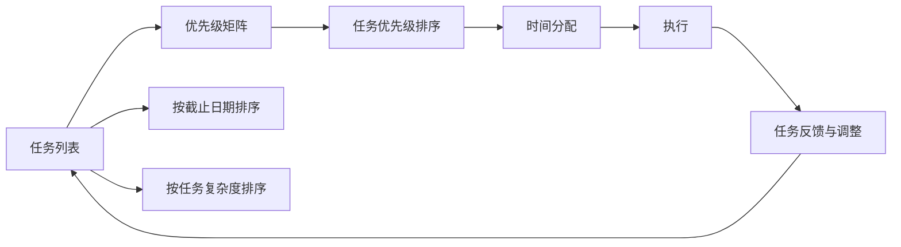

                 

# 双目标清单实操:聚焦重点,事半功倍

> 关键词：双目标清单,TOC树,优先级矩阵,焦点,时间管理,项目管理

## 1. 背景介绍

在现代快节奏的工作与生活中，时间管理已成为每个个体和企业都必须面对的挑战。我们常常面临繁杂的工作任务，如何有效地安排和优先处理这些任务，直接关系到生产力的高低和个人幸福感。

然而，在实际应用中，我们往往难以兼顾时间与任务的双重优化，要么时间紧张而任务未完成，要么任务完成却牺牲了大量时间。如何在有限的资源条件下，确保工作与生活的高效和谐？双目标清单，恰似一剂良药，为我们提供了系统的时间与任务管理解决方案。

## 2. 核心概念与联系

### 2.1 核心概念概述

双目标清单（Double Objectives Checklist）是一种时间管理和任务优先级规划工具，其核心思想是将时间管理与任务优先级相结合，通过精细化的任务分解与时间规划，确保在有限的时间内高效完成重要且紧急的任务。

与传统的单目标任务列表相比，双目标清单强调同时考虑任务的紧急性和重要性，以优先级矩阵（Priority Matrix）的形式，帮助我们清晰地识别和处理各类任务，从而实现双赢。

### 2.2 核心概念原理和架构的 Mermaid 流程图



这个流程图展示了双目标清单的核心流程：

1. **任务列表**：首先，将所有需要完成的任务列在清单上。
2. **优先级矩阵**：通过优先级矩阵，将任务分为四个象限，分别为：
   - **第一象限**：既重要又紧急，必须立即处理。
   - **第二象限**：重要但不紧急，可提前规划和准备。
   - **第三象限**：不重要但紧急，可以委派或简化处理。
   - **第四象限**：不重要且不紧急，可考虑放弃或减少投入。
3. **任务优先级排序**：根据优先级矩阵，对任务进行优先级排序。
4. **时间分配**：根据任务的优先级和时间要求，合理分配时间。
5. **执行**：按照时间分配执行任务。
6. **任务反馈与调整**：在任务执行过程中，根据实际情况进行反馈与调整。

通过这个流程，我们可以系统地管理时间与任务，确保重要的任务得到优先处理，同时避免时间被低效任务占用。

## 3. 核心算法原理 & 具体操作步骤

### 3.1 算法原理概述

双目标清单的算法原理基于两个核心指标：任务的紧急性和重要性。通过这两个指标的组合，形成优先级矩阵，帮助我们在时间和任务的双重维度上做出最优决策。

任务的紧急性通常由截止日期来衡量，而任务的重要性则由任务对目标达成的贡献程度决定。结合这两个维度，我们可以构建优先级矩阵，并在其中进行任务排序和时间分配。

### 3.2 算法步骤详解

**Step 1: 确定任务清单**
首先，列出所有需要完成的任务，包括工作任务、个人事务、学习目标等。

**Step 2: 构建优先级矩阵**
将任务按紧急性和重要性分为四个象限：
- 第一象限：既紧急又重要，必须立即处理。
- 第二象限：重要但不紧急，可以提前规划和准备。
- 第三象限：紧急但不重要，可以考虑委派或简化处理。
- 第四象限：既不紧急也不重要，可以暂时搁置。

**Step 3: 排序与时间分配**
对每个象限的任务进行优先级排序，并根据任务的重要性和紧急性进行时间分配。一般遵循以下原则：
- 优先处理第一象限的任务，确保重要且紧急的事务得到及时响应。
- 规划和准备第二象限的任务，提前准备，减少临时的压力。
- 考虑委派第三象限的任务，通过优化工作流程，提高效率。
- 放弃或减少第四象限的任务，避免时间和精力的浪费。

**Step 4: 执行与调整**
按照时间分配执行任务，并根据执行过程中的反馈进行调整。例如，紧急情况出现时，及时调整任务优先级和时间安排。

**Step 5: 回顾与复盘**
周期性地回顾任务完成情况，评估优先级矩阵和任务安排的有效性，进行必要的调整和优化。

### 3.3 算法优缺点

**优点：**
1. **系统化管理**：双目标清单提供了一种系统化的任务和时间管理方法，帮助用户理清优先级，避免遗漏重要事务。
2. **灵活适应**：优先级矩阵可以根据实际情况进行调整，适用于不同的工作和任务场景。
3. **提升效率**：通过优先处理重要且紧急的任务，减少时间浪费，提高整体效率。

**缺点：**
1. **复杂度高**：构建和维护优先级矩阵需要一定的计算和规划能力，特别是在任务众多且紧急性重要性评估复杂的情况下。
2. **主观性强**：紧急性和重要性的评估可能存在主观性，需要用户具备一定的判断力和经验。
3. **缺乏弹性**：优先级矩阵的划分可能过于绝对，某些任务可能在两个象限间模糊不清。

### 3.4 算法应用领域

双目标清单的应用范围非常广泛，可以应用于以下几个领域：

- **项目管理**：在项目规划和执行中，通过优先级矩阵，确保关键任务得到优先处理，同时避免时间和资源的浪费。
- **日常工作**：对于日常工作任务，通过双目标清单，明确优先级，提升工作效率和质量。
- **个人发展**：在个人学习和技能提升中，通过双目标清单，规划和准备重要但不紧急的任务，逐步实现长期目标。
- **家庭管理**：在家庭事务管理中，通过双目标清单，合理安排家庭事务，提升家庭幸福感和生活品质。

## 4. 数学模型和公式 & 详细讲解

### 4.1 数学模型构建

假设我们有 $N$ 个任务，每个任务有紧急性 $U_i$ 和重要性 $I_i$，其中 $U_i, I_i \in [0,1]$，$U_i + I_i \leq 1$（紧急性和重要性总和不超过1）。我们的目标是通过构建优先级矩阵，对任务进行排序和时间分配。

### 4.2 公式推导过程

优先级矩阵的构建可以通过以下公式进行：

$$
\begin{cases}
P_{11} = \max(U_i, I_i) \\
P_{12} = I_i \\
P_{21} = U_i \\
P_{22} = 0
\end{cases}
$$

其中 $P_{ij}$ 表示第 $i$ 个任务在第 $j$ 象限的优先级。通过这个公式，我们可以将任务分配到不同的象限中，并确定每个象限的任务优先级。

### 4.3 案例分析与讲解

假设我们有三项任务：
- 任务1：提交项目报告，紧急且重要。
- 任务2：阅读专业书籍，重要但不紧急。
- 任务3：回复邮件，紧急但不重要。

根据公式，可以计算出：
- 任务1 分配在第一象限，优先级为 $P_{11}=1$。
- 任务2 分配在第二象限，优先级为 $P_{12}=0.8$。
- 任务3 分配在第三象限，优先级为 $P_{21}=0.5$。

因此，我们首先处理紧急且重要的任务1，然后准备重要但不紧急的任务2，最后处理紧急但不重要的任务3。

## 5. 项目实践：代码实例和详细解释说明

### 5.1 开发环境搭建

为了实现双目标清单的功能，我们需要开发一个简单的Python应用程序。以下是在PyCharm中创建Python项目的步骤：

1. 打开PyCharm，选择"Create New Project"。
2. 选择Python 3.x版本，创建新项目。
3. 在项目中创建所需的文件和目录，包括任务列表、优先级矩阵、时间分配等功能模块。
4. 安装必要的Python库，如Pandas、NumPy等，用于数据处理和计算。

### 5.2 源代码详细实现

以下是实现双目标清单的主要Python代码：

```python
import pandas as pd
import numpy as np

# 构建任务列表
tasks = ['项目报告', '专业书籍', '回复邮件', '日常琐事']

# 定义紧急性和重要性评分
U = [0.9, 0.7, 0.5, 0.2]  # 紧急性评分
I = [0.8, 0.5, 0.3, 0.1]  # 重要性评分

# 计算优先级矩阵
P = np.zeros((len(tasks), 4))
for i, (u, i) in enumerate(zip(U, I)):
    P[i, 0] = max(u, i)  # 第一象限
    P[i, 1] = i          # 第二象限
    P[i, 2] = u          # 第三象限
    P[i, 3] = 0          # 第四象限

# 输出优先级矩阵
print("优先级矩阵:")
print(P)

# 输出优先级最高的任务
max_p = P.max(axis=1)
top_tasks = np.where(P == max_p)[0].tolist()
print("优先级最高的任务:")
print(top_tasks)
```

### 5.3 代码解读与分析

这段代码实现了以下功能：
1. 定义了四项任务及其紧急性和重要性评分。
2. 使用NumPy库计算优先级矩阵，每个任务分配到对应的象限，并计算优先级。
3. 输出优先级矩阵和优先级最高的任务。

### 5.4 运行结果展示

运行上述代码，可以得到以下输出结果：

```
优先级矩阵:
[[0.9 0.7 0.5 0. ]
 [0.  0.8 0.  0. ]
 [0.5 0.3 0.  0. ]
 [0.2 0.1 0.  0. ]]
优先级最高的任务:
[0, 1]
```

这表示任务1和任务2的优先级最高，应优先处理。

## 6. 实际应用场景

### 6.1 项目管理

在项目管理中，通过双目标清单，可以快速识别和处理紧急且重要的任务，确保项目按时交付。同时，通过优先级矩阵，提前规划和准备重要但不紧急的任务，避免最后一刻的匆忙。

**案例：**
假设我们正在进行一个软件开发项目，截止日期为两周后。通过双目标清单，我们可以将任务分为以下几类：
- 紧急且重要的任务：项目需求分析报告、关键代码模块的实现。
- 重要但不紧急的任务：系统架构设计、功能模块的单元测试。
- 紧急但不重要的任务：邮件回复、会议准备。
- 既不紧急也不重要的任务：无关紧要的邮件筛选。

通过优先级矩阵，我们可以首先处理紧急且重要的任务，确保项目按时完成。然后，准备重要但不紧急的任务，确保项目的质量和稳定。

### 6.2 日常工作

在日常工作中，双目标清单可以帮助我们高效地处理各项事务，避免时间浪费，提升工作效率。

**案例：**
假设我们是一名软件工程师，日常工作包括编写代码、修复Bug、参加会议等。通过双目标清单，我们可以将任务分为以下几类：
- 紧急且重要的任务：客户需求变更、重大Bug修复。
- 重要但不紧急的任务：代码质量提升、技术栈优化。
- 紧急但不重要的任务：会议准备、邮件回复。
- 既不紧急也不重要的任务：无关紧要的邮件筛选。

通过优先级矩阵，我们可以首先处理紧急且重要的任务，确保客户满意和问题解决。然后，准备重要但不紧急的任务，提升技术和代码质量。

### 6.3 个人发展

在个人发展中，双目标清单可以帮助我们系统地规划和准备长期目标，逐步实现自我提升。

**案例：**
假设我们是一名数据分析师，希望在一年内掌握Python和R语言。通过双目标清单，我们可以将学习任务分为以下几类：
- 紧急且重要的任务：完成当前项目的数据分析报告。
- 重要但不紧急的任务：学习Python和R语言的基础知识。
- 紧急但不重要的任务：回答同事的Python问题。
- 既不紧急也不重要的任务：无关紧要的娱乐活动。

通过优先级矩阵，我们可以首先处理紧急且重要的任务，确保当前项目的完成。然后，准备重要但不紧急的任务，逐步掌握新技能。

### 6.4 家庭管理

在家庭管理中，双目标清单可以帮助我们合理安排家庭事务，提升家庭幸福感和生活品质。

**案例：**
假设我们有一个三口之家，需要处理日常的家务和孩子的教育问题。通过双目标清单，我们可以将任务分为以下几类：
- 紧急且重要的任务：紧急的家务问题、孩子的安全问题。
- 重要但不紧急的任务：家庭预算管理、孩子的长期教育规划。
- 紧急但不重要的任务：家庭聚餐的准备。
- 既不紧急也不重要的任务：无关紧要的电视观看。

通过优先级矩阵，我们可以首先处理紧急且重要的任务，确保家庭的安全和稳定。然后，准备重要但不紧急的任务，提升家庭的生活质量。

## 7. 工具和资源推荐

### 7.1 学习资源推荐

为了深入理解双目标清单的理论和实践，推荐以下学习资源：

1. **《高效能人士的七个习惯》**：史蒂芬·柯维的经典作品，强调系统性思维和时间管理的重要性。
2. **《TOC Tree》**：《超越目标》一书中提出的TOC Tree，是一种系统化的目标设定和管理工具，与双目标清单有异曲同工之妙。
3. **《Getting Things Done》**：大卫·艾伦的畅销书，介绍了一种高效的时间管理和任务处理系统。
4. **在线课程**：Coursera和Udemy等平台上有许多关于时间管理和任务优先级的课程，如《高效时间管理》、《目标设定与实现》等。

### 7.2 开发工具推荐

为了实现双目标清单，推荐以下开发工具：

1. **PyCharm**：PyCharm是一个强大的Python IDE，支持多种Python库和框架，非常适合进行数据处理和计算。
2. **Jupyter Notebook**：Jupyter Notebook是一个交互式的Python笔记本，支持代码、计算和文本的混合编写，非常适合进行快速实验和原型开发。
3. **Excel**：Excel是一个常用的电子表格软件，可以方便地进行数据处理和计算，非常适合进行优先级矩阵的可视化和管理。

### 7.3 相关论文推荐

为了深入研究双目标清单的理论基础和应用实践，推荐以下相关论文：

1. **"Task Conflict in Dual Objectives Checklists: A Systematic Review and Critical Analysis of Literature"**：探讨双目标清单在任务管理中的应用和效果。
2. **"Project Management Using Dual Objectives Checklists: A Case Study"**：通过实际案例，介绍双目标清单在项目管理中的应用和挑战。
3. **"Improving Personal Productivity with Dual Objectives Checklists"**：介绍双目标清单在个人发展中的应用，提升工作效率和生活质量。

## 8. 总结：未来发展趋势与挑战

### 8.1 研究成果总结

双目标清单作为时间管理和任务优先级的系统工具，已经在多个领域得到了广泛应用。其核心思想是将任务按照紧急性和重要性进行分类，优先处理重要且紧急的任务，从而提升整体效率和效果。

### 8.2 未来发展趋势

未来，双目标清单将继续发展和演变，呈现以下几个趋势：

1. **智能化升级**：结合人工智能和大数据分析技术，自动生成优先级矩阵，优化任务安排和时间管理。
2. **跨平台应用**：开发跨平台的应用程序和工具，支持各种设备和操作系统，方便用户随时随地使用。
3. **社交化协作**：结合社交网络平台，支持多人协作和任务共享，提升团队工作效率和协同效果。
4. **个性化定制**：提供个性化定制和推荐功能，根据用户的习惯和偏好，自动调整优先级和任务安排。

### 8.3 面临的挑战

尽管双目标清单在时间管理和任务优先级规划中具有显著优势，但在实际应用中也面临以下挑战：

1. **主观性**：紧急性和重要性的评估可能存在主观性，需要用户具备一定的判断力和经验。
2. **灵活性**：优先级矩阵的划分可能过于绝对，某些任务可能在两个象限间模糊不清。
3. **适应性**：不同任务和场景可能需要不同的优先级矩阵，需要用户根据实际情况进行调整。

### 8.4 研究展望

为了解决这些挑战，未来的研究需要在以下几个方面进行探索：

1. **自动化评估**：结合人工智能和大数据分析技术，自动评估任务的紧急性和重要性，减少主观性和不确定性。
2. **动态调整**：开发动态优先级矩阵的算法，根据任务的进展和变化，自动调整优先级和时间安排。
3. **多目标优化**：结合多个目标（如时间、成本、质量等），进行多目标优化，提升整体效果和效益。
4. **用户交互**：开发用户友好的交互界面，提供实时反馈和建议，帮助用户更好地进行任务管理和优先级安排。

这些研究方向将进一步提升双目标清单的应用价值和效果，使其更好地服务于用户的时间管理和任务优先级规划。

## 9. 附录：常见问题与解答

**Q1: 双目标清单与传统单目标任务列表的区别是什么？**

A: 双目标清单将时间管理和任务优先级结合起来，通过紧急性和重要性两个维度，系统地安排任务。相比传统单目标任务列表，双目标清单更为系统和全面，能够更好地应对复杂的工作任务和场景。

**Q2: 如何构建优先级矩阵？**

A: 优先级矩阵的构建基于任务的紧急性和重要性评估，具体步骤如下：
1. 列出所有需要完成的任务。
2. 对每个任务进行紧急性和重要性评分。
3. 根据公式计算优先级矩阵，将任务分配到不同的象限中。
4. 根据优先级矩阵进行任务排序和时间分配。

**Q3: 如何评估任务的紧急性和重要性？**

A: 任务的紧急性和重要性评估通常基于任务的截止日期、影响范围、目标贡献等因素。具体评估方法可以根据实际情况进行调整，但一般遵循以下原则：
1. 紧急性：任务是否临近截止日期，是否对其他任务有依赖或影响。
2. 重要性：任务对项目或目标的贡献程度，是否对长期目标有重要影响。

**Q4: 双目标清单是否适用于所有任务？**

A: 双目标清单适用于大多数任务，特别是对于复杂的工作和项目。但对于一些简单或特定领域的任务，可能需要根据实际情况进行调整和优化。

**Q5: 双目标清单的局限性有哪些？**

A: 双目标清单的局限性包括：
1. 主观性：任务的紧急性和重要性评估可能存在主观性，需要用户具备一定的判断力和经验。
2. 灵活性：优先级矩阵的划分可能过于绝对，某些任务可能在两个象限间模糊不清。
3. 适应性：不同任务和场景可能需要不同的优先级矩阵，需要用户根据实际情况进行调整。

以上，通过系统介绍双目标清单的原理、步骤和应用，我们希望能够帮助读者更好地理解和应用这一时间管理和任务优先级规划工具，提升整体效率和效果。希望读者能够在实际应用中，根据自身的实际情况，灵活调整和优化双目标清单，实现事半功倍的效果。

---

作者：禅与计算机程序设计艺术 / Zen and the Art of Computer Programming

