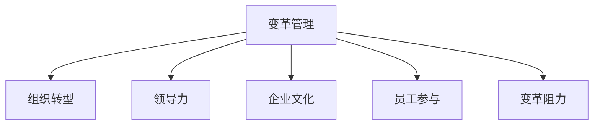

                 

# 变革管理：引导组织转型的技巧

> 关键词：变革管理, 组织转型, 领导力, 企业文化, 员工参与, 变革阻力, 沟通策略, 变革管理模型

## 1. 背景介绍

### 1.1 问题由来
在当今快速变化的商业环境中，企业面临着前所未有的挑战和机遇。技术进步、市场竞争、消费者需求变化等因素促使企业必须不断适应新环境，保持竞争力。然而，在追求变革的过程中，企业往往面临巨大的内部阻力和组织惯性的束缚，变革成功率较低。如何有效地管理变革，引导组织顺利转型，成为企业管理者迫切需要解决的问题。

### 1.2 问题核心关键点
变革管理指的是组织通过系统地规划、实施和监控变革，以实现目标的过程。其核心在于：
1. **明确变革目标**：制定清晰的变革目标，确保变革方向和预期效果一致。
2. **有效沟通**：通过沟通消除不确定性，建立信任，增强员工对变革的支持度。
3. **领导力**：提供坚定的领导和支持，带领团队克服变革阻力。
4. **员工参与**：鼓励员工积极参与变革过程，增强他们的归属感和责任感。
5. **管理变革阻力**：识别并应对变革过程中可能出现的各种阻力，包括情感阻力、文化阻力等。

变革管理的成功与否，直接关系到组织的未来发展。有效的变革管理不仅能提升企业应对市场变化的能力，还能增强员工满意度和忠诚度，提升组织创新能力。

### 1.3 问题研究意义
研究变革管理，对于提升企业适应外部环境的能力，增强内部协作，提高员工满意度和创新能力，具有重要意义：

1. **适应外部环境**：变革管理帮助企业更好地应对市场和技术变化，提升市场竞争力。
2. **增强内部协作**：通过变革管理，消除组织内部的隔阂，促进跨部门协作，提高整体运营效率。
3. **提高员工满意度**：变革管理重视员工参与，增强员工对组织的认同感和归属感。
4. **增强创新能力**：变革管理鼓励创新，营造开放和包容的组织文化，推动新业务和新技术的开发。
5. **优化组织结构**：变革管理有助于优化组织结构，使其更加适应市场和业务需求。

## 2. 核心概念与联系

### 2.1 核心概念概述

为更好地理解变革管理，本节将介绍几个密切相关的核心概念：

- **变革管理(Change Management)**：指的是通过有计划的干预，引导组织或个人从现有状态向目标状态转变的过程。变革管理包括变革规划、实施和评估等环节，旨在确保变革目标的实现。
- **组织转型(Organizational Transformation)**：指通过变革，改变组织结构、流程、文化等方面，提升组织绩效和适应能力。组织转型通常与企业战略调整、技术创新、市场拓展等紧密相关。
- **领导力(Leadership)**：指领导者通过影响和激励他人，实现组织目标的能力。变革管理中的领导力体现在对变革方向的把控、对变革过程的推动以及对变革阻力的应对。
- **企业文化(Corporate Culture)**：指组织内部共同的价值观、行为规范和信仰体系。变革管理需要关注企业文化对变革的适应性和接纳度，通过文化建设促进变革顺利实施。
- **员工参与(Employee Engagement)**：指员工对组织的认同感、归属感和责任感，以及在工作中投入的程度。变革管理中，员工参与度越高，变革效果越好。
- **变革阻力(Change Resistance)**：指组织和个人在变革过程中对变革的抵触情绪和行为。变革阻力可能来自组织惯性、利益冲突、文化差异等。

这些核心概念之间的逻辑关系可以通过以下Mermaid流程图来展示：



这个流程图展示了几大核心概念之间的相互关系：

1. 变革管理通过组织转型，实现企业战略和业务目标。
2. 变革管理中的领导力、企业文化和员工参与都是影响变革成功的重要因素。
3. 变革阻力是变革过程中必须应对的挑战，需要通过有效的管理策略来克服。

## 3. 核心算法原理 & 具体操作步骤
### 3.1 算法原理概述

变革管理的核心在于通过系统的方法和工具，引导组织顺利转型。其核心思想是：

1. **设定变革目标**：明确变革的方向和目标，确保变革的方向和企业的战略目标一致。
2. **制定变革计划**：根据变革目标，制定详细的变革计划，包括时间表、资源分配和关键里程碑。
3. **推动变革实施**：通过有效的沟通、领导和激励，推动变革计划的实施，确保变革按计划进行。
4. **监控和评估**：实时监控变革进展，收集反馈，评估变革效果，及时调整策略。

变革管理的过程可以看作是一个闭环的管理过程，包括设定目标、制定计划、实施变革、监控评估和反馈调整。

### 3.2 算法步骤详解

变革管理的实施步骤一般包括以下几个关键环节：

**Step 1: 识别变革机会**
- 评估组织内外环境，识别变革的需求和机遇。
- 进行SWOT分析，明确组织的优势、劣势、机会和威胁。
- 与关键利益相关者沟通，获得支持。

**Step 2: 制定变革愿景**
- 设定变革的总体目标和方向。
- 制定清晰的变革愿景，激发员工对变革的认同感。
- 通过宣讲、培训等手段，广泛传播变革愿景。

**Step 3: 制定变革计划**
- 根据变革愿景，制定详细的变革计划。
- 确定变革的关键步骤和里程碑。
- 分配资源，建立变革执行团队。

**Step 4: 推动变革实施**
- 通过高层领导的支持和推动，启动变革。
- 实施变革过程中，建立有效的沟通渠道。
- 定期举行沟通会议，及时反馈变革进展。

**Step 5: 监控和评估**
- 建立变革监控机制，实时跟踪变革进展。
- 收集员工反馈，评估变革效果。
- 根据评估结果，调整变革策略，确保变革目标的实现。

**Step 6: 反馈和调整**
- 根据监控和评估结果，及时调整变革策略。
- 反馈变革过程中的经验和教训，为未来的变革提供参考。

### 3.3 算法优缺点

变革管理方法具有以下优点：
1. **系统性**：通过系统的变革管理过程，确保变革有计划、有步骤地推进。
2. **全面性**：覆盖变革管理的各个环节，从目标设定到监控评估，形成闭环。
3. **透明性**：变革过程透明，便于管理层和员工了解变革进展和目标。
4. **可控性**：通过监控和评估，及时发现和解决变革过程中出现的问题。

同时，变革管理方法也存在一定的局限性：
1. **复杂度高**：变革管理涉及多个环节和部门，复杂度高，执行难度大。
2. **资源需求高**：需要投入大量的时间、人力和资金，可能对企业的运营造成一定影响。
3. **阻力难控制**：变革过程中可能出现多种阻力，难以完全控制。

尽管存在这些局限性，但就目前而言，变革管理仍然是企业转型升级的重要工具。未来相关研究的重点在于如何进一步简化变革管理流程，提高变革效率，降低变革风险。

### 3.4 算法应用领域

变革管理在企业转型过程中得到了广泛应用，覆盖了多个领域，例如：

- **企业战略调整**：通过变革管理，实现企业战略的调整和升级，提升市场竞争力。
- **组织结构优化**：通过变革管理，优化组织结构，提高运营效率。
- **业务流程再造**：通过变革管理，重新设计业务流程，提升业务流程的效率和质量。
- **技术创新和应用**：通过变革管理，引入新技术和应用，提升技术水平和创新能力。
- **企业文化建设**：通过变革管理，塑造符合企业战略和价值观的企业文化。
- **员工培训和能力提升**：通过变革管理，提升员工技能和能力，适应新的业务需求。

除了上述这些经典领域，变革管理还应用于人力资源管理、市场营销、产品开发等各个环节，为企业的全面转型提供有力支持。

## 4. 数学模型和公式 & 详细讲解 & 举例说明
### 4.1 数学模型构建

变革管理的核心在于通过数据驱动的方法，优化变革过程，提高变革效果。以下我们将使用数学语言对变革管理的核心步骤进行更加严格的刻画。

设变革管理的目标为 $T$，变革过程中涉及的关键指标为 $K$，关键里程碑为 $M$。变革管理的过程可以抽象为一个动态系统，目标和关键指标的变化可以用以下数学模型表示：

$$
\begin{cases}
\dot{T} = f(K, M) \\
\dot{K} = g(T, M) \\
\dot{M} = h(T, K)
\end{cases}
$$

其中 $\dot{T}$ 表示变革目标的变化率，$f(K, M)$ 表示目标变化与关键指标和关键里程碑之间的关系；$\dot{K}$ 表示关键指标的变化率，$g(T, M)$ 表示关键指标变化与目标和关键里程碑之间的关系；$\dot{M}$ 表示关键里程碑的变化率，$h(T, K)$ 表示关键里程碑变化与目标和关键指标之间的关系。

### 4.2 公式推导过程

以下我们以企业战略调整为示例，推导关键指标与变革目标之间的数学关系。

假设企业战略调整为 $T$，关键指标为市场份额 $K$ 和客户满意度 $S$。在变革过程中，关键指标与变革目标之间的关系可以表示为：

$$
\dot{K} = f(T) = aT + b \\
\dot{S} = g(T) = cT + d
$$

其中 $a$、$b$、$c$、$d$ 为系数，代表关键指标对变革目标的响应速度和影响程度。假设关键里程碑 $M$ 表示市场拓展的进度，与变革目标和关键指标之间的关系为：

$$
\dot{M} = h(T, K) = e(T - M) + f(K)
$$

其中 $e$、$f$ 为系数，代表关键里程碑与变革目标和关键指标之间的关系。

根据以上关系，我们可以构建一个包含目标、关键指标和关键里程碑的数学模型，用于描述企业战略调整的动态变化。

### 4.3 案例分析与讲解

某科技公司为了提升市场竞争力，决定进行战略调整，引入新的业务方向。根据变革管理的数学模型，企业首先设定了提升市场份额和客户满意度的目标，并确定了关键里程碑：完成新产品的研发、成功进入目标市场和提升品牌知名度。

在实施变革过程中，公司通过定期监控关键指标的变化，调整战略实施方案。例如，在关键里程碑 $M_1$（完成新产品的研发）到达时，公司通过市场调研和客户反馈，调整了新产品的市场定位，提高了客户满意度。在关键里程碑 $M_2$（成功进入目标市场）到达时，公司加大了市场推广力度，提升了市场份额。

通过数学模型和关键指标的监控，公司能够及时发现和解决问题，确保战略调整顺利实施，最终实现了预期目标。

## 5. 项目实践：代码实例和详细解释说明
### 5.1 开发环境搭建

在进行变革管理实践前，我们需要准备好开发环境。以下是使用Python进行数据分析和可视化开发的环境配置流程：

1. 安装Anaconda：从官网下载并安装Anaconda，用于创建独立的Python环境。

2. 创建并激活虚拟环境：
```bash
conda create -n change-management python=3.8 
conda activate change-management
```

3. 安装Pandas、NumPy、Matplotlib等数据分析和可视化工具：
```bash
conda install pandas numpy matplotlib
```

4. 安装Seaborn和Plotly等高级可视化工具：
```bash
conda install seaborn plotly
```

完成上述步骤后，即可在`change-management`环境中开始变革管理实践。

### 5.2 源代码详细实现

下面我们以某公司进行战略调整为示例，给出使用Pandas和Matplotlib进行变革管理数据分析的PyTorch代码实现。

首先，定义数据处理函数：

```python
import pandas as pd
import matplotlib.pyplot as plt

def read_data(file_path):
    return pd.read_csv(file_path)

def plot_series(series, title, filename):
    series.plot(title=title)
    plt.savefig(filename)
```

然后，定义数据读取和处理函数：

```python
def process_data(data):
    # 将关键指标和关键里程碑数据进行归一化处理
    K = (data['市场份额'] - min(data['市场份额'])) / (max(data['市场份额']) - min(data['市场份额']))
    M = (data['关键里程碑'] - min(data['关键里程碑'])) / (max(data['关键里程碑']) - min(data['关键里程碑']))
    T = (data['变革目标'] - min(data['变革目标'])) / (max(data['变革目标']) - min(data['变革目标']))
    return {'K': K, 'M': M, 'T': T}
```

接着，定义数据监控和调整函数：

```python
def monitor变革目标(T, K, M):
    # 定义关键指标和关键里程碑对变革目标的响应速度和影响程度
    a = 0.2
    b = 0.5
    c = 0.3
    d = 0.2
    
    # 定义关键里程碑与变革目标和关键指标之间的关系
    e = 0.1
    f = 0.2
    
    # 模拟关键指标和关键里程碑的变化
    K_next = a * T + b
    M_next = e * (T - M) + f * K
    
    # 根据关键指标和关键里程碑的变化，调整变革目标
    T_next = T + K_next
    
    return {'K_next': K_next, 'M_next': M_next, 'T_next': T_next}

def adjust变革目标(T, K, M):
    # 根据关键指标和关键里程碑的变化，调整变革目标
    T_next = T + K
    
    return {'T_next': T_next}
```

最后，启动监控和调整流程：

```python
data = read_data('data.csv')
processed_data = process_data(data)

for i in range(0, len(processed_data['T'])):
    K_next = monitor变革目标(processed_data['T'][i], processed_data['K'][i], processed_data['M'][i])
    T_next = adjust变革目标(processed_data['T'][i], processed_data['K'][i], processed_data['M'][i])
    
    processed_data['T'][i+1] = T_next['T_next']
    processed_data['K'][i+1] = K_next['K_next']
    processed_data['M'][i+1] = K_next['M_next']
    
    if i % 10 == 0:
        plot_series(processed_data['T'], '变革目标', '变革目标监控图.png')
        plot_series(processed_data['K'], '市场份额', '市场份额监控图.png')
        plot_series(processed_data['M'], '关键里程碑', '关键里程碑监控图.png')
```

以上就是使用Python进行变革管理数据分析和可视化的完整代码实现。可以看到，通过Pandas和Matplotlib的协同工作，我们可以高效地处理和可视化数据，监控变革进程，调整变革策略，确保变革目标的实现。

### 5.3 代码解读与分析

让我们再详细解读一下关键代码的实现细节：

**read_data函数**：
- 从指定文件中读取数据，并返回一个Pandas DataFrame对象。

**plot_series函数**：
- 使用Matplotlib绘制时间序列图，并保存为指定文件名。

**process_data函数**：
- 对关键指标和关键里程碑数据进行归一化处理，使其变化范围在0到1之间。

**monitor变革目标函数**：
- 定义关键指标和关键里程碑对变革目标的响应速度和影响程度，以及关键里程碑与变革目标和关键指标之间的关系。
- 根据这些关系，模拟关键指标和关键里程碑的变化，并调整变革目标。

**adjust变革目标函数**：
- 根据关键指标和关键里程碑的变化，调整变革目标。

通过上述代码实现，我们可以看到，变革管理过程可以有效地通过数据驱动的方法，监控和调整变革目标，确保变革顺利实施。在实际应用中，开发者可以根据具体任务的特点，对监控和调整函数进行优化设计，以进一步提升变革管理的效率和效果。

## 6. 实际应用场景
### 6.1 智能制造企业转型

智能制造企业需要应对快速变化的市场需求和技术创新，不断调整生产流程和运营模式。通过变革管理，企业能够系统地规划和实施转型，提升生产效率和产品质量。

具体而言，智能制造企业可以采用以下步骤进行变革管理：

1. **识别变革机会**：通过数据分析和市场调研，识别生产流程中的瓶颈和提升空间。
2. **制定变革愿景**：设定智能制造的总体目标和方向，如提高生产效率、降低成本、提升产品质量等。
3. **制定变革计划**：根据变革愿景，制定详细的实施计划，包括关键步骤和里程碑。
4. **推动变革实施**：通过高层领导的支持和推动，实施变革计划，如引入先进制造设备、优化生产流程等。
5. **监控和评估**：实时监控变革进展，收集员工反馈，评估变革效果。
6. **反馈和调整**：根据监控和评估结果，及时调整变革策略，确保变革目标的实现。

通过变革管理，智能制造企业能够实现生产流程的优化，提升生产效率和产品质量，满足市场快速变化的需求，保持竞争力。

### 6.2 传统零售业数字化转型

传统零售业面临线上购物、社交电商等新兴渠道的冲击，需要进行数字化转型，提升运营效率和客户体验。变革管理在此过程中起到了关键作用。

具体而言，传统零售业可以采用以下步骤进行变革管理：

1. **识别变革机会**：通过市场调研和数据分析，识别零售业务的瓶颈和提升空间。
2. **制定变革愿景**：设定数字化转型的总体目标和方向，如构建数字化供应链、提升客户体验等。
3. **制定变革计划**：根据变革愿景，制定详细的实施计划，包括关键步骤和里程碑。
4. **推动变革实施**：通过高层领导的支持和推动，实施变革计划，如引入先进技术、优化业务流程等。
5. **监控和评估**：实时监控变革进展，收集员工反馈，评估变革效果。
6. **反馈和调整**：根据监控和评估结果，及时调整变革策略，确保变革目标的实现。

通过变革管理，传统零售业能够实现数字化转型，提升运营效率和客户体验，适应市场变化，实现可持续发展。

### 6.3 医疗卫生行业信息化建设

医疗卫生行业面临信息化建设的挑战，需要通过变革管理，提升医疗服务质量和效率。变革管理在此过程中起到了关键作用。

具体而言，医疗卫生行业可以采用以下步骤进行变革管理：

1. **识别变革机会**：通过数据分析和市场需求调研，识别信息化建设的瓶颈和提升空间。
2. **制定变革愿景**：设定信息化建设的总体目标和方向，如提高医疗服务质量、优化医疗流程等。
3. **制定变革计划**：根据变革愿景，制定详细的实施计划，包括关键步骤和里程碑。
4. **推动变革实施**：通过高层领导的支持和推动，实施变革计划，如引入先进信息化系统、优化医疗流程等。
5. **监控和评估**：实时监控变革进展，收集员工反馈，评估变革效果。
6. **反馈和调整**：根据监控和评估结果，及时调整变革策略，确保变革目标的实现。

通过变革管理，医疗卫生行业能够实现信息化建设，提升医疗服务质量和效率，满足患者需求，实现可持续发展。

### 6.4 未来应用展望

随着变革管理方法的发展，未来其在更多领域将得到应用，为各行业带来变革性影响。

在智慧城市治理中，变革管理可以帮助城市管理者优化资源配置，提升公共服务质量，构建智慧城市。

在环境保护领域，变革管理可以引导企业实现绿色转型，提升资源利用效率，降低环境污染。

在教育领域，变革管理可以推动教育信息化建设，提升教学质量和学生学习体验，促进教育公平。

在金融行业，变革管理可以推动数字化转型，提升金融服务效率和客户体验，增强市场竞争力。

总之，变革管理将在更多领域得到应用，为各行业带来深远影响。相信随着变革管理技术的不断成熟，其应用范围将不断扩大，推动各行业向更加智能化、高效化的方向发展。

## 7. 工具和资源推荐
### 7.1 学习资源推荐

为了帮助开发者系统掌握变革管理的理论基础和实践技巧，这里推荐一些优质的学习资源：

1. 《变革管理》系列书籍：由变革管理专家撰写，系统介绍了变革管理的基本概念、方法论和实际案例。
2. Harvard Business Review《变革管理》杂志：提供了大量关于变革管理的理论研究和实践案例，帮助你深入理解变革管理的本质。
3. Coursera《变革管理》课程：由全球知名专家开设，系统讲解变革管理的各个环节和关键点。
4. Project Management Institute (PMI)《变革管理》指南：提供了全面的变革管理实践指南，涵盖项目管理和变革管理的内容。
5. Deloitte《变革管理最佳实践》报告：提供了大量变革管理的成功案例和最佳实践，帮助你借鉴和学习。

通过对这些资源的学习实践，相信你一定能够快速掌握变革管理的精髓，并用于解决实际的变革问题。
### 7.2 开发工具推荐

高效的开发离不开优秀的工具支持。以下是几款用于变革管理开发的常用工具：

1. Microsoft Excel：用于数据处理和分析，提供强大的数据透视表和图表功能。
2. Microsoft Project：用于项目管理，帮助你制定和跟踪变革计划和关键里程碑。
3. Microsoft SharePoint：用于协作和文档管理，方便团队成员共享和访问变革文档。
4. Microsoft Power BI：用于数据可视化和报表生成，帮助你监控和评估变革效果。
5. JIRA：用于项目管理，提供敏捷开发和任务跟踪功能，帮助团队高效实施变革。
6. Confluence：用于文档管理和协作，方便团队成员共享和讨论变革文档。

合理利用这些工具，可以显著提升变革管理的开发效率，加快创新迭代的步伐。

### 7.3 相关论文推荐

变革管理的发展离不开学界的持续研究。以下是几篇奠基性的相关论文，推荐阅读：

1. John P. Kotter《谁动了企业》：提出了“8步变革模型”，详细介绍了变革管理的步骤和方法。
2. Thomas G. Cooke《变革管理》：系统介绍了变革管理的基本概念和实践方法，提供了大量成功案例。
3. Robbins, Stephen P.《组织变革》：深入探讨了变革管理的理论基础和应用策略。
4. William H. Whyte《变革管理》：提供了变革管理的系统框架和实际案例，帮助你了解变革管理的全貌。
5. Bernard Dubin《变革管理》：提供了变革管理的实践指南，涵盖变革管理的各个环节和关键点。

这些论文代表了大变革管理技术的发展脉络。通过学习这些前沿成果，可以帮助研究者把握学科前进方向，激发更多的创新灵感。

## 8. 总结：未来发展趋势与挑战
### 8.1 总结

本文对变革管理进行了全面系统的介绍。首先阐述了变革管理的背景和意义，明确了变革管理在企业转型中的重要性。其次，从原理到实践，详细讲解了变革管理的数学模型和关键步骤，给出了变革管理任务开发的完整代码实例。同时，本文还广泛探讨了变革管理在多个行业领域的应用前景，展示了变革管理范式的广泛适用性。最后，本文精选了变革管理的各类学习资源，力求为读者提供全方位的技术指引。

通过本文的系统梳理，可以看到，变革管理技术正在成为企业管理和转型升级的重要工具。它不仅帮助企业适应外部环境的变化，提升运营效率，还增强了员工对企业的认同感和归属感。未来，随着变革管理技术的不断成熟，其在更多领域的创新应用将会带来深远的影响。

### 8.2 未来发展趋势

展望未来，变革管理将呈现以下几个发展趋势：

1. **数字化转型**：随着数字化技术的不断发展，变革管理将更加依赖于信息技术，如大数据、人工智能等，提升变革的效率和效果。
2. **敏捷变革**：变革管理将更加强调敏捷性和灵活性，快速响应外部环境的变化，实现快速迭代。
3. **员工参与**：变革管理将更加注重员工的参与和反馈，通过员工参与提升变革的成功率和效果。
4. **系统化管理**：变革管理将更加系统化，涵盖变革管理的各个环节和关键点，形成闭环管理。
5. **全球化管理**：变革管理将更加注重全球化视角，适应国际市场变化，推动全球化发展。

以上趋势凸显了变革管理技术的广阔前景。这些方向的探索发展，必将进一步提升变革管理的效果，推动企业向更加智能化、高效化的方向发展。

### 8.3 面临的挑战

尽管变革管理技术已经取得了显著成果，但在迈向更加智能化、高效化的过程中，它仍面临诸多挑战：

1. **复杂性高**：变革管理涉及多个环节和部门，复杂度高，执行难度大。
2. **资源需求高**：需要投入大量的时间、人力和资金，可能对企业的运营造成一定影响。
3. **阻力难控制**：变革过程中可能出现多种阻力，难以完全控制。
4. **效果难评估**：变革效果的评估难度大，需要综合多方面的数据和指标进行评估。
5. **技术与业务结合难**：技术与业务之间的结合需要时间，需要持续优化和改进。

尽管存在这些挑战，但变革管理在企业转型中的重要性不言而喻。未来的研究需要在技术、组织、管理等方面寻求新的突破，以进一步提升变革管理的效果。

### 8.4 研究展望

面对变革管理面临的挑战，未来的研究需要在以下几个方面寻求新的突破：

1. **技术优化**：开发更加高效、智能的变革管理工具，提升变革管理的效率和效果。
2. **组织优化**：构建更加灵活、敏捷的组织结构，提升组织对变革的适应能力。
3. **文化建设**：塑造符合企业战略和价值观的企业文化，提升员工的归属感和认同感。
4. **数据驱动**：建立完善的数据监测和评估机制，实时监控变革进展，提供决策依据。
5. **跨部门协作**：加强跨部门协作，推动变革目标的实现，提升整体运营效率。

这些研究方向的探索，必将引领变革管理技术迈向更高的台阶，为构建安全、可靠、可控的智能系统铺平道路。面向未来，变革管理技术还需要与其他人工智能技术进行更深入的融合，如知识表示、因果推理、强化学习等，多路径协同发力，共同推动自然语言理解和智能交互系统的进步。只有勇于创新、敢于突破，才能不断拓展语言模型的边界，让智能技术更好地造福人类社会。

## 9. 附录：常见问题与解答
### Q1：变革管理是否适用于所有企业？

A: 变革管理在大多数企业中都有广泛的应用，尤其是在技术进步、市场竞争激烈、环境变化频繁的行业。但对于一些特殊行业，如医疗、教育、政府等，变革管理的方法和策略需要根据具体情况进行调整。

### Q2：变革管理中如何处理员工抵触情绪？

A: 员工抵触情绪是变革管理中的一个重要挑战。以下是一些处理员工抵触情绪的策略：
1. **透明沟通**：及时、透明的沟通，解释变革的必要性和预期效果，增强员工的信任和支持。
2. **参与设计**：邀请员工参与变革计划的制定和实施，增强他们的归属感和责任感。
3. **培训和支持**：提供必要的培训和支持，帮助员工适应变革。
4. **正向激励**：通过正向激励措施，如奖励、晋升等，鼓励员工积极参与变革。

### Q3：变革管理与项目管理有何不同？

A: 变革管理和项目管理虽然有相似之处，但也有一些区别：
1. **目标和范围**：变革管理的目标是实现企业或部门的根本性转变，而项目管理的目标是完成特定的任务或项目。
2. **复杂性**：变革管理通常比项目管理更加复杂，涉及更多的部门和利益相关者。
3. **时间和资源**：变革管理需要更长的时间和更多的资源，需要持续的投入和支持。
4. **风险管理**：变革管理需要更多的风险管理措施，应对变革过程中可能出现的不确定性和阻力。

### Q4：如何评估变革管理的有效性？

A: 变革管理的有效性可以通过以下指标进行评估：
1. **变革目标达成度**：评估变革目标是否实现，如市场份额的提升、客户满意度的提高等。
2. **关键指标变化**：评估关键指标的变化情况，如生产效率、运营成本、客户反馈等。
3. **员工满意度**：评估员工对变革的满意度和参与度，如员工流失率、员工反馈等。
4. **组织绩效**：评估组织的整体绩效，如营收增长、市场竞争力提升等。
5. **变革持续性**：评估变革的持续性和稳定性，如变革是否能够长期维持，是否能够应对未来的变化等。

### Q5：变革管理中如何处理变革阻力？

A: 变革阻力是变革管理中的常见挑战，以下是一些处理变革阻力的策略：
1. **识别阻力**：识别变革过程中可能出现的阻力来源，如文化差异、利益冲突、技术难题等。
2. **透明沟通**：通过透明、及时的沟通，解释变革的必要性和预期效果，增强员工的信任和支持。
3. **高层支持**：争取高层领导的支持，利用高层领导的权威推动变革。
4. **正向激励**：通过正向激励措施，如奖励、晋升等，鼓励员工积极参与变革。
5. **员工培训**：提供必要的培训和支持，帮助员工适应变革。

### Q6：变革管理与战略管理有何不同？

A: 变革管理和战略管理虽然有联系，但也有一些区别：
1. **时间维度**：变革管理是战略管理中的一个环节，旨在实现战略目标，而战略管理是全面的、长期的规划过程。
2. **目标和范围**：变革管理的目标是实现企业或部门的根本性转变，而战略管理的目标是实现长期的企业发展目标。
3. **复杂性**：变革管理通常比战略管理更加复杂，涉及更多的部门和利益相关者。
4. **风险管理**：变革管理需要更多的风险管理措施，应对变革过程中可能出现的不确定性和阻力。

通过这些问题的解答，希望能够帮助你对变革管理有更深入的理解和认识。变革管理是一个复杂而富有挑战性的过程，需要系统的规划和持续的投入。只有通过系统的变革管理，才能实现企业的根本性转变，提升市场竞争力，适应外部环境的变化。

---

作者：禅与计算机程序设计艺术 / Zen and the Art of Computer Programming

