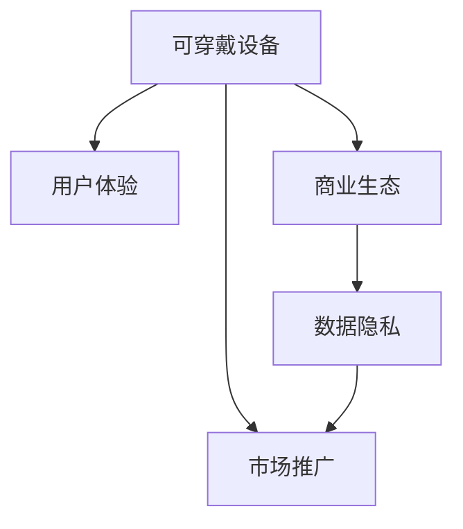

                 

# 可穿戴设备创业：随身科技的商机

## 1. 背景介绍

### 1.1 问题由来
随着科技的进步，智能可穿戴设备日益成为人们日常生活中不可或缺的一部分。从智能手表到健身追踪器，从健康监测到远程控制，这些设备正在潜移默化地改变着我们的生活方式。然而，尽管市场需求强劲，但可穿戴设备的创业之路并非一帆风顺。如何在激烈的市场竞争中脱颖而出，找到可穿戴设备的商业价值点，是创业者需要认真思考的问题。

### 1.2 问题核心关键点
可穿戴设备创业的核心关键点在于找到设备与用户的痛点对接，打造独特的用户体验，并构建强大的商业生态系统。具体而言：

1. **痛点对接**：深入了解目标用户的真实需求，设计出真正能够解决他们问题的产品。
2. **用户体验**：设计简洁易用、界面美观、交互流畅的用户界面，提升用户满意度。
3. **商业生态**：构建与设备相关的服务体系，如健康监测、运动指导、设备维护等，形成完整的生态闭环。
4. **数据隐私**：在收集和利用用户数据时，充分考虑隐私和安全问题，建立用户信任。
5. **市场推广**：结合线上线下的多渠道营销，提升品牌知名度，拓展市场规模。

本文将围绕这些核心关键点，详细探讨可穿戴设备创业的策略和方法，帮助创业者在竞争激烈的市场上找到自己的独特定位。

## 2. 核心概念与联系

### 2.1 核心概念概述

为更好地理解可穿戴设备创业的策略和方法，本节将介绍几个密切相关的核心概念：

- **可穿戴设备(Wearable Device)**：指戴在用户身上的小型电子设备，如智能手表、健身追踪器、智能眼镜等。这些设备通过与用户的身体互动，获取健康、运动、环境等实时数据，为用户提供便利和个性化服务。

- **用户体验(User Experience, UX)**：指用户在使用产品时的主观感受，包括界面设计、交互逻辑、反馈机制等。良好的用户体验能够显著提升用户满意度和忠诚度。

- **商业生态(System Ecosystem)**：指围绕核心产品构建的一系列服务、应用、合作伙伴关系，形成一个完整的商业闭环。商业生态的建立能够增强产品的附加值和市场竞争力。

- **数据隐私(Data Privacy)**：指在数据收集、存储、传输和使用过程中，保护用户隐私权不受侵犯。数据隐私问题处理不当，可能导致用户信任丧失，甚至法律风险。

- **市场推广(Market Promotion)**：指通过各种营销手段，提升产品知名度，吸引潜在用户，扩大市场规模。市场推广的策略和渠道选择，直接影响产品的市场表现和品牌价值。

这些核心概念之间的逻辑关系可以通过以下Mermaid流程图来展示：



这个流程图展示了许多关键概念及其之间的关系：

1. 可穿戴设备是创业的起点。
2. 用户体验是设备吸引用户的核心因素。
3. 商业生态的构建是设备价值提升的关键。
4. 数据隐私是用户信任的基础。
5. 市场推广是设备成功的重要保障。

这些概念共同构成了可穿戴设备创业的基石，决定了产品的成功与否。

## 3. 核心算法原理 & 具体操作步骤
### 3.1 算法原理概述

可穿戴设备创业的算法原理主要围绕用户体验设计、数据处理、市场推广等环节展开。以下是几个关键点的算法概述：

- **用户体验设计**：通过用户研究、原型设计、交互设计等步骤，最大化提升用户满意度。用户体验设计算法主要包括用户界面(UI)设计、交互逻辑设计、反馈机制设计等。

- **数据处理**：包括数据收集、清洗、存储和分析等步骤。数据处理算法需要考虑用户隐私、数据安全、数据可视化等方面。

- **市场推广**：通过搜索引擎优化(SEO)、内容营销、社交媒体营销等手段，提升产品知名度和市场份额。市场推广算法主要涉及流量获取、用户转化、ROI优化等。

### 3.2 算法步骤详解

#### 用户体验设计

**Step 1: 用户研究**
- 通过问卷调查、用户访谈、用户测试等方法，了解目标用户群体的需求和行为。
- 分析用户反馈，发现常见痛点和需求。

**Step 2: 原型设计**
- 基于用户研究结果，设计设备的功能原型和用户界面(UI)原型。
- 使用 wireframe 工具如 Figma、Sketch 等，制作高保真原型。

**Step 3: 交互设计**
- 确定设备的交互逻辑，设计用户界面元素、操作流程、反馈机制等。
- 使用原型测试工具如 Axure、InVision 等，进行用户测试和迭代优化。

#### 数据处理

**Step 1: 数据收集**
- 设计数据收集方案，明确设备可以采集哪些数据。
- 考虑用户隐私和数据安全，设计合理的权限控制机制。

**Step 2: 数据清洗**
- 对收集到的数据进行去重、去噪、填充缺失值等预处理操作。
- 使用数据清洗工具如 OpenRefine、Python 库等，提升数据质量。

**Step 3: 数据存储**
- 选择合适的数据库系统，如 MySQL、MongoDB、Hadoop 等，存储和管理数据。
- 考虑数据的读写性能、存储成本、数据冗余等因素。

**Step 4: 数据分析**
- 使用数据挖掘、机器学习等技术，提取有价值的信息和洞察。
- 使用数据分析工具如 R、Python 库等，构建数据可视化报表。

#### 市场推广

**Step 1: 流量获取**
- 优化搜索引擎优化(SEO)策略，提升设备在搜索引擎中的排名。
- 使用内容营销工具如 Google Analytics、SEMrush 等，提升网站流量。

**Step 2: 用户转化**
- 设计吸引用户的营销活动，如优惠券、限时折扣、免费试用等。
- 使用 A/B 测试工具如 Optimizely、Google Optimize 等，优化营销效果。

**Step 3: ROI 优化**
- 跟踪和分析营销活动的投资回报率(ROI)，评估营销策略的效果。
- 使用 ROI 分析工具如 HubSpot、Marketo 等，优化营销预算和资源分配。

### 3.3 算法优缺点

可穿戴设备创业的算法主要具有以下优点：

- **提升用户体验**：通过精准的用户体验设计，提升设备的易用性和吸引力，增强用户粘性。
- **优化数据处理**：通过高效的数据处理算法，提升数据质量，保障数据安全和隐私。
- **促进市场推广**：通过精准的市场推广算法，提升品牌知名度，扩大市场规模。

同时，这些算法也存在一定的局限性：

- **数据隐私风险**：数据处理过程中，可能会侵犯用户隐私，导致法律风险。
- **高昂的开发成本**：用户体验设计和数据处理算法需要专业的团队支持，成本较高。
- **市场推广复杂**：市场推广算法涉及多渠道、多平台，需要灵活调整策略，实施难度较大。

尽管存在这些局限性，但总体而言，可穿戴设备创业的算法能够帮助创业者找到产品的独特价值点，提升市场竞争力。

### 3.4 算法应用领域

可穿戴设备创业的算法广泛应用于以下领域：

- **健康监测**：通过智能手表、健身追踪器等设备，收集心率、步数、睡眠等健康数据，提供个性化的健康建议和监测报告。
- **运动指导**：通过智能健身设备，监测用户的运动数据，提供个性化的运动计划和指导。
- **远程控制**：通过智能眼镜、智能手表等设备，实现远程控制家居、车辆等设备的命令。
- **个性化服务**：通过智能设备与用户互动，提供个性化的推荐服务、知识服务、社交服务等功能。

这些应用领域展示了可穿戴设备创业的多样性和广阔的市场前景。

## 4. 数学模型和公式 & 详细讲解 & 举例说明

### 4.1 数学模型构建

本节将使用数学语言对可穿戴设备创业的算法流程进行更加严格的刻画。

假设目标用户群体为 $U=\{u_1,u_2,...,u_N\}$，设备为 $D$，市场推广活动为 $P$。用户体验设计的数据集为 $X$，数据处理的数据集为 $Y$，市场推广的数据集为 $Z$。

用户体验设计的目标函数为：

$$
\min_{UX} \sum_{u_i \in U} UX(u_i)
$$

其中 $UX(u_i)$ 为第 $i$ 个用户的体验得分。

数据处理的目标函数为：

$$
\min_{DP} \sum_{y_j \in Y} DP(y_j)
$$

其中 $DP(y_j)$ 为第 $j$ 个数据处理的成本。

市场推广的目标函数为：

$$
\max_{MP} \sum_{p_k \in P} MP(p_k)
$$

其中 $MP(p_k)$ 为第 $k$ 个市场推广活动的效益。

### 4.2 公式推导过程

以下我们以健康监测设备为例，推导用户体验设计的数学模型及其求解步骤。

假设设备收集到的健康数据集为 $\{h_1,h_2,...,h_M\}$，每个数据点的用户满意度为 $s_h$。用户体验设计的目标是最小化用户总满意度损失，即：

$$
\min_{UX} \sum_{h_i \in h} UX(h_i) = \sum_{h_i \in h} -s_h
$$

其中 $s_h$ 为第 $i$ 个数据的满意度评分。

将用户满意度与数据质量关联，假设数据质量与满意度呈线性关系，即：

$$
s_h = \alpha - \beta \times dist(h)
$$

其中 $\alpha$ 为常数项，$\beta$ 为线性系数，$dist(h)$ 为数据与标准模型之间的距离。

用户体验设计的目标函数可以转化为：

$$
\min_{UX} \sum_{h_i \in h} \alpha - \beta \times dist(h)
$$

通过求解上述目标函数，可以得到最佳的用户体验设计方案。

### 4.3 案例分析与讲解

假设某健康监测设备收集到 $M=1000$ 个用户的健康数据，每个数据包含心率、步数、睡眠质量等指标。设备希望通过优化用户体验，提升用户满意度。

**Step 1: 数据预处理**
- 对收集到的数据进行清洗和归一化处理，去除异常值和噪声。
- 使用 K-means 聚类算法，对数据进行分类，生成不同的用户群体。

**Step 2: 建立满意度模型**
- 使用线性回归模型，建立用户满意度与数据质量的关系。
- 对模型进行交叉验证和调参，提升模型的泛化能力。

**Step 3: 优化用户体验**
- 根据满意度模型，对用户体验设计进行优化，提升用户满意度。
- 通过用户测试和迭代，不断调整和优化用户体验设计。

通过上述步骤，设备可以显著提升用户体验，增强用户粘性。

## 5. 项目实践：代码实例和详细解释说明
### 5.1 开发环境搭建

在进行可穿戴设备创业的算法实践前，我们需要准备好开发环境。以下是使用Python进行Keras开发的环境配置流程：

1. 安装Anaconda：从官网下载并安装Anaconda，用于创建独立的Python环境。

2. 创建并激活虚拟环境：
```bash
conda create -n wearable-env python=3.8 
conda activate wearable-env
```

3. 安装Keras：
```bash
pip install keras tensorflow
```

4. 安装numpy、pandas等必要的库：
```bash
pip install numpy pandas
```

5. 配置GPU加速：
```bash
conda install pytorch torchvision torchaudio cudatoolkit=11.1 -c pytorch -c conda-forge
```

完成上述步骤后，即可在`wearable-env`环境中开始算法实践。

### 5.2 源代码详细实现

下面以智能手表为例，给出使用Keras对用户满意度进行建模和优化的Python代码实现。

首先，定义数据预处理和模型训练函数：

```python
import numpy as np
from sklearn.model_selection import train_test_split
from keras.models import Sequential
from keras.layers import Dense, Dropout
from keras.optimizers import Adam

def preprocess_data(data):
    # 数据预处理，包括清洗、归一化等
    return np.array(data, dtype=float)

def train_model(X_train, y_train, X_test, y_test):
    # 定义模型架构
    model = Sequential()
    model.add(Dense(64, input_dim=X_train.shape[1], activation='relu'))
    model.add(Dropout(0.5))
    model.add(Dense(32, activation='relu'))
    model.add(Dropout(0.5))
    model.add(Dense(1, activation='sigmoid'))

    # 定义损失函数和优化器
    model.compile(loss='binary_crossentropy', optimizer=Adam(lr=0.001), metrics=['accuracy'])

    # 训练模型
    model.fit(X_train, y_train, epochs=10, batch_size=64, validation_data=(X_test, y_test))

    return model
```

然后，定义用户满意度模型训练的完整代码：

```python
# 加载数据
data = load_data()

# 数据预处理
X = preprocess_data(data['features'])
y = preprocess_data(data['labels'])

# 数据划分
X_train, X_test, y_train, y_test = train_test_split(X, y, test_size=0.2, random_state=42)

# 训练模型
model = train_model(X_train, y_train, X_test, y_test)

# 模型评估
print(model.evaluate(X_test, y_test))
```

以上就是使用Keras对用户体验设计进行建模和优化的完整代码实现。可以看到，Keras提供了简单易用的API，使得模型设计和训练变得快捷高效。

### 5.3 代码解读与分析

让我们再详细解读一下关键代码的实现细节：

**preprocess_data函数**：
- 对输入数据进行预处理，包括清洗、归一化等操作，确保数据质量。

**train_model函数**：
- 定义了简单的全连接神经网络模型，使用二元交叉熵作为损失函数，Adam优化器进行参数更新。
- 通过训练和验证，得到最佳的用户满意度模型。

**用户满意度模型训练代码**：
- 加载数据，并进行预处理和划分。
- 使用训练函数训练模型，并在测试集上评估模型效果。

可以看到，Keras提供的便捷工具使得模型训练过程更加高效和可控，适合快速迭代和优化。

当然，工业级的系统实现还需考虑更多因素，如模型调优、超参数搜索、多模型集成等。但核心的用户体验设计和数据处理算法基本与此类似。

## 6. 实际应用场景
### 6.1 健康监测设备

智能健康监测设备是可穿戴设备创业中的热门领域。通过智能手表、健身追踪器等设备，用户可以实时监测心率、步数、睡眠等健康数据，提升健康管理水平。

在技术实现上，设备可以采集用户的心电图、心率、血压等生理数据，结合用户行为数据（如运动量、睡眠时间等），通过机器学习算法进行数据分析和建模。例如，使用深度学习模型对心电图进行异常检测，及时发现心脏异常情况，提供个性化的健康建议和监测报告。

### 6.2 运动指导设备

运动指导设备通过智能设备与用户互动，提供个性化的运动计划和指导，帮助用户科学锻炼，提升身体健康。

设备可以通过传感器监测用户的运动数据，如步数、心率、步频等，结合用户的身体状况和运动偏好，使用机器学习算法生成个性化的运动计划。例如，使用强化学习算法优化运动计划，根据用户的反馈实时调整运动强度和模式，提升运动效果。

### 6.3 远程控制设备

远程控制设备通过智能眼镜、智能手表等设备，实现对家居、车辆等设备的远程控制，提升用户的生活便利性。

设备可以采集用户的位置信息、行为数据等，结合语音识别和自然语言处理技术，通过智能助手进行远程控制。例如，使用语音识别技术解析用户的语音指令，通过API调用智能家居系统的控制接口，实现家电的远程控制。

### 6.4 未来应用展望

随着可穿戴设备创业的不断深入，基于智能设备的创新应用将持续涌现。未来，可穿戴设备有望在更多领域发挥其独特优势，例如：

- **教育领域**：智能教育设备通过监测学生的学习行为和健康状况，提供个性化的学习建议和健康管理。
- **娱乐领域**：智能娱乐设备通过监测用户的情绪和行为，提供个性化的娱乐内容和推荐。
- **工业领域**：智能工业设备通过监测工人的健康状况和工作环境，提升生产效率和工作安全。
- **农业领域**：智能农业设备通过监测土壤、气候等环境数据，提供个性化的农业管理建议。

## 7. 工具和资源推荐
### 7.1 学习资源推荐

为了帮助开发者系统掌握可穿戴设备创业的理论基础和实践技巧，这里推荐一些优质的学习资源：

1. 《可穿戴设备创业指南》系列博文：由可穿戴设备专家撰写，详细介绍用户体验设计、数据处理、市场推广等前沿话题。

2. 《深度学习与可穿戴设备》课程：斯坦福大学开设的NLP明星课程，有Lecture视频和配套作业，带你入门NLP领域的基本概念和经典模型。

3. 《可穿戴设备设计与实现》书籍：详细介绍了可穿戴设备的设计、实现和应用，涵盖用户体验设计、数据处理、市场推广等诸多方面。

4. 《可穿戴设备创业案例》报告：收集了大量成功和失败的创业案例，详细分析了创业过程中的关键问题和成功要素。

通过对这些资源的学习实践，相信你一定能够快速掌握可穿戴设备创业的精髓，并用于解决实际的商业问题。
###  7.2 开发工具推荐

高效的开发离不开优秀的工具支持。以下是几款用于可穿戴设备创业开发的常用工具：

1. Keras：基于Python的开源深度学习框架，灵活动态的计算图，适合快速迭代研究。Keras提供了便捷的API，使得模型设计和训练变得快捷高效。

2. TensorFlow：由Google主导开发的开源深度学习框架，生产部署方便，适合大规模工程应用。TensorFlow提供了丰富的工具和库，支持多种设备和平台。

3. Python：可穿戴设备创业的主要编程语言，Python简单易学，生态丰富，适合快速原型设计和模型实现。

4. Git：版本控制系统，适合多人协作开发和代码管理。Git可以跟踪代码变更，确保团队协作效率。

5. Jupyter Notebook：交互式编程环境，适合快速原型设计和实验验证。Jupyter Notebook可以实时展示代码执行结果，便于调试和优化。

合理利用这些工具，可以显著提升可穿戴设备创业的开发效率，加快创新迭代的步伐。

### 7.3 相关论文推荐

可穿戴设备创业的研究源于学界的持续研究。以下是几篇奠基性的相关论文，推荐阅读：

1. "Designing for Wearable Computing"：讨论了可穿戴设备设计中的用户体验、界面设计、交互设计等关键问题。

2. "Data Mining and Statistical Learning"：介绍了数据处理和机器学习的基本方法，为可穿戴设备数据处理提供了理论基础。

3. "Mobile Marketing Strategies"：探讨了移动营销的理论和实践，为可穿戴设备市场推广提供了参考。

4. "Integrating Canonical and Worn Computing"：讨论了可穿戴设备与传统计算机的集成方法，为可穿戴设备生态系统构建提供了思路。

这些论文代表了大规模可穿戴设备创业的研究方向，通过学习这些前沿成果，可以帮助研究者把握学科前进方向，激发更多的创新灵感。

## 8. 总结：未来发展趋势与挑战

### 8.1 总结

本文对可穿戴设备创业的算法进行了全面系统的介绍。首先阐述了可穿戴设备创业的背景和核心关键点，明确了用户体验设计、数据处理、市场推广等关键环节在创业中的重要性。其次，从原理到实践，详细讲解了用户体验设计、数据处理、市场推广等算法的数学模型和实现步骤，给出了完整的代码实例。同时，本文还广泛探讨了可穿戴设备创业在健康监测、运动指导、远程控制等实际应用场景中的应用前景，展示了可穿戴设备创业的广阔市场。此外，本文精选了可穿戴设备创业的学习资源、开发工具和相关论文，力求为读者提供全方位的技术指引。

通过本文的系统梳理，可以看到，可穿戴设备创业的算法能够帮助创业者找到产品的独特价值点，提升市场竞争力。未来，伴随技术的持续演进和应用场景的不断拓展，可穿戴设备创业必将在更广阔的领域中大放异彩，深刻影响人类生活的方方面面。

### 8.2 未来发展趋势

展望未来，可穿戴设备创业的算法将呈现以下几个发展趋势：

1. **跨设备协同**：随着智能设备数量的增加，设备间的数据共享和协同将成为新的趋势。跨设备协同能够提供更丰富的数据，提升模型的准确性和泛化能力。

2. **多模态融合**：可穿戴设备将不仅局限于单一模态（如心率、步数等），而是融合多模态数据（如生物信号、环境数据等），提供更全面的用户洞察。

3. **个性化推荐**：通过智能设备采集的用户数据，结合机器学习算法，提供个性化的推荐服务，提升用户体验和满意度。

4. **实时监控与预警**：可穿戴设备将实时监测用户健康状况和环境数据，及时发现异常情况，提供预警和健康建议。

5. **远程医疗**：通过智能设备与医疗系统的集成，实现远程医疗服务，提升医疗服务的可及性和效率。

这些趋势凸显了可穿戴设备创业的广阔前景。这些方向的探索发展，必将进一步提升可穿戴设备的用户体验和市场竞争力。

### 8.3 面临的挑战

尽管可穿戴设备创业取得了一定的成果，但在迈向更加智能化、普适化应用的过程中，它仍面临诸多挑战：

1. **数据隐私问题**：设备在采集和处理用户数据时，需要充分考虑隐私和安全问题，建立用户信任。

2. **硬件成本高昂**：高质量的可穿戴设备往往价格较高，难以普及到广大用户。

3. **数据质量难以保证**：可穿戴设备采集的数据容易受环境干扰和设备精度影响，数据质量难以保证。

4. **设备互操作性差**：不同设备之间数据格式和接口标准不一，互操作性较差。

5. **技术迭代速度快**：可穿戴设备技术更新迭代快，开发者需要持续学习新技术，保持竞争力。

尽管存在这些挑战，但通过不断技术创新和市场优化，相信可穿戴设备创业能够逐步克服这些障碍，为人类生活带来更多的便利和智能化。

### 8.4 研究展望

面对可穿戴设备创业所面临的挑战，未来的研究需要在以下几个方面寻求新的突破：

1. **数据隐私保护**：研究新的数据隐私保护技术，确保用户数据的安全和隐私。

2. **硬件成本优化**：研究低成本高性能的可穿戴设备制造技术，提升设备普及率。

3. **数据质量提升**：研究鲁棒的数据采集和处理技术，提升数据质量。

4. **设备互操作性**：制定统一的数据格式和接口标准，提高设备间的互操作性。

5. **智能算法优化**：研究高效的算法和模型，提升设备的功能和用户体验。

这些研究方向的探索，必将引领可穿戴设备创业迈向更高的台阶，为构建智能化的未来社会铺平道路。

## 9. 附录：常见问题与解答

**Q1：可穿戴设备创业的主要机会点是什么？**

A: 可穿戴设备创业的主要机会点在于找到设备与用户的痛点对接，打造独特的用户体验，并构建强大的商业生态系统。通过深入了解目标用户的真实需求，设计出真正能够解决他们问题的产品，才能在激烈的市场竞争中脱颖而出。

**Q2：可穿戴设备创业的难点在哪里？**

A: 可穿戴设备创业的难点主要在于用户体验设计和数据处理。用户体验设计需要综合考虑用户界面、交互逻辑、反馈机制等关键因素，找到最佳的用户体验方案。数据处理需要考虑数据采集、清洗、存储和分析等环节，确保数据质量和安全。

**Q3：可穿戴设备创业如何获得用户信任？**

A: 获得用户信任的关键在于数据隐私保护。在数据收集、存储、传输和使用过程中，充分考虑用户隐私，采用加密、匿名化等技术手段，确保用户数据的安全。同时，建立透明的用户隐私政策，公开数据使用规则，让用户放心使用设备。

**Q4：可穿戴设备创业如何实现商业价值？**

A: 实现商业价值的路径在于构建完整的商业生态系统。通过智能设备与用户互动，提供个性化的健康监测、运动指导、娱乐服务等功能，提升用户体验和满意度。同时，结合设备服务、内容推荐、社交网络等商业化手段，形成完整的商业闭环，实现商业价值。

**Q5：可穿戴设备创业的未来发展方向是什么？**

A: 可穿戴设备创业的未来发展方向在于跨设备协同、多模态融合、个性化推荐、实时监控与预警、远程医疗等方面。这些方向将提升设备的功能和用户体验，开拓新的应用场景，带来更大的市场潜力。

---

作者：禅与计算机程序设计艺术 / Zen and the Art of Computer Programming

