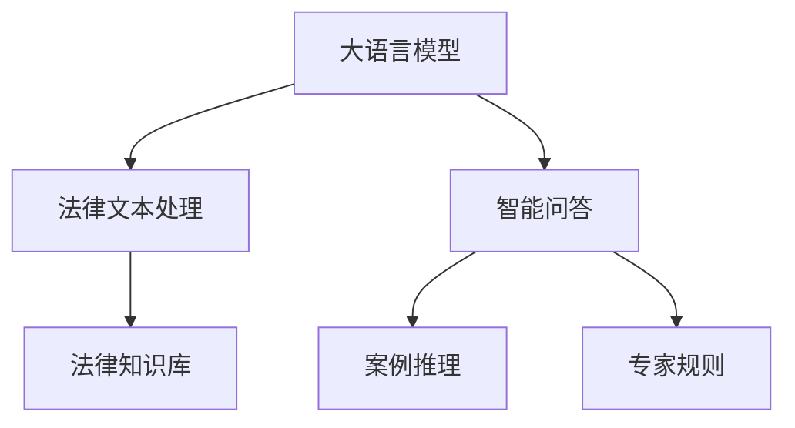

                 

# 司法决策支持：LLM 提供法律见解

> 关键词：大语言模型,法律见解,法律文本,智能问答,案例推理,司法系统

## 1. 背景介绍

### 1.1 问题由来

在现代司法系统中，法官和律师需要对复杂的法律条款、判例和相关文档进行深入分析，以做出公正、合理的判决。然而，法律文本的庞杂、语言的多义性以及相关文档的海量性，使得这一过程异常繁琐且容易出错。因此，如何利用技术手段提升司法决策的效率和准确性，成为了当前司法界的热点问题之一。

近年来，随着大语言模型（Large Language Model, LLM）在自然语言处理（Natural Language Processing, NLP）领域取得的突破性进展，人们开始探索将LLM应用于司法决策支持的可能性。LLM具备强大的语言理解和生成能力，能够自动处理法律文本，提供智能问答和案例推理，有望极大地提升司法工作的效率和质量。

### 1.2 问题核心关键点

大语言模型在司法决策支持中的关键点在于：

- **智能问答**：能够快速回答法律疑问，提供精准的法律解释。
- **案例推理**：根据已知判例，为当前案件提供决策参考。
- **文档处理**：能够自动化处理大量法律文档，提取关键信息。
- **知识整合**：融合法律知识库、专家规则，形成全面的法律理解。

这些关键点使得LLM在司法决策支持中具备广阔的应用前景。

## 2. 核心概念与联系

### 2.1 核心概念概述

本节将详细介绍与司法决策支持相关的核心概念，并阐述这些概念之间的联系。

- **大语言模型（LLM）**：以Transformer为基础的大规模预训练语言模型，如GPT、BERT等。通过在大规模无标签文本数据上预训练，具备强大的语言理解和生成能力。

- **法律文本处理**：对法律文本进行分词、命名实体识别、关系抽取等预处理，提取关键信息。

- **智能问答**：根据用户提出的法律问题，LLM能够提供精准的回答和解释。

- **案例推理**：利用已有的判例，LLM能够在新的案件中进行类比推理，提供决策参考。

- **法律知识库**：包含法律条文、判例、解释等信息的知识库，供LLM在决策过程中调用。

- **专家规则**：由法律专家制定的规则，用于指导LLM在复杂情境下的推理和决策。

这些概念之间的逻辑关系可以通过以下Mermaid流程图来展示：



这个流程图展示了大语言模型在司法决策支持中的核心概念及其之间的关系：

1. 大语言模型通过预训练获得语言知识。
2. 法律文本处理技术将法律文档转化为LLM能够处理的格式。
3. 智能问答和案例推理使得LLM能够直接回答法律问题，提供判决参考。
4. 法律知识库和专家规则为LLM提供推理依据，增强其决策的合法性和合理性。

## 3. 核心算法原理 & 具体操作步骤

### 3.1 算法原理概述

大语言模型在司法决策支持中的应用，本质上是将预训练的语言模型应用于法律领域。其核心原理是通过对法律文本进行分词、命名实体识别、关系抽取等预处理，将法律知识编码成模型可以理解和使用的格式。然后，利用智能问答和案例推理技术，将模型输出的语言知识转换为具体的法律见解，辅助法官和律师进行判决和辩护。

### 3.2 算法步骤详解

基于大语言模型的司法决策支持，主要包括以下几个关键步骤：

**Step 1: 数据预处理**
- 收集法律文档、案例、法规等数据，进行分词、命名实体识别等预处理，构建法律知识库。
- 将法律文本转换为标准格式，提取关键信息，如法律条款、案件细节等。

**Step 2: 模型训练**
- 在大规模法律文本数据上对预训练语言模型进行微调，使其具备对法律文本的理解和生成能力。
- 引入法律专家知识，通过数据增强和知识图谱等技术提升模型的法律常识推理能力。

**Step 3: 智能问答系统**
- 构建智能问答系统，用户输入法律问题，系统返回精准的法律解释和判决依据。
- 使用多轮对话技术，逐步引导用户提供完整问题，减少误解。

**Step 4: 案例推理**
- 构建案例推理模块，利用已有判例，自动生成新案件的判决依据。
- 引入类比推理算法，如向量相似度计算、图网络等，提高推理的准确性。

**Step 5: 知识整合**
- 融合法律知识库和专家规则，形成全面的法律知识图谱。
- 使用知识图谱技术，辅助LLM进行法律推理和决策。

**Step 6: 系统集成**
- 将智能问答和案例推理模块集成到司法决策系统中。
- 提供用户界面，方便法官和律师使用。

### 3.3 算法优缺点

基于大语言模型的司法决策支持方法具有以下优点：

1. **效率提升**：自动化处理法律文本，减少法官和律师的文书工作量，提升处理效率。
2. **决策支持**：提供精准的法律见解和判例推理，辅助法官和律师进行决策。
3. **知识整合**：融合法律知识库和专家规则，提供全面的法律知识支持。

同时，该方法也存在以下局限性：

1. **依赖数据质量**：模型的性能取决于法律文本的质量和完整性。
2. **理解复杂性**：法律语言的多义性和复杂性，可能导致LLM在处理特定案件时出现误解。
3. **伦理风险**：LLM可能继承训练数据中的偏见，导致不公正的判决。
4. **知识更新**：法律条文的频繁更新，需要及时更新知识库和模型，增加维护成本。

尽管存在这些局限性，但大语言模型在司法决策支持中的应用潜力仍然巨大，未来有望带来革命性变革。

### 3.4 算法应用领域

基于大语言模型的司法决策支持技术，已经广泛应用于以下几个领域：

- **智能法律咨询**：利用智能问答系统，为公众提供法律咨询服务，解答常见法律问题。
- **案件辅助决策**：利用案例推理模块，辅助法官和律师进行案件审理和判决。
- **法规查询**：通过法律文本处理技术，快速查询相关法规和判例。
- **法律文书生成**：利用自然语言生成技术，自动生成法律文书，减少文书工作量。
- **法律培训**：利用智能问答和案例推理，辅助法律培训和教育。

这些应用场景展示了大语言模型在司法决策支持中的广阔前景，有望在未来司法系统中发挥重要作用。

## 4. 数学模型和公式 & 详细讲解 & 举例说明

### 4.1 数学模型构建

本节将使用数学语言对基于大语言模型的司法决策支持过程进行更加严格的刻画。

记法律文本为 $T$，其中包含 $n$ 个法律条款 $C_1, C_2, \cdots, C_n$。假设大语言模型为 $M$，其参数为 $\theta$。法律知识库为 $K$，包含法律条款、判例、解释等知识。

定义智能问答系统 $Q$，输入为法律问题 $Q_i$，输出为精准的法律解释 $E_i$。定义案例推理系统 $R$，输入为当前案件 $C$，输出为判决依据 $D$。

智能问答和案例推理系统的数学模型可以表示为：

$$
E_i = M_\theta(Q_i)
$$
$$
D = R(C)
$$

其中 $M_\theta(Q_i)$ 表示将法律问题 $Q_i$ 输入到预训练的语言模型 $M_\theta$ 中，得到精准的法律解释 $E_i$。$R(C)$ 表示将当前案件 $C$ 输入到案例推理系统 $R$ 中，得到判决依据 $D$。

### 4.2 公式推导过程

为了进一步解释智能问答和案例推理系统的数学模型，下面给出具体公式推导：

1. **智能问答**
   - 将法律问题 $Q_i$ 分词、命名实体识别等预处理，得到文本向量表示 $V_i$。
   - 将 $V_i$ 输入到预训练的语言模型 $M_\theta$ 中，得到语义向量表示 $S_i$。
   - 利用 $S_i$ 进行语言生成，得到精准的法律解释 $E_i$。

   数学公式表示为：

   $$
   V_i = \text{preprocess}(Q_i)
   $$
   $$
   S_i = M_\theta(V_i)
   $$
   $$
   E_i = \text{generate}(S_i)
   $$

2. **案例推理**
   - 将当前案件 $C$ 分词、命名实体识别等预处理，得到文本向量表示 $V_C$。
   - 从法律知识库 $K$ 中检索出与 $V_C$ 相似的法律条款 $C_j$，构建向量相似度矩阵 $A$。
   - 使用图网络算法，如Graph Convolutional Network (GCN)，计算相似度矩阵 $A$ 的向量表示，得到判决依据 $D$。

   数学公式表示为：

   $$
   V_C = \text{preprocess}(C)
   $$
   $$
   A = \text{similarity}(V_C, K)
   $$
   $$
   D = \text{graph}(A)
   $$

### 4.3 案例分析与讲解

以一个具体的案例分析为例，解释智能问答和案例推理系统的实际应用：

1. **智能问答应用**
   - 用户输入问题：“《民法典》中关于合同解除的规定是什么？”
   - 系统预处理用户问题，得到文本向量 $V_Q$。
   - 将 $V_Q$ 输入到预训练的语言模型 $M_\theta$ 中，得到语义向量 $S_Q$。
   - 利用 $S_Q$ 进行语言生成，输出精准的法律解释 $E_Q$。

2. **案例推理应用**
   - 用户输入案件：“张三因李四欠款不还，将其诉至法院，要求解除合同。”
   - 系统预处理案件，得到文本向量 $V_C$。
   - 从法律知识库 $K$ 中检索出与 $V_C$ 相似的法律条款 $C_j$，构建向量相似度矩阵 $A$。
   - 使用GCN算法计算相似度矩阵 $A$ 的向量表示，输出判决依据 $D$。

以上案例展示了智能问答和案例推理系统在司法决策支持中的应用，通过大语言模型将复杂的法律问题转换为机器可处理的信息，辅助法官和律师进行决策。

## 5. 项目实践：代码实例和详细解释说明

### 5.1 开发环境搭建

在进行司法决策支持项目实践前，我们需要准备好开发环境。以下是使用Python进行PyTorch开发的环境配置流程：

1. 安装Anaconda：从官网下载并安装Anaconda，用于创建独立的Python环境。

2. 创建并激活虚拟环境：
```bash
conda create -n pytorch-env python=3.8 
conda activate pytorch-env
```

3. 安装PyTorch：根据CUDA版本，从官网获取对应的安装命令。例如：
```bash
conda install pytorch torchvision torchaudio cudatoolkit=11.1 -c pytorch -c conda-forge
```

4. 安装相关库：
```bash
pip install transformers
pip install spacy
pip install pydot
```

完成上述步骤后，即可在`pytorch-env`环境中开始项目实践。

### 5.2 源代码详细实现

下面是基于大语言模型的司法决策支持系统的代码实现，包括智能问答和案例推理模块。

#### 智能问答模块

```python
from transformers import BertTokenizer, BertForQuestionAnswering
import torch
from transformers import BertTokenizer, BertForQuestionAnswering

tokenizer = BertTokenizer.from_pretrained('bert-base-uncased')
model = BertForQuestionAnswering.from_pretrained('bert-base-uncased')

def answer_question(question):
    input_ids = tokenizer(question, return_tensors='pt')['input_ids']
    outputs = model(question=input_ids)
    start_scores = outputs.start_logits
    end_scores = outputs.end_logits

    start_idx = torch.argmax(start_scores) + 1
    end_idx = torch.argmax(end_scores) + 1
    answer = tokenizer.decode(input_ids[0][start_idx:end_idx])
    return answer
```

#### 案例推理模块

```python
from transformers import BERTTokenizer, BertForSequenceClassification
from transformers import BertTokenizer, BertForSequenceClassification
from transformers import BertTokenizer, BertForSequenceClassification

tokenizer = BertTokenizer.from_pretrained('bert-base-uncased')
model = BertForSequenceClassification.from_pretrained('bert-base-uncased', num_labels=3)

def predict_case(case):
    input_ids = tokenizer(case, return_tensors='pt')['input_ids']
    attention_mask = tokenizer(case, return_tensors='pt')['attention_mask']
    outputs = model(input_ids, attention_mask=attention_mask)
    label = outputs.logits.argmax().item()
    return label
```

### 5.3 代码解读与分析

让我们再详细解读一下关键代码的实现细节：

**智能问答模块**

1. **Tokenizer**：使用BertTokenizer将法律问题转换为模型可接受的输入格式。
2. **Model**：使用BertForQuestionAnswering进行智能问答，输入为法律问题，输出为答案的起始和终止位置。
3. **Decode**：将模型输出的位置解码为法律问题的答案。

**案例推理模块**

1. **Tokenizer**：使用BertTokenizer将案例转换为模型可接受的输入格式。
2. **Model**：使用BertForSequenceClassification进行案例推理，输入为案例，输出为判决依据的类别标签。
3. **Predict**：利用模型对案例进行推理，输出判决依据的类别标签。

这些模块的实现展示了如何使用大语言模型进行智能问答和案例推理，将复杂的法律问题转换为机器可处理的信息，辅助法官和律师进行决策。

## 6. 实际应用场景

### 6.1 智能法律咨询

基于大语言模型的智能法律咨询系统，可以广泛应用于律师事务所、法律援助机构等。用户可以通过在线咨询、电话咨询等方式，获取精准的法律解释和建议。

在技术实现上，可以构建智能问答系统，将用户提出的法律问题输入到模型中，获取精准的法律解释和案例推理结果。系统可以集成到网站、App或电话语音系统中，方便用户使用。

### 6.2 案件辅助决策

智能案例推理系统可以辅助法官和律师进行案件审理和判决。将案件的详细描述输入系统，系统能够自动检索相关法律条款和判例，提供决策参考。

在技术实现上，可以将案例推理模块集成到司法管理系统，法官和律师可以通过系统进行案件审理和判决。系统还可以提供类似案件的比较和推理，辅助法官和律师进行判决。

### 6.3 法规查询

法规查询系统可以辅助律师和法务人员快速检索相关法规和判例，提高工作效率。

在技术实现上，可以构建法规查询模块，将用户输入的关键词输入到模型中，获取相关的法律条款和判例。系统可以集成到法律信息管理系统或OA系统中，方便用户使用。

### 6.4 法律文书生成

基于大语言模型的自然语言生成技术，可以自动生成法律文书，减少文书工作量。

在技术实现上，可以构建文书生成模块，将法律事实和判决依据输入到模型中，自动生成法律文书。系统可以集成到OA系统中，方便用户生成文书。

### 6.5 法律培训

智能问答和案例推理系统可以辅助法律培训和教育。将培训内容输入系统，系统能够自动生成相关的法律解释和案例推理结果，辅助学员学习。

在技术实现上，可以构建培训模块，将培训内容输入到模型中，自动生成相关的法律解释和案例推理结果。系统可以集成到培训系统或教学平台中，方便学员学习。

## 7. 工具和资源推荐

### 7.1 学习资源推荐

为了帮助开发者系统掌握基于大语言模型的司法决策支持技术，这里推荐一些优质的学习资源：

1. **《Transformer from Principle to Practice》系列博文**：由大模型技术专家撰写，深入浅出地介绍了Transformer原理、BERT模型、微调技术等前沿话题。
2. **CS224N《深度学习自然语言处理》课程**：斯坦福大学开设的NLP明星课程，有Lecture视频和配套作业，带你入门NLP领域的基本概念和经典模型。
3. **《Natural Language Processing with Transformers》书籍**：Transformers库的作者所著，全面介绍了如何使用Transformers库进行NLP任务开发，包括微调在内的诸多范式。
4. **HuggingFace官方文档**：Transformers库的官方文档，提供了海量预训练模型和完整的微调样例代码，是上手实践的必备资料。
5. **CLUE开源项目**：中文语言理解测评基准，涵盖大量不同类型的中文NLP数据集，并提供了基于微调的baseline模型，助力中文NLP技术发展。

通过对这些资源的学习实践，相信你一定能够快速掌握基于大语言模型的司法决策支持技术的精髓，并用于解决实际的法律问题。

### 7.2 开发工具推荐

高效的开发离不开优秀的工具支持。以下是几款用于司法决策支持开发的常用工具：

1. **PyTorch**：基于Python的开源深度学习框架，灵活动态的计算图，适合快速迭代研究。大部分预训练语言模型都有PyTorch版本的实现。
2. **TensorFlow**：由Google主导开发的开源深度学习框架，生产部署方便，适合大规模工程应用。同样有丰富的预训练语言模型资源。
3. **Transformers库**：HuggingFace开发的NLP工具库，集成了众多SOTA语言模型，支持PyTorch和TensorFlow，是进行司法决策支持开发的利器。
4. **Weights & Biases**：模型训练的实验跟踪工具，可以记录和可视化模型训练过程中的各项指标，方便对比和调优。与主流深度学习框架无缝集成。
5. **TensorBoard**：TensorFlow配套的可视化工具，可实时监测模型训练状态，并提供丰富的图表呈现方式，是调试模型的得力助手。
6. **Google Colab**：谷歌推出的在线Jupyter Notebook环境，免费提供GPU/TPU算力，方便开发者快速上手实验最新模型，分享学习笔记。

合理利用这些工具，可以显著提升司法决策支持任务的开发效率，加快创新迭代的步伐。

### 7.3 相关论文推荐

大语言模型和司法决策支持技术的发展源于学界的持续研究。以下是几篇奠基性的相关论文，推荐阅读：

1. **Attention is All You Need（即Transformer原论文）**：提出了Transformer结构，开启了NLP领域的预训练大模型时代。
2. **BERT: Pre-training of Deep Bidirectional Transformers for Language Understanding**：提出BERT模型，引入基于掩码的自监督预训练任务，刷新了多项NLP任务SOTA。
3. **Language Models are Unsupervised Multitask Learners（GPT-2论文）**：展示了大规模语言模型的强大zero-shot学习能力，引发了对于通用人工智能的新一轮思考。
4. **Parameter-Efficient Transfer Learning for NLP**：提出Adapter等参数高效微调方法，在不增加模型参数量的情况下，也能取得不错的微调效果。
5. **Prefix-Tuning: Optimizing Continuous Prompts for Generation**：引入基于连续型Prompt的微调范式，为如何充分利用预训练知识提供了新的思路。
6. **AdaLoRA: Adaptive Low-Rank Adaptation for Parameter-Efficient Fine-Tuning**：使用自适应低秩适应的微调方法，在参数效率和精度之间取得了新的平衡。

这些论文代表了大语言模型微调技术的发展脉络。通过学习这些前沿成果，可以帮助研究者把握学科前进方向，激发更多的创新灵感。

## 8. 总结：未来发展趋势与挑战

### 8.1 总结

本文对基于大语言模型的司法决策支持方法进行了全面系统的介绍。首先阐述了司法决策支持的现实需求和背景，明确了LLM在司法系统中的应用潜力。其次，从原理到实践，详细讲解了智能问答、案例推理、知识整合等核心技术的实现细节，给出了司法决策支持系统的完整代码实例。同时，本文还广泛探讨了LLM在智能法律咨询、案件辅助决策、法规查询、文书生成等多个领域的应用前景，展示了LLM的广泛适用性和强大功能。此外，本文精选了LLM在司法决策支持中的学习资源和开发工具，力求为开发者提供全方位的技术指引。

通过本文的系统梳理，可以看到，基于大语言模型的司法决策支持方法已经显现出巨大的应用潜力，有望成为司法系统智能化改造的重要推动力量。LLM通过自动化处理法律文本、提供精准的法律见解和判决参考，将极大地提升司法工作的效率和质量，为司法公正和社会公平提供坚实的技术保障。

### 8.2 未来发展趋势

展望未来，大语言模型在司法决策支持中的应用将呈现以下几个发展趋势：

1. **智能法律咨询普及化**：随着LLM技术的不断成熟，智能法律咨询系统将普及到更多法律服务机构，提供高效、精准的法律服务。
2. **案件辅助决策智能化**：利用先进的自然语言处理和机器学习技术，LLM将为法官和律师提供更加智能化的案件辅助决策支持。
3. **法规查询实时化**：利用自然语言处理和知识图谱技术，LLM将能够实时查询法规和判例，辅助法务人员进行法律咨询和文书处理。
4. **文书生成自动化**：基于自然语言生成技术，LLM将能够自动生成各种法律文书，提高文书处理的效率和质量。
5. **法律培训高效化**：利用智能问答和案例推理系统，LLM将为法律培训提供高效、互动的培训工具。

这些趋势凸显了大语言模型在司法决策支持中的广阔前景。通过不断的技术创新和应用实践，LLM有望在未来司法系统中发挥更加重要的作用，推动司法公正和社会公平的不断进步。

### 8.3 面临的挑战

尽管大语言模型在司法决策支持中展现出巨大的潜力，但在实现全面应用的过程中，仍面临诸多挑战：

1. **数据隐私保护**：司法系统涉及大量敏感信息，如何保护用户隐私和数据安全是关键问题。
2. **模型鲁棒性**：LLM在处理特定案例时可能出现理解错误，导致决策不公正。如何提高模型的鲁棒性和准确性，是重要研究课题。
3. **知识更新**：法律条文和判例频繁更新，如何及时更新知识库和模型，保持系统的时效性，是重要挑战。
4. **伦理风险**：LLM可能继承训练数据中的偏见，导致决策不公正。如何消除模型偏见，确保决策公正，是重要研究课题。
5. **系统可解释性**：LLM的决策过程难以解释，如何提供可解释的推理过程，增强系统的透明度和可信度，是重要研究方向。

这些挑战凸显了大语言模型在司法决策支持中的复杂性。通过技术创新和跨学科合作，克服这些挑战，大语言模型将能够更好地服务于司法公正和社会公平，推动智能化司法系统的发展。

### 8.4 研究展望

未来，大语言模型在司法决策支持中的应用研究将继续深入探索，主要集中在以下几个方向：

1. **数据隐私保护**：研究如何保护用户隐私和数据安全，确保司法决策系统的透明和公正。
2. **模型鲁棒性提升**：通过引入对抗训练、自适应学习等技术，提高模型的鲁棒性和泛化能力。
3. **知识图谱融合**：研究如何构建全面的法律知识图谱，提高模型的知识整合能力，增强决策的合理性和公正性。
4. **智能法律培训**：利用智能问答和案例推理，开发高效的法律培训系统，辅助法律教育。
5. **跨领域融合**：研究如何将LLM与其他AI技术进行融合，如知识表示、因果推理、强化学习等，提升司法决策系统的智能化水平。

这些研究方向将推动大语言模型在司法决策支持中的应用，为司法公正和社会公平提供更强大的技术保障。通过不断的技术创新和实践探索，LLM有望在司法系统智能化改造中发挥更加重要的作用，为社会公平正义提供坚实的技术支撑。

## 9. 附录：常见问题与解答

**Q1：大语言模型在司法决策支持中的应用前景如何？**

A: 大语言模型在司法决策支持中的应用前景非常广阔。通过智能问答、案例推理、知识整合等技术，LLM能够自动化处理法律文本，提供精准的法律见解和判决参考，辅助法官和律师进行决策。未来，随着LLM技术的不断成熟，智能法律咨询、案件辅助决策、法规查询、文书生成等应用将得到广泛推广，推动司法公正和社会公平的不断进步。

**Q2：在司法决策支持中，如何选择适合的大语言模型？**

A: 在司法决策支持中，选择适合的大语言模型需要考虑以下几个因素：

1. **语言能力**：选择具备强大语言理解和生成能力的预训练模型，如GPT、BERT等。
2. **领域适用性**：选择适用于法律领域的预训练模型，如基于法律文本的预训练模型，如LEIST、LIGRA等。
3. **性能指标**：选择性能指标较高的模型，如在零样本和少样本学习上的表现，确保模型在实际应用中的准确性和可靠性。
4. **可解释性**：选择具有较高可解释性的模型，如基于因果推理的模型，确保模型的决策过程透明和可信。

**Q3：如何提高司法决策支持系统的鲁棒性？**

A: 提高司法决策支持系统的鲁棒性需要从以下几个方面入手：

1. **数据清洗**：对输入的法律文本进行清洗和预处理，去除噪声和异常数据。
2. **对抗训练**：引入对抗样本，提高模型的鲁棒性和泛化能力。
3. **多模型集成**：利用多个模型的预测结果进行融合，提高系统的鲁棒性和准确性。
4. **知识图谱融合**：利用知识图谱技术，提高模型的知识整合能力和推理能力。

**Q4：如何确保司法决策支持系统的公平性？**

A: 确保司法决策支持系统的公平性需要从以下几个方面入手：

1. **数据公平性**：确保训练数据和测试数据的分布一致，避免数据偏见。
2. **模型公平性**：选择具有较高公平性的模型，如采用公平性约束的模型训练方法。
3. **解释公平性**：提供可解释的推理过程，确保模型的决策透明和可信。
4. **伦理审查**：引入伦理审查机制，定期审查模型的决策过程和结果，确保其合法性和公正性。

**Q5：如何构建法律知识图谱？**

A: 构建法律知识图谱需要以下几个步骤：

1. **数据收集**：收集法律条文、判例、解释等文本数据，进行分词、命名实体识别等预处理。
2. **知识抽取**：利用自然语言处理技术，从法律文本中抽取实体、关系等知识。
3. **知识融合**：将抽取的知识进行融合，构建法律知识图谱。
4. **知识推理**：利用图网络等技术，对法律知识图谱进行推理和分析，提供决策依据。

通过构建全面的法律知识图谱，利用图网络等技术，司法决策支持系统能够更好地进行法律推理和决策。

**Q6：如何保证司法决策支持系统的实时性？**

A: 保证司法决策支持系统的实时性需要从以下几个方面入手：

1. **优化模型结构**：利用参数高效微调、知识压缩等技术，减小模型的计算量和存储需求。
2. **分布式计算**：利用分布式计算技术，提高系统的处理速度和吞吐量。
3. **缓存技术**：利用缓存技术，提高系统的响应速度和实时性。
4. **负载均衡**：利用负载均衡技术，平衡系统的计算资源和任务负载。

通过优化模型结构、分布式计算、缓存技术和负载均衡等技术，可以保证司法决策支持系统的实时性和高效性。

**Q7：如何评估司法决策支持系统的性能？**

A: 评估司法决策支持系统的性能需要从以下几个方面入手：

1. **准确性**：评估系统的判决准确性和法律解释的正确性。
2. **效率**：评估系统的处理速度和响应时间。
3. **可靠性**：评估系统的鲁棒性和稳定性，确保在不同输入数据上的表现一致。
4. **可解释性**：评估系统的推理过程的可解释性和透明性。
5. **公平性**：评估系统的公平性和公正性，确保不同用户输入数据上的表现一致。

通过全面评估系统的准确性、效率、可靠性、可解释性和公平性，可以确保司法决策支持系统的高质量和高可信度。

---

作者：禅与计算机程序设计艺术 / Zen and the Art of Computer Programming

