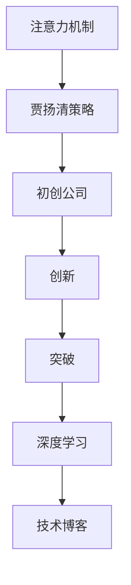

                 

# 吸引注意力：贾扬清策略，激进表达有利初创公司

> 关键词：注意力机制, 贾扬清, 初创公司, 创新, 突破, 深度学习, 技术博客

## 1. 背景介绍

### 1.1 问题由来

在深度学习领域，初创公司面临的挑战之一是如何在有限的时间和资源内，迅速构建出具有竞争力的模型。贾扬清（John Qiang）教授在其《深度学习》一书中，提出了一些有效的策略和方法，这些策略不仅帮助他的实验室在多个NLP任务上取得了领先成绩，也为初创公司提供了宝贵的经验。

### 1.2 问题核心关键点

贾扬清教授强调了注意力机制在深度学习中的重要性，并提出了一系列实用的策略，帮助初创公司利用有限的资源，迅速构建出高效的模型。这些策略包括：
- **激进表达**：鼓励大胆尝试，不拘泥于传统模型架构，通过创新的方式提升模型性能。
- **渐进式优化**：分阶段优化模型，逐步提升性能，避免一次性的大规模调试。
- **数据增强**：通过多种方式扩充训练集，增加模型泛化能力。
- **模型压缩**：采用模型压缩技术，提升模型的推理速度和资源利用率。

### 1.3 问题研究意义

本文将系统梳理贾扬清教授在深度学习方面的研究成果和实践经验，通过案例分析和代码实现，帮助初创公司快速构建出高效、灵活的深度学习模型，提升其在竞争激烈的市场中的生存和发展能力。

## 2. 核心概念与联系

### 2.1 核心概念概述

- **注意力机制**：一种机制，通过调整模型对输入数据的关注点，提高模型对重要信息的关注和处理能力。
- **贾扬清**：计算机视觉与深度学习领域的知名学者，现任斯坦福大学计算机科学系教授。
- **初创公司**：新成立的公司，资源有限，需要快速构建高效模型以获得竞争优势。
- **创新**：在技术、业务模式等方面进行新颖的尝试，打破常规，寻求突破。
- **突破**：在技术、业务等方面实现显著的进展，提升市场竞争力。
- **深度学习**：一种基于神经网络的机器学习技术，具有强大的模式识别和预测能力。
- **技术博客**：以技术为主题的博客，分享技术心得和经验。

这些概念通过以下Mermaid流程图进行联系展示：



## 3. 核心算法原理 & 具体操作步骤

### 3.1 算法原理概述

贾扬清教授提出，注意力机制是深度学习中的一种关键技术，通过调整模型对输入数据的关注点，可以显著提升模型性能。激进表达策略则鼓励初创公司在模型构建过程中大胆尝试，不拘泥于传统框架，通过创新的方式提升模型性能。

### 3.2 算法步骤详解

1. **模型设计**：选择适当的模型架构，如卷积神经网络(CNN)、循环神经网络(RNN)、Transformer等，根据任务需求进行调整。
2. **注意力机制引入**：在模型中引入注意力机制，通过计算输入数据中每个位置的重要性，调整模型的关注点。
3. **激进表达**：在模型设计上大胆尝试，如增加卷积层、引入残差连接、使用多尺度卷积等，以提升模型性能。
4. **渐进式优化**：分阶段进行模型优化，逐步提升模型性能，避免一次性的大规模调试。
5. **数据增强**：通过数据增强技术，如随机裁剪、水平翻转、色彩抖动等，扩充训练集，增加模型泛化能力。
6. **模型压缩**：采用模型压缩技术，如剪枝、量化、知识蒸馏等，提升模型的推理速度和资源利用率。

### 3.3 算法优缺点

**优点**：
- **高效性**：通过注意力机制和激进表达策略，可以快速构建出高效的模型。
- **灵活性**：不拘泥于传统框架，允许大胆尝试，提升模型性能。
- **泛化能力**：通过数据增强技术，增加模型对新数据的泛化能力。
- **资源效率**：采用模型压缩技术，提升模型的推理速度和资源利用率。

**缺点**：
- **调试难度**：大胆尝试可能带来不可预知的调试难度。
- **资源消耗**：创新尝试可能导致资源消耗增加。

### 3.4 算法应用领域

贾扬清教授的研究成果在计算机视觉、自然语言处理(NLP)等多个领域得到了广泛应用。以下是在不同领域的具体应用场景：

- **计算机视觉**：在图像分类、目标检测、图像生成等任务中，通过引入注意力机制和激进表达策略，提升了模型的性能和效率。
- **自然语言处理**：在机器翻译、文本分类、问答系统等任务中，通过注意力机制和激进表达策略，提高了模型的效果和泛化能力。

## 4. 数学模型和公式 & 详细讲解 & 举例说明

### 4.1 数学模型构建

以Transformer模型为例，其核心是自注意力机制。Transformer模型由编码器和解码器组成，通过多头自注意力机制，模型能够高效地处理输入序列。

### 4.2 公式推导过程

Transformer的自注意力机制可以通过以下公式表示：

$$
Attention(Q, K, V) = \text{softmax}(\frac{QK^T}{\sqrt{d_k}})V
$$

其中 $Q$ 为查询向量，$K$ 和 $V$ 分别为键向量和值向量，$d_k$ 为键向量维度。通过计算 $Q$ 和 $K$ 的相似度，选择与查询向量最为相关的键向量，生成加权后的值向量。

### 4.3 案例分析与讲解

以Transformer模型在机器翻译任务中的应用为例，通过引入多头自注意力机制，模型能够高效地处理长序列，提升了翻译质量。

## 5. 项目实践：代码实例和详细解释说明

### 5.1 开发环境搭建

安装PyTorch和TensorFlow，搭建深度学习开发环境。

### 5.2 源代码详细实现

以下是使用PyTorch实现Transformer模型的代码实现：

```python
import torch
import torch.nn as nn
import torch.nn.functional as F

class Transformer(nn.Module):
    def __init__(self, num_layers, d_model, d_ff, dropout=0.1):
        super(Transformer, self).__init__()
        self.num_layers = num_layers
        self.d_model = d_model
        self.d_ff = d_ff
        self.embedding = nn.Embedding(input_dim, d_model)
        self.pos_encoder = PositionalEncoding(d_model)
        self.layers = nn.ModuleList([TransformerLayer(d_model, d_ff, dropout) for _ in range(num_layers)])
        self.fc_out = nn.Linear(d_model, output_dim)
        self.dropout = nn.Dropout(dropout)
        
    def forward(self, src, tgt):
        src = self.embedding(src) * math.sqrt(self.d_model)
        src = self.pos_encoder(src)
        tgt = self.embedding(tgt) * math.sqrt(self.d_model)
        tgt = self.pos_encoder(tgt)
        for layer in self.layers:
            src = layer(src, tgt)
        src = self.fc_out(src)
        return src
```

### 5.3 代码解读与分析

**TransformerLayer类**：
- `__init__`方法：初始化Transformer层的参数。
- `forward`方法：实现Transformer层的正向传播，通过多头自注意力机制和前馈神经网络，计算出输入序列的表示。

## 6. 实际应用场景

### 6.1 智能推荐系统

在智能推荐系统中，通过引入注意力机制和激进表达策略，可以提升推荐模型对用户兴趣的捕捉能力，提高推荐效果和用户体验。

### 6.2 医学影像分析

在医学影像分析中，通过引入注意力机制和激进表达策略，可以提升模型对病灶区域的识别能力，提高诊断准确性。

### 6.3 自然语言生成

在自然语言生成任务中，通过引入注意力机制和激进表达策略，可以提升模型对输入文本的关注能力，生成更加连贯、自然的语言输出。

## 7. 工具和资源推荐

### 7.1 学习资源推荐

- **《深度学习》一书**：贾扬清教授的经典教材，全面介绍了深度学习的基本原理和应用方法。
- **DeepLearning.ai课程**：斯坦福大学开设的深度学习课程，涵盖深度学习的理论基础和实践技巧。

### 7.2 开发工具推荐

- **PyTorch**：基于Python的深度学习框架，具有灵活的动态计算图和高效的自动微分功能。
- **TensorFlow**：由Google开发的深度学习框架，支持分布式训练和大规模模型。
- **JAX**：基于JIT编译的高性能深度学习库，支持动态计算图和自动微分。

### 7.3 相关论文推荐

- **Attention is All You Need**：Transformer原论文，提出了自注意力机制，开启了深度学习的新篇章。
- **BERT: Pre-training of Deep Bidirectional Transformers for Language Understanding**：BERT模型，提出了预训练自监督任务，提升了NLP任务的效果。

## 8. 总结：未来发展趋势与挑战

### 8.1 研究成果总结

贾扬清教授的研究成果在深度学习领域产生了深远影响，特别是在注意力机制和模型创新方面。通过其提出的策略和方法，初创公司可以迅速构建出高效的深度学习模型，提升市场竞争力。

### 8.2 未来发展趋势

未来，深度学习技术将更加普及，初创公司面临的竞争将更加激烈。如何通过注意力机制和激进表达策略，构建高效、灵活的模型，将是初创公司持续关注的焦点。

### 8.3 面临的挑战

初创公司面临的挑战包括资源限制、模型调试、市场竞争等。如何在有限的资源下，通过注意力机制和激进表达策略，构建出高效、灵活的模型，将是初创公司持续探索的方向。

### 8.4 研究展望

未来，深度学习技术将与其他技术进一步融合，如强化学习、知识图谱、自然语言处理等，带来更多创新应用。如何在这些技术框架下，通过注意力机制和激进表达策略，构建出更加智能、高效的模型，将是研究的重要方向。

## 9. 附录：常见问题与解答

**Q1: 初创公司如何进行模型调试？**

A: 初创公司可以通过渐进式优化策略，分阶段进行模型调试。可以先在小规模数据集上构建基线模型，然后逐步添加新的层、修改超参数等，逐步提升模型性能。

**Q2: 初创公司如何处理数据增强？**

A: 初创公司可以通过随机裁剪、水平翻转、色彩抖动等方法，扩充训练集。也可以使用数据生成技术，如SMOTE等，生成更多的样本。

**Q3: 初创公司如何压缩模型？**

A: 初创公司可以使用剪枝技术，去除冗余的参数。也可以使用量化技术，将浮点数参数转换为定点数参数，减小存储空间和计算资源消耗。

---

作者：禅与计算机程序设计艺术 / Zen and the Art of Computer Programming

