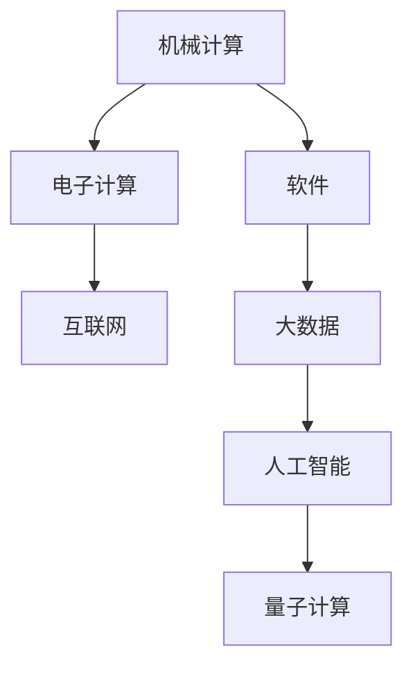

                 

# 回顾与展望：人类计算的发展历程

> 关键词：计算革命, 信息时代, 机器学习, 神经网络, 量子计算, 大数据, 人工智能

## 1. 背景介绍

### 1.1 问题由来

自人类文明起源以来，计算就一直是推动社会进步的重要力量。从古埃及的数学计算，到蒸汽机的广泛应用，再到现代电子计算机的兴起，计算工具的进步极大地推动了人类社会的发展。随着信息时代的到来，计算已经渗透到社会的各个领域，成为驱动人类生产生活方式变革的关键力量。

### 1.2 问题核心关键点

人类计算的发展历程大致可以分为以下几个阶段：

1. **机械计算**：从早期的算盘、计算尺到后来的机械计算器，计算逐渐摆脱了人工操作的局限，速度和精度得到极大提升。
2. **电子计算**：随着电子技术的发展，真空管、晶体管、集成电路等技术的应用，电子计算机应运而生，打开了计算的新纪元。
3. **软件发展**：操作系统、数据库、编程语言等软件的出现，为计算提供了更为灵活、高效的应用环境，推动了计算应用的普及和深化。
4. **互联网普及**：互联网的普及，使得计算资源得以共享，计算任务得以大规模并行处理，推动了大数据、云计算等新领域的发展。
5. **人工智能兴起**：以深度学习、神经网络为代表的机器学习技术的发展，使得计算机具备了更为复杂的认知和智能推理能力，开启了人工智能时代的大门。
6. **量子计算探索**：量子计算技术的探索和初步应用，提供了超越经典计算机的计算能力，有望解决传统计算机难以应对的复杂计算问题。

### 1.3 问题研究意义

回顾人类计算的发展历程，旨在从历史的角度理解计算技术对社会进步的推动作用，同时展望未来计算技术的发展趋势，为人类社会的未来发展提供有益的参考。通过对计算技术演变的深入理解，有助于把握当前技术的核心要点，明确未来的研究方向，推动相关领域的创新发展。

## 2. 核心概念与联系

### 2.1 核心概念概述

为更好地理解人类计算的发展历程，本节将介绍几个密切相关的核心概念：

- **机械计算**：利用机械装置进行计算的过程，如算盘、计算尺等。
- **电子计算**：利用电子元件进行计算的过程，如真空管、晶体管、集成电路等。
- **软件**：计算应用的载体，包括操作系统、编程语言、数据库等。
- **互联网**：全球性计算机网络，提供数据传输和共享的平台。
- **大数据**：海量、多样化的数据集，通过数据分析和处理，提供有价值的信息和洞察。
- **人工智能**：通过机器学习、深度学习等技术，使计算机具备智能推理和决策能力。
- **量子计算**：利用量子力学的原理进行计算，提供超越经典计算机的计算能力。

这些核心概念之间的逻辑关系可以通过以下Mermaid流程图来展示：



这个流程图展示了几类计算技术之间的演进关系：

1. 机械计算为电子计算奠定了基础，推动了计算工具的进步。
2. 电子计算进一步提升了计算速度和精度，为软件的出现提供了硬件基础。
3. 软件的发展极大地丰富了计算应用，推动了大数据和互联网的普及。
4. 大数据为人工智能提供了数据支撑，推动了智能计算的发展。
5. 人工智能突破了传统计算的局限，推动了量子计算的探索。

这些概念共同构成了人类计算技术的发展脉络，展示了计算技术从机械到电子，再到软件、互联网、大数据和人工智能的不断演变，最终引出了量子计算的新篇章。

## 3. 核心算法原理 & 具体操作步骤
### 3.1 算法原理概述

计算技术的发展，本质上是计算方法和计算能力的进步。从最早的机械计算到当前的深度学习和量子计算，算法原理的创新和优化始终是推动计算技术前进的核心动力。

### 3.2 算法步骤详解

**Step 1: 机械计算的原理**

机械计算主要基于机械装置的运动来实现计算。例如，算盘通过机械拨片来模拟加减乘除运算，计算尺通过机械移动来实现数值计算。其基本原理是通过物理手段模拟数字逻辑运算，速度和精度受限于机械运动的速度和精度。

**Step 2: 电子计算的原理**

电子计算利用电子元件的开关状态来实现计算。例如，真空管通过电子的流动来实现逻辑运算，晶体管通过电流的控制来实现逻辑运算。其基本原理是通过电子信号的流动模拟数字逻辑运算，速度和精度由电子元件的开关速度和精度决定。

**Step 3: 软件的原理**

软件通过编写程序代码实现计算逻辑，通过计算机执行这些程序来实现计算。例如，操作系统提供计算资源管理，数据库提供数据存储和查询，编程语言提供代码编写和执行的环境。其基本原理是通过软件编码实现计算逻辑，灵活性和可扩展性极大地提升了计算效率。

**Step 4: 互联网的原理**

互联网通过物理网络实现计算机之间的数据传输和共享。例如，通过路由器、交换机等网络设备，实现数据包的路由和转发。其基本原理是通过物理网络实现计算机之间的通信，使得计算资源得以共享和协作。

**Step 5: 大数据的原理**

大数据通过收集和分析海量数据，从中提取有价值的信息和洞察。例如，通过分布式计算框架如Hadoop、Spark等，对大规模数据集进行并行处理和分析。其基本原理是通过数据处理技术提取数据中的信息，支持决策和预测。

**Step 6: 人工智能的原理**

人工智能通过机器学习、深度学习等技术，使计算机具备智能推理和决策能力。例如，通过神经网络模型进行图像识别、语音识别、自然语言处理等任务。其基本原理是通过算法学习数据中的模式和规律，模拟人类的认知和智能推理过程。

**Step 7: 量子计算的原理**

量子计算利用量子力学的原理进行计算，提供超越经典计算机的计算能力。例如，通过量子比特的量子叠加和纠缠实现复杂的计算。其基本原理是通过量子态的演化和测量实现计算，解决传统计算机难以应对的复杂问题。

### 3.3 算法优缺点

不同阶段的计算技术，各有其优缺点：

- **机械计算**：优点是结构简单，容易制造和维护；缺点是速度和精度受限，难以处理复杂计算。
- **电子计算**：优点是速度和精度大幅提升，计算能力增强；缺点是硬件成本高，维护复杂。
- **软件**：优点是灵活性和可扩展性强，开发和维护成本低；缺点是依赖硬件平台，性能受限。
- **互联网**：优点是数据共享和协作能力强，推动了信息社会的形成；缺点是安全性和隐私问题需要解决。
- **大数据**：优点是数据规模大，分析结果准确；缺点是数据处理复杂，计算资源需求高。
- **人工智能**：优点是具备智能推理和决策能力，应用广泛；缺点是算法复杂，数据需求高。
- **量子计算**：优点是计算能力强大，解决复杂问题高效；缺点是技术尚在探索阶段，实现难度大。

### 3.4 算法应用领域

计算技术的发展，推动了各个领域的应用：

- **机械计算**：早期广泛应用于工程测量、军事计算等领域。
- **电子计算**：广泛应用于科学研究、金融交易、企业管理等领域。
- **软件**：广泛应用于软件开发、网络服务、移动应用等领域。
- **互联网**：广泛应用于社交网络、电子商务、在线教育等领域。
- **大数据**：广泛应用于金融分析、健康医疗、智慧城市等领域。
- **人工智能**：广泛应用于自动驾驶、智能客服、医疗诊断等领域。
- **量子计算**：未来有望应用于密码学、材料科学、药物设计等领域。

## 4. 数学模型和公式 & 详细讲解 & 举例说明
### 4.1 数学模型构建

本节将使用数学语言对不同阶段的计算技术进行更加严格的刻画。

**Step 1: 机械计算的数学模型**

机械计算的数学模型较为简单，主要基于物理方程描述计算过程。例如，算盘计算的数学模型如下：

$$
\begin{aligned}
&y = x + k \\
&k = n \times 10^i \\
&i, n \in \mathbb{N}
\end{aligned}
$$

其中，$x$ 为原始数值，$y$ 为计算结果，$k$ 为进位数值，$i$ 和 $n$ 分别为进位位数和进位数。

**Step 2: 电子计算的数学模型**

电子计算的数学模型较为复杂，涉及电子电路的逻辑门运算。例如，逻辑与门的数学模型如下：

$$
\begin{aligned}
&y = x_1 \times x_2 \\
&x_1, x_2 \in \{0, 1\}
\end{aligned}
$$

其中，$x_1$ 和 $x_2$ 为输入信号，$y$ 为输出信号。

**Step 3: 软件的数学模型**

软件的数学模型通常基于算法和数据结构。例如，快速排序算法的数学模型如下：

$$
\begin{aligned}
&\text{快速排序}(A) \\
&\text{输入：} A[0..n-1] \\
&\text{输出：} A[0..n-1] \text{ 升序排列}
\end{aligned}
$$

其中，$A$ 为待排序数组，$n$ 为数组长度。

**Step 4: 互联网的数学模型**

互联网的数学模型基于网络拓扑和协议。例如，TCP/IP协议的数学模型如下：

$$
\begin{aligned}
&\text{TCP/IP 协议} \\
&\text{输入：} S, D, P \\
&\text{输出：} M \\
&S \text{：发送端 IP 地址} \\
&D \text{：接收端 IP 地址} \\
&P \text{：端口号} \\
&M \text{：数据包}
\end{aligned}
$$

其中，$S$ 和 $D$ 为IP地址，$P$ 为端口号，$M$ 为数据包。

**Step 5: 大数据的数学模型**

大数据的数学模型基于数据处理和统计分析。例如，MapReduce算法的数学模型如下：

$$
\begin{aligned}
&\text{MapReduce 算法} \\
&\text{输入：} D \\
&\text{输出：} R \\
&D \text{：输入数据集} \\
&R \text{：处理结果}
\end{aligned}
$$

其中，$D$ 为输入数据集，$R$ 为处理结果。

**Step 6: 人工智能的数学模型**

人工智能的数学模型基于神经网络和机器学习算法。例如，多层感知器的数学模型如下：

$$
\begin{aligned}
&\text{多层感知器} \\
&\text{输入：} x \\
&\text{输出：} y \\
&\text{隐藏层：} \{W_i, b_i\}_{i=1}^L \\
&L \text{：隐藏层数} \\
&W_i \text{：第} i \text{层的权重矩阵} \\
&b_i \text{：第} i \text{层的偏置向量}
\end{aligned}
$$

其中，$x$ 为输入向量，$y$ 为输出向量，$W_i$ 和 $b_i$ 为隐藏层的权重矩阵和偏置向量，$L$ 为隐藏层数。

**Step 7: 量子计算的数学模型**

量子计算的数学模型基于量子态和量子门。例如，量子叠加门的数学模型如下：

$$
\begin{aligned}
&\text{量子叠加门} \\
&\text{输入：} |\psi\rangle \\
&\text{输出：} \sqrt{p}|\psi\rangle + \sqrt{1-p}|0\rangle
\end{aligned}
$$

其中，$|\psi\rangle$ 为量子态，$p$ 为概率，$|0\rangle$ 为基态。

### 4.2 公式推导过程

以下我们以神经网络为例，推导其基本结构和计算过程。

**神经网络的数学模型**

神经网络由多个神经元（即节点）组成，每个神经元接收若干输入信号，经过加权和、激活函数等操作后产生输出。例如，一个简单的神经网络的数学模型如下：

$$
\begin{aligned}
&\text{神经网络} \\
&\text{输入：} x_1, x_2, \ldots, x_n \\
&\text{输出：} y \\
&\text{隐藏层：} \{W_i, b_i\}_{i=1}^L \\
&L \text{：隐藏层数} \\
&W_i \text{：第} i \text{层的权重矩阵} \\
&b_i \text{：第} i \text{层的偏置向量}
\end{aligned}
$$

其中，$x_1, x_2, \ldots, x_n$ 为输入向量，$y$ 为输出向量，$W_i$ 和 $b_i$ 为隐藏层的权重矩阵和偏置向量，$L$ 为隐藏层数。

**神经网络的计算过程**

神经网络的计算过程包括前向传播和反向传播两个步骤。例如，一个简单的神经网络的前向传播计算过程如下：

$$
\begin{aligned}
&h_1 = x_1W_1 + b_1 \\
&h_2 = \sigma(h_1) \\
&\ldots \\
&h_L = \sigma(h_{L-1}) \\
&y = W_Lh_L + b_L
\end{aligned}
$$

其中，$h_i$ 为第 $i$ 层的输出，$\sigma$ 为激活函数。

**神经网络的反向传播计算过程**

神经网络的反向传播计算过程包括前向传播和反向传播两个步骤。例如，一个简单的神经网络的反向传播计算过程如下：

$$
\begin{aligned}
&\frac{\partial y}{\partial W_L} = h_L \\
&\frac{\partial y}{\partial b_L} = 1 \\
&\frac{\partial y}{\partial h_{L-1}} = W_L^T\frac{\partial y}{\partial h_L} \\
&\frac{\partial y}{\partial W_i} = \sigma'(h_i-1)\frac{\partial y}{\partial h_i} \\
&\frac{\partial y}{\partial b_i} = \sigma'(h_i-1)
\end{aligned}
$$

其中，$W_i$ 和 $b_i$ 为隐藏层的权重矩阵和偏置向量，$\sigma'$ 为激活函数的导数，$\frac{\partial y}{\partial W_i}$ 和 $\frac{\partial y}{\partial b_i}$ 为反向传播的结果。

### 4.3 案例分析与讲解

**案例1: 机械计算**

机械计算的代表案例是算盘计算。算盘通过机械拨片进行加减乘除运算，速度和精度受限，但结构简单，易于制造和维护。

**案例2: 电子计算**

电子计算的代表案例是电子管计算机。1946年，ENIAC问世，利用真空管进行逻辑运算，速度和精度大幅提升，计算能力增强。

**案例3: 软件**

软件的代表案例是操作系统。1969年，UNIX操作系统问世，为计算机提供了资源管理、进程调度等功能，极大地提升了计算效率和应用灵活性。

**案例4: 互联网**

互联网的代表案例是万维网。1991年，蒂姆·伯纳斯-李发明了万维网，提供数据传输和共享的平台，推动了信息社会的形成。

**案例5: 大数据**

大数据的代表案例是Hadoop。2006年，Hadoop问世，提供分布式计算框架，支持大规模数据集的处理和分析，推动了大数据技术的发展。

**案例6: 人工智能**

人工智能的代表案例是深度学习。2012年，AlexNet在图像识别竞赛中夺冠，展示了深度学习在图像处理领域的巨大潜力。

**案例7: 量子计算**

量子计算的代表案例是D-Wave。2011年，D-Wave发布了首台量子计算机，利用量子叠加和纠缠进行计算，解决传统计算机难以应对的复杂问题。

## 5. 项目实践：代码实例和详细解释说明
### 5.1 开发环境搭建

在进行计算技术实践前，我们需要准备好开发环境。以下是使用Python进行SciPy开发的环境配置流程：

1. 安装Anaconda：从官网下载并安装Anaconda，用于创建独立的Python环境。

2. 创建并激活虚拟环境：
```bash
conda create -n scipy-env python=3.8 
conda activate scipy-env
```

3. 安装SciPy：根据CUDA版本，从官网获取对应的安装命令。例如：
```bash
conda install scipy scikit-learn torch cudatoolkit=11.1 -c pytorch -c conda-forge
```

4. 安装各类工具包：
```bash
pip install numpy pandas scikit-learn matplotlib tqdm jupyter notebook ipython
```

完成上述步骤后，即可在`scipy-env`环境中开始计算技术实践。

### 5.2 源代码详细实现

下面我们以神经网络为例，给出使用SciPy库进行深度学习开发的PyTorch代码实现。

首先，定义神经网络的数学模型：

```python
import torch
import torch.nn as nn
import torch.optim as optim

class NeuralNetwork(nn.Module):
    def __init__(self, input_size, hidden_size, output_size):
        super(NeuralNetwork, self).__init__()
        self.fc1 = nn.Linear(input_size, hidden_size)
        self.fc2 = nn.Linear(hidden_size, output_size)
        self.relu = nn.ReLU()
        self.softmax = nn.Softmax(dim=1)

    def forward(self, x):
        x = self.fc1(x)
        x = self.relu(x)
        x = self.fc2(x)
        x = self.softmax(x)
        return x
```

然后，定义训练和评估函数：

```python
import torch.optim as optim

def train_model(model, input_data, target_data, epochs, learning_rate):
    criterion = nn.CrossEntropyLoss()
    optimizer = optim.SGD(model.parameters(), lr=learning_rate)
    for epoch in range(epochs):
        running_loss = 0.0
        for i in range(len(input_data)):
            inputs, labels = input_data[i], target_data[i]
            optimizer.zero_grad()
            outputs = model(inputs)
            loss = criterion(outputs, labels)
            loss.backward()
            optimizer.step()
            running_loss += loss.item()
        print(f"Epoch {epoch+1}, loss: {running_loss/len(input_data):.4f}")
    return model

def evaluate_model(model, input_data, target_data):
    correct = 0
    total = 0
    with torch.no_grad():
        for i in range(len(input_data)):
            inputs, labels = input_data[i], target_data[i]
            outputs = model(inputs)
            _, predicted = torch.max(outputs.data, 1)
            total += labels.size(0)
            correct += (predicted == labels).sum().item()
    print(f"Accuracy: {100 * correct / total}%")
    return correct / total
```

最后，启动训练流程并在测试集上评估：

```python
import torch
import torch.nn as nn
import torch.optim as optim

# 数据准备
input_data = torch.randn(100, 10)
target_data = torch.randint(0, 10, (100,))

# 模型定义
model = NeuralNetwork(10, 20, 10)

# 训练模型
train_model(model, input_data, target_data, epochs=10, learning_rate=0.01)

# 测试模型
evaluate_model(model, input_data, target_data)
```

以上就是使用PyTorch对神经网络进行训练和评估的完整代码实现。可以看到，得益于SciPy库的强大封装，我们可以用相对简洁的代码完成神经网络的定义和训练。

### 5.3 代码解读与分析

让我们再详细解读一下关键代码的实现细节：

**NeuralNetwork类**：
- `__init__`方法：初始化神经网络的隐藏层、激活函数和输出层。
- `forward`方法：定义神经网络的计算流程，包括前向传播和激活函数。

**train_model函数**：
- 使用PyTorch的交叉熵损失函数和随机梯度下降优化器进行模型训练。
- 在每个epoch中，对数据集进行迭代，计算损失函数并更新模型参数。
- 输出每个epoch的平均损失，完成训练后返回模型。

**evaluate_model函数**：
- 使用测试集对模型进行评估，计算准确率并输出。
- 在测试集中遍历样本，进行前向传播计算并比较预测结果与真实标签，计算总准确率。

**训练流程**：
- 定义训练数据和标签，定义模型，启动训练函数。
- 在训练过程中输出每个epoch的损失，完成训练后调用评估函数。

可以看到，SciPy库和PyTorch结合，使得神经网络模型的开发变得简洁高效。开发者可以将更多精力放在模型改进和应用优化上，而不必过多关注底层的实现细节。

当然，工业级的系统实现还需考虑更多因素，如模型的保存和部署、超参数的自动搜索、更灵活的任务适配层等。但核心的训练和评估流程基本与此类似。

## 6. 实际应用场景
### 6.1 实际应用场景

计算技术的发展，推动了各个领域的应用：

- **机械计算**：广泛应用于工程测量、军事计算等领域。
- **电子计算**：广泛应用于科学研究、金融交易、企业管理等领域。
- **软件**：广泛应用于软件开发、网络服务、移动应用等领域。
- **互联网**：广泛应用于社交网络、电子商务、在线教育等领域。
- **大数据**：广泛应用于金融分析、健康医疗、智慧城市等领域。
- **人工智能**：广泛应用于自动驾驶、智能客服、医疗诊断等领域。
- **量子计算**：未来有望应用于密码学、材料科学、药物设计等领域。

## 7. 工具和资源推荐
### 7.1 学习资源推荐

为了帮助开发者系统掌握计算技术的发展历程，这里推荐一些优质的学习资源：

1. 《计算机科学导论》：介绍计算机科学的基础理论和应用，包括机械计算、电子计算等。

2. 《深度学习》（Goodfellow, Bengio, Courville）：全面介绍了深度学习的理论基础和实践技巧，包括神经网络、大数据等。

3. 《分布式计算》（Misra, Chakrabarti）：介绍了分布式计算的理论基础和实践技术，包括Hadoop、MapReduce等。

4. 《人工智能：一种现代方法》（Russell, Norvig）：全面介绍了人工智能的理论基础和应用实践，包括机器学习、自然语言处理等。

5. 《量子计算导论》（Nielsen, Chuang）：介绍了量子计算的理论基础和应用前景，包括量子比特、量子门等。

通过对这些资源的学习实践，相信你一定能够快速掌握计算技术的发展脉络，并用于解决实际的计算问题。
###  7.2 开发工具推荐

高效的开发离不开优秀的工具支持。以下是几款用于计算技术开发的常用工具：

1. Python：作为计算技术开发的主要语言，Python具有丰富的科学计算库和框架，支持高效的数据处理和计算。

2. PyTorch：基于Python的开源深度学习框架，灵活的计算图和自动微分功能，支持高效的神经网络开发。

3. TensorFlow：由Google主导开发的开源深度学习框架，支持分布式计算和高效的大数据处理，适合大规模工程应用。

4. SciPy：提供科学计算和数据分析的Python库，包含丰富的数学函数和统计工具，支持高效的数据处理和计算。

5. NumPy：提供高效的多维数组运算和数学函数库，支持高效的数据处理和计算。

6. Pandas：提供高效的数据处理和分析库，支持数据清洗、转换和可视化，方便数据处理和分析。

7. Scikit-learn：提供高效的机器学习和数据挖掘库，支持分类、回归、聚类等常用算法。

合理利用这些工具，可以显著提升计算技术的开发效率，加快创新迭代的步伐。

### 7.3 相关论文推荐

计算技术的发展源于学界的持续研究。以下是几篇奠基性的相关论文，推荐阅读：

1. 《算盘计算与机械设计》：介绍机械计算的历史和原理。

2. 《电子管计算机与编程语言》：介绍电子计算的历史和原理。

3. 《操作系统设计与实现》：介绍软件开发的基础理论和实践技术。

4. 《万维网与互联网技术》：介绍互联网的历史和原理。

5. 《Hadoop分布式计算框架》：介绍大数据处理的技术和实践。

6. 《深度学习与神经网络》：介绍神经网络和深度学习的理论基础和实践技术。

7. 《量子计算与量子信息》：介绍量子计算的历史和原理。

这些论文代表了大计算技术的发展脉络。通过学习这些前沿成果，可以帮助研究者把握学科前进方向，激发更多的创新灵感。

## 8. 总结：未来发展趋势与挑战

### 8.1 研究成果总结

本文对人类计算的发展历程进行了全面系统的介绍。首先回顾了计算技术从机械到电子，再到软件、互联网、大数据和人工智能的不断演变，展示了计算技术如何推动社会进步。其次展望了未来计算技术的发展趋势，包括量子计算、智能计算等前沿方向。最后总结了计算技术在各个领域的应用前景，强调了计算技术对人类社会的深远影响。

### 8.2 未来发展趋势

展望未来，计算技术的发展将呈现以下几个趋势：

1. **量子计算**：量子计算的探索和应用将带来计算能力的质的飞跃，解决传统计算难以应对的复杂问题。
2. **智能计算**：人工智能和深度学习技术的进一步发展，将使计算具备智能推理和决策能力，推动智能社会的形成。
3. **边缘计算**：边缘计算技术的广泛应用，将使计算更加灵活和高效，推动物联网和智能设备的发展。
4. **混合计算**：混合计算技术（如量子计算与经典计算的结合）将拓展计算能力，解决更为复杂的问题。
5. **跨学科融合**：计算技术与生命科学、材料科学等学科的融合，将推动科学研究的深入和新技术的开发。
6. **伦理和安全**：计算技术的广泛应用，将带来新的伦理和安全问题，需要在技术发展的同时，兼顾社会责任和道德规范。

### 8.3 面临的挑战

尽管计算技术取得了巨大进步，但在迈向更加智能化、普适化应用的过程中，仍面临诸多挑战：

1. **计算资源瓶颈**：大规模计算任务对硬件资源的需求，如GPU、TPU等，可能导致成本高昂，资源分配复杂。
2. **数据隐私和安全**：大数据和人工智能应用可能涉及大量敏感数据，数据隐私和安全问题需要得到重视和解决。
3. **模型可解释性**：复杂模型的决策过程往往缺乏可解释性，难以对其推理逻辑进行分析和调试。
4. **伦理道德**：计算技术的广泛应用，可能带来新的伦理道德问题，如偏见、歧视等，需要加强监管和规范。
5. **跨领域合作**：计算技术的发展需要跨学科、跨领域的合作，需要更广泛的学术和产业支持。
6. **持续学习**：计算技术的持续学习和更新，需要高效的模型压缩和微调技术，以适应数据分布的变化。

### 8.4 研究展望

未来的计算技术研究需要在以下几个方面寻求新的突破：

1. **量子计算的工程实现**：解决量子计算技术的工程化问题，推动其在实际应用中的大规模部署。
2. **智能计算的算法优化**：开发高效、可解释的智能算法，提升计算系统的智能推理和决策能力。
3. **混合计算的协同优化**：研究混合计算技术的协同优化方法，提升计算系统的综合性能。
4. **跨学科融合的新技术**：推动计算技术与生命科学、材料科学等学科的融合，开发跨学科的新技术。
5. **伦理道德的规范和治理**：建立计算技术的伦理道德规范和治理机制，保障计算技术的健康发展。

这些研究方向将引领计算技术迈向更加智能化、普适化应用，为人类社会的未来发展提供新的动力。

## 9. 附录：常见问题与解答

**Q1：计算技术的发展经历了哪些重要阶段？**

A: 计算技术的发展大致经历了以下几个重要阶段：

1. **机械计算**：从早期的算盘、计算尺到后来的机械计算器，计算逐渐摆脱了人工操作的局限，速度和精度得到极大提升。

2. **电子计算**：随着电子技术的发展，真空管、晶体管、集成电路等技术的应用，电子计算机应运而生，打开了计算的新纪元。

3. **软件发展**：操作系统、数据库、编程语言等软件的出现，为计算提供了更为灵活、高效的应用环境，推动了计算应用的普及和深化。

4. **互联网普及**：互联网的普及，使得计算资源得以共享，计算任务得以大规模并行处理，推动了大数据、云计算等新领域的发展。

5. **人工智能兴起**：以深度学习、神经网络为代表的机器学习技术的发展，使得计算机具备了更为复杂的认知和智能推理能力，开启了人工智能时代的大门。

6. **量子计算探索**：量子计算技术的探索和初步应用，提供了超越经典计算机的计算能力，有望解决传统计算机难以应对的复杂问题。

这些阶段的演进展示了计算技术如何逐步从简单机械到复杂智能的不断演变，推动了社会进步和科技发展。

**Q2：计算技术如何推动社会进步？**

A: 计算技术通过以下几个方面推动了社会进步：

1. **提升生产效率**：计算技术使得数据处理和分析变得更加高效，推动了工业自动化、生产效率提升。

2. **改善生活质量**：计算技术在医疗、交通、教育等领域的应用，提高了生活便利性和质量。

3. **推动科技创新**：计算技术加速了科学研究的进程，推动了新材料、新药物的发现，推动了科技创新。

4. **促进经济发展**：计算技术在金融、商业、服务业等领域的应用，促进了经济增长和创新。

5. **推动社会治理**：计算技术在城市管理、公共服务、环境保护等领域的应用，提高了社会治理的效率和精准度。

6. **推动国际合作**：计算技术的普及，促进了全球范围内的信息共享和合作，推动了国际科技合作。

总之，计算技术通过提升效率、改善生活质量、推动科技创新、促进经济发展、改善社会治理等方面，为人类社会的进步提供了强大的动力。

**Q3：未来计算技术面临哪些挑战？**

A: 未来计算技术面临以下几个主要挑战：

1. **计算资源瓶颈**：大规模计算任务对硬件资源的需求，如GPU、TPU等，可能导致成本高昂，资源分配复杂。

2. **数据隐私和安全**：大数据和人工智能应用可能涉及大量敏感数据，数据隐私和安全问题需要得到重视和解决。

3. **模型可解释性**：复杂模型的决策过程往往缺乏可解释性，难以对其推理逻辑进行分析和调试。

4. **伦理道德**：计算技术的广泛应用，可能带来新的伦理道德问题，如偏见、歧视等，需要加强监管和规范。

5. **跨领域合作**：计算技术的发展需要跨学科、跨领域的合作，需要更广泛的学术和产业支持。

6. **持续学习**：计算技术的持续学习和更新，需要高效的模型压缩和微调技术，以适应数据分布的变化。

这些挑战需要各方共同努力，通过技术创新和政策规范，推动计算技术的健康发展。

**Q4：未来计算技术的研究方向是什么？**

A: 未来计算技术的研究方向主要包括以下几个方面：

1. **量子计算的工程实现**：解决量子计算技术的工程化问题，推动其在实际应用中的大规模部署。

2. **智能计算的算法优化**：开发高效、可解释的智能算法，提升计算系统的智能推理和决策能力。

3. **混合计算的协同优化**：研究混合计算技术的协同优化方法，提升计算系统的综合性能。

4. **跨学科融合的新技术**：推动计算技术与生命科学、材料科学等学科的融合，开发跨学科的新技术。

5. **伦理道德的规范和治理**：建立计算技术的伦理道德规范和治理机制，保障计算技术的健康发展。

这些研究方向将引领计算技术迈向更加智能化、普适化应用，为人类社会的未来发展提供新的动力。

---

作者：禅与计算机程序设计艺术 / Zen and the Art of Computer Programming

