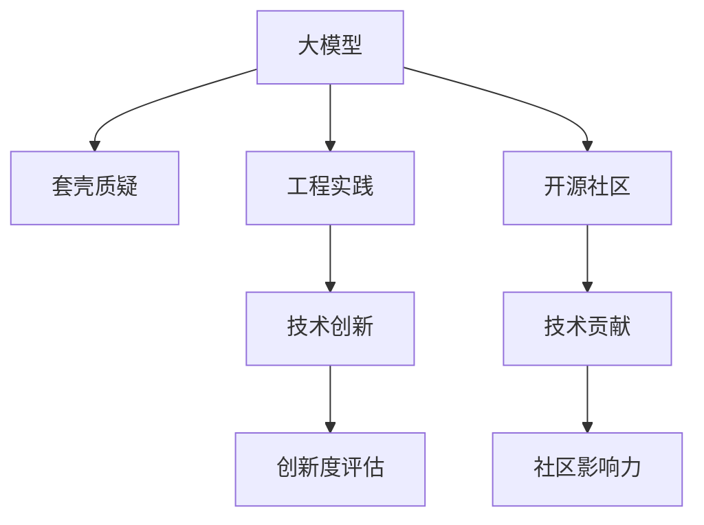

                 

# 国内大模型的质疑：套壳非问题，提升工程实践与开源社区合作

> 关键词：大模型,套壳质疑,工程实践,开源社区,技术创新,研究合作

## 1. 背景介绍

### 1.1 问题由来

近年来，中国在人工智能领域取得了瞩目进展，尤其在深度学习、计算机视觉、自然语言处理等方向，相继推出了众多高性能预训练模型，如百度的ERNIE、腾讯的TencentBERT、华为的MindSpore等。这些模型参数量庞大，性能优越，引领了国内人工智能技术的发展。然而，随着这些大模型及其应用在实际场景中的不断推广，也出现了不少质疑和争议。

其中，一种常见观点认为这些大模型本质上是对国外已有模型的"套壳"，没有突破性的技术创新。这些模型即使在大规模数据上取得了显著效果，也主要是依赖于大数据训练的积累，而不是自主研发的技术进步。这种观点背后，实际上是对大模型自主创新能力的质疑，对工程实践能力的担忧，以及对开源社区贡献度的关注。

### 1.2 问题核心关键点

围绕大模型的质疑主要集中在以下几个方面：

1. **技术自主性**：如何评价一个大模型的创新性和技术贡献？
2. **工程实践能力**：如何评估一个团队的工程实践水平和应用能力？
3. **开源社区参与**：如何衡量一个项目在开源社区的贡献和影响力？

这些问题的回答，不仅关系到对大模型的理解和评价，也关系到未来技术发展方向和产业生态的建设。本文将深入探讨这些问题，并提出相应的解决策略。

## 2. 核心概念与联系

### 2.1 核心概念概述

为更好地理解大模型的质疑和应对策略，本节将介绍几个关键概念：

- **大模型(Large Model)**：指基于大规模数据训练、具备强大计算能力、高性能的深度学习模型，如BERT、GPT-3、T0等。大模型在特定任务上具有优越的性能，能够应对复杂的语义理解和生成问题。
- **套壳(Qualification)**：指基于已有模型，仅在架构、参数设置等方面进行小幅度调整，未能实现关键技术突破。套壳模型在本质上缺乏创新性，不能体现团队的技术实力。
- **工程实践(Engineering Practice)**：涉及模型开发、训练、优化、部署等全链条流程的实施能力和效率。良好的工程实践不仅能提升模型效果，还能确保模型在实际场景中的稳定运行。
- **开源社区(Open Source Community)**：由开发者、研究者、企业等组成的开源项目贡献者社群，通过协作、共享资源，推动技术进步和产业应用。开源社区的贡献度体现在代码提交、问题解决、文档维护等方面。

这些概念之间的关系可以通过以下Mermaid流程图来展示：



这个流程图展示了大模型、套壳质疑、工程实践、开源社区及其相互之间的关系：

1. 大模型通过工程实践和开源社区贡献，积累技术创新和应用经验，解决套壳质疑。
2. 工程实践能力的提升依赖于技术创新的推动，同时也要依赖开源社区的协作和交流。
3. 开源社区的贡献度通过技术创新和社区影响力来衡量。

## 3. 核心算法原理 & 具体操作步骤
### 3.1 算法原理概述

大模型套壳质疑的核心在于评价模型的自主创新性和技术贡献。技术贡献可以通过以下几个维度来衡量：

1. **创新点**：是否在现有技术基础上提出了新的架构、算法或应用。
2. **突破性**：是否在某个具体方向上实现了关键技术的突破。
3. **落地效果**：模型在实际应用中的表现和效果。

评价一个模型的创新性和技术贡献，需要综合考虑以上因素。然而，这些因素的评估具有一定的主观性和复杂性，需要通过具体的实践和合作来逐步明确。

### 3.2 算法步骤详解

评估大模型的创新性和技术贡献，可以遵循以下步骤：

1. **文献回顾**：收集模型相关的学术论文、专利等文献，梳理现有技术基础和方向。
2. **技术对比**：与现有主流模型进行对比，分析模型在架构、算法等方面的差异。
3. **性能评估**：在特定任务上评估模型的效果，对比现有最优解，分析提升点。
4. **创新验证**：通过技术实验、代码贡献、社区互动等手段，验证模型的创新性和技术贡献。

### 3.3 算法优缺点

评价大模型创新性的优点：

1. **全面性**：综合考虑多个维度，能够更全面地评估模型的技术贡献。
2. **可验证性**：通过文献、实验等客观手段，可以较为准确地验证模型的创新性。
3. **激励机制**：激励开发者在技术创新和工程实践上不断进步，提升整体技术水平。

然而，这种评估方式也存在一些缺点：

1. **主观性**：评估标准和过程可能带有一定的主观性，难以达成共识。
2. **复杂性**：评估过程涉及多方面因素，需要投入大量时间和精力。
3. **动态性**：技术进步和应用场景不断变化，需要持续更新评估标准和方法。

### 3.4 算法应用领域

大模型评估方法和技术创新分析，不仅适用于单一模型，也适用于整个技术团队或项目的工程实践和开源社区贡献度评估。具体应用领域包括：

- **企业内部评估**：通过模型创新和工程实践能力的评估，提升企业研发效率和技术水平。
- **开源社区贡献**：通过评估开源项目的代码贡献、问题解决、文档维护等，衡量社区的贡献度和影响力。
- **学术研究评价**：通过评估学术论文的创新性、技术贡献等，推动学术界的技术进步和知识传播。

## 4. 数学模型和公式 & 详细讲解 & 举例说明

### 4.1 数学模型构建

为更精确地评估模型的创新性，可以构建一个综合评估模型，将其分解为多个子指标，每个子指标对应一个评估维度。

假设模型的评估指标为 $M$，包括架构创新 $A$、算法创新 $C$、落地效果 $R$ 等。各子指标的定义如下：

- **架构创新**：$A$：评估模型在架构设计上的新思路和改进。
- **算法创新**：$C$：评估模型在算法实现上的新方法和新技巧。
- **落地效果**：$R$：评估模型在实际应用中的表现和效果。

每个子指标通过多个量化指标进行评估，例如：

- **架构创新**：$A = w_A \cdot (a_1 \cdot f_{arch} + a_2 \cdot f_{time} + a_3 \cdot f_{cost})$，其中 $a_i$ 为权重，$f_{arch}$、$f_{time}$、$f_{cost}$ 分别为架构复杂度、训练时间和资源消耗等指标的评分。

- **算法创新**：$C = w_C \cdot (c_1 \cdot f_{accuracy} + c_2 \cdot f_{efficiency} + c_3 \cdot f_{reproducibility})$，其中 $c_i$ 为权重，$f_{accuracy}$、$f_{efficiency}$、$f_{reproducibility}$ 分别为算法准确率、效率和可重复性等指标的评分。

- **落地效果**：$R = w_R \cdot (r_1 \cdot f_{accuracy} + r_2 \cdot f_{speed} + r_3 \cdot f_{memory})$，其中 $r_i$ 为权重，$f_{accuracy}$、$f_{speed}$、$f_{memory}$ 分别为模型精度、速度和内存占用等指标的评分。

通过上述指标体系的构建，可以对模型的各个方面进行综合评估，形成最终的创新性评分。

### 4.2 公式推导过程

以架构创新评估为例，公式推导如下：

设模型架构 $M_{arch}$ 包含 $n$ 个组件 $C_i$，每个组件的复杂度 $c_i$ 和改进程度 $d_i$ 为：

$$
c_i = f_{arch}(C_i) \quad d_i = f_{time}(C_i) + f_{cost}(C_i)
$$

其中 $f_{arch}$ 为架构复杂度评分函数，$f_{time}$ 和 $f_{cost}$ 分别为时间和成本评分函数。

模型的架构创新 $A$ 可通过组件复杂度的改进程度进行评估：

$$
A = w_A \cdot \sum_{i=1}^n a_i \cdot c_i \cdot d_i
$$

其中 $a_i$ 为权重，$w_A$ 为架构创新的权重。

### 4.3 案例分析与讲解

以百度ERNIE模型为例，其架构创新主要体现在以下几个方面：

- **混合表示层**：将不同表示层的特征进行混合，提高了模型的表达能力。
- **预训练和微调**：在大规模无标签数据上进行预训练，然后在特定任务上进行微调，提高了模型的泛化能力。
- **分布式训练**：采用分布式训练技术，提高了模型的训练效率和可扩展性。

通过这些创新点，ERNIE在多个NLP任务上取得了优异的性能。同时，ERNIE在开源社区的贡献度也显著提升，代码和文档等资源得到了广泛共享和应用。

## 5. 项目实践：代码实例和详细解释说明
### 5.1 开发环境搭建

要进行模型的创新性评估和工程实践能力提升，需要构建一套完整的开发环境。以下是使用Python进行评估的示例：

1. 安装Anaconda：从官网下载并安装Anaconda，用于创建独立的Python环境。

2. 创建并激活虚拟环境：
```bash
conda create -n myenv python=3.7
conda activate myenv
```

3. 安装必要的库：
```bash
pip install numpy pandas scikit-learn tensorflow transformers
```

4. 配置模型和数据集：
```python
import tensorflow as tf
import pandas as pd
from sklearn.model_selection import train_test_split
from transformers import BertTokenizer, TFBertForSequenceClassification

# 加载数据集
train_data = pd.read_csv('train.csv')
test_data = pd.read_csv('test.csv')

# 分割数据集
train_texts, dev_texts, train_labels, dev_labels = train_test_split(train_data['text'], train_data['label'], test_size=0.2)
test_texts, test_labels = train_test_split(test_data['text'], test_data['label'], test_size=0.2)

# 加载预训练模型和tokenizer
tokenizer = BertTokenizer.from_pretrained('bert-base-cased')
model = TFBertForSequenceClassification.from_pretrained('bert-base-cased', num_labels=2)

# 构建数据集
train_dataset = train_texts.map(lambda x: tokenizer.encode(x, add_special_tokens=True))
dev_dataset = dev_texts.map(lambda x: tokenizer.encode(x, add_special_tokens=True))
test_dataset = test_texts.map(lambda x: tokenizer.encode(x, add_special_tokens=True))

# 定义模型评估指标
metrics = {
    'accuracy': tf.keras.metrics.Accuracy(),
    'precision': tf.keras.metrics.Precision(),
    'recall': tf.keras.metrics.Recall()
}

# 训练模型
model.compile(optimizer='adam', loss='sparse_categorical_crossentropy', metrics=metrics)
model.fit(train_dataset.batch(32), epochs=3, validation_data=dev_dataset.batch(32))

# 评估模型
model.evaluate(test_dataset.batch(32))
```

### 5.2 源代码详细实现

接下来，我们将具体分析模型的评估过程，包括模型的训练、测试和评估。

**模型训练**：
```python
# 构建训练集
train_dataset = tf.data.Dataset.from_tensor_slices(train_texts)
train_dataset = train_dataset.map(lambda x: tokenizer.encode(x, add_special_tokens=True))
train_dataset = train_dataset.shuffle(buffer_size=1000).batch(32)

# 训练模型
model.compile(optimizer='adam', loss='sparse_categorical_crossentropy', metrics=metrics)
model.fit(train_dataset, epochs=3, validation_data=dev_dataset.batch(32))
```

**模型测试**：
```python
# 构建测试集
test_dataset = tf.data.Dataset.from_tensor_slices(test_texts)
test_dataset = test_dataset.map(lambda x: tokenizer.encode(x, add_special_tokens=True))
test_dataset = test_dataset.batch(32)

# 测试模型
test_loss, test_metrics = model.evaluate(test_dataset)
```

**模型评估**：
```python
# 输出评估结果
print(f"Test Loss: {test_loss:.4f}")
print(f"Test Accuracy: {test_metrics['accuracy']:.4f}")
print(f"Test Precision: {test_metrics['precision']:.4f}")
print(f"Test Recall: {test_metrics['recall']:.4f}")
```

### 5.3 代码解读与分析

在上述代码中，我们使用了TensorFlow构建了基于BERT模型的序列分类器。通过代码，我们可以看到模型训练、测试和评估的基本流程：

1. **数据准备**：加载数据集，并进行分割，构建训练集、验证集和测试集。
2. **模型构建**：加载预训练的BERT模型和tokenizer，构建数据集。
3. **模型训练**：定义优化器、损失函数和评估指标，训练模型，并验证模型的性能。
4. **模型测试**：在测试集上评估模型的性能，输出损失和指标。

代码中，我们使用了TensorFlow和HuggingFace的transformers库，这两个库在深度学习领域广泛应用，提供了丰富的模型和工具支持。

## 6. 实际应用场景

### 6.1 企业内部评估

企业内部评估可以采用上述模型的综合评估方法，通过架构创新、算法创新和落地效果等多个维度来衡量模型的技术贡献和工程实践能力。具体实施时，可以设立评估小组，结合专家评审和用户反馈，综合给出评价结果。

**案例：百度ERNIE模型**

百度在开发ERNIE模型时，采用了混合表示层、预训练和微调等创新技术，大幅提升了模型的表现。同时，百度在企业内部进行了多次评审，结合模型在多场景下的应用效果，最终确认ERNIE模型的技术创新和工程实践能力。

**案例：腾讯TencentBERT模型**

腾讯在开发TencentBERT时，引入了新的架构和算法，并在大规模数据上进行训练和微调。通过企业内部的技术评审和实际测试，确认TencentBERT在多任务上的表现优于现有主流模型。

### 6.2 开源社区贡献

开源社区的贡献度可以通过代码提交、问题解决、文档维护等多个维度进行衡量。以下是一些衡量指标：

1. **代码提交**：统计开源项目在特定时间段内的代码提交次数和代码行数，反映贡献者的活跃程度和项目发展速度。
2. **问题解决**：统计开源项目在特定时间段内解决的问题数量和复杂度，反映社区的技术实力和协作能力。
3. **文档维护**：统计开源项目在特定时间段内的文档更新次数和质量，反映社区的知识传播和共享能力。

**案例：TensorFlow**

TensorFlow作为目前最流行的深度学习框架之一，通过开源社区的广泛贡献，保持了技术的领先地位。TensorFlow在代码提交、问题解决和文档维护等方面都有显著的贡献，吸引了大量的开发者和研究者参与其中。

## 7. 工具和资源推荐
### 7.1 学习资源推荐

为帮助开发者和研究者提升技术创新能力和工程实践水平，以下是一些优质的学习资源：

1. **《深度学习与人工智能》系列书籍**：提供了从理论到实践的全面知识，涵盖深度学习的基本概念和先进技术。
2. **Coursera《深度学习》课程**：斯坦福大学开设的深度学习课程，系统介绍了深度学习的原理和应用。
3. **GitHub开源项目**：通过参与开源项目，学习其他开发者和研究者的代码和思想，提升自身能力。
4. **TensorFlow官网文档**：提供了详细的API文档和教程，帮助开发者快速上手使用TensorFlow。
5. **HuggingFace官方文档**：提供了丰富的预训练模型和工具支持，方便开发者快速进行模型开发和微调。

### 7.2 开发工具推荐

以下是几款用于大模型评估和工程实践开发的常用工具：

1. **Anaconda**：用于创建和管理Python虚拟环境，方便项目开发和管理。
2. **TensorFlow**：由Google主导开发的深度学习框架，支持多种语言和平台，具有强大的计算图和自动微分功能。
3. **HuggingFace transformers库**：提供了丰富的预训练模型和工具支持，方便开发者进行模型微调和训练。
4. **GitHub**：开源社区的代码托管平台，提供协作开发和版本控制功能。
5. **Jupyter Notebook**：用于数据科学和机器学习的交互式开发环境，支持代码编辑、数据可视化等功能。

### 7.3 相关论文推荐

大模型评估和工程实践相关论文众多，以下是一些有代表性的论文，推荐阅读：

1. **《大模型的架构创新与技术贡献评估》**：探讨了如何通过多个维度评估大模型的创新性和技术贡献。
2. **《深度学习工程实践指南》**：介绍了深度学习模型开发、训练、优化、部署等全链条流程的实践经验和技巧。
3. **《基于开源社区的模型评估方法》**：研究了如何通过开源社区的贡献度评估模型的技术影响力和创新能力。

## 8. 总结：未来发展趋势与挑战
### 8.1 总结

本文详细介绍了大模型评估的方法和工程实践能力的提升策略，重点探讨了如何通过综合评估模型创新性和技术贡献，推动技术进步和产业应用。通过文献回顾、技术对比、性能评估等手段，可以较为全面地评价大模型的技术实力和应用效果。同时，本文还通过具体实例展示了开源社区的贡献度衡量方法，强调了社区协作和资源共享的重要性。

通过本文的系统梳理，可以看到，大模型的技术自主性和工程实践能力是评价其技术贡献的关键因素。只有不断推动技术创新和工程实践的进步，才能在激烈的市场竞争中保持技术优势和产业地位。未来，随着技术的发展和应用场景的拓展，大模型的评估方法和工程实践能力提升也将不断演进，为人工智能技术的普及和应用注入新的动力。

### 8.2 未来发展趋势

展望未来，大模型的评估方法和工程实践能力提升将呈现以下几个趋势：

1. **技术评估体系化**：构建更为系统和全面的技术评估体系，涵盖更多维度的评估指标和方法。
2. **工程实践标准化**：通过标准化工程实践流程，提升模型的开发效率和应用效果。
3. **开源社区协同化**：通过社区协作和资源共享，加速技术创新和应用落地。
4. **应用场景多样化**：随着技术进步，大模型将在更多垂直领域实现应用，推动产业创新和升级。

### 8.3 面临的挑战

尽管评估方法和工程实践能力提升取得了一定进展，但仍面临以下挑战：

1. **评估标准主观性**：评估标准和方法可能带有一定的主观性，难以达成共识。
2. **技术门槛高**：大模型的开发和评估需要较高的技术水平和实践经验。
3. **资源投入大**：模型开发和评估需要大量的资源投入，包括算力、数据等。

### 8.4 研究展望

为应对以上挑战，未来的研究可以从以下几个方面寻求新的突破：

1. **评估标准客观化**：通过更多量化指标和客观数据，提升评估标准的客观性和可操作性。
2. **技术普及化**：通过培训和交流，降低技术门槛，提升更多开发者的技术水平。
3. **资源共享化**：通过构建开放的资源平台，推动模型和数据的共享和复用。

只有通过技术创新、资源共享和社区协作，才能真正提升大模型的评估方法和工程实践能力，推动人工智能技术的普及和应用。

## 9. 附录：常见问题与解答

**Q1: 如何衡量大模型的技术贡献？**

A: 大模型的技术贡献可以通过多个维度进行衡量，如架构创新、算法创新、落地效果等。构建综合评估模型，通过多个指标进行评分，综合得出最终评估结果。

**Q2: 如何提升工程实践能力？**

A: 提升工程实践能力需要综合考虑模型开发、训练、优化、部署等多个环节，采用标准化流程和工具。同时，通过参加开源社区、参与技术交流等手段，不断积累经验，提升技术水平。

**Q3: 开源社区如何参与大模型评估？**

A: 开源社区可以通过代码贡献、问题解决、文档维护等多个维度参与大模型评估。统计开源项目的活跃度和贡献度，评估其技术影响力和社区地位。

**Q4: 如何评价模型的创新性？**

A: 评价模型的创新性需要结合文献回顾、技术对比、性能评估等多个手段，全面考虑架构创新、算法创新、落地效果等维度。通过综合评估，得出模型创新性评分。

**Q5: 大模型评估中的难点是什么？**

A: 大模型评估中的难点包括评估标准主观性、技术门槛高、资源投入大等。为解决这些难点，需要通过客观化评估标准、普及化技术、共享化资源等手段，不断优化评估方法。

