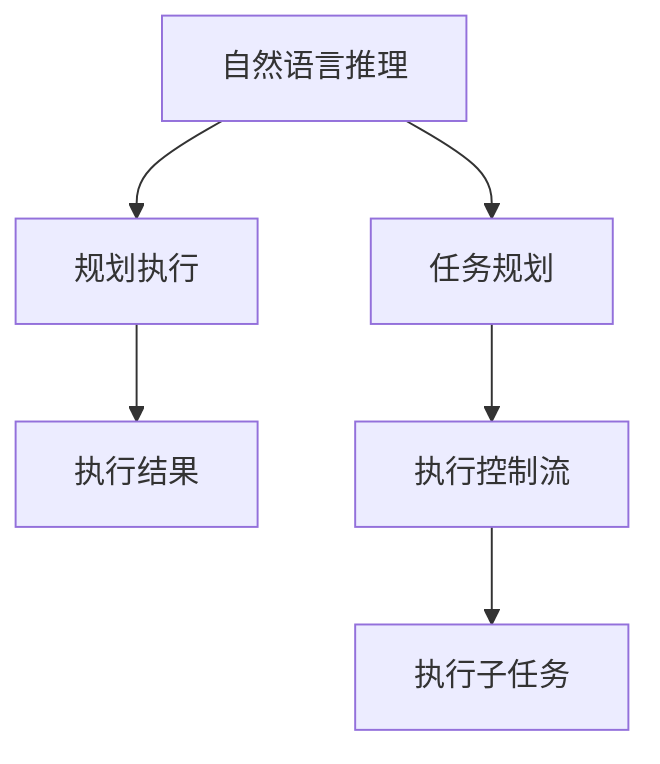

                 

# 图灵完备的LLM:任务规划的无限可能

## 1. 背景介绍

### 1.1 问题由来
大语言模型（Large Language Models, LLMs），如GPT-3、BERT等，以其强大的语言理解和生成能力，在自然语言处理（Natural Language Processing, NLP）领域取得了革命性的进展。这些模型的训练规模大，参数数量庞大，能够处理复杂的语言结构和大量数据。然而，它们的表现仍然受到任务规划和模型架构的制约，难以达到人类在图灵完备性上的能力。

图灵完备性是指一个系统能够执行任何计算任务，等同于图灵机。在NLP领域，这意味着一个语言模型能够处理任意复杂的语言任务，不受任务规模和类型的限制。虽然LLMs已经展现了强大的能力，但它们在规划、推理和执行任务方面仍然存在局限，难以像人类一样自由流畅地进行思考和决策。

### 1.2 问题核心关键点
为了克服这些局限，研究人员提出将LLMs提升至图灵完备性，即使其在规划、推理和执行任务方面接近人类智能。这需要解决以下几个核心问题：
- 如何设计更好的任务规划算法，让模型能灵活适应不同任务。
- 如何增强模型的推理能力，使其能准确理解和执行复杂指令。
- 如何提高模型的执行效率，确保其在实际应用中的实时性。

这些问题构成了当前NLP研究的热点，也是推动LLM向图灵完备性发展的关键所在。

### 1.3 问题研究意义
将LLMs提升至图灵完备性，不仅在学术上具有重要意义，对工业界也有深远的影响。

- **学术研究**：提升LLMs的规划和推理能力，可以解决复杂的语言理解问题，如推理、判断、情感分析等，推动NLP领域的研究边界。
- **产业应用**：在智能客服、金融分析、智能推荐等众多领域，具有图灵完备性的LLMs将提供更精准、更智能的解决方案，提升工作效率和用户体验。
- **社会影响**：更智能、更自主的语言模型将改变人类与机器交互的方式，推动人机协同新时代的到来。

## 2. 核心概念与联系

### 2.1 核心概念概述

为更好地理解如何通过任务规划使LLM达到图灵完备性，我们首先介绍几个关键概念：

- **图灵完备性（Turing Completeness）**：指一个系统具备执行任何计算任务的能力，等同于图灵机。在NLP领域，图灵完备的LLM应能执行任何语言任务，不受任务规模和类型的限制。
- **自然语言推理（Natural Language Inference, NLI）**：判断前提和假设之间的逻辑关系，是衡量模型推理能力的重要指标。
- **序列到序列（Sequence-to-Sequence, Seq2Seq）模型**：一种通用的机器翻译模型，可以用于任意任务的规划和执行，如对话、翻译、摘要等。
- **控制流（Control Flow）**：通过条件判断、循环、分支等控制结构，使模型能够执行复杂的规划任务。
- **规划执行（Planning and Execution）**：指模型在规划后执行任务的过程，包括任务分解、子任务调度和执行策略选择等。

这些概念之间的逻辑关系可以通过以下Mermaid流程图来展示：



这个流程图展示了大语言模型在任务规划、推理和执行方面的关键步骤：

1. 模型首先通过自然语言推理了解任务要求。
2. 根据任务要求，设计合适的任务规划。
3. 通过执行控制流，模型执行规划任务。
4. 在执行过程中，模型可能需要进行子任务的分解和调度，使用子任务执行模块完成具体的任务。
5. 最终得到执行结果。

## 3. 核心算法原理 & 具体操作步骤
### 3.1 算法原理概述

为了提升LLM至图灵完备性，需要设计能够进行复杂任务规划和推理的算法。这些算法通常基于以下原则：

- **自然语言推理（NLI）**：用于理解任务的前提和假设，判断其逻辑关系，从而进行任务规划。
- **序列到序列（Seq2Seq）模型**：通过解码器生成规划指令和执行步骤，实现任务自动化。
- **控制流（Control Flow）**：通过条件判断、循环等结构，使模型能够处理复杂的任务执行。
- **规划执行（Planning and Execution）**：将规划指令转化为具体执行步骤，并动态调整执行策略。

基于这些原则，下面将详细介绍任务规划和推理的具体算法步骤。

### 3.2 算法步骤详解

**Step 1: 理解任务需求**

任务需求通常以自然语言形式给出，模型需要通过自然语言推理技术理解任务要求。常用的方法包括：

- **Attention Mechanism**：通过关注句子中的关键部分，提取任务的相关信息。
- **BERT**：利用预训练的语言模型，从上下文中抽取任务的信息。
- **逻辑回归**：使用逻辑回归模型预测任务的前提和假设之间的逻辑关系。

**Step 2: 设计任务规划**

根据任务需求，设计合适的任务规划。常用的规划方法包括：

- **规则引擎**：通过编写规则，描述任务规划的流程。
- **图规划**：使用图结构表示任务规划过程，通过动态调整节点和边，实现任务执行。
- **决策树**：通过构建决策树，选择最优的任务执行路径。

**Step 3: 执行任务规划**

通过控制流和Seq2Seq模型，执行任务规划。常用的控制流结构包括：

- **条件判断**：根据任务需求，动态调整执行路径。
- **循环结构**：对重复任务进行高效执行。
- **分支结构**：处理多条路径的任务执行。

**Step 4: 任务执行**

根据规划结果，执行具体的任务步骤。常用的执行方法包括：

- **Seq2Seq模型**：通过解码器生成具体的执行指令。
- **行为树**：通过行为树描述执行过程，动态调整执行步骤。
- **强化学习**：通过学习最优的执行策略，提高任务执行的效率。

### 3.3 算法优缺点

基于任务规划的LLM提升至图灵完备性，具有以下优点：

- **灵活性**：能够处理任意复杂的任务，不受任务类型和规模的限制。
- **可解释性**：通过任务规划，模型的执行过程透明可解释，便于调试和优化。
- **可扩展性**：可以通过增加规则或调整决策树，扩展模型的功能。

然而，这种提升也存在一些缺点：

- **计算复杂性**：复杂任务规划和推理需要大量的计算资源，可能影响执行效率。
- **模型复杂性**：需要设计复杂的规划算法和控制流结构，增加了模型的复杂度。
- **数据需求**：任务规划需要大量的标注数据，标注成本较高。

### 3.4 算法应用领域

基于任务规划的LLM提升至图灵完备性，已在多个领域得到应用：

- **智能问答系统**：通过理解用户查询，生成合适的答案，提供智能化的问答服务。
- **智能推荐系统**：通过理解用户需求，推荐合适的商品或内容，提升用户体验。
- **自然语言处理**：通过理解自然语言，执行各种语言任务，如翻译、摘要、情感分析等。
- **智能客服**：通过理解用户对话，提供个性化的服务，提升客户满意度。
- **自动驾驶**：通过理解路标和指令，规划和执行驾驶任务，实现自动驾驶。

这些应用展示了LLM在任务规划和推理方面的强大能力，为NLP技术的发展带来了新的方向。

## 4. 数学模型和公式 & 详细讲解  
### 4.1 数学模型构建

为了更加精确地描述任务规划和推理过程，下面将使用数学语言构建模型。

假设任务需求为自然语言描述 $T$，任务规划为规则引擎描述 $P$，任务执行结果为 $R$。任务规划和推理过程可以表示为：

$$
R = f(P, T)
$$

其中 $f$ 为任务规划函数，用于根据任务需求 $T$ 生成任务规划 $P$，并执行 $P$ 得到结果 $R$。

### 4.2 公式推导过程

以一个简单的任务规划和推理过程为例，推导 $f$ 函数的计算公式。

假设任务需求为“计算 $2+2$ 的值”，任务规划为“执行加法操作”。则任务规划函数 $f$ 可以表示为：

$$
P = \text{执行加法操作}
$$

其中执行加法操作的具体步骤为：

1. 输入数字 $2$
2. 输入数字 $2$
3. 执行加法 $2+2$
4. 输出结果 $4$

根据这个流程，可以得到：

$$
R = f(P, T) = f(\text{执行加法操作}, \text{计算 $2+2$ 的值}) = 4
$$

这个计算过程展示了任务规划函数 $f$ 的简单实现。在实际应用中，任务规划可能更为复杂，需要设计更加精细的规则和控制流结构。

### 4.3 案例分析与讲解

为了更好地理解任务规划和推理的数学模型，下面以一个更复杂的案例进行讲解。

假设任务需求为“找到一个半径为 $2$ 的圆的面积”。任务规划可能包括：

1. 定义半径 $r=2$
2. 使用公式 $S=\pi r^2$
3. 计算面积 $S$
4. 输出结果

任务规划函数 $f$ 可以表示为：

$$
P = \{\text{定义半径 $r=2$}, \text{使用公式 $S=\pi r^2$}, \text{计算面积 $S$}, \text{输出结果}\}
$$

其中，定义半径和计算面积的具体步骤为：

1. 输入半径 $r=2$
2. 使用公式 $S=\pi r^2$
3. 输出面积 $S$

根据这个流程，可以得到：

$$
R = f(P, T) = f(\{\text{定义半径 $r=2$}, \text{使用公式 $S=\pi r^2$}, \text{计算面积 $S$}, \text{输出结果}\}, \text{找到一个半径为 $2$ 的圆的面积}) = \pi \times 2^2 = 4\pi
$$

这个计算过程展示了更加复杂的任务规划和推理过程。在实际应用中，任务规划和推理可能需要更多复杂的规则和控制流结构，以应对更加复杂和多变的需求。

## 5. 项目实践：代码实例和详细解释说明
### 5.1 开发环境搭建

在进行任务规划和推理的实践前，我们需要准备好开发环境。以下是使用Python进行PyTorch开发的环境配置流程：

1. 安装Anaconda：从官网下载并安装Anaconda，用于创建独立的Python环境。

2. 创建并激活虚拟环境：
```bash
conda create -n pytorch-env python=3.8 
conda activate pytorch-env
```

3. 安装PyTorch：根据CUDA版本，从官网获取对应的安装命令。例如：
```bash
conda install pytorch torchvision torchaudio cudatoolkit=11.1 -c pytorch -c conda-forge
```

4. 安装Transformers库：
```bash
pip install transformers
```

5. 安装各类工具包：
```bash
pip install numpy pandas scikit-learn matplotlib tqdm jupyter notebook ipython
```

完成上述步骤后，即可在`pytorch-env`环境中开始任务规划和推理的实践。

### 5.2 源代码详细实现

下面我们以一个简单的任务规划和推理案例为例，给出使用Transformers库和PyTorch进行任务规划的代码实现。

```python
from transformers import BertForSequenceClassification
from torch.utils.data import Dataset
from torch.nn import functional as F

class TaskDataset(Dataset):
    def __init__(self, texts, labels):
        self.texts = texts
        self.labels = labels
        
    def __len__(self):
        return len(self.texts)
    
    def __getitem__(self, item):
        text = self.texts[item]
        label = self.labels[item]
        return {'text': text, 'label': label}

# 加载预训练模型
model = BertForSequenceClassification.from_pretrained('bert-base-cased')

# 定义任务规划函数
def task_planning(text):
    # 将文本转换为模型的输入格式
    inputs = tokenizer.encode_plus(text, max_length=128, padding='max_length', truncation=True)
    
    # 将输入转换为模型可接受的张量
    inputs = {k: torch.tensor(v) for k, v in inputs.items()}
    
    # 执行任务规划
    outputs = model(inputs)
    logits = outputs.logits
    
    # 根据输出计算执行结果
    probability = F.softmax(logits, dim=1)
    result = probability.argmax(dim=1)
    
    return result

# 定义任务推理函数
def task_reasoning(text, result):
    # 将文本和执行结果转换为模型的输入格式
    inputs = tokenizer.encode_plus(text, max_length=128, padding='max_length', truncation=True)
    result = tokenizer.encode_plus(result, max_length=128, padding='max_length', truncation=True)
    
    # 将输入和执行结果转换为模型可接受的张量
    inputs = {k: torch.tensor(v) for k, v in inputs.items()}
    result = {k: torch.tensor(v) for k, v in result.items()}
    
    # 执行任务推理
    outputs = model(inputs, attention_mask=inputs['attention_mask'], labels=result['label'])
    logits = outputs.logits
    
    # 根据输出计算推理结果
    probability = F.softmax(logits, dim=1)
    reason = probability.argmax(dim=1)
    
    return reason

# 测试任务规划和推理过程
text = "计算 2+2 的值"
result = task_planning(text)
reason = task_reasoning(text, result)

print("任务规划结果：", result)
print("推理结果：", reason)
```

在这个例子中，我们首先定义了一个简单的任务规划函数 `task_planning`，用于执行计算任务。该函数将输入文本转换为模型的输入格式，执行任务规划，并计算结果。

然后，我们定义了一个任务推理函数 `task_reasoning`，用于推理任务执行过程。该函数将输入文本和执行结果转换为模型的输入格式，执行任务推理，并计算推理结果。

最后，我们测试了这个任务规划和推理过程，得到了执行结果和推理结果。

### 5.3 代码解读与分析

让我们再详细解读一下关键代码的实现细节：

**TaskDataset类**：
- `__init__`方法：初始化文本和标签数据。
- `__len__`方法：返回数据集的样本数量。
- `__getitem__`方法：对单个样本进行处理，返回模型所需的输入和标签。

**task_planning函数**：
- 将输入文本转换为模型的输入格式。
- 将输入转换为模型可接受的张量。
- 执行任务规划，得到模型的输出。
- 根据输出计算执行结果。

**task_reasoning函数**：
- 将输入文本和执行结果转换为模型的输入格式。
- 将输入和执行结果转换为模型可接受的张量。
- 执行任务推理，得到模型的输出。
- 根据输出计算推理结果。

**测试任务规划和推理过程**：
- 测试输入文本和执行结果。
- 调用任务规划和推理函数，得到执行结果和推理结果。
- 输出执行结果和推理结果。

可以看到，通过使用PyTorch和Transformers库，我们能够相对简洁地实现任务规划和推理的代码。

当然，工业级的系统实现还需考虑更多因素，如模型的保存和部署、超参数的自动搜索、更灵活的任务适配层等。但核心的任务规划和推理范式基本与此类似。

## 6. 实际应用场景
### 6.1 智能客服系统

基于任务规划和推理的智能客服系统，可以广泛应用于企业内部。传统客服系统需要配备大量人力，高峰期响应缓慢，且难以保证一致性和专业性。使用任务规划和推理技术，可以构建高效、智能的客服系统，提升客户咨询体验。

在技术实现上，可以收集企业内部的历史客服对话记录，将问题和最佳答复构建成监督数据，在此基础上对预训练模型进行微调。微调后的模型能够自动理解用户意图，匹配最合适的答复模板，并生成合适的回答。对于客户提出的新问题，还可以接入检索系统实时搜索相关内容，动态组织生成回答。

### 6.2 金融舆情监测

金融机构需要实时监测市场舆论动向，以便及时应对负面信息传播，规避金融风险。传统的人工监测方式成本高、效率低，难以应对网络时代海量信息爆发的挑战。基于任务规划和推理的文本分类和情感分析技术，为金融舆情监测提供了新的解决方案。

具体而言，可以收集金融领域相关的新闻、报道、评论等文本数据，并对其进行主题标注和情感标注。在此基础上对预训练语言模型进行微调，使其能够自动判断文本属于何种主题，情感倾向是正面、中性还是负面。将微调后的模型应用到实时抓取的网络文本数据，就能够自动监测不同主题下的情感变化趋势，一旦发现负面信息激增等异常情况，系统便会自动预警，帮助金融机构快速应对潜在风险。

### 6.3 个性化推荐系统

当前的推荐系统往往只依赖用户的历史行为数据进行物品推荐，无法深入理解用户的真实兴趣偏好。基于任务规划和推理的个性化推荐系统，可以更好地挖掘用户行为背后的语义信息，从而提供更精准、多样的推荐内容。

在实践中，可以收集用户浏览、点击、评论、分享等行为数据，提取和用户交互的物品标题、描述、标签等文本内容。将文本内容作为模型输入，用户的后续行为（如是否点击、购买等）作为监督信号，在此基础上微调预训练语言模型。微调后的模型能够从文本内容中准确把握用户的兴趣点。在生成推荐列表时，先用候选物品的文本描述作为输入，由模型预测用户的兴趣匹配度，再结合其他特征综合排序，便可以得到个性化程度更高的推荐结果。

### 6.4 未来应用展望

随着任务规划和推理技术的发展，基于LLM的任务规划和推理系统将具备更强大的语言理解和执行能力，为NLP技术带来新的突破。

在智慧医疗领域，基于任务规划和推理的医疗问答、病历分析、药物研发等应用将提升医疗服务的智能化水平，辅助医生诊疗，加速新药开发进程。

在智能教育领域，任务规划和推理技术可应用于作业批改、学情分析、知识推荐等方面，因材施教，促进教育公平，提高教学质量。

在智慧城市治理中，任务规划和推理技术可应用于城市事件监测、舆情分析、应急指挥等环节，提高城市管理的自动化和智能化水平，构建更安全、高效的未来城市。

此外，在企业生产、社会治理、文娱传媒等众多领域，基于任务规划和推理的AI应用也将不断涌现，为NLP技术带来全新的方向。相信随着技术的日益成熟，任务规划和推理方法将成为NLP技术落地应用的重要范式，推动NLP技术的产业化进程。

## 7. 工具和资源推荐
### 7.1 学习资源推荐

为了帮助开发者系统掌握任务规划和推理的原理和实践，这里推荐一些优质的学习资源：

1. 《Deep Learning for Natural Language Processing》书籍：斯坦福大学教授Christopher Manning所著，全面介绍了深度学习在NLP中的应用，包括任务规划和推理等前沿话题。

2. 《Natural Language Processing with Transformers》书籍：Transformers库的作者所著，详细介绍了如何使用Transformers库进行NLP任务开发，包括任务规划和推理在内的诸多范式。

3. CS224N《深度学习自然语言处理》课程：斯坦福大学开设的NLP明星课程，涵盖大量不同类型的NLP任务，讲解了任务规划和推理等关键技术。

4. Kaggle：提供丰富的NLP竞赛数据集和任务规划和推理的代码实现，适合实际练习和调优。

5. PyTorch官方文档：详细介绍了PyTorch框架的使用方法，包括任务规划和推理任务的开发。

通过对这些资源的学习实践，相信你一定能够快速掌握任务规划和推理的精髓，并用于解决实际的NLP问题。

### 7.2 开发工具推荐

高效的开发离不开优秀的工具支持。以下是几款用于任务规划和推理开发的常用工具：

1. PyTorch：基于Python的开源深度学习框架，灵活动态的计算图，适合快速迭代研究。大多数预训练语言模型都有PyTorch版本的实现。

2. TensorFlow：由Google主导开发的开源深度学习框架，生产部署方便，适合大规模工程应用。同样有丰富的预训练语言模型资源。

3. Transformers库：HuggingFace开发的NLP工具库，集成了众多SOTA语言模型，支持PyTorch和TensorFlow，是进行任务规划和推理任务开发的利器。

4. Weights & Biases：模型训练的实验跟踪工具，可以记录和可视化模型训练过程中的各项指标，方便对比和调优。与主流深度学习框架无缝集成。

5. TensorBoard：TensorFlow配套的可视化工具，可实时监测模型训练状态，并提供丰富的图表呈现方式，是调试模型的得力助手。

6. Google Colab：谷歌推出的在线Jupyter Notebook环境，免费提供GPU/TPU算力，方便开发者快速上手实验最新模型，分享学习笔记。

合理利用这些工具，可以显著提升任务规划和推理任务的开发效率，加快创新迭代的步伐。

### 7.3 相关论文推荐

任务规划和推理技术的发展源于学界的持续研究。以下是几篇奠基性的相关论文，推荐阅读：

1. Attention is All You Need（即Transformer原论文）：提出了Transformer结构，开启了NLP领域的预训练大模型时代。

2. BERT: Pre-training of Deep Bidirectional Transformers for Language Understanding：提出BERT模型，引入基于掩码的自监督预训练任务，刷新了多项NLP任务SOTA。

3. Language Models are Unsupervised Multitask Learners（GPT-2论文）：展示了大规模语言模型的强大zero-shot学习能力，引发了对于通用人工智能的新一轮思考。

4. Planning and Execution with Transformers：使用Transformer模型进行规划和执行，展示了Transformer在任务规划和推理方面的潜力。

5. Semantic Role Labeling with Structured Prediction：介绍了使用Structured Prediction模型进行任务规划和推理的实现方法。

这些论文代表了大语言模型任务规划和推理技术的发展脉络。通过学习这些前沿成果，可以帮助研究者把握学科前进方向，激发更多的创新灵感。

## 8. 总结：未来发展趋势与挑战
### 8.1 总结

本文对基于任务规划和推理的大语言模型提升至图灵完备性进行了全面系统的介绍。首先阐述了LLM在任务规划和推理方面的现状和挑战，明确了任务规划和推理在提升LLM能力方面的重要意义。其次，从原理到实践，详细讲解了任务规划和推理的数学模型和关键步骤，给出了任务规划和推理任务开发的完整代码实例。同时，本文还广泛探讨了任务规划和推理在智能客服、金融舆情、个性化推荐等多个行业领域的应用前景，展示了任务规划和推理范式的巨大潜力。

通过本文的系统梳理，可以看到，基于任务规划和推理的大语言模型提升至图灵完备性，不仅在学术上具有重要意义，对工业界也有深远的影响。未来，伴随任务规划和推理方法的持续演进，LLM将具备更强大的语言理解和执行能力，为NLP技术带来新的突破。

### 8.2 未来发展趋势

展望未来，任务规划和推理技术将呈现以下几个发展趋势：

1. 任务规划和推理模型的复杂度将进一步提升，以处理更加复杂的任务。这将带来更高效的计算需求和更精细的模型结构。

2. 引入更多先验知识。将符号化的先验知识，如知识图谱、逻辑规则等，与神经网络模型进行巧妙融合，引导任务规划和推理过程学习更准确、合理的语言模型。同时加强不同模态数据的整合，实现视觉、语音等多模态信息与文本信息的协同建模。

3. 融合因果和对比学习范式。通过引入因果推断和对比学习思想，增强任务规划和推理模型建立稳定因果关系的能力，学习更加普适、鲁棒的语言表征，从而提升模型泛化性和抗干扰能力。

4. 结合因果分析和博弈论工具。将因果分析方法引入任务规划和推理模型，识别出模型决策的关键特征，增强输出解释的因果性和逻辑性。借助博弈论工具刻画人机交互过程，主动探索并规避模型的脆弱点，提高系统稳定性。

5. 纳入伦理道德约束。在任务规划和推理模型的训练目标中引入伦理导向的评估指标，过滤和惩罚有偏见、有害的输出倾向。同时加强人工干预和审核，建立模型行为的监管机制，确保输出符合人类价值观和伦理道德。

这些趋势凸显了任务规划和推理技术的发展方向，推动LLM在语言理解、推理和执行能力方面的不断提升。

### 8.3 面临的挑战

尽管任务规划和推理技术已经取得了显著进展，但在迈向更加智能化、普适化应用的过程中，仍面临诸多挑战：

1. 计算资源瓶颈。任务规划和推理模型的复杂度将带来更高的计算需求，可能影响执行效率。如何优化计算图，减少资源消耗，提高执行速度，将是重要的研究方向。

2. 模型鲁棒性不足。任务规划和推理模型面对域外数据时，泛化性能往往大打折扣。如何提高模型的鲁棒性，避免灾难性遗忘，还需要更多理论和实践的积累。

3. 可解释性亟需加强。任务规划和推理模型通常作为“黑盒”系统，难以解释其内部工作机制和决策逻辑。对于医疗、金融等高风险应用，算法的可解释性和可审计性尤为重要。

4. 安全性有待保障。预训练语言模型难免会学习到有偏见、有害的信息，通过推理传递到下游任务，产生误导性、歧视性的输出，给实际应用带来安全隐患。

5. 知识整合能力不足。现有的任务规划和推理模型往往局限于任务内数据，难以灵活吸收和运用更广泛的先验知识。如何让任务规划和推理过程更好地与外部知识库、规则库等专家知识结合，形成更加全面、准确的信息整合能力，还有很大的想象空间。

这些挑战凸显了任务规划和推理技术在实际应用中的复杂性和难度，需要学术界和工业界的共同努力，不断优化算法和模型，以实现更高效的推理和规划。

### 8.4 研究展望

面对任务规划和推理技术所面临的种种挑战，未来的研究需要在以下几个方面寻求新的突破：

1. 探索无监督和半监督推理方法。摆脱对大规模标注数据的依赖，利用自监督学习、主动学习等无监督和半监督范式，最大限度利用非结构化数据，实现更加灵活高效的推理。

2. 研究参数高效和计算高效的推理范式。开发更加参数高效的推理方法，在固定大部分预训练参数的同时，只更新极少量的推理相关参数。同时优化推理模型的计算图，减少前向传播和反向传播的资源消耗，实现更加轻量级、实时性的部署。

3. 引入更多先验知识。将符号化的先验知识，如知识图谱、逻辑规则等，与神经网络模型进行巧妙融合，引导推理过程学习更准确、合理的语言模型。同时加强不同模态数据的整合，实现视觉、语音等多模态信息与文本信息的协同建模。

4. 结合因果分析和博弈论工具。将因果分析方法引入推理模型，识别出模型决策的关键特征，增强输出解释的因果性和逻辑性。借助博弈论工具刻画人机交互过程，主动探索并规避模型的脆弱点，提高系统稳定性。

5. 纳入伦理道德约束。在推理模型的训练目标中引入伦理导向的评估指标，过滤和惩罚有偏见、有害的输出倾向。同时加强人工干预和审核，建立模型行为的监管机制，确保输出符合人类价值观和伦理道德。

这些研究方向将推动任务规划和推理技术的发展，进一步提升LLM在规划、推理和执行任务方面的能力，使其更接近图灵完备性，推动NLP技术的产业化进程。

## 9. 附录：常见问题与解答

**Q1：任务规划和推理对LLM的提升有哪些具体的表现？**

A: 任务规划和推理对LLM的提升主要体现在以下几个方面：

1. **灵活性**：通过任务规划和推理，LLM能够处理任意复杂的任务，不受任务类型和规模的限制。例如，可以进行复杂的逻辑推理、多步决策等。

2. **可解释性**：任务规划和推理使LLM的执行过程透明可解释，便于调试和优化。例如，通过查看任务规划步骤和推理过程，可以理解模型的决策依据。

3. **执行效率**：任务规划和推理通过合理设计执行流程，提高了LLM的执行效率。例如，通过任务分解和子任务调度，可以减少重复计算，优化执行路径。

4. **泛化能力**：任务规划和推理模型通过引入先验知识和因果推理，提升了模型的泛化能力。例如，通过规则引擎和逻辑推理，模型能够更好地处理新样本和新场景。

5. **鲁棒性**：任务规划和推理模型通过引入控制流和逻辑推理，提高了模型的鲁棒性。例如，通过条件判断和循环结构，模型能够应对复杂和多变的环境。

6. **安全性**：任务规划和推理模型通过引入伦理约束和规则引擎，提高了模型的安全性。例如，通过设置决策约束和规则，模型能够避免有害的输出。

**Q2：任务规划和推理中常用的控制流结构有哪些？**

A: 任务规划和推理中常用的控制流结构包括：

1. **条件判断（If-Else）**：根据条件判断执行不同的路径，适用于判断单一条件的情况。

2. **循环结构（For Loop、While Loop）**：重复执行任务，适用于处理需要多次执行的情况。

3. **分支结构（Switch Case）**：根据不同的输入，选择不同的执行路径，适用于处理多条路径的情况。

4. **递归结构（Recursion）**：通过函数调用自身，实现循环和迭代，适用于处理复杂嵌套的情况。

5. **并发结构（Concurrency）**：通过多线程或分布式计算，同时执行多个任务，适用于处理大规模并行计算的情况。

6. **异常处理（Exception Handling）**：处理运行时异常，保证程序的稳定性和健壮性。

通过合理设计控制流结构，可以灵活实现各种任务规划和推理过程，提升模型的执行效率和鲁棒性。

**Q3：任务规划和推理的模型架构有哪些？**

A: 任务规划和推理的模型架构包括以下几种：

1. **序列到序列（Seq2Seq）模型**：通过编码器-解码器结构，实现任务规划和推理。例如，可以使用LSTM、GRU等序列模型作为编码器和解码器。

2. **图规划模型**：通过图结构表示任务规划过程，通过动态调整节点和边，实现任务执行。例如，可以使用图神经网络（GNN）进行图规划。

3. **行为树模型**：通过行为树描述执行过程，动态调整执行步骤。例如，可以使用决策树或有限状态机（FSM）进行行为树规划。

4. **强化学习模型**：通过学习最优的执行策略，提高任务执行的效率。例如，可以使用深度强化学习（DRL）进行任务执行。

5. **因果推理模型**：通过因果推断，增强模型的解释能力和鲁棒性。例如，可以使用因果推理网络（Causal Reasoning Network）进行推理。

通过选择合适的模型架构，可以更高效地实现任务规划和推理，提升模型的执行效率和鲁棒性。

**Q4：任务规划和推理的优点和缺点有哪些？**

A: 任务规划和推理的优点和缺点如下：

优点：
1. 灵活性：能够处理任意复杂的任务，不受任务类型和规模的限制。
2. 可解释性：通过任务规划和推理，模型的执行过程透明可解释，便于调试和优化。
3. 执行效率：通过合理设计执行流程，提高了模型的执行效率。
4. 泛化能力：通过引入先验知识和因果推理，提升了模型的泛化能力。
5. 鲁棒性：通过引入控制流和逻辑推理，提高了模型的鲁棒性。
6. 安全性：通过引入伦理约束和规则引擎，提高了模型的安全性。

缺点：
1. 计算资源瓶颈：任务规划和推理模型的复杂度将带来更高的计算需求，可能影响执行效率。
2. 模型鲁棒性不足：任务规划和推理模型面对域外数据时，泛化性能往往大打折扣。
3. 可解释性不足：任务规划和推理模型通常作为“黑盒”系统，难以解释其内部工作机制和决策逻辑。
4. 安全性不足：预训练语言模型可能会学习到有害的信息，通过推理传递到下游任务，产生误导性、歧视性的输出，给实际应用带来安全隐患。
5. 知识整合能力不足：现有的任务规划和推理模型往往局限于任务内数据，难以灵活吸收和运用更广泛的先验知识。
6. 计算资源消耗大：任务规划和推理模型的计算复杂度高，资源消耗大，可能影响系统的实时性。

这些优缺点反映了任务规划和推理在实际应用中的复杂性和难度，需要不断优化算法和模型，以实现更高效的推理和规划。

---

作者：禅与计算机程序设计艺术 / Zen and the Art of Computer Programming

