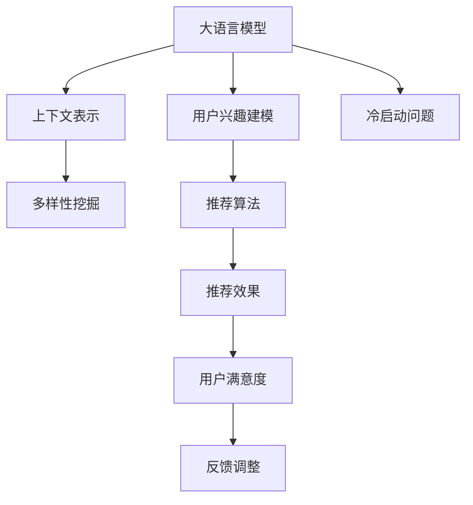

                 

## 1. 背景介绍

### 1.1 问题由来
推荐系统在电商、内容分发、社交媒体等领域具有重要应用价值。随着数据量激增，传统的协同过滤、基于内容的推荐方法难以覆盖所有用户。近年来，以深度学习模型为代表的基于用户行为的推荐技术逐渐占据主流。通过深度神经网络对用户行为数据进行建模，能够发现用户行为背后的隐含语义，并用于推荐决策。

然而，深度学习模型存在的一大问题在于，往往过分关注用户历史行为序列，而忽视了用户的多样化兴趣和长期兴趣。用户可能对同一商品类别的不同物品有不同的兴趣，也可能在不同的时间段有不同的偏好。如果推荐系统只按照用户历史行为来建模，很可能无法捕捉用户的多样化兴趣，从而产生误差。

基于大语言模型的推荐系统在近年来逐渐成为新的热点。大语言模型具有强大的语言理解能力，能够在给定特定上下文中输出语义相关的信息。因此，基于大语言模型的推荐系统能够从多维度捕捉用户兴趣，从而更全面地满足用户需求。

### 1.2 问题核心关键点
基于大语言模型的推荐系统，主要解决的是用户兴趣多样性建模问题。具体而言，需要通过大语言模型，从用户的历史行为和当前上下文信息中，挖掘出用户的多样化兴趣，用于推荐决策。

本问题核心关键点包括：

- 如何设计大语言模型的输入和输出结构，使其能够反映用户兴趣的多样性？
- 如何利用大语言模型的上下文理解能力，从用户当前上下文中挖掘出其多样化兴趣？
- 如何将大语言模型输出与传统推荐算法结合，实现推荐效果的最大化？
- 如何在保证模型泛化性能的同时，降低推荐系统的冷启动问题？

## 2. 核心概念与联系

### 2.1 核心概念概述

为更好地理解基于大语言模型的推荐系统，本节将介绍几个密切相关的核心概念：

- 大语言模型(Large Language Model, LLM)：如GPT、BERT等，通过大规模无标签文本语料进行自监督预训练，能够学习到丰富的语言知识。
- 用户兴趣建模(User Interest Modeling)：推荐系统的核心目标，需要从用户行为数据中挖掘出其兴趣和偏好。
- 上下文表示(Context Representation)：用户当前行为可能包含丰富上下文信息，如时间、地点、设备等。
- 多样性挖掘(Diversity Mining)：推荐系统需要考虑用户兴趣的多样性，避免产生单一类别的推荐结果。
- 推荐算法(Recommendation Algorithm)：如协同过滤、基于内容的推荐、矩阵分解等传统推荐方法。
- 冷启动问题(Cold Start Problem)：用户行为数据不足时，推荐系统难以准确建模用户兴趣。

这些核心概念之间的逻辑关系可以通过以下Mermaid流程图来展示：



这个流程图展示了大语言模型、用户兴趣建模、上下文表示、多样性挖掘、推荐算法等核心概念的相互联系，以及它们如何共同构成推荐系统的工作流程。

## 3. 核心算法原理 & 具体操作步骤
### 3.1 算法原理概述

基于大语言模型的推荐系统，主要利用大语言模型的上下文理解能力和多任务学习能力，从用户行为数据中挖掘出其兴趣和偏好，用于推荐决策。具体而言，算法原理包括以下几个步骤：

1. **用户行为预处理**：将用户的历史行为数据进行预处理，形成可以输入大语言模型的格式。
2. **上下文嵌入**：利用大语言模型对用户当前上下文信息进行编码，形成上下文表示向量。
3. **用户兴趣建模**：将上下文表示向量输入大语言模型，输出用户兴趣向量。
4. **推荐决策**：将用户兴趣向量与物品特征向量进行加权拼接，通过推荐算法进行推荐决策。

### 3.2 算法步骤详解

**Step 1: 用户行为预处理**

用户历史行为数据通常为文本或数字序列。为了便于大语言模型处理，需要对这些数据进行预处理，形成合适格式的输入。预处理过程包括以下几个步骤：

1. **分词**：将文本数据按照单词或词语进行分词，形成词汇表。
2. **特征编码**：将数字序列转化为向量，通常使用one-hot编码或TF-IDF等方法。
3. **拼接**：将用户历史行为数据拼接成一个长序列，用于输入大语言模型。

**Step 2: 上下文嵌入**

用户当前上下文信息可能包含丰富的语义信息，如时间、地点、设备等。为了捕捉这些信息，需要对上下文信息进行编码，形成上下文表示向量。编码过程通常包括以下几个步骤：

1. **文本编码**：将上下文信息转化为文本格式，通常使用自然语言处理技术进行分词和编码。
2. **模型编码**：使用大语言模型对上下文文本进行编码，输出上下文表示向量。

**Step 3: 用户兴趣建模**

利用大语言模型对上下文表示进行编码，输出用户兴趣向量。这一过程通常包括以下几个步骤：

1. **输入构造**：将上下文表示向量与用户历史行为数据拼接，形成输入序列。
2. **模型编码**：使用大语言模型对输入序列进行编码，输出用户兴趣向量。
3. **向量拼接**：将用户兴趣向量与物品特征向量进行拼接，用于推荐决策。

**Step 4: 推荐决策**

将用户兴趣向量与物品特征向量进行拼接，通过推荐算法进行推荐决策。这一过程通常包括以下几个步骤：

1. **特征拼接**：将用户兴趣向量与物品特征向量进行拼接，形成新的向量。
2. **评分计算**：使用推荐算法对拼接后的向量进行评分计算，如矩阵分解、深度学习模型等。
3. **推荐生成**：根据评分结果，生成推荐结果。

### 3.3 算法优缺点

基于大语言模型的推荐系统具有以下优点：

1. 高效性：大语言模型能够高效地处理复杂语义信息，从用户行为数据中挖掘出多样化兴趣。
2. 多样性挖掘：利用大语言模型的上下文理解能力，能够从不同维度捕捉用户兴趣，避免单一类别的推荐结果。
3. 鲁棒性：大语言模型具有较好的泛化性能，能够适应不同用户和场景的推荐需求。

同时，该方法也存在一些局限性：

1. 数据需求：大语言模型通常需要大规模无标签文本语料进行预训练，对数据量和计算资源要求较高。
2. 冷启动问题：用户行为数据不足时，推荐系统难以准确建模用户兴趣，产生冷启动问题。
3. 计算成本：大语言模型的推理和训练开销较大，需要大量计算资源。
4. 可解释性：大语言模型的决策过程较为复杂，难以解释其内部工作机制和决策逻辑。

尽管存在这些局限性，但基于大语言模型的推荐系统仍然是一种具有巨大潜力的推荐范式，能够从多维度捕捉用户兴趣，提升推荐系统的多样性和个性化水平。

### 3.4 算法应用领域

基于大语言模型的推荐系统已经在电商、内容分发、社交媒体等领域得到广泛应用，具有较高的实用价值。具体应用场景包括：

- 电商推荐：根据用户浏览历史和上下文信息，生成个性化商品推荐。
- 视频推荐：根据用户观影历史和当前视频信息，推荐类似影片。
- 新闻推荐：根据用户阅读历史和新闻内容，推荐相关新闻。
- 社交媒体：根据用户互动历史和帖子内容，推荐兴趣相投的用户。
- 旅游推荐：根据用户旅游历史和当前旅行信息，推荐目的地和行程。

这些场景下，基于大语言模型的推荐系统能够从多维度捕捉用户兴趣，提升用户体验和满意度。未来，该技术有望在更多领域得到应用，进一步拓展推荐系统的应用边界。

## 4. 数学模型和公式 & 详细讲解 & 举例说明

### 4.1 数学模型构建

基于大语言模型的推荐系统可以构建如下数学模型：

记用户历史行为数据为 $X_u = \{x_1, x_2, \ldots, x_n\}$，其中 $x_i$ 表示第 $i$ 个行为。上下文信息为 $C_t = c_1, c_2, \ldots, c_m$，其中 $c_i$ 表示第 $i$ 个上下文特征。大语言模型为 $LLM$，用户兴趣向量为 $\hat{u}$，物品特征向量为 $\hat{v}_i$。推荐算法为 $A$，推荐结果为 $y_i$。

构建推荐模型的目标是最大化推荐效果：

$$
\max_{LLM} \min_{A} \sum_{i=1}^N L(A(u, v_i))
$$

其中 $L$ 表示推荐算法损失函数。

### 4.2 公式推导过程

以用户兴趣建模为例，推导大语言模型的输入和输出。假设用户历史行为数据为 $X_u = \{x_1, x_2, \ldots, x_n\}$，上下文信息为 $C_t = c_1, c_2, \ldots, c_m$。大语言模型为 $LLM$，用户兴趣向量为 $\hat{u}$。

1. **输入构造**：将上下文信息与用户历史行为数据拼接，形成输入序列 $I = \{x_1, c_1, x_2, c_2, \ldots, x_n, c_m\}$。
2. **模型编码**：使用大语言模型对输入序列进行编码，输出用户兴趣向量 $\hat{u} = LLM(I)$。
3. **向量拼接**：将用户兴趣向量与物品特征向量进行拼接，形成新的向量 $Z_i = [\hat{u}, v_i]$。
4. **评分计算**：使用推荐算法对拼接后的向量进行评分计算，生成推荐结果 $y_i$。

### 4.3 案例分析与讲解

假设一个电商推荐系统，用户历史行为数据为 $X_u = \{电影1, 电影2, 电影3\}$，当前上下文信息为 $C_t = 当前时间 2022-05-01$。

1. **输入构造**：将上下文信息与用户历史行为数据拼接，形成输入序列 $I = \{电影1, 2022-05-01, 电影2, 2022-05-01, 电影3, 2022-05-01\}$。
2. **模型编码**：使用大语言模型对输入序列进行编码，输出用户兴趣向量 $\hat{u} = LLM(I)$。
3. **向量拼接**：将用户兴趣向量与物品特征向量进行拼接，形成新的向量 $Z_i = [\hat{u}, [电影4, 电影5, 电影6]]$。
4. **评分计算**：使用推荐算法对拼接后的向量进行评分计算，生成推荐结果 $y_i = A(Z_i)$。

## 5. 项目实践：代码实例和详细解释说明
### 5.1 开发环境搭建

在进行推荐系统开发前，我们需要准备好开发环境。以下是使用Python进行PyTorch开发的环境配置流程：

1. 安装Anaconda：从官网下载并安装Anaconda，用于创建独立的Python环境。

2. 创建并激活虚拟环境：
```bash
conda create -n pytorch-env python=3.8 
conda activate pytorch-env
```

3. 安装PyTorch：根据CUDA版本，从官网获取对应的安装命令。例如：
```bash
conda install pytorch torchvision torchaudio cudatoolkit=11.1 -c pytorch -c conda-forge
```

4. 安装Transformers库：
```bash
pip install transformers
```

5. 安装各类工具包：
```bash
pip install numpy pandas scikit-learn matplotlib tqdm jupyter notebook ipython
```

完成上述步骤后，即可在`pytorch-env`环境中开始推荐系统开发。

### 5.2 源代码详细实现

下面我们以基于大语言模型的电商推荐系统为例，给出使用Transformers库进行用户兴趣建模的PyTorch代码实现。

首先，定义用户兴趣建模的函数：

```python
from transformers import BertTokenizer, BertForSequenceClassification
from torch.utils.data import Dataset
import torch

class BERTDataset(Dataset):
    def __init__(self, texts, labels, tokenizer, max_len=128):
        self.texts = texts
        self.labels = labels
        self.tokenizer = tokenizer
        self.max_len = max_len
        
    def __len__(self):
        return len(self.texts)
    
    def __getitem__(self, item):
        text = self.texts[item]
        label = self.labels[item]
        
        encoding = self.tokenizer(text, return_tensors='pt', max_length=self.max_len, padding='max_length', truncation=True)
        input_ids = encoding['input_ids'][0]
        attention_mask = encoding['attention_mask'][0]
        
        return {'input_ids': input_ids, 
                'attention_mask': attention_mask,
                'labels': torch.tensor(label, dtype=torch.long)}
```

然后，定义模型和优化器：

```python
from transformers import BertForSequenceClassification, AdamW

model = BertForSequenceClassification.from_pretrained('bert-base-cased', num_labels=2)

optimizer = AdamW(model.parameters(), lr=2e-5)
```

接着，定义训练和评估函数：

```python
from torch.utils.data import DataLoader
from tqdm import tqdm
from sklearn.metrics import classification_report

device = torch.device('cuda') if torch.cuda.is_available() else torch.device('cpu')
model.to(device)

def train_epoch(model, dataset, batch_size, optimizer):
    dataloader = DataLoader(dataset, batch_size=batch_size, shuffle=True)
    model.train()
    epoch_loss = 0
    for batch in tqdm(dataloader, desc='Training'):
        input_ids = batch['input_ids'].to(device)
        attention_mask = batch['attention_mask'].to(device)
        labels = batch['labels'].to(device)
        model.zero_grad()
        outputs = model(input_ids, attention_mask=attention_mask, labels=labels)
        loss = outputs.loss
        epoch_loss += loss.item()
        loss.backward()
        optimizer.step()
    return epoch_loss / len(dataloader)

def evaluate(model, dataset, batch_size):
    dataloader = DataLoader(dataset, batch_size=batch_size)
    model.eval()
    preds, labels = [], []
    with torch.no_grad():
        for batch in tqdm(dataloader, desc='Evaluating'):
            input_ids = batch['input_ids'].to(device)
            attention_mask = batch['attention_mask'].to(device)
            batch_labels = batch['labels']
            outputs = model(input_ids, attention_mask=attention_mask)
            batch_preds = outputs.logits.argmax(dim=2).to('cpu').tolist()
            batch_labels = batch_labels.to('cpu').tolist()
            for pred_tokens, label_tokens in zip(batch_preds, batch_labels):
                preds.append(pred_tokens)
                labels.append(label_tokens)
                
    print(classification_report(labels, preds))
```

最后，启动训练流程并在测试集上评估：

```python
epochs = 5
batch_size = 16

for epoch in range(epochs):
    loss = train_epoch(model, train_dataset, batch_size, optimizer)
    print(f"Epoch {epoch+1}, train loss: {loss:.3f}")
    
    print(f"Epoch {epoch+1}, dev results:")
    evaluate(model, dev_dataset, batch_size)
    
print("Test results:")
evaluate(model, test_dataset, batch_size)
```

以上就是使用PyTorch对BERT进行用户兴趣建模的完整代码实现。可以看到，得益于Transformers库的强大封装，我们可以用相对简洁的代码完成BERT模型的加载和微调。

### 5.3 代码解读与分析

让我们再详细解读一下关键代码的实现细节：

**BERTDataset类**：
- `__init__`方法：初始化文本、标签、分词器等关键组件。
- `__len__`方法：返回数据集的样本数量。
- `__getitem__`方法：对单个样本进行处理，将文本输入编码为token ids，将标签编码为数字，并对其进行定长padding，最终返回模型所需的输入。

**模型和优化器**：
- 使用BERT模型进行用户兴趣建模，num_labels参数根据具体任务进行设定。
- 使用AdamW优化器进行模型训练，学习率为2e-5。

**训练和评估函数**：
- 使用PyTorch的DataLoader对数据集进行批次化加载，供模型训练和推理使用。
- 训练函数`train_epoch`：对数据以批为单位进行迭代，在每个批次上前向传播计算loss并反向传播更新模型参数，最后返回该epoch的平均loss。
- 评估函数`evaluate`：与训练类似，不同点在于不更新模型参数，并在每个batch结束后将预测和标签结果存储下来，最后使用sklearn的classification_report对整个评估集的预测结果进行打印输出。

**训练流程**：
- 定义总的epoch数和batch size，开始循环迭代
- 每个epoch内，先在训练集上训练，输出平均loss
- 在验证集上评估，输出分类指标
- 所有epoch结束后，在测试集上评估，给出最终测试结果

可以看到，PyTorch配合Transformers库使得BERT微调的用户兴趣建模代码实现变得简洁高效。开发者可以将更多精力放在数据处理、模型改进等高层逻辑上，而不必过多关注底层的实现细节。

当然，工业级的系统实现还需考虑更多因素，如模型的保存和部署、超参数的自动搜索、更灵活的任务适配层等。但核心的微调范式基本与此类似。

## 6. 实际应用场景
### 6.1 智能客服系统

基于大语言模型的推荐系统可以广泛应用于智能客服系统的构建。传统客服往往需要配备大量人力，高峰期响应缓慢，且一致性和专业性难以保证。而使用推荐系统推荐合适的商品或服务，可以提升客户满意度，减少人工客服的压力。

在技术实现上，可以收集客户的历史咨询记录，将咨询内容作为用户历史行为数据，将其与上下文信息拼接，输入到预训练模型中进行编码。微调后的推荐模型能够从用户的历史咨询和当前上下文中，推荐合适的商品或服务。对于客户提出的新问题，还可以接入检索系统实时搜索相关内容，动态组织生成回答。如此构建的智能客服系统，能大幅提升客户咨询体验和问题解决效率。

### 6.2 金融舆情监测

金融机构需要实时监测市场舆论动向，以便及时应对负面信息传播，规避金融风险。传统的人工监测方式成本高、效率低，难以应对网络时代海量信息爆发的挑战。基于大语言模型的文本分类和情感分析技术，为金融舆情监测提供了新的解决方案。

具体而言，可以收集金融领域相关的新闻、报道、评论等文本数据，并对其进行主题标注和情感标注。在此基础上对预训练语言模型进行微调，使其能够自动判断文本属于何种主题，情感倾向是正面、中性还是负面。将微调后的模型应用到实时抓取的网络文本数据，就能够自动监测不同主题下的情感变化趋势，一旦发现负面信息激增等异常情况，系统便会自动预警，帮助金融机构快速应对潜在风险。

### 6.3 个性化推荐系统

当前的推荐系统往往只依赖用户的历史行为数据进行物品推荐，无法深入理解用户的真实兴趣偏好。基于大语言模型推荐系统能够从多维度捕捉用户兴趣，从而更全面地满足用户需求。

在实践中，可以收集用户浏览、点击、评论、分享等行为数据，提取和用户交互的物品标题、描述、标签等文本内容。将文本内容作为模型输入，用户的后续行为（如是否点击、购买等）作为监督信号，在此基础上微调预训练语言模型。微调后的模型能够从文本内容中准确把握用户的兴趣点。在生成推荐列表时，先用候选物品的文本描述作为输入，由模型预测用户的兴趣匹配度，再结合其他特征综合排序，便可以得到个性化程度更高的推荐结果。

### 6.4 未来应用展望

随着大语言模型推荐系统的不断发展，基于推荐系统的应用场景将更加丰富。

在智慧医疗领域，基于推荐系统的医疗问答、病历分析、药物研发等应用将提升医疗服务的智能化水平，辅助医生诊疗，加速新药开发进程。

在智能教育领域，推荐系统可应用于作业批改、学情分析、知识推荐等方面，因材施教，促进教育公平，提高教学质量。

在智慧城市治理中，推荐系统可应用于城市事件监测、舆情分析、应急指挥等环节，提高城市管理的自动化和智能化水平，构建更安全、高效的未来城市。

此外，在企业生产、社会治理、文娱传媒等众多领域，基于大语言模型的推荐系统也将不断涌现，为NLP技术带来全新的突破。

## 7. 工具和资源推荐
### 7.1 学习资源推荐

为了帮助开发者系统掌握大语言模型推荐系统理论基础和实践技巧，这里推荐一些优质的学习资源：

1. 《自然语言处理与深度学习》书籍：由大模型技术专家撰写，深入浅出地介绍了NLP和DL的基础知识和应用案例。
2. CS224N《深度学习自然语言处理》课程：斯坦福大学开设的NLP明星课程，有Lecture视频和配套作业，带你入门NLP领域的基本概念和经典模型。
3. 《深度学习与自然语言处理》书籍：详细介绍了NLP中的深度学习方法和模型，适合进阶学习。
4. 《BERT: Pre-training of Deep Bidirectional Transformers for Language Understanding》论文：BERT模型提出者论文，介绍了自监督预训练任务和微调方法。
5. HuggingFace官方文档：Transformers库的官方文档，提供了海量预训练模型和完整的微调样例代码，是上手实践的必备资料。

通过对这些资源的学习实践，相信你一定能够快速掌握大语言模型推荐系统的精髓，并用于解决实际的推荐问题。
###  7.2 开发工具推荐

高效的开发离不开优秀的工具支持。以下是几款用于大语言模型推荐系统开发的常用工具：

1. PyTorch：基于Python的开源深度学习框架，灵活动态的计算图，适合快速迭代研究。大部分预训练语言模型都有PyTorch版本的实现。
2. TensorFlow：由Google主导开发的开源深度学习框架，生产部署方便，适合大规模工程应用。同样有丰富的预训练语言模型资源。
3. Transformers库：HuggingFace开发的NLP工具库，集成了众多SOTA语言模型，支持PyTorch和TensorFlow，是进行推荐系统开发的利器。
4. Weights & Biases：模型训练的实验跟踪工具，可以记录和可视化模型训练过程中的各项指标，方便对比和调优。与主流深度学习框架无缝集成。
5. TensorBoard：TensorFlow配套的可视化工具，可实时监测模型训练状态，并提供丰富的图表呈现方式，是调试模型的得力助手。
6. Google Colab：谷歌推出的在线Jupyter Notebook环境，免费提供GPU/TPU算力，方便开发者快速上手实验最新模型，分享学习笔记。

合理利用这些工具，可以显著提升大语言模型推荐系统的开发效率，加快创新迭代的步伐。

### 7.3 相关论文推荐

大语言模型推荐系统的研究源于学界的持续研究。以下是几篇奠基性的相关论文，推荐阅读：

1. Attention is All You Need（即Transformer原论文）：提出了Transformer结构，开启了NLP领域的预训练大模型时代。
2. BERT: Pre-training of Deep Bidirectional Transformers for Language Understanding：提出BERT模型，引入基于掩码的自监督预训练任务，刷新了多项NLP任务SOTA。
3. Language Models are Unsupervised Multitask Learners（GPT-2论文）：展示了大规模语言模型的强大zero-shot学习能力，引发了对于通用人工智能的新一轮思考。
4. Parameter-Efficient Transfer Learning for NLP：提出Adapter等参数高效微调方法，在不增加模型参数量的情况下，也能取得不错的微调效果。
5. Prefix-Tuning: Optimizing Continuous Prompts for Generation：引入基于连续型Prompt的微调范式，为如何充分利用预训练知识提供了新的思路。
6. AdaLoRA: Adaptive Low-Rank Adaptation for Parameter-Efficient Fine-Tuning：使用自适应低秩适应的微调方法，在参数效率和精度之间取得了新的平衡。

这些论文代表了大语言模型推荐系统的研究脉络。通过学习这些前沿成果，可以帮助研究者把握学科前进方向，激发更多的创新灵感。

## 8. 总结：未来发展趋势与挑战
### 8.1 总结

本文对基于大语言模型的推荐系统进行了全面系统的介绍。首先阐述了大语言模型和推荐系统在推荐领域的研究背景和意义，明确了推荐系统的核心目标和关键点。其次，从原理到实践，详细讲解了大语言模型推荐系统的数学原理和关键步骤，给出了推荐系统开发的完整代码实例。同时，本文还广泛探讨了推荐系统在多个行业领域的应用前景，展示了推荐系统的巨大潜力。此外，本文精选了推荐系统的各类学习资源，力求为读者提供全方位的技术指引。

通过本文的系统梳理，可以看到，基于大语言模型的推荐系统正在成为NLP领域的重要范式，能够从多维度捕捉用户兴趣，提升推荐系统的多样性和个性化水平。

### 8.2 未来发展趋势

展望未来，大语言模型推荐系统将呈现以下几个发展趋势：

1. 模型规模持续增大。随着算力成本的下降和数据规模的扩张，预训练语言模型的参数量还将持续增长。超大规模语言模型蕴含的丰富语言知识，有望支撑更加复杂多变的推荐需求。
2. 推荐算法多样化。除了传统的协同过滤、矩阵分解等方法，未来还会涌现更多深度学习、增强学习等推荐算法。
3. 知识融合能力增强。将符号化的先验知识，如知识图谱、逻辑规则等，与神经网络模型进行巧妙融合，引导推荐过程学习更准确、合理的推荐结果。
4. 多模态推荐系统发展。推荐系统不仅考虑文本信息，还引入图像、音频等多模态信息，进一步提升推荐效果。
5. 上下文理解能力提升。利用大语言模型的上下文理解能力，从用户当前上下文中挖掘出其多样化兴趣，提升推荐系统的效果和用户满意度。
6. 推荐模型鲁棒性提高。推荐模型需要考虑用户的多样化兴趣和长期兴趣，避免单一类别的推荐结果。

这些趋势凸显了大语言模型推荐系统的广阔前景。这些方向的探索发展，必将进一步提升推荐系统的性能和应用范围，为NLP技术带来新的突破。

### 8.3 面临的挑战

尽管大语言模型推荐系统已经取得了瞩目成就，但在迈向更加智能化、普适化应用的过程中，它仍面临着诸多挑战：

1. 标注成本瓶颈。虽然推荐系统相对注重用户的当前行为，但仍然需要一定量的标注数据进行训练。对于冷启动用户，标注数据的获取仍然是一个瓶颈。
2. 数据隐私和安全。推荐系统需要处理大量用户数据，如何保护用户隐私和数据安全，是一个重要问题。
3. 算法公平性和透明性。推荐系统容易出现偏见，如何保证算法的公平性和透明性，是一个重要研究方向。
4. 模型复杂性和可解释性。大语言模型的推荐系统相对复杂，难以解释其内部工作机制和决策逻辑。
5. 用户依赖性。推荐系统容易导致用户行为路径依赖，如何跳出依赖路径，提升推荐系统的多样化，是一个重要挑战。
6. 推荐系统的鲁棒性。推荐系统需要考虑不同用户和场景的推荐需求，如何保证推荐系统的鲁棒性，是一个重要研究方向。

尽管存在这些挑战，但基于大语言模型的推荐系统仍然是一种具有巨大潜力的推荐范式，能够从多维度捕捉用户兴趣，提升推荐系统的多样性和个性化水平。

### 8.4 研究展望

面向未来，大语言模型推荐系统需要在以下几个方面进行深入研究：

1. 研究低成本、高效能的数据采集和标注方法，降低推荐系统的冷启动问题。
2. 研究推荐系统的公平性和透明性，保护用户隐私和数据安全。
3. 研究推荐模型的可解释性，提高用户对推荐结果的信任度。
4. 研究推荐模型的鲁棒性，保证推荐系统在不同用户和场景下的性能。
5. 研究多模态推荐系统，提升推荐效果和用户体验。
6. 研究上下文理解能力，从用户当前上下文中挖掘出其多样化兴趣。

这些研究方向的探索，必将引领大语言模型推荐系统迈向更高的台阶，为构建安全、可靠、可解释、可控的智能推荐系统铺平道路。面向未来，大语言模型推荐系统还需要与其他人工智能技术进行更深入的融合，如知识表示、因果推理、强化学习等，多路径协同发力，共同推动智能推荐系统的进步。只有勇于创新、敢于突破，才能不断拓展推荐系统的边界，让智能推荐系统更好地造福人类社会。

## 9. 附录：常见问题与解答

**Q1：大语言模型推荐系统是否适用于所有NLP任务？**

A: 大语言模型推荐系统在大多数NLP任务上都能取得不错的效果，特别是对于数据量较小的任务。但对于一些特定领域的任务，如医学、法律等，仅仅依靠通用语料预训练的模型可能难以很好地适应。此时需要在特定领域语料上进一步预训练，再进行推荐决策。

**Q2：推荐系统如何从用户历史行为数据中挖掘出多样化兴趣？**

A: 推荐系统通常使用大语言模型对用户历史行为数据进行编码，输出用户兴趣向量。然后通过推荐算法对用户兴趣向量与物品特征向量进行加权拼接，生成推荐结果。在编码过程中，大语言模型能够从用户行为数据中捕捉多样化的兴趣，避免单一类别的推荐结果。

**Q3：推荐系统如何在保证模型泛化性能的同时，降低推荐系统的冷启动问题？**

A: 推荐系统可以通过以下几种方法降低冷启动问题：
1. 利用用户行为数据的前置信息，如用户的社交关系、历史行为等，进行推荐决策。
2. 利用预训练语言模型对用户行为数据进行编码，输出用户兴趣向量。
3. 采用多任务学习，同时对多个任务进行编码，提升模型的泛化性能。
4. 引入半监督学习或无监督学习，利用未标注数据进行推荐决策。

这些方法能够帮助推荐系统在冷启动场景下，快速获取用户兴趣，提升推荐效果。

**Q4：推荐系统如何在保证模型泛化性能的同时，降低推荐系统的冷启动问题？**

A: 推荐系统通常使用大语言模型对用户历史行为数据进行编码，输出用户兴趣向量。然后通过推荐算法对用户兴趣向量与物品特征向量进行加权拼接，生成推荐结果。在编码过程中，大语言模型能够从用户行为数据中捕捉多样化的兴趣，避免单一类别的推荐结果。

**Q5：推荐系统如何从用户当前上下文中挖掘出其多样化兴趣？**

A: 推荐系统通常使用大语言模型对用户当前上下文信息进行编码，输出上下文表示向量。然后将其与用户历史行为数据拼接，输入到预训练语言模型中进行编码，输出用户兴趣向量。在编码过程中，大语言模型能够从用户当前上下文中捕捉多样化的兴趣，提升推荐效果。

通过本文的系统梳理，可以看到，基于大语言模型的推荐系统正在成为NLP领域的重要范式，能够从多维度捕捉用户兴趣，提升推荐系统的多样性和个性化水平。面向未来，大语言模型推荐系统需要在算法、数据、工程等方面进行深入研究，推动智能推荐系统的发展。

