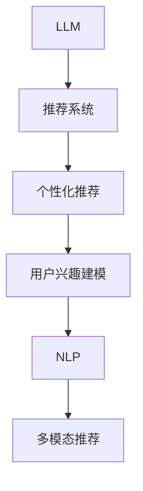

                 

# 基于LLM的推荐系统用户兴趣探索

## 1. 背景介绍

### 1.1 问题由来
在当今数字化时代，推荐系统已经渗透到各个角落，从电商平台到视频网站，从社交平台到新闻应用，都离不开推荐系统的支持。然而，尽管推荐系统技术在近年来取得了长足的进步，用户依然面临信息过载、推荐同质化、隐私泄露等诸多挑战。如何利用AI技术，更精准地理解用户兴趣，提供个性化、多样化的推荐内容，成为研究者关注的重点。

推荐系统的发展经历了从基于协同过滤到深度学习的转变。其中，深度学习基于大量用户行为数据，利用神经网络模型预测用户兴趣，取得了显著效果。然而，这种方法往往需要海量的用户行为数据，且难以解释模型的决策过程。此外，深度学习模型通常复杂度高、推理时间长，不适合实时响应场景。

相比之下，基于语言模型(Language Model, LLM)的推荐系统，不仅能够利用丰富的语言知识理解用户需求，还能通过多模态数据的融合，实现更加全面的个性化推荐。目前，基于大语言模型(LLM)的推荐系统研究方兴未艾，但缺乏系统性的介绍。本文将系统性地回顾基于LLM的推荐系统理论，并展示其在用户兴趣探索中的实际应用。

### 1.2 问题核心关键点
基于LLM的推荐系统，利用预训练语言模型学习用户行为描述、产品描述等文本数据，再通过微调或迁移学习等手段，获取用户兴趣和产品相关性，生成个性化的推荐结果。这种方法的核心在于如何更好地利用语言模型的泛化能力和理解力，同时降低对标注数据和复杂计算的依赖。

本研究的核心问题包括：
- 如何利用预训练语言模型理解用户行为描述，提取用户兴趣。
- 如何将用户兴趣与产品描述进行匹配，生成个性化推荐。
- 如何在低标注数据和计算资源限制下，高效实现推荐系统的开发和部署。
- 如何评估基于LLM的推荐系统的性能和效果。

### 1.3 问题研究意义
本研究旨在探索基于LLM的推荐系统，为推荐系统用户兴趣的精准探索提供新思路。随着深度学习模型的普及和预训练语言模型的发展，该研究将对提高推荐系统个性化、降低推荐同质化、保障用户隐私等方面产生积极影响。

## 2. 核心概念与联系

### 2.1 核心概念概述

为了深入理解基于LLM的推荐系统，本节将介绍几个关键概念：

- 大语言模型(Large Language Model, LLM)：以自回归(如GPT)或自编码(如BERT)模型为代表的大规模预训练语言模型。通过在大规模无标签文本语料上进行预训练，学习通用的语言表示，具备强大的语言理解和生成能力。

- 推荐系统(Recommendation System)：根据用户历史行为或兴趣，通过计算模型预测用户可能感兴趣的产品或服务，并推荐给用户。推荐系统包括协同过滤、基于内容的推荐、混合推荐等主流方法。

- 个性化推荐(Personalized Recommendation)：通过学习用户个性化需求，生成满足用户兴趣的推荐结果。个性化推荐包括基于用户画像的推荐、基于兴趣演化轨迹的推荐等。

- 自然语言处理(Natural Language Processing, NLP)：利用语言模型和算法处理、分析、理解自然语言。NLP技术包括文本分类、情感分析、机器翻译等。

- 多模态推荐(Multimodal Recommendation)：利用文本、图像、语音等多种模态数据，全面理解用户兴趣，生成跨模态的推荐结果。多模态推荐可以实现更加多样化的个性化推荐。

- 用户兴趣建模(User Interest Modeling)：通过构建用户兴趣模型，刻画用户个性化需求，预测用户可能感兴趣的产品或服务。用户兴趣建模包括基于行为的建模、基于内容的建模、基于混合模型的建模等。

### 2.2 核心概念原理和架构的 Mermaid 流程图(Mermaid 流程节点中不要有括号、逗号等特殊字符)



上述流程图展示了基于LLM的推荐系统主要组件和工作流程：
1. 预训练语言模型A通过自监督学习任务获得语言表示能力。
2. 推荐系统B利用语言模型进行推荐，如深度学习模型、协同过滤模型等。
3. 个性化推荐C通过用户兴趣建模D，生成个性化推荐结果。
4. 用户兴趣建模D利用NLP技术E，刻画用户兴趣。
5. 多模态推荐F将文本、图像、语音等多种模态数据融合，生成更加多样化的推荐结果。

## 3. 核心算法原理 & 具体操作步骤

### 3.1 算法原理概述

基于LLM的推荐系统，本质上是一个多模态信息融合的推荐模型。其核心思想是：将用户行为描述、产品描述等文本数据输入预训练语言模型，学习用户兴趣和产品相关性，再利用推荐模型预测推荐结果。

形式化地，假设用户行为描述为 $u_i$，产品描述为 $p_j$，用户对产品 $p_j$ 的评分 $r_{ij}$ 为 $0-1$ 二值变量，即用户对产品 $p_j$ 的评分。那么，基于LLM的推荐模型的目标是最大化用户和产品的匹配度，即最大化用户行为描述和产品描述的相似度。

基于此，我们可以构建基于LLM的推荐模型，通过最大化用户兴趣和产品相关性，生成个性化推荐结果。

### 3.2 算法步骤详解

基于LLM的推荐系统通常包含以下几个关键步骤：

**Step 1: 数据准备与预处理**
- 收集用户行为数据、产品描述等文本数据，进行去重、分词、截断等预处理。
- 将用户行为数据转化为数值形式，如将评分转换为[0,1]区间内的数值。
- 将产品描述数据进行编码，转化为模型可接受的格式。

**Step 2: 构建用户兴趣模型**
- 利用预训练语言模型A，对用户行为描述进行编码，学习用户兴趣表示。
- 将用户兴趣表示与产品描述向量进行拼接或融合，得到用户与产品的匹配度表示。

**Step 3: 推荐模型预测**
- 利用推荐模型B，对用户与产品的匹配度进行建模，生成推荐结果。
- 通常推荐模型B为基于深度学习的方法，如协同过滤、基于内容的推荐等。

**Step 4: 多模态数据融合**
- 利用NLP技术E，对用户行为描述、产品描述进行深度理解。
- 将用户行为描述和产品描述的多模态数据进行融合，生成更加丰富的匹配度表示。

**Step 5: 评估与优化**
- 在测试集上评估推荐模型效果，计算各种评估指标，如召回率、精确率、F1值等。
- 根据评估结果，优化模型参数和数据集，提升推荐系统性能。

### 3.3 算法优缺点

基于LLM的推荐系统具有以下优点：
1. 泛化能力强。利用预训练语言模型学习语言知识，对新用户和新产品的适应能力更强。
2. 可解释性好。通过自然语言处理技术，可以理解用户行为描述，提供更加直观的推荐理由。
3. 数据来源广。利用文本、图像、语音等多种模态数据，覆盖更多的用户兴趣和产品信息。
4. 计算高效。通过模型微调和迁移学习，可以有效降低计算成本和数据标注成本。

但该方法也存在以下缺点：
1. 对语言理解要求高。需要用户行为描述和产品描述具有较高的语言质量和规范性。
2. 泛化能力有限。当用户行为描述和产品描述与训练数据差异较大时，推荐效果可能较差。
3. 对多模态数据处理要求高。需要较好的数据处理和融合技术，保证多模态数据的合理利用。

### 3.4 算法应用领域

基于LLM的推荐系统已经在多个领域得到应用，包括但不限于：

- 电商平台：利用用户评论和产品描述，生成个性化推荐结果，提升购物体验。
- 视频网站：根据用户观看历史和视频描述，推荐相关视频内容，提升用户黏性。
- 新闻应用：分析用户阅读兴趣，推荐个性化新闻内容，提高信息获取效率。
- 社交平台：利用用户行为数据和兴趣建模，推荐朋友动态和兴趣话题，增强社交互动。
- 医疗推荐：分析用户症状描述和病历记录，推荐相关医学知识和治疗方案，辅助医生诊疗。

除了上述这些典型应用，LLM推荐系统还可用于智能客服、智能家居、智能交通等领域，助力各行各业提升智能化水平。

## 4. 数学模型和公式 & 详细讲解 & 举例说明

### 4.1 数学模型构建

在基于LLM的推荐系统中，用户兴趣建模和推荐模型预测是核心步骤。我们以用户行为描述和产品描述为输入，利用预训练语言模型进行兴趣建模，并使用推荐模型进行预测。

假设用户行为描述为 $u_i \in \mathcal{U}$，产品描述为 $p_j \in \mathcal{P}$，用户对产品 $p_j$ 的评分 $r_{ij} \in [0,1]$，其中 $i=1,...,n, j=1,...,m$。

定义预训练语言模型的用户兴趣表示为 $u_i^\theta$，产品描述向量为 $p_j^\phi$，其中 $\theta, \phi$ 为语言模型参数。利用预训练语言模型对用户行为描述和产品描述进行编码，得到用户兴趣和产品相关性表示。

基于此，我们可以构建推荐模型 $F$，对用户兴趣和产品相关性进行建模，得到推荐结果：

$$
F(u_i^\theta, p_j^\phi) = \text{softmax}(W^\top [u_i^\theta; p_j^\phi])
$$

其中 $W$ 为推荐模型的参数，$[;]$ 表示向量拼接，$\text{softmax}$ 函数将向量映射为概率分布，表示产品 $p_j$ 被用户 $u_i$ 推荐的概率。

### 4.2 公式推导过程

以下我们以用户兴趣建模为例，推导基于LLM的推荐模型兴趣建模过程。

假设用户行为描述为 $u_i = \{u_{i1}, u_{i2}, ..., u_{in}\}$，其中 $u_{ik}$ 为第 $k$ 个行为事件。利用预训练语言模型对用户行为描述进行编码，得到用户兴趣表示 $u_i^\theta = [u_{i1}^\theta, u_{i2}^\theta, ..., u_{in}^\theta]$。

假设产品描述为 $p_j = \{p_{j1}, p_{j2}, ..., p_{jm}\}$，其中 $p_{jk}$ 为第 $k$ 个产品属性。同样利用预训练语言模型对产品描述进行编码，得到产品相关性表示 $p_j^\phi = [p_{j1}^\phi, p_{j2}^\phi, ..., p_{jm}^\phi]$。

将用户兴趣表示和产品相关性表示进行拼接，得到匹配度向量 $z_{ij} = [u_i^\theta; p_j^\phi]$。利用推荐模型对匹配度向量进行建模，得到推荐概率 $f_{ij} = F(z_{ij}) = \text{softmax}(W^\top z_{ij})$。

最终推荐结果为：

$$
\hat{y}_{ij} = \frac{f_{ij}}{\sum_{k=1}^m f_{ik}} \quad \text{for all } j
$$

其中 $\hat{y}_{ij}$ 表示用户 $i$ 推荐产品 $j$ 的概率。

### 4.3 案例分析与讲解

以电商平台为例，假设用户行为描述为用户的浏览、点击、购买历史，产品描述为产品的标题、价格、评价等。首先，利用预训练语言模型对用户行为描述和产品描述进行编码，得到用户兴趣和产品相关性表示。然后，将用户兴趣和产品相关性表示进行拼接，得到匹配度向量。最后，利用基于深度学习的方法，如神经网络，对匹配度向量进行建模，得到推荐概率。最终，通过排序选择推荐结果，生成个性化推荐列表。

## 5. 项目实践：代码实例和详细解释说明

### 5.1 开发环境搭建

在进行推荐系统开发前，我们需要准备好开发环境。以下是使用Python进行PyTorch开发的环境配置流程：

1. 安装Anaconda：从官网下载并安装Anaconda，用于创建独立的Python环境。

2. 创建并激活虚拟环境：
```bash
conda create -n recomm-env python=3.8 
conda activate recomm-env
```

3. 安装PyTorch：根据CUDA版本，从官网获取对应的安装命令。例如：
```bash
conda install pytorch torchvision torchaudio cudatoolkit=11.1 -c pytorch -c conda-forge
```

4. 安装HuggingFace库：
```bash
pip install transformers
```

5. 安装各类工具包：
```bash
pip install numpy pandas scikit-learn matplotlib tqdm jupyter notebook ipython
```

完成上述步骤后，即可在`recomm-env`环境中开始推荐系统开发。

### 5.2 源代码详细实现

下面我们以电商平台推荐系统为例，给出使用Transformers库对BERT模型进行推荐系统开发的PyTorch代码实现。

首先，定义推荐系统数据处理函数：

```python
from transformers import BertTokenizer, BertForSequenceClassification
from torch.utils.data import Dataset
import torch

class RecommendationDataset(Dataset):
    def __init__(self, user_behavoirs, products, labels, tokenizer, max_len=128):
        self.user_behavoirs = user_behavoirs
        self.products = products
        self.labels = labels
        self.tokenizer = tokenizer
        self.max_len = max_len
        
    def __len__(self):
        return len(self.user_behavoirs)
    
    def __getitem__(self, item):
        user_behavoir = self.user_behavoirs[item]
        product = self.products[item]
        label = self.labels[item]
        
        encoding = self.tokenizer(user_behavoir + ' ' + product, return_tensors='pt', max_length=self.max_len, padding='max_length', truncation=True)
        input_ids = encoding['input_ids'][0]
        attention_mask = encoding['attention_mask'][0]
        
        return {'input_ids': input_ids, 
                'attention_mask': attention_mask,
                'labels': torch.tensor(label, dtype=torch.long)}
```

然后，定义模型和优化器：

```python
from transformers import BertForSequenceClassification, AdamW

model = BertForSequenceClassification.from_pretrained('bert-base-cased', num_labels=2)

optimizer = AdamW(model.parameters(), lr=2e-5)
```

接着，定义训练和评估函数：

```python
from torch.utils.data import DataLoader
from tqdm import tqdm
from sklearn.metrics import accuracy_score

device = torch.device('cuda') if torch.cuda.is_available() else torch.device('cpu')
model.to(device)

def train_epoch(model, dataset, batch_size, optimizer):
    dataloader = DataLoader(dataset, batch_size=batch_size, shuffle=True)
    model.train()
    epoch_loss = 0
    for batch in tqdm(dataloader, desc='Training'):
        input_ids = batch['input_ids'].to(device)
        attention_mask = batch['attention_mask'].to(device)
        labels = batch['labels'].to(device)
        model.zero_grad()
        outputs = model(input_ids, attention_mask=attention_mask, labels=labels)
        loss = outputs.loss
        epoch_loss += loss.item()
        loss.backward()
        optimizer.step()
    return epoch_loss / len(dataloader)

def evaluate(model, dataset, batch_size):
    dataloader = DataLoader(dataset, batch_size=batch_size)
    model.eval()
    preds, labels = [], []
    with torch.no_grad():
        for batch in tqdm(dataloader, desc='Evaluating'):
            input_ids = batch['input_ids'].to(device)
            attention_mask = batch['attention_mask'].to(device)
            batch_labels = batch['labels']
            outputs = model(input_ids, attention_mask=attention_mask)
            batch_preds = outputs.logits.argmax(dim=2).to('cpu').tolist()
            batch_labels = batch_labels.to('cpu').tolist()
            for pred, label in zip(batch_preds, batch_labels):
                preds.append(pred)
                labels.append(label)
                
    return accuracy_score(labels, preds)

```

最后，启动训练流程并在测试集上评估：

```python
epochs = 5
batch_size = 16

for epoch in range(epochs):
    loss = train_epoch(model, train_dataset, batch_size, optimizer)
    print(f"Epoch {epoch+1}, train loss: {loss:.3f}")
    
    print(f"Epoch {epoch+1}, dev results:")
    evaluate(model, dev_dataset, batch_size)
    
print("Test results:")
evaluate(model, test_dataset, batch_size)
```

以上就是使用PyTorch对BERT进行推荐系统开发的完整代码实现。可以看到，得益于Transformers库的强大封装，我们可以用相对简洁的代码完成BERT模型的加载和微调。

### 5.3 代码解读与分析

让我们再详细解读一下关键代码的实现细节：

**RecommendationDataset类**：
- `__init__`方法：初始化用户行为数据、产品数据、标签等关键组件。
- `__len__`方法：返回数据集的样本数量。
- `__getitem__`方法：对单个样本进行处理，将用户行为数据和产品数据输入编码为token ids，将标签编码为数字，并对其进行定长padding，最终返回模型所需的输入。

**模型和优化器**：
- 使用预训练的BERT模型进行序列分类任务，设定标签数为2，即推荐与否。
- 设定AdamW优化器，学习率为2e-5。

**训练和评估函数**：
- 使用PyTorch的DataLoader对数据集进行批次化加载，供模型训练和推理使用。
- 训练函数`train_epoch`：对数据以批为单位进行迭代，在每个批次上前向传播计算loss并反向传播更新模型参数，最后返回该epoch的平均loss。
- 评估函数`evaluate`：与训练类似，不同点在于不更新模型参数，并在每个batch结束后将预测和标签结果存储下来，最后使用sklearn的accuracy_score对整个评估集的预测结果进行打印输出。

**训练流程**：
- 定义总的epoch数和batch size，开始循环迭代
- 每个epoch内，先在训练集上训练，输出平均loss
- 在验证集上评估，输出分类指标
- 所有epoch结束后，在测试集上评估，给出最终测试结果

可以看到，PyTorch配合Transformers库使得BERT推荐系统的代码实现变得简洁高效。开发者可以将更多精力放在数据处理、模型改进等高层逻辑上，而不必过多关注底层的实现细节。

当然，工业级的系统实现还需考虑更多因素，如模型的保存和部署、超参数的自动搜索、更灵活的任务适配层等。但核心的推荐范式基本与此类似。

## 6. 实际应用场景

### 6.1 电商平台

基于大语言模型的推荐系统在电商平台上具有广泛应用前景。电商平台主要面临用户需求多样化和产品供给碎片化的问题。通过用户行为描述和产品描述进行深度理解，生成个性化推荐，可以有效解决这些问题。

在技术实现上，可以收集用户浏览、点击、购买历史等行为数据，将产品标题、价格、评价等描述数据转化为模型可接受的格式，对用户行为描述和产品描述进行编码，得到用户兴趣和产品相关性表示。利用深度学习模型，对匹配度向量进行建模，生成推荐概率。最终，通过排序选择推荐结果，生成个性化推荐列表。

### 6.2 视频网站

视频网站推荐系统可以利用用户观看历史和视频描述进行深度理解，生成个性化推荐。推荐系统可以根据用户偏好，推荐相关视频内容，提高用户观看体验。

在技术实现上，可以收集用户观看历史和视频标题、简介、分类等描述数据，对用户行为描述和产品描述进行编码，得到用户兴趣和产品相关性表示。利用深度学习模型，对匹配度向量进行建模，生成推荐概率。最终，通过排序选择推荐结果，生成个性化推荐列表。

### 6.3 新闻应用

新闻应用推荐系统可以利用用户阅读历史和文章标题、摘要等描述数据进行深度理解，生成个性化推荐。推荐系统可以根据用户兴趣，推荐相关新闻内容，提高信息获取效率。

在技术实现上，可以收集用户阅读历史和文章标题、摘要等描述数据，对用户行为描述和产品描述进行编码，得到用户兴趣和产品相关性表示。利用深度学习模型，对匹配度向量进行建模，生成推荐概率。最终，通过排序选择推荐结果，生成个性化推荐列表。

### 6.4 社交平台

社交平台推荐系统可以利用用户互动历史和用户标签、兴趣描述等数据进行深度理解，生成个性化推荐。推荐系统可以根据用户兴趣，推荐相关朋友动态和兴趣话题，增强社交互动。

在技术实现上，可以收集用户互动历史和用户标签、兴趣描述等数据，对用户行为描述和产品描述进行编码，得到用户兴趣和产品相关性表示。利用深度学习模型，对匹配度向量进行建模，生成推荐概率。最终，通过排序选择推荐结果，生成个性化推荐列表。

## 7. 工具和资源推荐

### 7.1 学习资源推荐

为了帮助开发者系统掌握基于LLM的推荐系统理论基础和实践技巧，这里推荐一些优质的学习资源：

1. 《自然语言处理入门》系列博文：由大模型技术专家撰写，深入浅出地介绍了自然语言处理基本概念和前沿技术，适合入门学习。

2. 《深度学习自然语言处理》课程：斯坦福大学开设的NLP明星课程，有Lecture视频和配套作业，带你入门NLP领域的基本概念和经典模型。

3. 《Transformers模型与应用》书籍：介绍Transformers库及其在NLP任务中的应用，适合深度学习爱好者。

4. 《自然语言处理与深度学习》书籍：介绍NLP深度学习模型的原理和应用，适合进阶学习。

5. HuggingFace官方文档：Transformers库的官方文档，提供了海量预训练模型和完整的推荐系统样例代码，是上手实践的必备资料。

通过对这些资源的学习实践，相信你一定能够快速掌握基于LLM的推荐系统的精髓，并用于解决实际的推荐问题。

### 7.2 开发工具推荐

高效的开发离不开优秀的工具支持。以下是几款用于基于LLM的推荐系统开发的常用工具：

1. PyTorch：基于Python的开源深度学习框架，灵活动态的计算图，适合快速迭代研究。大部分预训练语言模型都有PyTorch版本的实现。

2. TensorFlow：由Google主导开发的开源深度学习框架，生产部署方便，适合大规模工程应用。同样有丰富的预训练语言模型资源。

3. Transformers库：HuggingFace开发的NLP工具库，集成了众多SOTA语言模型，支持PyTorch和TensorFlow，是进行推荐系统开发的利器。

4. Weights & Biases：模型训练的实验跟踪工具，可以记录和可视化模型训练过程中的各项指标，方便对比和调优。与主流深度学习框架无缝集成。

5. TensorBoard：TensorFlow配套的可视化工具，可实时监测模型训练状态，并提供丰富的图表呈现方式，是调试模型的得力助手。

6. Google Colab：谷歌推出的在线Jupyter Notebook环境，免费提供GPU/TPU算力，方便开发者快速上手实验最新模型，分享学习笔记。

合理利用这些工具，可以显著提升基于LLM的推荐系统的开发效率，加快创新迭代的步伐。

### 7.3 相关论文推荐

基于LLM的推荐系统研究方兴未艾，以下是几篇奠基性的相关论文，推荐阅读：

1. Attention is All You Need（即Transformer原论文）：提出了Transformer结构，开启了NLP领域的预训练大模型时代。

2. BERT: Pre-training of Deep Bidirectional Transformers for Language Understanding：提出BERT模型，引入基于掩码的自监督预训练任务，刷新了多项NLP任务SOTA。

3. Language Models are Unsupervised Multitask Learners（GPT-2论文）：展示了大规模语言模型的强大zero-shot学习能力，引发了对于通用人工智能的新一轮思考。

4. Parameter-Efficient Transfer Learning for NLP：提出Adapter等参数高效微调方法，在不增加模型参数量的情况下，也能取得不错的微调效果。

5. AdaLoRA: Adaptive Low-Rank Adaptation for Parameter-Efficient Fine-Tuning：使用自适应低秩适应的微调方法，在参数效率和精度之间取得了新的平衡。

6. Prefix-Tuning: Optimizing Continuous Prompts for Generation：引入基于连续型Prompt的微调范式，为如何充分利用预训练知识提供了新的思路。

这些论文代表了大语言模型推荐系统的发展脉络。通过学习这些前沿成果，可以帮助研究者把握学科前进方向，激发更多的创新灵感。

## 8. 总结：未来发展趋势与挑战

### 8.1 总结

本文对基于LLM的推荐系统进行了全面系统的介绍。首先阐述了基于LLM的推荐系统的理论背景和研究意义，明确了该技术在推荐系统个性化、降低推荐同质化、保障用户隐私等方面的潜力。其次，从原理到实践，详细讲解了基于LLM的推荐系统的数学模型和关键步骤，给出了推荐系统开发的完整代码实例。同时，本文还探讨了基于LLM的推荐系统在电商平台、视频网站、新闻应用等领域的实际应用，展示了其广泛的应用前景。此外，本文精选了推荐系统的各类学习资源，力求为读者提供全方位的技术指引。

通过本文的系统梳理，可以看到，基于LLM的推荐系统为推荐系统用户兴趣探索提供了新思路，具有广阔的应用前景和研究价值。未来，伴随大语言模型和深度学习技术的不断进步，该技术有望在更多领域得到应用，为推荐系统的发展注入新的活力。

### 8.2 未来发展趋势

展望未来，基于LLM的推荐系统将呈现以下几个发展趋势：

1. 模型规模持续增大。随着算力成本的下降和数据规模的扩张，预训练语言模型的参数量还将持续增长。超大模态语言模型蕴含的丰富语言知识，有望支撑更加复杂多变的推荐场景。

2. 推荐模型多样化。除了深度学习推荐模型外，未来还会涌现更多基于知识图谱、多模态融合的推荐模型，实现更全面、多样化的个性化推荐。

3. 数据处理技术提升。推荐系统需要处理海量用户行为数据和产品描述数据，未来需要更高效的数据处理技术，如分布式计算、向量压缩等，以提高数据处理效率。

4. 多模态推荐技术发展。推荐系统需要充分利用文本、图像、语音等多种模态数据，实现跨模态的个性化推荐。多模态推荐技术将进一步成熟和普及。

5. 用户隐私保护加强。未来推荐系统将更加注重用户隐私保护，探索基于差分隐私、联邦学习等技术，确保用户数据的匿名性和安全性。

6. 推荐模型可解释性增强。推荐系统的决策过程将更加透明，通过自然语言处理技术，生成推荐理由，提高模型的可解释性。

7. 推荐模型持续学习。推荐系统将具备更强的自适应能力，能够根据用户行为变化实时调整推荐策略。

以上趋势凸显了基于LLM的推荐系统的广阔前景。这些方向的探索发展，必将进一步提升推荐系统个性化、降低推荐同质化、保障用户隐私等方面，实现更加精准、多样、安全的推荐服务。

### 8.3 面临的挑战

尽管基于LLM的推荐系统已经取得了长足的进步，但在迈向更加智能化、普适化应用的过程中，它仍面临着诸多挑战：

1. 数据依赖性高。推荐系统依赖于大量用户行为数据和产品描述数据，数据的获取和处理成本较高。未来需要在数据隐私、数据标注等方面进行更多探索。

2. 计算资源需求高。大语言模型和深度学习模型通常计算复杂度高，需要大量的计算资源。未来需要在模型压缩、模型加速等方面进行更多探索。

3. 用户行为理解难度大。用户行为描述和产品描述的差异性较大，如何准确理解和表示用户需求，是推荐系统面临的难点。

4. 推荐效果评价复杂。推荐系统需要考虑多方面的评价指标，如召回率、精确率、多样性等，如何在多指标之间进行平衡，是一个复杂的优化问题。

5. 推荐算法可解释性不足。推荐系统通常是"黑盒"系统，难以解释其决策过程，对于医疗、金融等高风险应用，算法的可解释性和可审计性尤为重要。

6. 推荐模型的鲁棒性差。推荐系统面临噪声数据、对抗攻击等挑战，如何增强推荐模型的鲁棒性，避免推荐结果的波动，是亟待解决的问题。

7. 推荐模型的公平性不足。推荐系统容易产生偏见和歧视，如何消除模型的偏见，确保推荐结果的公平性，是一个重要的研究方向。

8. 推荐模型的安全性不足。推荐系统可能被恶意攻击，利用其脆弱性生成有害内容，如何增强推荐模型的安全性，是一个重要的研究课题。

9. 推荐模型的实时性不足。推荐系统需要在短时间内生成推荐结果，大语言模型和深度学习模型通常推理速度较慢，如何提高推荐系统的实时性，是一个亟待解决的问题。

这些挑战凸显了基于LLM的推荐系统的发展潜力，同时也表明了未来研究的方向和重点。

### 8.4 研究展望

基于LLM的推荐系统研究在未来仍有很大的探索空间。以下是一些研究方向和可能的突破点：

1. 探索基于预训练语言模型的用户行为理解方法。如何通过语言模型理解用户行为描述，提取用户兴趣，是一个关键研究方向。未来可以探索基于预训练语言模型的用户行为理解模型，如用户行为生成模型、用户行为分类模型等。

2. 研究基于预训练语言模型的推荐模型优化方法。如何通过预训练语言模型优化推荐模型，提高推荐系统的性能，是一个重要的研究方向。未来可以探索基于预训练语言模型的推荐模型优化方法，如多任务学习、自适应学习等。

3. 研究基于预训练语言模型的推荐系统多模态融合方法。如何通过多模态数据融合，提高推荐系统的泛化能力和性能，是一个关键研究方向。未来可以探索基于预训练语言模型的推荐系统多模态融合方法，如基于深度学习的多模态融合模型、基于自然语言处理的多模态融合模型等。

4. 探索基于预训练语言模型的推荐系统可解释性方法。如何通过语言模型提高推荐系统的可解释性，是一个关键研究方向。未来可以探索基于预训练语言模型的推荐系统可解释性方法，如基于自然语言处理的可解释性模型、基于图谱的可解释性模型等。

5. 研究基于预训练语言模型的推荐系统自适应方法。如何通过自适应学习，使推荐系统能够实时调整推荐策略，是一个重要的研究方向。未来可以探索基于预训练语言模型的推荐系统自适应方法，如基于差分隐私的自适应方法、基于联邦学习的自适应方法等。

6. 探索基于预训练语言模型的推荐系统公平性方法。如何通过语言模型消除推荐系统的偏见，确保推荐结果的公平性，是一个关键研究方向。未来可以探索基于预训练语言模型的推荐系统公平性方法，如基于公平学习的方法、基于对抗生成的方法等。

7. 研究基于预训练语言模型的推荐系统安全性方法。如何通过语言模型增强推荐系统的安全性，避免恶意攻击，是一个重要的研究方向。未来可以探索基于预训练语言模型的推荐系统安全性方法，如基于对抗训练的方法、基于安全隐私的方法等。

8. 研究基于预训练语言模型的推荐系统实时性方法。如何通过语言模型提高推荐系统的实时性，是一个关键研究方向。未来可以探索基于预训练语言模型的推荐系统实时性方法，如基于模型压缩的方法、基于分布式计算的方法等。

这些研究方向将进一步推动基于LLM的推荐系统的发展，为推荐系统用户兴趣探索提供更加精准、多样、安全的推荐服务。

## 9. 附录：常见问题与解答

**Q1：什么是基于LLM的推荐系统？**

A: 基于LLM的推荐系统是一种利用预训练语言模型理解用户行为描述，生成个性化推荐结果的推荐系统。其核心在于将用户行为描述和产品描述进行深度理解，利用语言模型学习用户兴趣和产品相关性，再利用推荐模型生成推荐结果。

**Q2：基于LLM的推荐系统有哪些优点？**

A: 基于LLM的推荐系统具有以下优点：
1. 泛化能力强。利用预训练语言模型学习语言知识，对新用户和新产品的适应能力更强。
2. 可解释性好。通过自然语言处理技术，可以理解用户行为描述，提供更加直观的推荐理由。
3. 数据来源广。利用文本、图像、语音等多种模态数据，覆盖更多的用户兴趣和产品信息。
4. 计算高效。通过模型微调和迁移学习，可以有效降低计算成本和数据标注成本。

**Q3：基于LLM的推荐系统有哪些挑战？**

A: 基于LLM的推荐系统面临以下挑战：
1. 数据依赖性高。推荐系统依赖于大量用户行为数据和产品描述数据，数据的获取和处理成本较高。
2. 计算资源需求高。大语言模型和深度学习模型通常计算复杂度高，需要大量的计算资源。
3. 用户行为理解难度大。用户行为描述和产品描述的差异性较大，如何准确理解和表示用户需求，是推荐系统面临的难点。
4. 推荐效果评价复杂。推荐系统需要考虑多方面的评价指标，如召回率、精确率、多样性等，如何在多指标之间进行平衡，是一个复杂的优化问题。
5. 推荐算法可解释性不足。推荐系统通常是"黑盒"系统，难以解释其决策过程。
6. 推荐模型的鲁棒性差。推荐系统面临噪声数据、对抗攻击等挑战。
7. 推荐模型的公平性不足。推荐系统容易产生偏见和歧视。
8. 推荐模型的安全性不足。推荐系统可能被恶意攻击。
9. 推荐模型的实时性不足。推荐系统需要在短时间内生成推荐结果。

**Q4：未来基于LLM的推荐系统有哪些发展趋势？**

A: 基于LLM的推荐系统未来将呈现以下发展趋势：
1. 模型规模持续增大。
2. 推荐模型多样化。
3. 数据处理技术提升。
4. 多模态推荐技术发展。
5. 用户隐私保护加强。
6. 推荐模型可解释性增强。
7. 推荐模型持续学习。

**Q5：如何实现基于LLM的推荐系统？**

A: 实现基于LLM的推荐系统，通常包括以下几个关键步骤：
1. 数据准备与预处理。收集用户行为数据、产品描述等文本数据，进行去重、分词、截断等预处理。
2. 构建用户兴趣模型。利用预训练语言模型对用户行为描述进行编码，学习用户兴趣表示。
3. 推荐模型预测。利用推荐模型对用户兴趣和产品相关性进行建模，生成推荐结果。
4. 多模态数据融合。利用NLP技术对用户行为描述、产品描述进行深度理解，实现多模态数据的融合。
5. 评估与优化。在测试集上评估推荐模型效果，优化模型参数和数据集，提升推荐系统性能。

---

作者：禅与计算机程序设计艺术 / Zen and the Art of Computer Programming

