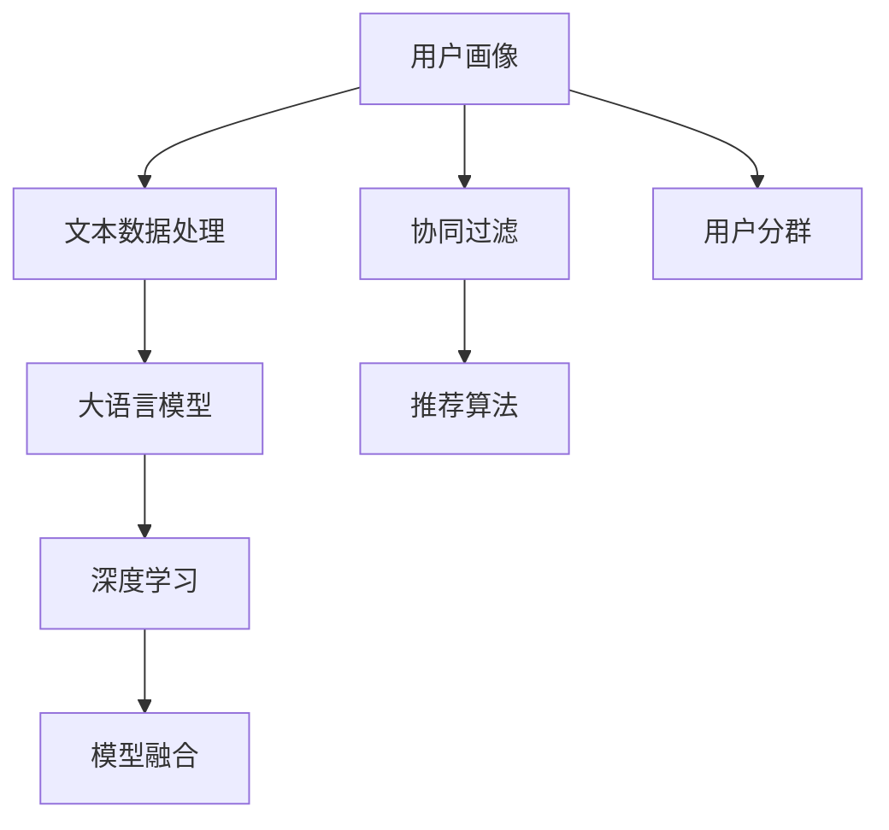

                 

# 基于LLM的推荐系统用户分群方法

> 关键词：推荐系统,用户分群,自然语言处理,大语言模型,深度学习,用户画像,协同过滤

## 1. 背景介绍

### 1.1 问题由来

推荐系统在电商、视频、音乐、新闻等互联网领域有广泛应用，旨在帮助用户发现感兴趣的新内容，提升用户满意度与平台转化率。然而，面对海量用户，推荐系统面临着数据稀疏性、冷启动用户、动态行为变化等问题。在用户行为多样、数据稀疏、新用户众多、隐式反馈占主导的复杂场景下，如何高效、准确地为用户画像，成为亟需解决的难题。

用户分群（User Segmentation）是推荐系统中一个重要的基础环节，旨在将用户分为多个不同群体，每个群体具有相似的兴趣和行为特征，从而更精准地为不同群体定制推荐策略。传统的用户分群方法主要依赖于统计特征与行为模式，但由于缺少对文本数据的深入利用，导致用户画像维度较低、准确性差，难以应对隐式数据复杂度。

近年来，大语言模型（Large Language Model, LLM）在自然语言处理（Natural Language Processing, NLP）领域取得了巨大突破。BERT、GPT、T5等模型在理解自然语言语义、生成文本等方面的表现令人瞩目。大语言模型通过预训练在大规模语料库上学习丰富的语言知识，具有较强的上下文理解能力。借助大语言模型，推荐系统可以在用户描述、评论、反馈等文本数据中提取更丰富的用户画像信息，提升分群的准确性和精细度。

### 1.2 问题核心关键点

本文聚焦于基于大语言模型的推荐系统用户分群方法，其核心关键点包括：

- 如何通过文本数据提升用户画像的维度与准确性。
- 如何高效、低成本地对用户进行分组。
- 如何将大语言模型与推荐系统有效结合，实现更精准的用户分群。

这些关键问题，需要从文本数据的理解、模型架构的设计、算法的优化等多个维度进行综合思考与创新。

## 2. 核心概念与联系

### 2.1 核心概念概述

为更好地理解基于大语言模型的推荐系统用户分群方法，本节将介绍几个密切相关的核心概念：

- **大语言模型（LLM）**：以自回归（如GPT）或自编码（如BERT）模型为代表的大规模预训练语言模型。通过在大规模无标签文本语料上进行预训练，学习通用的语言表示，具备强大的语言理解和生成能力。

- **推荐系统（Recommendation System）**：旨在推荐用户感兴趣物品的系统，包括协同过滤、基于内容的推荐、混合推荐等不同方法。

- **用户画像（User Profile）**：通过统计特征与行为模式，为每个用户构建的个性化标签，用于推荐策略的定制。

- **用户分群（User Segmentation）**：将用户分为多个不同群体，每个群体具有相似的兴趣和行为特征，从而更精准地为不同群体定制推荐策略。

- **深度学习（Deep Learning）**：基于多层神经网络，通过训练提取高层次特征，解决复杂非线性问题。

- **协同过滤（Collaborative Filtering）**：利用用户与物品之间的隐式关系，预测用户对物品的评分，用于推荐新物品。

- **模型融合（Model Fusion）**：将多个模型的预测结果进行加权融合，提升预测准确性和鲁棒性。

这些核心概念之间的逻辑关系可以通过以下Mermaid流程图来展示：



这个流程图展示了大语言模型的核心概念及其之间的关系：

1. 用户画像通过文本数据处理，学习到更多维度的特征信息。
2. 大语言模型对文本数据进行理解，提升用户画像的精度。
3. 协同过滤通过用户与物品关系，推荐物品给用户。
4. 深度学习通过多层神经网络，提取高层次的特征信息。
5. 模型融合通过加权组合，提升推荐效果。
6. 用户分群根据用户画像与行为数据，对用户进行分组。

这些概念共同构成了推荐系统和大语言模型的应用框架，使其能够在各种场景下发挥强大的推荐与分群能力。通过理解这些核心概念，我们可以更好地把握推荐系统的应用场景和优化方向。

## 3. 核心算法原理 & 具体操作步骤

### 3.1 算法原理概述

基于大语言模型的推荐系统用户分群方法，本质上是一个多任务学习过程。其核心思想是：通过大语言模型对用户文本数据进行建模，提取用户的隐式特征和语义信息，进而实现对用户的深度分群。

形式化地，假设用户文本数据集为 $D=\{(x_i,y_i)\}_{i=1}^N, x_i \in \mathcal{X}, y_i \in \mathcal{Y}$，其中 $\mathcal{X}$ 为输入空间，$\mathcal{Y}$ 为输出空间。定义用户分群的损失函数为 $\mathcal{L}(\theta)$，其中 $\theta$ 为模型参数。分群目标是最小化损失函数，即找到最优参数：

$$
\theta^* = \mathop{\arg\min}_{\theta} \mathcal{L}(\theta)
$$

### 3.2 算法步骤详解

基于大语言模型的推荐系统用户分群方法一般包括以下几个关键步骤：

**Step 1: 文本数据预处理**

- 收集用户描述、评论、评分等文本数据。
- 使用NLP技术进行分词、去除停用词、词性标注等文本预处理。
- 构建词汇表，将文本转换为数值形式。
- 使用余弦相似度、TF-IDF等方法，计算文本向量表示。

**Step 2: 构建用户画像**

- 根据文本数据，训练大语言模型，生成用户画像。
- 将用户画像存储为高维向量，便于与其他用户进行比较。
- 对每个用户，选择最相似的用户画像进行相似度计算。

**Step 3: 用户分群**

- 根据用户画像的相似度，将用户分为不同群体。
- 使用层次聚类、K-means等算法，进行聚类分群。
- 对每个群体，计算群体的中心向量，代表该群体的兴趣和行为特征。

**Step 4: 训练与评估**

- 训练用户分群模型，最小化分群损失函数。
- 在验证集上评估模型的性能，根据评价指标调整模型参数。
- 部署模型，对新用户进行分群，并根据分群结果进行推荐策略的定制。

**Step 5: 模型更新**

- 定期收集用户的新数据，重新训练模型进行分群。
- 结合最新数据和旧数据，进行模型融合。
- 更新用户画像和分群策略，适应用户行为的变化。

### 3.3 算法优缺点

基于大语言模型的推荐系统用户分群方法具有以下优点：

1. 高效精准：通过大语言模型对文本数据的深入理解，能更全面地刻画用户画像，提升分群的准确性。
2. 多维度融合：能融合用户文本数据、行为数据、隐式反馈等多元信息，实现更精细的用户分群。
3. 低成本：相比传统的特征工程方法，利用大语言模型进行文本特征提取，减少了特征工程的工作量。
4. 可解释性强：大语言模型能生成分群规则，便于进行解释和理解。

同时，该方法也存在一些局限性：

1. 数据稀疏性：对稀疏数据（如文本评论）处理效果较差。
2. 模型复杂度：大语言模型参数量大，需要较强的计算资源。
3. 隐私问题：利用用户文本数据进行分群，涉及用户隐私保护问题。
4. 鲁棒性问题：模型的鲁棒性和泛化能力有待提升。

尽管存在这些局限性，但就目前而言，基于大语言模型的用户分群方法仍是大规模推荐系统的有效手段。未来相关研究的重点在于如何进一步降低模型对数据稀疏性的敏感度，提高模型的泛化能力和鲁棒性，同时兼顾隐私保护和解释性要求。

### 3.4 算法应用领域

基于大语言模型的推荐系统用户分群方法，在电商、视频、音乐、新闻等互联网领域有广泛应用，具体包括：

1. **电商推荐**：通过对用户描述、评论、评分等文本数据进行分群，个性化推荐商品。
2. **视频推荐**：通过用户观看历史、评分、评价等文本数据进行分群，推荐视频内容。
3. **音乐推荐**：利用用户听歌历史、评论、评分等文本数据进行分群，推荐音乐作品。
4. **新闻推荐**：根据用户阅读历史、评论、评分等文本数据进行分群，推荐新闻资讯。
5. **社交推荐**：通过对用户评论、私信、互动等文本数据进行分群，推荐好友和群组。
6. **体育赛事推荐**：利用用户评论、讨论、评分等文本数据进行分群，推荐相关赛事。

除了上述这些经典应用外，用户分群技术还被创新性地应用到更多场景中，如旅游、金融、教育等，为推荐系统带来了全新的突破。随着大语言模型和用户分群技术的不断发展，推荐系统必将在更广阔的应用领域大放异彩。

## 4. 数学模型和公式 & 详细讲解 & 举例说明

### 4.1 数学模型构建

本节将使用数学语言对基于大语言模型的推荐系统用户分群过程进行更加严格的刻画。

记用户文本数据为 $D=\{(x_i,y_i)\}_{i=1}^N, x_i \in \mathcal{X}, y_i \in \mathcal{Y}$，其中 $\mathcal{X}$ 为输入空间，$\mathcal{Y}$ 为输出空间。假设用户画像表示为 $\boldsymbol{u}_i \in \mathbb{R}^d$，其中 $d$ 为向量维度。用户分群的目标是找到最优用户画像 $\boldsymbol{u}_i$，使得模型损失最小。假设用户分群模型为 $M_{\theta}:\mathcal{X} \rightarrow \mathbb{R}^k$，其中 $k$ 为分群数，则用户分群问题可以表示为：

$$
\theta^* = \mathop{\arg\min}_{\theta} \sum_{i=1}^N \mathcal{L}(M_{\theta}(\boldsymbol{u}_i),y_i)
$$

其中 $\mathcal{L}$ 为损失函数，通常使用余弦相似度或欧式距离等。假设 $M_{\theta}(\boldsymbol{u}_i)$ 为第 $i$ 个用户的向量表示，$y_i$ 为分群标签。

### 4.2 公式推导过程

以下我们以余弦相似度为例，推导用户分群的损失函数及其梯度计算公式。

假设模型 $M_{\theta}$ 在输入 $\boldsymbol{u}_i$ 上的输出为 $\hat{\boldsymbol{u}}_i=M_{\theta}(\boldsymbol{u}_i) \in \mathbb{R}^k$，表示用户分群标签。则余弦相似度损失函数定义为：

$$
\ell(M_{\theta}(\boldsymbol{u}_i),y_i) = 1-\cos(\hat{\boldsymbol{u}}_i,y_i)
$$

将其代入损失函数，得：

$$
\mathcal{L}(\theta) = \frac{1}{N} \sum_{i=1}^N \ell(M_{\theta}(\boldsymbol{u}_i),y_i)
$$

根据链式法则，损失函数对模型参数 $\theta$ 的梯度为：

$$
\frac{\partial \mathcal{L}(\theta)}{\partial \theta} = -\frac{1}{N}\sum_{i=1}^N \nabla_{\theta}\ell(M_{\theta}(\boldsymbol{u}_i),y_i)
$$

其中 $\nabla_{\theta}\ell(M_{\theta}(\boldsymbol{u}_i),y_i)$ 为损失函数对模型参数 $\theta$ 的梯度，可通过反向传播算法高效计算。

在得到损失函数的梯度后，即可带入优化算法（如Adam、SGD等），完成模型迭代优化。重复上述过程直至收敛，最终得到适应用户分群的最佳模型参数 $\theta^*$。

## 5. 项目实践：代码实例和详细解释说明

### 5.1 开发环境搭建

在进行用户分群实践前，我们需要准备好开发环境。以下是使用Python进行PyTorch开发的环境配置流程：

1. 安装Anaconda：从官网下载并安装Anaconda，用于创建独立的Python环境。

2. 创建并激活虚拟环境：
```bash
conda create -n pytorch-env python=3.8 
conda activate pytorch-env
```

3. 安装PyTorch：根据CUDA版本，从官网获取对应的安装命令。例如：
```bash
conda install pytorch torchvision torchaudio cudatoolkit=11.1 -c pytorch -c conda-forge
```

4. 安装Transformers库：
```bash
pip install transformers
```

5. 安装各类工具包：
```bash
pip install numpy pandas scikit-learn matplotlib tqdm jupyter notebook ipython
```

完成上述步骤后，即可在`pytorch-env`环境中开始用户分群实践。

### 5.2 源代码详细实现

下面我以电商推荐系统为例，给出使用Transformers库对BERT模型进行用户分群的PyTorch代码实现。

首先，定义用户画像数据的处理函数：

```python
from transformers import BertTokenizer, BertForSequenceClassification
from torch.utils.data import Dataset
import torch

class UserData(Dataset):
    def __init__(self, user_descriptions, user_ratings, tokenizer, max_len=128):
        self.user_descriptions = user_descriptions
        self.user_ratings = user_ratings
        self.tokenizer = tokenizer
        self.max_len = max_len
        
    def __len__(self):
        return len(self.user_descriptions)
    
    def __getitem__(self, item):
        description = self.user_descriptions[item]
        rating = self.user_ratings[item]
        
        encoding = self.tokenizer(description, return_tensors='pt', max_length=self.max_len, padding='max_length', truncation=True)
        input_ids = encoding['input_ids'][0]
        attention_mask = encoding['attention_mask'][0]
        
        # 对文本数据进行编码
        rating_one_hot = torch.tensor([rating == 5, rating == 4, rating == 3, rating == 2, rating == 1], dtype=torch.float)
        
        return {'input_ids': input_ids, 
                'attention_mask': attention_mask,
                'rating': rating_one_hot}
```

然后，定义模型和优化器：

```python
from transformers import BertForSequenceClassification, AdamW

model = BertForSequenceClassification.from_pretrained('bert-base-cased', num_labels=5)

optimizer = AdamW(model.parameters(), lr=2e-5)
```

接着，定义训练和评估函数：

```python
from torch.utils.data import DataLoader
from tqdm import tqdm
from sklearn.metrics import accuracy_score

device = torch.device('cuda') if torch.cuda.is_available() else torch.device('cpu')
model.to(device)

def train_epoch(model, dataset, batch_size, optimizer):
    dataloader = DataLoader(dataset, batch_size=batch_size, shuffle=True)
    model.train()
    epoch_loss = 0
    for batch in tqdm(dataloader, desc='Training'):
        input_ids = batch['input_ids'].to(device)
        attention_mask = batch['attention_mask'].to(device)
        rating = batch['rating'].to(device)
        model.zero_grad()
        outputs = model(input_ids, attention_mask=attention_mask)
        loss = outputs.loss
        epoch_loss += loss.item()
        loss.backward()
        optimizer.step()
    return epoch_loss / len(dataloader)

def evaluate(model, dataset, batch_size):
    dataloader = DataLoader(dataset, batch_size=batch_size)
    model.eval()
    preds, labels = [], []
    with torch.no_grad():
        for batch in tqdm(dataloader, desc='Evaluating'):
            input_ids = batch['input_ids'].to(device)
            attention_mask = batch['attention_mask'].to(device)
            batch_labels = batch['rating'].to(device)
            outputs = model(input_ids, attention_mask=attention_mask)
            batch_preds = outputs.logits.argmax(dim=1).to('cpu').tolist()
            batch_labels = batch_labels.to('cpu').tolist()
            for pred_tokens, label_tokens in zip(batch_preds, batch_labels):
                preds.append(pred_tokens)
                labels.append(label_tokens)
                
    return accuracy_score(labels, preds)
```

最后，启动训练流程并在验证集上评估：

```python
epochs = 5
batch_size = 16

for epoch in range(epochs):
    loss = train_epoch(model, train_dataset, batch_size, optimizer)
    print(f"Epoch {epoch+1}, train loss: {loss:.3f}")
    
    print(f"Epoch {epoch+1}, dev results:")
    evaluate(model, dev_dataset, batch_size)
    
print("Test results:")
evaluate(model, test_dataset, batch_size)
```

以上就是使用PyTorch对BERT进行用户分群任务的完整代码实现。可以看到，得益于Transformers库的强大封装，我们可以用相对简洁的代码完成BERT模型的加载和分群训练。

### 5.3 代码解读与分析

让我们再详细解读一下关键代码的实现细节：

**UserData类**：
- `__init__`方法：初始化用户描述、评分、分词器等关键组件。
- `__len__`方法：返回数据集的样本数量。
- `__getitem__`方法：对单个样本进行处理，将文本输入编码为token ids，将评分转换为one-hot编码，并对其进行定长padding，最终返回模型所需的输入。

**评分处理**：
- 将评分转换为one-hot编码，方便模型进行多分类预测。

**训练和评估函数**：
- 使用PyTorch的DataLoader对数据集进行批次化加载，供模型训练和推理使用。
- 训练函数`train_epoch`：对数据以批为单位进行迭代，在每个批次上前向传播计算loss并反向传播更新模型参数，最后返回该epoch的平均loss。
- 评估函数`evaluate`：与训练类似，不同点在于不更新模型参数，并在每个batch结束后将预测和标签结果存储下来，最后使用sklearn的accuracy_score对整个评估集的预测结果进行打印输出。

**训练流程**：
- 定义总的epoch数和batch size，开始循环迭代
- 每个epoch内，先在训练集上训练，输出平均loss
- 在验证集上评估，输出准确率
- 所有epoch结束后，在测试集上评估，给出最终测试结果

可以看到，PyTorch配合Transformers库使得BERT用户分群的代码实现变得简洁高效。开发者可以将更多精力放在数据处理、模型改进等高层逻辑上，而不必过多关注底层的实现细节。

当然，工业级的系统实现还需考虑更多因素，如模型的保存和部署、超参数的自动搜索、更灵活的任务适配层等。但核心的分群范式基本与此类似。

## 6. 实际应用场景

### 6.1 电商推荐

基于大语言模型的推荐系统用户分群方法，可以广泛应用于电商推荐系统中。传统的电商推荐系统依赖于用户的购买历史、浏览历史等行为数据，难以应对新用户和老用户的多样化需求。利用用户描述、评论、评分等文本数据进行分群，能够更全面地刻画用户画像，提升推荐精度。

在技术实现上，可以收集用户的电商行为数据，将用户描述、评论、评分等文本数据作为分群依据。将文本数据输入BERT模型，生成用户画像向量，并利用余弦相似度、K-means等算法进行分群。对每个群体，制定特定的推荐策略，并根据群体特征进行个性化推荐。

### 6.2 视频推荐

视频推荐系统需要根据用户的观看历史、评分、评价等文本数据进行分群，推荐相关视频内容。在传统方法中，视频推荐主要依赖用户的评分数据，难以捕捉用户的长期兴趣。通过用户分群，可以更好地理解用户兴趣的多样性和变化性，制定更精准的推荐策略。

在技术实现上，可以收集用户的观看历史、评分、评价等文本数据，并对其进行分群。利用BERT等大语言模型生成用户画像向量，并利用K-means等算法进行分群。对每个群体，制定特定的推荐策略，并根据群体特征进行个性化推荐。

### 6.3 音乐推荐

音乐推荐系统需要根据用户的听歌历史、评论、评分等文本数据进行分群，推荐相关音乐作品。与视频推荐类似，传统方法主要依赖用户的评分数据，难以捕捉用户的长期兴趣。通过用户分群，可以更好地理解用户兴趣的多样性和变化性，制定更精准的推荐策略。

在技术实现上，可以收集用户的听歌历史、评论、评分等文本数据，并对其进行分群。利用BERT等大语言模型生成用户画像向量，并利用K-means等算法进行分群。对每个群体，制定特定的推荐策略，并根据群体特征进行个性化推荐。

### 6.4 新闻推荐

新闻推荐系统需要根据用户的阅读历史、评论、评分等文本数据进行分群，推荐相关新闻资讯。与视频、音乐推荐类似，传统方法主要依赖用户的评分数据，难以捕捉用户的长期兴趣。通过用户分群，可以更好地理解用户兴趣的多样性和变化性，制定更精准的推荐策略。

在技术实现上，可以收集用户的阅读历史、评论、评分等文本数据，并对其进行分群。利用BERT等大语言模型生成用户画像向量，并利用K-means等算法进行分群。对每个群体，制定特定的推荐策略，并根据群体特征进行个性化推荐。

### 6.5 社交推荐

社交推荐系统需要根据用户的评论、私信、互动等文本数据进行分群，推荐相关好友和群组。传统方法主要依赖用户的社交网络关系，难以捕捉用户的多样化兴趣。通过用户分群，可以更好地理解用户的兴趣和行为模式，制定更精准的推荐策略。

在技术实现上，可以收集用户的评论、私信、互动等文本数据，并对其进行分群。利用BERT等大语言模型生成用户画像向量，并利用K-means等算法进行分群。对每个群体，制定特定的推荐策略，并根据群体特征进行个性化推荐。

### 6.6 体育赛事推荐

体育赛事推荐系统需要根据用户的评论、讨论、评分等文本数据进行分群，推荐相关赛事。与视频、音乐、新闻推荐类似，传统方法主要依赖用户的评分数据，难以捕捉用户的长期兴趣。通过用户分群，可以更好地理解用户的兴趣和行为模式，制定更精准的推荐策略。

在技术实现上，可以收集用户的评论、讨论、评分等文本数据，并对其进行分群。利用BERT等大语言模型生成用户画像向量，并利用K-means等算法进行分群。对每个群体，制定特定的推荐策略，并根据群体特征进行个性化推荐。

除了上述这些经典应用外，用户分群技术还被创新性地应用到更多场景中，如旅游、金融、教育等，为推荐系统带来了全新的突破。随着大语言模型和用户分群技术的不断发展，推荐系统必将在更广阔的应用领域大放异彩。

## 7. 工具和资源推荐

### 7.1 学习资源推荐

为了帮助开发者系统掌握基于大语言模型的推荐系统用户分群方法的理论基础和实践技巧，这里推荐一些优质的学习资源：

1. 《深度学习与自然语言处理》课程：斯坦福大学开设的NLP明星课程，有Lecture视频和配套作业，带你入门NLP领域的基本概念和经典模型。

2. 《Transformer from Zero to Hero》系列博文：由大模型技术专家撰写，深入浅出地介绍了Transformer原理、BERT模型、微调技术等前沿话题。

3. 《Natural Language Processing with Transformers》书籍：Transformers库的作者所著，全面介绍了如何使用Transformers库进行NLP任务开发，包括分群在内的诸多范式。

4. Weights & Biases：模型训练的实验跟踪工具，可以记录和可视化模型训练过程中的各项指标，方便对比和调优。与主流深度学习框架无缝集成。

5. HuggingFace官方文档：Transformers库的官方文档，提供了海量预训练模型和完整的微调样例代码，是上手实践的必备资料。

通过对这些资源的学习实践，相信你一定能够快速掌握大语言模型微调的精髓，并用于解决实际的NLP问题。
### 7.2 开发工具推荐

高效的开发离不开优秀的工具支持。以下是几款用于大语言模型微调开发的常用工具：

1. PyTorch：基于Python的开源深度学习框架，灵活动态的计算图，适合快速迭代研究。大部分预训练语言模型都有PyTorch版本的实现。

2. TensorFlow：由Google主导开发的开源深度学习框架，生产部署方便，适合大规模工程应用。同样有丰富的预训练语言模型资源。

3. Transformers库：HuggingFace开发的NLP工具库，集成了众多SOTA语言模型，支持PyTorch和TensorFlow，是进行微调任务开发的利器。

4. Weights & Biases：模型训练的实验跟踪工具，可以记录和可视化模型训练过程中的各项指标，方便对比和调优。与主流深度学习框架无缝集成。

5. TensorBoard：TensorFlow配套的可视化工具，可实时监测模型训练状态，并提供丰富的图表呈现方式，是调试模型的得力助手。

6. Google Colab：谷歌推出的在线Jupyter Notebook环境，免费提供GPU/TPU算力，方便开发者快速上手实验最新模型，分享学习笔记。

合理利用这些工具，可以显著提升大语言模型微调任务的开发效率，加快创新迭代的步伐。

### 7.3 相关论文推荐

大语言模型和微调技术的发展源于学界的持续研究。以下是几篇奠基性的相关论文，推荐阅读：

1. Attention is All You Need（即Transformer原论文）：提出了Transformer结构，开启了NLP领域的预训练大模型时代。

2. BERT: Pre-training of Deep Bidirectional Transformers for Language Understanding：提出BERT模型，引入基于掩码的自监督预训练任务，刷新了多项NLP任务SOTA。

3. Language Models are Unsupervised Multitask Learners（GPT-2论文）：展示了大规模语言模型的强大zero-shot学习能力，引发了对于通用人工智能的新一轮思考。

4. Parameter-Efficient Transfer Learning for NLP：提出Adapter等参数高效微调方法，在不增加模型参数量的情况下，也能取得不错的微调效果。

5. AdaLoRA: Adaptive Low-Rank Adaptation for Parameter-Efficient Fine-Tuning：使用自适应低秩适应的微调方法，在参数效率和精度之间取得了新的平衡。

这些论文代表了大语言模型微调技术的发展脉络。通过学习这些前沿成果，可以帮助研究者把握学科前进方向，激发更多的创新灵感。

## 8. 总结：未来发展趋势与挑战

### 8.1 总结

本文对基于大语言模型的推荐系统用户分群方法进行了全面系统的介绍。首先阐述了大语言模型和推荐系统的发展背景和意义，明确了用户分群在推荐系统中的核心地位和应用价值。其次，从原理到实践，详细讲解了用户分群的数学原理和关键步骤，给出了分群任务开发的完整代码实例。同时，本文还广泛探讨了用户分群方法在电商、视频、音乐、新闻等多个行业领域的应用前景，展示了用户分群范式的广泛适用性。此外，本文精选了用户分群技术的各类学习资源，力求为读者提供全方位的技术指引。

通过本文的系统梳理，可以看到，基于大语言模型的用户分群方法正在成为推荐系统的核心技术，极大地拓展了推荐系统在各个领域的适用性，为推荐算法提供了更精准的用户画像。未来，伴随大语言模型和用户分群技术的持续演进，推荐系统必将在更多领域实现应用突破，带来新的商业价值。

### 8.2 未来发展趋势

展望未来，基于大语言模型的推荐系统用户分群方法将呈现以下几个发展趋势：

1. 数据融合与多模态处理：利用更多元的数据（如视频、音频、图像等），提升用户分群的丰富度与准确性。
2. 多任务学习与领域迁移：将用户分群任务与推荐任务结合，实现更加高效、低成本的推荐系统。
3. 知识图谱与上下文理解：引入知识图谱等外部知识，增强用户分群的上下文理解能力，提升推荐系统的知识整合能力。
4. 参数高效与计算优化：开发更多参数高效和计算优化的分群方法，提升用户分群模型的泛化能力和可解释性。
5. 隐私保护与安全：在分群过程中加强隐私保护和数据安全，提升用户信任度与满意度。
6. 动态更新与自适应：根据用户行为变化，动态更新用户画像与分群模型，提升推荐系统的实时性与适应性。

以上趋势凸显了大语言模型用户分群技术的广阔前景。这些方向的探索发展，必将进一步提升推荐系统的性能和应用范围，为构建智能化、个性化、高效的推荐系统铺平道路。

### 8.3 面临的挑战

尽管基于大语言模型的用户分群方法已经取得了瞩目成就，但在迈向更加智能化、普适化应用的过程中，它仍面临着诸多挑战：

1. 数据质量与多样性：用户分群依赖于高质量、多样化的数据，而实际应用中往往难以获得全面的用户数据。
2. 模型鲁棒性与泛化能力：用户分群模型容易受到新数据的影响，鲁棒性与泛化能力有待提升。
3. 计算资源与训练成本：大语言模型的训练与推理需要大量的计算资源，成本较高。
4. 隐私保护与数据安全：利用用户文本数据进行分群，涉及用户隐私保护问题，需要加强数据安全与隐私保护。
5. 模型的可解释性与透明性：大语言模型分群模型的决策过程不够透明，难以解释其内部工作机制和推理逻辑。

尽管存在这些挑战，但基于大语言模型的用户分群方法仍是大规模推荐系统的有效手段。未来相关研究的重点在于如何进一步降低模型对数据多样性的依赖，提升模型的泛化能力和鲁棒性，同时兼顾隐私保护和解释性要求。

### 8.4 研究展望

面向未来，基于大语言模型的推荐系统用户分群方法需要在以下几个方面寻求新的突破：

1. 数据增强与迁移学习：利用迁移学习、多任务学习等技术，提升用户分群模型的泛化能力和鲁棒性。
2. 多维度特征提取：结合更多元的数据（如视频、音频、图像等），提升用户分群的丰富度与准确性。
3. 知识图谱与符号推理：引入知识图谱、逻辑规则等外部知识，增强用户分群的上下文理解能力，提升推荐系统的知识整合能力。
4. 模型压缩与量化：开发更轻量级的分群模型，提升用户分群模型的实时性与适应性。
5. 自适应与动态更新：根据用户行为变化，动态更新用户画像与分群模型，提升推荐系统的实时性与适应性。
6. 隐私保护与安全：在分群过程中加强隐私保护和数据安全，提升用户信任度与满意度。

这些研究方向的研究突破，必将引领大语言模型用户分群技术迈向更高的台阶，为构建安全、可靠、可解释、可控的智能系统铺平道路。面向未来，大语言模型用户分群技术还需要与其他人工智能技术进行更深入的融合，如知识表示、因果推理、强化学习等，多路径协同发力，共同推动推荐系统技术的进步。只有勇于创新、敢于突破，才能不断拓展语言模型的边界，让智能技术更好地造福人类社会。

## 9. 附录：常见问题与解答

**Q1：用户分群对推荐系统的影响是什么？**

A: 用户分群是推荐系统的核心环节，通过将用户分为多个不同群体，实现更精准的推荐策略。用户分群能够帮助系统理解不同群体的兴趣和行为特征，从而更有效地为不同群体推荐相关物品，提升推荐效果。

**Q2：用户分群如何提升推荐系统的性能？**

A: 用户分群通过刻画用户画像，提供多维度、高精度的用户特征信息，帮助推荐系统更好地理解用户需求，提升推荐精度和覆盖率。

**Q3：如何降低用户分群的计算成本？**

A: 用户分群依赖于大语言模型的训练与推理，计算成本较高。可以通过参数高效、计算优化的分群方法，如使用 Adapter、LoRA 等参数高效方法，减少计算资源消耗。

**Q4：用户分群在推荐系统中有什么应用场景？**

A: 用户分群在电商、视频、音乐、新闻等多个领域有广泛应用，具体包括电商推荐、视频推荐、音乐推荐、新闻推荐、社交推荐、体育赛事推荐等。

**Q5：用户分群模型的训练与优化需要注意什么？**

A: 用户分群模型的训练与优化需要注意以下几点：
1. 选择合适的损失函数，如余弦相似度、欧式距离等。
2. 使用合适的优化器，如Adam、SGD等。
3. 对超参数进行调参，如学习率、批大小等。
4. 对模型进行正则化，如L2正则、Dropout等，避免过拟合。
5. 使用多任务学习、迁移学习等技术，提升分群模型的泛化能力和鲁棒性。

通过对这些关键问题的理解和回答，相信你一定能够更好地掌握基于大语言模型的推荐系统用户分群方法，并在实际应用中取得理想的推荐效果。

---

作者：禅与计算机程序设计艺术 / Zen and the Art of Computer Programming

