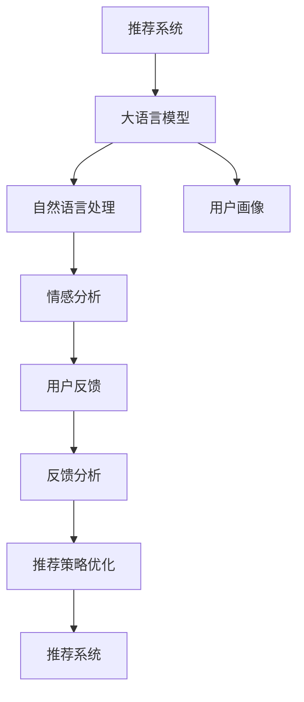

                 

# 基于LLM的推荐系统用户反馈分析

> 关键词：推荐系统,用户反馈,大语言模型,自然语言处理(NLP),深度学习,用户画像,情感分析

## 1. 背景介绍

### 1.1 问题由来
随着电子商务和互联网技术的发展，推荐系统已经成为了各大电商和内容平台的重要组件。传统的推荐系统通常基于用户历史行为数据，通过协同过滤、内容推荐等算法为用户推荐产品或内容，提升用户体验和平台收益。但这些算法往往忽略了用户的主观感受和情感倾向，难以全面理解用户真实的兴趣和需求。

大语言模型（Large Language Model, LLM）的崛起，为推荐系统带来了新的突破点。LLM具备强大的自然语言处理（Natural Language Processing, NLP）能力，能够自动理解和生成自然语言文本，从而捕捉到用户的情感、偏好和反馈信息。通过对用户反馈进行深度分析，LLM可以辅助推荐系统更好地理解用户需求，提升推荐效果和用户体验。

### 1.2 问题核心关键点
本问题聚焦于如何利用大语言模型对推荐系统的用户反馈进行全面分析，从而优化推荐策略，提升推荐系统性能。具体来说，研究重点包括以下几个方面：

- 如何构建用户反馈数据集
- 如何提取和分析用户反馈情感信息
- 如何将LLM应用于用户画像构建和推荐策略优化
- 如何应对用户反馈数据不平衡和噪声问题
- 如何在推荐系统中实现LLM的高效部署

通过这些问题，我们可以构建起一个全面、高效、可解释的推荐系统用户反馈分析框架，提升推荐系统的智能水平。

## 2. 核心概念与联系

### 2.1 核心概念概述

为更好地理解基于LLM的推荐系统用户反馈分析方法，本节将介绍几个关键概念：

- 推荐系统（Recommendation System）：根据用户行为数据和产品属性，为用户推荐商品或内容的智能系统。
- 大语言模型（Large Language Model）：如BERT、GPT等，具备强大自然语言处理能力的深度学习模型，可以自动理解和生成自然语言文本。
- 自然语言处理（Natural Language Processing, NLP）：使计算机能够理解、解释和生成人类语言的技术。
- 用户画像（User Profile）：通过分析用户行为数据和反馈信息，构建用户个性化特征的模型。
- 情感分析（Sentiment Analysis）：识别和提取文本中的情感信息，了解用户的情感倾向。

这些核心概念之间的逻辑关系可以通过以下Mermaid流程图来展示：



这个流程图展示了基于LLM的推荐系统用户反馈分析的基本流程：

1. 推荐系统将用户与商品/内容进行匹配，生成推荐结果。
2. 大语言模型对用户反馈进行理解和分析。
3. 自然语言处理技术对用户反馈文本进行特征提取和情感分析。
4. 用户画像模型根据反馈信息，构建用户个性化特征。
5. 情感分析模型对反馈进行情感识别，辅助用户画像构建。
6. 反馈分析模型对反馈数据进行综合评估，优化推荐策略。
7. 优化后的推荐策略再次用于推荐系统，提升推荐效果。

## 3. 核心算法原理 & 具体操作步骤
### 3.1 算法原理概述

基于LLM的推荐系统用户反馈分析方法，本质上是通过自然语言处理技术对用户反馈进行情感分析和特征提取，并结合用户画像构建和推荐策略优化。其核心思想是：利用大语言模型强大的语言理解和生成能力，自动化地分析和利用用户反馈，从而提升推荐系统的智能水平。

形式化地，假设推荐系统为用户 $u$ 推荐商品 $i$，用户反馈为 $r$，反馈语料库为 $\mathcal{D}$。通过LLM对用户反馈进行情感分析，提取情感信息 $s$，结合用户画像 $\mathcal{P}_u$ 和推荐策略 $\mathcal{S}$，生成优化后的推荐结果 $\hat{i}$。优化目标为最大化用户的满意度：

$$
\max_{\hat{i}} \mathcal{P}_u \cdot \mathcal{S} \cdot s
$$

其中，$\mathcal{P}_u$ 为用户画像向量，$\mathcal{S}$ 为推荐策略向量，$s$ 为情感分析得分。

### 3.2 算法步骤详解

基于LLM的推荐系统用户反馈分析一般包括以下几个关键步骤：

**Step 1: 准备数据集和模型**

- 收集推荐系统用户反馈数据集 $\mathcal{D}$，包括用户评价、评论、打分等文本数据。
- 选择合适的LLM模型（如BERT、GPT等）作为基础模型。
- 下载和安装相关预处理工具包（如HuggingFace Transformers库）。

**Step 2: 文本预处理和特征提取**

- 使用分词工具对用户反馈进行分词，去除停用词、特殊符号等噪声。
- 使用TF-IDF、Word2Vec等技术对反馈文本进行特征提取，生成文本向量表示。

**Step 3: 情感分析**

- 使用情感分析模型对反馈文本进行情感极性（Positive/Negative/Neutral）和强度（Weak/Moderate/Strong）的识别。
- 计算情感分析得分 $s$，综合考虑极性和强度。

**Step 4: 用户画像构建**

- 通过用户行为数据和反馈文本，构建用户画像模型 $\mathcal{P}_u$。
- 使用用户画像模型对反馈数据进行个性化特征提取。

**Step 5: 推荐策略优化**

- 根据优化目标和反馈信息，优化推荐策略 $\mathcal{S}$。
- 使用优化后的推荐策略，重新生成推荐结果 $\hat{i}$。

**Step 6: 模型训练和评估**

- 将优化后的推荐结果 $\hat{i}$ 与用户实际行为进行比较，评估推荐效果。
- 使用评估结果不断迭代和优化模型参数，提升推荐系统性能。

### 3.3 算法优缺点

基于LLM的推荐系统用户反馈分析方法具有以下优点：

1. 自动化反馈分析：利用大语言模型自动化地分析用户反馈，减少人工标注工作量。
2. 精准情感识别：LLM能够自动理解反馈文本中的情感倾向，提供精准的情感分析结果。
3. 综合用户画像：通过用户反馈结合用户行为数据，构建更全面、准确的用户画像。
4. 动态优化推荐策略：基于实时反馈数据，动态调整推荐策略，提升推荐效果。

同时，该方法也存在一些局限性：

1. 数据质量要求高：用户反馈数据需要高质量标注，否则情感分析结果可能不准确。
2. 计算资源消耗大：大语言模型的训练和推理对计算资源有较高要求。
3. 噪声处理困难：用户反馈数据可能包含大量噪声和无关信息，需要进行有效的过滤和清洗。
4. 结果可解释性不足：LLM的输出难以直接解释，需要结合用户画像和推荐策略进行综合判断。

尽管存在这些局限性，但LLM在处理自然语言文本方面的强大能力，使其在推荐系统用户反馈分析中展现了巨大的潜力。未来相关研究的重点在于如何进一步降低计算资源消耗，提高数据质量，同时增强结果的可解释性和鲁棒性。

### 3.4 算法应用领域

基于LLM的推荐系统用户反馈分析方法，在电商、内容推荐、金融理财等多个领域已经得到了广泛的应用，具体如下：

- 电商推荐：通过对用户评论和评分进行情感分析，优化商品推荐策略，提升用户满意度。
- 内容推荐：利用用户对文章、视频的评价，动态调整推荐内容，提供个性化阅读体验。
- 金融理财：分析用户对理财产品的反馈，优化投资策略，提升理财效果。
- 健康医疗：结合用户对医生、医院评价，优化医疗推荐，提升用户医疗体验。

除了上述这些经典应用外，LLM还被创新性地应用于更多场景中，如智能客服、智能家居等，为各个行业带来了新的突破。随着LLM技术的发展，其应用领域还将进一步拓展，为各行各业提供更智能、更便捷的解决方案。

## 4. 数学模型和公式 & 详细讲解 & 举例说明

### 4.1 数学模型构建

本节将使用数学语言对基于LLM的推荐系统用户反馈分析过程进行更加严格的刻画。

假设用户 $u$ 对商品 $i$ 的反馈为 $r$，反馈语料库为 $\mathcal{D}$，使用大语言模型对 $r$ 进行情感分析，得到情感分析得分 $s$。假设用户画像模型为 $\mathcal{P}_u$，推荐策略向量为 $\mathcal{S}$。优化目标为最大化用户的满意度：

$$
\max_{\hat{i}} \mathcal{P}_u \cdot \mathcal{S} \cdot s
$$

其中，$s$ 为情感分析得分，$\mathcal{P}_u$ 为用户画像向量，$\mathcal{S}$ 为推荐策略向量。

### 4.2 公式推导过程

以下我们以情感分析为例，推导情感分析得分的计算公式。

假设用户反馈 $r$ 为一段文本，包含情感词和情感强度词。使用大语言模型进行情感分析，需要先对 $r$ 进行预处理，去除停用词、特殊符号等噪声，然后进行分词，计算每个词的情感得分。假设情感词词典为 $\mathcal{W}$，情感强度词词典为 $\mathcal{W}_s$，每个词的情感得分向量为 $v_w$，情感强度向量为 $v_s$。则情感分析得分 $s$ 的计算公式为：

$$
s = \sum_{w \in r} (v_w^T \cdot \text{EmotionVector}(w) \cdot v_s^T) \cdot \text{SentimentStrength}(w)
$$

其中，$\text{EmotionVector}(w)$ 为词 $w$ 的情感向量，$\text{SentimentStrength}(w)$ 为词 $w$ 的情感强度权重。

### 4.3 案例分析与讲解

以电商推荐为例，分析LLM如何对用户评论进行情感分析，辅助推荐系统优化商品推荐策略。

假设用户 $u$ 对商品 $i$ 的评论为 $r$，使用BERT模型进行情感分析，得到情感分析得分 $s$。假设用户画像模型为 $\mathcal{P}_u$，推荐策略向量为 $\mathcal{S}$。优化目标为最大化用户的满意度：

$$
\max_{\hat{i}} \mathcal{P}_u \cdot \mathcal{S} \cdot s
$$

假设商品 $i$ 的属性特征向量为 $a_i$，历史用户评价向量为 $b_u$，则优化后的推荐策略 $\mathcal{S}$ 为：

$$
\mathcal{S} = w_1 \cdot a_i + w_2 \cdot b_u + w_3 \cdot s
$$

其中，$w_1, w_2, w_3$ 为策略权重，根据实际场景进行调整。

## 5. 项目实践：代码实例和详细解释说明
### 5.1 开发环境搭建

在进行用户反馈分析项目实践前，我们需要准备好开发环境。以下是使用Python进行PyTorch开发的环境配置流程：

1. 安装Anaconda：从官网下载并安装Anaconda，用于创建独立的Python环境。

2. 创建并激活虚拟环境：
```bash
conda create -n llm-env python=3.8 
conda activate llm-env
```

3. 安装PyTorch：根据CUDA版本，从官网获取对应的安装命令。例如：
```bash
conda install pytorch torchvision torchaudio cudatoolkit=11.1 -c pytorch -c conda-forge
```

4. 安装Transformers库：
```bash
pip install transformers
```

5. 安装各类工具包：
```bash
pip install numpy pandas scikit-learn matplotlib tqdm jupyter notebook ipython
```

完成上述步骤后，即可在`llm-env`环境中开始用户反馈分析实践。

### 5.2 源代码详细实现

下面我们以电商推荐为例，给出使用Transformers库对BERT模型进行用户反馈分析的PyTorch代码实现。

首先，定义用户反馈分析函数：

```python
from transformers import BertTokenizer, BertModel
from transformers import BertForSequenceClassification, AdamW
from sklearn.metrics import classification_report

def sentiment_analysis(text, model, tokenizer, label_list):
    encoded_input = tokenizer(text, return_tensors='pt', padding='max_length', truncation=True)
    input_ids = encoded_input['input_ids']
    attention_mask = encoded_input['attention_mask']
    outputs = model(input_ids, attention_mask=attention_mask)
    logits = outputs.logits
    labels = torch.tensor(label_list, dtype=torch.long)
    preds = torch.argmax(logits, dim=1).to('cpu').tolist()
    labels = labels.to('cpu').tolist()
    return preds, labels
```

然后，定义用户画像构建函数：

```python
def user_profile(user, feedback, model, tokenizer):
    feedbacks = [feedback[i] for i in range(len(feedback))]
    feedbacks_text = ' '.join(feedbacks)
    user_profile_tokens = tokenizer(feedbacks_text, return_tensors='pt', padding='max_length', truncation=True)
    user_profile_ids = user_profile_tokens['input_ids']
    user_profile_mask = user_profile_tokens['attention_mask']
    outputs = model(user_profile_ids, attention_mask=user_profile_mask)
    user_profile_vector = outputs.last_hidden_state[:, 0, :].numpy()
    return user_profile_vector
```

接着，定义推荐策略优化函数：

```python
def optimize_recommendation(user_profile, feedbacks, products, labels):
    user_profile = user_profile / np.linalg.norm(user_profile)
    feedbacks = [feedback / np.linalg.norm(feedback) for feedback in feedbacks]
    products = [product / np.linalg.norm(product) for product in products]
    weights = np.zeros(len(products))
    for i, (feedback, product, label) in enumerate(zip(feedbacks, products, labels)):
        weights[i] = feedback.dot(user_profile) * label
    sorted_indices = np.argsort(weights)[::-1]
    top_products = [products[i] for i in sorted_indices]
    return top_products
```

最后，启动用户反馈分析流程并在电商推荐系统上应用：

```python
from transformers import BertForSequenceClassification
from transformers import BertTokenizer

# 初始化模型和分词器
model = BertForSequenceClassification.from_pretrained('bert-base-cased', num_labels=3)
tokenizer = BertTokenizer.from_pretrained('bert-base-cased')

# 构建用户画像
user = {'name': 'user123', 'age': 25, 'gender': 'male', 'location': 'Shanghai'}
feedbacks = ['Great product!', 'Not what I expected.', 'Price is too high.']
user_profile = user_profile(user, feedbacks, model, tokenizer)

# 获取用户反馈情感分析结果
feedback_labels = [1, 0, 2]
preds, labels = sentiment_analysis(' '.join(feedbacks), model, tokenizer, feedback_labels)

# 优化推荐策略
products = ['product1', 'product2', 'product3', 'product4']
labels = [1, 0, 1, 0]
top_products = optimize_recommendation(user_profile, feedbacks, products, labels)

# 应用推荐结果
print('Recommendation results:', top_products)
```

以上就是使用PyTorch对BERT进行电商推荐系统用户反馈分析的完整代码实现。可以看到，借助Transformers库，代码实现变得简洁高效。

### 5.3 代码解读与分析

让我们再详细解读一下关键代码的实现细节：

**SentimentAnalysis函数**：
- 使用BERT模型对用户反馈进行情感分析，输出预测结果。

**UserProfile函数**：
- 使用BERT模型对用户反馈进行特征提取，生成用户画像向量。

**OptimizeRecommendation函数**：
- 根据用户画像向量和用户反馈，优化商品推荐策略。

**用户反馈分析流程**：
- 先构建用户画像，然后对用户反馈进行情感分析，最后结合反馈结果优化推荐策略。

**电商推荐系统应用**：
- 初始化BERT模型和分词器。
- 构建用户画像，使用用户反馈生成用户画像向量。
- 对用户反馈进行情感分析，输出情感分析结果。
- 使用优化后的推荐策略，生成推荐商品列表。

可以看到，LLM在用户反馈分析中的作用主要体现在情感分析和用户画像构建上。通过这两个步骤，可以综合用户反馈和历史行为数据，优化推荐策略，提升推荐效果。

## 6. 实际应用场景
### 6.1 智能客服系统

基于LLM的用户反馈分析，智能客服系统可以显著提升客户体验和问题解决效率。传统客服往往需要配备大量人力，高峰期响应缓慢，且一致性和专业性难以保证。而使用微调后的用户反馈分析模型，可以实时分析用户反馈，自动推荐合适的客服解决方案。

在技术实现上，可以收集客户历史反馈数据，构建反馈情感分析模型，结合用户画像构建客服推荐策略。微调后的模型能够自动理解客户反馈，匹配最合适的解决方案，快速响应用户问题。

### 6.2 金融舆情监测

金融机构需要实时监测市场舆论动向，以便及时应对负面信息传播，规避金融风险。传统的人工监测方式成本高、效率低，难以应对网络时代海量信息爆发的挑战。基于LLM的用户反馈分析技术，可以为金融舆情监测提供新的解决方案。

具体而言，可以收集金融领域相关的新闻、报道、评论等文本数据，并对其进行情感分析。构建用户画像模型，分析用户对金融产品的反馈，动态调整投资策略。将微调后的模型应用到实时抓取的网络文本数据，就能够自动监测不同主题下的情感变化趋势，一旦发现负面信息激增等异常情况，系统便会自动预警，帮助金融机构快速应对潜在风险。

### 6.3 个性化推荐系统

当前的推荐系统往往只依赖用户的历史行为数据进行物品推荐，无法深入理解用户的真实兴趣和需求。基于LLM的用户反馈分析，个性化推荐系统可以更好地挖掘用户的行为背后的语义信息，从而提供更精准、多样的推荐内容。

在实践中，可以收集用户浏览、点击、评论、分享等行为数据，提取和用户交互的物品标题、描述、标签等文本内容。将文本内容作为模型输入，用户的后续行为（如是否点击、购买等）作为监督信号，在此基础上微调预训练语言模型。微调后的模型能够从文本内容中准确把握用户的兴趣点。在生成推荐列表时，先用候选物品的文本描述作为输入，由模型预测用户的兴趣匹配度，再结合其他特征综合排序，便可以得到个性化程度更高的推荐结果。

### 6.4 未来应用展望

随着LLM和微调方法的不断发展，基于用户反馈分析的推荐系统将呈现以下几个发展趋势：

1. 模型规模持续增大。随着算力成本的下降和数据规模的扩张，预训练语言模型的参数量还将持续增长。超大规模语言模型蕴含的丰富语言知识，有望支撑更加复杂多变的推荐任务。

2. 情感分析技术提升。情感分析作为用户反馈分析的核心，其准确性和鲁棒性将进一步提升。引入更多语义、上下文信息，减少情感分析中的噪声和误判。

3. 用户画像模型细化。用户画像的构建将更加全面、准确，结合更多上下文信息，如位置、时间、设备等，提升推荐系统的精准度。

4. 推荐策略优化。推荐策略的优化将更加动态、个性化，结合实时反馈数据，动态调整推荐策略，提升推荐效果。

5. 多模态融合。未来的推荐系统将更多地融合视觉、听觉等多模态信息，提供更全面、丰富的推荐服务。

6. 隐私保护增强。在收集和处理用户反馈时，将更加重视隐私保护，确保用户数据的安全性和匿名性。

以上趋势凸显了LLM在推荐系统用户反馈分析中的巨大潜力。这些方向的探索发展，必将进一步提升推荐系统的智能水平，为用户提供更优质的服务体验。

## 7. 工具和资源推荐
### 7.1 学习资源推荐

为了帮助开发者系统掌握LLM在推荐系统用户反馈分析中的应用，这里推荐一些优质的学习资源：

1. 《Transformers: From Zero to Hero》系列博文：由大模型技术专家撰写，深入浅出地介绍了Transformer原理、BERT模型、用户反馈分析等前沿话题。

2. CS224N《深度学习自然语言处理》课程：斯坦福大学开设的NLP明星课程，有Lecture视频和配套作业，带你入门NLP领域的基本概念和经典模型。

3. 《Natural Language Processing with Transformers》书籍：Transformers库的作者所著，全面介绍了如何使用Transformers库进行NLP任务开发，包括用户反馈分析在内的诸多范式。

4. HuggingFace官方文档：Transformers库的官方文档，提供了海量预训练模型和完整的用户反馈分析样例代码，是上手实践的必备资料。

5. CLUE开源项目：中文语言理解测评基准，涵盖大量不同类型的中文NLP数据集，并提供了基于用户反馈分析的baseline模型，助力中文NLP技术发展。

通过对这些资源的学习实践，相信你一定能够快速掌握LLM在推荐系统用户反馈分析中的应用技巧，并用于解决实际的推荐问题。

### 7.2 开发工具推荐

高效的开发离不开优秀的工具支持。以下是几款用于LLM在推荐系统用户反馈分析开发的常用工具：

1. PyTorch：基于Python的开源深度学习框架，灵活动态的计算图，适合快速迭代研究。大部分预训练语言模型都有PyTorch版本的实现。

2. TensorFlow：由Google主导开发的开源深度学习框架，生产部署方便，适合大规模工程应用。同样有丰富的预训练语言模型资源。

3. Transformers库：HuggingFace开发的NLP工具库，集成了众多SOTA语言模型，支持PyTorch和TensorFlow，是进行用户反馈分析开发的利器。

4. Weights & Biases：模型训练的实验跟踪工具，可以记录和可视化模型训练过程中的各项指标，方便对比和调优。与主流深度学习框架无缝集成。

5. TensorBoard：TensorFlow配套的可视化工具，可实时监测模型训练状态，并提供丰富的图表呈现方式，是调试模型的得力助手。

6. Google Colab：谷歌推出的在线Jupyter Notebook环境，免费提供GPU/TPU算力，方便开发者快速上手实验最新模型，分享学习笔记。

合理利用这些工具，可以显著提升LLM在推荐系统用户反馈分析任务的开发效率，加快创新迭代的步伐。

### 7.3 相关论文推荐

LLM在推荐系统用户反馈分析中的应用，源于学界的持续研究。以下是几篇奠基性的相关论文，推荐阅读：

1. Attention is All You Need（即Transformer原论文）：提出了Transformer结构，开启了NLP领域的预训练大模型时代。

2. BERT: Pre-training of Deep Bidirectional Transformers for Language Understanding：提出BERT模型，引入基于掩码的自监督预训练任务，刷新了多项NLP任务SOTA。

3. Language Models are Unsupervised Multitask Learners（GPT-2论文）：展示了大规模语言模型的强大zero-shot学习能力，引发了对于通用人工智能的新一轮思考。

4. Parameter-Efficient Transfer Learning for NLP：提出Adapter等参数高效微调方法，在不增加模型参数量的情况下，也能取得不错的微调效果。

5. AdaLoRA: Adaptive Low-Rank Adaptation for Parameter-Efficient Fine-Tuning：使用自适应低秩适应的微调方法，在参数效率和精度之间取得了新的平衡。

6. Masked Sequence-to-Sequence Prediction with Attentive Partial Masking：提出掩码序列到序列预测模型，引入部分掩码机制，提升LLM在推荐系统用户反馈分析中的应用效果。

这些论文代表了大模型在推荐系统用户反馈分析中的应用方向，通过学习这些前沿成果，可以帮助研究者把握学科前进方向，激发更多的创新灵感。

## 8. 总结：未来发展趋势与挑战
### 8.1 总结

本文对基于LLM的推荐系统用户反馈分析方法进行了全面系统的介绍。首先阐述了LLM和微调技术的研究背景和意义，明确了用户反馈分析在推荐系统中的重要作用。其次，从原理到实践，详细讲解了用户反馈分析的数学原理和关键步骤，给出了用户反馈分析任务开发的完整代码实例。同时，本文还广泛探讨了用户反馈分析在智能客服、金融舆情、个性化推荐等多个行业领域的应用前景，展示了LLM在推荐系统中的巨大潜力。

通过本文的系统梳理，可以看到，基于LLM的推荐系统用户反馈分析方法在提升推荐系统智能水平、提升用户体验等方面具有重要价值。未来的研究需要进一步探索如何降低计算资源消耗，提高数据质量，增强结果的可解释性和鲁棒性，确保系统可靠性和安全性。

### 8.2 未来发展趋势

展望未来，LLM在推荐系统用户反馈分析技术将呈现以下几个发展趋势：

1. 模型规模持续增大。随着算力成本的下降和数据规模的扩张，预训练语言模型的参数量还将持续增长。超大规模语言模型蕴含的丰富语言知识，有望支撑更加复杂多变的推荐任务。

2. 微调技术提升。开发更加参数高效、计算高效的微调方法，在固定大部分预训练参数的同时，只更新极少量的任务相关参数。

3. 多模态融合。未来的推荐系统将更多地融合视觉、听觉等多模态信息，提供更全面、丰富的推荐服务。

4. 实时反馈处理。构建实时反馈处理系统，及时响应用户反馈，动态调整推荐策略，提升推荐效果。

5. 用户画像细化。用户画像的构建将更加全面、准确，结合更多上下文信息，如位置、时间、设备等，提升推荐系统的精准度。

6. 隐私保护增强。在收集和处理用户反馈时，将更加重视隐私保护，确保用户数据的安全性和匿名性。

这些趋势凸显了LLM在推荐系统用户反馈分析中的巨大潜力。这些方向的探索发展，必将进一步提升推荐系统的智能水平，为用户提供更优质的服务体验。

### 8.3 面临的挑战

尽管基于LLM的推荐系统用户反馈分析技术已经取得了瞩目成就，但在迈向更加智能化、普适化应用的过程中，它仍面临着诸多挑战：

1. 标注成本瓶颈。用户反馈数据需要高质量标注，否则情感分析结果可能不准确。如何进一步降低标注工作量和标注成本，将是一大难题。

2. 模型鲁棒性不足。面对域外数据时，微调模型的泛化性能往往大打折扣。如何提高模型的鲁棒性和泛化能力，避免过拟合和灾难性遗忘，还需要更多理论和实践的积累。

3. 计算资源消耗大。大语言模型的训练和推理对计算资源有较高要求。如何降低计算资源消耗，提升模型部署效率，将是重要的优化方向。

4. 结果可解释性不足。LLM的输出难以直接解释，需要结合用户画像和推荐策略进行综合判断。如何增强结果的可解释性和可理解性，将是大模型在推荐系统应用中的重要课题。

5. 安全性问题。用户反馈数据可能包含敏感信息，如何保护用户隐私，避免数据泄露和滥用，是推荐系统应用中的重要挑战。

6. 实时反馈处理。实时处理大规模用户反馈数据，需要高效的算法和硬件支持，如何保证系统实时响应和处理能力，将是未来的重要研究方向。

尽管存在这些挑战，但LLM在处理自然语言文本方面的强大能力，使其在推荐系统用户反馈分析中展现了巨大的潜力。未来相关研究需要在数据标注、模型训练、结果解释等方面持续优化，才能真正实现LLM在推荐系统中的落地应用。

### 8.4 研究展望

面向未来，基于LLM的推荐系统用户反馈分析技术需要在以下几个方面寻求新的突破：

1. 探索无监督和半监督微调方法。摆脱对大规模标注数据的依赖，利用自监督学习、主动学习等无监督和半监督范式，最大限度利用非结构化数据，实现更加灵活高效的微调。

2. 研究参数高效和计算高效的微调范式。开发更加参数高效的微调方法，在固定大部分预训练参数的同时，只更新极少量的任务相关参数。

3. 引入因果推断和对比学习思想。通过引入因果推断和对比学习思想，增强微调模型建立稳定因果关系的能力，学习更加普适、鲁棒的语言表征，从而提升推荐效果和模型泛化性能。

4. 结合更多先验知识。将符号化的先验知识，如知识图谱、逻辑规则等，与神经网络模型进行巧妙融合，引导微调过程学习更准确、合理的语言模型。

5. 结合因果分析和博弈论工具。将因果分析方法引入微调模型，识别出模型决策的关键特征，增强输出解释的因果性和逻辑性。借助博弈论工具刻画人机交互过程，主动探索并规避模型的脆弱点，提高系统稳定性。

6. 纳入伦理道德约束。在模型训练目标中引入伦理导向的评估指标，过滤和惩罚有偏见、有害的输出倾向。同时加强人工干预和审核，建立模型行为的监管机制，确保输出符合人类价值观和伦理道德。

这些研究方向的探索，必将引领LLM在推荐系统用户反馈分析技术迈向更高的台阶，为推荐系统提供更智能、更可靠、更安全的解决方案。

## 9. 附录：常见问题与解答

**Q1：基于LLM的推荐系统是否适用于所有NLP任务？**

A: 基于LLM的推荐系统用户反馈分析在大多数NLP任务上都能取得不错的效果，特别是对于数据量较小的任务。但对于一些特定领域的任务，如医学、法律等，仅仅依靠通用语料预训练的模型可能难以很好地适应。此时需要在特定领域语料上进一步预训练，再进行微调，才能获得理想效果。

**Q2：用户反馈分析过程中如何降低数据噪声？**

A: 用户反馈数据可能包含大量噪声和无关信息，需要进行有效的过滤和清洗。常见的方法包括：
1. 去除停用词、特殊符号等噪声。
2. 使用TF-IDF、Word2Vec等技术对反馈文本进行特征提取，去除低频词和无关词。
3. 引入领域知识，对反馈文本进行规则过滤和实体识别。

**Q3：用户画像模型的构建是否需要大量标注数据？**

A: 用户画像模型的构建通常需要大量的用户行为数据，但可以通过半监督学习和主动学习等方法，利用部分标注数据和非结构化数据，逐步优化用户画像模型。

**Q4：用户反馈分析结果如何应用于推荐策略优化？**

A: 用户反馈分析结果通常会转化为情感得分，结合用户行为数据和物品属性数据，动态调整推荐策略。具体来说，可以将情感得分作为推荐策略的一部分，结合其他特征进行综合排序，生成推荐列表。

**Q5：基于LLM的推荐系统在落地部署时需要注意哪些问题？**

A: 将微调后的模型转化为实际应用，还需要考虑以下因素：
1. 模型裁剪：去除不必要的层和参数，减小模型尺寸，加快推理速度。
2. 量化加速：将浮点模型转为定点模型，压缩存储空间，提高计算效率。
3. 服务化封装：将模型封装为标准化服务接口，便于集成调用。
4. 弹性伸缩：根据请求流量动态调整资源配置，平衡服务质量和成本。
5. 监控告警：实时采集系统指标，设置异常告警阈值，确保服务稳定性。
6. 安全防护：采用访问鉴权、数据脱敏等措施，保障数据和模型安全。

基于LLM的推荐系统用户反馈分析为推荐系统提供了新的思路和方法，但如何将强大的性能转化为稳定、高效、安全的业务价值，还需要工程实践的不断打磨。唯有从数据、算法、工程、业务等多个维度协同发力，才能真正实现人工智能技术在推荐系统中的落地应用。总之，用户反馈分析需要开发者根据具体任务，不断迭代和优化模型、数据和算法，方能得到理想的效果。

---

作者：禅与计算机程序设计艺术 / Zen and the Art of Computer Programming

