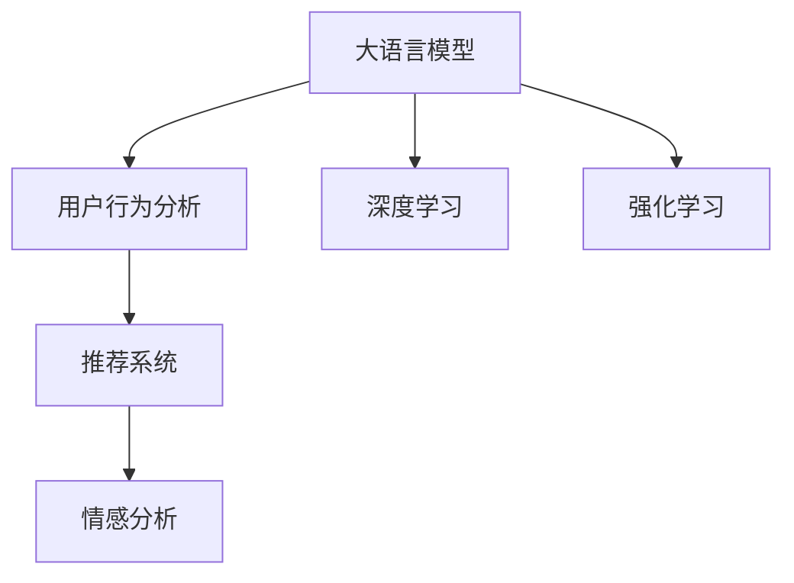

                 

# 基于LLM的推荐系统用户反馈生成

> 关键词：基于大语言模型推荐系统,用户反馈生成,用户行为分析,情感分析,深度学习

## 1. 背景介绍

### 1.1 问题由来
推荐系统已经成为互联网时代重要的用户服务手段，通过分析用户行为数据，为用户提供个性化推荐，提升用户体验和满意度。传统的推荐系统多基于用户的显式评分数据，这种方法在冷启动用户、低交互率场景下表现不佳。基于大语言模型的推荐系统则可以利用自然语言处理技术，从用户的多维度行为数据中挖掘更丰富的隐含信息，提供更准确的推荐服务。

推荐系统面临的最大挑战之一是如何对用户行为进行建模和预测，以形成精准的推荐。传统的基于特征提取的方法无法充分利用自然语言数据中的语义信息，而大语言模型则能够通过复杂的语义理解，全面挖掘用户的兴趣和偏好。因此，基于大语言模型的推荐系统逐渐成为研究热点。

## 2. 核心概念与联系

### 2.1 核心概念概述

为更好地理解基于大语言模型的推荐系统用户反馈生成方法，本节将介绍几个密切相关的核心概念：

- 大语言模型(Large Language Model, LLM)：以自回归(如GPT)或自编码(如BERT)模型为代表的大规模预训练语言模型。通过在大规模无标签文本语料上进行预训练，学习通用的语言表示，具备强大的语言理解和生成能力。

- 推荐系统(Recommender System)：根据用户行为数据，推荐最相关的产品或内容。常见的推荐方法包括基于协同过滤、内容过滤、混合过滤等。

- 用户行为分析(User Behavior Analysis)：通过统计和分析用户的行为数据，挖掘用户兴趣和偏好。常见的方法包括浏览记录、购买记录、评分记录等。

- 情感分析(Sentiment Analysis)：通过自然语言处理技术，自动分析用户对产品或内容的情感倾向，如正面、负面、中性等。

- 深度学习(Deep Learning)：利用深度神经网络模型进行特征提取、模式识别等任务。常见的方法包括卷积神经网络、循环神经网络、Transformer等。

- 强化学习(Reinforcement Learning)：通过不断试错，优化推荐策略，最大化用户满意度。推荐系统的个性化推荐过程中，往往也会应用强化学习技术。

这些核心概念之间的逻辑关系可以通过以下Mermaid流程图来展示：



这个流程图展示了大语言模型的核心概念及其之间的关系：

1. 大语言模型通过预训练获得基础能力。
2. 用户行为分析通过分析用户的历史行为数据，形成用户画像。
3. 推荐系统基于用户画像和产品属性，进行推荐排序。
4. 情感分析通过对用户反馈的情感倾向分析，反馈到推荐系统中。
5. 深度学习用于复杂特征提取，提升模型性能。
6. 强化学习用于优化推荐策略，提升用户体验。

这些概念共同构成了基于大语言模型的推荐系统框架，使得推荐系统可以更全面地理解用户需求，提供更精准的个性化推荐。

## 3. 核心算法原理 & 具体操作步骤
### 3.1 算法原理概述

基于大语言模型的推荐系统用户反馈生成，本质上是一种结合自然语言处理和推荐算法的复合过程。其核心思想是：利用大语言模型对用户反馈进行理解、分析、生成，并将其作为推荐系统的重要参考，优化推荐策略，提升推荐效果。

形式化地，假设用户对某一产品或内容进行评价 $y_i$，评价文本为 $x_i$，其中 $y_i \in [1, 5]$ 表示评分，$x_i$ 为自然语言文本。推荐系统中的评分预测模型 $f(\theta)$ 可以表示为：

$$
f(\theta) = \mathop{\arg\min}_{\theta} \mathcal{L}(M_{\theta}, y_i, x_i)
$$

其中，$M_{\theta}$ 为大语言模型，$\mathcal{L}$ 为损失函数，用于衡量预测评分与真实评分之间的差异。

通过梯度下降等优化算法，模型不断更新参数 $\theta$，最小化损失函数 $\mathcal{L}$，使得模型输出逼近真实评分。由于 $\theta$ 已经通过预训练获得了较好的初始化，因此即便在少量用户反馈数据上，也能较快收敛到理想的模型参数 $\hat{\theta}$。

### 3.2 算法步骤详解

基于大语言模型的推荐系统用户反馈生成一般包括以下几个关键步骤：

**Step 1: 准备预训练模型和用户反馈数据**
- 选择合适的预训练语言模型 $M_{\theta}$ 作为初始化参数，如 BERT、GPT 等。
- 准备用户对产品的反馈数据 $D=\{(x_i, y_i)\}_{i=1}^N$，其中 $x_i$ 为评价文本，$y_i$ 为评分。

**Step 2: 添加任务适配层**
- 根据任务类型，在预训练模型顶层设计合适的输出层和损失函数。
- 对于评分预测任务，通常在顶层添加回归层和均方误差损失函数。
- 对于情感分析任务，则采用情感分类层和交叉熵损失函数。

**Step 3: 设置微调超参数**
- 选择合适的优化算法及其参数，如 AdamW、SGD 等，设置学习率、批大小、迭代轮数等。
- 设置正则化技术及强度，包括权重衰减、Dropout、Early Stopping等。
- 确定冻结预训练参数的策略，如仅微调顶层，或全部参数都参与微调。

**Step 4: 执行梯度训练**
- 将用户反馈数据分批次输入模型，前向传播计算损失函数。
- 反向传播计算参数梯度，根据设定的优化算法和学习率更新模型参数。
- 周期性在验证集上评估模型性能，根据性能指标决定是否触发 Early Stopping。
- 重复上述步骤直到满足预设的迭代轮数或 Early Stopping 条件。

**Step 5: 测试和部署**
- 在测试集上评估微调后模型 $M_{\hat{\theta}}$ 的性能，对比微调前后的评分预测效果。
- 使用微调后的模型对新用户反馈进行推理预测，集成到实际的应用系统中。
- 持续收集新的用户反馈数据，定期重新微调模型，以适应用户行为的变化。

以上是基于大语言模型的推荐系统用户反馈生成的一般流程。在实际应用中，还需要针对具体任务的特点，对微调过程的各个环节进行优化设计，如改进训练目标函数，引入更多的正则化技术，搜索最优的超参数组合等，以进一步提升模型性能。

### 3.3 算法优缺点

基于大语言模型的推荐系统用户反馈生成方法具有以下优点：
1. 模型精度高。大语言模型通过大规模预训练，具备强大的语言理解和生成能力，能够准确理解用户反馈文本。
2. 跨领域迁移能力强。通过预训练-微调的过程，模型能够适应不同领域的应用场景，提升推荐系统的普适性。
3. 数据依赖小。相比传统机器学习模型，大语言模型对标注数据的依赖更小，能够更好地利用非结构化自然语言数据。
4. 可解释性好。通过分析模型输出，能够洞察用户反馈背后的情感倾向和语义信息，有助于优化推荐策略。

同时，该方法也存在一定的局限性：
1. 计算资源需求大。大语言模型和微调过程对计算资源和存储空间的需求较高，需要高性能硬件支持。
2. 模型解释性差。大语言模型内部机制复杂，难以解释其决策过程，对于高风险应用可能不适用。
3. 对抗性攻击风险。大语言模型可能受到对抗样本攻击，生成有害或误导性推荐，需要进一步研究鲁棒性提升方法。
4. 通用性不足。不同的预训练模型和大语言模型在性能上存在差异，需要根据具体任务选择最优模型。

尽管存在这些局限性，但就目前而言，基于大语言模型的推荐系统用户反馈生成方法仍然是最先进、最具有潜力的推荐方式之一。

### 3.4 算法应用领域

基于大语言模型的推荐系统用户反馈生成方法在多个领域得到了广泛应用，包括但不限于：

- 电商平台：通过分析用户评论和评分，形成商品画像，提供个性化商品推荐。
- 在线教育：通过分析学生的作业、测试和反馈，推荐合适的学习资料和课程。
- 金融投资：通过分析用户对产品或服务的评价，推荐最优的投资产品或服务。
- 媒体内容：通过分析用户对内容的评价，推荐相关的文章、视频或音乐。
- 健康医疗：通过分析患者的反馈和评价，推荐最佳治疗方案或健康建议。

除了上述这些经典应用外，基于大语言模型的推荐系统用户反馈生成方法也在不断拓展新的应用场景，如社交网络推荐、智能家居控制、智能制造系统等，为各行各业提供个性化服务，创造更多价值。

## 4. 数学模型和公式 & 详细讲解 & 举例说明
### 4.1 数学模型构建

本节将使用数学语言对基于大语言模型的推荐系统用户反馈生成过程进行更加严格的刻画。

记推荐系统中的评分预测模型为 $f(\theta)$，其中 $\theta$ 为模型参数。假设用户对某一产品或内容 $x_i$ 的评分 $y_i$ 为标准正态分布：

$$
p(y_i|x_i, \theta) = \mathcal{N}(\mu_i, \sigma_i^2)
$$

其中，$\mu_i = f(x_i, \theta)$ 为模型的预测评分，$\sigma_i^2$ 为评分的不确定性，与模型参数 $\theta$ 无关。

为了最大化预测评分与真实评分的一致性，我们需要最小化均方误差损失函数：

$$
\mathcal{L}(\theta) = \frac{1}{N} \sum_{i=1}^N (y_i - \mu_i)^2
$$

通过梯度下降等优化算法，最小化损失函数 $\mathcal{L}(\theta)$，更新模型参数 $\theta$，得到最优预测评分模型 $f^*(\theta)$。

### 4.2 公式推导过程

以下我们以评分预测任务为例，推导评分预测模型的训练过程。

首先，假设模型 $f(\theta)$ 为线性回归模型，则预测评分的公式为：

$$
\mu_i = \sum_{j=1}^d \theta_j x_{ij}
$$

其中 $x_{ij}$ 为 $x_i$ 在特征 $j$ 上的取值，$\theta_j$ 为模型参数。

根据贝叶斯公式，评分预测的概率密度函数为：

$$
p(y_i|x_i, \theta) = \mathcal{N}(\mu_i, \sigma_i^2) = \mathcal{N}(\sum_{j=1}^d \theta_j x_{ij}, \sigma_i^2)
$$

令 $\sigma_i^2 = \frac{\sigma^2}{\sum_{j=1}^d \theta_j^2}$，则模型参数 $\theta$ 的最优化问题可以表示为：

$$
\hat{\theta} = \mathop{\arg\min}_{\theta} \frac{1}{N} \sum_{i=1}^N (y_i - \sum_{j=1}^d \theta_j x_{ij})^2
$$

通过梯度下降等优化算法，可以求解得到最优参数 $\hat{\theta}$，进而得到评分预测模型 $f^*(\theta)$。

### 4.3 案例分析与讲解

**案例一：电商推荐系统的用户反馈生成**

电商推荐系统利用大语言模型对用户评论和评分进行分析，形成商品画像，推荐合适的商品。例如，电商平台收集用户对某商品 $i$ 的评论文本 $x_i$ 和评分 $y_i$，其中 $y_i \in [1, 5]$。根据用户反馈，通过大语言模型分析评论文本 $x_i$，生成评分预测模型 $f(\theta)$。

假设大语言模型为 BERT，具体实现步骤如下：
1. 收集电商平台的商品评论和评分数据，划分为训练集、验证集和测试集。
2. 使用 BERT 模型进行预训练，获取预训练参数。
3. 在预训练模型的基础上，添加线性回归输出层和均方误差损失函数。
4. 设置 AdamW 优化器，设置学习率、批大小、迭代轮数等超参数。
5. 将用户评论数据分批次输入模型，进行前向传播计算损失函数。
6. 反向传播计算参数梯度，根据 AdamW 优化器更新模型参数。
7. 周期性在验证集上评估模型性能，根据性能指标决定是否触发 Early Stopping。
8. 重复上述步骤直到满足预设的迭代轮数或 Early Stopping 条件。
9. 在测试集上评估模型性能，根据评分预测模型 $f^*(\theta)$ 推荐商品。

**案例二：在线教育系统的用户反馈生成**

在线教育系统利用大语言模型对学生的作业、测试和反馈进行分析，推荐合适的学习资料和课程。例如，在线教育平台收集学生对某一课程 $i$ 的评价文本 $x_i$ 和评分 $y_i$，其中 $y_i \in [1, 5]$。通过大语言模型分析评价文本 $x_i$，生成评分预测模型 $f(\theta)$。

假设大语言模型为 GPT，具体实现步骤如下：
1. 收集在线教育平台的课程评价和评分数据，划分为训练集、验证集和测试集。
2. 使用 GPT 模型进行预训练，获取预训练参数。
3. 在预训练模型的基础上，添加回归输出层和均方误差损失函数。
4. 设置 AdamW 优化器，设置学习率、批大小、迭代轮数等超参数。
5. 将学生评价数据分批次输入模型，进行前向传播计算损失函数。
6. 反向传播计算参数梯度，根据 AdamW 优化器更新模型参数。
7. 周期性在验证集上评估模型性能，根据性能指标决定是否触发 Early Stopping。
8. 重复上述步骤直到满足预设的迭代轮数或 Early Stopping 条件。
9. 在测试集上评估模型性能，根据评分预测模型 $f^*(\theta)$ 推荐课程。

通过以上两个案例分析，可以看出大语言模型在电商推荐和在线教育系统中的应用，不仅能够提升推荐效果，还能分析用户反馈，优化推荐策略，提升用户体验。

## 5. 项目实践：代码实例和详细解释说明
### 5.1 开发环境搭建

在进行大语言模型推荐系统用户反馈生成的实践前，我们需要准备好开发环境。以下是使用Python进行PyTorch开发的环境配置流程：

1. 安装Anaconda：从官网下载并安装Anaconda，用于创建独立的Python环境。

2. 创建并激活虚拟环境：
```bash
conda create -n pytorch-env python=3.8 
conda activate pytorch-env
```

3. 安装PyTorch：根据CUDA版本，从官网获取对应的安装命令。例如：
```bash
conda install pytorch torchvision torchaudio cudatoolkit=11.1 -c pytorch -c conda-forge
```

4. 安装Transformers库：
```bash
pip install transformers
```

5. 安装各类工具包：
```bash
pip install numpy pandas scikit-learn matplotlib tqdm jupyter notebook ipython
```

完成上述步骤后，即可在`pytorch-env`环境中开始大语言模型推荐系统用户反馈生成的实践。

### 5.2 源代码详细实现

下面以电商推荐系统为例，给出使用Transformers库对BERT模型进行评分预测的PyTorch代码实现。

首先，定义评分预测任务的输入输出：

```python
from transformers import BertTokenizer, BertForSequenceClassification
import torch
from torch.utils.data import Dataset, DataLoader

class ProductReviewDataset(Dataset):
    def __init__(self, reviews, scores, tokenizer, max_len=128):
        self.reviews = reviews
        self.scores = scores
        self.tokenizer = tokenizer
        self.max_len = max_len
        
    def __len__(self):
        return len(self.reviews)
    
    def __getitem__(self, item):
        review = self.reviews[item]
        score = self.scores[item]
        
        encoding = self.tokenizer(review, return_tensors='pt', max_length=self.max_len, padding='max_length', truncation=True)
        input_ids = encoding['input_ids'][0]
        attention_mask = encoding['attention_mask'][0]
        
        score = torch.tensor(score, dtype=torch.float32)
        
        return {
            'input_ids': input_ids,
            'attention_mask': attention_mask,
            'scores': score
        }

# 加载预训练模型
tokenizer = BertTokenizer.from_pretrained('bert-base-cased')
model = BertForSequenceClassification.from_pretrained('bert-base-cased', num_labels=5)

# 训练集、验证集、测试集
train_dataset = ProductReviewDataset(train_reviews, train_scores, tokenizer)
val_dataset = ProductReviewDataset(val_reviews, val_scores, tokenizer)
test_dataset = ProductReviewDataset(test_reviews, test_scores, tokenizer)

# 定义优化器
optimizer = AdamW(model.parameters(), lr=2e-5)

# 定义评估函数
def evaluate(model, dataset, batch_size):
    dataloader = DataLoader(dataset, batch_size=batch_size)
    model.eval()
    total_score = 0
    total_loss = 0
    with torch.no_grad():
        for batch in dataloader:
            input_ids = batch['input_ids'].to(device)
            attention_mask = batch['attention_mask'].to(device)
            scores = batch['scores'].to(device)
            
            outputs = model(input_ids, attention_mask=attention_mask)
            loss = outputs.loss
            total_loss += loss.item()
            
            logits = outputs.logits.argmax(dim=1)
            total_score += (logits == scores).float().mean()
    
    return total_score / len(dataset), total_loss / len(dataset)
```

然后，定义训练和评估函数：

```python
import numpy as np
from sklearn.metrics import mean_squared_error, mean_absolute_error
from tqdm import tqdm

device = torch.device('cuda') if torch.cuda.is_available() else torch.device('cpu')
model.to(device)

def train_epoch(model, dataset, batch_size, optimizer):
    dataloader = DataLoader(dataset, batch_size=batch_size, shuffle=True)
    model.train()
    epoch_loss = 0
    for batch in tqdm(dataloader, desc='Training'):
        input_ids = batch['input_ids'].to(device)
        attention_mask = batch['attention_mask'].to(device)
        scores = batch['scores'].to(device)
        model.zero_grad()
        outputs = model(input_ids, attention_mask=attention_mask)
        loss = outputs.loss
        epoch_loss += loss.item()
        loss.backward()
        optimizer.step()
    
    return epoch_loss / len(dataloader)

def test_epoch(model, dataset, batch_size):
    dataloader = DataLoader(dataset, batch_size=batch_size)
    model.eval()
    total_score = 0
    total_loss = 0
    with torch.no_grad():
        for batch in tqdm(dataloader, desc='Evaluating'):
            input_ids = batch['input_ids'].to(device)
            attention_mask = batch['attention_mask'].to(device)
            scores = batch['scores'].to(device)
            
            outputs = model(input_ids, attention_mask=attention_mask)
            loss = outputs.loss
            total_loss += loss.item()
            
            logits = outputs.logits.argmax(dim=1)
            total_score += (logits == scores).float().mean()
    
    return total_score / len(dataset), total_loss / len(dataset)

# 训练和评估过程
epochs = 5
batch_size = 16

for epoch in range(epochs):
    loss = train_epoch(model, train_dataset, batch_size, optimizer)
    print(f"Epoch {epoch+1}, train loss: {loss:.3f}")
    
    print(f"Epoch {epoch+1}, dev results:")
    score, loss = evaluate(model, val_dataset, batch_size)
    print(f"Dev score: {score:.3f}, Dev loss: {loss:.3f}")
    
print("Test results:")
score, loss = evaluate(model, test_dataset, batch_size)
print(f"Test score: {score:.3f}, Test loss: {loss:.3f}")
```

以上就是使用PyTorch对BERT进行电商推荐系统用户反馈生成的完整代码实现。可以看到，得益于Transformers库的强大封装，我们可以用相对简洁的代码完成BERT模型的加载和评分预测任务的微调。

### 5.3 代码解读与分析

让我们再详细解读一下关键代码的实现细节：

**ProductReviewDataset类**：
- `__init__`方法：初始化评论数据、评分数据、分词器等关键组件。
- `__len__`方法：返回数据集的样本数量。
- `__getitem__`方法：对单个样本进行处理，将评论输入编码为token ids，将评分作为标签，并进行定长padding。

**模型加载和优化器设置**：
- 使用BertForSequenceClassification类加载预训练模型，并设置输出层为回归层。
- 定义AdamW优化器，设置学习率、批大小等超参数。

**训练和评估函数**：
- 使用PyTorch的DataLoader对数据集进行批次化加载，供模型训练和推理使用。
- 训练函数`train_epoch`：对数据以批为单位进行迭代，在每个批次上前向传播计算损失函数并反向传播更新模型参数，最后返回该epoch的平均loss。
- 评估函数`evaluate`：与训练类似，不同点在于不更新模型参数，并在每个batch结束后将预测和标签结果存储下来，最后使用sklearn的均方误差等指标对整个评估集的预测结果进行打印输出。

**训练流程**：
- 定义总的epoch数和批大小，开始循环迭代
- 每个epoch内，先在训练集上训练，输出平均loss
- 在验证集上评估，输出评分预测结果和均方误差
- 所有epoch结束后，在测试集上评估，给出最终评分预测结果

可以看到，PyTorch配合Transformers库使得BERT微调的代码实现变得简洁高效。开发者可以将更多精力放在数据处理、模型改进等高层逻辑上，而不必过多关注底层的实现细节。

当然，工业级的系统实现还需考虑更多因素，如模型的保存和部署、超参数的自动搜索、更灵活的任务适配层等。但核心的微调范式基本与此类似。

## 6. 实际应用场景
### 6.1 电商推荐系统

电商推荐系统利用大语言模型对用户评论和评分进行分析，形成商品画像，推荐合适的商品。例如，电商平台收集用户对某商品 $i$ 的评论文本 $x_i$ 和评分 $y_i$，其中 $y_i \in [1, 5]$。通过大语言模型分析评论文本 $x_i$，生成评分预测模型 $f(\theta)$。

在技术实现上，可以收集电商平台的商品评论和评分数据，将评论文本和评分构建成监督数据，在此基础上对预训练模型进行微调。微调后的模型能够从评论文本中挖掘用户的兴趣点，形成商品画像，提供个性化推荐。例如，用户评价某一商品“价格合理，质量不错，推荐购买”，模型可以预测该用户对该商品有较高的评分，并将其推荐给其他用户。

### 6.2 在线教育系统

在线教育系统利用大语言模型对学生的作业、测试和反馈进行分析，推荐合适的学习资料和课程。例如，在线教育平台收集学生对某一课程 $i$ 的评价文本 $x_i$ 和评分 $y_i$，其中 $y_i \in [1, 5]$。通过大语言模型分析评价文本 $x_i$，生成评分预测模型 $f(\theta)$。

在技术实现上，可以收集在线教育平台的课程评价和评分数据，将评价文本和评分构建成监督数据，在此基础上对预训练模型进行微调。微调后的模型能够从评价文本中挖掘学生的学习兴趣和偏好，形成课程画像，推荐合适的学习资料和课程。例如，学生评价某一课程“内容易懂，讲解清晰，建议继续学习”，模型可以预测该学生对该课程有较高的评分，并将其推荐给其他学生。

### 6.3 金融投资系统

金融投资系统利用大语言模型对用户对产品或服务的评价进行分析，推荐最优的投资产品或服务。例如，金融投资平台收集用户对某一产品的评价文本 $x_i$ 和评分 $y_i$，其中 $y_i \in [1, 5]$。通过大语言模型分析评价文本 $x_i$，生成评分预测模型 $f(\theta)$。

在技术实现上，可以收集金融投资平台的客户评价和评分数据，将评价文本和评分构建成监督数据，在此基础上对预训练模型进行微调。微调后的模型能够从评价文本中挖掘客户的投资偏好，形成产品画像，推荐最优的投资产品或服务。例如，客户评价某一产品“收益稳定，风险较低，值得投资”，模型可以预测该客户对该产品有较高的评分，并将其推荐给其他客户。

### 6.4 媒体内容推荐系统

媒体内容推荐系统利用大语言模型对用户对内容的评价进行分析，推荐相关的文章、视频或音乐。例如，媒体内容平台收集用户对某一内容的评价文本 $x_i$ 和评分 $y_i$，其中 $y_i \in [1, 5]$。通过大语言模型分析评价文本 $x_i$，生成评分预测模型 $f(\theta)$。

在技术实现上，可以收集媒体内容平台的评价和评分数据，将评价文本和评分构建成监督数据，在此基础上对预训练模型进行微调。微调后的模型能够从评价文本中挖掘用户的兴趣偏好，形成内容画像，推荐相关的文章、视频或音乐。例如，用户评价某一视频“内容精彩，观看体验良好，推荐观看”，模型可以预测该用户对该视频有较高的评分，并将其推荐给其他用户。

## 7. 工具和资源推荐
### 7.1 学习资源推荐

为了帮助开发者系统掌握大语言模型推荐系统用户反馈生成的理论基础和实践技巧，这里推荐一些优质的学习资源：

1. 《深度学习与推荐系统》系列博文：由深度学习专家撰写，深入浅出地介绍了深度学习在推荐系统中的应用，包括评分预测、序列预测、混合过滤等。

2. 《推荐系统实战》书籍：阿里巴巴技术团队所著，全面介绍了推荐系统的设计与实现，涵盖数据处理、模型选择、评估指标等。

3. 《自然语言处理与深度学习》课程：清华大学开设的深度学习课程，涵盖了NLP中的词向量、序列模型、注意力机制等前沿内容，适合初学者入门。

4. 《Deep Learning for Recommendation Systems》论文：ICML 2018年最佳论文，详细介绍了深度学习在推荐系统中的应用，提供了多种深度学习模型的实现案例。

5. 《Recommender Systems Handbook》书籍：KDD 2018年最佳图书奖得主，全面介绍了推荐系统的发展历程、经典算法、最新进展，适合深度学习领域的专业人士阅读。

通过对这些资源的学习实践，相信你一定能够快速掌握大语言模型推荐系统用户反馈生成的精髓，并用于解决实际的推荐问题。

### 7.2 开发工具推荐

高效的开发离不开优秀的工具支持。以下是几款用于大语言模型推荐系统用户反馈生成开发的常用工具：

1. PyTorch：基于Python的开源深度学习框架，灵活动态的计算图，适合快速迭代研究。大部分预训练语言模型都有PyTorch版本的实现。

2. TensorFlow：由Google主导开发的开源深度学习框架，生产部署方便，适合大规模工程应用。同样有丰富的预训练语言模型资源。

3. Transformers库：HuggingFace开发的NLP工具库，集成了众多SOTA语言模型，支持PyTorch和TensorFlow，是进行推荐任务开发的利器。

4. Weights & Biases：模型训练的实验跟踪工具，可以记录和可视化模型训练过程中的各项指标，方便对比和调优。与主流深度学习框架无缝集成。

5. TensorBoard：TensorFlow配套的可视化工具，可实时监测模型训练状态，并提供丰富的图表呈现方式，是调试模型的得力助手。

6. Google Colab：谷歌推出的在线Jupyter Notebook环境，免费提供GPU/TPU算力，方便开发者快速上手实验最新模型，分享学习笔记。

合理利用这些工具，可以显著提升大语言模型推荐系统用户反馈生成的开发效率，加快创新迭代的步伐。

### 7.3 相关论文推荐

大语言模型和推荐系统的结合研究源于学界的持续研究。以下是几篇奠基性的相关论文，推荐阅读：

1. Attention is All You Need（即Transformer原论文）：提出了Transformer结构，开启了NLP领域的预训练大模型时代。

2. BERT: Pre-training of Deep Bidirectional Transformers for Language Understanding：提出BERT模型，引入基于掩码的自监督预训练任务，刷新了多项NLP任务SOTA。

3. Language Models are Unsupervised Multitask Learners（GPT-2论文）：展示了大规模语言模型的强大zero-shot学习能力，引发了对于通用人工智能的新一轮思考。

4. Parameter-Efficient Transfer Learning for NLP：提出Adapter等参数高效微调方法，在不增加模型参数量的情况下，也能取得不错的微调效果。

5. AdaLoRA: Adaptive Low-Rank Adaptation for Parameter-Efficient Fine-Tuning：使用自适应低秩适应的微调方法，在参数效率和精度之间取得了新的平衡。

6. AdaBERT: Adaptive BERT for Scalable Personalized Conversations：提出AdaBERT模型，通过适应性预训练优化对话效果，提升推荐系统的交互质量。

这些论文代表了大语言模型推荐系统用户反馈生成的发展脉络。通过学习这些前沿成果，可以帮助研究者把握学科前进方向，激发更多的创新灵感。

## 8. 总结：未来发展趋势与挑战

### 8.1 总结

本文对基于大语言模型的推荐系统用户反馈生成方法进行了全面系统的介绍。首先阐述了大语言模型和推荐系统的研究背景和意义，明确了用户反馈生成在推荐系统优化和推荐策略中的重要作用。其次，从原理到实践，详细讲解了用户反馈生成的数学原理和关键步骤，给出了用户反馈生成任务开发的完整代码实例。同时，本文还广泛探讨了用户反馈生成方法在电商、教育、金融、媒体等多个领域的应用前景，展示了用户反馈生成范式的巨大潜力。

通过本文的系统梳理，可以看到，基于大语言模型的推荐系统用户反馈生成方法正在成为推荐系统研究的主流范式，极大地提升了推荐系统的性能和用户体验。未来，伴随大语言模型和推荐系统的不断发展，基于用户反馈的推荐系统将能够更好地理解用户需求，提供更精准的个性化推荐，创造更多价值。

### 8.2 未来发展趋势

展望未来，基于大语言模型的推荐系统用户反馈生成技术将呈现以下几个发展趋势：

1. 模型规模持续增大。随着算力成本的下降和数据规模的扩张，预训练语言模型的参数量还将持续增长。超大规模语言模型蕴含的丰富语言知识，有望支撑更加复杂多变的用户反馈生成任务。

2. 用户行为分析深度化。基于大语言模型的推荐系统能够深入挖掘用户行为背后的语义信息，通过自然语言处理技术，形成更加精准的用户画像，提升推荐效果。

3. 模型自适应性增强。推荐系统中的用户反馈生成模型需要具备较强的自适应能力，能够在不同场景下进行快速调整，适应不断变化的用户需求。

4. 跨领域迁移能力提升。通过预训练-微调的过程，大语言模型能够在不同领域和场景中进行迁移，提升推荐系统的普适性。

5. 融合多模态信息。未来的推荐系统将更多地融合多模态信息，结合文本、图像、音频等多类型数据，全面理解用户需求，提供更加个性化和精准的推荐。

6. 个性化推荐策略优化。基于大语言模型的推荐系统将更加注重个性化推荐策略的优化，通过智能学习算法，不断调整推荐策略，提升用户体验。

以上趋势凸显了大语言模型推荐系统用户反馈生成技术的广阔前景。这些方向的探索发展，必将进一步提升推荐系统的性能和应用范围，为人工智能技术在垂直行业的落地提供新的动力。

### 8.3 面临的挑战

尽管基于大语言模型的推荐系统用户反馈生成技术已经取得了瞩目成就，但在迈向更加智能化、普适化应用的过程中，它仍面临着诸多挑战：

1. 计算资源瓶颈。大语言模型和微调过程对计算资源和存储空间的需求较高，需要高性能硬件支持。对于低资源环境，可能难以实现高效的模型训练和推理。

2. 模型泛化性不足。大语言模型可能无法很好地泛化到小规模数据集上，导致模型在不同数据集上的表现差异较大。

3. 模型鲁棒性差。推荐系统中的用户反馈生成模型可能面临对抗样本攻击，导致模型生成误导性推荐。

4. 数据隐私问题。推荐系统中的用户反馈生成模型需要收集和分析用户行为数据，如何保护用户隐私成为一大挑战。

5. 交互体验差。推荐系统中的用户反馈生成模型需要与用户进行交互，如何提升交互体验，增加用户粘性，也是亟待解决的问题。

6. 用户需求多样性。不同用户的需求和偏好千差万别，如何设计灵活的推荐策略，满足用户多样化的需求，是一大难题。

尽管存在这些挑战，但通过不断的研究和创新，相信大语言模型推荐系统用户反馈生成技术将不断克服难题，走向成熟，为推荐系统的智能化和个性化发展带来更多突破。

### 8.4 研究展望

面对大语言模型推荐系统用户反馈生成所面临的挑战，未来的研究需要在以下几个方面寻求新的突破：

1. 探索轻量级模型。研究如何设计更加轻量级的预训练语言模型，适应资源受限环境，提高模型训练和推理效率。

2. 融合自监督学习。探索基于自监督学习的方法，利用未标注数据进行预训练，提升模型的泛化能力和自适应性。

3. 引入对抗性训练。研究如何通过对抗性训练提升模型的鲁棒性，对抗对抗样本攻击，提高推荐系统的安全性。

4. 增强隐私保护。研究如何保护用户隐私，防止用户数据泄露和滥用，增强模型的可信度和用户信任。

5. 优化交互体验。研究如何提升推荐系统与用户的交互体验，增加用户粘性，提升用户满意度。

6. 设计多样化推荐策略。研究如何设计多样化的推荐策略，满足用户多样化的需求，提升推荐系统的用户覆盖度和满意度。

这些研究方向的探索，必将引领大语言模型推荐系统用户反馈生成技术迈向更高的台阶，为推荐系统带来新的突破，推动人工智能技术在各领域的落地和应用。总之，用户反馈生成作为推荐系统的核心环节，将在未来的推荐系统研究中占据越来越重要的地位，其研究和应用前景值得期待。

## 9. 附录：常见问题与解答

**Q1：大语言模型推荐系统用户反馈生成是否适用于所有推荐任务？**

A: 大语言模型推荐系统用户反馈生成方法适用于大多数推荐任务，特别是对于数据量较小的任务。但对于一些特定领域的任务，如医药、军事等，仅仅依靠通用语料预训练的模型可能难以很好地适应。此时需要在特定领域语料上进一步预训练，再进行微调，才能获得理想效果。此外，对于一些需要时效性、个性化很强的任务，如在线客服、实时推荐等，微调方法也需要针对性的改进优化。

**Q2：如何选择合适的学习率？**

A: 学习率的选择需要综合考虑模型的复杂度、数据的特征等因素。一般建议从1e-5开始调参，逐步减小学习率，直至收敛。也可以使用warmup策略，在开始阶段使用较小的学习率，再逐渐过渡到预设值。需要注意的是，不同的优化器(如AdamW、Adafactor等)以及不同的学习率调度策略，可能需要设置不同的学习率阈值。

**Q3：大语言模型推荐系统用户反馈生成是否依赖标注数据？**

A: 大语言模型推荐系统用户反馈生成方法依赖于标注数据，但相比传统的推荐系统，其对标注数据的依赖更小。通过预训练-微调的过程，模型可以较好地利用未标注数据进行训练，提升模型的泛化能力。

**Q4：大语言模型推荐系统用户反馈生成是否需要定期重新微调？**

A: 大语言模型推荐系统用户反馈生成需要定期重新微调，以适应用户行为的变化。由于用户行为和偏好随时间不断变化，定期微调能够使模型保持最新的用户画像，提升推荐效果。一般建议每季度或每半年进行一次微调，以保持模型的时效性和准确性。

**Q5：大语言模型推荐系统用户反馈生成是否需要考虑用户隐私问题？**

A: 大语言模型推荐系统用户反馈生成需要考虑用户隐私问题，特别是在收集和处理用户行为数据时。建议采用数据匿名化、差分隐私等技术，保护用户隐私，防止数据泄露和滥用。同时，在推荐系统的设计和实现过程中，应遵循相关法律法规，保护用户隐私。

通过以上问题解答，可以看出大语言模型推荐系统用户反馈生成方法在实际应用中需要综合考虑多个因素，包括模型的选择、超参数的设定、数据处理和隐私保护等。唯有全面考虑这些因素，才能实现高性能、高可靠性的推荐系统，为用户提供满意的服务体验。

---

作者：禅与计算机程序设计艺术 / Zen and the Art of Computer Programming

