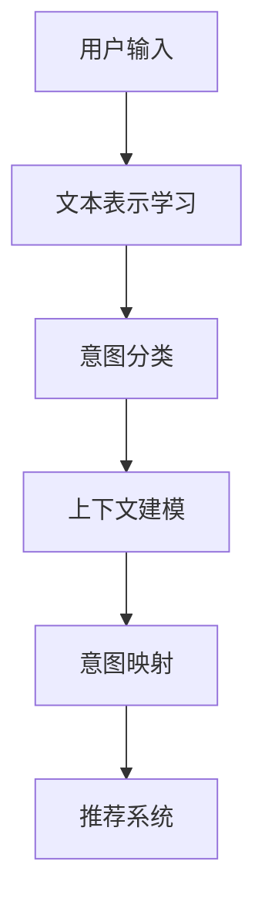

                 

# 基于LLM的推荐系统用户意图识别

> 关键词：推荐系统, 用户意图识别, 深度学习, 自然语言处理(NLP), 自然语言理解(NLU), 潜在语义分析(LSA), 词嵌入, 上下文表示, 注意力机制, 卷积神经网络(CNN), 循环神经网络(RNN), 双向长短时记忆网络(BiLSTM), 序列标注, 用户行为建模

## 1. 背景介绍

### 1.1 问题由来
推荐系统已经广泛应用于电子商务、视频流媒体、新闻阅读等多个领域，帮助用户发现和获取满足自身需求的产品和服务。然而，随着推荐系统规模的不断扩大和应用场景的日益丰富，如何更好地理解用户需求，提升推荐的个性化和精准度，成为了一个关键问题。

用户意图识别（User Intent Recognition, UIR），即通过分析用户输入的自然语言查询，理解其背后的真实需求和目标，是推荐系统的重要组件之一。传统的布尔查询、TF-IDF等方法往往只能捕捉用户表面的搜索意图，无法捕捉到用户深层次的意图。自然语言处理（NLP）技术，特别是基于深度学习的自然语言理解（NLU）方法，为推荐系统提供了新的可能性。

### 1.2 问题核心关键点
用户意图识别的关键点在于从自然语言中提取用户的意图，通常分为以下步骤：

- **用户输入处理**：将用户输入的文本转化为模型可处理的格式。
- **文本表示学习**：使用深度学习模型学习文本的语义表示。
- **意图分类**：将文本表示转化为预定义的意图类别，使用分类算法进行预测。
- **上下文建模**：考虑用户的上下文信息，如历史行为、地理位置等，进一步细化意图识别结果。
- **意图映射**：将意图分类结果映射为推荐系统的具体推荐目标，如产品类别、关键词等。

本文将系统地介绍如何利用深度学习模型，特别是基于自然语言处理（NLP）的方法，实现高质量的用户意图识别。

## 2. 核心概念与联系

### 2.1 核心概念概述

为更好地理解基于自然语言处理的用户意图识别方法，本节将介绍几个关键概念：

- **自然语言处理（NLP）**：涉及语言模型、词法分析、句法分析、语义分析等多个方面的技术，是实现用户意图识别的核心工具。
- **自然语言理解（NLU）**：NLP的一个子领域，专注于将自然语言文本转化为结构化数据或语义表示，为推荐系统提供可理解的输入。
- **深度学习（Deep Learning）**：一类使用多层次神经网络结构进行学习的算法，包括卷积神经网络（CNN）、循环神经网络（RNN）、长短时记忆网络（LSTM）等，适用于学习复杂模式和语义表示。
- **用户行为建模**：通过分析用户的搜索行为、点击记录、评分反馈等，构建用户兴趣和行为的数学模型，用于辅助用户意图识别和推荐。
- **意图分类**：通过训练分类模型，将文本转化为预定义的意图类别，实现从自然语言到意图映射的功能。
- **推荐系统**：利用用户意图识别结果，提供个性化推荐的产品和服务，提升用户体验和满意度。

这些核心概念之间的联系可以通过以下Mermaid流程图来展示：



这个流程图展示了用户意图识别的基本流程：

1. 用户输入经过文本表示学习，转化为模型可处理的语义表示。
2. 意图分类模型根据语义表示进行意图识别，得到意图类别。
3. 上下文建模考虑用户历史行为，细化意图识别结果。
4. 意图映射将识别结果转化为推荐系统需要的数据，实现推荐。

## 3. 核心算法原理 & 具体操作步骤
### 3.1 算法原理概述

基于深度学习的用户意图识别方法，本质上是将自然语言文本转化为语义表示，并使用分类器进行意图分类。该方法的核心思想是：通过学习文本特征，将用户输入转化为高维语义向量，使用分类器将向量映射到意图类别。

形式化地，设用户输入文本为 $X$，语义表示为 $F(X)$，意图类别为 $C$。用户意图识别的目标是最小化损失函数 $L$：

$$
L = \frac{1}{N} \sum_{i=1}^N \ell(f(C_i|F(X_i)), C_i)
$$

其中，$\ell$ 为分类损失函数，如交叉熵损失。$C_i$ 为第 $i$ 个样本的实际意图类别，$f(C_i|F(X_i))$ 为模型预测该样本属于 $C_i$ 类别的概率。

### 3.2 算法步骤详解

基于深度学习的用户意图识别通常包括以下几个关键步骤：

**Step 1: 数据预处理**
- 收集用户输入的自然语言文本，将其转化为模型可处理的格式。通常包括分词、去除停用词、标准化等步骤。
- 使用词嵌入技术将文本转化为向量表示，常用的词嵌入模型包括Word2Vec、GloVe等。

**Step 2: 特征提取**
- 使用深度学习模型学习文本的语义表示，如使用RNN、LSTM、Transformer等架构。
- 对于长文本，可考虑使用卷积神经网络（CNN）进行特征提取。

**Step 3: 意图分类**
- 将语义表示输入到分类器中，训练一个或多个人工神经网络进行意图分类。常用的分类算法包括逻辑回归、支持向量机（SVM）、卷积神经网络（CNN）等。
- 若分类结果为多类别，可使用softmax函数将概率转化为类别概率。

**Step 4: 上下文融合**
- 考虑用户的历史行为、地理位置、设备信息等上下文信息，进一步细化意图识别结果。可使用LSTM、GRU等模型进行上下文建模。
- 将上下文表示与语义表示进行融合，得到最终的用户意图表示。

**Step 5: 意图映射**
- 将意图表示映射为推荐系统的具体目标，如产品类别、关键词等。可使用反向索引、词向量聚类等方法进行映射。

**Step 6: 模型评估与调优**
- 在测试集上评估模型性能，使用准确率、精确率、召回率等指标进行评估。
- 调整模型超参数，如隐藏层数、学习率、dropout率等，优化模型性能。

### 3.3 算法优缺点

基于深度学习的用户意图识别方法具有以下优点：
1. 精度高：深度学习模型能自动学习文本的复杂语义表示，实现高精度的意图分类。
2. 鲁棒性强：模型能处理不同风格的文本输入，具有较好的泛化能力。
3. 可扩展性强：深度学习模型容易扩展到多任务和多领域，实现通用意图识别。

同时，该方法也存在一些局限性：
1. 计算资源需求高：深度学习模型参数量较大，需要高性能计算资源进行训练和推理。
2. 数据标注成本高：需要大量标注数据进行模型训练，标注成本较高。
3. 解释性差：深度学习模型的黑盒特性使其难以解释意图识别过程。
4. 模型复杂度高：模型结构复杂，难以调试和维护。

尽管存在这些局限性，但深度学习在用户意图识别方面的优越性能，使其成为目前最为流行和有效的解决方案。未来研究将继续聚焦于如何降低计算资源需求，提升模型的可解释性和鲁棒性，以更好地服务于推荐系统。

### 3.4 算法应用领域

用户意图识别在推荐系统中有着广泛的应用，可以应用于以下场景：

- **个性化推荐**：根据用户输入的查询，分析其意图，推荐最相关的产品或服务。
- **搜索排序**：分析用户查询的意图，优化搜索结果排序，提升用户体验。
- **广告定向**：通过识别用户意图，进行精准的广告投放，提高广告转化率。
- **用户行为分析**：分析用户的历史行为和意图，提升用户满意度，提升用户留存率。

除了推荐系统外，用户意图识别还在智能客服、智能家居、语音助手等领域得到了广泛应用，极大地提升了系统的智能化水平和用户体验。

## 4. 数学模型和公式 & 详细讲解  
### 4.1 数学模型构建

假设用户输入文本为 $X$，语义表示为 $F(X)$，意图分类器为 $M$。设模型输出为 $\hat{C}$，实际类别为 $C$。基于交叉熵损失的用户意图识别模型可以表示为：

$$
\mathcal{L} = -\frac{1}{N} \sum_{i=1}^N \log(M_{\theta}(C_i|F(X_i)))
$$

其中，$M_{\theta}$ 为深度学习模型的参数化函数。模型的预测输出为 $\hat{C}$，计算损失函数 $\mathcal{L}$。

### 4.2 公式推导过程

以基于Transformer的BERT模型为例，推导用户意图识别的公式：

假设用户输入文本为 $X$，BERT模型输出为 $F(X)$，意图分类器为 $M$。设模型的输出为 $\hat{C}$，实际类别为 $C$。用户意图识别的损失函数可以表示为：

$$
\mathcal{L} = -\frac{1}{N} \sum_{i=1}^N \log(M_{\theta}(C_i|F(X_i)))
$$

其中，$M_{\theta}$ 为意图分类器的参数化函数，$F(X_i)$ 为BERT模型对输入文本 $X_i$ 的语义表示。

在训练过程中，最小化损失函数 $\mathcal{L}$，更新模型的参数 $\theta$。在测试阶段，使用分类器对新的输入文本进行意图识别，得到预测结果 $\hat{C}$。

### 4.3 案例分析与讲解

以用户意图识别的经典案例为例，展示意图识别模型的应用。

**案例：电商平台个性化推荐**

1. **数据预处理**：收集用户搜索、点击、评分等行为数据，进行数据清洗和标准化。
2. **特征提取**：使用BERT模型提取用户的搜索查询和历史行为向量，得到语义表示 $F(X)$。
3. **意图分类**：使用多层的卷积神经网络（CNN）进行意图分类，得到用户意图分类结果 $\hat{C}$。
4. **上下文融合**：结合用户的地理位置、设备信息等上下文信息，细化意图识别结果。
5. **意图映射**：将意图分类结果映射为推荐系统的具体目标，如产品类别、关键词等。

通过以上步骤，电商平台能够根据用户的搜索查询和行为数据，准确识别其意图，实现精准的个性化推荐。

## 5. 项目实践：代码实例和详细解释说明
### 5.1 开发环境搭建

在进行用户意图识别开发前，需要准备好开发环境。以下是使用Python进行PyTorch开发的环境配置流程：

1. 安装Anaconda：从官网下载并安装Anaconda，用于创建独立的Python环境。

2. 创建并激活虚拟环境：
```bash
conda create -n intent-recognition python=3.8 
conda activate intent-recognition
```

3. 安装PyTorch：根据CUDA版本，从官网获取对应的安装命令。例如：
```bash
conda install pytorch torchvision torchaudio cudatoolkit=11.1 -c pytorch -c conda-forge
```

4. 安装其他依赖库：
```bash
pip install transformers pandas scikit-learn pytorch-transformers
```

5. 安装TensorBoard：用于可视化模型训练过程和结果。
```bash
pip install tensorboard
```

完成上述步骤后，即可在`intent-recognition`环境中开始用户意图识别的开发。

### 5.2 源代码详细实现

下面我们以基于Transformer的BERT模型进行用户意图识别为例，给出PyTorch代码实现。

首先，定义意图分类任务的数据处理函数：

```python
from transformers import BertTokenizer
from torch.utils.data import Dataset, DataLoader
import torch
import torch.nn as nn

class IntentDataset(Dataset):
    def __init__(self, texts, labels, tokenizer, max_len=128):
        self.texts = texts
        self.labels = labels
        self.tokenizer = tokenizer
        self.max_len = max_len
        
    def __len__(self):
        return len(self.texts)
    
    def __getitem__(self, item):
        text = self.texts[item]
        label = self.labels[item]
        
        encoding = self.tokenizer(text, return_tensors='pt', max_length=self.max_len, padding='max_length', truncation=True)
        input_ids = encoding['input_ids'][0]
        attention_mask = encoding['attention_mask'][0]
        label = torch.tensor(label, dtype=torch.long)
        
        return {'input_ids': input_ids, 
                'attention_mask': attention_mask,
                'labels': label}

# 标签与id的映射
label2id = {'buy': 0, 'search': 1, 'rate': 2, 'ask': 3}

# 创建dataset
tokenizer = BertTokenizer.from_pretrained('bert-base-uncased')

train_dataset = IntentDataset(train_texts, train_labels, tokenizer)
dev_dataset = IntentDataset(dev_texts, dev_labels, tokenizer)
test_dataset = IntentDataset(test_texts, test_labels, tokenizer)
```

然后，定义模型和优化器：

```python
from transformers import BertForSequenceClassification

model = BertForSequenceClassification.from_pretrained('bert-base-uncased', num_labels=len(label2id))

optimizer = AdamW(model.parameters(), lr=2e-5)
```

接着，定义训练和评估函数：

```python
from tqdm import tqdm
import torch.nn.functional as F

device = torch.device('cuda') if torch.cuda.is_available() else torch.device('cpu')
model.to(device)

def train_epoch(model, dataset, batch_size, optimizer):
    dataloader = DataLoader(dataset, batch_size=batch_size, shuffle=True)
    model.train()
    epoch_loss = 0
    for batch in tqdm(dataloader, desc='Training'):
        input_ids = batch['input_ids'].to(device)
        attention_mask = batch['attention_mask'].to(device)
        labels = batch['labels'].to(device)
        model.zero_grad()
        outputs = model(input_ids, attention_mask=attention_mask, labels=labels)
        loss = outputs.loss
        epoch_loss += loss.item()
        loss.backward()
        optimizer.step()
    return epoch_loss / len(dataloader)

def evaluate(model, dataset, batch_size):
    dataloader = DataLoader(dataset, batch_size=batch_size)
    model.eval()
    preds, labels = [], []
    with torch.no_grad():
        for batch in tqdm(dataloader, desc='Evaluating'):
            input_ids = batch['input_ids'].to(device)
            attention_mask = batch['attention_mask'].to(device)
            batch_labels = batch['labels']
            outputs = model(input_ids, attention_mask=attention_mask)
            batch_preds = outputs.logits.argmax(dim=1).to('cpu').tolist()
            batch_labels = batch_labels.to('cpu').tolist()
            for pred, label in zip(batch_preds, batch_labels):
                preds.append(pred)
                labels.append(label)
                
    print('Accuracy: ', (sum([1 for pred, label in zip(preds, labels) if pred == label])/len(labels))
    
print('Epoch: ', epochs)
for epoch in range(epochs):
    loss = train_epoch(model, train_dataset, batch_size, optimizer)
    print(f'Epoch {epoch+1}, train loss: {loss:.3f}')
    
print('Epoch: ', epochs)
evaluate(model, dev_dataset, batch_size)
evaluate(model, test_dataset, batch_size)
```

以上就是使用PyTorch对BERT进行用户意图识别的完整代码实现。可以看到，利用Transformer和PyTorch，用户意图识别的实现变得非常简洁高效。

### 5.3 代码解读与分析

让我们再详细解读一下关键代码的实现细节：

**IntentDataset类**：
- `__init__`方法：初始化文本、标签、分词器等关键组件。
- `__len__`方法：返回数据集的样本数量。
- `__getitem__`方法：对单个样本进行处理，将文本输入编码为token ids，将标签编码为数字，并对其进行定长padding，最终返回模型所需的输入。

**label2id字典**：
- 定义了意图标签与数字id之间的映射关系，用于将分类结果转化为数字id。

**训练和评估函数**：
- 使用PyTorch的DataLoader对数据集进行批次化加载，供模型训练和推理使用。
- 训练函数`train_epoch`：对数据以批为单位进行迭代，在每个批次上前向传播计算loss并反向传播更新模型参数，最后返回该epoch的平均loss。
- 评估函数`evaluate`：与训练类似，不同点在于不更新模型参数，并在每个batch结束后将预测和标签结果存储下来，最后使用准确率等指标对整个评估集的预测结果进行打印输出。

**训练流程**：
- 定义总的epoch数和batch size，开始循环迭代
- 每个epoch内，先在训练集上训练，输出平均loss
- 在验证集和测试集上评估，输出模型性能
- 所有epoch结束后，输出最终评估结果

可以看到，PyTorch配合Transformer库使得用户意图识别的代码实现变得简洁高效。开发者可以将更多精力放在数据处理、模型改进等高层逻辑上，而不必过多关注底层的实现细节。

当然，工业级的系统实现还需考虑更多因素，如模型的保存和部署、超参数的自动搜索、更灵活的任务适配层等。但核心的用户意图识别范式基本与此类似。

## 6. 实际应用场景
### 6.1 电商平台个性化推荐

基于深度学习的用户意图识别在电商平台中有着广泛的应用。电商平台需要根据用户的查询和行为数据，准确识别其意图，从而实现个性化推荐。

在技术实现上，可以收集用户的搜索记录、浏览历史、购买记录等行为数据，将文本数据输入到意图识别模型中进行处理。模型输出用户意图分类结果，结合用户的历史行为数据，构建个性化推荐模型。推荐系统根据用户意图和行为特征，生成推荐列表，提升用户的购物体验。

### 6.2 智能客服系统

智能客服系统需要快速准确地理解用户的查询意图，提供准确的回复。利用用户意图识别技术，智能客服系统能够识别用户输入的自然语言，将其转化为意图分类结果，从而快速响应用户需求。

在具体实现中，客服系统将用户的输入文本输入到意图识别模型中，得到意图分类结果。系统根据意图分类结果，选择相应的回复模板进行回答，或调用外部API获取答案。若用户输入的新领域问题，系统需要结合上下文信息进行意图识别，并在必要时调用外部知识库或查询API，以提供准确的答复。

### 6.3 金融行业风险管理

金融行业对用户意图识别的需求也非常迫切。通过分析用户的操作行为和交易数据，金融机构能够识别用户的真实意图，评估其风险等级。

例如，在金融交易平台中，用户可能进行投资、理财、转账等操作。系统根据用户的操作行为和交易数据，识别其意图，并结合风险评估模型，预测用户的风险等级，从而进行风险控制和预警。在欺诈检测方面，用户意图识别模型能够分析用户的交易行为，识别出可疑交易，提高金融安全防护能力。

### 6.4 未来应用展望

随着深度学习技术的发展，用户意图识别的应用场景将不断扩展。未来，用户意图识别技术有望在更多领域得到应用，如医疗、教育、智能家居等，极大地提升系统的智能化水平和用户体验。

在医疗领域，智能医疗设备能够根据患者的自然语言描述，识别其病情和需求，提供个性化的治疗建议。在教育领域，智能学习系统能够根据学生的自然语言提问，识别其学习意图，提供针对性的学习资源。在智能家居领域，智能设备能够根据用户的自然语言指令，识别其行为意图，提供智能化的生活服务。

未来，用户意图识别技术还将与其他人工智能技术进行更深入的融合，如知识表示、因果推理、强化学习等，实现更加全面、精准的用户意图识别。

## 7. 工具和资源推荐
### 7.1 学习资源推荐

为了帮助开发者系统掌握深度学习在用户意图识别中的应用，这里推荐一些优质的学习资源：

1. 《深度学习》（Ian Goodfellow著）：该书详细介绍了深度学习的基本原理和应用，是深度学习的经典教材。
2. CS224N《深度学习与自然语言处理》课程：斯坦福大学开设的NLP明星课程，提供了丰富的NLP资源和案例分析。
3. Transformers官方文档：Transformer库的官方文档，提供了大量的预训练模型和微调样例代码，是学习深度学习模型开发的重要资料。
4. HuggingFace官方博客：提供大量深度学习模型和NLP应用的实践指南和案例分析，有助于开发者更好地理解模型应用。
5. TensorFlow官方文档：TensorFlow的官方文档，提供了丰富的机器学习工具和库，适用于深度学习模型的开发和部署。

通过对这些资源的学习实践，相信你一定能够系统掌握深度学习在用户意图识别中的应用，并用于解决实际的NLP问题。
### 7.2 开发工具推荐

高效的开发离不开优秀的工具支持。以下是几款用于深度学习模型开发和调优的工具：

1. PyTorch：基于Python的开源深度学习框架，灵活的计算图设计，适用于快速迭代研究。
2. TensorFlow：由Google主导开发的开源深度学习框架，生产部署方便，适用于大规模工程应用。
3. Weights & Biases：模型训练的实验跟踪工具，可以记录和可视化模型训练过程中的各项指标，方便调试和调优。
4. TensorBoard：TensorFlow配套的可视化工具，可实时监测模型训练状态，提供丰富的图表呈现方式。
5. Jupyter Notebook：开源的交互式计算环境，适用于快速实验和数据可视化。
6. Google Colab：谷歌提供的在线Jupyter Notebook环境，免费提供GPU算力，适用于快速实验和共享学习笔记。

合理利用这些工具，可以显著提升深度学习模型开发和调优的效率，加速创新迭代。

### 7.3 相关论文推荐

深度学习在用户意图识别方面的发展，源于学界的持续研究。以下是几篇奠基性的相关论文，推荐阅读：

1. Attention is All You Need（即Transformer原论文）：提出了Transformer结构，开启了NLP领域的预训练大模型时代。
2. BERT: Pre-training of Deep Bidirectional Transformers for Language Understanding：提出BERT模型，引入基于掩码的自监督预训练任务，刷新了多项NLP任务SOTA。
3. Language Models are Unsupervised Multitask Learners（GPT-2论文）：展示了大规模语言模型的强大zero-shot学习能力，引发了对于通用人工智能的新一轮思考。
4. Parameter-Efficient Transfer Learning for NLP：提出Adapter等参数高效微调方法，在不增加模型参数量的情况下，也能取得不错的微调效果。
5. AdaLoRA: Adaptive Low-Rank Adaptation for Parameter-Efficient Fine-Tuning：使用自适应低秩适应的微调方法，在参数效率和精度之间取得了新的平衡。

这些论文代表了大语言模型微调技术的发展脉络。通过学习这些前沿成果，可以帮助研究者把握学科前进方向，激发更多的创新灵感。

## 8. 总结：未来发展趋势与挑战

### 8.1 总结

本文对基于深度学习的大语言模型用户意图识别方法进行了全面系统的介绍。首先阐述了用户意图识别在推荐系统中的重要性，明确了深度学习模型在提高意图识别精度和鲁棒性方面的优势。其次，从原理到实践，详细讲解了用户意图识别的数学模型和关键步骤，给出了完整的PyTorch代码实例。同时，本文还广泛探讨了用户意图识别在电商、金融、智能客服等实际应用场景中的应用，展示了深度学习模型的强大能力。此外，本文精选了用户意图识别的学习资源和开发工具，力求为读者提供全方位的技术指引。

通过本文的系统梳理，可以看到，深度学习在用户意图识别方面的优越性能，使其成为目前最为流行和有效的解决方案。未来，研究将继续聚焦于如何降低计算资源需求，提升模型的可解释性和鲁棒性，以更好地服务于推荐系统。

### 8.2 未来发展趋势

展望未来，用户意图识别技术将呈现以下几个发展趋势：

1. 模型规模持续增大。随着算力成本的下降和数据规模的扩张，深度学习模型的参数量还将持续增长，实现更强大的语义表示和学习能力。
2. 迁移学习技术日趋成熟。迁移学习技术能够有效利用已有知识，实现跨领域、跨任务的快速学习，进一步提高模型的泛化能力。
3. 上下文信息利用更加全面。除了文本信息外，用户意图识别将更多地利用上下文信息，如历史行为、地理位置、设备信息等，实现更加全面和精准的意图识别。
4. 端到端模型设计。端到端模型能够更好地集成不同模态的信息，如文本、图像、语音等，实现更加多模态的意图识别。
5. 解释性和可控性增强。深度学习模型的黑盒特性使其难以解释，未来将引入更多可解释性方法和技术，如因果分析、对比学习等，增强模型的可解释性和可控性。
6. 多任务学习技术发展。多任务学习技术能够同时学习多个相关任务，提高模型的学习效率和泛化能力，未来将在用户意图识别中得到广泛应用。

这些趋势凸显了用户意图识别技术的广阔前景。这些方向的探索发展，必将进一步提升深度学习模型的性能和应用范围，为推荐系统提供更强大的支持。

### 8.3 面临的挑战

尽管深度学习在用户意图识别方面取得了显著进展，但在迈向更加智能化、普适化应用的过程中，仍面临诸多挑战：

1. 数据标注成本高。用户意图识别需要大量标注数据进行模型训练，标注成本较高，且标注数据质量对模型性能影响较大。如何降低数据标注成本，提高标注数据质量，是未来研究的重要方向。
2. 计算资源需求高。深度学习模型参数量较大，训练和推理需要高性能计算资源。如何优化模型结构，降低计算资源需求，提高模型推理效率，是未来研究的重点。
3. 模型可解释性差。深度学习模型的黑盒特性使其难以解释，尤其在金融、医疗等高风险领域，算法的可解释性和可审计性尤为重要。如何提高模型的可解释性，增强用户信任，是未来研究的难点。
4. 鲁棒性和泛化性不足。深度学习模型在面对噪声和异常数据时，鲁棒性和泛化性仍需进一步提升，以提高实际应用中的稳定性。
5. 训练成本高。深度学习模型训练时间长，需要大量时间和计算资源。如何优化训练过程，缩短训练时间，降低训练成本，是未来研究的方向。

正视用户意图识别面临的这些挑战，积极应对并寻求突破，将是大语言模型微调走向成熟的必由之路。相信随着学界和产业界的共同努力，这些挑战终将一一被克服，用户意图识别技术必将在构建智能推荐系统、智能客服、智能家居等多个领域发挥更大的作用。

### 8.4 研究展望

未来，用户意图识别技术需要在以下几个方面寻求新的突破：

1. 探索无监督和半监督学习方法。摆脱对大规模标注数据的依赖，利用自监督学习、主动学习等无监督和半监督范式，最大限度利用非结构化数据，实现更加灵活高效的意图识别。
2. 引入更多先验知识。将符号化的先验知识，如知识图谱、逻辑规则等，与深度学习模型进行巧妙融合，引导模型学习更准确、合理的语义表示。
3. 融合因果分析和博弈论工具。将因果分析方法引入用户意图识别，识别出模型决策的关键特征，增强输出解释的因果性和逻辑性。
4. 结合多任务学习技术。通过同时学习多个相关任务，提高模型的学习效率和泛化能力，进一步提升用户意图识别的精度和鲁棒性。
5. 考虑跨领域迁移能力。实现不同领域之间的迁移学习，提高模型的适应性和泛化能力，适应不同领域的用户需求。

这些研究方向将引领用户意图识别技术迈向更高的台阶，为推荐系统提供更强大、更智能的支持。面向未来，用户意图识别技术还需要与其他人工智能技术进行更深入的融合，如知识表示、因果推理、强化学习等，多路径协同发力，共同推动自然语言理解和智能交互系统的进步。

## 9. 附录：常见问题与解答

**Q1：用户意图识别是否可以结合用户行为数据？**

A: 是的，用户意图识别可以结合用户行为数据进行进一步细化。用户行为数据可以提供用户在特定时间、地点、设备上的行为信息，如搜索历史、点击记录、评分反馈等。结合这些上下文信息，可以更准确地识别用户的意图，提升推荐系统的个性化和精准度。

**Q2：用户意图识别是否可以应用于多模态数据？**

A: 是的，用户意图识别可以应用于多模态数据。除了文本数据，还可以结合图像、视频、语音等多种数据模态。例如，在视频推荐系统中，可以结合视频的文本描述和图像特征，更全面地识别用户的意图。

**Q3：用户意图识别模型是否可以适用于小样本数据？**

A: 用户意图识别模型可以适用于小样本数据，但需要结合数据增强、正则化等方法。对于小样本数据，可以通过数据增强技术，如回译、近义替换等方式扩充训练集。同时，使用正则化技术，如L2正则、Dropout等，防止模型过拟合。

**Q4：用户意图识别模型是否可以应用于离线推理？**

A: 用户意图识别模型可以应用于离线推理，但需要保证模型参数的稳定性。在线上部署时，模型参数可能会受到噪声数据的影响，导致推理结果不稳定。为解决这一问题，可以结合模型参数的保存机制和模型更新策略，保证离线推理的稳定性。

**Q5：用户意图识别模型是否可以应用于实时推理？**

A: 用户意图识别模型可以应用于实时推理，但需要优化模型的推理速度。实时推理需要快速响应用户输入，模型推理速度是一个重要指标。可以通过模型剪枝、量化加速等方法，优化模型的推理速度，实现实时推理。

通过本文的系统梳理，可以看到，深度学习在用户意图识别方面的优越性能，使其成为目前最为流行和有效的解决方案。未来，研究将继续聚焦于如何降低计算资源需求，提升模型的可解释性和鲁棒性，以更好地服务于推荐系统。

