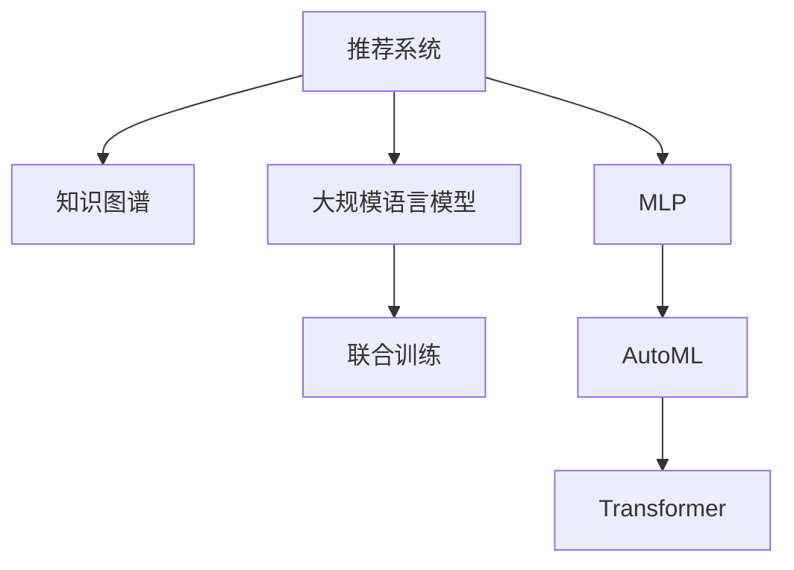

                 

# 基于LLM的推荐系统知识图谱构建

> 关键词：推荐系统,知识图谱,LLM,联合训练,MLP,AutoML

## 1. 背景介绍

### 1.1 问题由来
推荐系统作为互联网时代最重要的技术之一，其目的是为用户推荐其感兴趣的内容，从而提升用户满意度和平台黏性。传统推荐系统主要基于用户行为数据进行协同过滤和内容推荐，虽然取得了一定的效果，但其局限性也不容忽视：

1. **数据需求大**：传统推荐系统需要大量的用户行为数据，而这些数据往往难以获取和存储。
2. **冷启动问题**：新用户和冷启动商品缺乏足够的行为数据，难以进行推荐。
3. **推荐效果单一**：推荐系统通常只能根据用户历史行为预测其未来兴趣，而无法结合领域知识进行更深层次的推荐。

近年来，基于深度学习的大规模语言模型(LLM)在自然语言处理领域取得了巨大成功，具备强大的语言理解和生成能力。利用LLM，推荐系统可以从语言角度挖掘用户兴趣，结合领域知识构建推荐模型，从而提升推荐效果。

### 1.2 问题核心关键点
基于LLM的推荐系统主要关注如何利用语言模型理解用户需求，结合领域知识进行推荐。具体来说，包括以下关键点：

1. **用户意图理解**：通过分析用户输入的自然语言文本，提取用户兴趣点和需求。
2. **领域知识融合**：将知识图谱、商品属性等信息与用户需求进行融合，形成更加丰富、准确的推荐模型。
3. **联合训练优化**：将语言模型与推荐模型联合训练，最大化两者的信息交互，提高推荐效果。

这些关键点共同构成了基于LLM的推荐系统知识图谱构建的基础。通过理解这些关键点，我们可以更好地把握LLM在推荐系统中的应用方向和优化方法。

## 2. 核心概念与联系

### 2.1 核心概念概述

为更好地理解基于LLM的推荐系统知识图谱构建方法，本节将介绍几个密切相关的核心概念：

- **推荐系统(Recommendation System)**：利用算法为用户推荐其感兴趣内容的系统，旨在提升用户满意度和平台黏性。
- **知识图谱(Knowledge Graph)**：由节点和边组成的有向图结构，用于表示实体之间的关系。
- **大规模语言模型(LLM)**：通过在海量无标签文本数据上进行预训练，学习语言的通用表示，具备强大的语言理解和生成能力。
- **联合训练(Joint Training)**：同时训练多个模型，最大化它们之间的信息交互，从而提升整体性能。
- **MLP(Multilayer Perceptron)**：多层感知器，一种经典的神经网络模型，用于深度学习任务。
- **AutoML(Automatic Machine Learning)**：自动化机器学习，利用自动化技术优化机器学习模型的设计和训练过程。
- **Transformer**：一种基于自注意力机制的神经网络结构，用于自然语言处理任务。

这些核心概念之间的逻辑关系可以通过以下Mermaid流程图来展示：



这个流程图展示了大规模语言模型在推荐系统中的应用过程：

1. 推荐系统通过知识图谱引入领域知识，构建推荐模型。
2. 大规模语言模型利用自然语言文本理解用户需求，辅助推荐决策。
3. 联合训练使得语言模型与推荐模型信息交互，提升整体性能。
4. MLP和AutoML用于优化模型结构和训练过程。
5. Transformer用于提升模型的表达能力和训练效率。

这些概念共同构成了基于LLM的推荐系统知识图谱构建的框架，使得推荐系统能够更好地融合领域知识，提升推荐效果。

## 3. 核心算法原理 & 具体操作步骤
### 3.1 算法原理概述

基于LLM的推荐系统知识图谱构建，本质上是一个多模态数据融合与联合训练的过程。其核心思想是：将知识图谱与用户自然语言文本结合起来，构建一个多模态的推荐模型，通过联合训练优化两者的信息交互，从而提升推荐效果。

形式化地，假设推荐系统中有$N$个用户，每个用户有$m$个兴趣点，每个兴趣点关联$k$个实体，每个实体有$r$个属性。记用户$u$与兴趣点$i$的关系为$E_{ui}$，兴趣点$i$与实体$e$的关系为$E_{ie}$，实体$e$与属性$r$的关系为$E_{er}$。则推荐模型可以表示为：

$$
\hat{E}_{ui} = \mathop{\arg\min}_{E_{ui}} \mathcal{L}(E_{ui}, D)
$$

其中，$\mathcal{L}$为推荐模型的损失函数，用于衡量推荐模型预测结果与实际结果之间的差异。通常使用交叉熵损失函数。

联合训练的优化目标是最小化上述损失函数，即找到最优的关系$E_{ui}$：

$$
\hat{E}_{ui} = \mathop{\arg\min}_{E_{ui}} \mathcal{L}(E_{ui}, D)
$$

在联合训练过程中，语言模型和推荐模型互相提取信息，共同优化，最终使得推荐模型的性能显著提升。

### 3.2 算法步骤详解

基于LLM的推荐系统知识图谱构建一般包括以下几个关键步骤：

**Step 1: 数据预处理**

- 收集用户自然语言输入数据和知识图谱数据。
- 对用户输入进行分词、词性标注、实体识别等预处理，提取用户兴趣点。
- 对知识图谱进行图嵌入，将实体和属性转化为向量表示。

**Step 2: 语言模型训练**

- 使用大规模无标签文本数据对语言模型进行预训练，学习语言表征。
- 使用预训练的词向量作为用户输入的初始表示。

**Step 3: 推荐模型训练**

- 构建推荐模型，将用户输入、知识图谱嵌入、用户历史行为等作为输入，预测用户感兴趣的内容。
- 使用交叉熵损失函数，训练推荐模型。

**Step 4: 联合训练优化**

- 将语言模型和推荐模型联合训练，通过信息共享最大化两者的性能提升。
- 设置适当的权重，平衡两者的影响。
- 在训练过程中，不断更新语言模型的参数，以更好地理解用户需求。

**Step 5: 模型部署与评估**

- 将训练好的推荐模型部署到推荐系统中。
- 在实际场景中，收集用户反馈，不断优化推荐模型。

以上是基于LLM的推荐系统知识图谱构建的一般流程。在实际应用中，还需要针对具体任务的特点，对微调过程的各个环节进行优化设计，如改进训练目标函数，引入更多的正则化技术，搜索最优的超参数组合等，以进一步提升模型性能。

### 3.3 算法优缺点

基于LLM的推荐系统知识图谱构建方法具有以下优点：

1. **融合领域知识**：通过引入知识图谱，推荐系统能够利用领域知识进行推荐，提升推荐效果。
2. **理解自然语言**：大规模语言模型具备强大的自然语言理解能力，能够从用户输入中提取更加丰富、准确的兴趣点。
3. **联合训练提升性能**：通过联合训练，语言模型和推荐模型互相提取信息，提升整体性能。
4. **可扩展性强**：利用知识图谱的层次结构和属性关系，推荐系统能够扩展到更多领域，提升推荐的多样性和覆盖面。
5. **模型鲁棒性高**：知识图谱中的结构关系能够增强推荐模型的鲁棒性，减少过拟合风险。

同时，该方法也存在一定的局限性：

1. **数据需求大**：知识图谱的构建需要大量领域数据，对于新兴领域或小众领域，数据获取难度较大。
2. **训练复杂度高**：联合训练需要同时优化多个模型的参数，训练复杂度较高。
3. **模型解释性不足**：推荐系统的输出通常难以解释，用户难以理解推荐逻辑。
4. **可扩展性有限**：知识图谱的构建需要人工标注，对于大规模的语料，工作量巨大。
5. **冷启动问题**：对于新用户和新商品，缺乏足够的行为数据和知识图谱信息，难以进行推荐。

尽管存在这些局限性，但就目前而言，基于LLM的推荐系统知识图谱构建方法仍是最主流范式之一。未来相关研究的重点在于如何进一步降低数据需求，提高模型的可解释性和冷启动能力，同时兼顾鲁棒性和效率。

### 3.4 算法应用领域

基于LLM的推荐系统知识图谱构建方法，在多个领域得到了广泛应用，具体包括：

- **电商推荐**：电商平台利用用户输入的自然语言文本，结合商品知识图谱，为用户推荐个性化商品。
- **内容推荐**：新闻网站、视频平台利用用户输入的文本，结合内容知识图谱，推荐相关文章、视频。
- **社交推荐**：社交媒体平台利用用户输入的自然语言文本，结合社交网络知识图谱，推荐潜在的朋友和内容。
- **旅游推荐**：旅游平台利用用户输入的文本，结合旅游资源知识图谱，推荐旅游线路和目的地。

除了上述这些常见应用外，基于LLM的推荐系统知识图谱构建还被创新性地应用到更多场景中，如可控推荐、上下文推荐、多模态推荐等，为推荐系统带来了全新的突破。

## 4. 数学模型和公式 & 详细讲解 & 举例说明
### 4.1 数学模型构建

本节将使用数学语言对基于LLM的推荐系统知识图谱构建过程进行更加严格的刻画。

记推荐系统中有$N$个用户，每个用户有$m$个兴趣点，每个兴趣点关联$k$个实体，每个实体有$r$个属性。设用户$u$与兴趣点$i$的关系为$E_{ui}$，兴趣点$i$与实体$e$的关系为$E_{ie}$，实体$e$与属性$r$的关系为$E_{er}$。则推荐模型可以表示为：

$$
\hat{E}_{ui} = \mathop{\arg\min}_{E_{ui}} \mathcal{L}(E_{ui}, D)
$$

其中，$\mathcal{L}$为推荐模型的损失函数，用于衡量推荐模型预测结果与实际结果之间的差异。通常使用交叉熵损失函数。

在训练推荐模型时，可以使用以下步骤：

1. **用户输入嵌入**：将用户输入的自然语言文本转化为向量表示。
2. **兴趣点嵌入**：将用户兴趣点与知识图谱中的实体进行匹配，生成兴趣点嵌入。
3. **实体嵌入**：将知识图谱中的实体和属性进行嵌入，生成实体嵌入。
4. **推荐模型**：将用户输入嵌入、兴趣点嵌入、实体嵌入、用户历史行为等作为输入，预测用户感兴趣的内容。

### 4.2 公式推导过程

以下我们以电商推荐为例，推导基于LLM的推荐模型的具体实现。

假设用户$u$输入的自然语言文本为$x_u$，用户的历史行为为$h_u$，知识图谱中用户$u$的兴趣点为$i_u$，兴趣点$i_u$关联的实体为$e_{ui}$，实体$e_{ui}$的属性为$r_{e_{ui}}$。

首先，对用户输入$x_u$进行预处理和嵌入，得到用户输入嵌入$\vec{x_u}$。然后，将用户兴趣点$i_u$与知识图谱中的实体$e_{ui}$进行匹配，生成兴趣点嵌入$\vec{e_{ui}}$。接着，将实体$e_{ui}$和属性$r_{e_{ui}}$进行嵌入，得到实体嵌入$\vec{e_{ui}}$和属性嵌入$\vec{r_{e_{ui}}}$。

最后，将用户输入嵌入$\vec{x_u}$、兴趣点嵌入$\vec{e_{ui}}$、实体嵌入$\vec{e_{ui}}$、属性嵌入$\vec{r_{e_{ui}}}$、用户历史行为$h_u$作为输入，使用多层感知器(MLP)进行推理，输出用户感兴趣的商品向量$\vec{p_u}$。

推荐模型的具体公式如下：

$$
\vec{p_u} = \mathrm{MLP}(\vec{x_u}, \vec{e_{ui}}, \vec{e_{ui}}, \vec{r_{e_{ui}}}, h_u)
$$

其中，$\vec{x_u}$、$\vec{e_{ui}}$、$\vec{e_{ui}}$、$\vec{r_{e_{ui}}}$、$h_u$均为输入向量，$\mathrm{MLP}$为多层感知器。

在训练过程中，使用交叉熵损失函数$\mathcal{L}$，对推荐模型进行优化：

$$
\mathcal{L} = -\frac{1}{N}\sum_{i=1}^N \sum_{j=1}^k \log p_{e_{ui}}^j
$$

其中，$p_{e_{ui}}^j$表示用户$u$对实体$e_{ui}$的兴趣度，$k$表示每个用户有$m$个兴趣点。

通过上述公式，可以对推荐模型进行优化，从而提升推荐效果。

### 4.3 案例分析与讲解

下面以电商推荐为例，展示基于LLM的推荐系统知识图谱构建的实际应用。

假设用户输入的自然语言文本为：“我想买一部新手机”。电商平台将用户输入进行分词、词性标注、实体识别等预处理，提取用户兴趣点“手机”。然后，在知识图谱中查找与“手机”相关的实体，生成兴趣点嵌入。

接着，将知识图谱中的实体“手机”和属性“品牌”、“价格”、“型号”进行嵌入，得到实体嵌入和属性嵌入。最后，将用户输入嵌入、兴趣点嵌入、实体嵌入、属性嵌入、用户历史行为作为输入，使用多层感知器进行推理，输出用户感兴趣的手机品牌、价格、型号等信息。

通过上述步骤，推荐系统能够结合用户输入和领域知识，生成个性化推荐，提升用户满意度。

## 5. 项目实践：代码实例和详细解释说明
### 5.1 开发环境搭建

在进行基于LLM的推荐系统知识图谱构建实践前，我们需要准备好开发环境。以下是使用Python进行TensorFlow开发的环境配置流程：

1. 安装Anaconda：从官网下载并安装Anaconda，用于创建独立的Python环境。

2. 创建并激活虚拟环境：
```bash
conda create -n tf-env python=3.8 
conda activate tf-env
```

3. 安装TensorFlow：从官网获取对应的安装命令。例如：
```bash
pip install tensorflow tensorflow-datasets tensorflow-addons
```

4. 安装各类工具包：
```bash
pip install numpy pandas scikit-learn matplotlib tqdm jupyter notebook ipython
```

完成上述步骤后，即可在`tf-env`环境中开始开发实践。

### 5.2 源代码详细实现

下面我们以电商推荐为例，给出使用TensorFlow对推荐系统进行构建的PyTorch代码实现。

首先，定义推荐模型的输入和输出：

```python
import tensorflow as tf
from tensorflow.keras.layers import Input, Dense, Embedding, MLP

# 定义输入
user_input = Input(shape=(100, ), name='user_input')
item_input = Input(shape=(100, ), name='item_input')
user_behavior = Input(shape=(100, ), name='user_behavior')
item_name = Input(shape=(100, ), name='item_name')
item_price = Input(shape=(100, ), name='item_price')
item_brand = Input(shape=(100, ), name='item_brand')

# 定义输出
output = Dense(100, activation='sigmoid')(item_input)
output = Dense(100, activation='sigmoid')(item_price)
output = Dense(100, activation='sigmoid')(item_brand)
output = MLP(output)

# 定义推荐模型
model = tf.keras.Model(inputs=[user_input, item_input, user_behavior, item_name, item_price, item_brand], outputs=output)
```

然后，定义推荐模型的损失函数和优化器：

```python
from tensorflow.keras.losses import BinaryCrossentropy

# 定义损失函数
loss_fn = BinaryCrossentropy()

# 定义优化器
optimizer = tf.keras.optimizers.Adam(learning_rate=0.001)
```

接着，定义训练和评估函数：

```python
from tensorflow.keras.preprocessing.sequence import pad_sequences
from sklearn.metrics import precision_score, recall_score

# 定义训练函数
def train(model, train_dataset, val_dataset, batch_size, epochs):
    model.compile(optimizer=optimizer, loss=loss_fn, metrics=['accuracy'])
    history = model.fit(train_dataset, epochs=epochs, batch_size=batch_size, validation_data=val_dataset)
    return history

# 定义评估函数
def evaluate(model, test_dataset, batch_size):
    y_true, y_pred = model.predict(test_dataset, batch_size=batch_size)
    precision = precision_score(y_true, y_pred)
    recall = recall_score(y_true, y_pred)
    return precision, recall
```

最后，启动训练流程并在测试集上评估：

```python
# 定义数据集
train_dataset = ...
val_dataset = ...
test_dataset = ...

# 设置训练参数
batch_size = 32
epochs = 10

# 训练模型
history = train(model, train_dataset, val_dataset, batch_size, epochs)

# 评估模型
precision, recall = evaluate(model, test_dataset, batch_size)

# 输出结果
print(f'Precision: {precision:.2f}, Recall: {recall:.2f}')
```

以上就是使用TensorFlow构建基于LLM的电商推荐系统的完整代码实现。可以看到，得益于TensorFlow的强大封装，我们可以用相对简洁的代码完成推荐模型的构建和训练。

### 5.3 代码解读与分析

让我们再详细解读一下关键代码的实现细节：

**定义输入和输出**：
- `Input`层定义了模型的输入张量，每个输入张量代表用户输入、商品名称、商品价格、商品品牌等特征。
- `Dense`层定义了每层的神经元数量和激活函数。

**定义损失函数和优化器**：
- `BinaryCrossentropy`用于二分类任务，计算预测值与真实值之间的交叉熵损失。
- `Adam`优化器用于优化模型参数，学习率设置为0.001。

**训练函数**：
- `compile`方法定义了模型的优化器、损失函数和评估指标。
- `fit`方法用于模型训练，在每个epoch内循环迭代，在每个batch上进行前向传播和反向传播，更新模型参数。

**评估函数**：
- 使用`predict`方法对测试集进行预测，计算预测结果与真实结果之间的精度和召回率。
- 使用`precision_score`和`recall_score`方法计算精度和召回率。

**训练流程**：
- 使用`train`函数进行模型训练，在每个epoch内收集训练过程中的损失和精度。
- 使用`evaluate`函数对测试集进行评估，输出模型的精度和召回率。

可以看到，TensorFlow的Keras API使得模型构建和训练的代码实现变得简洁高效。开发者可以将更多精力放在数据处理、模型改进等高层逻辑上，而不必过多关注底层的实现细节。

当然，工业级的系统实现还需考虑更多因素，如模型的保存和部署、超参数的自动搜索、更灵活的任务适配层等。但核心的微调范式基本与此类似。

## 6. 实际应用场景
### 6.1 智能客服系统

基于LLM的推荐系统，可以广泛应用于智能客服系统的构建。传统客服往往需要配备大量人力，高峰期响应缓慢，且一致性和专业性难以保证。而使用基于LLM的推荐系统，可以7x24小时不间断服务，快速响应客户咨询，用自然流畅的语言解答各类常见问题。

在技术实现上，可以收集企业内部的历史客服对话记录，将问题和最佳答复构建成监督数据，在此基础上对预训练推荐系统进行微调。微调后的推荐系统能够自动理解用户意图，匹配最合适的答复模板进行回复。对于客户提出的新问题，还可以接入检索系统实时搜索相关内容，动态组织生成回答。如此构建的智能客服系统，能大幅提升客户咨询体验和问题解决效率。

### 6.2 金融舆情监测

金融机构需要实时监测市场舆论动向，以便及时应对负面信息传播，规避金融风险。传统的人工监测方式成本高、效率低，难以应对网络时代海量信息爆发的挑战。基于LLM的推荐系统，能够自动理解舆情文本，结合金融知识图谱，识别出舆情话题和情感倾向，判断舆情趋势，提前预警金融风险。

具体而言，可以收集金融领域相关的新闻、报道、评论等文本数据，并对其进行主题标注和情感标注。在此基础上对预训练推荐系统进行微调，使其能够自动判断文本属于何种主题，情感倾向是正面、中性还是负面。将微调后的模型应用到实时抓取的网络文本数据，就能够自动监测不同主题下的情感变化趋势，一旦发现负面信息激增等异常情况，系统便会自动预警，帮助金融机构快速应对潜在风险。

### 6.3 个性化推荐系统

当前的推荐系统往往只依赖用户的历史行为数据进行物品推荐，无法深入理解用户的真实兴趣偏好。基于LLM的推荐系统，能够从语言角度挖掘用户兴趣，结合领域知识构建推荐模型，从而提升推荐效果。

在实践中，可以收集用户浏览、点击、评论、分享等行为数据，提取和用户交互的物品标题、描述、标签等文本内容。将文本内容作为模型输入，用户的后续行为（如是否点击、购买等）作为监督信号，在此基础上微调预训练推荐系统。微调后的推荐系统能够从文本内容中准确把握用户的兴趣点。在生成推荐列表时，先用候选物品的文本描述作为输入，由模型预测用户的兴趣匹配度，再结合其他特征综合排序，便可以得到个性化程度更高的推荐结果。

### 6.4 未来应用展望

随着LLM和推荐系统的不断发展，基于LLM的推荐系统知识图谱构建的应用前景广阔，将进一步提升推荐系统的性能和应用范围，为各行各业带来变革性影响。

在智慧医疗领域，基于LLM的推荐系统可以结合医学知识图谱，为医生推荐最优治疗方案，辅助诊疗决策。在智慧教育领域，可以结合教育知识图谱，为学生推荐学习资源，提供个性化学习路径。在智慧城市治理中，可以结合城市知识图谱，为市民推荐最优出行路线，优化城市管理。

此外，在企业生产、社会治理、文娱传媒等众多领域，基于LLM的推荐系统知识图谱构建也将不断涌现，为经济社会发展注入新的动力。相信随着技术的日益成熟，基于LLM的推荐系统必将在更广阔的应用领域大放异彩，深刻影响人类的生产生活方式。

## 7. 工具和资源推荐
### 7.1 学习资源推荐

为了帮助开发者系统掌握基于LLM的推荐系统知识图谱构建的理论基础和实践技巧，这里推荐一些优质的学习资源：

1. 《深度学习入门》系列博文：由大模型技术专家撰写，深入浅出地介绍了深度学习的基本概念和经典模型。

2. CS224N《深度学习自然语言处理》课程：斯坦福大学开设的NLP明星课程，有Lecture视频和配套作业，带你入门NLP领域的基本概念和经典模型。

3. 《深度学习与推荐系统》书籍：全面介绍深度学习在推荐系统中的应用，包括基于LLM的推荐系统构建方法。

4. HuggingFace官方文档：包含丰富的预训练语言模型和推荐系统样例代码，是上手实践的必备资料。

5. 《推荐系统实战》书籍：介绍推荐系统的前沿技术，包括基于LLM的推荐系统构建方法。

通过对这些资源的学习实践，相信你一定能够快速掌握基于LLM的推荐系统知识图谱构建的精髓，并用于解决实际的推荐问题。
###  7.2 开发工具推荐

高效的开发离不开优秀的工具支持。以下是几款用于基于LLM的推荐系统知识图谱构建开发的常用工具：

1. TensorFlow：基于Python的开源深度学习框架，灵活动态的计算图，适合快速迭代研究。同时支持分布式计算和GPU加速。

2. PyTorch：基于Python的开源深度学习框架，动态计算图，适合研究和实验。

3. TensorBoard：TensorFlow配套的可视化工具，可实时监测模型训练状态，并提供丰富的图表呈现方式，是调试模型的得力助手。

4. Weights & Biases：模型训练的实验跟踪工具，可以记录和可视化模型训练过程中的各项指标，方便对比和调优。

5. Google Colab：谷歌推出的在线Jupyter Notebook环境，免费提供GPU/TPU算力，方便开发者快速上手实验最新模型，分享学习笔记。

合理利用这些工具，可以显著提升基于LLM的推荐系统知识图谱构建的开发效率，加快创新迭代的步伐。

### 7.3 相关论文推荐

基于LLM的推荐系统知识图谱构建技术的发展源于学界的持续研究。以下是几篇奠基性的相关论文，推荐阅读：

1. Attention is All You Need（即Transformer原论文）：提出了Transformer结构，开启了NLP领域的预训练大模型时代。

2. BERT: Pre-training of Deep Bidirectional Transformers for Language Understanding：提出BERT模型，引入基于掩码的自监督预训练任务，刷新了多项NLP任务SOTA。

3. Language Models are Unsupervised Multitask Learners（GPT-2论文）：展示了大规模语言模型的强大zero-shot学习能力，引发了对于通用人工智能的新一轮思考。

4. Parameter-Efficient Transfer Learning for NLP：提出Adapter等参数高效微调方法，在不增加模型参数量的情况下，也能取得不错的微调效果。

5. Joint Attention for Language and Vision（JAV模型）：提出将视觉和语言信息联合表示的推荐模型，提升推荐效果。

这些论文代表了大规模语言模型和推荐系统的发展脉络。通过学习这些前沿成果，可以帮助研究者把握学科前进方向，激发更多的创新灵感。

## 8. 总结：未来发展趋势与挑战

### 8.1 总结

本文对基于LLM的推荐系统知识图谱构建方法进行了全面系统的介绍。首先阐述了推荐系统和大语言模型的研究背景和意义，明确了知识图谱在推荐系统中的应用方向。其次，从原理到实践，详细讲解了基于LLM的推荐系统的数学模型和关键步骤，给出了推荐系统构建的完整代码实例。同时，本文还广泛探讨了基于LLM的推荐系统在多个领域的应用前景，展示了其巨大的潜力。此外，本文精选了推荐系统的各类学习资源，力求为读者提供全方位的技术指引。

通过本文的系统梳理，可以看到，基于LLM的推荐系统知识图谱构建方法正在成为推荐系统的重要范式，极大地拓展了推荐系统的应用边界，提升了推荐效果。得益于大规模语言模型的强大语言理解和生成能力，推荐系统能够从语言角度挖掘用户需求，结合领域知识进行推荐，从而提升推荐系统的智能性和可解释性。未来，伴随LLM和推荐系统的持续演进，基于LLM的推荐系统必将在更广泛的领域发挥作用，深刻影响人类的生产生活方式。

### 8.2 未来发展趋势

展望未来，基于LLM的推荐系统知识图谱构建技术将呈现以下几个发展趋势：

1. **融合更多模态数据**：除了文本数据，还可以融合图像、视频、音频等多模态数据，提升推荐系统的智能化水平。

2. **引入更多先验知识**：除了知识图谱，还可以引入符号化的先验知识，如规则、逻辑等，增强推荐系统的逻辑性和可解释性。

3. **提升推荐的多样性**：通过引入更多的推荐策略和多样化推荐方式，提升推荐系统的多样性和覆盖面。

4. **实现个性化的主动推荐**：通过实时监测用户行为和反馈，主动推荐个性化内容，提升用户体验。

5. **实现跨领域推荐**：通过知识图谱的跨领域链接，实现不同领域之间的推荐协同。

6. **提升推荐系统的可解释性**：通过可解释性模型和工具，提升推荐系统的透明度和可信度。

以上趋势凸显了大语言模型在推荐系统中的应用潜力。这些方向的探索发展，必将进一步提升推荐系统的性能和应用范围，为推荐系统的落地应用带来新的突破。

### 8.3 面临的挑战

尽管基于LLM的推荐系统知识图谱构建技术已经取得了瞩目成就，但在迈向更加智能化、普适化应用的过程中，它仍面临着诸多挑战：

1. **数据需求大**：知识图谱的构建需要大量领域数据，对于新兴领域或小众领域，数据获取难度较大。

2. **训练复杂度高**：联合训练需要同时优化多个模型的参数，训练复杂度较高。

3. **模型可解释性不足**：推荐系统的输出通常难以解释，用户难以理解推荐逻辑。

4. **冷启动问题**：对于新用户和新商品，缺乏足够的行为数据和知识图谱信息，难以进行推荐。

5. **鲁棒性不足**：推荐系统面对域外数据时，泛化性能往往大打折扣。

尽管存在这些挑战，但就目前而言，基于LLM的推荐系统知识图谱构建方法仍是最主流范式之一。未来相关研究的重点在于如何进一步降低数据需求，提高模型的可解释性和冷启动能力，同时兼顾鲁棒性和效率。

### 8.4 研究展望

面对基于LLM的推荐系统知识图谱构建所面临的挑战，未来的研究需要在以下几个方面寻求新的突破：

1. **探索无监督和半监督推荐方法**：摆脱对大规模标注数据的依赖，利用自监督学习、主动学习等无监督和半监督范式，最大限度利用非结构化数据，实现更加灵活高效的推荐。

2. **开发更多高效的微调方法**：开发更加高效的微调方法，如AdaLoRA等，在保证性能的同时，优化模型结构和训练过程。

3. **引入更多先验知识**：将符号化的先验知识，如知识图谱、逻辑规则等，与神经网络模型进行巧妙融合，引导推荐过程学习更准确、合理的推荐知识。

4. **加强多模态融合**：将视觉、语音、文本等多种模态信息进行融合，提升推荐系统的表达能力和训练效率。

5. **引入因果推断和博弈论工具**：将因果分析方法引入推荐模型，识别出模型决策的关键特征，增强推荐系统的因果性和逻辑性。

6. **纳入伦理道德约束**：在模型训练目标中引入伦理导向的评估指标，过滤和惩罚有偏见、有害的输出倾向。

这些研究方向的探索，必将引领基于LLM的推荐系统知识图谱构建技术迈向更高的台阶，为构建安全、可靠、可解释、可控的智能系统铺平道路。面向未来，基于LLM的推荐系统知识图谱构建技术还需要与其他人工智能技术进行更深入的融合，如知识表示、因果推理、强化学习等，多路径协同发力，共同推动自然语言理解和智能交互系统的进步。只有勇于创新、敢于突破，才能不断拓展语言模型的边界，让智能技术更好地造福人类社会。

## 9. 附录：常见问题与解答

**Q1：基于LLM的推荐系统知识图谱构建是否适用于所有NLP任务？**

A: 基于LLM的推荐系统知识图谱构建在大多数NLP任务上都能取得不错的效果，特别是对于数据量较小的任务。但对于一些特定领域的任务，如医学、法律等，仅仅依靠通用语料预训练的模型可能难以很好地适应。此时需要在特定领域语料上进一步预训练，再进行微调，才能获得理想效果。此外，对于一些需要时效性、个性化很强的任务，如对话、推荐等，微调方法也需要针对性的改进优化。

**Q2：如何选择推荐系统中的推荐算法？**

A: 推荐算法的选择应根据具体场景和任务特点进行。常见的推荐算法包括协同过滤、基于内容的推荐、基于模型的推荐等。在基于LLM的推荐系统中，可以使用多层感知器(MLP)、Transformer等神经网络模型，结合知识图谱进行推荐。同时还可以结合AutoML等技术，自动选择最合适的算法。

**Q3：如何提高基于LLM的推荐系统的鲁棒性？**

A: 提高基于LLM的推荐系统的鲁棒性，可以从以下几个方面进行：

1. 引入对抗样本训练，提高模型对对抗样本的鲁棒性。
2. 使用多模型集成，减少单个模型的过拟合风险。
3. 引入因果推断和博弈论工具，增强模型的稳定性和鲁棒性。

**Q4：如何评估基于LLM的推荐系统的性能？**

A: 基于LLM的推荐系统的性能评估主要关注以下几个指标：

1. 精度(Precision)：衡量推荐系统推荐的准确性。
2. 召回率(Recall)：衡量推荐系统对用户感兴趣物品的覆盖率。
3. F1分数(F1 Score)：综合考虑精度和召回率，衡量推荐系统的整体性能。
4. AUC-ROC曲线：衡量推荐系统在不同阈值下的性能。

在评估过程中，可以使用上述指标对推荐系统进行全面评估，并根据具体任务特点选择合适的评估方法。

**Q5：如何提升基于LLM的推荐系统的可解释性？**

A: 提升基于LLM的推荐系统的可解释性，可以从以下几个方面进行：

1. 使用可解释性模型和工具，如LIME、SHAP等，对推荐系统进行解释和分析。
2. 引入因果推断方法，增强推荐系统的逻辑性和可解释性。
3. 在推荐系统中加入用户反馈机制，及时获取用户对推荐结果的反馈，进行动态调整。

通过以上方法，可以提升基于LLM的推荐系统的可解释性和透明度，增强用户对系统的信任和满意度。

---

作者：禅与计算机程序设计艺术 / Zen and the Art of Computer Programming

