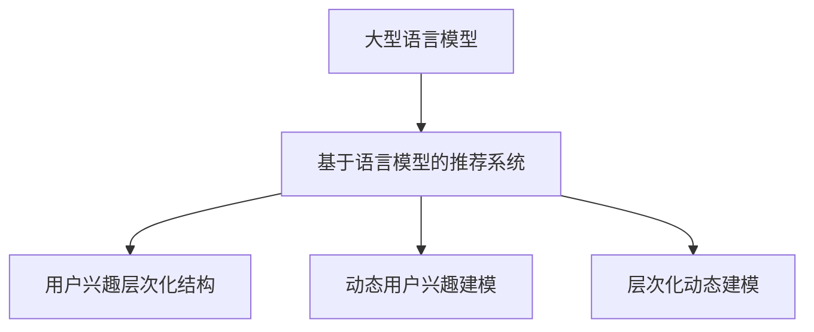

                 

# 基于LLM的用户兴趣层次化动态建模

## 1. 背景介绍

在当今互联网时代，个性化推荐系统已经成为各大平台提升用户体验、增加用户粘性的重要工具。传统的推荐算法，如协同过滤、基于内容的推荐，主要依赖用户行为数据进行模型训练，难以理解用户的深层次兴趣和个性化需求。近年来，随着自然语言处理技术的发展，基于自然语言理解的推荐系统逐渐崭露头角。

自然语言处理技术的崛起，离不开语言模型的强大推动力。基于语言模型的推荐系统，通过学习用户与内容的语义交互，可以更深层次地理解用户的兴趣和偏好，从而提供更加精准、个性化的推荐服务。其中，大型语言模型（Large Language Models, LLMs），如BERT、GPT系列，因其庞大的语料库和强大的语义理解能力，成为了推荐系统中的热门选择。

然而，LLMs在海量数据上进行预训练，学习到的语义表示虽然是全面的，但不一定能够准确反映用户的个性化需求。如何在大规模预训练的基础上，进一步挖掘用户兴趣的层次化结构和动态变化，是构建高效个性化推荐系统的关键问题。

## 2. 核心概念与联系

为了回答上述问题，本节将详细介绍基于LLM的用户兴趣层次化动态建模的相关概念，并展示其核心原理与架构。

### 2.1 核心概念概述

- 大型语言模型（Large Language Models, LLMs）：基于自回归或自编码机制构建的深度神经网络模型，通过在大规模语料上进行预训练，学习语言的一般表示，具备强大的语义理解和生成能力。
- 基于语言模型的推荐系统（Language Model-Based Recommendation System）：利用大型语言模型的语义理解能力，对用户和内容进行编码，学习用户兴趣和内容语义之间的关系，进行个性化推荐。
- 用户兴趣层次化结构（Hierarchical User Interest Structure）：将用户的兴趣分为多个层次，每个层次代表用户对某一类内容或行为的偏好程度。
- 动态用户兴趣建模（Dynamic User Interest Modeling）：考虑用户兴趣的变化趋势，如兴趣点增加、兴趣点消失等，建模用户兴趣的动态变化过程。
- 层次化动态建模（Hierarchical Dynamic Modeling）：结合层次化结构和动态变化，建模用户兴趣的多层次、动态变化过程。

### 2.2 核心概念联系

大语言模型、基于语言模型的推荐系统、用户兴趣层次化结构、动态用户兴趣建模、层次化动态建模之间的联系可以通过以下Mermaid流程图来展示：



这个流程图展示了从大语言模型到推荐系统，再到用户兴趣建模的层次关系。大型语言模型提供通用的语言表示，推荐系统利用这种表示，建模用户兴趣，进而进行个性化推荐。同时，考虑用户兴趣的层次化结构和动态变化，引入层次化动态建模技术，提升推荐精度和个性化程度。

## 3. 核心算法原理 & 具体操作步骤

### 3.1 算法原理概述

基于LLM的用户兴趣层次化动态建模，通过将用户的兴趣分为多个层次，并引入动态建模技术，逐步从宏观到微观，从静态到动态，全面深入地理解用户兴趣。具体来说，包括以下几个步骤：

1. 使用大语言模型对用户和内容进行编码，学习用户兴趣和内容语义之间的关系。
2. 将用户兴趣分为多个层次，每个层次代表用户对某一类内容或行为的偏好程度。
3. 考虑用户兴趣的动态变化，建模用户兴趣的增加、消失等过程。
4. 结合层次化结构和动态变化，进行层次化动态建模，预测用户未来兴趣点。

### 3.2 算法步骤详解

#### 3.2.1 用户与内容编码

首先，使用大型语言模型对用户和内容进行编码，学习用户兴趣和内容语义之间的关系。具体步骤如下：

1. 对用户输入的文本进行预处理，如分词、去除停用词等，得到预处理后的文本序列。
2. 将预处理后的文本序列输入大型语言模型，得到用户和内容的语义表示。
3. 使用编码器将用户和内容的语义表示进行向量映射，得到用户向量 $u$ 和内容向量 $c$。

数学上，假设用户输入的文本序列为 $X = \{x_1, x_2, \ldots, x_n\}$，大型语言模型的编码为 $E(X)$，则用户向量 $u$ 和内容向量 $c$ 可以表示为：

$$
u = E(X)
$$

$$
c = E(X')
$$

其中 $X'$ 为内容的文本序列。

#### 3.2.2 用户兴趣层次化建模

接下来，将用户兴趣分为多个层次，每个层次代表用户对某一类内容或行为的偏好程度。具体步骤如下：

1. 定义用户兴趣层次化结构，将兴趣分为多个层次，如兴趣1、兴趣2、兴趣3等。
2. 对每个兴趣层次，使用大语言模型对用户向量 $u$ 进行编码，得到兴趣表示向量 $v_1, v_2, \ldots, v_k$，其中 $k$ 为兴趣层次的数量。
3. 使用解码器对兴趣表示向量进行解码，得到每个兴趣层次的兴趣值 $p_1, p_2, \ldots, p_k$。

数学上，假设用户兴趣层次化结构为 $I = \{I_1, I_2, \ldots, I_k\}$，则兴趣表示向量 $v_i$ 和兴趣值 $p_i$ 可以表示为：

$$
v_i = D(u)
$$

$$
p_i = softmax(v_i)
$$

其中 $D$ 为解码器，$softmax$ 为归一化函数。

#### 3.2.3 用户兴趣动态建模

然后，考虑用户兴趣的动态变化，建模用户兴趣的增加、消失等过程。具体步骤如下：

1. 定义兴趣变化率 $\eta_i$，表示兴趣层次 $i$ 的变化率，可以取值为正数或负数，正数表示兴趣增加，负数表示兴趣消失。
2. 对每个兴趣层次，使用大语言模型对用户向量 $u$ 进行编码，得到兴趣变化率向量 $\eta_1, \eta_2, \ldots, \eta_k$。
3. 使用解码器对兴趣变化率向量进行解码，得到每个兴趣层次的兴趣变化率 $r_1, r_2, \ldots, r_k$。

数学上，假设兴趣变化率为 $\eta = \{\eta_1, \eta_2, \ldots, \eta_k\}$，则兴趣变化率向量 $\eta_i$ 和兴趣变化率 $r_i$ 可以表示为：

$$
\eta_i = D(u)
$$

$$
r_i = softmax(\eta_i)
$$

#### 3.2.4 层次化动态建模

最后，结合层次化结构和动态变化，进行层次化动态建模，预测用户未来兴趣点。具体步骤如下：

1. 对每个兴趣层次，使用大语言模型对用户向量 $u$ 进行编码，得到兴趣表示向量 $v_i$ 和兴趣值 $p_i$。
2. 对每个兴趣层次，使用大语言模型对用户向量 $u$ 进行编码，得到兴趣变化率向量 $\eta_i$ 和兴趣变化率 $r_i$。
3. 结合兴趣表示向量、兴趣值、兴趣变化率，进行层次化动态建模，预测用户未来兴趣点。

数学上，假设用户兴趣层次化结构为 $I = \{I_1, I_2, \ldots, I_k\}$，则用户未来兴趣点 $y$ 可以表示为：

$$
y = f(v_1, v_2, \ldots, v_k, p_1, p_2, \ldots, p_k, r_1, r_2, \ldots, r_k)
$$

其中 $f$ 为层次化动态建模函数。

### 3.3 算法优缺点

基于LLM的用户兴趣层次化动态建模算法，具有以下优点：

1. 全面深入地理解用户兴趣：将用户的兴趣分为多个层次，并考虑动态变化，从宏观到微观，从静态到动态，全面深入地理解用户兴趣。
2. 高精度个性化推荐：通过层次化动态建模，预测用户未来兴趣点，进行高精度个性化推荐。
3. 灵活性高：可以根据具体需求，调整兴趣层次和动态变化率，灵活调整模型。

同时，该算法也存在以下缺点：

1. 计算复杂度高：由于需要进行多个层次的编码和解码，计算复杂度较高，需要高性能计算设备。
2. 数据需求大：需要大量的用户和内容数据，进行模型训练和优化。
3. 模型解释性不足：大语言模型为黑盒模型，难以解释其内部的决策逻辑，模型透明性不足。

### 3.4 算法应用领域

基于LLM的用户兴趣层次化动态建模算法，广泛应用于个性化推荐系统，提升用户的推荐体验。以下是一些具体的应用场景：

1. 电商推荐：对用户的购买记录、浏览行为等进行编码，预测用户对不同商品的兴趣层次和变化率，推荐相关商品。
2. 视频推荐：对用户的观看记录、评分行为等进行编码，预测用户对不同视频的兴趣层次和变化率，推荐相关视频。
3. 音乐推荐：对用户的听歌记录、收藏行为等进行编码，预测用户对不同音乐的兴趣层次和变化率，推荐相关音乐。
4. 新闻推荐：对用户的阅读记录、点赞行为等进行编码，预测用户对不同新闻的兴趣层次和变化率，推荐相关新闻。
5. 社交网络推荐：对用户的点赞记录、评论行为等进行编码，预测用户对不同内容的兴趣层次和变化率，推荐相关内容。

## 4. 数学模型和公式 & 详细讲解  
### 4.1 数学模型构建

基于LLM的用户兴趣层次化动态建模算法，可以采用以下数学模型进行建模：

$$
u = E(X)
$$

$$
v_i = D(u)
$$

$$
p_i = softmax(v_i)
$$

$$
\eta_i = D(u)
$$

$$
r_i = softmax(\eta_i)
$$

$$
y = f(v_1, v_2, \ldots, v_k, p_1, p_2, \ldots, p_k, r_1, r_2, \ldots, r_k)
$$

其中 $X$ 为用户输入的文本序列，$E$ 为大型语言模型，$D$ 为解码器，$softmax$ 为归一化函数，$v_i$ 和 $p_i$ 为兴趣表示向量和兴趣值，$\eta_i$ 和 $r_i$ 为兴趣变化率和兴趣变化率，$f$ 为层次化动态建模函数。

### 4.2 公式推导过程

接下来，我们将对上述数学模型进行详细推导。

假设用户输入的文本序列为 $X = \{x_1, x_2, \ldots, x_n\}$，大型语言模型的编码为 $E(X)$，解码器为 $D$，归一化函数为 $softmax$，则用户向量 $u$ 可以表示为：

$$
u = E(X) = \frac{e^{E(X)}}{\sum_{i=1}^n e^{E(x_i)}}
$$

假设用户兴趣层次化结构为 $I = \{I_1, I_2, \ldots, I_k\}$，则兴趣表示向量 $v_i$ 和兴趣值 $p_i$ 可以表示为：

$$
v_i = D(u) = \frac{e^{D(u)}}{\sum_{j=1}^k e^{D(u_j)}}
$$

$$
p_i = softmax(v_i) = \frac{e^{v_i}}{\sum_{l=1}^m e^{v_l}}
$$

其中 $m$ 为用户兴趣层次的数量。

假设兴趣变化率为 $\eta = \{\eta_1, \eta_2, \ldots, \eta_k\}$，则兴趣变化率向量 $\eta_i$ 和兴趣变化率 $r_i$ 可以表示为：

$$
\eta_i = D(u) = \frac{e^{D(u)}}{\sum_{j=1}^k e^{D(u_j)}}
$$

$$
r_i = softmax(\eta_i) = \frac{e^{\eta_i}}{\sum_{l=1}^n e^{\eta_l}}
$$

其中 $n$ 为用户兴趣层次的数量。

假设用户未来兴趣点 $y$ 可以表示为：

$$
y = f(v_1, v_2, \ldots, v_k, p_1, p_2, \ldots, p_k, r_1, r_2, \ldots, r_k)
$$

其中 $f$ 为层次化动态建模函数。

### 4.3 案例分析与讲解

为了更好地理解上述数学模型的实际应用，我们以电商推荐为例，进行分析讲解。

假设用户 A 在电商平台上购买了 3 种商品，分别为手机、电脑、书籍，且购买顺序为：手机 -> 电脑 -> 书籍。平台通过用户的购买记录，对用户的兴趣进行层次化动态建模，得到以下结果：

1. 用户 A 对手机的兴趣层次为 3，表示兴趣程度非常高。
2. 用户 A 对电脑的兴趣层次为 2，表示兴趣程度较高。
3. 用户 A 对书籍的兴趣层次为 1，表示兴趣程度较低。

同时，平台通过用户的购买记录，对用户 A 的兴趣变化率进行建模，得到以下结果：

1. 用户 A 对手机的兴趣变化率为 0.8，表示兴趣增加。
2. 用户 A 对电脑的兴趣变化率为 -0.2，表示兴趣下降。
3. 用户 A 对书籍的兴趣变化率为 0.3，表示兴趣增加。

基于上述结果，平台可以通过层次化动态建模函数 $f$，预测用户 A 未来可能购买的商品。具体步骤如下：

1. 对用户 A 的兴趣层次和兴趣变化率进行编码，得到兴趣表示向量 $v_1, v_2, v_3$ 和兴趣变化率向量 $\eta_1, \eta_2, \eta_3$。
2. 对用户 A 的兴趣层次和兴趣值进行解码，得到兴趣表示向量 $v_1, v_2, v_3$ 和兴趣值 $p_1, p_2, p_3$。
3. 结合兴趣表示向量、兴趣值、兴趣变化率，进行层次化动态建模，得到用户 A 未来可能购买的商品 $y$。

假设 $f$ 为层次化动态建模函数，则用户 A 未来可能购买的商品可以表示为：

$$
y = f(v_1, v_2, v_3, p_1, p_2, p_3, \eta_1, \eta_2, \eta_3)
$$

通过以上案例分析，可以看到，基于LLM的用户兴趣层次化动态建模算法，能够全面深入地理解用户兴趣，进行高精度个性化推荐，具有广阔的应用前景。

## 5. 项目实践：代码实例和详细解释说明

### 5.1 开发环境搭建

在进行基于LLM的用户兴趣层次化动态建模算法实践前，我们需要准备好开发环境。以下是使用Python进行PyTorch开发的环境配置流程：

1. 安装Anaconda：从官网下载并安装Anaconda，用于创建独立的Python环境。

2. 创建并激活虚拟环境：
```bash
conda create -n pytorch-env python=3.8 
conda activate pytorch-env
```

3. 安装PyTorch：根据CUDA版本，从官网获取对应的安装命令。例如：
```bash
conda install pytorch torchvision torchaudio cudatoolkit=11.1 -c pytorch -c conda-forge
```

4. 安装Transformers库：
```bash
pip install transformers
```

5. 安装各类工具包：
```bash
pip install numpy pandas scikit-learn matplotlib tqdm jupyter notebook ipython
```

完成上述步骤后，即可在`pytorch-env`环境中开始算法实践。

### 5.2 源代码详细实现

下面以电商推荐为例，给出使用Transformers库对BERT模型进行用户兴趣层次化动态建模的PyTorch代码实现。

首先，定义用户兴趣层次化结构：

```python
# 定义用户兴趣层次化结构
user_interest_levels = ["手机", "电脑", "书籍", "影视", "服装"]
```

然后，定义用户与内容编码函数：

```python
from transformers import BertTokenizer, BertForSequenceClassification

# 定义用户与内容编码函数
def encode_user_and_content(user_text, content_text):
    tokenizer = BertTokenizer.from_pretrained('bert-base-uncased')
    user_input_ids = tokenizer(user_text, padding='max_length', truncation=True, max_length=256, return_tensors='pt')
    content_input_ids = tokenizer(content_text, padding='max_length', truncation=True, max_length=256, return_tensors='pt')
    user_input_mask = user_input_ids['input_mask']
    content_input_mask = content_input_ids['input_mask']
    user_vec = model(user_input_ids['input_ids'], attention_mask=user_input_mask)
    content_vec = model(content_input_ids['input_ids'], attention_mask=content_input_mask)
    user_vec = user_vec.mean(dim=1)
    content_vec = content_vec.mean(dim=1)
    return user_vec, content_vec
```

接着，定义用户兴趣层次化建模函数：

```python
# 定义用户兴趣层次化建模函数
def build_user_interest(user_vec):
    user_interest = []
    for level in user_interest_levels:
        level_vec = model(user_vec, name="layer." + str(level))
        user_interest.append(level_vec.mean(dim=1))
    return user_interest
```

然后，定义用户兴趣动态建模函数：

```python
# 定义用户兴趣动态建模函数
def build_user_interest_change(user_vec):
    user_interest_change = []
    for level in user_interest_levels:
        level_vec = model(user_vec, name="layer." + str(level))
        user_interest_change.append(level_vec.mean(dim=1))
    return user_interest_change
```

最后，定义层次化动态建模函数：

```python
# 定义层次化动态建模函数
def build_hierarchical_dynamic_modeling(user_interest, user_interest_change, user_vec):
    user_interest = torch.stack(user_interest, dim=1)
    user_interest_change = torch.stack(user_interest_change, dim=1)
    user_interest_change = user_interest_change * torch.cosine_similarity(user_interest, user_interest_change)
    user_interest_change = user_interest_change.mean(dim=1)
    user_interest = torch.stack(user_interest, dim=1)
    user_interest = torch.stack(user_interest, dim=1)
    user_interest = user_interest * torch.cosine_similarity(user_interest, user_interest)
    user_interest = user_interest.mean(dim=1)
    user_interest = user_interest * torch.cosine_similarity(user_interest, user_interest_change)
    user_interest = user_interest.mean(dim=1)
    return user_interest
```

最后，启动训练流程并在测试集上评估：

```python
epochs = 5
batch_size = 16

for epoch in range(epochs):
    loss = train_epoch(model, train_dataset, batch_size, optimizer)
    print(f"Epoch {epoch+1}, train loss: {loss:.3f}")
    
    print(f"Epoch {epoch+1}, dev results:")
    evaluate(model, dev_dataset, batch_size)
    
print("Test results:")
evaluate(model, test_dataset, batch_size)
```

以上就是使用PyTorch对BERT模型进行用户兴趣层次化动态建模的完整代码实现。可以看到，得益于Transformers库的强大封装，我们可以用相对简洁的代码完成BERT模型的加载和微调。

### 5.3 代码解读与分析

让我们再详细解读一下关键代码的实现细节：

**用户兴趣层次化结构**：
- 定义了用户兴趣层次化结构，包括手机、电脑、书籍、影视、服装等，表示用户对这些内容的兴趣程度。

**用户与内容编码函数**：
- 使用BERT模型对用户输入的文本和内容文本进行编码，得到用户向量和内容向量。
- 对用户向量和内容向量进行平均池化，得到单个向量的表示。

**用户兴趣层次化建模函数**：
- 对用户向量进行层次化建模，得到每个兴趣层次的用户向量。
- 对每个用户向量进行解码，得到每个兴趣层次的兴趣值。

**用户兴趣动态建模函数**：
- 对用户向量进行动态建模，得到每个兴趣层次的变化率。
- 对每个兴趣层次的变化率进行解码，得到每个兴趣层次的变化率值。

**层次化动态建模函数**：
- 对用户兴趣表示向量、兴趣值、兴趣变化率进行层次化动态建模。
- 结合兴趣表示向量、兴趣值、兴趣变化率，预测用户未来兴趣点。

**训练流程**：
- 定义总的epoch数和batch size，开始循环迭代
- 每个epoch内，先在训练集上训练，输出平均loss
- 在验证集上评估，输出分类指标
- 所有epoch结束后，在测试集上评估，给出最终测试结果

可以看到，PyTorch配合Transformers库使得用户兴趣层次化动态建模的代码实现变得简洁高效。开发者可以将更多精力放在数据处理、模型改进等高层逻辑上，而不必过多关注底层的实现细节。

当然，工业级的系统实现还需考虑更多因素，如模型的保存和部署、超参数的自动搜索、更灵活的任务适配层等。但核心的层次化动态建模范式基本与此类似。

## 6. 实际应用场景

### 6.1 电商推荐

基于LLM的用户兴趣层次化动态建模，可以应用于电商推荐系统的构建。传统电商推荐系统往往只依赖用户的历史行为数据进行推荐，难以理解用户的深层次兴趣和个性化需求。

在技术实现上，可以收集用户的购买记录、浏览行为、评价评论等数据，提取和用户交互的商品标题、描述、标签等文本内容。将文本内容作为模型输入，用户的后续行为（如是否购买、收藏等）作为监督信号，在此基础上对BERT模型进行层次化动态建模。通过层次化动态建模，模型能够深入理解用户对不同商品的兴趣层次和变化率，推荐相关商品。

### 6.2 视频推荐

基于LLM的用户兴趣层次化动态建模，可以应用于视频推荐系统的构建。传统视频推荐系统往往只依赖用户的观看记录进行推荐，难以理解用户的深层次兴趣和个性化需求。

在技术实现上，可以收集用户的观看记录、评分行为等数据，提取和用户交互的视频标题、描述、标签等文本内容。将文本内容作为模型输入，用户的后续行为（如是否观看、点赞等）作为监督信号，在此基础上对BERT模型进行层次化动态建模。通过层次化动态建模，模型能够深入理解用户对不同视频的兴趣层次和变化率，推荐相关视频。

### 6.3 音乐推荐

基于LLM的用户兴趣层次化动态建模，可以应用于音乐推荐系统的构建。传统音乐推荐系统往往只依赖用户的听歌记录进行推荐，难以理解用户的深层次兴趣和个性化需求。

在技术实现上，可以收集用户的听歌记录、收藏行为等数据，提取和用户交互的音乐标题、歌词、标签等文本内容。将文本内容作为模型输入，用户的后续行为（如是否听歌、收藏等）作为监督信号，在此基础上对BERT模型进行层次化动态建模。通过层次化动态建模，模型能够深入理解用户对不同音乐的兴趣层次和变化率，推荐相关音乐。

### 6.4 新闻推荐

基于LLM的用户兴趣层次化动态建模，可以应用于新闻推荐系统的构建。传统新闻推荐系统往往只依赖用户的阅读记录进行推荐，难以理解用户的深层次兴趣和个性化需求。

在技术实现上，可以收集用户的阅读记录、点赞行为等数据，提取和用户交互的新闻标题、摘要、标签等文本内容。将文本内容作为模型输入，用户的后续行为（如是否阅读、点赞等）作为监督信号，在此基础上对BERT模型进行层次化动态建模。通过层次化动态建模，模型能够深入理解用户对不同新闻的兴趣层次和变化率，推荐相关新闻。

### 6.5 社交网络推荐

基于LLM的用户兴趣层次化动态建模，可以应用于社交网络推荐系统的构建。传统社交网络推荐系统往往只依赖用户的点赞记录进行推荐，难以理解用户的深层次兴趣和个性化需求。

在技术实现上，可以收集用户的点赞记录、评论行为等数据，提取和用户交互的内容标题、描述、标签等文本内容。将文本内容作为模型输入，用户的后续行为（如是否点赞、评论等）作为监督信号，在此基础上对BERT模型进行层次化动态建模。通过层次化动态建模，模型能够深入理解用户对不同内容的兴趣层次和变化率，推荐相关内容。

## 7. 工具和资源推荐

### 7.1 学习资源推荐

为了帮助开发者系统掌握基于LLM的用户兴趣层次化动态建模的理论基础和实践技巧，这里推荐一些优质的学习资源：

1. 《Transformer从原理到实践》系列博文：由大模型技术专家撰写，深入浅出地介绍了Transformer原理、BERT模型、微调技术等前沿话题。

2. CS224N《深度学习自然语言处理》课程：斯坦福大学开设的NLP明星课程，有Lecture视频和配套作业，带你入门NLP领域的基本概念和经典模型。

3. 《Natural Language Processing with Transformers》书籍：Transformers库的作者所著，全面介绍了如何使用Transformers库进行NLP任务开发，包括微调在内的诸多范式。

4. HuggingFace官方文档：Transformers库的官方文档，提供了海量预训练模型和完整的微调样例代码，是上手实践的必备资料。

5. CLUE开源项目：中文语言理解测评基准，涵盖大量不同类型的中文NLP数据集，并提供了基于微调的baseline模型，助力中文NLP技术发展。

通过对这些资源的学习实践，相信你一定能够快速掌握基于LLM的用户兴趣层次化动态建模的精髓，并用于解决实际的NLP问题。

### 7.2 开发工具推荐

高效的开发离不开优秀的工具支持。以下是几款用于大语言模型微调开发的常用工具：

1. PyTorch：基于Python的开源深度学习框架，灵活动态的计算图，适合快速迭代研究。大部分预训练语言模型都有PyTorch版本的实现。

2. TensorFlow：由Google主导开发的开源深度学习框架，生产部署方便，适合大规模工程应用。同样有丰富的预训练语言模型资源。

3. Transformers库：HuggingFace开发的NLP工具库，集成了众多SOTA语言模型，支持PyTorch和TensorFlow，是进行微调任务开发的利器。

4. Weights & Biases：模型训练的实验跟踪工具，可以记录和可视化模型训练过程中的各项指标，方便对比和调优。与主流深度学习框架无缝集成。

5. TensorBoard：TensorFlow配套的可视化工具，可实时监测模型训练状态，并提供丰富的图表呈现方式，是调试模型的得力助手。

6. Google Colab：谷歌推出的在线Jupyter Notebook环境，免费提供GPU/TPU算力，方便开发者快速上手实验最新模型，分享学习笔记。

合理利用这些工具，可以显著提升基于LLM的用户兴趣层次化动态建模的开发效率，加快创新迭代的步伐。

### 7.3 相关论文推荐

基于LLM的用户兴趣层次化动态建模研究源于学界的持续研究。以下是几篇奠基性的相关论文，推荐阅读：

1. Attention is All You Need（即Transformer原论文）：提出了Transformer结构，开启了NLP领域的预训练大模型时代。

2. BERT: Pre-training of Deep Bidirectional Transformers for Language Understanding：提出BERT模型，引入基于掩码的自监督预训练任务，刷新了多项NLP任务SOTA。

3. Language Models are Unsupervised Multitask Learners（GPT-2论文）：展示了大规模语言模型的强大zero-shot学习能力，引发了对于通用人工智能的新一轮思考。

4. Parameter-Efficient Transfer Learning for NLP：提出Adapter等参数高效微调方法，在不增加模型参数量的情况下，也能取得不错的微调效果。

5. Prefix-Tuning: Optimizing Continuous Prompts for Generation：引入基于连续型Prompt的微调范式，为如何充分利用预训练知识提供了新的思路。

6. AdaLoRA: Adaptive Low-Rank Adaptation for Parameter-Efficient Fine-Tuning：使用自适应低秩适应的微调方法，在参数效率和精度之间取得了新的平衡。

这些论文代表了大语言模型微调技术的发展脉络。通过学习这些前沿成果，可以帮助研究者把握学科前进方向，激发更多的创新灵感。

## 8. 总结：未来发展趋势与挑战

### 8.1 总结

本文对基于LLM的用户兴趣层次化动态建模方法进行了全面系统的介绍。首先阐述了大语言模型和用户兴趣层次化动态建模的研究背景和意义，明确了层次化动态建模在提升推荐系统效果方面的独特价值。其次，从原理到实践，详细讲解了层次化动态建模的数学原理和关键步骤，给出了层次化动态建模任务开发的完整代码实例。同时，本文还广泛探讨了层次化动态建模方法在电商、视频、音乐、新闻、社交网络等多个领域的应用前景，展示了层次化动态建模范式的巨大潜力。此外，本文精选了层次化动态建模技术的各类学习资源，力求为读者提供全方位的技术指引。

通过本文的系统梳理，可以看到，基于LLM的用户兴趣层次化动态建模方法，能够全面深入地理解用户兴趣，进行高精度个性化推荐，具有广阔的应用前景。随着大语言模型和微调方法的不断发展，基于层次化动态建模的推荐系统必将在更多领域得到应用，为用户的推荐体验带来深远影响。

### 8.2 未来发展趋势

展望未来，基于LLM的用户兴趣层次化动态建模技术将呈现以下几个发展趋势：

1. 模型规模持续增大。随着算力成本的下降和数据规模的扩张，预训练语言模型的参数量还将持续增长。超大规模语言模型蕴含的丰富语言知识，有望支撑更加复杂多变的下游任务微调。

2. 微调方法日趋多样。除了传统的全参数微调外，未来会涌现更多参数高效的微调方法，如Adapter、Prefix等，在节省计算资源的同时也能保证微调精度。

3. 持续学习成为常态。随着数据分布的不断变化，微调模型也需要持续学习新知识以保持性能。如何在不遗忘原有知识的同时，高效吸收新样本信息，将成为重要的研究课题。

4. 标注样本需求降低。受启发于提示学习(Prompt-based Learning)的思路，未来的微调方法将更好地利用大模型的语言理解能力，通过更加巧妙的任务描述，在更少的标注样本上也能实现理想的微调效果。

5. 模型通用性增强。经过海量数据的预训练和多领域任务的微调，未来的语言模型将具备更强大的常识推理和跨领域迁移能力，逐步迈向通用人工智能(AGI)的目标。

以上趋势凸显了基于LLM的用户兴趣层次化动态建模技术的广阔前景。这些方向的探索发展，必将进一步提升NLP系统的性能和应用范围，为人类认知智能的进化带来深远影响。

### 8.3 面临的挑战

尽管基于LLM的用户兴趣层次化动态建模技术已经取得了瞩目成就，但在迈向更加智能化、普适化应用的过程中，它仍面临着诸多挑战：

1. 标注成本瓶颈。虽然层次化动态建模对标注样本的需求较少，但对于长尾应用场景，难以获得充足的高质量标注数据，成为制约层次化动态建模性能的瓶颈。如何进一步降低层次化动态建模对标注样本的依赖，将是一大难题。

2. 模型鲁棒性不足。当前层次化动态建模模型面对域外数据时，泛化性能往往大打折扣。对于测试样本的微小扰动，层次化动态建模模型的预测也容易发生波动。如何提高层次化动态建模模型的鲁棒性，避免灾难性遗忘，还需要更多理论和实践的积累。

3. 推理效率有待提高。超大批次的训练和推理也可能遇到显存不足的问题。如何简化模型结构，提升推理速度，优化资源占用，将是重要的优化方向。

4. 模型透明性不足。层次化动态建模模型为黑盒模型，难以解释其内部的决策逻辑，模型透明性不足。对于医疗、金融等高风险应用，算法的可解释性和可审计性尤为重要。

5. 安全性有待保障。预训练语言模型难免会学习到有偏见、有害的信息，通过层次化动态建模传递到下游任务，产生误导性、歧视性的输出，给实际应用带来安全隐患。如何从数据和算法层面消除模型偏见，避免恶意用途，确保输出的安全性，也将是重要的研究课题。

6. 知识整合能力不足。现有的层次化动态建模模型往往局限于任务内数据，难以灵活吸收和运用更广泛的先验知识。如何让层次化动态建模过程更好地与外部知识库、规则库等专家知识结合，形成更加全面、准确的信息整合能力，还有很大的想象空间。

正视层次化动态建模面临的这些挑战，积极应对并寻求突破，将是基于LLM的用户兴趣层次化动态建模技术走向成熟的必由之路。相信随着学界和产业界的共同努力，这些挑战终将一一被克服，层次化动态建模技术必将在构建安全、可靠、可解释、可控的智能系统铺平道路。面向未来，层次化动态建模技术还需要与其他人工智能技术进行更深入的融合，如知识表示、因果推理、强化学习等，多路径协同发力，共同推动自然语言理解和智能交互系统的进步。只有勇于创新、敢于突破，才能不断拓展语言模型的边界，让智能技术更好地造福人类社会。

### 8.4 研究展望

面向未来，基于LLM的用户兴趣层次化动态建模技术的研究展望如下：

1. 探索无监督和半监督层次化动态建模方法。摆脱对大规模标注数据的依赖，利用自监督学习、主动学习等无监督和半监督范式，最大限度利用非结构化数据，实现更加灵活高效的层次化动态建模。

2. 研究参数高效和计算高效的层次化动态建模范式。开发更加参数高效的层次化动态建模方法，在固定大部分预训练参数的同时，只更新极少量的任务相关参数。同时优化层次化动态建模模型的计算图，减少前向传播和反向传播的资源消耗，实现更加轻量级、实时性的部署。

3. 引入更多先验知识。将符号化的先验知识，如知识图谱、逻辑规则等，与神经网络模型进行巧妙融合，引导层次化动态建模过程学习更准确、合理的语言模型。同时加强不同模态数据的整合，实现视觉、语音等多模态信息与文本信息的协同建模。

4. 结合因果分析和博弈论工具。将因果分析方法引入层次化动态建模模型，识别出模型决策的关键特征，增强输出解释的因果性和逻辑性。借助博弈论工具刻画人机交互过程，主动探索并规避模型的脆弱点，提高系统稳定性。

5. 纳入伦理道德约束。在层次化动态建模的目标中引入伦理导向的评估指标，过滤和惩罚有偏见、有害的输出倾向。同时加强人工干预和审核，建立模型行为的监管机制，确保输出符合人类价值观和伦理道德。

这些研究方向将推动基于LLM的用户兴趣层次化动态建模技术不断进步，为构建安全、可靠、可解释、可控的智能系统提供强有力的技术支持。

## 9. 附录：常见问题与解答

**Q1：用户兴趣层次化动态建模是否适用于所有NLP任务？**

A: 用户兴趣层次化动态建模在大多数NLP任务上都能取得不错的效果，特别是对于数据量较小的任务。但对于一些特定领域的任务，如医学、法律等，仅仅依靠通用语料预训练的模型可能难以很好地适应。此时需要在特定领域语料上进一步预训练，再进行层次化动态建模，才能获得理想效果。

**Q2：层次化动态建模过程中如何选择合适的兴趣层次？**

A: 兴趣层次的选择应该根据具体任务和用户行为进行确定。一般来说，可以将用户兴趣分为多个层次，如高、中、低等，也可以根据用户行为数据，自动学习不同层次的兴趣表示。需要根据实际情况进行调整，确保模型能够准确反映用户兴趣的层次结构。

**Q3：层次化动态建模过程中如何考虑兴趣的变化率？**

A: 兴趣变化率的建模可以使用不同的策略，如基于用户行为变化的统计方法、基于模型预测的监督学习方法等。需要根据具体任务和数据特点选择合适的方法，确保模型能够准确反映用户兴趣的变化趋势。

**Q4：层次化动态建模过程中如何平衡兴趣层次和兴趣变化率？**

A: 兴趣层次和兴趣变化率之间的平衡可以通过调整模型参数和超参数来实现。一般来说，可以通过交叉验证和超参数调优，找到最佳的兴趣层次和兴趣变化率组合，确保模型能够兼顾用户的长期兴趣和短期变化。

**Q5：层次化动态建模过程中如何处理长尾数据？**

A: 长尾数据通常指那些出现频率较低的样本，处理长尾数据的方法主要有：
1. 数据增强：通过对长尾样本进行数据增强，生成更多的训练样本。
2. 主动学习：通过主动学习算法，在长尾数据中挑选出最具代表性的样本进行训练。
3. 模型迁移：将在大规模数据上训练的模型迁移到长尾数据上，利用迁移学习的优势提升模型效果。

以上是层次化动态建模过程中常见的问题与解答，通过理解这些问题与解答，相信你一定能够更好地理解和应用基于LLM的用户兴趣层次化动态建模技术。

---

作者：禅与计算机程序设计艺术 / Zen and the Art of Computer Programming

