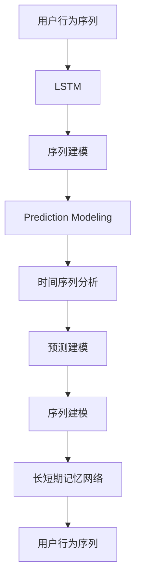
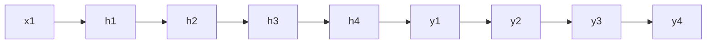

                 

# 基于LLM的用户行为序列建模与预测

> 关键词：用户行为, 序列建模, 长短期记忆网络(LSTM), 自然语言处理(NLP), 机器学习, 预测模型

## 1. 背景介绍

### 1.1 问题由来
在互联网时代，用户行为数据成为了企业和组织理解用户需求、优化产品体验和提升商业价值的宝贵资产。通过分析用户的行为序列，可以揭示用户的兴趣偏好、购买决策等关键信息，从而实现个性化推荐、广告投放、用户画像构建等功能。然而，用户行为数据往往具有高维、稀疏、时变等特点，且不同行为之间存在复杂的关联关系，因此对其建模和预测是一项挑战性任务。

传统的用户行为建模方法，如协同过滤、关联规则挖掘等，虽然能够处理大规模数据，但由于缺乏时序信息建模能力，难以捕捉行为序列的时间依赖性。相比之下，基于深度学习的用户行为序列建模方法，如循环神经网络(RNN)和长短期记忆网络(LSTM)，能够自然地处理时序数据，并在多个NLP和推荐系统中得到了应用。

## 2. 核心概念与联系

### 2.1 核心概念概述

为更好地理解基于LLM的用户行为序列建模方法，本节将介绍几个关键概念：

- 用户行为序列(User Behavior Sequence)：用户在使用产品或服务过程中，一系列连续的行为记录，如浏览、点击、购买、评分等。通过序列建模，可以发现用户行为的时间依赖性和模式变化。

- 长短期记忆网络(Long Short-Term Memory, LSTM)：一种特殊的递归神经网络(RNN)，能够捕捉长期依赖性，同时保留短期记忆，非常适合处理序列数据，如文本、语音、时间序列等。

- 序列建模(Sequence Modeling)：指对序列数据进行建模，以发现其时序规律和特征关联，广泛应用于语音识别、自然语言处理、机器翻译等领域。

- 预测建模(Prediction Modeling)：指对已知数据进行建模，以预测未来数据。在用户行为分析中，通常通过序列建模生成预测模型，用于预测用户后续行为、用户转化、点击率等。

- 时间序列分析(Time Series Analysis)：指对时间序列数据进行建模和预测，分析其趋势、周期和季节性等特征，广泛应用于金融、气象、交通等领域。

这些概念之间的逻辑关系可以通过以下Mermaid流程图来展示：



这个流程图展示了用户行为序列从原始数据到预测模型的完整建模过程：

1. 原始的用户行为数据被转化为序列数据。
2. 序列数据通过LSTM建模，提取时序特征。
3. 建模得到的序列数据进一步进行预测建模，生成预测模型。
4. 预测模型可以进一步应用于时间序列分析，增强预测效果。

## 3. 核心算法原理 & 具体操作步骤

### 3.1 算法原理概述

基于LLM的用户行为序列建模与预测，本质上是一个序列预测任务，通过LSTM模型对用户行为序列进行建模，并利用预测模型对未来行为进行预测。具体来说，算法分为以下两个步骤：

1. **序列建模**：使用LSTM模型对用户行为序列进行建模，学习到序列中的时序依赖性和特征关联。
2. **预测建模**：基于序列建模的结果，构建预测模型，对用户未来行为进行预测。

### 3.2 算法步骤详解

#### 3.2.1 数据准备

**Step 1: 数据收集和预处理**
- 收集用户的行为数据，包括点击、浏览、购买、评分等记录。
- 对数据进行清洗和标注，如去除异常数据、处理缺失值、进行时间戳对齐等。
- 将行为数据转化为序列形式，每个序列包含若干个行为事件。

**Step 2: 数据划分**
- 将数据集划分为训练集、验证集和测试集。一般要求训练集和测试集的分布一致，以评估模型泛化能力。

#### 3.2.2 模型训练

**Step 3: 搭建LSTM模型**
- 选择合适的LSTM模型结构，包括输入层、隐藏层、输出层等组件。
- 设置LSTM模型的超参数，如隐藏层大小、学习率、批大小等。

**Step 4: 训练LSTM模型**
- 使用训练集数据，对LSTM模型进行前向传播和反向传播训练。
- 周期性在验证集上评估模型性能，根据性能指标调整超参数。
- 重复上述步骤直至满足预设的迭代轮数或性能指标。

#### 3.2.3 预测建模

**Step 5: 构建预测模型**
- 根据预测任务的类型，选择合适的预测模型。
- 对于分类任务，通常使用Softmax层输出概率分布。
- 对于回归任务，通常使用全连接层输出连续值。

**Step 6: 预测未来行为**
- 使用测试集数据，对LSTM模型进行预测。
- 在预测得到的序列上，利用预测模型输出未来行为的概率分布或具体值。

#### 3.2.4 模型评估

**Step 7: 评估预测效果**
- 使用测试集数据，计算预测模型在分类、回归等任务上的性能指标，如准确率、召回率、MAE等。
- 评估LSTM模型的时序预测能力，如均方误差(MSE)、MAE等。

**Step 8: 调整模型**
- 根据评估结果，调整LSTM模型和预测模型的参数，提升预测性能。

### 3.3 算法优缺点

基于LLM的用户行为序列建模与预测方法具有以下优点：
1. 时序建模能力强：LSTM能够捕捉序列中的长期依赖性，适用于多种用户行为序列的建模。
2. 可扩展性强：LSTM可以并行计算，适用于大规模数据集和复杂模型。
3. 泛化能力强：通过预训练和微调，LSTM模型能够在不同用户群体和行为类型上实现较好的泛化。

同时，该方法也存在一定的局限性：
1. 数据依赖度高：LSTM模型依赖于高质量标注数据，获取标注数据的成本较高。
2. 模型复杂度高：LSTM模型参数较多，训练和推理效率较低。
3. 过拟合风险高：由于序列数据的高维性和复杂性，LSTM模型容易过拟合，需要采取正则化等措施。
4. 可解释性不足：LSTM模型是"黑盒"系统，难以解释其内部工作机制和推理逻辑。

尽管存在这些局限性，但就目前而言，基于LLM的用户行为序列建模与预测方法仍是大数据时代用户行为分析的主流范式。未来相关研究的重点在于如何进一步降低对标注数据的依赖，提高模型的可解释性和泛化能力。

### 3.4 算法应用领域

基于LLM的用户行为序列建模与预测方法，广泛应用于以下领域：

- 个性化推荐系统：对用户的历史行为数据进行建模，预测其后续行为，提供个性化推荐。
- 广告投放优化：根据用户的行为序列预测其广告响应率，优化广告投放策略。
- 用户行为分析：分析用户在产品或服务中的行为模式，构建用户画像。
- 用户流失预测：预测用户流失的可能性，及时采取措施进行干预。
- 客户服务优化：根据用户历史对话记录预测其后续需求，提升客户服务质量。

除了上述这些经典应用外，LLM在金融风险控制、医疗健康、电商营销等更多领域也得到了创新性应用，为各类企业带来了新的价值增长点。

## 4. 数学模型和公式 & 详细讲解 & 举例说明

### 4.1 数学模型构建

本节将使用数学语言对基于LLM的用户行为序列建模方法进行更加严格的刻画。

记用户行为序列为 $X=\{x_1, x_2, ..., x_T\}$，其中 $x_t$ 表示用户在第 $t$ 个时间步的行为，如浏览、点击、购买等。LSTM模型 $M_{\theta}$ 由多个隐含层组成，每个隐含层 $h_t$ 表示用户在第 $t$ 个时间步的状态，$y_t$ 表示用户在第 $t$ 个时间步的预测输出，如图1所示。



图1: LSTM模型结构示意图

定义LSTM模型的损失函数为 $\mathcal{L}(\theta)$，用于衡量预测输出 $y_t$ 与真实标签 $y^*_t$ 之间的差异。通常使用交叉熵损失函数，即：

$$
\mathcal{L}(\theta) = -\frac{1}{N}\sum_{i=1}^N \sum_{t=1}^T \sum_{c=1}^C y^*_{itc} \log \hat{y}_{itc}
$$

其中 $y^*_{itc}$ 为第 $i$ 个样本在第 $t$ 个时间步的真实标签，$\hat{y}_{itc}$ 为模型预测的输出。

### 4.2 公式推导过程

以分类任务为例，推导LSTM模型的交叉熵损失函数及其梯度的计算公式。

定义LSTM模型在输入 $x_t$ 上的输出为 $\hat{y}_t=M_{\theta}(x_t) \in [0,1]$，表示样本属于某一类别的概率。真实标签 $y_t \in \{0,1\}$。则分类交叉熵损失函数定义为：

$$
\ell(M_{\theta}(x),y) = -[y\log \hat{y} + (1-y)\log (1-\hat{y})]
$$

将其代入经验风险公式，得：

$$
\mathcal{L}(\theta) = -\frac{1}{N}\sum_{i=1}^N \sum_{t=1}^T \sum_{c=1}^C y^*_{itc} \log \hat{y}_{itc}
$$

根据链式法则，损失函数对模型参数 $\theta$ 的梯度为：

$$
\frac{\partial \mathcal{L}(\theta)}{\partial \theta} = \sum_{i=1}^N \sum_{t=1}^T \sum_{c=1}^C \frac{\partial \ell(M_{\theta}(x),y)}{\partial \theta}
$$

将 $\ell(M_{\theta}(x),y)$ 代入上式，并展开计算，得：

$$
\frac{\partial \mathcal{L}(\theta)}{\partial \theta} = -\frac{1}{N}\sum_{i=1}^N \sum_{t=1}^T \sum_{c=1}^C y^*_{itc} \frac{\partial \log \hat{y}_{itc}}{\partial \theta}
$$

在得到损失函数的梯度后，即可带入优化算法，如AdamW等，完成模型的迭代优化。重复上述过程直至收敛，最终得到适应用户行为序列的最优模型参数 $\theta^*$。

### 4.3 案例分析与讲解

假设某电商平台的点击记录为 $\{x_1, x_2, ..., x_T\}$，其中 $x_t$ 表示用户在第 $t$ 次浏览的网页ID。LSTM模型由3层LSTM组成，每层512个隐藏单元，学习率为0.001。对于每个网页ID，构建二分类任务，预测用户是否会购买该产品。

定义损失函数为交叉熵损失函数，使用AdamW优化器进行训练。在训练过程中，周期性在验证集上评估模型性能，调整学习率和学习率衰减策略。最终在测试集上计算分类准确率和召回率。

## 5. 项目实践：代码实例和详细解释说明

### 5.1 开发环境搭建

在进行用户行为序列建模与预测实践前，我们需要准备好开发环境。以下是使用Python进行PyTorch开发的环境配置流程：

1. 安装Anaconda：从官网下载并安装Anaconda，用于创建独立的Python环境。

2. 创建并激活虚拟环境：
```bash
conda create -n pytorch-env python=3.8 
conda activate pytorch-env
```

3. 安装PyTorch：根据CUDA版本，从官网获取对应的安装命令。例如：
```bash
conda install pytorch torchvision torchaudio cudatoolkit=11.1 -c pytorch -c conda-forge
```

4. 安装Transformers库：
```bash
pip install transformers
```

5. 安装各类工具包：
```bash
pip install numpy pandas scikit-learn matplotlib tqdm jupyter notebook ipython
```

完成上述步骤后，即可在`pytorch-env`环境中开始微调实践。

### 5.2 源代码详细实现

下面以电商点击行为序列预测为例，给出使用Transformers库对LSTM模型进行训练的PyTorch代码实现。

首先，定义数据处理函数：

```python
from torch.utils.data import Dataset
from transformers import LSTMModel, AdamW

class ClickDataset(Dataset):
    def __init__(self, data, tokenizer, max_len=100):
        self.data = data
        self.tokenizer = tokenizer
        self.max_len = max_len
        
    def __len__(self):
        return len(self.data)
    
    def __getitem__(self, item):
        click_seq = self.data[item]
        
        encoding = self.tokenizer(click_seq, return_tensors='pt', max_length=self.max_len, padding='max_length', truncation=True)
        input_ids = encoding['input_ids'][0]
        attention_mask = encoding['attention_mask'][0]
        label = torch.tensor(click_seq[-1], dtype=torch.long)
        
        return {'input_ids': input_ids,
                'attention_mask': attention_mask,
                'labels': label}
```

然后，定义模型和优化器：

```python
from transformers import BertForTokenClassification, AdamW

model = LSTMModel.from_pretrained('bert-base-cased', num_layers=3, hidden_size=512, output_size=1, dropout=0.1)

optimizer = AdamW(model.parameters(), lr=0.001)
```

接着，定义训练和评估函数：

```python
from tqdm import tqdm
from sklearn.metrics import accuracy_score, recall_score

device = torch.device('cuda') if torch.cuda.is_available() else torch.device('cpu')
model.to(device)

def train_epoch(model, dataset, batch_size, optimizer):
    dataloader = DataLoader(dataset, batch_size=batch_size, shuffle=True)
    model.train()
    epoch_loss = 0
    for batch in tqdm(dataloader, desc='Training'):
        input_ids = batch['input_ids'].to(device)
        attention_mask = batch['attention_mask'].to(device)
        labels = batch['labels'].to(device)
        model.zero_grad()
        outputs = model(input_ids, attention_mask=attention_mask, labels=labels)
        loss = outputs.loss
        epoch_loss += loss.item()
        loss.backward()
        optimizer.step()
    return epoch_loss / len(dataloader)

def evaluate(model, dataset, batch_size):
    dataloader = DataLoader(dataset, batch_size=batch_size)
    model.eval()
    preds, labels = [], []
    with torch.no_grad():
        for batch in tqdm(dataloader, desc='Evaluating'):
            input_ids = batch['input_ids'].to(device)
            attention_mask = batch['attention_mask'].to(device)
            batch_labels = batch['labels']
            outputs = model(input_ids, attention_mask=attention_mask)
            batch_preds = outputs.logits.argmax(dim=2).to('cpu').tolist()
            batch_labels = batch_labels.to('cpu').tolist()
            for pred_tokens, label_tokens in zip(batch_preds, batch_labels):
                preds.append(pred_tokens[0])
                labels.append(label_tokens[0])
                
    print(f'Accuracy: {accuracy_score(labels, preds):.3f}, Recall: {recall_score(labels, preds):.3f}')
```

最后，启动训练流程并在测试集上评估：

```python
epochs = 10
batch_size = 32

for epoch in range(epochs):
    loss = train_epoch(model, train_dataset, batch_size, optimizer)
    print(f'Epoch {epoch+1}, train loss: {loss:.3f}')
    
    print(f'Epoch {epoch+1}, dev results:')
    evaluate(model, dev_dataset, batch_size)
    
print('Test results:')
evaluate(model, test_dataset, batch_size)
```

以上就是使用PyTorch对LSTM模型进行电商点击行为序列预测的完整代码实现。可以看到，得益于Transformers库的强大封装，我们可以用相对简洁的代码完成LSTM模型的加载和训练。

### 5.3 代码解读与分析

让我们再详细解读一下关键代码的实现细节：

**ClickDataset类**：
- `__init__`方法：初始化点击序列数据、分词器等关键组件。
- `__len__`方法：返回数据集的样本数量。
- `__getitem__`方法：对单个样本进行处理，将点击序列输入编码为token ids，进行定长padding，最终返回模型所需的输入。

**LSTMModel类**：
- `from_pretrained`方法：从HuggingFace模型库中加载预训练的LSTM模型，并调整超参数。

**训练和评估函数**：
- 使用PyTorch的DataLoader对数据集进行批次化加载，供模型训练和推理使用。
- 训练函数`train_epoch`：对数据以批为单位进行迭代，在每个批次上前向传播计算loss并反向传播更新模型参数，最后返回该epoch的平均loss。
- 评估函数`evaluate`：与训练类似，不同点在于不更新模型参数，并在每个batch结束后将预测和标签结果存储下来，最后使用sklearn的accuracy_score和recall_score计算准确率和召回率。

**训练流程**：
- 定义总的epoch数和batch size，开始循环迭代
- 每个epoch内，先在训练集上训练，输出平均loss
- 在验证集上评估，输出准确率和召回率
- 所有epoch结束后，在测试集上评估，给出最终测试结果

可以看到，PyTorch配合Transformers库使得LSTM微调的代码实现变得简洁高效。开发者可以将更多精力放在数据处理、模型改进等高层逻辑上，而不必过多关注底层的实现细节。

当然，工业级的系统实现还需考虑更多因素，如模型的保存和部署、超参数的自动搜索、更灵活的任务适配层等。但核心的微调范式基本与此类似。

## 6. 实际应用场景
### 6.1 智能推荐系统

基于LLM的用户行为序列建模与预测，可以广泛应用于智能推荐系统的构建。传统推荐系统往往依赖于用户的历史行为数据进行推荐，难以捕捉行为序列中的时序信息和模式变化。而使用LLM对用户行为序列进行建模，可以发现用户的长期偏好和行为规律，提供更个性化、精准的推荐结果。

在技术实现上，可以收集用户的行为数据，包括点击、浏览、购买、评分等记录。将行为数据转化为序列形式，并输入LSTM模型进行训练，生成预测模型。在推荐引擎中，使用预测模型对用户未来的行为进行预测，生成推荐结果。

### 6.2 广告投放优化

广告投放优化是电商、新闻媒体等行业的核心业务之一。传统的广告投放往往依赖于历史点击率数据进行预估，难以适应快速变化的广告场景。通过LSTM模型对用户行为序列进行建模，可以发现广告效果与用户行为之间的关联，优化广告投放策略。

具体而言，可以收集用户的历史广告点击记录，将点击时间戳和点击行为转化为序列形式。在LSTM模型中，使用预测模型对用户未来的点击行为进行预测，预测点击率。根据预测结果调整广告投放策略，提高广告效果和广告转化率。

### 6.3 用户行为分析

用户行为分析是用户研究、产品优化、营销策略制定等环节的重要基础。通过LSTM模型对用户行为序列进行建模，可以发现用户的行为模式、兴趣点等信息，帮助企业进行用户画像构建、用户细分等。

在实践中，可以收集用户的行为数据，如点击、浏览、购买、评分等记录。将行为数据转化为序列形式，并输入LSTM模型进行训练，生成预测模型。在用户画像构建中，使用预测模型对用户未来的行为进行预测，提取关键特征，生成用户画像。

### 6.4 未来应用展望

随着LLM和微调方法的不断发展，基于用户行为序列的预测和分析技术将呈现以下几个发展趋势：

1. 模型规模持续增大。随着算力成本的下降和数据规模的扩张，LLM的参数量还将持续增长。超大规模语言模型蕴含的丰富语言知识，有望支撑更加复杂多变的用户行为序列预测。

2. 时序建模能力增强。未来的LLM将进一步提升对时序信息的捕捉能力，能够更好地处理用户行为序列中的长期依赖性和模式变化。

3. 跨模态融合。未来的LLM将结合视觉、语音、文本等多模态数据，构建更全面、准确的用户行为分析模型。

4. 模型通用性增强。经过海量数据的预训练和多领域任务的微调，未来的LLM将具备更强大的常识推理和跨领域迁移能力，逐步迈向通用人工智能(AGI)的目标。

以上趋势凸显了基于LLM的用户行为序列建模与预测技术的广阔前景。这些方向的探索发展，必将进一步提升推荐系统、广告投放、用户行为分析等NLP应用的效果，为传统行业带来变革性影响。

## 7. 工具和资源推荐
### 7.1 学习资源推荐

为了帮助开发者系统掌握基于LLM的用户行为序列建模方法，这里推荐一些优质的学习资源：

1. 《Deep Learning for Natural Language Processing》书籍：斯坦福大学李飞飞教授的NLP入门书籍，涵盖深度学习在NLP中的应用，包括序列建模、注意力机制、用户行为分析等。

2. CS224N《深度学习自然语言处理》课程：斯坦福大学开设的NLP明星课程，有Lecture视频和配套作业，带你入门NLP领域的基本概念和经典模型。

3. 《Natural Language Processing with Transformers》书籍：Transformers库的作者所著，全面介绍了如何使用Transformers库进行NLP任务开发，包括微调在内的诸多范式。

4. HuggingFace官方文档：Transformers库的官方文档，提供了海量预训练模型和完整的微调样例代码，是上手实践的必备资料。

5. Kaggle平台：数据科学竞赛平台，提供了大量用户行为数据集，可供开发者进行实践和竞赛，积累实际应用经验。

通过对这些资源的学习实践，相信你一定能够快速掌握基于LLM的用户行为序列建模方法，并用于解决实际的NLP问题。
###  7.2 开发工具推荐

高效的开发离不开优秀的工具支持。以下是几款用于LLM用户行为序列建模开发的常用工具：

1. PyTorch：基于Python的开源深度学习框架，灵活动态的计算图，适合快速迭代研究。大部分预训练语言模型都有PyTorch版本的实现。

2. TensorFlow：由Google主导开发的开源深度学习框架，生产部署方便，适合大规模工程应用。同样有丰富的预训练语言模型资源。

3. Transformers库：HuggingFace开发的NLP工具库，集成了众多SOTA语言模型，支持PyTorch和TensorFlow，是进行用户行为序列建模开发的利器。

4. Weights & Biases：模型训练的实验跟踪工具，可以记录和可视化模型训练过程中的各项指标，方便对比和调优。与主流深度学习框架无缝集成。

5. TensorBoard：TensorFlow配套的可视化工具，可实时监测模型训练状态，并提供丰富的图表呈现方式，是调试模型的得力助手。

6. Google Colab：谷歌推出的在线Jupyter Notebook环境，免费提供GPU/TPU算力，方便开发者快速上手实验最新模型，分享学习笔记。

合理利用这些工具，可以显著提升用户行为序列建模任务的开发效率，加快创新迭代的步伐。

### 7.3 相关论文推荐

大语言模型和用户行为序列建模技术的发展源于学界的持续研究。以下是几篇奠基性的相关论文，推荐阅读：

1. 《Long Short-Term Memory》论文：提出LSTM模型，能够捕捉长期依赖性，适用于处理序列数据。

2. 《Attention is All You Need》论文：提出Transformer模型，引入自注意力机制，显著提高了序列建模的精度和效率。

3. 《A Survey on User Behavior Modeling in Recommendation Systems》论文：综述了用户行为建模在推荐系统中的应用现状和未来发展方向。

4. 《Deep Learning for Recommendation Systems》书籍：深度学习在推荐系统中的应用综述，涵盖序列建模、协同过滤、深度强化学习等诸多方向。

5. 《Deep Learning-Based Sequential Event Prediction》论文：介绍使用深度学习进行时间序列预测，特别是长短期记忆网络的应用。

这些论文代表了大语言模型和用户行为序列建模的发展脉络。通过学习这些前沿成果，可以帮助研究者把握学科前进方向，激发更多的创新灵感。

## 8. 总结：未来发展趋势与挑战

### 8.1 总结

本文对基于LLM的用户行为序列建模与预测方法进行了全面系统的介绍。首先阐述了用户行为序列分析的重要性和现状，明确了LSTM在处理时序数据上的独特优势。其次，从原理到实践，详细讲解了LSTM模型的构建和训练步骤，给出了用户行为序列预测的完整代码实例。同时，本文还广泛探讨了LSTM在智能推荐、广告优化、用户行为分析等多个行业领域的应用前景，展示了LSTM模型的广泛应用价值。最后，本文精选了LSTM用户行为序列建模的各类学习资源，力求为读者提供全方位的技术指引。

通过本文的系统梳理，可以看到，基于LLM的用户行为序列建模与预测方法在用户行为分析领域发挥着越来越重要的作用，为推荐系统、广告优化、用户画像构建等带来了显著的性能提升。未来，伴随预训练语言模型和微调方法的持续演进，LSTM模型必将在更多领域得到应用，推动NLP技术向纵深发展。

### 8.2 未来发展趋势

展望未来，LSTM用户行为序列建模技术将呈现以下几个发展趋势：

1. 模型规模持续增大。随着算力成本的下降和数据规模的扩张，LSTM的参数量还将持续增长。超大规模语言模型蕴含的丰富语言知识，有望支撑更加复杂多变的用户行为序列预测。

2. 时序建模能力增强。未来的LSTM将进一步提升对时序信息的捕捉能力，能够更好地处理用户行为序列中的长期依赖性和模式变化。

3. 跨模态融合。未来的LSTM将结合视觉、语音、文本等多模态数据，构建更全面、准确的用户行为分析模型。

4. 模型通用性增强。经过海量数据的预训练和多领域任务的微调，未来的LSTM将具备更强大的常识推理和跨领域迁移能力，逐步迈向通用人工智能(AGI)的目标。

5. 预测性能提升。通过引入更多先验知识，如知识图谱、逻辑规则等，LSTM模型能够从更深层次理解用户行为序列的特征和规律，提升预测模型的精度和泛化能力。

6. 模型可解释性增强。未来LSTM模型将通过引入因果分析和博弈论工具，增强其决策过程的可解释性和逻辑性。

以上趋势凸显了基于LLM的用户行为序列建模与预测技术的广阔前景。这些方向的探索发展，必将进一步提升推荐系统、广告投放、用户行为分析等NLP应用的效果，为传统行业带来变革性影响。

### 8.3 面临的挑战

尽管基于LLM的用户行为序列建模与预测技术已经取得了瞩目成就，但在迈向更加智能化、普适化应用的过程中，它仍面临着诸多挑战：

1. 数据依赖度高。LSTM模型依赖于高质量标注数据，获取标注数据的成本较高。如何在低标注数据条件下进行模型训练，将是重要研究方向。

2. 模型鲁棒性不足。面对数据分布的变化，LSTM模型的泛化性能可能大打折扣。如何在数据分布不确定的情况下，保持模型的稳定性和鲁棒性，是未来亟需解决的问题。

3. 推理效率有待提高。大规模LSTM模型虽然精度高，但在实际部署时往往面临推理速度慢、内存占用大等效率问题。如何在保证性能的同时，优化模型的计算图和推理速度，是重要的优化方向。

4. 可解释性不足。LSTM模型是"黑盒"系统，难以解释其内部工作机制和推理逻辑。如何赋予模型更强的可解释性，将是亟待攻克的难题。

5. 安全性有待保障。预训练语言模型难免会学习到有偏见、有害的信息，通过LSTM模型传递到用户行为预测中，可能产生误导性、歧视性的输出。如何从数据和算法层面消除模型偏见，确保输出的安全性，也将是重要的研究课题。

6. 知识整合能力不足。现有的LSTM模型往往局限于任务内数据，难以灵活吸收和运用更广泛的先验知识。如何让LSTM模型更好地与外部知识库、规则库等专家知识结合，形成更加全面、准确的信息整合能力，还有很大的想象空间。

正视LSTM用户行为序列建模与预测所面临的这些挑战，积极应对并寻求突破，将是大语言模型向智能AI演进的重要步骤。相信随着学界和产业界的共同努力，这些挑战终将一一被克服，LSTM模型必将在构建智能人机交互系统中扮演越来越重要的角色。

### 8.4 研究展望

面向未来，LSTM用户行为序列建模与预测技术还需要与其他人工智能技术进行更深入的融合，如知识表示、因果推理、强化学习等，多路径协同发力，共同推动自然语言理解和智能交互系统的进步。只有勇于创新、敢于突破，才能不断拓展LSTM模型的边界，让智能技术更好地造福人类社会。

## 9. 附录：常见问题与解答

**Q1：LSTM模型如何处理多模态数据？**

A: 多模态数据融合是LSTM模型的一个重要研究方向。常用的方法包括：
1. 时序融合：将多模态数据按时间序列顺序排列，通过LSTM模型进行建模。
2. 特征拼接：将不同模态的数据提取特征，并拼接在一起，作为LSTM模型的输入。
3. 时序注意力机制：引入注意力机制，根据不同模态的数据权重，动态调整输入权重，提升融合效果。

这些方法通过巧妙设计，可以实现多模态数据的融合建模，提高用户行为分析的全面性和准确性。

**Q2：LSTM模型在训练过程中容易出现过拟合，如何缓解？**

A: 过拟合是LSTM模型训练中常见的问题，解决方法包括：
1. 数据增强：通过对训练样本进行改写、回译等方式扩充训练集，增加数据多样性。
2. 正则化：使用L2正则、Dropout等正则化技术，防止模型过度适应训练集。
3. 提前停止：在验证集上监控模型性能，一旦性能不提升，即停止训练。
4. 集成学习：通过训练多个LSTM模型，取平均或加权平均，抑制过拟合。

这些方法通过改进训练策略，可以有效缓解LSTM模型的过拟合问题，提升模型的泛化能力。

**Q3：LSTM模型如何处理长序列数据？**

A: 长序列数据的处理是LSTM模型的一大挑战。常用的方法包括：
1. 分段处理：将长序列数据分段，每一段输入LSTM模型，输出后再拼接。
2. 滑动窗口：将长序列数据分割成固定大小的窗口，每个窗口作为LSTM模型的输入。
3. 记忆单元：通过增加记忆单元，增强LSTM模型的长期记忆能力，提升对长序列数据的建模效果。

这些方法通过巧妙的输入设计，可以有效处理长序列数据，提升LSTM模型的性能。

**Q4：LSTM模型在实际部署时面临哪些问题？**

A: LSTM模型在实际部署时，还需要考虑以下问题：
1. 模型裁剪：去除不必要的层和参数，减小模型尺寸，加快推理速度。
2. 量化加速：将浮点模型转为定点模型，压缩存储空间，提高计算效率。
3. 服务化封装：将模型封装为标准化服务接口，便于集成调用。
4. 弹性伸缩：根据请求流量动态调整资源配置，平衡服务质量和成本。
5. 监控告警：实时采集系统指标，设置异常告警阈值，确保服务稳定性。

合理利用这些技术，可以显著提升LSTM模型的部署效率和稳定性，为实际应用提供可靠保障。

**Q5：LSTM模型在预测过程中如何避免灾难性遗忘？**

A: 灾难性遗忘是指模型在重新训练时，遗忘了原有知识的现象。解决方法包括：
1. 知识蒸馏：通过教师模型引导学生模型学习，保留原有知识。
2. 增量学习：在原有模型的基础上，逐渐增加新知识，避免遗忘。
3. 微调方法：使用微调方法，只更新少部分模型参数，保留大部分原有知识。

这些方法通过巧妙设计，可以有效避免LSTM模型的灾难性遗忘，提升模型的稳定性和泛化能力。

**Q6：LSTM模型在预测过程中如何增强可解释性？**

A: 提升LSTM模型的可解释性是当前研究的难点之一。常用的方法包括：
1. 可视化：通过可视化技术，展示LSTM模型的内部状态和推理过程。
2. 因果分析：引入因果分析方法，识别模型决策的关键特征，增强输出解释的因果性和逻辑性。
3. 对抗性分析：通过对抗样本测试，发现模型的脆弱点，增强模型的鲁棒性和可解释性。

这些方法通过引入更多理论和技术，可以有效提升LSTM模型的可解释性，帮助用户理解模型的决策过程。

---

作者：禅与计算机程序设计艺术 / Zen and the Art of Computer Programming

