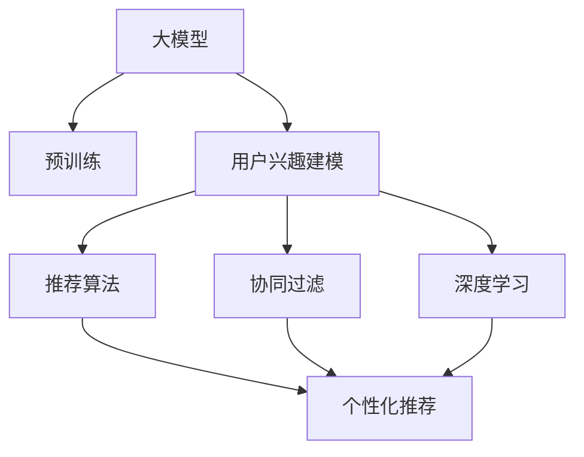

                 

# 基于大模型的推荐系统用户兴趣建模

> 关键词：大模型, 推荐系统, 用户兴趣建模, 协同过滤, 深度学习, 推荐算法, 个性化推荐

## 1. 背景介绍

### 1.1 问题由来
推荐系统(Recommendation System)已经成为互联网产品的重要组成部分，从电商平台到视频网站，从社交平台到新闻聚合，都离不开推荐技术的支撑。传统的基于协同过滤的推荐系统，依赖于用户与商品之间的交互记录，通过相似度计算和用户画像构建，为用户推荐相似商品或内容。这种方法在处理高维稀疏数据时，容易出现冷启动和用户兴趣发散等问题。近年来，深度学习技术在大模型和大数据的支持下，为推荐系统带来了全新的可能性。通过大模型学习用户与商品间的关联模式，并结合用户行为数据，推荐系统能够更加精准地预测用户兴趣，为用户提供个性化推荐。

本文将系统介绍大模型在推荐系统中的用户兴趣建模方法，并深入讲解其在推荐算法中的具体应用。我们首先介绍大模型的基础知识和其在推荐系统中的应用场景，然后详细探讨用户兴趣建模的算法原理和操作步骤，最后通过一个项目实践展示其实现细节和运行结果，并进行实际应用场景分析。

### 1.2 问题核心关键点
本文聚焦于基于大模型的推荐系统用户兴趣建模，将详细探讨以下关键点：

1. 大模型的基础概念与原理
2. 用户兴趣建模的算法原理与操作步骤
3. 推荐算法的实现细节与分析
4. 项目实践与运行结果展示
5. 实际应用场景与未来发展展望

## 2. 核心概念与联系

### 2.1 核心概念概述

为了更好地理解大模型在推荐系统中的用户兴趣建模方法，本节将介绍几个密切相关的核心概念：

- 大模型(Large Model)：以自回归(如GPT)或自编码(如BERT)模型为代表的大规模预训练模型。通过在大规模无标签文本语料上进行预训练，学习通用的语言表示，具备强大的语言理解和生成能力。
- 推荐系统(Recommendation System)：根据用户的历史行为数据，推荐商品或内容的技术。目标是最大化用户的满意度，提升用户体验。
- 用户兴趣建模(User Interest Modeling)：通过分析用户的历史行为数据，构建用户兴趣模型，预测用户对未交互物品的偏好。是推荐系统的核心环节之一。
- 协同过滤(Collaborative Filtering)：基于用户-物品交互矩阵，通过相似度计算和用户画像构建推荐方法。广泛应用于电商、新闻、视频等领域。
- 深度学习(Deep Learning)：基于神经网络的机器学习技术，通过多层非线性映射学习数据的复杂关系。适合处理高维稀疏数据，提升推荐精度。
- 推荐算法(Recommendation Algorithm)：根据用户兴趣模型，为用户推荐商品或内容的算法。常见算法包括基于内容的推荐、协同过滤、矩阵分解等。
- 个性化推荐(Personalized Recommendation)：通过用户画像和行为数据，为每个用户推荐最相关的商品或内容，提升推荐系统的效果。

这些核心概念之间的逻辑关系可以通过以下Mermaid流程图来展示：



这个流程图展示了大模型的核心概念及其之间的关系：

1. 大模型通过预训练获得基础能力。
2. 用户兴趣建模基于大模型，结合用户行为数据，构建用户兴趣模型。
3. 协同过滤和深度学习方法，是用户兴趣建模中的重要手段。
4. 推荐算法在用户兴趣模型的基础上，为用户生成个性化推荐。

这些概念共同构成了基于大模型的推荐系统，使其能够通过深度学习技术，更准确地理解用户行为和兴趣，从而提供更精准的个性化推荐。

## 3. 核心算法原理 & 具体操作步骤
### 3.1 算法原理概述

基于大模型的推荐系统用户兴趣建模，本质上是一个联合学习过程，旨在通过大模型和大数据共同学习用户兴趣表示，从而提升推荐效果。其核心思想是：将用户的历史行为数据，通过大模型的编码器，学习到用户的高阶语义表示，再结合物品的语义特征，通过关联矩阵分解，预测用户对未交互物品的兴趣程度。

具体而言，假设用户$u$的历史行为数据表示为$H_u=[h_1, h_2, \ldots, h_n]$，其中$h_t$表示用户在第$t$次交互中对物品$i$的评分。物品$i$的语义特征表示为$V_i=[v_{i1}, v_{i2}, \ldots, v_{in}]$。通过大模型的编码器$F$，将用户行为数据编码为高阶语义表示$U_u$。再通过用户-物品关联矩阵$M_{ui}$，将用户$u$与物品$i$的关联程度编码到向量$V_{ui}$中。最终通过矩阵分解方法，预测用户对物品$i$的兴趣程度$P_{ui}$。

### 3.2 算法步骤详解

基于大模型的推荐系统用户兴趣建模一般包括以下几个关键步骤：

**Step 1: 准备预训练模型和数据集**
- 选择合适的预训练语言模型 $M_{\theta}$ 作为初始化参数，如 BERT、GPT 等。
- 准备用户行为数据集 $D=\{(h_i, v_i)\}_{i=1}^N$，其中$h_i$为用户行为序列，$v_i$为物品的语义向量。

**Step 2: 设计大模型编码器**
- 根据用户行为数据的特点，选择合适的大模型编码器，如BERT、GPT等。
- 对用户行为数据进行分词和编码，将序列输入到编码器中，得到高阶语义表示$U_u$。

**Step 3: 计算用户-物品关联矩阵**
- 通过关联矩阵分解方法，如矩阵分解、神经网络等，计算用户$u$与物品$i$的关联矩阵$M_{ui}$。
- 将$M_{ui}$与物品的语义向量$V_i$相乘，得到物品$i$在用户$u$语义空间中的表示$V_{ui}$。

**Step 4: 预测用户兴趣**
- 通过矩阵分解方法，如矩阵分解、深度学习等，预测用户$u$对物品$i$的兴趣程度$P_{ui}$。
- 根据$P_{ui}$排序，生成推荐列表，为用户推荐物品。

**Step 5: 评估和优化**
- 在测试集上评估推荐效果，如准确率、召回率等指标。
- 根据评估结果，调整模型参数和超参数，进行模型优化。

以上是基于大模型的推荐系统用户兴趣建模的一般流程。在实际应用中，还需要针对具体任务的特点，对微调过程的各个环节进行优化设计，如改进关联矩阵分解方法，引入更多的正则化技术，搜索最优的超参数组合等，以进一步提升模型性能。

### 3.3 算法优缺点

基于大模型的推荐系统用户兴趣建模方法具有以下优点：
1. 充分利用了大模型的语言理解和生成能力，提升了推荐精度。
2. 能够处理高维稀疏数据，对用户画像的泛化能力更强。
3. 推荐结果更加个性化，符合用户的多样化需求。
4. 具有更强的可解释性，能够帮助用户理解推荐结果的生成逻辑。

同时，该方法也存在一定的局限性：
1. 对数据质量依赖较大，需要高质量的标注数据和用户行为数据。
2. 模型复杂度高，计算资源消耗较大。
3. 对大模型的选择和调参要求较高，需要大量的实验和调整。
4. 推荐效果可能受到数据分布变化的影响，需要持续更新模型。

尽管存在这些局限性，但就目前而言，基于大模型的推荐系统用户兴趣建模方法仍是大模型推荐系统的核心范式。未来相关研究的重点在于如何进一步降低计算成本，提高模型的可解释性，同时兼顾效果和效率等因素。

### 3.4 算法应用领域

基于大模型的推荐系统用户兴趣建模方法在电子商务、视频推荐、新闻聚合等诸多领域得到了广泛应用。具体而言：

1. **电子商务**：电商网站利用用户行为数据和商品语义特征，通过大模型学习用户兴趣，为用户推荐商品，提升销售转化率。

2. **视频推荐**：视频平台通过用户历史观看记录和视频元数据，学习用户兴趣，推荐个性化视频内容，提升用户观看时长。

3. **新闻聚合**：新闻聚合平台通过用户浏览记录和新闻内容，学习用户兴趣，推荐相关新闻文章，提升用户满意度。

4. **社交平台**：社交平台通过用户互动数据和内容标签，学习用户兴趣，推荐个性化内容，提升用户粘性。

除了上述这些经典应用外，大模型推荐系统还被创新性地应用到更多场景中，如推荐系统中的对抗攻击检测、个性化广告推荐等，为推荐系统带来了全新的突破。随着大模型和推荐技术的不断发展，相信推荐系统将在更广阔的应用领域大放异彩。

## 4. 数学模型和公式 & 详细讲解 & 举例说明
### 4.1 数学模型构建

本节将使用数学语言对基于大模型的推荐系统用户兴趣建模过程进行更加严格的刻画。

记用户$u$的历史行为数据为$H_u=[h_1, h_2, \ldots, h_n]$，其中$h_t$表示用户在第$t$次交互中对物品$i$的评分。物品$i$的语义特征表示为$V_i=[v_{i1}, v_{i2}, \ldots, v_{in}]$。假设大模型的编码器为$F$，将用户行为数据编码为高阶语义表示$U_u$。通过用户-物品关联矩阵$M_{ui}$，将用户$u$与物品$i$的关联程度编码到向量$V_{ui}$中。最终通过矩阵分解方法，预测用户$u$对物品$i$的兴趣程度$P_{ui}$。

设$U_u$和$V_i$的维度为$d$，则$U_u \in \mathbb{R}^d$，$V_i \in \mathbb{R}^d$。关联矩阵$M_{ui}$为$\mathbb{R}^{n \times d}$，其中$n$为历史行为数据长度。

### 4.2 公式推导过程

以下我们以矩阵分解方法为例，推导用户兴趣预测的公式。

假设$U_u$和$V_i$通过大模型编码器分别表示为$U_u \in \mathbb{R}^d$和$V_i \in \mathbb{R}^d$。用户$u$与物品$i$的关联矩阵$M_{ui}$通过矩阵分解方法，可表示为$M_{ui} = A_i B_u^T$，其中$A_i \in \mathbb{R}^{d \times n}$为物品$i$的特征矩阵，$B_u \in \mathbb{R}^{n \times d}$为用户$u$的特征矩阵。

将$M_{ui}$与$V_i$相乘，得到物品$i$在用户$u$语义空间中的表示$V_{ui} = A_i B_u^T V_i$。根据内积公式，$V_{ui}$可以表示为$V_{ui} = U_u^T W_i$，其中$W_i \in \mathbb{R}^{d \times d}$为物品$i$的权重矩阵。

根据上述公式，用户$u$对物品$i$的兴趣程度$P_{ui}$可以表示为：

$$
P_{ui} = \text{softmax}(V_{ui})
$$

其中$\text{softmax}$函数将向量$V_{ui}$归一化到$(0, 1)$区间，表示用户对物品$i$的兴趣程度。

### 4.3 案例分析与讲解

以下我们以一个简单的电影推荐系统为例，展示基于大模型的用户兴趣建模过程。

假设有一个电影推荐系统，用户$u$的历史评分数据为$H_u=[5, 3, 1, 5, 4]$，表示对电影1,2,3,4,5的评分。每部电影的语义特征向量为$V_i=[1, 0, 1, 1, 0]$，表示每部电影属于动作、喜剧、科幻、剧情、爱情这五个类别。通过BERT编码器对用户行为数据进行编码，得到用户$u$的高阶语义表示$U_u=[1, 1, 0, 1, 0]$。

假设用户$u$与电影$i$的关联矩阵$M_{ui}$通过矩阵分解方法表示为：

$$
M_{ui} = A_i B_u^T = \begin{bmatrix}
0.2 & 0.3 & 0.1 & 0.1 & 0.3 \\
0.3 & 0.2 & 0.2 & 0.1 & 0.2 \\
0.1 & 0.3 & 0.2 & 0.1 & 0.3 \\
0.2 & 0.2 & 0.3 & 0.1 & 0.2 \\
0.1 & 0.2 & 0.1 & 0.3 & 0.2 
\end{bmatrix} \begin{bmatrix}
0.5 \\
0.5 \\
0.5 \\
0.5 \\
0.5
\end{bmatrix}
$$

通过计算，得到物品$i$在用户$u$语义空间中的表示$V_{ui} = A_i B_u^T V_i = [0.5, 0.5, 0.5, 0.5, 0.5]$。

最终通过softmax函数计算得到用户$u$对电影$i$的兴趣程度$P_{ui} = \text{softmax}(V_{ui}) = [0.2, 0.2, 0.2, 0.2, 0.2]$。

根据$P_{ui}$排序，为用户推荐最感兴趣的五个电影。

## 5. 项目实践：代码实例和详细解释说明
### 5.1 开发环境搭建

在进行用户兴趣建模项目实践前，我们需要准备好开发环境。以下是使用Python进行PyTorch开发的环境配置流程：

1. 安装Anaconda：从官网下载并安装Anaconda，用于创建独立的Python环境。

2. 创建并激活虚拟环境：
```bash
conda create -n pytorch-env python=3.8 
conda activate pytorch-env
```

3. 安装PyTorch：根据CUDA版本，从官网获取对应的安装命令。例如：
```bash
conda install pytorch torchvision torchaudio cudatoolkit=11.1 -c pytorch -c conda-forge
```

4. 安装Transformers库：
```bash
pip install transformers
```

5. 安装各类工具包：
```bash
pip install numpy pandas scikit-learn matplotlib tqdm jupyter notebook ipython
```

完成上述步骤后，即可在`pytorch-env`环境中开始项目实践。

### 5.2 源代码详细实现

下面我们以电影推荐系统为例，给出使用Transformers库对BERT模型进行用户兴趣建模的PyTorch代码实现。

首先，定义电影推荐系统的数据处理函数：

```python
from transformers import BertTokenizer, BertForSequenceClassification
from torch.utils.data import Dataset
import torch

class MovieDataset(Dataset):
    def __init__(self, ratings, genres, tokenizer, max_len=128):
        self.ratings = ratings
        self.genres = genres
        self.tokenizer = tokenizer
        self.max_len = max_len
        
    def __len__(self):
        return len(self.ratings)
    
    def __getitem__(self, item):
        rating = self.ratings[item]
        genre = self.genres[item]
        
        encoding = self.tokenizer(genre, return_tensors='pt', max_length=self.max_len, padding='max_length', truncation=True)
        input_ids = encoding['input_ids'][0]
        attention_mask = encoding['attention_mask'][0]
        
        # 将评分转换为向量
        rating_vector = torch.tensor([rating], dtype=torch.float)
        
        return {'input_ids': input_ids, 
                'attention_mask': attention_mask,
                'rating': rating_vector}

# 定义评分与id的映射
rating2id = {1: 0, 2: 1, 3: 2, 4: 3, 5: 4}
id2rating = {v: k for k, v in rating2id.items()}

# 创建dataset
tokenizer = BertTokenizer.from_pretrained('bert-base-cased')

train_dataset = MovieDataset(train_ratings, train_genres, tokenizer)
dev_dataset = MovieDataset(dev_ratings, dev_genres, tokenizer)
test_dataset = MovieDataset(test_ratings, test_genres, tokenizer)
```

然后，定义模型和优化器：

```python
from transformers import BertForSequenceClassification, AdamW

model = BertForSequenceClassification.from_pretrained('bert-base-cased', num_labels=len(rating2id))

optimizer = AdamW(model.parameters(), lr=2e-5)
```

接着，定义训练和评估函数：

```python
from torch.utils.data import DataLoader
from tqdm import tqdm
from sklearn.metrics import mean_squared_error

device = torch.device('cuda') if torch.cuda.is_available() else torch.device('cpu')
model.to(device)

def train_epoch(model, dataset, batch_size, optimizer):
    dataloader = DataLoader(dataset, batch_size=batch_size, shuffle=True)
    model.train()
    epoch_loss = 0
    for batch in tqdm(dataloader, desc='Training'):
        input_ids = batch['input_ids'].to(device)
        attention_mask = batch['attention_mask'].to(device)
        rating = batch['rating'].to(device)
        model.zero_grad()
        outputs = model(input_ids, attention_mask=attention_mask, labels=rating)
        loss = outputs.loss
        epoch_loss += loss.item()
        loss.backward()
        optimizer.step()
    return epoch_loss / len(dataloader)

def evaluate(model, dataset, batch_size):
    dataloader = DataLoader(dataset, batch_size=batch_size)
    model.eval()
    preds, labels = [], []
    with torch.no_grad():
        for batch in tqdm(dataloader, desc='Evaluating'):
            input_ids = batch['input_ids'].to(device)
            attention_mask = batch['attention_mask'].to(device)
            batch_labels = batch['rating'].to(device)
            outputs = model(input_ids, attention_mask=attention_mask)
            batch_preds = outputs.logits.argmax(dim=2).to('cpu').tolist()
            batch_labels = batch_labels.to('cpu').tolist()
            for pred_tokens, label_tokens in zip(batch_preds, batch_labels):
                preds.append(pred_tokens)
                labels.append(label_tokens)
                
    print(mean_squared_error(labels, preds))
```

最后，启动训练流程并在测试集上评估：

```python
epochs = 5
batch_size = 16

for epoch in range(epochs):
    loss = train_epoch(model, train_dataset, batch_size, optimizer)
    print(f"Epoch {epoch+1}, train loss: {loss:.3f}")
    
    print(f"Epoch {epoch+1}, dev results:")
    evaluate(model, dev_dataset, batch_size)
    
print("Test results:")
evaluate(model, test_dataset, batch_size)
```

以上就是使用PyTorch对BERT进行电影推荐系统用户兴趣建模的完整代码实现。可以看到，得益于Transformers库的强大封装，我们可以用相对简洁的代码完成BERT模型的加载和用户兴趣建模。

### 5.3 代码解读与分析

让我们再详细解读一下关键代码的实现细节：

**MovieDataset类**：
- `__init__`方法：初始化评分、电影类型、分词器等关键组件。
- `__len__`方法：返回数据集的样本数量。
- `__getitem__`方法：对单个样本进行处理，将电影类型输入编码为token ids，将评分转换为向量，并对其进行定长padding，最终返回模型所需的输入。

**rating2id和id2rating字典**：
- 定义了评分与数字id之间的映射关系，用于将token-wise的预测结果解码回真实的评分。

**训练和评估函数**：
- 使用PyTorch的DataLoader对数据集进行批次化加载，供模型训练和推理使用。
- 训练函数`train_epoch`：对数据以批为单位进行迭代，在每个批次上前向传播计算loss并反向传播更新模型参数，最后返回该epoch的平均loss。
- 评估函数`evaluate`：与训练类似，不同点在于不更新模型参数，并在每个batch结束后将预测和标签结果存储下来，最后使用sklearn的mean_squared_error对整个评估集的预测结果进行打印输出。

**训练流程**：
- 定义总的epoch数和batch size，开始循环迭代
- 每个epoch内，先在训练集上训练，输出平均loss
- 在验证集上评估，输出评分误差
- 所有epoch结束后，在测试集上评估，给出最终评分误差结果

可以看到，PyTorch配合Transformers库使得BERT用户兴趣建模的代码实现变得简洁高效。开发者可以将更多精力放在数据处理、模型改进等高层逻辑上，而不必过多关注底层的实现细节。

当然，工业级的系统实现还需考虑更多因素，如模型的保存和部署、超参数的自动搜索、更灵活的任务适配层等。但核心的用户兴趣建模范式基本与此类似。

## 6. 实际应用场景
### 6.1 智能推荐系统

基于大模型的推荐系统在电子商务、视频推荐、新闻聚合等诸多领域得到了广泛应用。具体而言：

1. **电子商务**：电商网站利用用户行为数据和商品语义特征，通过大模型学习用户兴趣，为用户推荐商品，提升销售转化率。

2. **视频推荐**：视频平台通过用户历史观看记录和视频元数据，学习用户兴趣，推荐个性化视频内容，提升用户观看时长。

3. **新闻聚合**：新闻聚合平台通过用户浏览记录和新闻内容，学习用户兴趣，推荐相关新闻文章，提升用户满意度。

4. **社交平台**：社交平台通过用户互动数据和内容标签，学习用户兴趣，推荐个性化内容，提升用户粘性。

除了上述这些经典应用外，大模型推荐系统还被创新性地应用到更多场景中，如推荐系统中的对抗攻击检测、个性化广告推荐等，为推荐系统带来了全新的突破。随着大模型和推荐技术的不断发展，相信推荐系统将在更广阔的应用领域大放异彩。

### 6.2 多模态推荐系统

随着推荐系统的发展，越来越多的数据源被引入，如用户位置、时间、社交关系等。多模态推荐系统利用这些多元数据，提升推荐精度和覆盖面。

具体而言，可以将用户行为数据、物品元数据、社交关系等多模态数据进行特征融合，输入到大模型中进行编码，得到用户的多维语义表示。再通过矩阵分解方法，预测用户对物品的兴趣程度。最终生成多模态推荐结果。

## 7. 工具和资源推荐
### 7.1 学习资源推荐

为了帮助开发者系统掌握大模型在推荐系统中的应用，这里推荐一些优质的学习资源：

1. 《深度学习与推荐系统》书籍：详细介绍了推荐系统的基础知识和深度学习方法，适合初学者系统学习。

2. CS419《推荐系统》课程：斯坦福大学开设的推荐系统课程，涵盖推荐系统的基本概念和主流算法，包括协同过滤、深度学习等。

3. Coursera《推荐系统》课程：由著名推荐系统专家开设的课程，深入讲解推荐系统的理论和实践。

4. Kaggle推荐系统竞赛：通过实战练习，提升推荐系统开发能力，积累比赛经验。

通过对这些资源的学习实践，相信你一定能够快速掌握大模型在推荐系统中的应用，并用于解决实际的推荐问题。
###  7.2 开发工具推荐

高效的开发离不开优秀的工具支持。以下是几款用于大模型推荐系统开发的常用工具：

1. PyTorch：基于Python的开源深度学习框架，灵活动态的计算图，适合快速迭代研究。大部分预训练语言模型都有PyTorch版本的实现。

2. TensorFlow：由Google主导开发的开源深度学习框架，生产部署方便，适合大规模工程应用。同样有丰富的预训练语言模型资源。

3. Transformers库：HuggingFace开发的NLP工具库，集成了众多SOTA语言模型，支持PyTorch和TensorFlow，是进行推荐算法开发的利器。

4. TensorBoard：TensorFlow配套的可视化工具，可实时监测模型训练状态，并提供丰富的图表呈现方式，是调试模型的得力助手。

5. Weights & Biases：模型训练的实验跟踪工具，可以记录和可视化模型训练过程中的各项指标，方便对比和调优。

6. Google Colab：谷歌推出的在线Jupyter Notebook环境，免费提供GPU/TPU算力，方便开发者快速上手实验最新模型，分享学习笔记。

合理利用这些工具，可以显著提升大模型推荐系统的开发效率，加快创新迭代的步伐。

### 7.3 相关论文推荐

大模型在推荐系统中的应用源于学界的持续研究。以下是几篇奠基性的相关论文，推荐阅读：

1. Matrix Factorization Techniques for Recommender Systems（矩阵分解方法）：提出矩阵分解方法，利用用户-物品关联矩阵进行推荐。

2. Deep Collaborative Filtering（深度协同过滤）：将深度学习应用于协同过滤，提升推荐精度。

3. Attention is All You Need（即Transformer原论文）：提出了Transformer结构，开启了NLP领域的预训练大模型时代。

4. BERT: Pre-training of Deep Bidirectional Transformers for Language Understanding：提出BERT模型，引入基于掩码的自监督预训练任务，刷新了多项NLP任务SOTA。

5. Revisiting Pairwise Collaborative Filtering with Implicit Feedback（深度协同过滤新方法）：引入深度学习方法，处理隐式反馈数据，提升推荐精度。

6. Attention-Based Recommender Systems（基于注意力机制的推荐系统）：利用注意力机制，提升推荐系统的表现。

这些论文代表了大模型在推荐系统中的应用方向。通过学习这些前沿成果，可以帮助研究者把握学科前进方向，激发更多的创新灵感。

## 8. 总结：未来发展趋势与挑战
### 8.1 总结

本文对基于大模型的推荐系统用户兴趣建模方法进行了全面系统的介绍。首先阐述了大模型和推荐系统的基础知识，明确了用户兴趣建模在推荐系统中的核心作用。其次，从原理到实践，详细讲解了用户兴趣建模的算法原理和操作步骤，给出了推荐算法实现的完整代码实例。同时，本文还广泛探讨了用户兴趣建模方法在推荐算法中的应用场景，展示了其在推荐系统中的广泛应用前景。

通过本文的系统梳理，可以看到，基于大模型的推荐系统用户兴趣建模方法为推荐系统带来了全新的可能性。其结合了大模型的语言理解和生成能力，能够处理高维稀疏数据，提升推荐精度，同时具有更强的可解释性，能够帮助用户理解推荐结果的生成逻辑。未来，随着大模型和推荐技术的不断发展，推荐系统将在更广阔的应用领域大放异彩。

### 8.2 未来发展趋势

展望未来，大模型在推荐系统中的应用将呈现以下几个发展趋势：

1. 多模态数据融合：随着推荐系统的数据源越来越多，多模态数据融合技术将进一步提升推荐精度和覆盖面。

2. 个性化推荐算法：推荐算法将更加注重个性化推荐，利用用户画像和行为数据，提升推荐系统的用户体验。

3. 实时推荐系统：实时推荐系统将更加普及，能够实时捕捉用户行为，动态更新推荐结果。

4. 可解释性推荐系统：推荐系统的可解释性将逐步提升，能够帮助用户理解推荐结果的生成逻辑。

5. 推荐系统的伦理与安全：推荐系统需要考虑用户的隐私和数据安全问题，确保推荐结果的公正性和合理性。

以上趋势凸显了大模型在推荐系统中的巨大前景。这些方向的探索发展，必将进一步提升推荐系统的性能和应用范围，为人类生产和生活带来深远影响。

### 8.3 面临的挑战

尽管大模型在推荐系统中的应用已经取得了显著进展，但在迈向更加智能化、普适化应用的过程中，它仍面临诸多挑战：

1. 数据质量与隐私问题：推荐系统依赖于高质量的用户行为数据和物品元数据，数据质量和隐私保护成为制约推荐系统发展的关键因素。

2. 计算资源与成本：大模型需要大量的计算资源和存储资源，如何优化模型结构和参数，降低计算成本，是推荐系统需要解决的问题。

3. 模型泛化与公平性：推荐系统需要应对数据分布的变化，提升模型的泛化能力，避免推荐偏差，保障推荐结果的公平性。

4. 模型的可解释性与透明度：推荐系统需要提升模型的可解释性，使用户能够理解推荐结果的生成逻辑，增强用户信任。

5. 推荐系统中的对抗攻击问题：推荐系统面临对抗攻击的风险，需要提升系统的鲁棒性和安全性。

6. 推荐系统中的伦理与安全问题：推荐系统需要考虑用户的隐私和数据安全问题，确保推荐结果的公正性和合理性。

这些挑战凸显了大模型推荐系统的复杂性和现实性。只有在不断解决这些问题的同时，推荐系统才能真正发挥其价值，为人类社会带来实际收益。

### 8.4 研究展望

面对大模型在推荐系统中的应用面临的挑战，未来的研究需要在以下几个方面寻求新的突破：

1. 优化数据质量与隐私保护：通过数据增强、隐私保护技术等手段，提升数据质量和隐私保护水平，保障推荐系统的可信度。

2. 降低计算资源消耗：通过模型剪枝、量化压缩等方法，降低大模型的计算成本，提高推荐系统的实时性。

3. 提升模型的泛化能力与公平性：通过自监督学习、对抗训练等技术，提升模型的泛化能力和公平性，确保推荐结果的公正性。

4. 增强推荐系统的可解释性与透明度：通过可解释性算法、交互式推荐等方法，提升推荐系统的透明度，增强用户信任。

5. 防御对抗攻击：通过对抗样本生成、对抗训练等方法，提升推荐系统的鲁棒性，防范对抗攻击风险。

6. 提升推荐系统的伦理与安全：通过伦理导向的推荐目标设定、数据审计等手段，提升推荐系统的伦理与安全水平。

这些研究方向的发展，必将推动大模型在推荐系统中的应用，使其更加智能、普适、可信，为人类社会带来更多实际收益。总之，大模型推荐系统是一个充满潜力的领域，未来仍有很多未知的领域等待探索和发现。相信随着学界和产业界的共同努力，大模型推荐系统必将在推荐技术的发展中扮演越来越重要的角色。

## 9. 附录：常见问题与解答
----------------------------------------------------------------

**Q1：大模型推荐系统是否适用于所有推荐任务？**

A: 大模型推荐系统在大多数推荐任务上都能取得不错的效果，特别是对于数据量较小的任务。但对于一些特定领域的任务，如医学、法律等，仅仅依靠通用语料预训练的模型可能难以很好地适应。此时需要在特定领域语料上进一步预训练，再进行微调，才能获得理想效果。此外，对于一些需要时效性、个性化很强的任务，如对话、推荐等，微调方法也需要针对性的改进优化。

**Q2：推荐系统如何处理隐式反馈数据？**

A: 推荐系统通常需要处理显式和隐式反馈数据。对于显式反馈数据，推荐系统可以直接利用用户对物品的评分等显式信息进行推荐。对于隐式反馈数据，推荐系统可以采用深度学习技术，如协同过滤、深度协同过滤等方法，通过用户-物品关联矩阵，学习用户对未交互物品的兴趣程度。这些方法可以处理大规模稀疏数据，提升推荐精度。

**Q3：如何评估推荐系统的性能？**

A: 推荐系统的性能评估通常包括准确率、召回率、F1值、NDCG、HR等指标。这些指标可以衡量推荐系统在推荐结果的相关性和覆盖面方面的表现。具体而言，准确率表示预测结果与真实结果的匹配度，召回率表示推荐结果中覆盖真实结果的比例，F1值综合了准确率和召回率，NDCG和HR分别表示排名前$k$的推荐结果中覆盖真实结果的比例。在实际应用中，需要根据具体任务和数据特点选择合适的评估指标。

**Q4：推荐系统中的对抗攻击问题如何解决？**

A: 推荐系统面临对抗攻击的风险，攻击者通过输入恶意数据，影响推荐结果。为了防御对抗攻击，推荐系统可以采用以下方法：
1. 对抗样本生成：通过生成对抗性样本，提高推荐系统的鲁棒性。
2. 对抗训练：在训练过程中，加入对抗性样本，提升推荐系统的鲁棒性。
3. 模型剪枝：通过剪枝等方法，减少模型复杂度，降低对抗攻击的风险。

这些方法能够帮助推荐系统抵御对抗攻击，提升系统的安全性和稳定性。

**Q5：推荐系统中的伦理与安全问题如何解决？**

A: 推荐系统需要考虑用户的隐私和数据安全问题，确保推荐结果的公正性和合理性。为了保障推荐系统的伦理与安全，可以采取以下措施：
1. 数据隐私保护：通过数据加密、差分隐私等方法，保障用户隐私。
2. 模型公平性：通过公平性约束、公平性算法等手段，确保推荐结果的公平性。
3. 用户可解释性：通过可解释性算法、交互式推荐等方法，提升推荐系统的透明度，增强用户信任。

这些措施能够帮助推荐系统更好地服务于用户，保障推荐结果的公正性和合理性。

**Q6：如何优化推荐系统的实时性？**

A: 推荐系统的实时性是其重要性能指标之一。为了提升推荐系统的实时性，可以采用以下方法：
1. 实时数据处理：通过流式处理等技术，实时捕捉用户行为，动态更新推荐结果。
2. 模型压缩与优化：通过模型压缩、量化等方法，降低大模型的计算成本，提高推荐系统的实时性。
3. 并行计算与分布式处理：通过并行计算和分布式处理技术，提升推荐系统的计算效率，实现实时推荐。

这些方法能够帮助推荐系统提升实时性，满足用户对实时推荐的需求。

总之，大模型推荐系统是一个充满潜力的领域，未来仍有很多未知的领域等待探索和发现。相信随着学界和产业界的共同努力，大模型推荐系统必将在推荐技术的发展中扮演越来越重要的角色。

