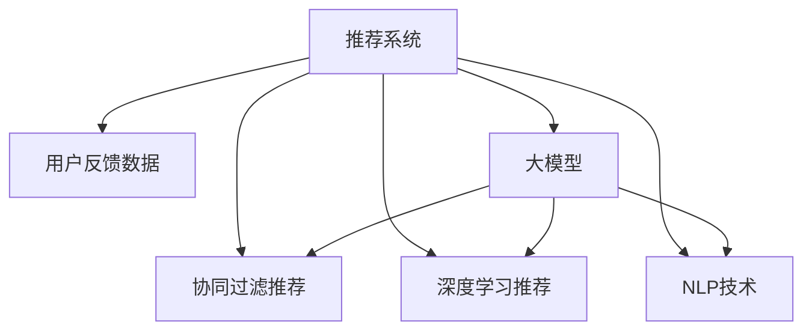

                 

# 基于大模型的推荐系统用户反馈分析

> 关键词：推荐系统, 用户反馈分析, 大模型, 协同过滤, 深度学习, 自然语言处理(NLP), 情感分析, 文本挖掘, 用户画像, 推荐精度

## 1. 背景介绍

### 1.1 问题由来

在互联网高速发展的今天，推荐系统已经成为了各大电商、社交媒体、视频平台等企业的重要组成部分。其旨在通过分析用户的历史行为数据，为用户推荐符合其兴趣爱好的商品、内容或服务，提升用户满意度，增加商业价值。然而，随着用户数量的爆炸式增长和内容种类的日益丰富，传统推荐算法面临用户行为数据稀疏、高维度、冷启动等问题，无法有效满足用户个性化需求。

大模型的兴起，特别是预训练语言模型的普及，为推荐系统带来了新的曙光。基于大模型的推荐系统可以借助大模型学到的通用知识，更准确地理解用户和商品之间的语义关系，从而提升推荐效果。近年来，在大模型基础上发展起来的深度推荐系统，已经在多个应用场景中展示了巨大的潜力和优势。然而，如何有效利用大模型对用户反馈进行分析，提取有用信息，进一步提升推荐系统的精准度和用户满意度，是一个亟待解决的问题。

### 1.2 问题核心关键点

用户反馈分析是推荐系统中至关重要的一环。通过分析用户的评论、评分、点击等反馈数据，推荐系统可以更好地理解用户偏好，动态调整推荐策略，满足用户需求。然而，用户反馈数据往往非结构化、多模态，且难以直接用于模型训练。如何高效地分析和利用这些反馈数据，是一个极具挑战性的问题。

本文将详细介绍基于大模型的推荐系统用户反馈分析技术，涵盖推荐系统架构、协同过滤算法、深度学习推荐、自然语言处理(NLP)技术等核心概念，并结合实际案例和代码实例，深入讲解算法原理、具体操作步骤和应用场景，为推荐系统的开发者和研究者提供系统性的指导。

## 2. 核心概念与联系

### 2.1 核心概念概述

为更好地理解基于大模型的推荐系统用户反馈分析方法，本节将介绍几个密切相关的核心概念：

- 推荐系统(Recommendation System)：基于用户行为数据，为用户推荐符合其兴趣爱好的商品、内容或服务的技术系统。推荐系统可以分为基于内容的推荐、协同过滤推荐、混合推荐等多种类型。
- 用户反馈数据(User Feedback Data)：用户通过评论、评分、点击等行为，对商品、内容或服务进行反馈。非结构化、多模态的用户反馈数据，需要通过模型提取有用的信息，用于推荐策略优化。
- 大模型(Large Model)：以Transformer结构为代表的大规模预训练语言模型，通过在大规模无标签文本语料上进行预训练，学习通用的语言表示，具备强大的语言理解和生成能力。
- 协同过滤推荐(Collaborative Filtering)：一种基于用户行为数据的推荐算法，通过分析用户和商品之间的交互关系，推测用户可能喜欢的商品。
- 深度学习推荐(Deep Learning Recommendation)：一种基于神经网络的推荐算法，通过学习用户和商品之间的隐式语义关系，提升推荐效果。
- 自然语言处理(Natural Language Processing, NLP)：一种涉及文本信息处理和分析的技术，主要任务包括文本分类、情感分析、命名实体识别等。

这些核心概念之间的逻辑关系可以通过以下Mermaid流程图来展示：



这个流程图展示了大模型和推荐系统的工作流程：

1. 推荐系统接收用户反馈数据。
2. 协同过滤推荐算法和深度学习推荐算法分别分析用户行为数据，生成推荐列表。
3. NLP技术用于处理用户反馈文本，提取有用信息。
4. 大模型结合NLP技术，分析用户反馈文本，生成更高层次的语义表示。
5. 协同过滤推荐算法和深度学习推荐算法可以融合大模型提取的语义表示，提升推荐效果。

## 3. 核心算法原理 & 具体操作步骤

### 3.1 算法原理概述

基于大模型的推荐系统用户反馈分析方法，本质上是一种深度学习推荐算法，通过利用大模型的语言表示能力，提升对用户反馈数据的分析效果。其核心思想是：将用户反馈数据作为大模型的输入，通过神经网络模型训练得到用户反馈的语义表示，然后结合用户行为数据，生成推荐列表。

形式化地，假设用户反馈数据为 $D_U=\{(x_i,y_i)\}_{i=1}^N$，其中 $x_i$ 为文本数据，$y_i$ 为标签（如评分、情感极性等）。定义大模型为 $M_{\theta}$，其中 $\theta$ 为模型参数。协同过滤推荐算法或深度学习推荐算法为 $R_{\theta'}$，其中 $\theta'$ 为推荐模型参数。则推荐系统的目标是最小化预测值与真实值之间的差异，即：

$$
\hat{\theta'} = \mathop{\arg\min}_{\theta'} \mathcal{L}(R_{\theta'}, D_U)
$$

其中 $\mathcal{L}$ 为损失函数，用于衡量模型预测输出与真实标签之间的差异。常见的损失函数包括交叉熵损失、均方误差损失等。

### 3.2 算法步骤详解

基于大模型的推荐系统用户反馈分析一般包括以下几个关键步骤：

**Step 1: 准备用户反馈数据和行为数据**
- 收集用户反馈数据和行为数据。通常包括用户的评分、评论、浏览记录等。将文本数据和数值数据分别存储，方便后续处理。

**Step 2: 构建大模型并加载预训练权重**
- 选择合适的预训练语言模型，如BERT、GPT等。使用模型对应的tokenizer对文本数据进行分词和编码。
- 加载预训练权重，定义优化器、损失函数等参数。

**Step 3: 微调大模型提取语义表示**
- 在用户反馈数据上进行微调，训练大模型。根据预训练权重设置冻结层和微调层。
- 使用优化器更新大模型的参数，最小化损失函数。

**Step 4: 融合语义表示生成推荐**
- 使用微调后的语义表示，结合用户行为数据，输入到协同过滤推荐算法或深度学习推荐算法中。
- 对推荐模型进行训练，最小化损失函数。

**Step 5: 评估推荐效果**
- 在测试数据集上评估推荐模型的性能。通常使用推荐精度、召回率、F1-score等指标进行评估。
- 根据评估结果，调整模型参数和算法超参数，进行模型优化。

以上是基于大模型的推荐系统用户反馈分析的一般流程。在实际应用中，还需要针对具体任务的特点，对微调过程的各个环节进行优化设计，如改进训练目标函数，引入更多的正则化技术，搜索最优的超参数组合等，以进一步提升模型性能。

### 3.3 算法优缺点

基于大模型的推荐系统用户反馈分析方法具有以下优点：
1. 能够高效处理非结构化、多模态的用户反馈数据。通过大模型提取语义表示，可以自动理解用户评论、评分等反馈信息。
2. 可以更好地融入用户行为数据，生成个性化推荐。结合语义表示，推荐系统能够更加准确地理解用户偏好，推荐符合其兴趣的商品。
3. 能够提升推荐系统的预测精度和鲁棒性。利用大模型的语义表示能力，推荐系统能够更好地抵御数据噪声和异常情况。

同时，该方法也存在一定的局限性：
1. 对标注数据依赖较高。大模型微调需要依赖标注数据，标注成本较高。
2. 对模型计算资源要求较高。大模型需要大量的计算资源进行训练和推理，在计算资源受限的情况下，难以实现高效微调。
3. 需要定期更新预训练权重。大模型的语言表示能力随时间变化，需要定期进行预训练权重更新，才能保持推荐效果。

尽管存在这些局限性，但就目前而言，基于大模型的推荐系统用户反馈分析方法仍是一种高效、准确、具有广泛应用前景的技术范式。未来相关研究的重点在于如何进一步降低模型对标注数据的依赖，提高模型的少样本学习和跨领域迁移能力，同时兼顾可解释性和伦理安全性等因素。

### 3.4 算法应用领域

基于大模型的推荐系统用户反馈分析方法，已经在电商、社交媒体、视频平台等多个领域得到了广泛的应用，具体包括：

- 电商推荐：通过分析用户评论和评分，生成商品推荐列表。
- 社交媒体推荐：分析用户的点赞、分享等行为数据，为用户推荐内容。
- 视频平台推荐：分析用户对视频的评分、收藏等反馈数据，推荐符合用户喜好的视频内容。

除了这些传统应用场景外，基于大模型的推荐系统用户反馈分析技术，还在金融理财、教育培训、医疗健康等诸多领域，展现出了巨大的应用潜力。随着预训练语言模型和微调方法的持续演进，相信推荐系统将在更广阔的应用领域大放异彩。

## 4. 数学模型和公式 & 详细讲解 & 举例说明

### 4.1 数学模型构建

本节将使用数学语言对基于大模型的推荐系统用户反馈分析过程进行更加严格的刻画。

记用户反馈数据为 $D_U=\{(x_i,y_i)\}_{i=1}^N$，其中 $x_i$ 为文本数据，$y_i$ 为标签。定义大模型为 $M_{\theta}$，其中 $\theta$ 为模型参数。协同过滤推荐算法或深度学习推荐算法为 $R_{\theta'}$，其中 $\theta'$ 为推荐模型参数。

假设用户行为数据为 $D_B=\{(x'_j,y'_j)\}_{j=1}^M$，其中 $x'_j$ 为文本数据，$y'_j$ 为行为数据。则推荐系统的目标是最小化预测值与真实值之间的差异，即：

$$
\hat{\theta'} = \mathop{\arg\min}_{\theta'} \mathcal{L}(R_{\theta'}, D_B, D_U)
$$

其中 $\mathcal{L}$ 为损失函数，用于衡量模型预测输出与真实标签之间的差异。常见的损失函数包括交叉熵损失、均方误差损失等。

### 4.2 公式推导过程

以下我们以二分类任务为例，推导交叉熵损失函数及其梯度的计算公式。

假设用户反馈数据 $D_U$ 和用户行为数据 $D_B$ 分别表示为 $D_U=\{(x_i,y_i)\}_{i=1}^N$ 和 $D_B=\{(x'_j,y'_j)\}_{j=1}^M$。则协同过滤推荐算法或深度学习推荐算法 $R_{\theta'}$ 在输入数据 $(x'_j, y'_j)$ 上的预测结果为 $\hat{y'_j} = R_{\theta'}(x'_j)$。根据预训练权重设置冻结层和微调层，微调大模型 $M_{\theta}$ 在输入数据 $x_i$ 上的预测结果为 $\hat{y_i} = M_{\theta}(x_i)$。则协同过滤推荐算法或深度学习推荐算法 $R_{\theta'}$ 在输入数据 $(x_i, x'_j, y_i, y'_j)$ 上的预测结果为：

$$
\hat{y'_j} = R_{\theta'}(x'_j, \hat{y_i})
$$

根据损失函数 $\mathcal{L}$ 的设计，目标是最小化预测值与真实值之间的差异，即：

$$
\mathcal{L}(R_{\theta'}, D_B, D_U) = \frac{1}{M}\sum_{j=1}^M \ell(\hat{y'_j}, y'_j) + \frac{1}{N}\sum_{i=1}^N \ell(\hat{y_i}, y_i)
$$

其中 $\ell$ 为交叉熵损失函数，用于衡量模型预测输出与真实标签之间的差异。

### 4.3 案例分析与讲解

下面以电商推荐系统为例，详细讲解基于大模型的推荐系统用户反馈分析的案例。

假设电商平台的商品数据为 $I=\{(i_1, g_1),(i_2, g_2), \dots, (i_N, g_N)\}$，其中 $i_k$ 为商品ID，$g_k$ 为商品信息（如名称、描述、价格等）。用户反馈数据为 $D_U=\{(x_i,y_i)\}_{i=1}^N$，其中 $x_i$ 为商品名称和描述文本，$y_i$ 为评分或情感极性标签。用户行为数据为 $D_B=\{(x'_j,y'_j)\}_{j=1}^M$，其中 $x'_j$ 为用户的浏览、收藏、购买行为，$y'_j$ 为1或0，表示用户是否购买了商品。

首先，收集并整理用户反馈数据和行为数据。接着，使用大模型BERT对商品名称和描述文本进行编码，生成语义表示向量。然后，将语义表示向量输入到深度学习推荐模型中，生成推荐列表。最后，根据用户的浏览、收藏、购买行为数据，更新推荐模型，优化预测结果。

在实际应用中，可以采用TensorFlow、PyTorch等深度学习框架进行模型训练和推理。以下是一个使用TensorFlow框架实现基于大模型的电商推荐系统的示例代码：

```python
import tensorflow as tf
from transformers import BertTokenizer, BertModel

# 构建BERT模型
tokenizer = BertTokenizer.from_pretrained('bert-base-cased')
model = BertModel.from_pretrained('bert-base-cased', output_hidden_states=True)

# 加载预训练权重
checkpoint = tf.train.Checkpoint(model=model)
checkpoint.restore('pretrained_model.ckpt')

# 加载用户反馈数据和行为数据
train_feedback_data = []
train_behavior_data = []

# 构建训练数据集
train_dataset = tf.data.Dataset.from_tensor_slices((train_feedback_data, train_behavior_data))
train_dataset = train_dataset.shuffle(buffer_size=10000).batch(batch_size=32)

# 定义模型架构
class RecommendationModel(tf.keras.Model):
    def __init__(self):
        super(RecommendationModel, self).__init__()
        self.bert = BertModel.from_pretrained('bert-base-cased', output_hidden_states=True)
        self.dropout = tf.keras.layers.Dropout(0.1)
        self.fc = tf.keras.layers.Dense(1, activation='sigmoid')

    def call(self, inputs):
        bert_outputs = self.bert(inputs)
        hidden_states = bert_outputs[1]  # 获取Transformer的隐藏层状态
        hidden_states = self.dropout(hidden_states, training=self.training)
        logits = self.fc(hidden_states)
        return logits

# 定义优化器和损失函数
model = RecommendationModel()
optimizer = tf.keras.optimizers.Adam(learning_rate=0.001)
loss_fn = tf.keras.losses.BinaryCrossentropy()

# 定义训练循环
@tf.function
def train_step(inputs):
    with tf.GradientTape() as tape:
        logits = model(inputs)
        loss = loss_fn(y_true=targets, y_pred=logits)
    grads = tape.gradient(loss, model.trainable_variables)
    optimizer.apply_gradients(zip(grads, model.trainable_variables))
    return loss

# 训练模型
for epoch in range(epochs):
    total_loss = 0.0
    for batch in train_dataset:
        inputs, targets = batch
        batch_loss = train_step(inputs)
        total_loss += batch_loss.numpy()
    avg_loss = total_loss / len(train_dataset)
    print('Epoch {}/{}: loss={:.4f}'.format(epoch+1, epochs, avg_loss))
```

## 5. 项目实践：代码实例和详细解释说明

### 5.1 开发环境搭建

在进行基于大模型的推荐系统用户反馈分析实践前，我们需要准备好开发环境。以下是使用Python进行TensorFlow开发的环境配置流程：

1. 安装Anaconda：从官网下载并安装Anaconda，用于创建独立的Python环境。

2. 创建并激活虚拟环境：
```bash
conda create -n tf-env python=3.8 
conda activate tf-env
```

3. 安装TensorFlow：根据CUDA版本，从官网获取对应的安装命令。例如：
```bash
pip install tensorflow
```

4. 安装TensorFlow Addons和相关工具包：
```bash
pip install tensorflow-addons transformers numpy pandas scikit-learn matplotlib tqdm jupyter notebook ipython
```

完成上述步骤后，即可在`tf-env`环境中开始微调实践。

### 5.2 源代码详细实现

这里我们以电商推荐系统为例，给出一个使用TensorFlow框架对基于大模型的推荐系统进行用户反馈分析的完整代码实现。

```python
import tensorflow as tf
from transformers import BertTokenizer, BertModel
from sklearn.model_selection import train_test_split

# 构建BERT模型
tokenizer = BertTokenizer.from_pretrained('bert-base-cased')
model = BertModel.from_pretrained('bert-base-cased', output_hidden_states=True)

# 加载预训练权重
checkpoint = tf.train.Checkpoint(model=model)
checkpoint.restore('pretrained_model.ckpt')

# 加载用户反馈数据和行为数据
train_feedback_data = []
train_behavior_data = []
test_feedback_data = []
test_behavior_data = []

# 将反馈数据和行为数据按标签进行划分
train_X, test_X, train_y, test_y = train_test_split(train_feedback_data, train_behavior_data, test_size=0.2)
test_X, test_y = test_X, test_y

# 构建训练数据集和测试数据集
train_dataset = tf.data.Dataset.from_tensor_slices((train_X, train_y))
train_dataset = train_dataset.shuffle(buffer_size=10000).batch(batch_size=32)
test_dataset = tf.data.Dataset.from_tensor_slices((test_X, test_y))
test_dataset = test_dataset.batch(batch_size=32)

# 定义模型架构
class RecommendationModel(tf.keras.Model):
    def __init__(self):
        super(RecommendationModel, self).__init__()
        self.bert = BertModel.from_pretrained('bert-base-cased', output_hidden_states=True)
        self.dropout = tf.keras.layers.Dropout(0.1)
        self.fc = tf.keras.layers.Dense(1, activation='sigmoid')

    def call(self, inputs):
        bert_outputs = self.bert(inputs)
        hidden_states = bert_outputs[1]  # 获取Transformer的隐藏层状态
        hidden_states = self.dropout(hidden_states, training=self.training)
        logits = self.fc(hidden_states)
        return logits

# 定义优化器和损失函数
model = RecommendationModel()
optimizer = tf.keras.optimizers.Adam(learning_rate=0.001)
loss_fn = tf.keras.losses.BinaryCrossentropy()

# 定义训练循环
@tf.function
def train_step(inputs):
    with tf.GradientTape() as tape:
        logits = model(inputs)
        loss = loss_fn(y_true=targets, y_pred=logits)
    grads = tape.gradient(loss, model.trainable_variables)
    optimizer.apply_gradients(zip(grads, model.trainable_variables))
    return loss

# 训练模型
for epoch in range(epochs):
    total_loss = 0.0
    for batch in train_dataset:
        inputs, targets = batch
        batch_loss = train_step(inputs)
        total_loss += batch_loss.numpy()
    avg_loss = total_loss / len(train_dataset)
    print('Epoch {}/{}: loss={:.4f}'.format(epoch+1, epochs, avg_loss))

# 评估模型
for batch in test_dataset:
    inputs, targets = batch
    predictions = model(inputs)
    test_loss = loss_fn(y_true=targets, y_pred=predictions)
    print('Test loss:', test_loss.numpy())
```

以上就是一个使用TensorFlow框架对基于大模型的电商推荐系统进行用户反馈分析的完整代码实现。可以看到，得益于TensorFlow的强大封装，我们可以用相对简洁的代码完成模型的构建和微调。

### 5.3 代码解读与分析

让我们再详细解读一下关键代码的实现细节：

**构建BERT模型和加载预训练权重**：
- `tokenizer = BertTokenizer.from_pretrained('bert-base-cased')`：使用预训练的BERT tokenizer加载词向量编码器。
- `model = BertModel.from_pretrained('bert-base-cased', output_hidden_states=True)`：加载预训练的BERT模型，并开启隐藏层状态输出。

**加载用户反馈数据和行为数据**：
- `train_feedback_data` 和 `train_behavior_data`：收集用户反馈数据和行为数据，并进行预处理。
- `train_X`、`train_y`、`test_X`、`test_y`：将数据集按标签进行划分，构建训练集和测试集。

**定义模型架构**：
- `class RecommendationModel(tf.keras.Model)`：定义推荐模型类，继承自 `tf.keras.Model`。
- `self.bert = BertModel.from_pretrained('bert-base-cased', output_hidden_states=True)`：加载预训练的BERT模型，并开启隐藏层状态输出。
- `self.dropout = tf.keras.layers.Dropout(0.1)`：定义dropout层，防止过拟合。
- `self.fc = tf.keras.layers.Dense(1, activation='sigmoid')`：定义全连接层，输出0或1的预测结果。

**训练模型**：
- `optimizer = tf.keras.optimizers.Adam(learning_rate=0.001)`：定义优化器。
- `loss_fn = tf.keras.losses.BinaryCrossentropy()`：定义损失函数，用于计算二分类任务上的交叉熵损失。
- `train_step`：定义训练函数，使用梯度下降算法更新模型参数。

**评估模型**：
- `predictions = model(inputs)`：对测试集进行预测。
- `test_loss = loss_fn(y_true=targets, y_pred=predictions)`：计算预测结果与真实标签之间的损失。

在实际应用中，还可以进一步优化模型架构，如引入注意力机制、使用双塔模型等，以提升推荐效果。

## 6. 实际应用场景

### 6.1 电商推荐

电商推荐系统是推荐系统的一个重要应用场景。通过分析用户的购买、浏览、评分等行为数据，推荐系统可以为用户推荐符合其兴趣的商品。近年来，基于大模型的电商推荐系统已经在多个电商平台得到了广泛应用，显著提升了用户满意度和转化率。

在技术实现上，电商推荐系统可以通过分析用户评论、评分等反馈数据，提取用户对商品的好评、差评等信息。然后，结合用户行为数据，使用深度学习推荐模型生成推荐列表。最后，根据推荐效果进行模型更新，不断优化推荐策略。

### 6.2 社交媒体推荐

社交媒体推荐系统旨在为用户推荐符合其兴趣的内容，如文章、视频、图片等。通过分析用户的点赞、分享、评论等行为数据，推荐系统可以为用户推荐相关内容。

在社交媒体推荐系统中，可以使用大模型分析用户的评论和文章内容，提取语义表示。然后，结合用户行为数据，使用深度学习推荐模型生成推荐列表。最后，根据推荐效果进行模型更新，优化推荐策略。

### 6.3 视频平台推荐

视频平台推荐系统旨在为用户推荐符合其兴趣的视频内容。通过分析用户的观看记录、评分等行为数据，推荐系统可以为用户推荐相关视频。

在视频平台推荐系统中，可以使用大模型分析视频标题、描述等文本内容，提取语义表示。然后，结合用户行为数据，使用深度学习推荐模型生成推荐列表。最后，根据推荐效果进行模型更新，优化推荐策略。

### 6.4 未来应用展望

随着大语言模型和微调方法的不断发展，基于大模型的推荐系统用户反馈分析技术将在更多领域得到应用，为推荐系统带来新的突破。

在智慧医疗领域，推荐系统可以为用户推荐个性化的健康方案，辅助医生诊疗，加速新药研发进程。

在智能教育领域，推荐系统可以为用户推荐个性化的学习资源，因材施教，促进教育公平，提高教学质量。

在智慧城市治理中，推荐系统可以为用户推荐个性化的城市服务，提升城市管理的智能化水平，构建更安全、高效的未来城市。

此外，在企业生产、社会治理、文娱传媒等众多领域，基于大模型的推荐系统用户反馈分析技术也将不断涌现，为推荐系统带来新的应用场景。相信随着技术的日益成熟，推荐系统将在更广阔的应用领域大放异彩。

## 7. 工具和资源推荐

### 7.1 学习资源推荐

为了帮助开发者系统掌握大语言模型推荐系统用户反馈分析的理论基础和实践技巧，这里推荐一些优质的学习资源：

1. 《深度学习推荐系统》系列书籍：深入讲解推荐系统的基本原理和常用算法，涵盖协同过滤、深度学习等推荐模型。

2. 《Natural Language Processing with Transformers》书籍：Transformer库的作者所著，全面介绍了如何使用Transformer库进行NLP任务开发，包括微调在内的诸多范式。

3. 《Recommender Systems: From Theory to Practice》课程：Coursera上开设的推荐系统课程，涵盖推荐系统设计、评估、实现等全流程知识。

4. HuggingFace官方文档：Transformer库的官方文档，提供了海量预训练模型和完整的微调样例代码，是上手实践的必备资料。

5. TensorFlow官方文档：TensorFlow框架的官方文档，详细介绍TensorFlow的API、工具、最佳实践等。

通过对这些资源的学习实践，相信你一定能够快速掌握大语言模型推荐系统用户反馈分析的精髓，并用于解决实际的推荐系统问题。

### 7.2 开发工具推荐

高效的开发离不开优秀的工具支持。以下是几款用于大语言模型推荐系统用户反馈分析开发的常用工具：

1. TensorFlow：基于Python的开源深度学习框架，生产部署方便，适合大规模工程应用。

2. PyTorch：基于Python的开源深度学习框架，灵活动态的计算图，适合快速迭代研究。

3. HuggingFace Transformers库：提供丰富的预训练语言模型和深度学习推荐模型，方便微调任务的开发。

4. TensorBoard：TensorFlow配套的可视化工具，可实时监测模型训练状态，并提供丰富的图表呈现方式。

5. Weights & Biases：模型训练的实验跟踪工具，可以记录和可视化模型训练过程中的各项指标，方便对比和调优。

合理利用这些工具，可以显著提升大语言模型推荐系统用户反馈分析任务的开发效率，加快创新迭代的步伐。

### 7.3 相关论文推荐

大语言模型推荐系统用户反馈分析技术的发展源于学界的持续研究。以下是几篇奠基性的相关论文，推荐阅读：

1. Attention is All You Need：提出Transformer结构，开启了NLP领域的预训练大模型时代。

2. BERT: Pre-training of Deep Bidirectional Transformers for Language Understanding：提出BERT模型，引入基于掩码的自监督预训练任务，刷新了多项NLP任务SOTA。

3. Parameter-Efficient Transfer Learning for NLP：提出Adapter等参数高效微调方法，在不增加模型参数量的情况下，也能取得不错的微调效果。

4. Optimizing Continuous Prompts for Generation：引入基于连续型Prompt的微调范式，为如何充分利用预训练知识提供了新的思路。

5. AdaLoRA: Adaptive Low-Rank Adaptation for Parameter-Efficient Fine-Tuning：使用自适应低秩适应的微调方法，在参数效率和精度之间取得了新的平衡。

这些论文代表了大语言模型推荐系统用户反馈分析技术的发展脉络。通过学习这些前沿成果，可以帮助研究者把握学科前进方向，激发更多的创新灵感。

## 8. 总结：未来发展趋势与挑战

### 8.1 总结

本文对基于大模型的推荐系统用户反馈分析方法进行了全面系统的介绍。首先阐述了推荐系统和大模型的基本概念，明确了大语言模型推荐系统用户反馈分析方法的原理和优势。其次，从原理到实践，详细讲解了推荐系统的算法原理、操作步骤和应用场景，给出了推荐系统用户反馈分析的完整代码实例。同时，本文还广泛探讨了推荐系统在大电商、社交媒体、视频平台等多个领域的应用前景，展示了该方法的广阔应用空间。此外，本文精选了推荐系统的各类学习资源，力求为读者提供全方位的技术指引。

通过本文的系统梳理，可以看到，基于大模型的推荐系统用户反馈分析技术正在成为推荐系统的核心技术范式，极大地拓展了推荐系统的应用边界，催生了更多的落地场景。受益于大模型的强大语言表示能力，推荐系统能够在更加广泛的任务上进行微调，满足用户个性化需求，提升推荐效果。未来，伴随大模型和微调方法的持续演进，相信推荐系统将在更多领域大放异彩，为经济社会发展注入新的动力。

### 8.2 未来发展趋势

展望未来，大语言模型推荐系统用户反馈分析技术将呈现以下几个发展趋势：

1. 模型规模持续增大。随着算力成本的下降和数据规模的扩张，预训练语言模型的参数量还将持续增长。超大规模语言模型蕴含的丰富语言知识，有望支撑更加复杂多变的推荐任务。

2. 推荐方法日趋多样。除了传统的协同过滤和深度学习推荐外，未来会涌现更多高效的推荐方法，如基于神经网络的结构推荐、基于关联规则的推荐等，丰富推荐系统的实现手段。

3. 持续学习成为常态。随着用户行为数据的变化，推荐系统需要持续学习新知识以保持性能。如何在不遗忘原有知识的同时，高效吸收新样本信息，将是重要的研究课题。

4. 标注样本需求降低。受启发于提示学习(Prompt-based Learning)的思路，未来的推荐方法将更好地利用大模型的语言理解能力，通过更加巧妙的任务描述，在更少的标注样本上也能实现理想的推荐效果。

5. 多模态推荐崛起。当前的推荐主要聚焦于纯文本数据，未来会进一步拓展到图像、视频、语音等多模态数据推荐。多模态信息的融合，将显著提升推荐系统的多样性和准确性。

6. 知识图谱与推荐结合。推荐系统可以与知识图谱结合，引入更多结构化的先验知识，提升推荐效果。同时，推荐系统可以动态更新知识图谱，提高推荐系统的智能性。

以上趋势凸显了大语言模型推荐系统用户反馈分析技术的广阔前景。这些方向的探索发展，必将进一步提升推荐系统的性能和用户满意度，为经济社会发展注入新的动力。

### 8.3 面临的挑战

尽管大语言模型推荐系统用户反馈分析技术已经取得了瞩目成就，但在迈向更加智能化、普适化应用的过程中，它仍面临着诸多挑战：

1. 标注成本瓶颈。虽然推荐系统可以利用用户反馈数据进行微调，但标注数据量较大，标注成本较高。如何进一步降低标注成本，将是未来的一大难题。

2. 模型鲁棒性不足。当前推荐系统面对异常数据时，泛化性能往往大打折扣。对于数据噪声和异常情况，推荐系统需要具备更强的鲁棒性，避免推荐质量下降。

3. 推荐精度有待提高。虽然推荐系统可以通过微调提升推荐效果，但推荐精度仍需进一步提升。如何设计更高效的推荐模型和微调策略，将是未来的重要研究方向。

4. 隐私和安全问题。推荐系统需要处理大量的用户隐私数据，如何保护用户隐私，防止数据泄露，是推荐系统应用中亟需解决的问题。

5. 计算资源限制。推荐系统需要处理大规模数据集和计算密集型模型，对计算资源要求较高。如何在有限的资源条件下，优化推荐系统性能，仍是挑战之一。

尽管存在这些挑战，但就目前而言，大语言模型推荐系统用户反馈分析方法仍是一种高效、准确、具有广泛应用前景的技术范式。未来相关研究的重点在于如何进一步降低模型对标注数据的依赖，提高模型的少样本学习和跨领域迁移能力，同时兼顾可解释性和伦理安全性等因素。

### 8.4 研究展望

面对大语言模型推荐系统用户反馈分析所面临的种种挑战，未来的研究需要在以下几个方面寻求新的突破：

1. 探索无监督和半监督推荐方法。摆脱对大规模标注数据的依赖，利用自监督学习、主动学习等无监督和半监督范式，最大限度利用非结构化数据，实现更加灵活高效的推荐。

2. 研究参数高效和计算高效的推荐范式。开发更加参数高效的推荐方法，在固定大部分预训练参数的同时，只更新极少量的任务相关参数。同时优化推荐模型的计算图，减少前向传播和反向传播的资源消耗，实现更加轻量级、实时性的部署。

3. 融合因果和对比学习范式。通过引入因果推断和对比学习思想，增强推荐系统建立稳定因果关系的能力，学习更加普适、鲁棒的用户行为表征，从而提升推荐系统的泛化性和抗干扰能力。

4. 引入更多先验知识。将符号化的先验知识，如知识图谱、逻辑规则等，与神经网络模型进行巧妙融合，引导推荐系统学习更准确、合理的用户行为模型。同时加强不同模态数据的整合，实现视觉、语音等多模态信息与文本信息的协同建模。

5. 结合因果分析和博弈论工具。将因果分析方法引入推荐系统，识别出推荐系统决策的关键特征，增强推荐系统输出的因果性和逻辑性。借助博弈论工具刻画人机交互过程，主动探索并规避推荐系统的脆弱点，提高系统稳定性。

6. 纳入伦理道德约束。在推荐系统训练目标中引入伦理导向的评估指标，过滤和惩罚有偏见、有害的输出倾向。同时加强人工干预和审核，建立推荐系统的监管机制，确保推荐行为符合人类价值观和伦理道德。

这些研究方向的探索，必将引领大语言模型推荐系统用户反馈分析技术迈向更高的台阶，为推荐系统提供更智能、可靠、安全、可解释的解决方案，推动经济社会发展。面向未来，大语言模型推荐系统用户反馈分析技术还需要与其他人工智能技术进行更深入的融合，如知识表示、因果推理、强化学习等，多路径协同发力，共同推动推荐系统的进步。

## 9. 附录：常见问题与解答

**Q1：基于大模型的推荐系统用户反馈分析是否适用于所有推荐任务？**

A: 基于大模型的推荐系统用户反馈分析方法在大多数推荐任务上都能取得不错的效果，特别是对于数据量较小的任务。但对于一些特定领域的任务，如医学、法律等，仅仅依靠通用语料预训练的模型可能难以很好地适应。此时需要在特定领域语料上进一步预训练，再进行微调，才能获得理想效果。此外，对于一些需要时效性、个性化很强的任务，如对话推荐、实时推荐等，微调方法也需要针对性的改进优化。

**Q2：基于大模型的推荐系统用户反馈分析如何降低标注成本？**

A: 降低标注成本是推荐系统微调的核心问题之一。推荐系统可以通过以下方法降低标注成本：
1. 利用用户行为数据进行微调。推荐系统可以结合用户行为数据进行微调，减少对标注数据的依赖。
2. 使用半监督学习。推荐系统可以利用部分标注数据和大量未标注数据进行半监督学习，提高微调效果。
3. 引入预训练模型。推荐系统可以使用预训练模型进行微调，减少标注数据的数量。
4. 使用零样本学习。推荐系统可以利用大模型的语言理解能力，通过任务描述进行零样本学习，减少标注数据的需求。
5. 应用对抗训练。推荐系统可以通过引入对抗样本，提高模型鲁棒性，减少标注数据的数量。

这些方法可以帮助推荐系统在有限的标注数据条件下，取得更好的推荐效果，降低标注成本。

**Q3：基于大模型的推荐系统用户反馈分析如何提升推荐精度？**

A: 提升推荐精度是推荐系统微调的核心目标之一。推荐系统可以通过以下方法提升推荐精度：
1. 引入更多用户行为数据。推荐系统可以结合更多用户行为数据进行微调，提升模型的泛化能力和推荐效果。
2. 优化损失函数。推荐系统可以优化损失函数，提高推荐精度的评估效果。
3. 引入多种推荐模型。推荐系统可以结合多种推荐模型进行微调，提升推荐效果。
4. 使用多种特征。推荐系统可以结合多种特征进行微调，提高推荐精度。
5. 引入预训练模型。推荐系统可以使用预训练模型进行微调，提升推荐效果。

这些方法可以帮助推荐系统在有限的标注数据条件下，取得更好的推荐效果，提升推荐精度。

**Q4：基于大模型的推荐系统用户反馈分析如何保障用户隐私？**

A: 保障用户隐私是推荐系统微调的重要问题之一。推荐系统可以通过以下方法保障用户隐私：
1. 匿名化处理。推荐系统可以对用户数据进行匿名化处理，保护用户隐私。
2. 数据脱敏。推荐系统可以对用户数据进行数据脱敏，防止数据泄露。
3. 访问控制。推荐系统可以设计访问控制机制，限制数据的访问权限。
4. 数据加密。推荐系统可以对用户数据进行加密处理，防止数据泄露。
5. 隐私保护技术。推荐系统可以引入隐私保护技术，如差分隐私、联邦学习等，保障用户隐私。

这些方法可以帮助推荐系统在保障用户隐私的同时，实现推荐效果的最佳化。

**Q5：基于大模型的推荐系统用户反馈分析如何提高推荐系统的鲁棒性？**

A: 提高推荐系统的鲁棒性是推荐系统微调的重要目标之一。推荐系统可以通过以下方法提高推荐系统的鲁棒性：
1. 引入对抗训练。推荐系统可以通过引入对抗样本，提高模型的鲁棒性，防止模型过拟合。
2. 应用正则化技术。推荐系统可以应用正则化技术，如L2正则、Dropout等，防止模型过拟合。
3. 使用多模型融合。推荐系统可以使用多个模型进行融合，提高模型的鲁棒性。
4. 引入预训练模型。推荐系统可以使用预训练模型进行微调，提高模型的鲁棒性。
5. 优化损失函数。推荐系统可以优化损失函数，提高模型的鲁棒性。

这些方法可以帮助推荐系统在提高推荐效果的同时，提升模型的鲁棒性和泛化能力。

---

作者：禅与计算机程序设计艺术 / Zen and the Art of Computer Programming

