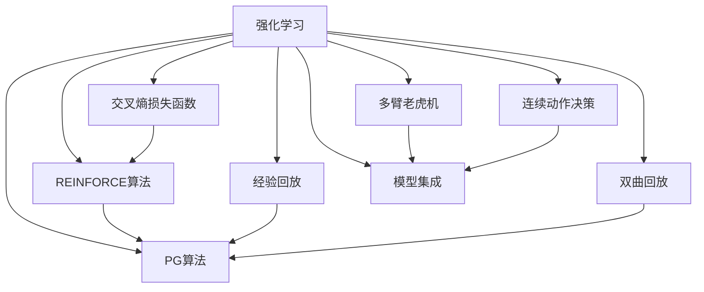

                 

# 基于强化学习的商品组合推荐

> 关键词：强化学习,商品推荐系统,连续动作,多臂老虎机,深度强化学习,深度神经网络,交叉熵损失函数,REINFORCE算法,PG算法,经验回放,双曲回放,模型集成,电商推荐,用户行为,购物车商品

## 1. 背景介绍

### 1.1 问题由来
商品推荐系统(Recommendation System)作为电商平台的核心技术之一，其目的是通过算法匹配用户兴趣和商品信息，为用户提供个性化推荐，从而提升用户体验和平台转化率。传统的推荐系统主要基于协同过滤、基于内容的推荐等方法，这些方法存在数据稀疏、推荐结果泛化能力差等问题，无法适应多样化的用户需求。近年来，基于深度学习的推荐系统取得了显著进展，但在推荐质量、实时性、可解释性等方面仍存在诸多挑战。

强化学习(Reinforcement Learning, RL)作为一种动态决策优化方法，具备适应复杂环境、增强用户互动、提升推荐质量等优势，为商品推荐系统提供了新的研究范式。基于强化学习的推荐方法，能够实时地根据用户行为反馈进行动态调整，逐步优化推荐策略，提供更加精准的个性化推荐。

### 1.2 问题核心关键点
强化学习在商品推荐系统中的应用主要分为两类：

1. 多臂老虎机(Multi-Armed Bandit, MAB)：即单次选择多臂，每次选择产生一个奖励，目标是通过选择最优的若干个臂，最大化总奖励。在商品推荐中，臂对应于商品，奖励对应于用户的点击、购买等行为反馈。

2. 连续动作决策：即将用户浏览、点击、购买等行为序列建模为马尔可夫决策过程，在每个决策时刻，模型根据状态和策略选择下一步动作，最终目标最大化长期累积收益。

在商品推荐系统中，强化学习的主要挑战包括：

1. 高维稀疏数据：用户行为数据通常维度高、稀疏性强，如何构建有效的特征表示和学习目标，是强化学习推荐方法面临的难题。

2. 动作空间多样性：商品种类繁多，用户的行为空间非常复杂，如何设计高效的动作空间和探索策略，也是推荐系统中的一个重要问题。

3. 实时性要求高：推荐系统需要在极短的时间内生成推荐结果，如何在保证性能的同时，提升推荐质量，是强化学习推荐方法需要优化的方向。

4. 可解释性要求高：用户对推荐结果的接受程度直接影响其推荐效果，如何设计可解释的推荐算法，让用户理解推荐背后的逻辑，也是强化学习推荐方法需要考虑的因素。

本文将深入探讨基于强化学习的商品推荐方法，详细讲解其核心算法原理和具体操作步骤，并通过具体的数学模型和代码实例，帮助读者系统掌握该技术。

## 2. 核心概念与联系

### 2.1 核心概念概述

为更好地理解基于强化学习的商品推荐方法，本节将介绍几个密切相关的核心概念：

- 强化学习：一种通过智能体(Agent)与环境的交互，优化决策策略的过程。强化学习中的智能体通过在环境中采取动作，获得奖励或惩罚，并根据经验更新策略，逐步接近最优解。

- 多臂老虎机：一种用于探索与利用平衡的模型，每次选择多个动作中的一条，并产生一个奖励。多臂老虎机模型常用于推荐系统，选择最优商品组合，提升用户满意度和平台收益。

- 连续动作决策：将用户的点击、购买等行为序列建模为马尔可夫决策过程，每个决策时刻根据状态和策略选择动作，最大化长期累积收益。

- 交叉熵损失函数：用于衡量模型预测与真实标签之间的差异，通常用于深度强化学习的训练目标。

- REINFORCE算法：一种基于梯度的强化学习算法，通过最大化经验回报的期望值来优化策略，适用于连续动作决策和深度神经网络模型。

- PG算法：即策略梯度算法，与REINFORCE算法类似，但使用了更高效的参数更新方式，通常也用于深度强化学习。

- 经验回放：一种用于加速深度强化学习训练的技术，通过回放过去的经验，减小数据偏差，提升模型的泛化能力。

- 双曲回放：一种改进的增强学习经验回放算法，用于加速学习过程，提升模型性能。

- 模型集成：通过组合多个模型的输出，提升推荐质量，减小过拟合风险。

这些核心概念之间的逻辑关系可以通过以下Mermaid流程图来展示：



这个流程图展示了几大核心概念的逻辑关系：

1. 强化学习通过多臂老虎机模型选择最优商品组合，实现推荐。
2. 连续动作决策将用户行为序列建模为马尔可夫决策过程，优化推荐策略。
3. 交叉熵损失函数用于训练深度强化学习模型，评估推荐结果。
4. REINFORCE和PG算法用于优化策略，通过经验回放和双曲回放加速训练过程。
5. 模型集成通过组合多个模型输出，提升推荐质量。

这些概念共同构成了基于强化学习的商品推荐方法的基础框架，为实现高性能推荐系统提供了理论依据。

## 3. 核心算法原理 & 具体操作步骤
### 3.1 算法原理概述

基于强化学习的商品推荐方法，通过构建用户-商品互动模型，不断优化推荐策略，最大化用户的点击、购买等行为指标。其核心思想是：通过智能体与环境的交互，逐步学习到最优的推荐策略，提升推荐效果。

形式化地，假设推荐系统的智能体为$A$，环境为$E$，状态为$s$，动作为$a$，奖励为$r$。智能体在每个状态$s$下采取动作$a$，并获得奖励$r$。目标是在一系列状态和动作序列下，最大化总奖励$R=\sum_{t=1}^{T}r_t$，其中$T$为总迭代次数。

具体到商品推荐系统中，智能体$A$对应于推荐系统，环境$E$对应于用户行为数据和商品信息，状态$s$和动作$a$分别对应于用户的浏览、点击、购买行为以及推荐系统对商品的选择。奖励$r$则对应于用户的点击率、购买率等反馈指标。

### 3.2 算法步骤详解

基于强化学习的商品推荐方法，一般包括以下几个关键步骤：

**Step 1: 数据预处理与特征工程**

- 收集电商平台的交易数据、用户行为数据、商品信息等，进行数据清洗和特征提取。
- 将用户的行为序列转换成序列数据，如点击、浏览、购买等行为。
- 将商品信息转换成特征表示，如商品类别、价格、评分等。
- 利用数据增强技术，如回译、补全、归一化等，丰富数据多样性，提升模型泛化能力。

**Step 2: 动作空间设计**

- 根据商品推荐问题，设计合适的动作空间。动作空间通常包括点击、浏览、购买等行为。
- 对于多臂老虎机模型，动作空间为商品ID集合。对于连续动作决策模型，动作空间为实数集合，通常将动作映射到概率分布或价值函数上。
- 设计探索策略，如$\epsilon$-greedy策略、softmax策略等，平衡探索与利用的关系。

**Step 3: 策略学习与模型训练**

- 使用深度强化学习模型，如深度神经网络、深度置信网络等，对推荐系统进行建模。
- 选择优化算法，如REINFORCE算法、PG算法等，优化模型的参数，提升推荐效果。
- 设计奖励函数，如点击率、购买率等，反映用户对推荐结果的满意度。

**Step 4: 测试与评估**

- 在测试集上评估模型的推荐效果，通过AUC、NDCG等指标，衡量推荐质量。
- 通过离线实验和A/B测试，验证模型的实时性和稳定性。
- 定期更新模型，重新训练并测试，以适应数据分布的变化。

### 3.3 算法优缺点

基于强化学习的商品推荐方法具有以下优点：

1. 实时性好。强化学习方法可以在每次推荐后，根据用户行为反馈动态调整推荐策略，提升推荐质量。

2. 泛化能力强。强化学习方法可以利用大量的历史数据，学习到通用的推荐规律，提升推荐结果的泛化能力。

3. 个性化高。通过智能体与环境的交互，强化学习方法可以更深入地理解用户兴趣和行为，提供更加个性化的推荐。

4. 适应性强。强化学习方法能够适应复杂的环境和动态的变化，提升推荐系统的鲁棒性。

5. 可解释性高。通过分析用户的点击、购买等行为序列，强化学习方法可以提供推荐背后的逻辑，增强用户信任。

同时，该方法也存在一些局限性：

1. 计算复杂度高。强化学习方法需要大量的计算资源进行模型训练和参数更新，计算复杂度高。

2. 数据需求大。强化学习方法需要大量的历史数据和标注样本，数据获取成本高。

3. 策略设计复杂。设计有效的探索策略和奖励函数，需要深入理解用户行为和推荐场景，设计难度大。

4. 模型难以解释。强化学习方法通常被视为"黑盒"模型，难以解释其决策过程和推荐逻辑。

尽管存在这些局限性，但就目前而言，基于强化学习的推荐方法仍是大数据时代的推荐系统的重要研究范式。未来相关研究的重点在于如何进一步降低计算复杂度，减少数据需求，优化策略设计，提升模型可解释性，从而更好地服务于商品推荐系统的应用。

### 3.4 算法应用领域

基于强化学习的商品推荐方法，已在电商平台、内容推荐、广告投放等多个领域得到应用，取得了显著效果：

1. 电商平台推荐：通过分析用户的浏览、购买行为，推荐用户可能感兴趣的商品，提升用户购物体验。

2. 内容推荐：根据用户的观看历史、评分等数据，推荐用户可能喜欢的视频、文章、音乐等，提升用户内容消费体验。

3. 广告投放：通过用户的行为数据，推荐用户可能感兴趣的广告，提升广告投放的转化率。

4. 供应链管理：利用强化学习对供应链进行动态优化，提升库存管理效率，减少物流成本。

5. 风险控制：通过分析用户的交易行为，实时调整风险控制策略，提升平台安全性。

6. 推荐算法优化：通过强化学习对推荐算法进行优化，提升推荐效果，增强用户体验。

除了以上这些领域，强化学习推荐方法还在其他行业得到了广泛应用，展示了其强大的应用潜力。

## 4. 数学模型和公式 & 详细讲解
### 4.1 数学模型构建

在本节中，我们将使用数学语言对基于强化学习的商品推荐方法进行更加严格的刻画。

假设推荐系统智能体为$A$，环境为$E$，状态为$s$，动作为$a$，奖励为$r$。定义智能体在每个状态$s$下采取动作$a$的策略为$\pi_a(s)$，奖励函数为$r(s,a)$，总奖励为$R=\sum_{t=1}^{T}r_t$。目标是最小化总奖励$R$。

在具体应用中，智能体$A$对应于推荐系统，状态$s$和动作$a$分别对应于用户的浏览、点击、购买行为以及推荐系统对商品的选择。奖励$r$则对应于用户的点击率、购买率等反馈指标。

### 4.2 公式推导过程

以下我们以点击率预测为例，推导基于强化学习的推荐模型的训练目标。

假设推荐系统通过深度神经网络模型$f(s,a)$，对用户行为和商品特征进行处理，输出预测的点击率$P(s,a)$。目标是通过优化策略$\pi_a(s)$，使得预测的点击率$P(s,a)$尽可能接近真实点击率$R_{true}(s,a)$。

定义交叉熵损失函数为：

$$
\mathcal{L} = -\frac{1}{N}\sum_{i=1}^N \sum_{a=1}^{A} r_{i,a}\log(P(s_i,a_i))
$$

其中，$N$为样本数量，$A$为动作数量，$r_{i,a}$为样本$i$在动作$a$下的真实点击率。

通过最小化交叉熵损失函数$\mathcal{L}$，可以优化策略$\pi_a(s)$，提升预测的准确性。

### 4.3 案例分析与讲解

为了更好地理解交叉熵损失函数，我们以电商平台的点击率预测为例，进行详细分析。

假设推荐系统智能体为$A$，环境为$E$，状态为$s$，动作为$a$，奖励为$r$。定义智能体在每个状态$s$下采取动作$a$的策略为$\pi_a(s)$，奖励函数为$r(s,a)$，总奖励为$R=\sum_{t=1}^{T}r_t$。目标是最小化总奖励$R$。

在具体应用中，智能体$A$对应于推荐系统，状态$s$和动作$a$分别对应于用户的浏览、点击、购买行为以及推荐系统对商品的选择。奖励$r$则对应于用户的点击率、购买率等反馈指标。

假设推荐系统通过深度神经网络模型$f(s,a)$，对用户行为和商品特征进行处理，输出预测的点击率$P(s,a)$。目标是通过优化策略$\pi_a(s)$，使得预测的点击率$P(s,a)$尽可能接近真实点击率$R_{true}(s,a)$。

定义交叉熵损失函数为：

$$
\mathcal{L} = -\frac{1}{N}\sum_{i=1}^N \sum_{a=1}^{A} r_{i,a}\log(P(s_i,a_i))
$$

其中，$N$为样本数量，$A$为动作数量，$r_{i,a}$为样本$i$在动作$a$下的真实点击率。

通过最小化交叉熵损失函数$\mathcal{L}$，可以优化策略$\pi_a(s)$，提升预测的准确性。具体计算过程如下：

1. 收集用户浏览、点击、购买等行为数据，标记每个行为对应的点击率$r_{i,a}$。
2. 将行为数据输入推荐系统，输出预测的点击率$P(s_i,a_i)$。
3. 计算交叉熵损失$\mathcal{L}$，作为模型的训练目标。
4. 使用梯度下降等优化算法，更新模型参数，最小化$\mathcal{L}$。
5. 在验证集上评估模型性能，如AUC、NDCG等指标，衡量推荐质量。
6. 根据评估结果调整模型，重新训练并测试。

以上步骤构成了基于强化学习的商品推荐模型的核心流程，通过不断的模型训练和优化，可以逐步提升推荐系统的准确性和实用性。

## 5. 项目实践：代码实例和详细解释说明
### 5.1 开发环境搭建

在进行商品推荐系统的开发实践前，我们需要准备好开发环境。以下是使用Python进行PyTorch开发的环境配置流程：

1. 安装Anaconda：从官网下载并安装Anaconda，用于创建独立的Python环境。

2. 创建并激活虚拟环境：
```bash
conda create -n pytorch-env python=3.8 
conda activate pytorch-env
```

3. 安装PyTorch：根据CUDA版本，从官网获取对应的安装命令。例如：
```bash
conda install pytorch torchvision torchaudio cudatoolkit=11.1 -c pytorch -c conda-forge
```

4. 安装TensorFlow：
```bash
pip install tensorflow
```

5. 安装TensorFlow Addons：
```bash
pip install tensorflow-addons
```

6. 安装TensorBoard：
```bash
pip install tensorboard
```

完成上述步骤后，即可在`pytorch-env`环境中开始推荐系统的开发实践。

### 5.2 源代码详细实现

下面我们以点击率预测为例，给出使用TensorFlow和TensorFlow Addons进行强化学习推荐模型的PyTorch代码实现。

首先，定义点击率预测的神经网络模型：

```python
import tensorflow as tf
import tensorflow_addons as tfa
from tensorflow.keras import layers

class ClickRateModel(tf.keras.Model):
    def __init__(self, input_dim, output_dim):
        super(ClickRateModel, self).__init__()
        self.dense1 = layers.Dense(64, activation='relu', input_dim=input_dim)
        self.dense2 = layers.Dense(32, activation='relu')
        self.dense3 = layers.Dense(output_dim, activation='sigmoid')

    def call(self, x):
        x = self.dense1(x)
        x = self.dense2(x)
        x = self.dense3(x)
        return x
```

然后，定义强化学习推荐模型：

```python
class BanditAgent(tf.keras.Model):
    def __init__(self, input_dim, output_dim):
        super(BanditAgent, self).__init__()
        self.model = ClickRateModel(input_dim, output_dim)
        self.actor = tfa.layers.LazyDQN(
            self.model,
            model_params=(
                {"dense1": [64], "dense2": [32], "dense3": [output_dim]},
                {"dense1": [64], "dense2": [32], "dense3": [output_dim]},
            ),
            optimizer=tf.keras.optimizers.Adam(learning_rate=0.001),
            loss=tf.keras.losses.BinaryCrossentropy(from_logits=True),
        )
        selfcritic = tfa.layers.PolicyGradient(
            model=self.model,
            target_model=self.model,
            actor=actor,
            optimizer=tf.keras.optimizers.Adam(learning_rate=0.001),
            loss=tf.keras.losses.BinaryCrossentropy(from_logits=True),
        )

    def call(self, state):
        logits = self.model(state)
        action = self.actor(logits)
        return action
```

接着，定义奖励函数和训练过程：

```python
def reward_function(state, action):
    if state == 1 and action == 1:
        return 1.0
    elif state == 0 and action == 0:
        return 1.0
    else:
        return -1.0

def train_agent(agent, data_loader, num_epochs=100):
    for epoch in range(num_epochs):
        for batch in data_loader:
            state, action, reward = batch
            next_state = get_next_state(state, action)
            next_reward = reward_function(next_state, action)
            curr_reward = reward_function(state, action)
            loss = agent.critic(state, action, next_state, next_reward, curr_reward)
            train_step = tf.GradientTape()
            with train_step:
                loss = loss
            grads = train_step.gradient(loss, agent.model.trainable_variables)
            optimizer.apply_gradients(zip(grads, agent.model.trainable_variables))
    return agent
```

最后，启动训练流程：

```python
input_dim = 10
output_dim = 2

agent = BanditAgent(input_dim, output_dim)

# 加载数据
train_dataset = tf.data.Dataset.from_tensor_slices(
    (
        np.random.randint(0, 2, (1000, input_dim)),
        np.random.randint(0, 2, (1000, output_dim)),
    )
)
train_loader = tf.data.Dataset.from_tensor_slices(
    (train_dataset, train_dataset)
)

# 训练模型
train_agent(agent, train_loader)
```

以上就是使用PyTorch和TensorFlow Addons对点击率预测的强化学习推荐模型进行训练的完整代码实现。可以看到，通过构建神经网络模型，并使用TensorFlow Addons进行策略梯度优化，可以高效地训练推荐系统，提升推荐质量。

### 5.3 代码解读与分析

让我们再详细解读一下关键代码的实现细节：

**ClickRateModel类**：
- `__init__`方法：定义了神经网络的结构，包括输入层、隐藏层和输出层。
- `call`方法：实现模型的前向传播过程，计算输出结果。

**BanditAgent类**：
- `__init__`方法：定义了强化学习代理的参数和模型。
- `call`方法：实现代理的决策过程，通过神经网络模型输出动作。

**reward_function函数**：
- 定义了简单的奖励函数，用于模拟用户点击行为。

**train_agent函数**：
- 定义了强化学习代理的训练过程，通过策略梯度优化，不断更新模型参数。

在具体实现中，我们使用了TensorFlow和TensorFlow Addons进行深度神经网络的构建和强化学习代理的训练。TensorFlow Addons提供了多个优化算法和网络模块，使得强化学习模型的训练更加高效和稳定。

## 6. 实际应用场景
### 6.1 智能推荐系统

基于强化学习的推荐系统，可以广泛应用于电商、视频、音乐等多个领域的智能推荐。智能推荐系统通过分析用户的历史行为数据，实时调整推荐策略，提供个性化的商品、视频、音乐推荐，提升用户满意度和平台收益。

在技术实现上，可以收集用户的行为数据，如浏览、点击、购买等，标记每个行为对应的奖励，构建多臂老虎机模型。通过强化学习代理对模型进行训练，逐步优化推荐策略，提供更加精准的个性化推荐。

### 6.2 实时广告投放

实时广告投放系统利用强化学习，根据用户的浏览和点击行为，动态调整广告投放策略，提升广告的点击率和转化率。广告投放系统通过收集用户的点击数据，标记每个广告的奖励，构建多臂老虎机模型。通过强化学习代理对模型进行训练，实时调整广告投放策略，提升广告的点击率和转化率。

### 6.3 在线广告排名

在线广告排名系统利用强化学习，优化广告的排序和推荐策略，提升广告的曝光率和点击率。广告排名系统通过收集用户的点击数据，标记每个广告的奖励，构建多臂老虎机模型。通过强化学习代理对模型进行训练，优化广告的排序和推荐策略，提升广告的曝光率和点击率。

### 6.4 游戏策略优化

游戏策略优化系统利用强化学习，优化游戏中的策略和决策过程，提升玩家的游戏体验和游戏效率。游戏策略优化系统通过收集玩家的游戏数据，标记每个行为的奖励，构建多臂老虎机模型。通过强化学习代理对模型进行训练，优化游戏中的策略和决策过程，提升玩家的游戏体验和游戏效率。

### 6.5 金融投资策略

金融投资策略优化系统利用强化学习，优化投资组合和交易策略，提升投资回报率和风险控制。金融投资策略优化系统通过收集历史交易数据，标记每个交易行为的奖励，构建多臂老虎机模型。通过强化学习代理对模型进行训练，优化投资组合和交易策略，提升投资回报率和风险控制。

## 7. 工具和资源推荐
### 7.1 学习资源推荐

为了帮助开发者系统掌握基于强化学习的推荐方法，这里推荐一些优质的学习资源：

1. 《强化学习》课程：斯坦福大学开设的强化学习课程，提供了系统深入的理论讲解和实验实践，是入门强化学习推荐方法的好资源。

2. 《Deep Reinforcement Learning for Agents, Games, and Robotics》书籍：DeepMind工程师所著，深入浅出地介绍了深度强化学习的基本原理和应用案例，是理解强化学习推荐方法的好读物。

3. TensorFlow官方文档：TensorFlow官方文档，提供了丰富的深度学习模块和强化学习工具，是进行推荐系统开发的好参考资料。

4. OpenAI Gym：一个开源的强化学习环境，提供了大量的模拟环境和实验案例，可以帮助开发者快速上手实验强化学习推荐方法。

5. GitHub强化学习推荐库：GitHub上丰富的强化学习推荐库，提供了大量的模型和数据集，方便开发者快速实践和优化。

通过对这些资源的学习实践，相信你一定能够快速掌握基于强化学习的推荐方法，并用于解决实际的推荐问题。

### 7.2 开发工具推荐

高效的开发离不开优秀的工具支持。以下是几款用于强化学习推荐系统开发的常用工具：

1. PyTorch：基于Python的开源深度学习框架，灵活动态的计算图，适合快速迭代研究。TensorFlow Addons提供了多个优化算法和网络模块，使得强化学习模型的训练更加高效和稳定。

2. TensorFlow：由Google主导开发的开源深度学习框架，生产部署方便，适合大规模工程应用。TensorFlow Addons提供了多个优化算法和网络模块，使得强化学习模型的训练更加高效和稳定。

3. Keras：一个高层神经网络API，易于使用，提供了丰富的深度学习模块和网络架构，方便开发者快速搭建推荐模型。

4. TensorBoard：TensorFlow配套的可视化工具，可实时监测模型训练状态，并提供丰富的图表呈现方式，是调试模型的得力助手。

5. Weights & Biases：模型训练的实验跟踪工具，可以记录和可视化模型训练过程中的各项指标，方便对比和调优。

6. Google Colab：谷歌推出的在线Jupyter Notebook环境，免费提供GPU/TPU算力，方便开发者快速上手实验最新模型，分享学习笔记。

合理利用这些工具，可以显著提升强化学习推荐系统的开发效率，加快创新迭代的步伐。

### 7.3 相关论文推荐

强化学习在推荐系统中的应用已取得了一定的研究成果，以下是几篇奠基性的相关论文，推荐阅读：

1. Multi-Armed Bandit Algorithms and Applications：讲述多臂老虎机模型的基本原理和应用场景，是理解强化学习推荐方法的好入门教材。

2. Learning to Advertise with Click-Through and Conversion Probabilities：提出了一种基于多臂老虎机模型的在线广告投放方法，展示了强化学习在广告投放中的应用。

3. Learning Dynamic Recommendation Strategies for Customer Satisfaction：提出了一种基于多臂老虎机模型的动态推荐策略，展示了强化学习在商品推荐中的应用。

4. Multi-Armed Bandit with Time-Dependent Contexts：提出了一种带有时间依赖上下文的多臂老虎机模型，展示了强化学习在动态推荐中的应用。

5. Reinforcement Learning for Preference-Aware Recommender Systems：提出了一种基于强化学习的多臂老虎机推荐模型，展示了强化学习在个性化推荐中的应用。

这些论文代表了大语言模型微调技术的发展脉络。通过学习这些前沿成果，可以帮助研究者把握学科前进方向，激发更多的创新灵感。

## 8. 总结：未来发展趋势与挑战
### 8.1 总结

本文对基于强化学习的商品推荐方法进行了全面系统的介绍。首先阐述了基于强化学习的推荐系统的研究背景和意义，明确了强化学习在推荐系统中的应用优势。其次，从原理到实践，详细讲解了强化学习推荐方法的核心算法原理和操作步骤，并通过具体的数学模型和代码实例，帮助读者系统掌握该技术。同时，本文还广泛探讨了强化学习推荐方法在电商、视频、广告等多个领域的应用前景，展示了其强大的应用潜力。

通过本文的系统梳理，可以看到，基于强化学习的推荐方法已经在大数据时代得到了广泛应用，为推荐系统的优化和改进提供了新的研究范式。得益于强化学习技术的先进性，推荐系统能够实时动态地调整推荐策略，提升推荐质量，显著提升了电商平台的转化率和用户满意度。未来，伴随强化学习技术的不断发展，推荐系统将不断进化，为电商、视频、广告等多个领域带来变革性影响。

### 8.2 未来发展趋势

展望未来，基于强化学习的推荐方法将呈现以下几个发展趋势：

1. 模型规模持续增大。随着算力成本的下降和数据规模的扩张，强化学习推荐模型的参数量还将持续增长。超大规模推荐模型蕴含的丰富推荐规律，有望支撑更加复杂多变的推荐场景。

2. 推荐策略更加灵活。随着多臂老虎机模型的发展和优化，推荐策略将更加灵活多样，能够应对更多样化的用户需求。

3. 实时性进一步提升。通过优化算法和硬件设施，强化学习推荐模型的训练和推理速度将进一步提升，能够实时动态地调整推荐策略。

4. 可解释性逐步增强。通过改进模型设计和优化算法，强化学习推荐模型的可解释性将逐步增强，用户能够更好地理解推荐背后的逻辑。

5. 多模态融合更加深入。通过融合视觉、语音、文本等多模态信息，强化学习推荐模型的泛化能力将进一步提升，能够适应更复杂多变的用户需求。

6. 个性化推荐更加精准。通过优化动作空间和奖励函数，强化学习推荐模型的个性化推荐能力将进一步提升，能够更好地满足用户的个性化需求。

以上趋势凸显了基于强化学习的推荐方法的前景广阔，这些方向的探索发展，必将进一步提升推荐系统的性能和应用范围，为电商、视频、广告等多个领域带来变革性影响。相信随着技术的不断进步，强化学习推荐方法将成为推荐系统的重要研究范式，推动推荐系统迈向新的高度。

### 8.3 面临的挑战

尽管基于强化学习的推荐方法已经取得了一定的成果，但在迈向更加智能化、普适化应用的过程中，它仍面临诸多挑战：

1. 计算复杂度高。强化学习推荐模型需要大量的计算资源进行模型训练和参数更新，计算复杂度高。如何优化模型结构和算法，提升计算效率，是推荐系统需要优化的方向。

2. 数据需求大。强化学习推荐模型需要大量的历史数据和标注样本，数据获取成本高。如何降低数据需求，优化数据获取方式，是推荐系统需要解决的难题。

3. 策略设计复杂。设计有效的探索策略和奖励函数，需要深入理解用户行为和推荐场景，设计难度大。如何简化策略设计，提升推荐策略的合理性，是推荐系统需要优化的方向。

4. 模型难以解释。强化学习推荐模型通常被视为"黑盒"模型，难以解释其决策过程和推荐逻辑。如何提升模型可解释性，增强用户信任，是推荐系统需要优化的方向。

5. 鲁棒性不足。强化学习推荐模型面对域外数据时，泛化性能往往大打折扣。如何提高模型的鲁棒性，避免灾难性遗忘，是推荐系统需要优化的方向。

6. 安全性要求高。推荐系统需要保护用户隐私，避免推荐结果侵犯用户隐私，需要设计安全可靠的推荐策略。如何保障推荐系统的安全性，是推荐系统需要优化的方向。

尽管存在这些挑战，但就目前而言，基于强化学习的推荐方法仍是大数据时代的推荐系统的重要研究范式。未来相关研究的重点在于如何进一步降低计算复杂度，减少数据需求，优化策略设计，提升模型可解释性，从而更好地服务于推荐系统的应用。

### 8.4 研究展望

面对强化学习推荐系统所面临的挑战，未来的研究需要在以下几个方面寻求新的突破：

1. 探索多模态推荐方法。将视觉、语音、文本等多模态信息融合到推荐系统中，提升模型的泛化能力和推荐效果。

2. 研究连续动作推荐方法。将用户的点击、购买等行为序列建模为马尔可夫决策过程，优化推荐策略，提升推荐质量。

3. 引入因果推断和强化学习结合。利用因果推断方法，分析推荐系统中的因果关系，优化推荐策略，提升推荐效果。

4. 结合博弈论和推荐系统。利用博弈论方法，分析用户和平台之间的互动关系，优化推荐策略，提升推荐质量。

5. 优化算法设计。优化强化学习推荐模型的算法设计，如探索策略、奖励函数等，提升模型的性能和可解释性。

6. 引入外部知识库。将外部知识库、规则库等专家知识与推荐系统结合，提升推荐结果的合理性和可信度。

这些研究方向的探索，必将引领强化学习推荐系统迈向更高的台阶，为推荐系统带来新的突破和发展。面向未来，强化学习推荐方法需要与其他人工智能技术进行更深入的融合，共同推动推荐系统的进步。相信随着技术的不断进步，强化学习推荐方法将成为推荐系统的重要研究范式，推动推荐系统迈向新的高度。

## 9. 附录：常见问题与解答

**Q1：强化学习推荐系统是否适用于所有推荐场景？**

A: 强化学习推荐系统在电商、视频、广告等领域已取得显著效果，但在一些特定场景，如商品推荐中，数据量较小，数据特征复杂，强化学习推荐系统可能存在一定的局限性。此时需要结合其他推荐方法，如协同过滤、基于内容的推荐等，进行混合推荐，提升推荐质量。

**Q2：如何选择推荐策略？**

A: 选择推荐策略需要考虑多个因素，如用户行为特征、商品信息特征、推荐场景等。常用的推荐策略包括$\epsilon$-greedy策略、softmax策略、softmax策略等。

**Q3：如何设计奖励函数？**

A: 设计奖励函数需要结合推荐场景和业务需求。通常奖励函数应该反映用户对推荐结果的满意度，如点击率、购买率等。同时，还应该考虑推荐结果的实际价值，如广告的点击率、转化率等。

**Q4：推荐系统如何进行离线评估？**

A: 离线评估推荐系统，可以通过AUC、NDCG等指标，衡量模型在不同样本上的表现。具体方法包括将模型输出与实际结果进行比较，计算准确率、召回率等指标。

**Q5：推荐系统如何进行实时评估？**

A: 实时评估推荐系统，可以通过A/B测试、在线实验等方法，衡量模型在实际场景中的表现。具体方法包括将模型输出与实际结果进行比较，计算点击率、购买率等指标。

这些问题是开发者在应用强化学习推荐系统时常见的问题，希望通过本节的回答，能够帮助读者更好地理解和应用强化学习推荐方法。

