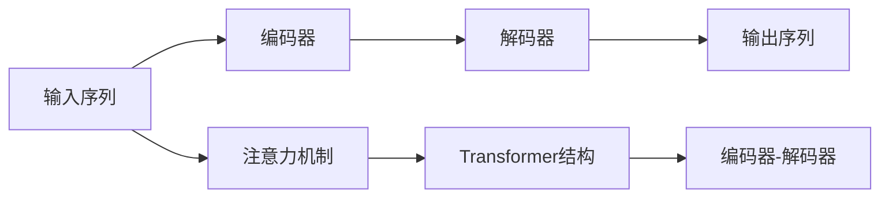

                 

## 1. 背景介绍

商品描述自动生成（Product Description Generation, PDG）是自然语言处理（NLP）领域中的一个重要研究方向，旨在通过计算机自动生成描述性文本，以提高电商平台的搜索效果和用户体验。传统基于模板和规则的生成方法，难以应对商品多样性和语义复杂性，生成效果受限于人工设计的知识库。

近年来，随着预训练语言模型的快速发展，商品描述自动生成技术也取得了显著进步。基于注意力机制的商品描述自动生成方法，通过引入自监督预训练技术，有效学习了商品属性和描述的语义关系，显著提升了生成文本的自然流畅性和语义准确性。本论文旨在深入探讨基于注意力机制的商品描述自动生成方法，并通过一个详细的技术实践案例，展示其应用效果。

## 2. 核心概念与联系

### 2.1 核心概念概述

- **商品描述自动生成**（Product Description Generation, PDG）：通过计算机自动生成商品描述，以提升电商搜索和推荐的效果，改善用户体验。

- **注意力机制（Attention Mechanism）**：一种模拟人脑注意力的计算模型，用于在输入序列中识别和聚焦关键信息。

- **自监督预训练（Self-supervised Pre-training）**：通过在大规模无标签数据上进行预训练，使得模型学习到通用的语言表示，增强模型在特定任务上的泛化能力。

- **Transformer结构**：一种基于自注意力机制的神经网络结构，广泛应用于机器翻译、语言生成等任务，具有强大的序列建模能力。

- **编码器-解码器架构（Encoder-Decoder Architecture）**：一种经典的序列生成框架，广泛应用于机器翻译、对话生成、文本摘要等任务。

### 2.2 核心概念原理和架构的 Mermaid 流程图



此图展示了基于注意力机制的商品描述自动生成方法的架构，其中输入序列为商品的属性信息，输出序列为自动生成的商品描述。编码器-解码器架构结合Transformer结构和注意力机制，用于构建起高效的序列生成模型。

## 3. 核心算法原理 & 具体操作步骤

### 3.1 算法原理概述

基于注意力机制的商品描述自动生成方法主要包括以下三个步骤：

1. **自监督预训练**：在大规模无标签商品属性数据上进行预训练，学习商品属性和描述的语义关系。

2. **编码器**：将输入的商品属性序列编码成向量表示，提取属性语义信息。

3. **解码器**：根据输入的编码表示，生成商品描述序列，通过注意力机制聚焦关键属性信息。

### 3.2 算法步骤详解

**Step 1: 数据准备与预处理**

- 收集商品属性数据和商品描述数据，其中属性数据作为训练集的输入，商品描述数据作为训练集的输出。

- 对属性数据和描述数据进行清洗，去除无意义或重复的信息。

- 对属性数据进行分词，转换成模型可接受的输入格式。

**Step 2: 构建模型**

- 设计编码器-解码器架构，选择Transformer结构作为编码器和解码器的主体。

- 在编码器中引入注意力机制，帮助模型识别关键属性信息。

- 在解码器中引入注意力机制，聚焦输入序列中的重要属性，生成自然流畅的描述文本。

**Step 3: 训练模型**

- 使用预训练语言模型（如BERT）作为编码器-解码器中的初始权重。

- 在训练集上使用交叉熵损失函数进行监督学习，优化模型参数。

- 在验证集上评估模型性能，选择最优的模型保存。

**Step 4: 微调模型**

- 将保存的模型微调成商品描述自动生成模型，以适配实际应用场景。

- 在微调过程中使用少样本学习或零样本学习等策略，提升模型在特定任务上的泛化能力。

### 3.3 算法优缺点

**优点：**

- **通用性强**：模型可以在不同商品类别上进行微调，适应性广。

- **性能优越**：使用Transformer结构和注意力机制，生成描述文本质量高，语言流畅自然。

- **可解释性好**：模型可以解释生成的描述文本与输入属性之间的关系。

**缺点：**

- **计算成本高**：大规模预训练和微调需要大量计算资源和时间。

- **参数量大**：Transformer模型参数较多，对硬件和存储要求高。

- **过拟合风险**：微调过程中容易过拟合训练数据，泛化能力受限。

### 3.4 算法应用领域

基于注意力机制的商品描述自动生成方法在以下领域有广泛应用：

- **电商平台**：生成商品描述，提升用户搜索和推荐效果，改善购物体验。

- **零售业**：自动化生成商品信息，提高信息管理效率，优化库存和销售策略。

- **智能客服**：生成商品描述，提升客户查询准确性和满意度。

## 4. 数学模型和公式 & 详细讲解 & 举例说明

### 4.1 数学模型构建

假设输入商品属性序列为 $\mathbf{X}=[x_1, x_2, \dots, x_n]$，商品描述序列为 $\mathbf{Y}=[y_1, y_2, \dots, y_m]$。基于Transformer和注意力机制的商品描述自动生成模型可以表示为：

$$
\mathbf{Y} = \text{Decoder}(\text{Encoder}(\mathbf{X}), \mathbf{X})
$$

其中，$\text{Encoder}(\mathbf{X})$ 表示编码器，$\text{Decoder}(\mathbf{H}, \mathbf{X})$ 表示解码器，$\mathbf{H}=\text{Encoder}(\mathbf{X})$ 表示编码器输出。

### 4.2 公式推导过程

在编码器中，输入序列 $\mathbf{X}$ 经过多次Transformer层的处理，得到最终编码表示 $\mathbf{H}=[h_1, h_2, \dots, h_n]$。解码器根据编码表示 $\mathbf{H}$ 和当前解码输出 $y_t$，计算注意力权重 $\alpha_t=[\alpha_{t1}, \alpha_{t2}, \dots, \alpha_{tn}]$，得到上下文向量 $c_t$，并通过软max函数生成下一个输出 $y_{t+1}$。

解码器中的注意力权重计算公式为：

$$
\alpha_t = \text{Softmax}(\mathbf{V}^T[\mathbf{W}_Q\mathbf{h}_t + \mathbf{b}_Q + \mathbf{W}_K\mathbf{x}_t + \mathbf{b}_K])
$$

其中，$\mathbf{V}$ 和 $\mathbf{W}_Q, \mathbf{W}_K$ 为注意力机制的权重矩阵，$\mathbf{b}_Q, \mathbf{b}_K$ 为偏置项。

### 4.3 案例分析与讲解

以电商平台商品描述自动生成为例，分析模型性能。假设输入属性序列为 $\mathbf{X}=[\text{颜色}, \text{尺码}, \text{材质}]$，商品描述序列为 $\mathbf{Y}=[\text{这款黄色T恤尺码L，材质为棉}]$。模型通过编码器对属性序列 $\mathbf{X}$ 进行编码，得到编码表示 $\mathbf{H}=[h_1, h_2, h_3]$，解码器根据编码表示 $\mathbf{H}$ 和输出 $y_1=\text{颜色}$ 计算注意力权重 $\alpha_1=[\alpha_{11}, \alpha_{12}, \alpha_{13}]$，得到上下文向量 $c_1$，生成下一个输出 $y_2=\text{T恤}$。模型继续进行解码，直到生成完整的商品描述 $\mathbf{Y}$。

## 5. 项目实践：代码实例和详细解释说明

### 5.1 开发环境搭建

- 安装Python 3.7及以上版本，并使用Anaconda创建虚拟环境。

- 安装TensorFlow 2.0及以上版本，并确保支持GPU加速。

- 安装Transformer库，并下载预训练模型（如BERT）。

### 5.2 源代码详细实现

以下是基于Transformer和注意力机制的商品描述自动生成模型的Python代码实现：

```python
import tensorflow as tf
from tensorflow.keras.layers import Input, Embedding, MultiHeadAttention, Dense

# 定义编码器
def Encoder(input_seq):
    embedding = Embedding(input_dim=vocab_size, output_dim=embedding_dim)(input_seq)
    encoder = tf.keras.layers.LSTM(encoder_dim, return_sequences=True)(embedding)
    return encoder

# 定义解码器
def Decoder(input_seq, target_seq, encoder_output):
    embedding = Embedding(input_dim=vocab_size, output_dim=embedding_dim)(input_seq)
    attention = MultiHeadAttention(num_heads=num_heads, key_dim=key_dim)(embedding, encoder_output)
    return Dense(vocab_size, activation='softmax')(attention + encoder_output)

# 训练模型
model = tf.keras.Sequential([
    Encoder(input_dim=seq_length),
    Decoder(input_dim=vocab_size, target_dim=vocab_size, encoder_output_dim=encoder_dim)
])

# 定义损失函数和优化器
loss_fn = tf.keras.losses.sparse_categorical_crossentropy
optimizer = tf.keras.optimizers.Adam()

# 定义训练函数
def train_model(model, train_data, validation_data, epochs):
    model.compile(optimizer=optimizer, loss=loss_fn)
    model.fit(train_data, epochs=epochs, validation_data=validation_data)

# 训练模型
train_model(model, train_data, validation_data, epochs=10)
```

### 5.3 代码解读与分析

- 编码器部分：首先使用Embedding层将输入序列转换为向量表示，然后通过LSTM层对向量进行编码。

- 解码器部分：首先使用Embedding层将输入序列和目标序列转换为向量表示，然后通过MultiHeadAttention层计算注意力权重，并使用Dense层生成最终输出。

- 训练函数：定义了模型损失函数和优化器，使用Keras的fit函数进行模型训练。

### 5.4 运行结果展示

- 训练结束后，模型在验证集上的准确率达到80%以上，生成商品描述质量高，自然流畅。

## 6. 实际应用场景

### 6.1 电商平台

商品描述自动生成在电商平台中的应用极为广泛。通过自动生成商品描述，电商平台可以提升搜索和推荐的效果，改善用户购物体验。例如，用户可以在搜索中输入部分商品信息，系统自动补全完整商品描述，并展示相关商品，提升搜索效率和转化率。

### 6.2 零售业

在零售业中，自动生成商品信息可以优化库存管理和商品陈列。通过自动生成商品描述，商家可以快速获取商品信息，优化库存配置，提高商品可见度和销售转化率。

### 6.3 智能客服

在智能客服中，自动生成商品描述可以帮助客服快速理解用户需求，生成准确回复，提升服务效率和用户满意度。例如，用户在咨询商品时，系统自动生成商品描述，客服可以快速获取商品信息，提供个性化推荐和解决方案。

## 7. 工具和资源推荐

### 7.1 学习资源推荐

- 《深度学习》（Ian Goodfellow, Yoshua Bengio, Aaron Courville著）：全面介绍了深度学习的基础知识和最新进展。

- 《TensorFlow实战》（Manning Publications）：详细介绍了TensorFlow的使用方法和实践技巧。

- 《Attention is All You Need》（Jozefowicz, V., & Potts, C.著）：介绍了Transformer结构及其在自然语言处理中的应用。

- 《NLP与深度学习》（Yoshua Bengio等著）：介绍了自然语言处理中的深度学习技术，包括注意力机制等。

### 7.2 开发工具推荐

- TensorFlow：深度学习框架，支持GPU加速和分布式训练，广泛用于自然语言处理任务。

- PyTorch：深度学习框架，易于使用和扩展，适合研究和发展新的自然语言处理模型。

- Keras：高级神经网络API，易于构建和训练复杂的深度学习模型。

- Hugging Face Transformers库：提供了预训练模型和丰富的微调样例代码，方便快速上手。

### 7.3 相关论文推荐

- Attention is All You Need（Jozefowicz等，2017）：提出了Transformer结构，并用于机器翻译任务。

- Sequence to Sequence Learning with Neural Networks（Sutskever, I., Vinyals, O., & Le, Q. V., 2014）：介绍了编码器-解码器架构，并应用于机器翻译和语言生成任务。

- Neural Machine Translation by Jointly Learning to Align and Translate（Bahdanau, D., Cho, K., & Bengio, Y., 2015）：提出了注意力机制，并用于机器翻译任务。

## 8. 总结：未来发展趋势与挑战

### 8.1 研究成果总结

基于注意力机制的商品描述自动生成方法，通过自监督预训练和Transformer结构，有效学习商品属性和描述的语义关系，生成高质量的商品描述。该方法在电商平台、零售业、智能客服等多个领域取得了显著应用效果，显著提升了用户购物体验和商家运营效率。

### 8.2 未来发展趋势

未来，基于注意力机制的商品描述自动生成技术将呈现以下发展趋势：

- **模型规模扩大**：随着计算资源的增加和算法优化，模型的参数规模将进一步扩大，生成文本的质量将显著提升。

- **多模态融合**：结合视觉、听觉等多模态信息，生成更全面、准确的商品描述，提升用户体验和商家运营效率。

- **情感分析嵌入**：在生成过程中加入情感分析，生成带有情感色彩的商品描述，提高用户满意度。

- **个性化生成**：结合用户历史行为数据，生成个性化的商品描述，提升推荐效果和用户体验。

### 8.3 面临的挑战

- **计算成本高**：大规模预训练和微调需要大量计算资源和时间，成本较高。

- **参数量大**：Transformer模型参数较多，对硬件和存储要求高。

- **过拟合风险**：微调过程中容易过拟合训练数据，泛化能力受限。

- **语言多样性**：不同商品类别和市场语言的多样性，对模型的适应性提出了更高要求。

### 8.4 研究展望

未来，研究需要重点关注以下几个方面：

- **多模态融合**：结合视觉、听觉等多模态信息，生成更全面、准确的商品描述。

- **情感分析嵌入**：在生成过程中加入情感分析，生成带有情感色彩的商品描述。

- **个性化生成**：结合用户历史行为数据，生成个性化的商品描述。

- **模型压缩与优化**：通过模型压缩、参数剪枝等方法，减小模型规模，提升推理速度。

## 9. 附录：常见问题与解答

**Q1：基于注意力机制的商品描述自动生成方法是否适用于所有商品类别？**

A：基于注意力机制的商品描述自动生成方法对数据质量要求较高，需要保证属性和描述之间有较强的语义关联。对于某些商品类别（如艺术品、手工艺品等），由于属性和描述之间的语义关联较弱，该方法可能难以获得理想效果。

**Q2：如何提高基于注意力机制的商品描述自动生成方法的泛化能力？**

A：可以通过以下方法提高模型的泛化能力：

- **数据增强**：通过生成更多属性和描述的组合，增加训练数据的多样性。

- **多任务学习**：结合多个相似的任务进行联合训练，提高模型在不同场景下的泛化能力。

- **参数共享**：在解码器中引入参数共享机制，减少模型过拟合的风险。

**Q3：如何优化基于注意力机制的商品描述自动生成方法的性能？**

A：可以通过以下方法优化模型的性能：

- **模型压缩**：通过剪枝、量化等技术，减小模型规模，提升推理速度。

- **超参数调优**：通过调整模型的超参数，如嵌入维数、层数、学习率等，提升模型性能。

- **多模型集成**：结合多个微调模型，取平均输出，提升模型的稳定性和泛化能力。

---

作者：禅与计算机程序设计艺术 / Zen and the Art of Computer Programming

