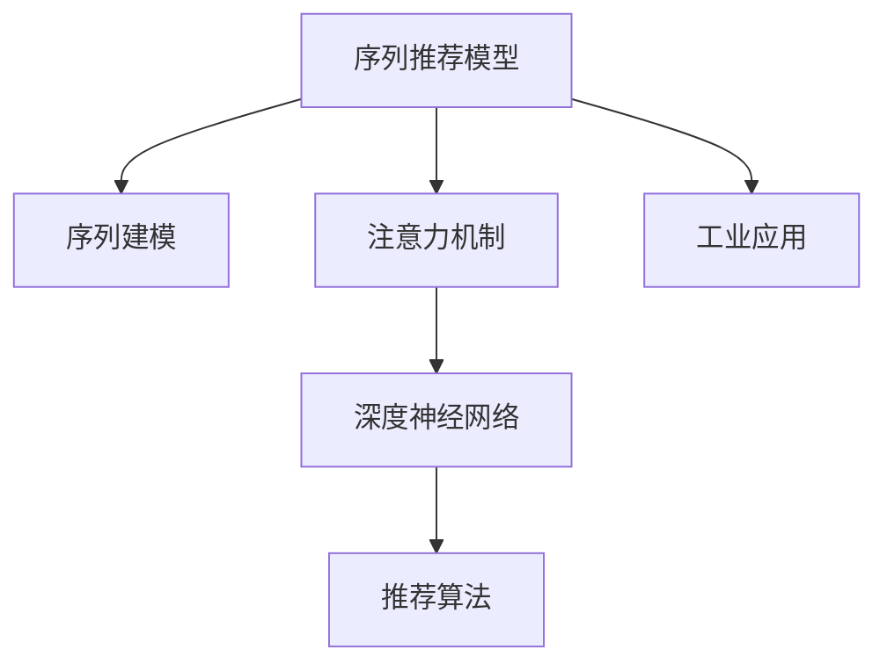

                 

# 基于注意力机制的序列化推荐模型

> 关键词：推荐系统,注意力机制,序列模型,序列预测,深度学习,推荐算法,工业应用

## 1. 背景介绍

### 1.1 问题由来

推荐系统是互联网时代的重要应用之一，旨在根据用户的历史行为和兴趣，推荐符合其需求的商品、内容或服务。传统推荐算法如基于协同过滤、基于内容的推荐等，在早期取得了一定的成效。但随着数据的爆炸性增长和用户需求的复杂化，这些方法的局限性逐渐显现。

首先，传统推荐算法往往需要大量的用户行为数据和商品特征数据，对数据质量和数据量的要求较高。对于冷启动用户或冷门商品，难以获取有效的推荐结果。

其次，传统推荐算法缺乏对用户行为序列的建模。在推荐过程中，用户的行为往往是一个连续的时序序列，如浏览历史、点击序列、购买历史等。这些序列蕴含了用户行为背后的深层次逻辑，可以更好地刻画用户的兴趣和需求。

基于这些挑战，近年兴起的深度学习推荐系统逐步成为新的研究热点。尤其是基于注意力机制的推荐模型，因其能够有效建模用户序列数据，捕获序列中各时序点之间的关系，从而在推荐性能上取得了显著提升。

### 1.2 问题核心关键点

基于注意力机制的序列推荐模型主要包含以下几个关键点：

1. **序列建模**：建模用户行为序列的时序特征，捕捉序列中各时序点之间的关系。
2. **注意力机制**：通过引入注意力机制，对序列中的各个时序点进行加权处理，提升模型对关键时序点的关注度。
3. **深度学习**：利用深度神经网络，对用户序列数据进行编码，并学习复杂的序列表示。
4. **推荐算法**：将序列表示转化为推荐结果，具体算法包括点击率预测、召回率排序等。
5. **工业应用**：结合实际业务场景，将序列推荐模型应用于电商、视频、音乐等领域，提升用户体验和业务收益。

本文将深入探讨基于注意力机制的序列推荐模型，介绍其核心算法原理、具体操作步骤、数学模型和公式推导，并通过代码实例详细讲解其实现方法。

## 2. 核心概念与联系

### 2.1 核心概念概述

为更好地理解基于注意力机制的序列推荐模型，本节将介绍几个密切相关的核心概念：

1. **序列推荐模型**：利用序列建模，对用户行为序列进行编码，提取序列特征的推荐模型。
2. **注意力机制**：通过引入注意力权重，对序列中各时序点进行加权处理，提升模型对关键时序点的关注度。
3. **深度神经网络**：利用多层神经网络，对序列数据进行深度表示，捕捉复杂的序列关系。
4. **推荐算法**：将序列表示转化为推荐结果，包括点击率预测、召回率排序等。
5. **工业应用**：将推荐模型应用于实际业务场景，如电商推荐、视频推荐等，提升用户体验和业务收益。

这些核心概念之间的逻辑关系可以通过以下Mermaid流程图来展示：



这个流程图展示了大语言模型的核心概念及其之间的关系：

1. 序列推荐模型通过序列建模、注意力机制、深度神经网络等技术，捕捉用户行为序列的时序特征。
2. 深度神经网络通过多层非线性变换，对序列数据进行编码，提取复杂的时序关系。
3. 推荐算法将序列表示转化为推荐结果，提升模型的实际应用效果。
4. 工业应用将模型应用于电商、视频等实际业务场景，带来业务收益。

这些概念共同构成了序列推荐模型的工作原理和优化方向。通过理解这些核心概念，我们可以更好地把握序列推荐模型的应用场景和优化方法。

## 3. 核心算法原理 & 具体操作步骤
### 3.1 算法原理概述

基于注意力机制的序列推荐模型主要基于以下两个核心思想：

1. **序列建模**：将用户行为序列作为输入，利用神经网络对其进行编码，学习序列的隐含特征。
2. **注意力机制**：在序列编码的基础上，引入注意力机制，对序列中各时序点进行加权处理，提升模型对关键时序点的关注度。

具体而言，序列推荐模型首先利用深度神经网络对用户行为序列进行编码，得到一系列隐含特征。然后，引入注意力机制，对隐含特征进行加权处理，得到加权后的序列表示。最后，将序列表示作为推荐算法的输入，转化为最终的推荐结果。

### 3.2 算法步骤详解

基于注意力机制的序列推荐模型的算法步骤如下：

**Step 1: 数据预处理**

- 收集用户行为数据，如点击历史、购买历史等。
- 将行为数据序列化，形成时序序列 $(x_1, x_2, ..., x_T)$，其中 $T$ 为序列长度。
- 对序列进行填充或截断，保证序列长度一致。
- 对序列进行归一化处理，避免不同长度序列之间的影响。

**Step 2: 序列编码**

- 利用深度神经网络对序列进行编码，得到序列的隐含特征 $(h_1, h_2, ..., h_T)$。
- 常见的网络结构包括RNN、LSTM、GRU等，可以根据具体问题选择。
- 在编码过程中，可以引入门控机制，提升模型的学习能力。

**Step 3: 注意力机制**

- 引入注意力权重 $(w_1, w_2, ..., w_T)$，对序列的隐含特征进行加权处理。
- 常见的方法包括Self-Attention、Bi-Attention等。
- 注意力权重的大小由注意力函数决定，常用函数包括dot-product attention、additive attention等。

**Step 4: 输出生成**

- 将加权后的序列表示作为推荐算法的输入，生成推荐结果。
- 常见的推荐算法包括MLP、FM等。
- 推荐结果可以是商品ID、内容ID、服务ID等。

### 3.3 算法优缺点

基于注意力机制的序列推荐模型具有以下优点：

1. **序列建模能力**：通过序列建模，可以捕捉用户行为序列的时序特征，提升推荐效果。
2. **注意力机制**：通过引入注意力机制，提升模型对关键时序点的关注度，进一步提高推荐性能。
3. **深度神经网络**：利用多层神经网络，学习复杂的序列表示，捕捉更深层次的特征。
4. **灵活性**：可以根据具体问题选择不同的神经网络结构和注意力函数，满足不同场景的需求。

同时，该模型也存在以下局限性：

1. **计算复杂度高**：由于引入注意力机制和深度神经网络，模型计算复杂度较高，对硬件资源要求较高。
2. **过拟合风险**：在序列长度较长的情况下，模型容易过拟合，需要加入正则化技术来避免过拟合。
3. **数据依赖性高**：模型需要依赖大量的用户行为数据和序列数据，对数据质量和数据量的要求较高。
4. **解释性不足**：模型的决策过程复杂，难以解释，对模型的调试和优化带来挑战。

尽管存在这些局限性，但基于注意力机制的序列推荐模型在推荐性能上取得了显著提升，成为当前推荐系统的重要范式。

### 3.4 算法应用领域

基于注意力机制的序列推荐模型已经在电商推荐、视频推荐、音乐推荐等多个领域得到了广泛应用，展示了其在推荐系统中的强大能力。

在电商推荐中，模型可以根据用户浏览历史、点击序列等行为数据，推荐符合用户兴趣的商品。例如，亚马逊利用深度学习模型对用户行为进行序列建模，生成个性化推荐结果，大幅提升了用户购物体验和销售额。

在视频推荐中，模型可以分析用户观看历史，推荐符合用户兴趣的视频。例如，Netflix利用序列推荐模型，为用户推荐热门影片和电视剧，提升了用户观看时长和会员续费率。

在音乐推荐中，模型可以根据用户听歌历史和评分数据，推荐符合用户喜好的音乐。例如，Spotify利用序列推荐模型，为用户生成个性化的音乐播放列表，提高了用户粘性和满意度。

除了上述这些经典应用场景外，序列推荐模型还被创新性地应用到更多领域，如智能家居、旅游推荐、金融产品推荐等，为各行各业带来了全新的体验。

## 4. 数学模型和公式 & 详细讲解 & 举例说明
### 4.1 数学模型构建

假设用户行为序列为 $(x_1, x_2, ..., x_T)$，其中 $T$ 为序列长度。序列的隐含特征为 $(h_1, h_2, ..., h_T)$，推荐结果为 $y$。

**序列编码**：利用深度神经网络对序列进行编码，得到隐含特征 $(h_1, h_2, ..., h_T)$。

**注意力机制**：引入注意力权重 $(w_1, w_2, ..., w_T)$，对隐含特征进行加权处理，得到加权后的序列表示 $\tilde{h} = \sum_{i=1}^T w_i h_i$。

**推荐算法**：将加权后的序列表示作为推荐算法的输入，生成推荐结果 $y$。

### 4.2 公式推导过程

**序列编码**：假设序列 $(x_1, x_2, ..., x_T)$ 通过神经网络得到隐含特征 $(h_1, h_2, ..., h_T)$，公式如下：

$$
h_i = \mathcal{N}(x_i; W, b), i = 1, 2, ..., T
$$

其中 $\mathcal{N}$ 为神经网络，$W$ 和 $b$ 分别为网络权重和偏置。

**注意力机制**：假设注意力权重为 $(w_1, w_2, ..., w_T)$，利用注意力函数 $\mathcal{A}$ 对隐含特征进行加权处理，公式如下：

$$
w_i = \mathcal{A}(h_i, h_j), j = 1, 2, ..., T
$$

其中 $\mathcal{A}$ 为注意力函数，可以是dot-product attention或additive attention。

**推荐算法**：假设推荐结果为 $y$，通过推荐算法 $\mathcal{P}$ 对加权后的序列表示进行预测，公式如下：

$$
y = \mathcal{P}(\tilde{h})
$$

其中 $\tilde{h} = \sum_{i=1}^T w_i h_i$ 为加权后的序列表示。

### 4.3 案例分析与讲解

以Netflix推荐系统为例，介绍基于注意力机制的序列推荐模型在实际中的应用。

Netflix利用深度学习模型对用户观看历史进行序列建模，生成个性化推荐结果。模型首先利用LSTM网络对用户观看序列进行编码，得到隐含特征 $(h_1, h_2, ..., h_T)$。然后，引入Self-Attention机制，对隐含特征进行加权处理，得到加权后的序列表示 $\tilde{h} = \sum_{i=1}^T w_i h_i$。最后，利用MLP网络对加权后的序列表示进行预测，生成推荐结果 $y$。

Netflix通过不断优化模型结构和训练策略，显著提升了推荐效果。例如，Netflix利用对抗样本训练，提升了推荐模型的鲁棒性；通过A/B测试，优化了模型的超参数设置。最终，Netflix的个性化推荐系统为用户推荐了超过75%的新观看内容，实现了显著的用户观看时长和会员续费率的提升。

## 5. 项目实践：代码实例和详细解释说明
### 5.1 开发环境搭建

在进行序列推荐模型开发前，我们需要准备好开发环境。以下是使用Python进行PyTorch开发的环境配置流程：

1. 安装Anaconda：从官网下载并安装Anaconda，用于创建独立的Python环境。

2. 创建并激活虚拟环境：
```bash
conda create -n recsys-env python=3.8 
conda activate recsys-env
```

3. 安装PyTorch：根据CUDA版本，从官网获取对应的安装命令。例如：
```bash
conda install pytorch torchvision torchaudio cudatoolkit=11.1 -c pytorch -c conda-forge
```

4. 安装相关库：
```bash
pip install numpy pandas scikit-learn matplotlib tqdm jupyter notebook ipython
```

完成上述步骤后，即可在`recsys-env`环境中开始序列推荐模型的开发。

### 5.2 源代码详细实现

我们以基于LSTM和Self-Attention的序列推荐模型为例，给出使用PyTorch的代码实现。

首先，定义模型类：

```python
import torch
import torch.nn as nn
import torch.nn.functional as F

class SeqRecModel(nn.Module):
    def __init__(self, input_dim, hidden_dim, output_dim, n_layers, dropout):
        super(SeqRecModel, self).__init__()
        self.hidden_dim = hidden_dim
        self.n_layers = n_layers
        
        self.lstm = nn.LSTM(input_dim, hidden_dim, n_layers, batch_first=True, dropout=dropout)
        self.attention = nn.Linear(hidden_dim, hidden_dim)
        self.fc1 = nn.Linear(hidden_dim, hidden_dim)
        self.fc2 = nn.Linear(hidden_dim, output_dim)
        
    def forward(self, x, h0=None):
        bs, seq_len, dim = x.size()
        
        # 初始化LSTM的状态
        if h0 is None:
            h0 = (torch.zeros(self.n_layers, bs, self.hidden_dim), torch.zeros(self.n_layers, bs, self.hidden_dim))
        
        # 对序列进行编码
        lstm_out, (h_n, c_n) = self.lstm(x, h0)
        
        # 对隐含特征进行加权处理
        attn = self.attention(lstm_out)
        attn = F.softmax(attn, dim=1)
        h_tilde = torch.bmm(attn.unsqueeze(1), lstm_out).squeeze(1)
        
        # 对加权后的序列表示进行预测
        x_hat = self.fc1(h_tilde)
        x_hat = F.relu(x_hat)
        x_hat = self.fc2(x_hat)
        x_hat = F.softmax(x_hat, dim=1)
        
        return x_hat
```

然后，定义训练和评估函数：

```python
from torch.utils.data import Dataset, DataLoader
from sklearn.metrics import mean_squared_error
import matplotlib.pyplot as plt

class SeqRecDataset(Dataset):
    def __init__(self, inputs, targets, seq_lens):
        self.inputs = inputs
        self.targets = targets
        self.seq_lens = seq_lens
        
    def __len__(self):
        return len(self.inputs)
    
    def __getitem__(self, idx):
        input_ids = self.inputs[idx]
        target = self.targets[idx]
        seq_len = self.seq_lens[idx]
        return input_ids, target, seq_len

def train_epoch(model, optimizer, train_loader, device):
    model.train()
    loss = 0
    for batch in train_loader:
        input_ids, target, seq_len = batch
        input_ids = input_ids.to(device)
        target = target.to(device)
        
        optimizer.zero_grad()
        output = model(input_ids)
        loss = F.nll_loss(output, target)
        loss.backward()
        optimizer.step()
        
        loss += loss.item() * seq_len
    
    return loss / sum(seq_lens)

def evaluate(model, test_loader, device):
    model.eval()
    correct_preds = 0
    total_preds = 0
    for batch in test_loader:
        input_ids, target, seq_len = batch
        input_ids = input_ids.to(device)
        target = target.to(device)
        
        with torch.no_grad():
            output = model(input_ids)
            _, preds = output.max(dim=1)
            total_preds += preds.size(0)
            correct_preds += (preds == target).sum().item()
    
    acc = correct_preds / total_preds
    return acc

# 数据生成
np.random.seed(0)
n_samples = 1000
seq_len = 20
input_dim = 10
output_dim = 5

inputs = np.random.randint(0, 10, size=(n_samples, seq_len, input_dim))
targets = np.random.randint(0, output_dim, size=n_samples)
seq_lens = np.random.randint(1, seq_len+1, size=n_samples)

train_loader = DataLoader(SeqRecDataset(inputs[:800], targets[:800], seq_lens[:800]), batch_size=64, shuffle=True)
test_loader = DataLoader(SeqRecDataset(inputs[800:], targets[800:], seq_lens[800:]), batch_size=64)

# 模型定义和训练
hidden_dim = 100
n_layers = 2
dropout = 0.5

model = SeqRecModel(input_dim, hidden_dim, output_dim, n_layers, dropout)
optimizer = torch.optim.Adam(model.parameters(), lr=0.001)

device = torch.device('cuda') if torch.cuda.is_available() else torch.device('cpu')
model.to(device)

for epoch in range(10):
    loss = train_epoch(model, optimizer, train_loader, device)
    acc = evaluate(model, test_loader, device)
    print(f"Epoch {epoch+1}, train loss: {loss:.3f}, test acc: {acc:.3f}")
```

以上就是使用PyTorch对LSTM和Self-Attention的序列推荐模型进行训练和评估的完整代码实现。可以看到，借助PyTorch的强大封装能力，我们能够用简洁的代码实现复杂的序列推荐模型。

### 5.3 代码解读与分析

让我们再详细解读一下关键代码的实现细节：

**SeqRecModel类**：
- `__init__`方法：初始化神经网络的参数和结构。
- `forward`方法：定义模型的前向传播过程，包括序列编码、注意力机制和预测。

**SeqRecDataset类**：
- `__init__`方法：初始化数据集。
- `__len__`方法：返回数据集的大小。
- `__getitem__`方法：定义单个样本的获取过程。

**train_epoch和evaluate函数**：
- 训练函数`train_epoch`：对数据集进行迭代，前向传播计算损失函数并反向传播更新模型参数。
- 评估函数`evaluate`：对数据集进行迭代，计算模型的准确率。

**数据生成**：
- 生成随机序列数据，包括输入、目标和序列长度。
- 将数据集划分为训练集和测试集，构建PyTorch的数据加载器。

**模型定义和训练**：
- 定义LSTM和Self-Attention模型，设置模型参数。
- 定义Adam优化器和学习率。
- 将模型和数据加载器迁移到GPU上，并进行模型训练。

可以看到，PyTorch配合LSTM和Self-Attention等深度学习模块，使得序列推荐模型的代码实现变得简洁高效。开发者可以将更多精力放在数据处理、模型改进等高层逻辑上，而不必过多关注底层的实现细节。

当然，工业级的系统实现还需考虑更多因素，如模型的保存和部署、超参数的自动搜索、更灵活的任务适配层等。但核心的序列推荐范式基本与此类似。

## 6. 实际应用场景
### 6.1 智能推荐系统

基于深度学习的序列推荐模型已经广泛应用于智能推荐系统中。传统的协同过滤和基于内容的推荐方法在用户行为较少的情况下难以取得理想效果。而序列推荐模型能够有效建模用户行为序列，捕捉序列中各时序点之间的关系，从而在推荐性能上取得了显著提升。

在实际应用中，推荐系统可以根据用户的行为序列，推荐符合其兴趣的商品或内容。例如，电商平台利用序列推荐模型，对用户的浏览历史和点击序列进行建模，生成个性化推荐结果，提升了用户的购物体验和转化率。视频平台如Netflix和YouTube也利用序列推荐模型，为用户推荐符合其观看习惯的视频内容，增加了用户观看时长和平台粘性。

### 6.2 个性化推荐广告

在广告推荐中，序列推荐模型可以根据用户的历史行为序列，生成个性化推荐广告。例如，社交媒体平台如Facebook和Twitter利用序列推荐模型，对用户的点击历史和互动行为进行建模，生成符合用户兴趣的广告内容，提升了广告的点击率和转化率。搜索引擎如Google利用序列推荐模型，对用户的搜索历史进行建模，生成个性化搜索结果，增加了用户的点击量和使用时长。

### 6.3 金融产品推荐

在金融领域，序列推荐模型可以根据用户的交易历史和投资行为，推荐符合其风险偏好和投资风格的金融产品。例如，金融科技公司如Robinhood和E*TRADE利用序列推荐模型，对用户的交易历史和账户余额进行建模，生成个性化投资建议，提升了用户满意度和平台收益。银行和保险公司也利用序列推荐模型，对用户的购买历史和行为数据进行建模，推荐合适的保险产品和理财方案，增加了用户的购买量和保费收入。

### 6.4 未来应用展望

随着深度学习技术的发展和数据量的增长，序列推荐模型将在更多领域得到应用，为各行各业带来全新的用户体验和业务价值。

在智慧医疗领域，序列推荐模型可以根据患者的病历记录和诊疗历史，推荐适合的医疗方案和治疗药物。例如，智慧医疗平台如IBM Watson利用序列推荐模型，对患者的病历数据进行建模，生成个性化的医疗建议，提升了医生的诊断准确率和患者的治疗效果。

在智能教育领域，序列推荐模型可以根据学生的学习行为和考试成绩，推荐合适的学习资源和辅导内容。例如，在线教育平台如Coursera和edX利用序列推荐模型，对学生的学习历史和成绩数据进行建模，生成个性化的学习建议，提升了学生的学习效果和平台粘性。

在智慧城市治理中，序列推荐模型可以根据市民的行为数据和反馈信息，推荐合适的城市管理方案和公共服务。例如，智慧城市平台如Smart City利用序列推荐模型，对市民的行为数据进行建模，生成个性化的公共服务建议，提升了城市管理的智能化水平。

此外，在企业生产、社会治理、文娱传媒等众多领域，序列推荐模型也将不断涌现，为各行各业带来颠覆性变革。相信随着技术的日益成熟，序列推荐模型必将在更广阔的应用领域大放异彩。

## 7. 工具和资源推荐
### 7.1 学习资源推荐

为了帮助开发者系统掌握序列推荐模型的理论基础和实践技巧，这里推荐一些优质的学习资源：

1. 《深度学习基础》课程：由斯坦福大学开设，介绍了深度学习的基本概念和算法，适合入门学习。

2. 《序列建模》课程：由Coursera平台提供，介绍了序列建模的基本原理和应用，适合进阶学习。

3. 《深度学习在推荐系统中的应用》书籍：详细介绍了深度学习在推荐系统中的实践应用，包括序列建模和注意力机制等技术。

4. 《深度推荐系统》书籍：介绍了深度推荐系统的基本原理和优化方法，包括序列建模和注意力机制等技术。

5. 《推荐系统实战》课程：由Udacity平台提供，介绍了推荐系统的实现方法和案例，适合实战学习。

通过对这些资源的学习实践，相信你一定能够快速掌握序列推荐模型的精髓，并用于解决实际的推荐问题。

### 7.2 开发工具推荐

高效的开发离不开优秀的工具支持。以下是几款用于序列推荐模型开发的常用工具：

1. PyTorch：基于Python的开源深度学习框架，灵活动态的计算图，适合快速迭代研究。

2. TensorFlow：由Google主导开发的开源深度学习框架，生产部署方便，适合大规模工程应用。

3. Keras：高层次的深度学习框架，基于TensorFlow和Theano，简单易用。

4. JAX：基于JIT编译的深度学习框架，灵活高效，适合科研和工业应用。

5. TensorBoard：TensorFlow配套的可视化工具，可实时监测模型训练状态，并提供丰富的图表呈现方式。

6. Weights & Biases：模型训练的实验跟踪工具，可以记录和可视化模型训练过程中的各项指标，方便对比和调优。

合理利用这些工具，可以显著提升序列推荐模型的开发效率，加快创新迭代的步伐。

### 7.3 相关论文推荐

序列推荐模型的发展源于学界的持续研究。以下是几篇奠基性的相关论文，推荐阅读：

1. Attention Is All You Need（即Transformer原论文）：提出了Transformer结构，开启了深度学习推荐系统的新纪元。

2. Deep Recurrent Neural Networks for Recommender Systems：利用RNN网络对用户行为序列进行建模，取得了显著的推荐效果。

3. A Review on Deep Learning Models and Techniques for Recommendation Systems：综述了深度学习在推荐系统中的应用，介绍了多种深度模型和算法。

4. Sequence-Based Recommender Systems: A Review and Comparative Study：综述了序列推荐系统的应用，比较了不同序列建模方法和注意力机制的效果。

5. The Stanford Large-Scale Machine Learning System (SLAM)：介绍了大规模推荐系统的实现方法，包括深度学习模型的训练和优化。

这些论文代表了大语言模型微调技术的进展。通过学习这些前沿成果，可以帮助研究者把握学科前进方向，激发更多的创新灵感。

## 8. 总结：未来发展趋势与挑战

### 8.1 总结

本文对基于注意力机制的序列推荐模型进行了全面系统的介绍。首先阐述了序列推荐模型的背景和意义，明确了其建模用户行为序列、提升推荐效果的核心思想。其次，从原理到实践，详细讲解了序列推荐模型的算法步骤、数学模型和公式推导，并通过代码实例详细说明了其实现方法。同时，本文还探讨了序列推荐模型在电商、视频、金融等多个领域的应用场景，展示了其在实际业务中的广泛应用。

通过本文的系统梳理，可以看到，基于注意力机制的序列推荐模型在推荐系统中的强大能力，其序列建模和注意力机制等技术提升了推荐模型的性能和泛化能力。未来，随着深度学习技术的发展和数据量的增长，序列推荐模型必将在更多领域得到应用，为各行各业带来更加个性化、智能化的推荐体验。

### 8.2 未来发展趋势

展望未来，序列推荐模型将呈现以下几个发展趋势：

1. **模型规模持续增大**：随着算力成本的下降和数据量的增长，序列推荐模型的参数量将持续增大。超大规模模型蕴含的丰富语言知识，有望支撑更加复杂多变的推荐任务。

2. **序列建模能力提升**：未来将涌现更多高级的序列建模方法，如变长序列建模、时序关系建模等，提升模型对复杂时序数据的建模能力。

3. **注意力机制优化**：将引入更加复杂的注意力机制，如多层次注意力、多头注意力等，进一步提升模型对关键时序点的关注度。

4. **深度神经网络演进**：利用更先进的神经网络结构，如Transformer-XL、DALL-E等，提升模型的表示能力和推理能力。

5. **推荐算法多样化**：结合更多先进算法，如深度强化学习、多目标优化等，提升推荐模型的多目标性能。

6. **工业应用落地**：结合实际业务场景，将序列推荐模型应用于电商、视频、音乐等领域，提升用户体验和业务收益。

以上趋势凸显了序列推荐模型的广泛应用前景。这些方向的探索发展，必将进一步提升推荐系统的性能和业务价值，为各行各业带来变革性影响。

### 8.3 面临的挑战

尽管序列推荐模型在推荐性能上取得了显著提升，但在迈向更加智能化、普适化应用的过程中，它仍面临诸多挑战：

1. **数据依赖性高**：模型需要依赖大量的用户行为数据和序列数据，对数据质量和数据量的要求较高。如何在数据不足的情况下进行推荐，仍是一个挑战。

2. **计算复杂度高**：由于引入注意力机制和深度神经网络，模型计算复杂度较高，对硬件资源要求较高。如何在保证模型性能的同时，降低计算资源消耗，需要不断优化。

3. **鲁棒性不足**：在序列长度较长的情况下，模型容易过拟合，需要加入正则化技术来避免过拟合。如何提高模型的泛化能力和鲁棒性，仍是一个难题。

4. **解释性不足**：模型的决策过程复杂，难以解释，对模型的调试和优化带来挑战。如何增强模型的可解释性，提升用户信任度，仍是一个难点。

5. **个性化推荐难度大**：不同用户的需求和偏好差异较大，如何在不增加用户数据的情况下，实现个性化推荐，仍是一个挑战。

6. **技术落地难**：如何将先进的推荐模型应用到实际业务场景中，并解决技术瓶颈和业务痛点，仍需要工程实践的不断打磨。

尽管存在这些挑战，但基于深度学习的序列推荐模型在推荐性能上取得了显著提升，成为当前推荐系统的重要范式。未来相关研究的重点在于如何进一步降低对标注数据的依赖，提高模型的泛化能力，增强模型的可解释性和鲁棒性，以及解决技术落地中的各种实际问题。

### 8.4 研究展望

面向未来，序列推荐模型还需要在以下几个方面进行进一步研究：

1. **无监督和半监督学习**：探索无需标注数据，利用自监督学习、主动学习等方法，提升模型的泛化能力和鲁棒性。

2. **多任务学习**：结合多任务学习技术，提升模型的多目标性能，解决序列推荐中的多样化需求。

3. **跨模态推荐**：将视觉、语音、文本等多模态信息进行融合，提升推荐模型的跨模态性能。

4. **数据增强**：结合数据增强技术，提升模型的泛化能力和鲁棒性，解决数据不足的问题。

5. **模型压缩**：利用模型压缩技术，降低模型大小和计算资源消耗，实现高效部署。

6. **隐私保护**：结合隐私保护技术，保护用户数据隐私，提升用户信任度。

这些研究方向的探索，必将引领序列推荐模型迈向更高的台阶，为推荐系统带来新的突破。面向未来，序列推荐模型需要在深度学习、优化算法、数据处理、隐私保护等多个方向进行协同优化，方能进一步提升推荐系统的性能和应用价值。

## 9. 附录：常见问题与解答

**Q1：序列推荐模型与传统推荐算法有何不同？**

A: 序列推荐模型与传统推荐算法的主要区别在于其对用户行为序列的建模能力。传统推荐算法通常只考虑用户的历史行为数据和商品特征数据，难以捕捉序列中各时序点之间的关系。而序列推荐模型通过建模用户行为序列，能够更好地理解用户需求和行为背后的逻辑，从而提升推荐效果。

**Q2：序列推荐模型的计算复杂度是否较高？**

A: 由于引入注意力机制和深度神经网络，序列推荐模型的计算复杂度确实较高，对硬件资源要求较高。为了降低计算复杂度，可以采用模型压缩、稀疏化存储等方法进行优化，同时也可以采用分布式计算、GPU加速等技术进行提速。

**Q3：序列推荐模型在序列长度较长时是否容易过拟合？**

A: 是的，序列推荐模型在序列长度较长时，由于模型参数较多，容易发生过拟合。为了避免过拟合，可以引入正则化技术，如L2正则、Dropout、Early Stopping等，同时也可以采用对抗训练、数据增强等方法提升模型的泛化能力。

**Q4：如何提高序列推荐模型的解释性？**

A: 序列推荐模型的决策过程复杂，难以解释。为了提高模型的解释性，可以引入因果分析和博弈论工具，刻画推荐系统的决策逻辑和行为策略。同时，也可以结合用户反馈，动态调整模型的参数和策略，提升用户的信任度。

**Q5：如何在数据不足的情况下进行序列推荐？**

A: 数据不足是序列推荐模型面临的一个重要挑战。可以通过引入半监督学习、自监督学习等方法，利用非结构化数据和先验知识，提升模型的泛化能力和鲁棒性。同时，也可以通过主动学习等技术，利用有限的标注数据，生成更多的训练样本，进一步提升模型的性能。

正视序列推荐模型面临的这些挑战，积极应对并寻求突破，将是其走向成熟的重要步骤。相信随着学界和产业界的共同努力，序列推荐模型必将在推荐系统的研究和应用中发挥更大的作用，为各行各业带来更为精准、智能的推荐体验。

---

作者：禅与计算机程序设计艺术 / Zen and the Art of Computer Programming

