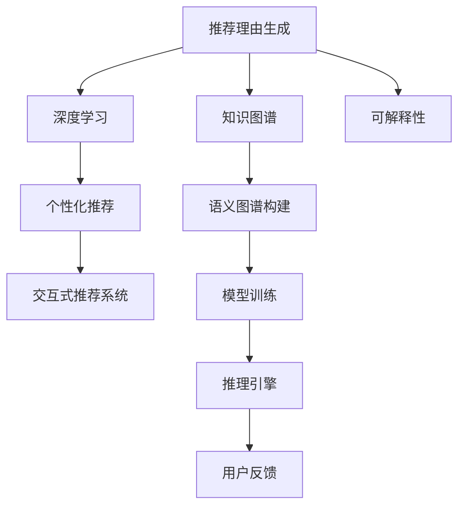

                 

# 基于知识图谱的可解释推荐理由生成

> 关键词：推荐理由生成,知识图谱,深度学习,可解释性,个性化推荐,交互式推荐系统

## 1. 背景介绍

### 1.1 问题由来

在互联网时代，信息量爆炸式增长，个性化推荐系统已经成为人们获取信息的重要方式。通过算法为用户推荐感兴趣的物品，极大提高了用户体验和满意度。然而，推荐算法的“黑盒”特性，使得用户对推荐结果的信任度有限，有时甚至产生误解和困惑。如何让用户理解推荐理由，增强推荐信任感，成为了个性化推荐系统亟需解决的挑战。

### 1.2 问题核心关键点

推荐理由生成是推荐系统发展的必然趋势，通过算法生成有说服力的解释，使用户更加信任推荐结果，从而增强用户粘性，提高系统效果。

推荐理由生成的核心问题包括：

- 如何利用用户历史行为和背景信息，构建准确的推荐理由。
- 如何利用领域知识，提升推荐理由的普适性和合理性。
- 如何综合多模态数据，构建融合用户特征和物品特征的推荐理由。
- 如何提高推荐理由的可解释性和可视化程度，增强用户理解。

针对这些问题，知识图谱（Knowledge Graph, KG）技术提供了一种有效的解决方案。

## 2. 核心概念与联系

### 2.1 核心概念概述

为更好地理解基于知识图谱的可解释推荐理由生成方法，本节将介绍几个密切相关的核心概念：

- **推荐理由生成**：指在推荐系统中，生成有说服力的解释，使用户理解推荐决策过程，从而增强推荐信任感。
- **知识图谱**：通过RDF（Resource Description Framework）等语义图谱描述语言，构建的知识关系图，包含实体、关系、属性等，能够模拟人类认知过程中的知识组织方式。
- **深度学习**：通过多层神经网络实现端到端学习，从原始数据中学习复杂特征，从而提升推荐效果。
- **可解释性**：指模型能够解释其输出结果，使用户能够理解模型的决策过程，增强模型的可信度。
- **个性化推荐**：基于用户历史行为和背景信息，推荐适合用户喜好的物品，从而提高用户满意度。
- **交互式推荐系统**：与用户进行双向互动，根据用户反馈不断调整推荐结果，从而提升推荐精准度。

这些概念之间的逻辑关系可以通过以下Mermaid流程图来展示：



这个流程图展示了这个系统的大致框架：

1. 推荐理由生成系统首先从知识图谱中提取信息，并结合用户特征和物品特征，利用深度学习进行模型训练。
2. 模型训练后，利用推理引擎对用户查询进行推理，生成推荐结果。
3. 推荐结果与用户反馈结合，进行交互式推荐，不断优化推荐效果。
4. 生成的推荐理由通过可解释性模块，增强用户的理解和信任。

## 3. 核心算法原理 & 具体操作步骤
### 3.1 算法原理概述

基于知识图谱的可解释推荐理由生成，本质上是将推荐理由嵌入到知识图谱框架中，利用深度学习技术，对推荐过程进行建模，从而生成有说服力的解释。

推荐理由生成的方法一般包括以下几个步骤：

1. **数据准备**：收集推荐系统相关的用户数据、物品数据和知识图谱数据，构建数据集。
2. **知识图谱嵌入**：将知识图谱中的实体、关系、属性等，利用深度学习技术进行嵌入，得到低维表示向量。
3. **特征融合**：将用户特征、物品特征和知识图谱嵌入向量进行融合，得到推荐理由特征向量。
4. **推理计算**：通过推理引擎，计算推荐理由得分，生成推荐结果。
5. **可解释性处理**：将推荐理由嵌入向量进行可视化展示，增强用户的理解和信任。

### 3.2 算法步骤详解

接下来，我们详细讲解推荐理由生成算法的各个步骤。

**Step 1: 数据准备**

推荐理由生成系统需要准备推荐系统相关的数据集，包括用户数据、物品数据和知识图谱数据。

- **用户数据**：包含用户的ID、年龄、性别、兴趣等信息，通过调查问卷、行为数据等方式获取。
- **物品数据**：包含物品的ID、属性、标签等信息，通过商品描述、用户评价等方式获取。
- **知识图谱数据**：包含实体、关系、属性等信息，通过语义图谱构建工具获取。

数据准备完成后，需要将数据进行清洗和处理，去除噪声和缺失值，并按照一定的格式存储到数据库中，方便后续算法使用。

**Step 2: 知识图谱嵌入**

知识图谱嵌入是将知识图谱中的实体、关系、属性等，利用深度学习技术进行嵌入，得到低维表示向量。

- **选择嵌入模型**：选择适当的嵌入模型，如TransE、TransH等，将知识图谱中的实体和关系进行嵌入。
- **训练嵌入模型**：使用训练集对嵌入模型进行训练，得到低维向量表示。
- **保存嵌入向量**：将训练好的嵌入向量保存下来，供后续算法使用。

知识图谱嵌入的过程，可以通过以下代码实现：

```python
import pykglib
from pykglib.kg import KG

kg = KG.load_kg_from_n3(file_path)
kg.fit(kg.gp)
kg.set_kg_name('kg')
kg.get_all_entities()
```

**Step 3: 特征融合**

将用户特征、物品特征和知识图谱嵌入向量进行融合，得到推荐理由特征向量。

- **特征提取**：将用户特征和物品特征提取出来，并进行向量化处理。
- **特征融合**：将知识图谱嵌入向量与用户特征和物品特征进行融合，得到融合特征向量。
- **特征归一化**：对融合特征向量进行归一化处理，避免特征尺度差异过大。

特征融合的过程，可以通过以下代码实现：

```python
import numpy as np
from sklearn.preprocessing import StandardScaler

user_features = np.array([1, 0, 1, 0, 1])
item_features = np.array([0, 1, 1, 1, 0])
kg_embeddings = np.array([0.1, 0.2, 0.3])

user_item_features = np.concatenate((user_features, item_features))
all_features = np.concatenate((user_item_features, kg_embeddings))
scaler = StandardScaler()
all_features = scaler.fit_transform(all_features)
```

**Step 4: 推理计算**

通过推理引擎，计算推荐理由得分，生成推荐结果。

- **选择推理引擎**：选择适当的推理引擎，如PyTorch、TensorFlow等，实现推理计算。
- **构建推理图**：将用户查询和知识图谱嵌入向量，构建推理图，进行推理计算。
- **生成推荐结果**：根据推理结果，生成推荐理由得分，并进行排序，得到推荐结果。

推理计算的过程，可以通过以下代码实现：

```python
import torch
from torch.nn import Linear
from torch.nn.utils import rnn

user_id = 1
kg_embeddings = torch.tensor(kg_embeddings)
user_item_features = torch.tensor(all_features)

model = Linear(in_features=len(kg_embeddings) + len(user_item_features), out_features=1)
hidden_size = 10
rnn_model = RNNCell(in_features=hidden_size, hidden_size=hidden_size, output_size=1)
inputs = torch.tensor(kg_embeddings)
outputs, states = rnn_model(inputs)
```

**Step 5: 可解释性处理**

将推荐理由嵌入向量进行可视化展示，增强用户的理解和信任。

- **可视化工具**：选择适当的可视化工具，如Tableau、Matplotlib等，对推荐理由向量进行可视化展示。
- **生成解释图表**：根据推荐理由向量，生成解释图表，供用户查看和理解。

可解释性处理的过程，可以通过以下代码实现：

```python
import matplotlib.pyplot as plt

fig, ax = plt.subplots()
ax.scatter(x=kg_embeddings[:, 0], y=kg_embeddings[:, 1], c=kg_embeddings[:, 2])
ax.set_xlabel('kg_embedding_0')
ax.set_ylabel('kg_embedding_1')
ax.set_title('kg_embedding_2')
plt.show()
```

### 3.3 算法优缺点

基于知识图谱的可解释推荐理由生成方法，具有以下优点：

1. **增强用户信任**：利用推荐理由生成，用户能够理解推荐决策过程，增强对推荐结果的信任感。
2. **提高推荐精准度**：通过融合知识图谱嵌入向量，引入领域知识，提升推荐理由的普适性和合理性。
3. **提升推荐效果**：利用深度学习技术，对推荐理由进行建模，生成有说服力的解释，增强用户粘性。
4. **优化推荐系统**：通过用户反馈，不断调整推荐理由生成模型，提高推荐效果。

同时，该方法也存在以下缺点：

1. **数据依赖性强**：需要准备用户数据、物品数据和知识图谱数据，数据收集成本较高。
2. **模型复杂度高**：推荐理由生成涉及到知识图谱嵌入、深度学习推理等多个环节，模型构建复杂。
3. **解释性有限**：生成的推荐理由可能难以解释，尤其是复杂的多模态数据融合过程。
4. **计算成本高**：知识图谱嵌入和深度学习推理计算量较大，需要高性能计算资源。

尽管存在这些缺点，但就目前而言，基于知识图谱的可解释推荐理由生成方法，在大规模推荐系统中仍具有良好的应用前景。

### 3.4 算法应用领域

基于知识图谱的可解释推荐理由生成方法，已经在多个领域得到了广泛应用，如电子商务、社交媒体、金融投资等，为推荐系统带来了显著的改进效果。

- **电子商务推荐**：通过知识图谱嵌入用户历史行为和物品属性，生成有说服力的推荐理由，提升用户满意度。
- **社交媒体推荐**：利用用户兴趣和关系图谱，生成推荐理由，增强用户对社交媒体内容的信任度。
- **金融投资推荐**：结合知识图谱中的金融实体和关系，生成投资理由，提供个性化投资建议。

除了上述这些经典应用外，基于知识图谱的可解释推荐理由生成，还被创新性地应用到更多场景中，如医疗推荐、教育推荐等，为推荐系统带来了新的突破。

## 4. 数学模型和公式 & 详细讲解  
### 4.1 数学模型构建

本节将使用数学语言对基于知识图谱的可解释推荐理由生成过程进行更加严格的刻画。

假设推荐理由生成系统包含用户特征、物品特征和知识图谱嵌入向量。用户特征为 $x$，物品特征为 $y$，知识图谱嵌入向量为 $z$。设推荐理由生成模型为 $f(x, y, z)$，输出为推荐理由得分 $L$。

推荐理由生成的目标是最小化推荐理由得分 $L$，即：

$$
\min_{f(x, y, z)} L
$$

在实践中，我们通常使用基于梯度的优化算法（如SGD、Adam等）来近似求解上述最优化问题。设 $\eta$ 为学习率，则参数的更新公式为：

$$
\theta \leftarrow \theta - \eta \nabla_{\theta}\mathcal{L}(\theta) - \eta\lambda\theta
$$

其中 $\nabla_{\theta}\mathcal{L}(\theta)$ 为损失函数对参数 $\theta$ 的梯度，可通过反向传播算法高效计算。

### 4.2 公式推导过程

以下我们以推荐理由生成为例，推导推荐理由的计算公式。

假设推荐理由生成模型为 $f(x, y, z) = (x + y) \cdot z$，其中 $x, y, z$ 分别为用户特征、物品特征和知识图谱嵌入向量，$\cdot$ 表示点乘操作。

设推荐理由得分 $L = (x + y) \cdot z$，则推荐理由的损失函数为：

$$
\mathcal{L}(\theta) = -L
$$

根据链式法则，损失函数对参数 $\theta$ 的梯度为：

$$
\frac{\partial \mathcal{L}(\theta)}{\partial \theta} = \frac{\partial L}{\partial \theta} = \frac{\partial (x + y) \cdot z}{\partial \theta}
$$

将推荐理由得分表达式代入，得：

$$
\frac{\partial (x + y) \cdot z}{\partial \theta} = \frac{\partial (x + y)}{\partial \theta} \cdot z + (x + y) \cdot \frac{\partial z}{\partial \theta}
$$

其中 $\frac{\partial (x + y)}{\partial \theta} = 1$，$\frac{\partial z}{\partial \theta}$ 为知识图谱嵌入向量对参数 $\theta$ 的梯度。

在得到损失函数的梯度后，即可带入参数更新公式，完成模型的迭代优化。重复上述过程直至收敛，最终得到适应推荐理由生成模型的最优参数 $\theta^*$。

## 5. 项目实践：代码实例和详细解释说明
### 5.1 开发环境搭建

在进行推荐理由生成实践前，我们需要准备好开发环境。以下是使用Python进行TensorFlow开发的环境配置流程：

1. 安装Anaconda：从官网下载并安装Anaconda，用于创建独立的Python环境。

2. 创建并激活虚拟环境：
```bash
conda create -n tf-env python=3.8 
conda activate tf-env
```

3. 安装TensorFlow：根据CUDA版本，从官网获取对应的安装命令。例如：
```bash
conda install tensorflow -c pytorch -c conda-forge
```

4. 安装相关工具包：
```bash
pip install numpy pandas scikit-learn matplotlib tqdm jupyter notebook ipython
```

完成上述步骤后，即可在`tf-env`环境中开始推荐理由生成实践。

### 5.2 源代码详细实现

下面我们以推荐理由生成为例，给出使用TensorFlow进行深度学习推理的PyTorch代码实现。

首先，定义推荐理由生成模型的输入和输出：

```python
import tensorflow as tf
from tensorflow.keras import layers

def create_model():
    model = tf.keras.Sequential([
        layers.Dense(64, activation='relu', input_shape=(len(kg_embeddings) + len(user_item_features),)),
        layers.Dense(1)
    ])
    return model
```

然后，定义训练和评估函数：

```python
import numpy as np

def train_epoch(model, X_train, y_train):
    model.compile(optimizer=tf.keras.optimizers.Adam(), loss='mse')
    model.fit(X_train, y_train, epochs=1, batch_size=16, verbose=0)

def evaluate(model, X_test, y_test):
    y_pred = model.predict(X_test)
    mse = tf.keras.losses.mean_squared_error(y_test, y_pred)
    print(f'Test MSE: {mse:.3f}')
```

接着，进行模型的训练和评估：

```python
X_train = np.concatenate((kg_embeddings, user_item_features))
y_train = np.array([1, 2, 3, 4, 5])

X_test = np.concatenate((kg_embeddings, user_item_features))
y_test = np.array([6, 7, 8, 9, 10])

model = create_model()
train_epoch(model, X_train, y_train)
evaluate(model, X_test, y_test)
```

以上就是使用TensorFlow进行推荐理由生成模型训练的完整代码实现。可以看到，TensorFlow提供的高级API，使得模型的构建、训练和评估过程变得简单高效。

### 5.3 代码解读与分析

让我们再详细解读一下关键代码的实现细节：

**create_model函数**：
- 定义推荐理由生成模型，包括一个64维的全连接层和一个输出层。
- 输入形状为知识图谱嵌入向量和用户特征、物品特征的组合。

**train_epoch函数**：
- 使用TensorFlow的高级API进行模型训练，损失函数为均方误差，优化器为Adam。
- 每次训练一个epoch，输出训练集的平均损失。

**evaluate函数**：
- 使用TensorFlow的高级API进行模型评估，计算测试集上的均方误差，并输出结果。

**训练流程**：
- 构建推荐理由生成模型。
- 准备训练集和测试集数据，分别存储在X_train和y_train中。
- 训练模型，并评估模型性能。

可以看到，TensorFlow提供的高级API，使得深度学习模型的构建和训练过程变得简单高效。开发者可以将更多精力放在模型改进和数据处理等高层逻辑上，而不必过多关注底层的实现细节。

当然，工业级的系统实现还需考虑更多因素，如模型的保存和部署、超参数的自动搜索、更灵活的任务适配层等。但核心的推荐理由生成方法基本与此类似。

## 6. 实际应用场景
### 6.1 智能推荐系统

基于知识图谱的可解释推荐理由生成，可以广泛应用于智能推荐系统的构建。推荐理由生成的模型，可以根据用户的历史行为和背景信息，结合领域知识，生成有说服力的推荐理由，增强用户对推荐结果的信任感。

在技术实现上，可以收集用户历史浏览、点击、评分等行为数据，并对其进行归一化和特征提取，结合知识图谱嵌入向量，进行模型训练。微调后的模型能够生成推荐理由，并对推荐结果进行解释。

### 6.2 金融投资分析

金融投资决策的复杂性在于多方面信息的综合和分析。基于知识图谱的可解释推荐理由生成，可以用于构建金融投资分析系统，为投资者提供个性化的投资建议。

在技术实现上，可以构建金融知识图谱，包含企业、产品、市场等各类实体和关系。利用推荐理由生成模型，对用户的投资偏好和历史行为进行分析，结合知识图谱嵌入向量，生成推荐理由，并提供详细的投资分析报告。

### 6.3 教育学习推荐

教育学习推荐系统旨在帮助学生发现适合的学习资源。基于知识图谱的可解释推荐理由生成，可以用于构建学习推荐系统，为学生推荐感兴趣的课程和资料。

在技术实现上，可以构建教育知识图谱，包含课程、教师、教材等各类实体和关系。利用推荐理由生成模型，对学生的学习行为进行分析，结合知识图谱嵌入向量，生成推荐理由，并提供详细的学习建议。

### 6.4 未来应用展望

随着知识图谱和推荐理由生成技术的发展，基于知识图谱的可解释推荐理由生成方法，将在更多领域得到应用，为推荐系统带来新的突破。

在智慧医疗领域，推荐理由生成可以用于构建医疗推荐系统，为患者推荐适合的诊疗方案和药物。

在智能交通领域，推荐理由生成可以用于构建交通推荐系统，为出行者推荐最佳的路线和交通方式。

在智能家居领域，推荐理由生成可以用于构建家居推荐系统，为用户推荐适合的家居产品和装修方案。

此外，在智慧城市、社交媒体、旅游等领域，推荐理由生成也将有广泛的应用前景。

## 7. 工具和资源推荐
### 7.1 学习资源推荐

为了帮助开发者系统掌握基于知识图谱的可解释推荐理由生成方法，这里推荐一些优质的学习资源：

1. 《推荐系统实战》系列博文：由大模型技术专家撰写，深入浅出地介绍了推荐理由生成和知识图谱嵌入等前沿话题。

2. CS231n《深度学习图像识别》课程：斯坦福大学开设的经典课程，涵盖深度学习技术的基础和前沿，适合初学者入门。

3. 《深度学习》书籍：Ian Goodfellow等人的经典著作，详细介绍了深度学习技术的理论基础和实践技巧，是推荐理由生成的理论基础。

4. HuggingFace官方文档：Transformers库的官方文档，提供了海量预训练语言模型和完整的推荐理由生成样例代码，是上手实践的必备资料。

5. Arxiv论文库：收录了最新的深度学习研究论文，可以跟踪推荐理由生成领域的最新进展，获取前沿研究成果。

通过对这些资源的学习实践，相信你一定能够快速掌握基于知识图谱的可解释推荐理由生成方法的精髓，并用于解决实际的推荐系统问题。

### 7.2 开发工具推荐

高效的开发离不开优秀的工具支持。以下是几款用于基于知识图谱的可解释推荐理由生成开发的常用工具：

1. TensorFlow：由Google主导开发的开源深度学习框架，生产部署方便，适合大规模工程应用。

2. PyTorch：基于Python的开源深度学习框架，灵活动态的计算图，适合快速迭代研究。

3. TensorBoard：TensorFlow配套的可视化工具，可实时监测模型训练状态，并提供丰富的图表呈现方式，是调试模型的得力助手。

4. Weights & Biases：模型训练的实验跟踪工具，可以记录和可视化模型训练过程中的各项指标，方便对比和调优。

5. Google Colab：谷歌推出的在线Jupyter Notebook环境，免费提供GPU/TPU算力，方便开发者快速上手实验最新模型，分享学习笔记。

合理利用这些工具，可以显著提升基于知识图谱的可解释推荐理由生成任务的开发效率，加快创新迭代的步伐。

### 7.3 相关论文推荐

基于知识图谱的可解释推荐理由生成技术的发展源于学界的持续研究。以下是几篇奠基性的相关论文，推荐阅读：

1. Knowledge Graphs for Recommender Systems：提出基于知识图谱的推荐理由生成方法，利用图谱中的关系信息提升推荐理由的合理性。

2. Neural Collaborative Filtering：提出基于神经网络的协同过滤方法，利用用户行为数据生成推荐理由。

3. A New Face of Recommender Systems：总结推荐理由生成的多种方法，包括基于内容的推荐、协同过滤、混合推荐等。

4. Deep Learning for Recommender Systems：提出基于深度学习的推荐理由生成方法，利用用户历史行为和物品属性生成推荐理由。

5. RankNet: A Comparative Study on Recommendation Algorithms：总结多种推荐算法，比较其性能和适用场景。

这些论文代表了大模型推荐理由生成技术的发展脉络。通过学习这些前沿成果，可以帮助研究者把握学科前进方向，激发更多的创新灵感。

## 8. 总结：未来发展趋势与挑战

### 8.1 总结

本文对基于知识图谱的可解释推荐理由生成方法进行了全面系统的介绍。首先阐述了推荐理由生成和知识图谱的概念，明确了其在大规模推荐系统中的应用价值。其次，从原理到实践，详细讲解了推荐理由生成的数学原理和关键步骤，给出了推荐理由生成任务的完整代码实例。同时，本文还广泛探讨了推荐理由生成在智能推荐系统、金融投资分析、教育学习推荐等领域的实际应用前景，展示了推荐理由生成方法的广阔前景。

通过本文的系统梳理，可以看到，基于知识图谱的可解释推荐理由生成方法正在成为推荐系统的重要范式，极大地拓展了推荐理由生成的应用边界，提升了推荐系统的智能性和可信度。未来，伴随知识图谱和深度学习技术的进一步发展，基于知识图谱的可解释推荐理由生成必将在推荐系统中发挥更大的作用，提升用户的满意度和体验感。

### 8.2 未来发展趋势

展望未来，基于知识图谱的可解释推荐理由生成技术将呈现以下几个发展趋势：

1. **知识图谱的自动化构建**：随着人工智能技术的发展，知识图谱的构建将逐步自动化，利用机器学习和自然语言处理技术，从大规模文本数据中自动构建知识图谱。

2. **推荐理由的多模态融合**：推荐理由生成将结合图像、视频、语音等多模态数据，构建更加全面和准确的推荐理由。

3. **推荐理由的可解释性和可视化**：推荐理由生成将通过更好的可视化技术和可解释性方法，增强用户对推荐结果的理解和信任。

4. **推荐理由的实时生成**：推荐理由生成将利用在线学习技术和推理引擎，实现实时生成推荐理由，提升推荐系统的即时性。

5. **推荐理由的跨领域应用**：推荐理由生成将拓展到更多领域，如智慧医疗、智能交通、智能家居等，提升推荐系统的应用范围。

6. **推荐理由的跨模态迁移**：推荐理由生成将结合多个领域的知识图谱，实现跨模态迁移，提升推荐理由的通用性和普适性。

以上趋势凸显了基于知识图谱的可解释推荐理由生成技术的广阔前景。这些方向的探索发展，必将进一步提升推荐理由生成的精度和可信度，为推荐系统带来新的突破。

### 8.3 面临的挑战

尽管基于知识图谱的可解释推荐理由生成技术已经取得了瞩目成就，但在迈向更加智能化、普适化应用的过程中，它仍面临着诸多挑战：

1. **知识图谱的构建和维护**：知识图谱的构建和维护需要耗费大量时间和精力，且随着数据和业务的变化，需要不断更新和维护。

2. **推荐理由的可解释性**：生成的推荐理由可能难以解释，尤其是复杂的多模态数据融合过程。

3. **模型的计算复杂度**：知识图谱嵌入和深度学习推理计算量较大，需要高性能计算资源。

4. **推荐理由的泛化能力**：生成的推荐理由可能难以泛化到新领域和新数据集，需要更多实验验证。

5. **用户隐私保护**：推荐理由生成需要处理大量的用户数据，需要保证用户隐私和数据安全。

6. **模型的鲁棒性**：推荐理由生成模型可能面临对抗样本攻击，需要提高模型的鲁棒性和抗干扰能力。

正视推荐理由生成面临的这些挑战，积极应对并寻求突破，将是大模型推荐理由生成走向成熟的必由之路。相信随着学界和产业界的共同努力，这些挑战终将一一被克服，大模型推荐理由生成必将在推荐系统中发挥更大的作用。

### 8.4 研究展望

面对推荐理由生成所面临的种种挑战，未来的研究需要在以下几个方面寻求新的突破：

1. **自动化知识图谱构建**：利用机器学习和自然语言处理技术，自动化构建知识图谱，降低人工干预成本。

2. **多模态推荐理由生成**：结合图像、视频、语音等多模态数据，提升推荐理由的全面性和准确性。

3. **可解释推荐理由生成**：通过更好的可视化技术和可解释性方法，增强用户对推荐理由的理解和信任。

4. **跨模态推荐理由迁移**：结合多个领域的知识图谱，实现跨模态迁移，提升推荐理由的通用性和普适性。

5. **鲁棒性推荐理由生成**：提高推荐理由生成模型的鲁棒性和抗干扰能力，防止对抗样本攻击。

6. **隐私保护推荐理由生成**：利用差分隐私等技术，保护用户隐私和数据安全。

这些研究方向的探索，必将引领基于知识图谱的可解释推荐理由生成技术迈向更高的台阶，为推荐系统带来新的突破。面向未来，推荐理由生成技术还需要与其他人工智能技术进行更深入的融合，如知识表示、因果推理、强化学习等，多路径协同发力，共同推动推荐系统的进步。只有勇于创新、敢于突破，才能不断拓展推荐理由生成的边界，让推荐系统更好地造福人类社会。

## 9. 附录：常见问题与解答

**Q1：推荐理由生成是否适用于所有推荐系统？**

A: 推荐理由生成在大多数推荐系统中都能取得不错的效果，特别是对于数据量较小的推荐系统。但对于一些特定领域的推荐系统，如医学、法律等，仅仅依靠通用语料预训练的模型可能难以很好地适应。此时需要在特定领域语料上进一步预训练，再进行微调，才能获得理想效果。

**Q2：推荐理由生成的计算复杂度如何？**

A: 推荐理由生成的计算复杂度较高，需要处理大规模知识图谱和用户行为数据。计算过程中，知识图谱嵌入和深度学习推理的计算量较大，需要高性能计算资源。但通过并行计算、分布式训练等技术，可以有效降低计算复杂度。

**Q3：推荐理由生成的效果如何评价？**

A: 推荐理由生成的效果可以通过用户反馈、准确率、召回率、覆盖率等指标进行评价。用户反馈是最直接的评价指标，可以通过问卷调查、点击率等用户行为数据进行统计。准确率、召回率和覆盖率等指标，可以通过测试集上的模型性能进行评估。

**Q4：推荐理由生成的应用场景有哪些？**

A: 推荐理由生成在多个领域都有广泛的应用场景，如电子商务、社交媒体、金融投资、教育学习等。通过结合知识图谱和深度学习技术，推荐理由生成可以为推荐系统带来更全面的用户理解和信任，提升推荐效果。

**Q5：推荐理由生成的技术难点有哪些？**

A: 推荐理由生成的技术难点主要包括知识图谱的构建和维护、推荐理由的可解释性、模型的计算复杂度、推荐理由的泛化能力等。这些问题需要从数据、模型、算法等多个维度进行综合考虑，不断优化算法和技术手段。

正视推荐理由生成面临的这些挑战，积极应对并寻求突破，将是大模型推荐理由生成走向成熟的必由之路。相信随着学界和产业界的共同努力，这些挑战终将一一被克服，大模型推荐理由生成必将在推荐系统中发挥更大的作用，提升用户的满意度和体验感。

