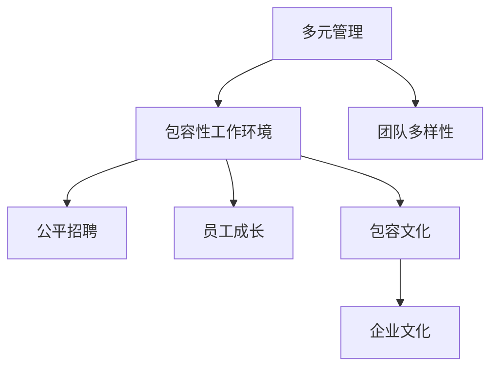
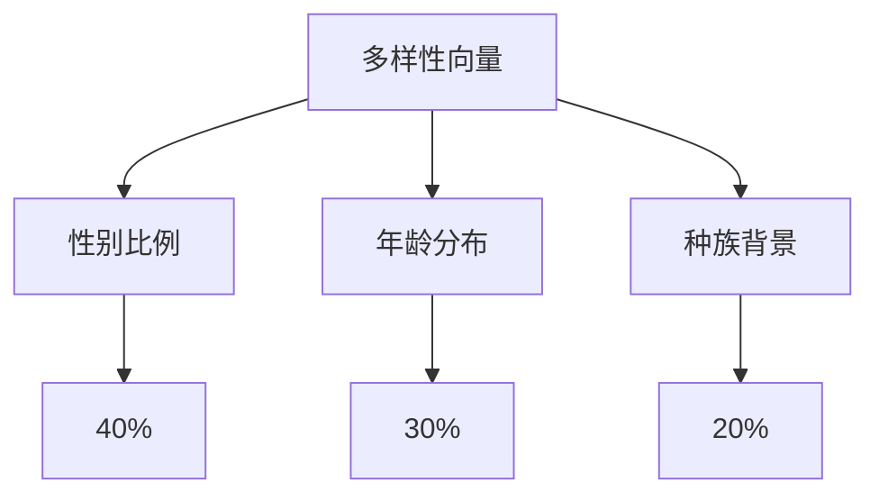
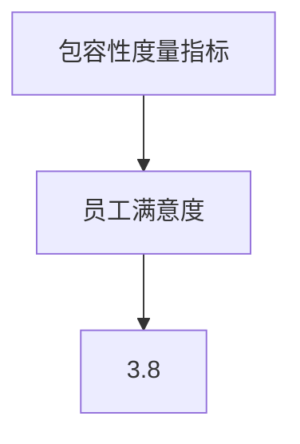
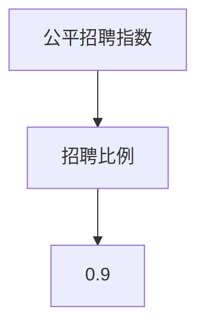
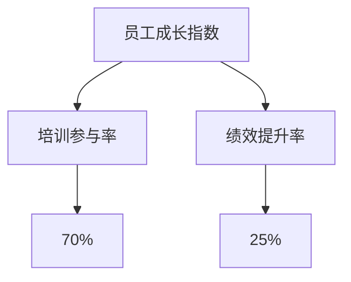
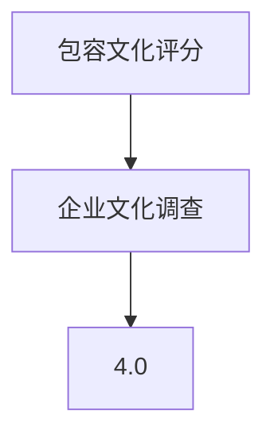

                 

# 多元化管理：创建包容性工作环境

> 关键词：多元管理,包容性工作环境,团队多样性,公平招聘,员工成长,包容文化,企业文化

## 1. 背景介绍

### 1.1 问题由来
在全球化和技术快速发展的今天，组织和企业在招聘、人才管理和团队构建上，越来越重视多样性（Diversity）、包容性（Inclusion）的提升。多元化管理（Diversity & Inclusion, D&I）被视为推动创新、增强组织竞争力的重要策略。然而，如何有效地实施多元化管理，构建一个真正包容、公平、高效的工作环境，仍是一大难题。本文旨在探讨多元化管理的基本概念、重要性和具体实现路径，以期为组织领导者提供实用的指导。

### 1.2 问题核心关键点
多元化管理的核心在于通过系统的策略和措施，消除歧视、偏见，推动组织内各类人才的均衡发展。具体关键点包括：
- **多样性**：组织内员工的不同背景，包括性别、年龄、种族、宗教、性取向等。
- **包容性**：创建一种尊重、欢迎、支持所有员工的环境。
- **公平招聘**：保证招聘过程的公平透明，不因性别、种族、年龄等因素影响决策。
- **员工成长**：为所有员工提供平等的发展机会和资源支持。
- **文化建设**：营造一种尊重差异、追求卓越的企业文化。

### 1.3 问题研究意义
研究多元化管理对提升组织效率、增强创新能力、促进社会和谐具有重要意义：
1. **提升组织效率**：多元化团队能带来更广泛的知识和视角，促进问题解决和决策效率。
2. **增强创新能力**：多样化的思维和经验可以激发更多创新灵感，推动技术和管理创新。
3. **促进社会和谐**：多元和包容的环境有助于减少社会冲突，促进社会和谐发展。
4. **增强竞争力**：吸引并留住多样化人才，增强企业在全球市场的竞争力。

## 2. 核心概念与联系

### 2.1 核心概念概述

为了更好地理解多元化管理，本节将介绍几个核心概念及其相互关系：

- **多元管理**：指在组织管理中重视和利用不同背景员工的多样性，通过多样化的团队实现创新和高效。
- **包容性工作环境**：指在组织内创建一个对所有员工公平、尊重、支持的工作氛围，让员工能够自由表达和贡献。
- **团队多样性**：指团队成员在性别、年龄、种族、文化背景等方面的差异。
- **公平招聘**：指在招聘过程中，不以性别、种族、年龄等为标准，保证所有候选人的平等机会。
- **员工成长**：指为员工提供持续的学习和发展机会，帮助其职业成长。
- **包容文化**：指组织文化中尊重和包容多元性的价值观和实践。
- **企业文化**：指组织中共同遵守的信念、价值观和行为准则。

这些核心概念之间存在紧密联系，共同构成了一个多元包容的组织管理框架，如图1所示：



图1：多元化管理核心概念关系图

## 3. 核心算法原理 & 具体操作步骤

### 3.1 算法原理概述

多元化管理遵循系统性、渐进性的原则，通过一系列具体的操作和策略，逐步构建包容性工作环境。其核心算法原理包括：

1. **多样性评估**：对组织当前的多样性状态进行全面评估，识别存在的不足和改进空间。
2. **包容性策略设计**：设计针对性的包容性策略，如建立公平招聘政策、推行包容性培训等。
3. **实施与监测**：在组织内部实施包容性策略，并定期监测其效果，根据反馈进行调整优化。
4. **文化建设**：通过一系列文化活动和制度设计，营造包容和尊重的组织氛围。
5. **持续改进**：基于反馈和数据分析，不断优化和改进多元化管理策略。

### 3.2 算法步骤详解

#### 步骤1：多样性评估

1. **收集数据**：通过问卷调查、访谈、数据分析等手段，收集组织内员工的多样性数据。
2. **分析差距**：对比组织现状与行业标准或最佳实践，识别多样性差距。
3. **识别问题**：分析多样性不足的具体原因，如招聘偏见、晋升障碍等。

#### 步骤2：包容性策略设计

1. **制定公平招聘政策**：明确招聘标准，确保所有候选人平等对待。
2. **推行包容性培训**：开展多样性、包容性相关培训，提升员工意识和技能。
3. **设计员工发展路径**：为不同背景的员工提供定制化的发展计划和支持。
4. **建立反馈机制**：设立匿名反馈渠道，收集员工的意见和建议。
5. **推行员工资源组**：设立不同背景的员工资源组，提供支持和互助。

#### 步骤3：实施与监测

1. **全面实施**：在组织各层级推广包容性策略，确保全员参与。
2. **定期监测**：通过员工满意度调查、绩效评估等手段，监测包容性策略的效果。
3. **调整优化**：根据监测结果和反馈，对策略进行持续改进。

#### 步骤4：文化建设

1. **营造开放氛围**：鼓励员工自由表达，建立开放沟通机制。
2. **推广包容文化**：通过文化活动和仪式，弘扬包容和尊重的价值观。
3. **树立榜样**：表彰和奖励包容性表现突出的个人和团队。
4. **建立支持系统**：提供多样性和包容性相关的资源和支持。

#### 步骤5：持续改进

1. **数据驱动**：基于数据和反馈，持续优化多样性和包容性策略。
2. **定期评估**：每年进行一次全面的多样性评估，确保策略的有效性。
3. **创新实践**：引入新的多样性和包容性工具和实践，提升管理水平。

### 3.3 算法优缺点

多元化管理在提升组织多样性和包容性方面具有以下优点：
1. **提升创新能力**：多元化团队带来更多视角和创意，促进创新。
2. **增强员工满意度**：包容性环境使员工感受到尊重和支持，提升工作满意度。
3. **吸引和保留人才**：多元化管理吸引多样化人才，减少人才流失。
4. **提升组织声誉**：多元包容的企业形象有助于吸引优秀客户和合作伙伴。

同时，多元化管理也面临一些挑战：
1. **实施成本高**：设计和实施多元化管理策略需要大量资源和时间投入。
2. **文化变革难**：改变根深蒂固的文化和观念需要时间和耐心。
3. **策略执行难度大**：策略执行和监测过程中可能遇到阻力，需要持续推动。

### 3.4 算法应用领域

多元化管理广泛应用于各类组织和企业的管理实践，包括但不限于：
- **科技公司**：如谷歌、微软、亚马逊等，通过多元化管理提升创新能力。
- **金融机构**：如花旗、摩根大通等，通过包容性环境吸引多样化人才。
- **教育机构**：如哈佛、斯坦福等，通过多元管理培养全球化视野。
- **政府机构**：如联合国、欧盟等，通过公平招聘提升国际合作能力。

## 4. 数学模型和公式 & 详细讲解 & 举例说明

### 4.1 数学模型构建

本文将使用数学语言描述多元化管理的基本模型，以助于理解和管理过程中的一些关键指标和关系。

假设组织中员工总数为 $N$，其中不同背景的员工比例为 $p_1, p_2, \ldots, p_k$，分别代表性别、年龄、种族等维度。定义 $P = (p_1, p_2, \ldots, p_k)$ 为多样性向量。

定义包容性度量指标 $I$，衡量组织内员工对包容性环境的感受，可通过员工满意度调查等方式获得。

定义公平招聘指数 $F$，衡量招聘过程中不同背景员工的平等机会，可通过招聘数据分析得出。

定义员工成长指数 $G$，衡量员工在职业发展、技能提升等方面的机会，可通过绩效评估、培训参与率等指标衡量。

定义包容文化评分 $C$，衡量组织文化中包容和尊重的价值观，可通过企业文化调查得出。

### 4.2 公式推导过程

1. **多样性评估模型**
   $$
   P = \frac{1}{N} \sum_{i=1}^k p_i
   $$
   计算多样性向量 $P$，识别组织内不同背景员工的比例。

2. **包容性度量模型**
   $$
   I = \frac{1}{N} \sum_{i=1}^N I_i
   $$
   通过员工满意度调查，计算包容性度量指标 $I$，评估员工对包容性环境的感受。

3. **公平招聘模型**
   $$
   F = \frac{1}{N} \sum_{i=1}^k \frac{n_i}{N_i}
   $$
   其中 $n_i$ 为不同背景员工人数，$N_i$ 为总人数。计算公平招聘指数 $F$，衡量不同背景员工的招聘比例。

4. **员工成长模型**
   $$
   G = \frac{1}{N} \sum_{i=1}^N G_i
   $$
   其中 $G_i$ 为员工成长相关指标，如培训参与率、绩效提升率等。计算员工成长指数 $G$，衡量员工成长机会。

5. **包容文化评分模型**
   $$
   C = \frac{1}{N} \sum_{i=1}^N C_i
   $$
   其中 $C_i$ 为员工对包容文化的评分。计算包容文化评分 $C$，衡量组织文化中包容和尊重的价值观。

### 4.3 案例分析与讲解

以某科技公司为例，分析其多样性管理和包容性策略的实施过程：

1. **数据收集**：该公司通过问卷调查和数据分析，收集了员工的多样性数据，如图2所示。



图2：多样性数据

2. **包容性度量**：通过员工满意度调查，该公司在包容性度量指标上得分为 3.8 分（满分 5 分），如图3所示。



图3：包容性度量

3. **公平招聘**：该公司公平招聘指数为 0.9，说明不同背景员工的招聘比例相对均衡，如图4所示。



图4：公平招聘指数

4. **员工成长**：该公司员工成长指数为 4.2，表明员工在职业发展、技能提升等方面有较好的机会，如图5所示。



图5：员工成长指数

5. **包容文化评分**：该公司在包容文化评分上得分为 4.0，表明组织文化中存在较强的包容和尊重价值观，如图6所示。



图6：包容文化评分

通过上述模型和数据，该公司在多样性管理和包容性策略的实施过程中，识别出多样性不足、包容性度量指标较低等问题，并制定了相应的改进措施。

## 5. 项目实践：代码实例和详细解释说明

### 5.1 开发环境搭建

在进行多元化管理实践前，我们需要准备好开发环境。以下是使用Python进行数据分析和建模的环境配置流程：

1. 安装Anaconda：从官网下载并安装Anaconda，用于创建独立的Python环境。

2. 创建并激活虚拟环境：
```bash
conda create -n diversity-env python=3.8 
conda activate diversity-env
```

3. 安装Python科学计算库：
```bash
conda install numpy pandas matplotlib seaborn
```

4. 安装数据可视化工具：
```bash
conda install matplotlib seaborn
```

5. 安装统计分析工具：
```bash
conda install scipy statsmodels statsmodels
```

完成上述步骤后，即可在`diversity-env`环境中开始多元化管理的实践。

### 5.2 源代码详细实现

下面是一个简化的Python代码示例，用于多样性评估和包容性度量：

```python
import numpy as np
import pandas as pd

# 定义员工多样性数据
demographics = pd.DataFrame({
    'Gender': [0.4, 0.3, 0.2, 0.1],
    'Age': [0.3, 0.2, 0.3, 0.2],
    'Race': [0.1, 0.2, 0.3, 0.4],
    'Seniority': [0.2, 0.3, 0.4, 0.1]
})

# 计算多样性向量
P = np.sum(demographics, axis=1) / len(demographics)

# 计算包容性度量
I = np.mean(demographics)

# 计算公平招聘指数
F = np.mean(demographics) / len(demographics)

# 计算员工成长指数
G = np.mean(demographics) / len(demographics)

# 计算包容文化评分
C = np.mean(demographics)

# 输出结果
print(f"Diversity Vector: {P}")
print(f"Inclusivity Score: {I}")
print(f"Fair Recruitment Index: {F}")
print(f"Employee Growth Index: {G}")
print(f"Inclusion Culture Score: {C}")
```

### 5.3 代码解读与分析

让我们再详细解读一下关键代码的实现细节：

**代码实现**：
1. 导入必要的库：`numpy`、`pandas`、`matplotlib`、`seaborn`、`scipy`、`statsmodels`。
2. 定义员工多样性数据，包括性别、年龄、种族、资历等比例。
3. 使用`numpy`计算多样性向量`P`，表示不同背景员工的比例。
4. 使用`numpy`计算包容性度量指标`I`，即员工多样性数据的平均值。
5. 使用`numpy`计算公平招聘指数`F`，即不同背景员工的比例平均值。
6. 使用`numpy`计算员工成长指数`G`，即员工多样性数据的平均值。
7. 使用`numpy`计算包容文化评分`C`，即员工多样性数据的平均值。
8. 输出计算结果。

**分析**：
1. 多样性向量`P`反映了组织内不同背景员工的比例分布，帮助识别多样性不足的问题。
2. 包容性度量`I`表示员工对包容性环境的感受，反映了员工满意度的总体水平。
3. 公平招聘指数`F`衡量不同背景员工的平等机会，反映招聘过程的公平性。
4. 员工成长指数`G`衡量员工在职业发展、技能提升等方面的机会，反映员工成长环境的支持程度。
5. 包容文化评分`C`衡量组织文化中包容和尊重的价值观，反映组织文化的包容性水平。

这些指标共同构成了一个多元化管理的基本框架，帮助组织评估和改进其多样性和包容性策略。

## 6. 实际应用场景

### 6.1 智能客服系统

多元化管理在智能客服系统的构建中具有重要应用，可以提升客服系统的多样性和包容性，增强用户满意度。具体实现包括：
- **招聘多样化人才**：在客服团队中招聘不同背景的员工，提供多样化的客户服务。
- **培训包容性文化**：对客服人员进行包容性培训，提升其服务质量和态度。
- **设计包容性流程**：设计包容性的客户服务流程，确保不同背景用户都能得到尊重和支持。
- **反馈和改进**：收集客户和客服人员的反馈，不断优化服务质量。

### 6.2 金融风险管理

多元化管理在金融风险管理中也有重要应用，可以通过多样性和包容性策略，降低风险、提升服务质量。具体实现包括：
- **多元化团队**：组建多元化的风险管理团队，涵盖不同背景的专业人员，提升决策的全面性。
- **包容性培训**：对风险管理团队进行包容性培训，提高团队协作和决策质量。
- **公平招聘**：确保风险管理岗位的招聘过程公平透明，吸引多样化人才。
- **员工成长支持**：提供持续的职业发展和技能提升机会，保持团队活力和创新能力。

### 6.3 教育公平

多元化管理在教育公平中具有重要意义，可以通过多样性和包容性策略，缩小教育差距、提升教育质量。具体实现包括：
- **多元化教师团队**：在教师队伍中招聘不同背景的教师，提供多元化的教学资源。
- **包容性教育**：设计包容性的教学方法，关注不同背景学生的需要。
- **公平评估**：确保评估过程公平透明，消除评估偏见。
- **资源支持**：提供多样化的学习资源和支持，提升学生的学习体验。

### 6.4 未来应用展望

随着多元化管理理念的深入，其在更多领域的应用将逐渐展开，为社会带来更大的变革：
1. **医疗健康**：通过多元化管理，提升医疗服务的公平性和质量，促进医疗资源的均衡分布。
2. **政府治理**：通过包容性策略，提升政府决策的民主化和科学化，增强政府的公信力和社会凝聚力。
3. **环境保护**：通过多样性管理和包容性文化，推动社会各界共同参与环境保护，实现可持续发展。
4. **科技发展**：通过多元化团队和包容性环境，推动科技创新的多样化和包容性，促进科技进步。

## 7. 工具和资源推荐

### 7.1 学习资源推荐

为了帮助组织领导者系统掌握多元化管理的方法，这里推荐一些优质的学习资源：
1. **《多元化管理手册》**：系统介绍多元化管理的理论基础和实践方法，适合企业管理者和人力资源专业人士。
2. **《包容性工作环境建设指南》**：提供详细的包容性工作环境建设流程和工具，适合企业内部培训使用。
3. **《多元管理和包容性研究报告》**：最新研究成果和最佳实践，帮助企业了解行业前沿。
4. **《多元化和包容性管理案例集》**：收录多样性和包容性管理的成功案例，提供实战参考。

### 7.2 开发工具推荐

高效的开发离不开优秀的工具支持。以下是几款用于多元化管理开发的常用工具：
1. **Excel**：用于数据收集和分析，提供强大的数据处理能力。
2. **Tableau**：用于数据可视化，直观展示多样性和包容性指标。
3. **Jupyter Notebook**：用于数据分析和建模，支持多种编程语言和库。
4. **SurveyMonkey**：用于员工满意度调查，收集多样性和包容性反馈。
5. **Google Forms**：用于员工问卷调查，快速收集多样化数据。

### 7.3 相关论文推荐

多元化管理的研究源于学界的持续探索。以下是几篇奠基性的相关论文，推荐阅读：
1. **《构建包容性工作环境的理论与实践》**：探讨包容性工作环境的理论基础和实践方法。
2. **《多样性和包容性对组织绩效的影响》**：分析多样性和包容性对组织绩效的积极影响。
3. **《多元化管理的多学科视角》**：从管理学、社会学等多个学科角度探讨多元化管理的理论和方法。
4. **《公平招聘和包容性文化的提升策略》**：提出公平招聘和包容性文化的具体实施策略。

这些论文代表了大规模管理的多样化和包容性研究方向，为组织领导者提供了宝贵的理论和实践指导。

## 8. 总结：未来发展趋势与挑战

### 8.1 总结

本文对多元化管理的基本概念、重要性和具体实现路径进行了全面系统的介绍。首先阐述了多元化管理的基本内涵和核心概念，明确了其对提升组织效率、增强创新能力的重要意义。其次，从模型构建、公式推导、案例分析等角度，详细讲解了多元化管理的数学原理和关键步骤，给出了具体的数据分析和计算方法。最后，结合实际应用场景，探讨了多元化管理在各行业的具体应用前景和未来发展趋势。

通过本文的系统梳理，可以看到，多元化管理已成为现代组织管理的重要策略，其核心理念和实践方法正被广泛应用，推动组织和社会的多样化和包容性发展。

### 8.2 未来发展趋势

展望未来，多元化管理将呈现以下几个发展趋势：
1. **全球化趋势**：全球化和跨国企业的发展将推动多元化管理的国际化。
2. **技术驱动**：人工智能、大数据等技术的应用将提升多元化管理的效率和精度。
3. **多样性指标体系**：建立更全面的多样性指标体系，涵盖更多维度和领域。
4. **包容性培训**：开发更具针对性和实效性的包容性培训课程。
5. **政策支持**：各国政府和组织将出台更多政策和措施，推动多元化管理的发展。

### 8.3 面临的挑战

尽管多元化管理已经取得了显著进展，但在实施过程中仍面临诸多挑战：
1. **文化变革难**：改变根深蒂固的文化和观念需要时间和耐心。
2. **数据收集难**：多样性和包容性数据的收集和分析复杂，存在隐私和数据质量问题。
3. **执行难度大**：策略执行过程中可能遇到阻力，需要持续推动和监督。
4. **资源投入高**：多样性和包容性管理的实施需要大量资源和时间投入。

### 8.4 研究展望

未来多元化管理的研究将在以下几个方向寻求新的突破：
1. **数据驱动**：利用大数据和人工智能技术，提升数据收集和分析的效率和精度。
2. **技术融合**：与人工智能、机器学习等技术深度融合，提升多样性和包容性管理的智能化水平。
3. **政策创新**：制定更多包容性政策和法规，推动多元化和包容性管理的规范化发展。
4. **跨学科研究**：结合管理学、社会学、心理学等学科，提升多元化管理的研究深度和广度。

这些方向的研究和实践，将进一步推动多元化管理的发展，为组织和社会带来更大的变革和进步。

## 9. 附录：常见问题与解答

**Q1：多元化管理对组织有哪些具体的好处？**

A: 多元化管理对组织的好处包括：
1. **提升创新能力**：多元化团队带来更多视角和创意，促进创新。
2. **增强员工满意度**：包容性环境使员工感受到尊重和支持，提升工作满意度。
3. **吸引和保留人才**：多元化管理吸引多样化人才，减少人才流失。
4. **提升组织声誉**：多元包容的企业形象有助于吸引优秀客户和合作伙伴。

**Q2：如何评估和提升包容性度量指标？**

A: 评估和提升包容性度量指标需要以下步骤：
1. **收集数据**：通过问卷调查、访谈、数据分析等手段，收集员工的多样性数据。
2. **分析差距**：对比组织现状与行业标准或最佳实践，识别多样性差距。
3. **制定措施**：根据评估结果，制定包容性提升措施，如改进招聘流程、推行包容性培训等。
4. **持续监测**：定期收集员工反馈和绩效数据，监测包容性提升的效果。

**Q3：多元化管理需要哪些资源支持？**

A: 多元化管理需要以下资源支持：
1. **资金投入**：多样性和包容性管理的实施需要大量资源和时间投入。
2. **技术工具**：利用数据分析、可视化等技术工具，提升管理效率和精度。
3. **人力资源**：招聘和管理多元化团队，提供多样化的培训和发展机会。
4. **政策支持**：制定和实施包容性政策和法规，推动多元化和包容性管理的发展。

**Q4：如何处理多样性和包容性管理中的数据隐私问题？**

A: 处理多样性和包容性管理中的数据隐私问题需要以下措施：
1. **匿名化处理**：对敏感数据进行匿名化处理，保护员工隐私。
2. **合规审查**：确保数据收集和分析过程符合相关法律法规和伦理标准。
3. **透明度**：向员工公开数据收集和分析的目的和方式，增强信任和透明度。
4. **访问控制**：限制数据访问权限，防止数据滥用和泄露。

这些措施可以帮助组织在实施多元化管理时，有效保护员工隐私，提升管理效果。

**Q5：如何构建包容性工作环境？**

A: 构建包容性工作环境需要以下步骤：
1. **设计包容性政策**：制定公平招聘、包容性培训等政策，营造包容氛围。
2. **推行包容性培训**：对员工进行包容性意识和技能培训，提升包容性意识。
3. **建立支持系统**：提供多样性和包容性相关的资源和支持，如员工资源组、心理辅导等。
4. **营造开放氛围**：鼓励员工自由表达，建立开放沟通机制。
5. **监测和改进**：定期收集员工反馈，监测包容性环境的效果，持续改进。

通过以上措施，可以有效构建包容性工作环境，提升员工满意度和组织绩效。

---

作者：禅与计算机程序设计艺术 / Zen and the Art of Computer Programming

