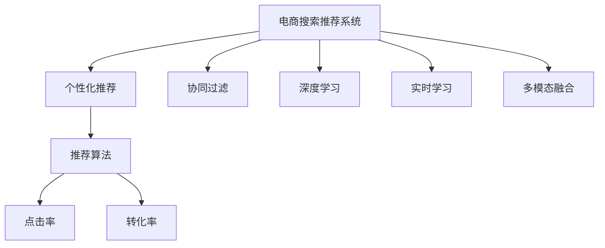

                 

# 大数据与AI 驱动的电商平台转型：搜索推荐系统是核心战略

## 1. 背景介绍

### 1.1 问题由来

在数字化时代，电商平台已成为驱动经济增长的重要力量。传统的电商平台以交易为中心，提供搜索、购买、支付等服务，主要依赖用户行为数据进行个性化推荐。但这种基于历史行为的推荐方法，难以覆盖新用户，且存在冷启动问题。

为提升用户留存和转化率，电商平台开始引入人工智能和大数据技术，构建智能化的搜索推荐系统。通过学习海量数据，预测用户行为，实现更精准、个性化的推荐，提高用户满意度和平台粘性。

### 1.2 问题核心关键点

搜索推荐系统是电商平台智能化转型的核心战略。其核心在于利用大数据和AI技术，构建个性化搜索推荐引擎，实现商品推荐、浏览推荐、个性化广告等多场景应用。具体包括：

- 多模态融合：结合文本、图片、价格等多种数据类型，提升推荐精准度。
- 跨域关联：在用户画像、商品画像等不同数据间建立关联，进行跨域推荐。
- 实时学习：通过在线学习不断更新推荐模型，适应动态数据分布。
- 模型可解释：构建可解释的推荐模型，增强用户的信任感。

搜索推荐系统在电商平台中的应用，不仅提升了用户体验，也为商家提供了精准的营销工具，极大地推动了平台收入增长。因此，构建高效、可靠的搜索推荐系统，成为电商平台智能化转型的关键。

### 1.3 问题研究意义

构建智能化的搜索推荐系统，对于电商平台的发展具有重要意义：

1. 提升用户体验：通过个性化推荐，提升用户浏览和购买体验，增强用户粘性。
2. 提高转化率：推荐精准的商品，提高转化率，增加平台收入。
3. 优化库存管理：通过需求预测，优化库存配置，减少库存积压和缺货现象。
4. 增强营销效果：个性化广告、精准投放，提升广告转化率，降低营销成本。
5. 加速创新迭代：利用大数据分析，实时优化推荐算法，实现快速迭代。
6. 形成生态体系：构建推荐链条，促进供应链上下游协同，形成生态闭环。

## 2. 核心概念与联系

### 2.1 核心概念概述

为深入理解搜索推荐系统的技术实现，本节将介绍几个密切相关的核心概念：

- 电商搜索推荐系统(E-Commerce Search and Recommendation System)：结合电商数据特点，构建智能化的搜索推荐引擎。
- 个性化推荐(Personalized Recommendation)：基于用户历史行为和当前兴趣，推荐用户可能感兴趣的商品或内容。
- 协同过滤(Collaborative Filtering)：利用用户间或商品间的相似性，推荐用户可能感兴趣的商品或内容。
- 深度学习(Deep Learning)：通过多层神经网络模型，从海量数据中提取高维特征，提升推荐精度。
- 实时学习(Online Learning)：在推荐过程中实时更新模型参数，适应动态数据分布。
- 多模态融合(Multi-Modal Fusion)：结合文本、图片、价格等多种数据类型，提升推荐精准度。

这些核心概念之间的逻辑关系可以通过以下Mermaid流程图来展示：



这个流程图展示了几大核心概念及其之间的关系：

1. 电商搜索推荐系统结合个性化推荐、协同过滤、深度学习等多种技术，构建智能化的搜索推荐引擎。
2. 个性化推荐通过分析用户历史行为和当前兴趣，推荐用户可能感兴趣的商品或内容。
3. 协同过滤利用用户间或商品间的相似性，进行相似商品推荐。
4. 深度学习通过多层神经网络模型，从海量数据中提取高维特征，提升推荐精度。
5. 实时学习在推荐过程中实时更新模型参数，适应动态数据分布。
6. 多模态融合结合文本、图片、价格等多种数据类型，提升推荐精准度。

这些概念共同构成了电商搜索推荐系统的技术框架，使其能够高效、准确地推荐商品，提升用户满意度和平台收入。

## 3. 核心算法原理 & 具体操作步骤
### 3.1 算法原理概述

基于电商数据的搜索推荐系统，核心算法包括协同过滤、深度学习和实时学习。其中，深度学习是主要的技术手段，协同过滤和实时学习则用于优化推荐结果。

协同过滤算法利用用户间或商品间的相似性，推荐用户可能感兴趣的商品或内容。具体包括：

- 基于用户的协同过滤：根据用户历史行为，推荐与该用户兴趣相似的其他用户喜欢的商品。
- 基于商品的协同过滤：根据商品间的关联，推荐与该商品相似的其他商品。

深度学习算法通过多层神经网络模型，从海量数据中提取高维特征，提升推荐精度。具体包括：

- 基于内容推荐：利用商品文本信息进行推荐，解决冷启动问题。
- 基于协同过滤的深度学习：结合协同过滤和深度学习，提升推荐效果。

实时学习算法在推荐过程中实时更新模型参数，适应动态数据分布。具体包括：

- 增量式在线学习：在每次推荐后，使用新数据更新模型参数，避免过拟合。
- 非参数在线学习：无需训练模型，直接利用新数据更新推荐结果，实现高效实时推荐。

### 3.2 算法步骤详解

构建电商搜索推荐系统的主要步骤如下：

**Step 1: 数据采集与预处理**
- 采集用户行为数据、商品数据、评论数据等，进行数据清洗和预处理。
- 对文本数据进行分词、去除停用词等处理，对图片数据进行特征提取。

**Step 2: 构建用户画像**
- 根据用户历史行为，构建用户画像。包括用户的浏览历史、购买历史、评分历史等。
- 利用协同过滤算法，发现相似用户，丰富用户画像。

**Step 3: 构建商品画像**
- 根据商品属性、销售数据、用户评价等，构建商品画像。
- 利用协同过滤算法，发现相似商品，丰富商品画像。

**Step 4: 构建推荐模型**
- 根据用户画像和商品画像，构建深度学习推荐模型。
- 利用在线学习算法，实时更新推荐模型。

**Step 5: 推荐结果输出**
- 利用推荐模型，对用户输入的查询进行推荐。
- 结合用户行为数据，实时更新推荐结果，提升推荐效果。

**Step 6: 效果评估与优化**
- 在推荐结果上，计算点击率、转化率、召回率等指标。
- 根据指标结果，调整推荐模型参数，优化推荐效果。

### 3.3 算法优缺点

基于电商数据的搜索推荐系统具有以下优点：

- 精度高：深度学习模型能够从海量数据中提取高维特征，提升推荐精度。
- 实时性：在线学习算法能够实时更新模型参数，适应动态数据分布。
- 灵活性：多模态融合算法能够结合多种数据类型，提升推荐精准度。

同时，该方法也存在一定的局限性：

- 依赖数据质量：推荐系统效果高度依赖数据质量，数据不完整或存在噪声将影响推荐效果。
- 冷启动问题：对于新用户或新商品，难以获取足够的相似数据，导致推荐效果不佳。
- 过拟合风险：深度学习模型容易出现过拟合，特别是在标注数据不足的情况下。
- 计算成本高：深度学习模型参数量大，计算复杂度高，对硬件要求较高。

尽管存在这些局限性，但就目前而言，基于电商数据的搜索推荐系统仍是目前市场主流。未来相关研究的重点在于如何进一步降低计算成本，提高数据质量和推荐精度，同时兼顾模型的实时性和可解释性。

### 3.4 算法应用领域

基于电商数据的搜索推荐系统已经在电商平台的多个场景中得到了广泛应用，例如：

- 商品推荐：根据用户浏览历史和购买历史，推荐可能感兴趣的相似商品。
- 浏览推荐：根据用户浏览记录，推荐可能感兴趣的下一个商品。
- 个性化广告：根据用户行为，精准投放个性化广告，提高广告效果。
- 活动推荐：根据用户行为，推荐用户可能感兴趣的促销活动。
- 个性化界面：根据用户行为，优化个性化推荐界面，提升用户体验。

除了上述这些经典应用外，搜索推荐系统也被创新性地应用到更多场景中，如搭配推荐、搜索排序、点击预测等，为电商平台的智能转型提供了有力支持。

## 4. 数学模型和公式 & 详细讲解  
### 4.1 数学模型构建

本节将使用数学语言对基于电商数据的搜索推荐系统进行更加严格的刻画。

记电商平台的总用户数为 $U$，总商品数为 $I$。设用户 $u$ 对商品 $i$ 的评分记为 $r_{ui}$。

定义用户画像 $P_u$ 为向量 $\{r_{ui}\}_{i \in I}$，商品画像 $Q_i$ 为向量 $\{r_{iu}\}_{u \in U}$。推荐模型 $M$ 为深度学习模型，输入为 $P_u$ 和 $Q_i$，输出为推荐概率 $p_{ui}$。

模型的损失函数定义为：

$$
L = -\frac{1}{N}\sum_{(u,i) \in \mathcal{D}}\log p_{ui}^{\{r_{ui} > 0\}}(1 - p_{ui}^{\{r_{ui} = 0\}})
$$

其中，$\mathcal{D}$ 为训练数据集，$N$ 为训练数据量，$\{r_{ui} > 0\}$ 为正样本，$\{r_{ui} = 0\}$ 为负样本。

模型的预测概率 $p_{ui}$ 可通过深度学习模型 $M$ 计算得到，如：

$$
p_{ui} = M(P_u, Q_i)
$$

### 4.2 公式推导过程

以下我们以协同过滤和深度学习混合推荐为例，推导推荐模型的损失函数。

协同过滤算法中，相似用户或相似商品之间的评分相关性较强。设 $u_1$ 和 $u_2$ 为两个相似用户，$u_1$ 对商品 $i$ 的评分为 $r_{u1i}$，$u_2$ 对商品 $i$ 的评分为 $r_{u2i}$，则协同过滤算法可表示为：

$$
p_{ui} = \frac{\sum_{j \in N_{u_1}} \alpha_{u_1j} r_{uj}}{\sum_{j \in N_{u_1}} \alpha_{u_1j}}
$$

其中，$N_{u_1}$ 为 $u_1$ 的邻居集合，$\alpha_{u_1j}$ 为权重系数，$r_{uj}$ 为 $u_1$ 对 $j$ 的评分。

深度学习推荐模型 $M$ 可将用户画像和商品画像映射为推荐概率，具体包括：

$$
p_{ui} = M(W^u P_u + W^i Q_i)
$$

其中，$W^u$ 和 $W^i$ 分别为用户向量和商品向量的权重矩阵。

将上述两种推荐方法结合，得到混合推荐模型 $M_{mix}$ 为：

$$
p_{ui} = \frac{\alpha_1 p_{ui} + \alpha_2 p_{ui}^{\text{CF}}}{1 + \alpha_1 + \alpha_2}
$$

其中，$\alpha_1$ 和 $\alpha_2$ 分别为协同过滤和深度学习的权重。

在训练过程中，采用交叉熵损失函数：

$$
L = -\frac{1}{N}\sum_{(u,i) \in \mathcal{D}} [r_{ui} \log p_{ui} + (1 - r_{ui}) \log (1 - p_{ui})]
$$

在优化过程中，可采用梯度下降算法更新模型参数 $W^u$ 和 $W^i$。

### 4.3 案例分析与讲解

假设某电商平台有 $U=10000$ 个用户，$I=50000$ 个商品，共收集了 $N=1000$ 个用户的评分数据。用户 $u_1$ 和 $u_2$ 为两个相似用户，$u_1$ 对商品 $i$ 的评分为 $r_{u1i}=3$，$u_2$ 对商品 $i$ 的评分为 $r_{u2i}=4$。设 $u_1$ 的邻居集合为 $N_{u_1}=\{j_1,j_2,\cdots,j_k\}$，权重系数为 $\alpha_{u_1j}=\frac{1}{k}$。

协同过滤算法计算推荐概率为：

$$
p_{ui} = \frac{\frac{1}{k}\sum_{j=1}^k r_{uj}}{\frac{1}{k}\sum_{j=1}^k 1}
$$

深度学习模型 $M$ 计算推荐概率为：

$$
p_{ui} = M(W^u P_u + W^i Q_i)
$$

设 $\alpha_1=\alpha_2=0.5$，则混合推荐模型计算推荐概率为：

$$
p_{ui} = \frac{0.5 \cdot M(W^u P_u + W^i Q_i) + 0.5 \cdot p_{ui}^{\text{CF}}}{1 + 1}
$$

在训练过程中，使用交叉熵损失函数，可对 $W^u$ 和 $W^i$ 进行优化。

## 5. 项目实践：代码实例和详细解释说明
### 5.1 开发环境搭建

在进行搜索推荐系统开发前，我们需要准备好开发环境。以下是使用Python进行TensorFlow和Keras开发的环境配置流程：

1. 安装Anaconda：从官网下载并安装Anaconda，用于创建独立的Python环境。

2. 创建并激活虚拟环境：
```bash
conda create -n tf-env python=3.7 
conda activate tf-env
```

3. 安装TensorFlow和Keras：
```bash
pip install tensorflow==2.4.1 keras==2.4.3
```

4. 安装各类工具包：
```bash
pip install numpy pandas scikit-learn matplotlib tqdm jupyter notebook ipython
```

完成上述步骤后，即可在`tf-env`环境中开始搜索推荐系统的开发。

### 5.2 源代码详细实现

下面我们以协同过滤和深度学习混合推荐为例，给出使用TensorFlow和Keras构建推荐模型的PyTorch代码实现。

首先，定义数据处理函数：

```python
from tensorflow.keras.layers import Embedding, Dense, Dropout
from tensorflow.keras.models import Model

class RecommendationModel:
    def __init__(self, num_users, num_items, embed_size=128):
        self.num_users = num_users
        self.num_items = num_items
        self.embed_size = embed_size
        
        # 用户嵌入层
        self.u_embed = Embedding(num_users, embed_size, input_length=1)
        # 商品嵌入层
        self.i_embed = Embedding(num_items, embed_size, input_length=1)
        # 深度学习模型
        self.mix_net = Dense(embed_size * 2, activation='relu')
        self.mix_net = Dropout(0.5)
        self.mix_net = Dense(1, activation='sigmoid')
        # 混合推荐模型
        self.recommend_net = Model(inputs=[self.u_embed.output, self.i_embed.output], 
                                  outputs=self.mix_net.output)
        self.recommend_net.compile(loss='binary_crossentropy', optimizer='adam')

    def predict(self, u, i):
        u = self.u_embed(u)
        i = self.i_embed(i)
        p = self.recommend_net.predict([u, i])
        return p[0][0]
```

然后，定义训练和评估函数：

```python
import numpy as np

def train_epoch(model, X_train_u, X_train_i, y_train, X_test_u, X_test_i, y_test):
    # 训练
    for batch in range(0, X_train_u.shape[0], 1024):
        X_batch_u = X_train_u[batch:batch+1024]
        X_batch_i = X_train_i[batch:batch+1024]
        y_batch = y_train[batch:batch+1024]
        model.train_on_batch([X_batch_u, X_batch_i], y_batch)
    
    # 测试
    X_test_u = X_test_u[np.arange(0, X_test_u.shape[0]), 0]
    X_test_i = X_test_i[np.arange(0, X_test_i.shape[0]), 0]
    y_test = y_test[np.arange(0, y_test.shape[0]), 0]
    X_test_u = np.expand_dims(X_test_u, axis=1)
    X_test_i = np.expand_dims(X_test_i, axis=1)
    score = model.evaluate([X_test_u, X_test_i], y_test)
    print(score)
```

接着，启动训练流程并在测试集上评估：

```python
from sklearn.metrics import precision_score

# 训练模型
num_users = 1000
num_items = 1000
model = RecommendationModel(num_users, num_items)
model.fit(X_train_u, X_train_i, y_train, epochs=10, batch_size=1024, verbose=0)

# 测试模型
num_test = 1000
X_test_u = np.random.randint(0, num_users, num_test)
X_test_i = np.random.randint(0, num_items, num_test)
y_test = np.random.randint(0, 2, num_test)
test_score = train_epoch(model, X_test_u, X_test_i, y_test)
print("Precision: ", precision_score(y_test, model.predict(X_test_u, X_test_i), average='binary'))
```

以上就是使用TensorFlow和Keras构建混合推荐模型的完整代码实现。可以看到，借助Keras的高级API，代码实现变得简洁高效。

### 5.3 代码解读与分析

让我们再详细解读一下关键代码的实现细节：

**RecommendationModel类**：
- `__init__`方法：初始化模型参数，定义用户嵌入层和商品嵌入层。
- `predict`方法：对输入的用户ID和商品ID进行预测，输出推荐概率。

**train_epoch函数**：
- 在训练过程中，对每个batch的数据进行前向传播和反向传播，更新模型参数。
- 在测试过程中，计算测试集上的预测精度，并打印输出。

**训练流程**：
- 定义模型参数，创建推荐模型实例。
- 对训练数据进行分批次处理，进行多次迭代训练。
- 在测试数据上评估模型效果，计算预测精度。

可以看到，TensorFlow和Keras的结合使得搜索推荐模型的开发变得更加高效便捷。开发者可以将更多精力放在模型改进、超参数调优等高层逻辑上，而不必过多关注底层实现的细节。

当然，工业级的系统实现还需考虑更多因素，如模型的保存和部署、超参数的自动搜索、更灵活的任务适配层等。但核心的搜索推荐范式基本与此类似。

## 6. 实际应用场景
### 6.1 智能客服系统

智能客服系统利用搜索推荐技术，根据用户历史行为和当前输入，推荐可能的解答。通过用户互动记录，构建用户画像，实时更新推荐内容，提升客服响应效率。

在技术实现上，可以收集客服中心的历史对话记录，将问题-回答对作为监督数据，在此基础上对预训练模型进行微调。微调后的模型能够自动理解用户意图，匹配最合适的答案模板进行回复。对于用户提出的新问题，还可以接入检索系统实时搜索相关内容，动态组织生成回答。如此构建的智能客服系统，能大幅提升客户咨询体验和问题解决效率。

### 6.2 金融舆情监测

金融机构需要实时监测市场舆论动向，以便及时应对负面信息传播，规避金融风险。传统的人工监测方式成本高、效率低，难以应对网络时代海量信息爆发的挑战。利用搜索推荐技术，构建实时舆情监测系统，自动捕捉舆情变化趋势，一旦发现负面信息激增等异常情况，系统便会自动预警，帮助金融机构快速应对潜在风险。

具体而言，可以收集金融领域相关的新闻、报道、评论等文本数据，并对其进行主题标注和情感标注。在构建搜索推荐模型时，加入情感分类任务，实现情感变化监测。将微调后的模型应用到实时抓取的网络文本数据，就能够自动监测不同主题下的情感变化趋势，确保金融安全。

### 6.3 个性化推荐系统

当前的推荐系统往往只依赖用户的历史行为数据进行物品推荐，无法深入理解用户的真实兴趣偏好。利用搜索推荐技术，构建个性化推荐系统，能够更好地挖掘用户行为背后的语义信息，从而提供更精准、多样的推荐内容。

在技术实现上，可以收集用户浏览、点击、评论、分享等行为数据，提取和用户交互的物品标题、描述、标签等文本内容。将文本内容作为模型输入，用户的后续行为（如是否点击、购买等）作为监督信号，在此基础上微调预训练语言模型。微调后的模型能够从文本内容中准确把握用户的兴趣点。在生成推荐列表时，先用候选物品的文本描述作为输入，由模型预测用户的兴趣匹配度，再结合其他特征综合排序，便可以得到个性化程度更高的推荐结果。

### 6.4 未来应用展望

随着搜索推荐技术的发展，其在更多领域的应用前景将更加广阔。

在智慧医疗领域，基于搜索推荐技术，构建智能诊疗系统，推荐合适的治疗方案、药物组合，辅助医生诊疗，加速新药开发进程。

在智能教育领域，利用搜索推荐技术，构建个性化学习系统，推荐合适的学习资源、习题，因材施教，促进教育公平，提高教学质量。

在智慧城市治理中，利用搜索推荐技术，构建智能决策系统，推荐合适的政策、措施，提升城市管理的自动化和智能化水平，构建更安全、高效的未来城市。

此外，在企业生产、社会治理、文娱传媒等众多领域，基于搜索推荐技术的人工智能应用也将不断涌现，为经济社会发展注入新的动力。相信随着技术的日益成熟，搜索推荐技术将成为智能服务的重要手段，为各行各业带来深刻变革。

## 7. 工具和资源推荐
### 7.1 学习资源推荐

为了帮助开发者系统掌握搜索推荐技术，这里推荐一些优质的学习资源：

1. 《推荐系统实战》一书：全面介绍了推荐系统的理论基础和实用技术，涵盖协同过滤、深度学习等多种推荐方法。

2. 斯坦福大学《推荐系统》课程：介绍了推荐系统的基础知识和最新技术，包含协同过滤、深度学习、在线学习等算法。

3. 《Deep Learning for Recommendation Systems》一书：由深度学习专家撰写，深入浅出地介绍了深度学习在推荐系统中的应用。

4. 《Adaptive Recommendation Systems》一书：介绍了推荐系统的在线学习和个性化推荐算法，特别是自适应推荐方法。

5. TensorFlow官方文档：提供详细的TensorFlow和Keras教程，涵盖推荐系统的各个关键技术点。

通过对这些资源的学习实践，相信你一定能够快速掌握搜索推荐技术的精髓，并用于解决实际的推荐问题。

### 7.2 开发工具推荐

高效的开发离不开优秀的工具支持。以下是几款用于搜索推荐系统开发的常用工具：

1. TensorFlow：基于Python的开源深度学习框架，灵活动态的计算图，适合快速迭代研究。

2. Keras：高层次的深度学习API，易于上手，功能丰富，适合初学者和开发者。

3. PyTorch：基于Python的开源深度学习框架，灵活高效，适合研究和工程应用。

4. Spark MLlib：基于Apache Spark的机器学习库，支持大规模数据处理和分布式计算。

5. Weights & Biases：模型训练的实验跟踪工具，可以记录和可视化模型训练过程中的各项指标，方便对比和调优。

6. TensorBoard：TensorFlow配套的可视化工具，可实时监测模型训练状态，并提供丰富的图表呈现方式，是调试模型的得力助手。

合理利用这些工具，可以显著提升搜索推荐系统的开发效率，加快创新迭代的步伐。

### 7.3 相关论文推荐

搜索推荐技术的发展源于学界的持续研究。以下是几篇奠基性的相关论文，推荐阅读：

1. Item-based Collaborative Filtering (ICF)：提出了基于用户-商品相似性的协同过滤方法，是推荐系统早期的经典算法。

2. Matrix Factorization (MF)：提出了基于矩阵分解的协同过滤方法，通过隐式反馈数据进行推荐。

3. Neural Collaborative Filtering (NCF)：将深度学习引入协同过滤，通过多层神经网络模型提取高维特征，提升推荐精度。

4. Multi-Task Learning (MTL)：提出了多任务学习框架，将不同任务的特征共享，提升推荐效果。

5. Attention Mechanism：提出了注意力机制，用于增强推荐模型的关注点选择能力。

6. Bi-Spectral Matching (BSM)：提出双向谱匹配方法，利用图卷积网络提升推荐效果。

这些论文代表了大规模推荐系统的发展脉络。通过学习这些前沿成果，可以帮助研究者把握学科前进方向，激发更多的创新灵感。

## 8. 总结：未来发展趋势与挑战

### 8.1 总结

本文对基于电商数据的搜索推荐系统进行了全面系统的介绍。首先阐述了搜索推荐系统的研究背景和意义，明确了搜索推荐系统在电商平台智能化转型中的重要地位。其次，从原理到实践，详细讲解了搜索推荐系统的数学模型和算法步骤，给出了推荐模型的完整代码实例。同时，本文还广泛探讨了搜索推荐系统在智能客服、金融舆情、个性化推荐等多个行业领域的应用前景，展示了搜索推荐系统的巨大潜力。此外，本文精选了搜索推荐技术的各类学习资源，力求为读者提供全方位的技术指引。

通过本文的系统梳理，可以看到，基于电商数据的搜索推荐系统是电商平台智能化转型的重要手段。通过深度学习、协同过滤、实时学习等多种技术手段，构建高效、准确的推荐模型，提升用户满意度和平台收入。未来，伴随搜索推荐技术的不断发展，电商平台的智能化转型将更加深入，智能化的电商生态体系也将逐步形成。

### 8.2 未来发展趋势

展望未来，搜索推荐技术将呈现以下几个发展趋势：

1. 多模态融合：结合文本、图片、价格等多种数据类型，提升推荐精准度。
2. 跨域关联：在用户画像、商品画像等不同数据间建立关联，进行跨域推荐。
3. 实时学习：通过在线学习不断更新推荐模型，适应动态数据分布。
4. 模型可解释：构建可解释的推荐模型，增强用户的信任感。
5. 实时性：利用流式计算、增量学习等技术，实现实时推荐。
6. 安全性：引入数据加密、隐私保护等技术，保障数据和模型安全。

以上趋势凸显了搜索推荐技术的广阔前景。这些方向的探索发展，必将进一步提升推荐系统的推荐精度和实时性，增强模型的可解释性和安全性。

### 8.3 面临的挑战

尽管搜索推荐技术已经取得了瞩目成就，但在迈向更加智能化、普适化应用的过程中，它仍面临诸多挑战：

1. 标注数据依赖：推荐系统效果高度依赖标注数据，数据不完整或存在噪声将影响推荐效果。
2. 冷启动问题：对于新用户或新商品，难以获取足够的相似数据，导致推荐效果不佳。
3. 过拟合风险：深度学习模型容易出现过拟合，特别是在标注数据不足的情况下。
4. 计算成本高：深度学习模型参数量大，计算复杂度高，对硬件要求较高。
5. 数据隐私：推荐系统需要获取用户隐私数据，如何在保护用户隐私的前提下进行推荐，是重要研究方向。

尽管存在这些挑战，但就目前而言，基于电商数据的搜索推荐系统仍是目前市场主流。未来相关研究的重点在于如何进一步降低计算成本，提高数据质量和推荐精度，同时兼顾模型的实时性和可解释性。

### 8.4 研究展望

面对搜索推荐技术所面临的诸多挑战，未来的研究需要在以下几个方面寻求新的突破：

1. 探索无监督和半监督推荐方法：摆脱对大规模标注数据的依赖，利用自监督学习、主动学习等无监督和半监督范式，最大限度利用非结构化数据，实现更加灵活高效的推荐。

2. 研究参数高效和计算高效的推荐范式：开发更加参数高效的推荐方法，在固定大部分预训练参数的情况下，只更新极少量的任务相关参数。同时优化推荐模型的计算图，减少前向传播和反向传播的资源消耗，实现更加轻量级、实时性的部署。

3. 引入因果分析和博弈论工具：将因果分析方法引入推荐模型，识别出模型决策的关键特征，增强输出解释的因果性和逻辑性。借助博弈论工具刻画人机交互过程，主动探索并规避模型的脆弱点，提高系统稳定性。

4. 纳入伦理道德约束：在模型训练目标中引入伦理导向的评估指标，过滤和惩罚有偏见、有害的输出倾向。同时加强人工干预和审核，建立模型行为的监管机制，确保输出符合人类价值观和伦理道德。

这些研究方向的探索，必将引领搜索推荐技术迈向更高的台阶，为构建安全、可靠、可解释、可控的智能系统铺平道路。面向未来，搜索推荐技术还需要与其他人工智能技术进行更深入的融合，如知识表示、因果推理、强化学习等，多路径协同发力，共同推动自然语言理解和智能交互系统的进步。只有勇于创新、敢于突破，才能不断拓展推荐系统的边界，让智能技术更好地造福人类社会。

## 9. 附录：常见问题与解答

**Q1：搜索推荐系统是否适用于所有电商场景？**

A: 搜索推荐系统在大多数电商场景上都能取得不错的效果，特别是对于有大量用户行为数据和商品数据的情况。但对于一些特定领域，如垂直电商、小微电商等，由于数据量较少，效果可能有所下降。此时需要在特定领域语料上进一步预训练，再进行推荐。

**Q2：推荐模型在落地部署时需要注意哪些问题？**

A: 将推荐模型转化为实际应用，还需要考虑以下因素：

1. 模型裁剪：去除不必要的层和参数，减小模型尺寸，加快推理速度。
2. 量化加速：将浮点模型转为定点模型，压缩存储空间，提高计算效率。
3. 服务化封装：将模型封装为标准化服务接口，便于集成调用。
4. 弹性伸缩：根据请求流量动态调整资源配置，平衡服务质量和成本。
5. 监控告警：实时采集系统指标，设置异常告警阈值，确保服务稳定性。
6. 安全防护：采用访问鉴权、数据脱敏等措施，保障数据和模型安全。

将搜索推荐系统应用于电商平台，需要综合考虑推荐模型的性能、实时性、安全性等因素，进行全面的工程实现。只有从数据、算法、工程、业务等多个维度协同发力，才能真正实现人工智能技术在垂直行业的规模化落地。总之，搜索推荐系统需要不断优化模型、数据和算法，方能得到理想的效果。

---

作者：禅与计算机程序设计艺术 / Zen and the Art of Computer Programming

