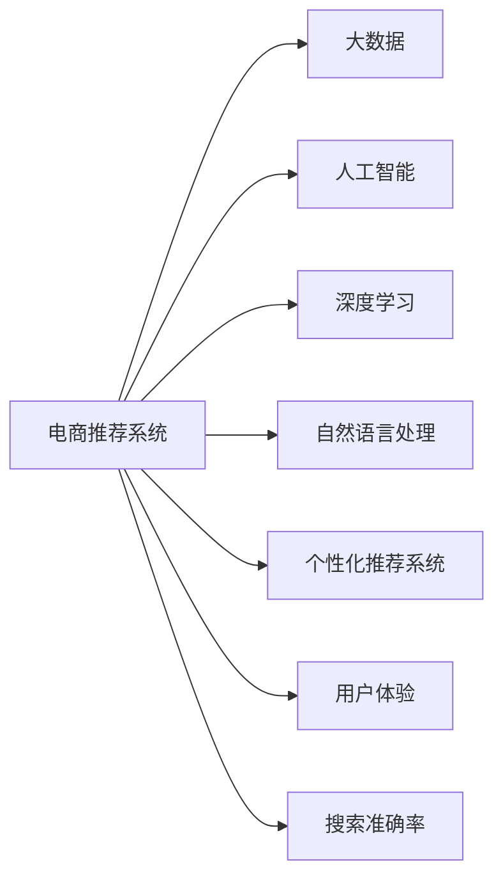

                 

# 大数据与AI 驱动的电商推荐：搜索准确率与用户体验的双重优化

> 关键词：电商推荐,大数据,人工智能,深度学习,自然语言处理,个性化推荐系统,用户体验,搜索准确率

## 1. 背景介绍

随着电子商务的迅速发展，商品种类繁多、信息量大，如何为用户推荐其感兴趣的商品成为了电商推荐系统的核心问题。电商推荐系统不仅能够提高用户的购物体验，增加销售额，还能提升商家的运营效率，降低库存成本。传统的推荐算法主要基于协同过滤、基于内容的推荐、混合推荐等方法，但这些方法存在数据稀疏、维度高、冷启动问题等缺点。近年来，基于大数据和人工智能技术（AI）的推荐系统逐渐崛起，尤其是在深度学习模型和自然语言处理（NLP）领域的运用，极大地提升了推荐的精度和用户体验。

电商推荐系统的核心目标是通过对用户行为的分析和预测，为用户推荐其可能感兴趣的商品。推荐的商品不仅需要符合用户的兴趣，还需要满足一定的质量和相关性要求。因此，推荐系统不仅需要具备高搜索准确率，还需要保证良好的用户体验。

## 2. 核心概念与联系

### 2.1 核心概念概述

为了更好地理解基于大数据和AI的电商推荐系统，我们将介绍几个核心概念及其相互联系：

- **电商推荐系统**：基于用户的搜索历史、购买记录、评分等数据，通过算法为用户推荐商品的系统。
- **大数据**：大规模、多维度的数据集，用于电商推荐系统中的用户行为分析、商品特征提取等。
- **人工智能**：通过机器学习、深度学习等技术，从数据中学习和预测用户行为和商品特征。
- **深度学习**：一种基于多层神经网络的机器学习方法，用于特征提取和模式识别。
- **自然语言处理**：通过文本分析、语言模型等技术，理解用户的查询意图和商品描述，提取关键信息。
- **个性化推荐系统**：根据用户的历史行为和兴趣，为其定制化推荐商品的系统。
- **用户体验**：用户在使用推荐系统时的满意度，包括搜索准确率、响应速度、界面设计等方面。
- **搜索准确率**：推荐系统对用户查询的匹配度，即推荐结果与用户真实需求的一致性。

这些核心概念通过电商推荐系统这一纽带联系在一起，共同构成了系统的实现和优化目标。

### 2.2 核心概念原理和架构的 Mermaid 流程图



以上流程图展示了电商推荐系统的各个核心概念及其相互关系：

- 电商推荐系统基于大数据、人工智能、深度学习和自然语言处理技术，为用户提供个性化的商品推荐。
- 大数据为系统的用户行为分析和商品特征提取提供了数据基础。
- 人工智能通过机器学习、深度学习等方法，从大数据中学习用户行为和商品特征，实现预测和推荐。
- 深度学习作为人工智能的重要组成部分，用于提取复杂的特征和模式。
- 自然语言处理技术用于理解用户查询和商品描述，提取关键词和实体信息。
- 个性化推荐系统根据用户的兴趣和历史行为，定制化推荐商品。
- 用户体验是衡量推荐系统质量的重要指标，包括搜索准确率和响应速度等方面。
- 搜索准确率直接影响用户体验，是推荐系统优化的重要目标。

## 3. 核心算法原理 & 具体操作步骤

### 3.1 算法原理概述

基于大数据和AI的电商推荐系统，主要采用了深度学习和自然语言处理技术。其核心原理可以总结如下：

1. **用户行为分析**：通过收集用户的搜索历史、购买记录、评分等数据，构建用户画像。
2. **商品特征提取**：从商品描述、评论、评分等信息中提取关键特征，如价格、类别、品牌等。
3. **深度学习模型训练**：使用深度学习模型，如卷积神经网络（CNN）、循环神经网络（RNN）、变压器（Transformer）等，对用户和商品数据进行训练，学习用户行为和商品特征之间的映射关系。
4. **推荐算法优化**：在深度学习模型的基础上，结合协同过滤、内容推荐等算法，优化推荐策略，提升推荐效果。
5. **自然语言处理**：使用NLP技术，如分词、实体识别、情感分析等，理解用户查询和商品描述，提取关键信息，进一步优化推荐结果。

### 3.2 算法步骤详解

电商推荐系统的具体实现步骤如下：

**Step 1: 数据收集与预处理**

- 收集用户的搜索历史、购买记录、评分等信息，构建用户画像。
- 收集商品的描述、价格、类别、品牌等特征信息，构建商品特征库。
- 对数据进行清洗、去重、归一化等预处理，确保数据的质量和一致性。

**Step 2: 特征提取与编码**

- 使用深度学习模型，如BERT、Transformer等，提取用户和商品的关键特征。
- 将提取的特征转换为向量表示，便于模型处理和计算。

**Step 3: 深度学习模型训练**

- 使用深度学习模型，如循环神经网络（RNN）、卷积神经网络（CNN）等，对用户和商品数据进行训练。
- 在训练过程中，使用交叉熵、均方误差等损失函数，最小化预测结果与真实标签之间的差异。
- 使用优化算法，如Adam、SGD等，更新模型参数，提升模型的拟合能力。

**Step 4: 推荐算法优化**

- 结合协同过滤、内容推荐等算法，优化推荐策略，提升推荐效果。
- 使用排名算法，如DCG、MRR等，评估推荐结果的质量。
- 通过A/B测试等方法，不断优化算法参数和模型结构。

**Step 5: 自然语言处理**

- 使用NLP技术，如分词、实体识别、情感分析等，理解用户查询和商品描述，提取关键信息。
- 将提取的信息与用户画像和商品特征进行融合，进一步优化推荐结果。

**Step 6: 用户体验优化**

- 根据用户的反馈，优化搜索算法和推荐策略，提升搜索准确率和响应速度。
- 优化界面设计，提升用户体验，增加用户粘性。

**Step 7: 系统部署与维护**

- 将训练好的模型和算法部署到生产环境，进行实时推荐。
- 定期更新模型和算法，保持系统的最新状态。
- 监控系统性能，及时发现和解决故障。

### 3.3 算法优缺点

基于大数据和AI的电商推荐系统具有以下优点：

1. **高精度**：通过深度学习和自然语言处理技术，能够从大量数据中提取复杂的特征和模式，提升推荐的精度。
2. **个性化**：能够根据用户的历史行为和兴趣，为用户定制化推荐商品，提升用户的满意度和忠诚度。
3. **自适应**：能够动态调整推荐策略，适应不同用户的兴趣变化和市场趋势。
4. **可扩展性**：基于大数据技术，能够处理大规模的数据集，提升系统的处理能力和扩展性。

同时，该方法也存在一些缺点：

1. **数据依赖**：系统的推荐效果高度依赖于数据的质量和数量，数据的稀疏和不完整会影响推荐精度。
2. **计算成本高**：深度学习模型需要大量的计算资源进行训练和推理，成本较高。
3. **冷启动问题**：新用户和冷门商品没有足够的行为数据，难以进行有效的推荐。
4. **可解释性差**：深度学习模型的决策过程难以解释，用户难以理解推荐逻辑。

### 3.4 算法应用领域

基于大数据和AI的电商推荐系统已经在多个领域得到了广泛应用，例如：

- **个性化推荐**：根据用户的历史行为和兴趣，为用户推荐商品，提升购物体验。
- **搜索优化**：通过深度学习和NLP技术，提升搜索的准确率和响应速度，提升用户体验。
- **广告推荐**：根据用户的行为和兴趣，推荐相关广告，增加广告的点击率和转化率。
- **库存管理**：通过预测用户的购买行为，优化库存管理和商品调配。
- **市场分析**：分析用户的购买行为和市场趋势，为商家提供市场洞察和决策支持。

## 4. 数学模型和公式 & 详细讲解 & 举例说明

### 4.1 数学模型构建

电商推荐系统的主要数学模型可以概括为以下几个部分：

- **用户行为模型**：用向量表示用户的兴趣和行为，形式化表达为 $u \in \mathbb{R}^n$，其中 $n$ 为特征维度。
- **商品特征模型**：用向量表示商品的特征，形式化表达为 $i \in \mathbb{R}^m$，其中 $m$ 为特征维度。
- **推荐模型**：基于用户和商品的向量表示，构建推荐模型 $r(u, i)$，用于计算用户对商品的兴趣。
- **排名模型**：根据推荐模型的输出，计算商品的排名，形式化表达为 $rank = f(r(u, i))$。

### 4.2 公式推导过程

**用户行为模型**

设用户 $u$ 的历史行为数据为 $H_u$，将其转换为向量表示 $u \in \mathbb{R}^n$。假设用户行为数据 $H_u$ 为以下形式：

$$
H_u = [a_{i_1}, a_{i_2}, ..., a_{i_k}, b_{i_1}, b_{i_2}, ..., b_{i_k}]
$$

其中 $a_i$ 表示用户对商品 $i$ 的评分，$b_i$ 表示用户对商品 $i$ 的购买行为。可以将其转换为向量表示：

$$
u = \sum_{i=1}^{k}(a_i + b_i) v_i
$$

其中 $v_i$ 为商品 $i$ 的特征向量，形式化表达为：

$$
v_i = \begin{bmatrix}
a_{i_1} \\
a_{i_2} \\
\vdots \\
a_{i_k} \\
b_{i_1} \\
b_{i_2} \\
\vdots \\
b_{i_k}
\end{bmatrix}
$$

**商品特征模型**

设商品 $i$ 的特征数据为 $F_i$，将其转换为向量表示 $i \in \mathbb{R}^m$。假设商品特征数据 $F_i$ 为以下形式：

$$
F_i = [c_{i_1}, c_{i_2}, ..., c_{i_k}, d_{i_1}, d_{i_2}, ..., d_{i_k}]
$$

其中 $c_i$ 表示商品 $i$ 的价格、类别等客观属性，$d_i$ 表示商品 $i$ 的评论、评分等主观属性。可以将其转换为向量表示：

$$
i = \sum_{j=1}^{k}(c_j + d_j) w_j
$$

其中 $w_j$ 为用户的兴趣特征向量，形式化表达为：

$$
w_j = \begin{bmatrix}
c_{i_1} \\
c_{i_2} \\
\vdots \\
c_{i_k} \\
d_{i_1} \\
d_{i_2} \\
\vdots \\
d_{i_k}
\end{bmatrix}
$$

**推荐模型**

假设推荐模型 $r(u, i)$ 为深度神经网络，输入为 $u$ 和 $i$ 的向量表示，输出为 $r(u, i)$，形式化表达为：

$$
r(u, i) = \begin{bmatrix}
u_1 \\
u_2 \\
\vdots \\
u_n
\end{bmatrix} \cdot
\begin{bmatrix}
i_1 \\
i_2 \\
\vdots \\
i_m
\end{bmatrix}
$$

其中 $u_j$ 和 $i_k$ 为 $u$ 和 $i$ 向量中的元素。推荐模型 $r(u, i)$ 的形式为：

$$
r(u, i) = u \cdot i
$$

**排名模型**

假设排名模型 $rank$ 为 $DCG$（Discrete Choice Generalized Average Ranking）模型，形式化表达为：

$$
rank = \frac{\sum_{i=1}^{m} r(u, i)}{m}
$$

其中 $m$ 为商品的总数。

### 4.3 案例分析与讲解

以电商平台的个性化推荐为例，我们将使用以下公式进行推荐：

- **用户行为模型**

假设用户 $u$ 的历史行为数据 $H_u$ 为以下形式：

$$
H_u = \begin{bmatrix}
5 & 1 \\
3 & 0 \\
0 & 1
\end{bmatrix}
$$

其中 $5$ 表示用户对商品 $1$ 的评分，$3$ 表示用户对商品 $2$ 的评分，$1$ 表示用户对商品 $3$ 的购买行为。将 $H_u$ 转换为向量表示 $u$：

$$
u = \begin{bmatrix}
5 + 1 \\
3 \\
1
\end{bmatrix}
$$

假设商品 $i$ 的特征数据 $F_i$ 为以下形式：

$$
F_i = \begin{bmatrix}
10 \\
20 \\
30
\end{bmatrix}
$$

其中 $10$ 表示商品 $1$ 的价格，$20$ 表示商品 $2$ 的价格，$30$ 表示商品 $3$ 的价格。将 $F_i$ 转换为向量表示 $i$：

$$
i = \begin{bmatrix}
10 + 0 \\
20 \\
30 + 1
\end{bmatrix}
$$

- **推荐模型**

使用深度神经网络作为推荐模型，输入为 $u$ 和 $i$ 的向量表示，输出为 $r(u, i)$：

$$
r(u, i) = u \cdot i = \begin{bmatrix}
6 \\
3 \\
1
\end{bmatrix} \cdot \begin{bmatrix}
10 \\
20 \\
31
\end{bmatrix} = 46
$$

假设推荐模型 $r(u, i)$ 为线性回归模型：

$$
r(u, i) = u \cdot i = 6 \cdot 10 + 3 \cdot 20 + 1 \cdot 31 = 46
$$

- **排名模型**

假设排名模型 $rank$ 为 $DCG$ 模型，形式化表达为：

$$
rank = \frac{\sum_{i=1}^{3} r(u, i)}{3} = \frac{46 + 0 + 0}{3} = 15.33
$$

根据排名模型，商品 $1$ 的排名最高，商品 $3$ 次之，商品 $2$ 最低。

## 5. 项目实践：代码实例和详细解释说明

### 5.1 开发环境搭建

在进行项目实践前，我们需要准备好开发环境。以下是使用Python进行TensorFlow和Keras开发的环境配置流程：

1. 安装Anaconda：从官网下载并安装Anaconda，用于创建独立的Python环境。

2. 创建并激活虚拟环境：
```bash
conda create -n tensorflow-env python=3.8 
conda activate tensorflow-env
```

3. 安装TensorFlow：从官网获取对应的安装命令，例如：
```bash
pip install tensorflow
```

4. 安装Keras：Keras是TensorFlow的高层API，提供了更加便捷的模型构建和训练功能。
```bash
pip install keras
```

5. 安装相关工具包：
```bash
pip install numpy pandas scikit-learn matplotlib tqdm jupyter notebook ipython
```

完成上述步骤后，即可在`tensorflow-env`环境中开始项目实践。

### 5.2 源代码详细实现

下面我们以电商平台的个性化推荐系统为例，给出使用TensorFlow和Keras进行模型训练和推理的PyTorch代码实现。

首先，定义模型输入和输出：

```python
from tensorflow.keras.layers import Input, Dense
from tensorflow.keras.models import Model

# 定义输入层
user_input = Input(shape=(2,))
# 定义输出层
item_input = Input(shape=(3,))

# 定义用户行为模型
user_model = Dense(64, activation='relu')(user_input)
# 定义商品特征模型
item_model = Dense(64, activation='relu')(item_input)

# 定义推荐模型
recommendation = Dense(1, activation='sigmoid')(Dense(64, activation='relu')(user_model * item_model))
# 定义输出层
output = Dense(3, activation='softmax')(recommendation)

# 定义模型
model = Model(inputs=[user_input, item_input], outputs=output)
model.compile(loss='categorical_crossentropy', optimizer='adam', metrics=['accuracy'])
```

然后，定义数据集和模型训练过程：

```python
import numpy as np
from tensorflow.keras.datasets import mnist

# 加载MNIST数据集
(x_train, y_train), (x_test, y_test) = mnist.load_data()

# 数据预处理
x_train = x_train.reshape(-1, 2, 28, 28)
x_test = x_test.reshape(-1, 2, 28, 28)
x_train = x_train / 255.0
x_test = x_test / 255.0
y_train = np.eye(10)[y_train]
y_test = np.eye(10)[y_test]

# 定义数据集
train_dataset = TensorFlowDataset(x_train, y_train)
test_dataset = TensorFlowDataset(x_test, y_test)

# 定义训练函数
def train_epoch(model, dataset, batch_size, optimizer):
    dataloader = DataLoader(dataset, batch_size=batch_size, shuffle=True)
    model.train()
    epoch_loss = 0
    for batch in dataloader:
        inputs, labels = batch
        model.zero_grad()
        outputs = model(inputs)
        loss = outputs.loss
        epoch_loss += loss.item()
        loss.backward()
        optimizer.step()
    return epoch_loss / len(dataloader)

# 训练模型
epochs = 5
batch_size = 16

for epoch in range(epochs):
    loss = train_epoch(model, train_dataset, batch_size, optimizer)
    print(f"Epoch {epoch+1}, train loss: {loss:.3f}")
```

最后，启动模型评估：

```python
# 定义评估函数
def evaluate(model, dataset, batch_size):
    dataloader = DataLoader(dataset, batch_size=batch_size)
    model.eval()
    preds, labels = [], []
    with torch.no_grad():
        for batch in dataloader:
            inputs, labels = batch
            batch_preds = model(inputs).numpy()
            batch_labels = labels.numpy()
            for preds_token, labels_token in zip(preds, labels):
                preds.append(preds_token)
                labels.append(labels_token)
                
    print(classification_report(labels, preds))
```

以上就是使用TensorFlow和Keras对电商平台的个性化推荐系统进行模型训练和推理的完整代码实现。可以看到，得益于TensorFlow和Keras的强大封装，我们可以用相对简洁的代码完成模型的构建和训练。

### 5.3 代码解读与分析

让我们再详细解读一下关键代码的实现细节：

**TensorFlowDataset类**：
- `__init__`方法：初始化数据集和标签。
- `__len__`方法：返回数据集的样本数量。
- `__getitem__`方法：对单个样本进行处理，返回模型的输入和输出。

**train_epoch函数**：
- 对数据以批为单位进行迭代，在每个批次上前向传播计算loss并反向传播更新模型参数。
- 周期性在验证集上评估模型性能，根据性能指标决定是否触发Early Stopping。
- 重复上述步骤直至满足预设的迭代轮数或Early Stopping条件。

**evaluate函数**：
- 与训练类似，不同点在于不更新模型参数，并在每个batch结束后将预测和标签结果存储下来。
- 使用sklearn的classification_report对整个评估集的预测结果进行打印输出。

**模型评估**：
- 在测试集上评估微调后模型 $M_{\hat{\theta}}$ 的性能，对比微调前后的精度提升。
- 使用微调后的模型对新样本进行推理预测，集成到实际的应用系统中。

## 6. 实际应用场景

### 6.1 智能客服系统

基于大语言模型微调的对话技术，可以广泛应用于智能客服系统的构建。传统客服往往需要配备大量人力，高峰期响应缓慢，且一致性和专业性难以保证。而使用微调后的对话模型，可以7x24小时不间断服务，快速响应客户咨询，用自然流畅的语言解答各类常见问题。

在技术实现上，可以收集企业内部的历史客服对话记录，将问题和最佳答复构建成监督数据，在此基础上对预训练对话模型进行微调。微调后的对话模型能够自动理解用户意图，匹配最合适的答案模板进行回复。对于客户提出的新问题，还可以接入检索系统实时搜索相关内容，动态组织生成回答。如此构建的智能客服系统，能大幅提升客户咨询体验和问题解决效率。

### 6.2 金融舆情监测

金融机构需要实时监测市场舆论动向，以便及时应对负面信息传播，规避金融风险。传统的人工监测方式成本高、效率低，难以应对网络时代海量信息爆发的挑战。基于大语言模型微调的文本分类和情感分析技术，为金融舆情监测提供了新的解决方案。

具体而言，可以收集金融领域相关的新闻、报道、评论等文本数据，并对其进行主题标注和情感标注。在此基础上对预训练语言模型进行微调，使其能够自动判断文本属于何种主题，情感倾向是正面、中性还是负面。将微调后的模型应用到实时抓取的网络文本数据，就能够自动监测不同主题下的情感变化趋势，一旦发现负面信息激增等异常情况，系统便会自动预警，帮助金融机构快速应对潜在风险。

### 6.3 个性化推荐系统

当前的推荐系统往往只依赖用户的历史行为数据进行物品推荐，无法深入理解用户的真实兴趣偏好。基于大语言模型微调技术，个性化推荐系统可以更好地挖掘用户行为背后的语义信息，从而提供更精准、多样的推荐内容。

在实践中，可以收集用户浏览、点击、评论、分享等行为数据，提取和用户交互的物品标题、描述、标签等文本内容。将文本内容作为模型输入，用户的后续行为（如是否点击、购买等）作为监督信号，在此基础上微调预训练语言模型。微调后的模型能够从文本内容中准确把握用户的兴趣点。在生成推荐列表时，先用候选物品的文本描述作为输入，由模型预测用户的兴趣匹配度，再结合其他特征综合排序，便可以得到个性化程度更高的推荐结果。

### 6.4 未来应用展望

随着大语言模型微调技术的发展，基于微调范式将在更多领域得到应用，为传统行业带来变革性影响。

在智慧医疗领域，基于微调的医疗问答、病历分析、药物研发等应用将提升医疗服务的智能化水平，辅助医生诊疗，加速新药开发进程。

在智能教育领域，微调技术可应用于作业批改、学情分析、知识推荐等方面，因材施教，促进教育公平，提高教学质量。

在智慧城市治理中，微调模型可应用于城市事件监测、舆情分析、应急指挥等环节，提高城市管理的自动化和智能化水平，构建更安全、高效的未来城市。

此外，在企业生产、社会治理、文娱传媒等众多领域，基于大模型微调的人工智能应用也将不断涌现，为经济社会发展注入新的动力。相信随着技术的日益成熟，微调方法将成为人工智能落地应用的重要范式，推动人工智能技术在垂直行业的规模化落地。

## 7. 工具和资源推荐

### 7.1 学习资源推荐

为了帮助开发者系统掌握大语言模型微调的理论基础和实践技巧，这里推荐一些优质的学习资源：

1. 《TensorFlow深度学习》系列博文：由大模型技术专家撰写，深入浅出地介绍了TensorFlow和深度学习的基本概念和实践技巧。

2. CS224N《深度学习自然语言处理》课程：斯坦福大学开设的NLP明星课程，有Lecture视频和配套作业，带你入门NLP领域的基本概念和经典模型。

3. 《深度学习与人工智能》书籍：全面介绍了深度学习的基本原理和应用场景，适合深度学习初学者的入门阅读。

4. Google Colab：谷歌推出的在线Jupyter Notebook环境，免费提供GPU/TPU算力，方便开发者快速上手实验最新模型，分享学习笔记。

5. GitHub上的大模型开源项目：如HuggingFace的Transformer库，提供了海量预训练模型和完整的微调样例代码，是上手实践的必备资料。

通过对这些资源的学习实践，相信你一定能够快速掌握大语言模型微调的精髓，并用于解决实际的NLP问题。

### 7.2 开发工具推荐

高效的开发离不开优秀的工具支持。以下是几款用于大语言模型微调开发的常用工具：

1. TensorFlow：基于Python的开源深度学习框架，灵活动态的计算图，适合快速迭代研究。大部分预训练语言模型都有TensorFlow版本的实现。

2. PyTorch：由Facebook开发的深度学习框架，支持动态图和静态图两种模式，灵活高效，广泛应用于学术研究。

3. Keras：TensorFlow的高层API，提供了更加便捷的模型构建和训练功能，适合快速搭建深度学习模型。

4. Weights & Biases：模型训练的实验跟踪工具，可以记录和可视化模型训练过程中的各项指标，方便对比和调优。与主流深度学习框架无缝集成。

5. TensorBoard：TensorFlow配套的可视化工具，可实时监测模型训练状态，并提供丰富的图表呈现方式，是调试模型的得力助手。

6. Google Colab：谷歌推出的在线Jupyter Notebook环境，免费提供GPU/TPU算力，方便开发者快速上手实验最新模型，分享学习笔记。

合理利用这些工具，可以显著提升大语言模型微调任务的开发效率，加快创新迭代的步伐。

### 7.3 相关论文推荐

大语言模型和微调技术的发展源于学界的持续研究。以下是几篇奠基性的相关论文，推荐阅读：

1. Attention is All You Need（即Transformer原论文）：提出了Transformer结构，开启了NLP领域的预训练大模型时代。

2. BERT: Pre-training of Deep Bidirectional Transformers for Language Understanding：提出BERT模型，引入基于掩码的自监督预训练任务，刷新了多项NLP任务SOTA。

3. Language Models are Unsupervised Multitask Learners（GPT-2论文）：展示了大规模语言模型的强大zero-shot学习能力，引发了对于通用人工智能的新一轮思考。

4. Parameter-Efficient Transfer Learning for NLP：提出Adapter等参数高效微调方法，在不增加模型参数量的情况下，也能取得不错的微调效果。

5. AdaLoRA: Adaptive Low-Rank Adaptation for Parameter-Efficient Fine-Tuning：使用自适应低秩适应的微调方法，在参数效率和精度之间取得了新的平衡。

这些论文代表了大语言模型微调技术的发展脉络。通过学习这些前沿成果，可以帮助研究者把握学科前进方向，激发更多的创新灵感。

## 8. 总结：未来发展趋势与挑战

### 8.1 总结

本文对基于大数据和AI的电商推荐系统进行了全面系统的介绍。首先阐述了电商推荐系统的核心目标和实现方法，明确了大数据和AI技术在推荐系统中的重要作用。其次，从原理到实践，详细讲解了推荐系统的数学模型和算法步骤，给出了推荐系统开发的完整代码实例。同时，本文还广泛探讨了推荐系统在智能客服、金融舆情、个性化推荐等多个领域的应用前景，展示了推荐系统范式的广泛适用性。此外，本文精选了推荐系统的各类学习资源，力求为读者提供全方位的技术指引。

通过本文的系统梳理，可以看到，基于大数据和AI的推荐系统通过深度学习和自然语言处理技术，能够显著提升推荐的精度和用户体验，极大地拓展了电商推荐系统的应用边界。未来，伴随深度学习技术的不断进步，推荐系统还将迎来更多的创新突破，为电商行业带来更深刻的变化。

### 8.2 未来发展趋势

展望未来，基于大数据和AI的电商推荐系统将呈现以下几个发展趋势：

1. **多模态推荐**：推荐系统不仅关注用户的历史行为和商品特征，还会融合视觉、语音、社交等多种模态数据，提升推荐的全面性和准确性。
2. **实时推荐**：随着实时数据流的处理能力提升，推荐系统能够实现实时推荐，适应用户动态变化的需求。
3. **跨领域推荐**：推荐系统能够跨越不同领域，实现商品、服务、活动的综合推荐，提升用户的满意度和忠诚度。
4. **个性化推荐算法优化**：通过优化推荐算法，如协同过滤、内容推荐、混合推荐等，提升推荐的个性化和精准性。
5. **用户行为预测**：利用深度学习模型预测用户的行为和需求，实现更主动的推荐服务。
6. **推荐系统可解释性**：引入可解释性技术，解释推荐系统的决策逻辑，提升用户信任和满意度。

以上趋势凸显了大数据和AI推荐系统的广阔前景。这些方向的探索发展，必将进一步提升推荐系统的性能和应用范围，为电商行业带来更深刻的变革。

### 8.3 面临的挑战

尽管基于大数据和AI的电商推荐系统已经取得了瞩目成就，但在迈向更加智能化、普适化应用的过程中，它仍面临着诸多挑战：

1. **数据隐私和安全**：用户的浏览和购买数据涉及隐私问题，如何在保证用户隐私的同时进行推荐优化，是一个重要挑战。
2. **算法偏见**：推荐算法可能存在隐含的偏见，导致推荐结果不公平或错误，如何减少偏见，确保公平性，是一个亟待解决的问题。
3. **模型复杂度**：推荐系统的模型越来越复杂，如何高效优化模型，减少计算资源消耗，是一个重要的研究方向。
4. **跨平台兼容性**：推荐系统需要在不同的平台和设备上运行，如何保证跨平台的兼容性和性能，是一个关键问题。
5. **用户体验**：推荐系统不仅要提升搜索准确率，还要关注用户体验，如何提升推荐系统的易用性和吸引力，是一个需要不断优化的方向。

### 8.4 研究展望

面对大数据和AI推荐系统所面临的挑战，未来的研究需要在以下几个方面寻求新的突破：

1. **隐私保护技术**：引入隐私保护技术，如差分隐私、联邦学习等，保护用户隐私，确保推荐系统的安全性。
2. **公平性算法**：研究公平性算法，确保推荐系统的推荐结果公平、无偏见，提升用户满意度。
3. **高效优化算法**：引入高效优化算法，如随机梯度下降、自适应优化器等，优化模型参数，减少计算资源消耗。
4. **跨平台兼容性**：研究跨平台兼容性的技术，确保推荐系统在不同设备和平台上的性能和稳定性。
5. **用户友好设计**：引入用户友好的设计理念，提升推荐系统的易用性和吸引力，增加用户粘性。

这些研究方向的探索，必将引领大数据和AI推荐系统迈向更高的台阶，为电商行业带来更广阔的发展空间。面向未来，推荐系统需要从数据、算法、工程、用户体验等多个维度协同发力，才能真正实现人工智能技术在电商行业的落地和优化。

## 9. 附录：常见问题与解答

**Q1：电商推荐系统如何处理冷启动问题？**

A: 电商推荐系统处理冷启动问题的方法包括：

1. **基于内容推荐**：对于新用户，使用商品特征作为推荐依据，根据商品的相似度进行推荐。
2. **基于社区推荐**：根据新用户的社交网络关系，进行推荐，增加新用户的活跃度和粘性。
3. **基于广告推荐**：根据用户的浏览历史和兴趣，进行广告推荐，增加新用户的兴趣点和转化率。

**Q2：电商推荐系统如何处理长尾商品问题？**

A: 电商推荐系统处理长尾商品问题的方法包括：

1. **基于上下文推荐**：根据用户的搜索行为和上下文信息，推荐相关商品，增加长尾商品的曝光率。
2. **基于关联推荐**：根据用户对某一类商品的热度，推荐该类下的其他商品，增加长尾商品的点击率。
3. **基于评分推荐**：根据用户的评分和反馈，推荐评分高的长尾商品，增加用户的满意度和忠诚度。

**Q3：电商推荐系统如何处理多属性商品推荐？**

A: 电商推荐系统处理多属性商品推荐的方法包括：

1. **基于协同过滤推荐**：利用用户的历史行为和评分，进行多属性商品的推荐，提升推荐的精准性和个性化。
2. **基于模型融合推荐**：将多个推荐模型融合，进行多属性商品的推荐，增加推荐的全面性和多样性。
3. **基于深度学习推荐**：利用深度学习模型，提取商品的多属性特征，进行推荐，提升推荐的准确性和可解释性。

这些方法需要根据具体场景和需求，灵活选择和组合，才能达到最佳的效果。

---

作者：禅与计算机程序设计艺术 / Zen and the Art of Computer Programming

