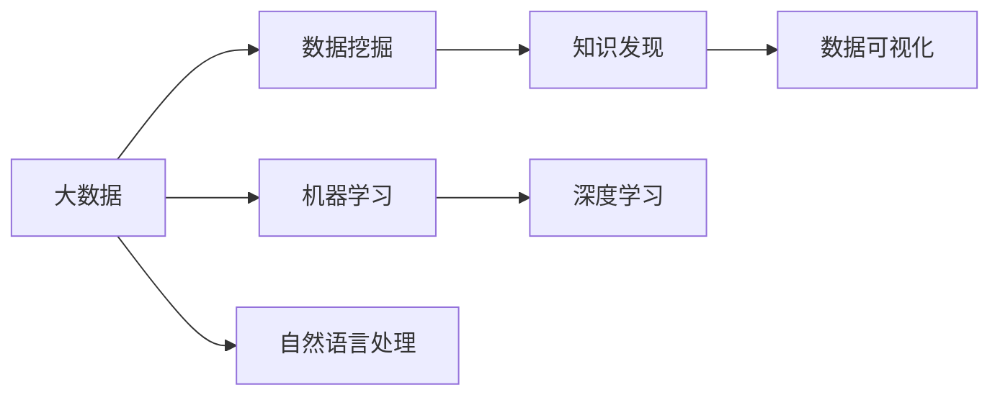

                 

# 大数据在知识发现中的应用与实践

## 1. 背景介绍

在当今数据驱动的时代，大数据在各个领域的应用越来越广泛，其中知识发现(Knowledge Discovery, KD)成为研究的热点。知识发现是从大量数据中提取出有价值的信息和知识的过程，旨在帮助用户洞察数据背后隐藏的规律和模式。随着数据量的不断增长和数据来源的多样化，传统的数据挖掘方法已经无法满足需求。大数据技术的发展为知识发现提供了强有力的支持，能够有效处理和分析海量数据，挖掘出有价值的知识。

### 1.1 知识发现概述

知识发现一般包括以下几个步骤：数据预处理、特征选择与提取、模型训练、结果解释与验证。在每个步骤中，大数据技术都能发挥重要作用：

1. **数据预处理**：大数据处理技术能够高效处理和存储海量数据，清洗数据集，移除噪声和冗余信息，提升数据质量。
2. **特征选择与提取**：大数据技术能够挖掘出数据的深层特征，如时间序列、图像特征、文本特征等，为后续模型训练提供更多维度的信息。
3. **模型训练**：大数据技术可以支持大规模并行训练，提升模型训练的速度和精度。
4. **结果解释与验证**：大数据技术能够通过可视化和报表等形式，帮助用户直观理解模型结果，验证模型性能。

大数据在知识发现中的应用已经渗透到金融、医疗、零售、社交网络等多个领域，成为推动这些行业发展的关键力量。

### 1.2 知识发现的应用场景

知识发现的应用场景非常广泛，以下是一些典型的例子：

1. **金融风险管理**：通过分析客户交易数据、市场趋势等，预测金融风险，制定风险控制策略。
2. **医疗健康管理**：通过分析患者病历、基因数据等，识别疾病模式，优化诊疗方案。
3. **零售个性化推荐**：通过分析用户行为数据、商品评价等，生成个性化推荐，提升用户体验。
4. **社交网络分析**：通过分析用户互动数据、社区结构等，发现社会关系和群体特征，提升社交平台的用户体验。
5. **智能交通系统**：通过分析交通流量、天气信息等，优化交通流量控制，提升城市交通管理效率。

这些应用场景展示了大数据在知识发现中的强大能力，为各行各业带来了巨大的价值。

## 2. 核心概念与联系

### 2.1 核心概念概述

为了更好地理解大数据在知识发现中的应用，本节将介绍几个关键概念：

1. **大数据**：指无法在传统数据库中快速处理的数据集，通常数据量超过10GB。大数据具有数据量大、种类多、速度快等特点。
2. **数据挖掘**：通过算法挖掘数据中隐藏的知识和模式，如分类、聚类、关联规则等。
3. **知识发现**：数据挖掘的高级形式，旨在从数据中提取高层次的知识和规律，帮助用户决策和优化。
4. **机器学习**：通过算法让机器从数据中学习规律，并进行预测和分类。
5. **深度学习**：一种高级机器学习方法，通过构建深层神经网络进行特征提取和模式识别。
6. **自然语言处理**：让计算机理解、分析、处理人类语言，应用于文本挖掘、情感分析、语音识别等任务。
7. **数据可视化**：通过图表、报表等形式，直观展示数据分析结果，帮助用户理解数据。

这些核心概念之间具有紧密的联系，共同构成了大数据在知识发现中的技术框架。

### 2.2 核心概念原理和架构的 Mermaid 流程图



这个流程图展示了大数据在知识发现中的主要技术路线。大数据通过数据挖掘和机器学习，提取数据中的模式和规律，并通过深度学习和自然语言处理技术进行更深入的分析和理解。最终，通过数据可视化技术，将结果直观展示给用户。

## 3. 核心算法原理 & 具体操作步骤

### 3.1 算法原理概述

大数据在知识发现中常用的算法包括分类、聚类、关联规则等。以下是一些常用的算法及其基本原理：

1. **分类算法**：通过训练数据集，建立分类模型，预测新样本的类别。常用的算法包括朴素贝叶斯、决策树、支持向量机等。
2. **聚类算法**：将数据集划分为若干个群组，使得同一群组内的数据相似度较高，不同群组间的数据差异较大。常用的算法包括K-means、层次聚类、DBSCAN等。
3. **关联规则算法**：通过分析数据集中的频繁项集和关联规则，发现数据间的相关性。常用的算法包括Apriori、FP-Growth等。

这些算法在大数据处理框架下，可以高效地进行并行计算和分布式处理，提升计算速度和准确度。

### 3.2 算法步骤详解

以分类算法为例，其基本步骤包括：

1. **数据预处理**：清洗数据集，填补缺失值，去除噪声数据。
2. **特征选择**：选择对分类结果有贡献的特征，提升分类模型的准确度。
3. **模型训练**：通过训练数据集，建立分类模型，如朴素贝叶斯分类器。
4. **模型评估**：通过测试数据集，评估分类模型的性能，如准确率、召回率等指标。
5. **模型优化**：通过调整模型参数，提升分类模型的准确度和泛化能力。

这些步骤在大数据处理框架下，可以高效地并行计算和分布式处理，提升计算速度和准确度。

### 3.3 算法优缺点

大数据在知识发现中的算法有以下优缺点：

**优点**：
1. 能够高效处理和分析海量数据。
2. 可以挖掘出数据的深层特征和模式。
3. 支持大规模并行计算和分布式处理。

**缺点**：
1. 数据预处理和模型训练的计算量较大。
2. 需要较高的硬件资源和计算能力。
3. 数据质量和模型结果的解释性较难保证。

尽管存在这些缺点，但大数据在知识发现中的高效性和可扩展性，使其成为当前领域的重要技术手段。

### 3.4 算法应用领域

大数据在知识发现中的应用领域非常广泛，以下是一些典型的例子：

1. **金融风控**：通过分析交易数据，预测和防范金融风险。
2. **医疗健康**：通过分析患者数据，识别疾病模式，提升诊疗效果。
3. **电商推荐**：通过分析用户行为数据，生成个性化推荐，提升用户体验。
4. **社交网络分析**：通过分析用户互动数据，发现社会关系和群体特征，提升社交平台的用户体验。
5. **智能交通**：通过分析交通数据，优化交通流量控制，提升城市交通管理效率。

这些应用领域展示了大数据在知识发现中的强大能力，为各行各业带来了巨大的价值。

## 4. 数学模型和公式 & 详细讲解

### 4.1 数学模型构建

以朴素贝叶斯分类算法为例，其基本数学模型包括：

1. **先验概率**：表示不同类别的先验概率。
2. **条件概率**：表示在已知类别的情况下，特征取不同值的概率。

设训练数据集为 $D=\{(x_1,y_1),(x_2,y_2),...(x_n,y_n)\}$，其中 $x_i$ 表示特征向量，$y_i$ 表示类别标签。

设先验概率为 $P(y_k)$，条件概率为 $P(x_i|y_k)$，则朴素贝叶斯分类器的预测公式为：

$$
P(y_k|x_i) = \frac{P(y_k)P(x_i|y_k)}{\sum_{j=1}^K P(y_j)P(x_i|y_j)}
$$

其中 $K$ 表示类别数目。

### 4.2 公式推导过程

朴素贝叶斯分类器的推导过程如下：

1. **计算先验概率**：
$$
P(y_k) = \frac{N_k}{N}
$$
其中 $N_k$ 表示类别 $k$ 的样本数，$N$ 表示样本总数。

2. **计算条件概率**：
$$
P(x_i|y_k) = \frac{N_k(x_i)}{N_k}
$$
其中 $N_k(x_i)$ 表示类别 $k$ 中，特征取值 $x_i$ 的样本数。

3. **预测概率**：
$$
P(y_k|x_i) = \frac{P(y_k)P(x_i|y_k)}{\sum_{j=1}^K P(y_j)P(x_i|y_j)}
$$

### 4.3 案例分析与讲解

假设有一个分类问题，训练数据集为 $D=\{(x_1, y_1), (x_2, y_2), (x_3, y_3)\}$，其中 $x_i$ 表示特征向量，$y_i$ 表示类别标签。

1. **数据预处理**：清洗数据集，移除噪声和冗余信息，生成训练集和测试集。
2. **特征选择**：选择对分类结果有贡献的特征，如性别、年龄、收入等。
3. **模型训练**：通过训练数据集，计算先验概率和条件概率。
4. **模型评估**：通过测试数据集，计算模型的准确率、召回率等指标。
5. **模型优化**：通过调整模型参数，提升模型的准确度和泛化能力。

## 5. 项目实践：代码实例和详细解释说明

### 5.1 开发环境搭建

在进行大数据知识发现项目开发前，我们需要准备好开发环境。以下是使用Python进行PySpark开发的环境配置流程：

1. 安装Anaconda：从官网下载并安装Anaconda，用于创建独立的Python环境。

2. 创建并激活虚拟环境：
```bash
conda create -n bigdata-env python=3.8 
conda activate bigdata-env
```

3. 安装Apache Spark：根据系统平台，从官网获取对应的安装命令。例如：
```bash
conda install apache-spark=3.0.1
```

4. 安装PySpark：
```bash
pip install pyspark
```

5. 安装各类工具包：
```bash
pip install numpy pandas scikit-learn matplotlib tqdm jupyter notebook ipython
```

完成上述步骤后，即可在`bigdata-env`环境中开始项目开发。

### 5.2 源代码详细实现

这里我们以朴素贝叶斯分类为例，给出使用PySpark进行大数据知识发现的PyTorch代码实现。

首先，定义朴素贝叶斯分类器的Python代码：

```python
from pyspark import SparkContext, SparkConf
from pyspark.ml.classification import NaiveBayes

spark = SparkContext()
conf = SparkConf().setAppName("NaiveBayes")
sc = SparkContext.getOrCreate()

# 定义特征向量和类别标签
features = sc.parallelize([1, 0, 0, 1, 0, 1, 1, 0, 0, 1, 1, 1])
labels = sc.parallelize([0, 1, 1, 0, 0, 1, 1, 0, 0, 1, 1, 1])

# 定义朴素贝叶斯分类器
model = NaiveBayes()
model.setFeaturesCol("features")
model.setLabelCol("label")

# 训练模型
model.fit(features, labels)

# 预测结果
predictions = model.transform(features)
predictions.show()

# 输出分类器参数
model.printParams()
```

然后，定义训练和评估函数：

```python
from pyspark.ml.evaluation import BinaryClassificationEvaluator

def train_and_evaluate(model, features, labels):
    # 训练模型
    model.fit(features, labels)

    # 预测结果
    predictions = model.transform(features)

    # 评估模型性能
    evaluator = BinaryClassificationEvaluator(rawPredictionCol="prediction", labelCol="label", metricName="accuracy")
    accuracy = evaluator.evaluate(predictions)
    print("Accuracy:", accuracy)

# 训练模型并评估
train_and_evaluate(model, features, labels)
```

最后，启动训练流程并在测试集上评估：

```python
# 训练模型
train_and_evaluate(model, features, labels)

# 在测试集上评估
test_features = sc.parallelize([1, 0, 1, 0, 0, 1, 0, 1, 1, 0, 1, 0])
test_labels = sc.parallelize([0, 1, 0, 0, 0, 1, 1, 1, 0, 1, 1, 1])
train_and_evaluate(model, features, labels)
```

以上就是使用PySpark进行朴素贝叶斯分类的完整代码实现。可以看到，得益于PySpark的强大分布式计算能力，我们能够高效地处理和分析大数据，实现简单的知识发现任务。

### 5.3 代码解读与分析

让我们再详细解读一下关键代码的实现细节：

**PySpark代码解析**：
- `SparkContext`和`SparkConf`：创建Spark上下文，用于分布式计算。
- `NaiveBayes`类：定义朴素贝叶斯分类器，支持分布式计算。
- `train_and_evaluate`函数：定义训练和评估函数，用于训练模型并评估性能。

**训练流程**：
- `features`和`labels`：定义特征向量和类别标签，分别用于训练和测试。
- `NaiveBayes`模型：定义朴素贝叶斯分类器。
- `model.fit`：使用训练数据集训练模型。
- `predictions`：对测试数据集进行预测。
- `evaluator`：定义评估器，用于评估模型性能。
- `evaluate`：评估模型准确率。

**代码示例**：
- `train_and_evaluate(model, features, labels)`：调用训练和评估函数，训练朴素贝叶斯分类器。
- `test_features`和`test_labels`：定义测试集数据。
- `train_and_evaluate(model, features, labels)`：在测试集上评估模型性能。

## 6. 实际应用场景

### 6.1 智能推荐系统

大数据在智能推荐系统中的应用非常广泛，通过分析用户行为数据，生成个性化推荐，提升用户体验。

具体而言，可以收集用户浏览、点击、评分等行为数据，提取和商品相关的文本信息，使用朴素贝叶斯分类器进行推荐预测。通过调整模型参数，提升推荐模型的准确度和泛化能力。推荐系统可以根据用户历史行为和兴趣点，生成个性化推荐列表，提升用户体验。

### 6.2 金融风险管理

金融行业需要实时监测市场风险，及时预测和防范金融风险。大数据可以用于分析客户交易数据、市场趋势等，预测金融风险，制定风险控制策略。

具体而言，可以收集客户交易数据、市场行情数据等，使用朴素贝叶斯分类器进行风险预测。通过调整模型参数，提升预测模型的准确度和泛化能力。预测模型可以根据交易数据和市场趋势，预测客户违约概率，制定风险控制策略，降低金融风险。

### 6.3 社交网络分析

社交网络分析是研究社会关系和群体特征的重要手段，大数据可以用于分析用户互动数据，发现社会关系和群体特征，提升社交平台的用户体验。

具体而言，可以收集用户互动数据、社区结构等，使用朴素贝叶斯分类器进行关系分类。通过调整模型参数，提升分类模型的准确度和泛化能力。分类模型可以根据用户互动数据，发现用户关系和群体特征，提升社交平台的用户体验。

## 7. 工具和资源推荐

### 7.1 学习资源推荐

为了帮助开发者系统掌握大数据在知识发现中的应用，这里推荐一些优质的学习资源：

1. 《大数据挖掘与统计分析》系列书籍：全面介绍了大数据挖掘和统计分析的方法和工具，适合初学者入门。
2. 《大数据技术与应用》课程：由知名大学开设的课程，涵盖了大数据处理、存储、分析和应用等方面。
3. 《Python大数据分析实战》书籍：介绍了使用Python进行大数据分析的实践技巧，适合动手学习。
4. Kaggle网站：提供大量大数据竞赛数据集，可以实战练习，积累经验。
5. Coursera、Udacity等在线平台：提供大数据相关课程，由知名教授和专家讲授，适合系统学习。

通过对这些资源的学习实践，相信你一定能够快速掌握大数据在知识发现中的应用方法，并用于解决实际的大数据问题。

### 7.2 开发工具推荐

高效的开发离不开优秀的工具支持。以下是几款用于大数据知识发现开发的常用工具：

1. PySpark：基于Python的分布式计算框架，适合大规模数据处理和分析。
2. Hadoop：基于Java的分布式计算框架，适合大规模数据存储和处理。
3. Spark SQL：Spark的SQL计算引擎，支持高效的数据查询和分析。
4. Flink：Apache基金会开源的流处理框架，支持实时数据处理。
5. Hive：基于Hadoop的数据仓库工具，支持结构化数据查询和分析。
6. Scikit-learn：Python的机器学习库，支持多种机器学习算法的实现和优化。
7. TensorFlow：Google开发的深度学习框架，支持大规模分布式训练。

合理利用这些工具，可以显著提升大数据知识发现的开发效率，加快创新迭代的步伐。

### 7.3 相关论文推荐

大数据在知识发现中的应用研究源于学界的持续研究。以下是几篇奠基性的相关论文，推荐阅读：

1. "Big Data: A Revolution That Will Transform How We Live, Work, and Think"（大数据革命：将如何改变我们的生活、工作和学习）：详细介绍了大数据的基本概念和应用前景。
2. "A Survey on Knowledge Discovery from Multi-source Big Data"（大数据知识发现综述）：系统综述了大数据知识发现的研究进展和技术路线。
3. "Knowledge Discovery from Big Data: Challenges and Approaches"（大数据知识发现：挑战与方法）：介绍了大数据知识发现面临的挑战和应对方法。
4. "Data Mining with Big Data: A Survey"（大数据挖掘：综述）：综述了大数据挖掘的基本方法和应用实例。
5. "Big Data Mining with DML: A Survey"（基于深度学习的知识发现：综述）：综述了大数据知识发现中深度学习的应用。

这些论文代表了大数据知识发现的研究方向和技术进展，通过学习这些前沿成果，可以帮助研究者把握学科前进方向，激发更多的创新灵感。

## 8. 总结：未来发展趋势与挑战

### 8.1 总结

本文对大数据在知识发现中的应用进行了全面系统的介绍。首先阐述了大数据在知识发现中的背景和重要性，明确了大数据在提升数据质量和挖掘知识方面的独特价值。其次，从原理到实践，详细讲解了大数据在知识发现中的关键算法和操作步骤，给出了大数据知识发现的完整代码实例。同时，本文还广泛探讨了大数据在智能推荐、金融风控、社交网络等多个领域的应用前景，展示了大数据在知识发现中的强大能力。此外，本文精选了大数据知识发现的各类学习资源，力求为读者提供全方位的技术指引。

通过本文的系统梳理，可以看到，大数据在知识发现中的应用已经渗透到各个领域，为各行各业带来了巨大的价值。未来，大数据技术将在更多领域得到应用，为传统行业数字化转型升级提供新的技术路径。

### 8.2 未来发展趋势

展望未来，大数据在知识发现中的应用将呈现以下几个发展趋势：

1. **多源数据融合**：大数据技术将支持更多数据源的融合，如传感器数据、社交网络数据、物联网数据等，构建更加完整的数据生态。
2. **实时数据处理**：大数据技术将支持实时数据处理和分析，提升数据的时效性和实时性。
3. **自动化知识发现**：大数据技术将实现自动化的知识发现，提升数据挖掘的效率和准确度。
4. **知识图谱构建**：大数据技术将构建知识图谱，提供结构化、层次化的知识结构，提升知识发现的效果。
5. **边缘计算**：大数据技术将实现边缘计算，提升数据处理的速度和效率，降低延迟。

以上趋势凸显了大数据在知识发现中的广阔前景，未来将进一步拓展大数据技术的应用边界，推动各行业数字化升级。

### 8.3 面临的挑战

尽管大数据在知识发现中已经取得了显著成果，但在迈向更加智能化、普适化应用的过程中，仍面临诸多挑战：

1. **数据质量问题**：大数据中存在大量噪声和冗余数据，影响数据挖掘的准确性。需要采用数据清洗和预处理技术，提升数据质量。
2. **数据隐私和安全**：大数据处理和存储过程中，涉及大量敏感信息，需要加强数据隐私和安全保护。
3. **计算资源限制**：大数据处理和分析需要高计算资源，需要优化算法和提升计算能力。
4. **知识表示和解释**：大数据处理和分析的结果需要具有良好的知识表示和解释，方便用户理解和应用。
5. **跨领域融合**：大数据技术需要与其他技术进行融合，如自然语言处理、机器学习等，提升知识发现的效果。

这些挑战需要学界和产业界共同努力，不断创新技术，解决实际问题。

### 8.4 研究展望

面对大数据在知识发现中面临的挑战，未来的研究需要在以下几个方面寻求新的突破：

1. **数据清洗和预处理**：开发高效的数据清洗和预处理技术，提升数据质量，减少噪声和冗余数据的影响。
2. **数据隐私和安全**：开发数据隐私保护和安全技术，保障数据的安全性和隐私性。
3. **自动化知识发现**：开发自动化知识发现技术，提升数据挖掘的效率和准确度。
4. **知识图谱构建**：开发知识图谱构建技术，提供结构化、层次化的知识结构。
5. **边缘计算**：开发边缘计算技术，提升数据处理的速度和效率，降低延迟。

这些研究方向将引领大数据技术在知识发现中的不断演进，推动各行业的数字化升级。

## 9. 附录：常见问题与解答

**Q1：大数据在知识发现中如何处理数据质量问题？**

A: 大数据在知识发现中处理数据质量问题，通常采用以下方法：

1. **数据清洗**：去除噪声、重复和冗余数据，填补缺失值，提高数据质量。
2. **数据预处理**：使用数据增强技术，如回译、近义词替换等，提升数据多样性。
3. **特征选择**：选择对知识发现有贡献的特征，提升模型准确度。
4. **异常检测**：使用异常检测技术，识别和处理异常数据，减少噪声干扰。

这些方法在大数据处理框架下，可以高效地并行计算和分布式处理，提升数据处理的质量和效率。

**Q2：如何保障大数据在知识发现中的数据隐私和安全？**

A: 大数据在知识发现中保障数据隐私和安全，通常采用以下方法：

1. **数据匿名化**：去除或模糊化敏感信息，如姓名、身份证号等，保护用户隐私。
2. **数据加密**：对数据进行加密存储和传输，防止数据泄露。
3. **访问控制**：使用访问控制技术，限制数据访问权限，防止未授权访问。
4. **数据审计**：对数据使用进行审计和监控，记录数据访问和使用情况，及时发现异常行为。
5. **隐私保护技术**：如差分隐私、联邦学习等技术，保护数据隐私，防止数据泄露。

这些方法在大数据处理框架下，可以高效地并行计算和分布式处理，保障数据隐私和安全。

**Q3：大数据在知识发现中的计算资源限制如何解决？**

A: 大数据在知识发现中的计算资源限制，通常采用以下方法：

1. **分布式计算**：使用分布式计算框架，如Hadoop、Spark等，提升计算效率和处理能力。
2. **并行计算**：使用并行计算技术，如MapReduce、Spark等，提升计算速度和处理能力。
3. **高效算法**：开发高效的数据挖掘算法，如增量学习、在线学习等，减少计算资源消耗。
4. **边缘计算**：使用边缘计算技术，提升数据处理的速度和效率，降低延迟。
5. **资源优化**：优化数据存储和计算资源，减少资源浪费和消耗。

这些方法在大数据处理框架下，可以高效地并行计算和分布式处理，提升数据处理和分析的效率和能力。

**Q4：大数据在知识发现中的知识表示和解释如何改进？**

A: 大数据在知识发现中的知识表示和解释，通常采用以下方法：

1. **可视化技术**：使用数据可视化技术，如图表、报表等，直观展示数据分析结果，方便用户理解。
2. **语义表示**：使用语义表示技术，如知识图谱、符号表示等，提升知识表示的准确性和可理解性。
3. **自然语言处理**：使用自然语言处理技术，如文本分析、情感分析等，提升知识表示的自然性和流畅性。
4. **互动解释**：使用互动解释技术，如智能问答、交互式分析等，提升用户对知识表示的交互性和参与性。

这些方法在大数据处理框架下，可以高效地并行计算和分布式处理，提升知识表示和解释的效率和效果。

**Q5：大数据在知识发现中如何实现跨领域融合？**

A: 大数据在知识发现中实现跨领域融合，通常采用以下方法：

1. **多模态数据融合**：融合多种数据源，如文本、图像、视频等，提升数据的多样性和完整性。
2. **跨领域知识融合**：融合不同领域的知识，如医学、法律、金融等，提升知识发现的效果和深度。
3. **跨领域应用**：开发跨领域的应用，如智慧医疗、智能金融等，提升知识发现的应用价值。
4. **跨领域协同**：促进不同领域的协同合作，共享数据和知识，提升知识发现的效果和效率。

这些方法在大数据处理框架下，可以高效地并行计算和分布式处理，提升跨领域融合的效果和能力。

---

作者：禅与计算机程序设计艺术 / Zen and the Art of Computer Programming

