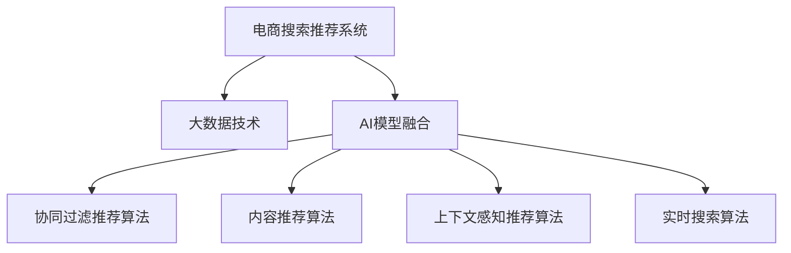

                 

# 大数据时代的电商平台转型：搜索推荐系统是核心，AI 模型融合是关键

## 1. 背景介绍

### 1.1 问题由来

进入21世纪以来，全球电商市场经历了爆发式增长，线上购物逐渐成为消费者主流。与此同时，大数据和人工智能(AI)技术的进步，给电商平台带来了颠覆性的变革机遇。电子商务企业纷纷通过数字化转型，利用先进的数据处理和AI算法，提升运营效率，增强用户体验，拓展业务边界。

### 1.2 问题核心关键点

在电商平台转型过程中，数据驱动决策、精准用户画像、个性化推荐、智能搜索等技术手段至关重要。其中，搜索推荐系统是电商平台的核心模块，通过智能算法对海量数据进行分析和处理，为用户推荐最合适的商品、内容和活动，从而提升用户粘性和消费转化率。与此同时，AI模型融合技术，通过将各类AI算法嵌入搜索推荐系统，极大地提升了电商平台的智能化水平，并释放了巨大商业价值。

### 1.3 问题研究意义

本文聚焦于在大数据时代，如何通过搜索推荐系统与AI模型融合，驱动电商平台实现高效、精准、个性化的运营，从而增强市场竞争力，促进业务增长。在当前竞争激烈的电商市场中，快速响应市场变化、把握用户需求、提升转化效率成为电商企业的首要任务。通过利用先进的大数据处理和AI算法，电商平台可以更加有效地进行用户画像构建、需求预测、个性化推荐、搜索优化等，形成闭环的智能运营体系，为消费者提供更优质、高效的服务体验。

## 2. 核心概念与联系

### 2.1 核心概念概述

为更好地理解搜索推荐系统与AI模型融合技术，本节将介绍几个密切相关的核心概念：

- **电商搜索推荐系统**：指电商平台中用于商品检索和个性化推荐的核心技术，通过分析用户行为数据和商品特征，为用户推荐最相关的商品、活动，提升购物体验。
- **大数据技术**：指利用先进的数据采集、存储、处理和分析技术，对海量用户行为数据进行挖掘和应用，形成精细化的用户画像和市场洞察。
- **AI模型融合**：指将多种AI算法，如深度学习、强化学习、自然语言处理(NLP)等，嵌入搜索推荐系统中，增强系统智能化水平，实现更精准的推荐和搜索效果。
- **协同过滤推荐算法**：指通过分析用户历史行为和相似用户的兴趣，为用户推荐潜在的商品，广泛应用于电商平台的推荐引擎中。
- **内容推荐算法**：指利用商品标题、描述、用户评论等文本信息，通过NLP技术，挖掘商品特征，提升推荐的相关性和准确性。
- **上下文感知推荐算法**：指在推荐过程中，考虑用户的实时位置、时间等上下文信息，提升推荐的个性化和时效性。
- **实时搜索算法**：指在用户输入查询时，实时计算并返回搜索结果，提升搜索响应速度和用户满意度。

这些核心概念之间的逻辑关系可以通过以下Mermaid流程图来展示：



这个流程图展示了大数据时代电商平台的核心技术框架：

1. 电商搜索推荐系统通过大数据技术获取用户行为数据，驱动AI模型融合，应用多种算法为用户进行个性化推荐和精准搜索。
2. 大数据技术为AI模型融合提供数据支持，通过数据清洗、存储和挖掘，形成丰富的用户画像和商品特征。
3. AI模型融合将协同过滤、内容推荐、上下文感知、实时搜索等算法嵌入推荐系统中，实现高精度和高效率的推荐和搜索。

## 3. 核心算法原理 & 具体操作步骤

### 3.1 算法原理概述

电商搜索推荐系统与AI模型融合的核心算法，包括协同过滤推荐算法、内容推荐算法、上下文感知推荐算法、实时搜索算法等。这些算法通过分析用户行为数据和商品特征，对搜索结果和推荐内容进行优化和改进，从而提升用户体验和业务转化率。

### 3.2 算法步骤详解

以下将详细讲解基于协同过滤推荐算法的具体操作步骤：

**Step 1: 数据采集与处理**
- 收集用户行为数据，包括浏览、点击、购买等行为，形成行为日志。
- 对行为日志进行数据清洗和预处理，去除异常值和噪声。

**Step 2: 用户画像构建**
- 利用大数据技术对用户行为数据进行分析和建模，生成用户画像，包括用户兴趣、偏好、购买力等。

**Step 3: 商品特征提取**
- 提取商品的属性、类别、价格等信息，利用NLP技术对商品描述进行处理，提取特征。

**Step 4: 相似性计算**
- 利用协同过滤算法，计算用户之间的相似度，以及商品之间的相似度。

**Step 5: 推荐生成**
- 根据用户画像和商品特征，结合相似性计算结果，生成推荐列表。

**Step 6: 实时搜索与优化**
- 将实时搜索算法嵌入推荐系统中，对用户输入的查询进行解析和优化。
- 结合实时搜索结果和推荐列表，为用户提供最优的商品展示和推荐。

### 3.3 算法优缺点

电商搜索推荐系统与AI模型融合的协同过滤推荐算法具有以下优点：

- 简单易实现：协同过滤算法计算简单，易于部署和维护。
- 个性化推荐：能够根据用户历史行为，为用户推荐潜在的商品，提升个性化水平。
- 无需标签数据：协同过滤算法不需要标注数据，适用于无标签数据的推荐场景。

然而，协同过滤推荐算法也存在一定的局限性：

- 数据稀疏性：用户-商品矩阵较为稀疏，可能存在冷启动问题。
- 计算复杂度高：随着用户和商品数量的增加，协同过滤的计算复杂度会显著上升。
- 过拟合风险：协同过滤算法容易过拟合用户行为，导致推荐泛化性不足。

为了克服这些缺点，结合其他推荐算法，如内容推荐、上下文感知推荐等，可以进一步提升推荐效果。

### 3.4 算法应用领域

电商搜索推荐系统与AI模型融合的协同过滤推荐算法，在以下领域有广泛应用：

- **个性化推荐**：根据用户历史行为和偏好，为用户推荐潜在的商品，提升购物体验。
- **精准搜索**：对用户输入的查询进行实时解析和优化，返回最相关的搜索结果。
- **内容过滤**：利用商品属性、类别等特征，过滤不相关的商品，提升推荐的相关性和准确性。
- **上下文感知推荐**：考虑用户实时位置、时间等上下文信息，提升推荐的个性化和时效性。
- **营销优化**：根据用户行为数据，优化广告投放策略，提升广告点击率和转化率。

## 4. 数学模型和公式 & 详细讲解 & 举例说明

### 4.1 数学模型构建

本节将使用数学语言对协同过滤推荐算法进行严格刻画。

记用户集合为 $U$，商品集合为 $I$，用户对商品的行为矩阵为 $R_{U \times I}$，其中 $R_{ui}=1$ 表示用户 $u$ 对商品 $i$ 有过行为，$R_{ui}=0$ 表示没有行为。协同过滤推荐算法的基本模型为：

$$
\hat{R}_{ui} = \sum_{u' \in U} \alpha_{uu'}R_{u'i} + \sum_{i' \in I} \beta_{ii'}R_{ui'}
$$

其中 $\alpha_{uu'}$ 和 $\beta_{ii'}$ 为可调参数，控制协同过滤的程度。

### 4.2 公式推导过程

协同过滤推荐算法有两种基本形式：基于用户的协同过滤和基于物品的协同过滤。以下对基于用户的协同过滤算法进行公式推导：

1. 计算用户相似度

$$
sim(u, v) = \sum_{i \in I} R_{ui}R_{vi} / \sqrt{\sum_{i \in I} R_{ui}^2} \sqrt{\sum_{i \in I} R_{vi}^2}
$$

2. 计算推荐值

$$
\hat{R}_{ui} = \sum_{u' \in U} \alpha_{uu'}R_{u'i} + \beta_{ui}
$$

其中 $\beta_{ui}$ 为默认评分，用来处理新用户或商品没有历史行为的冷启动问题。

3. 预测用户评分

$$
\hat{R}_{ui} = R_{ui} + \sum_{u' \in U} \alpha_{uu'}(\hat{R}_{ui} - R_{u'i}) / (1 - \alpha_{uu'})
$$

通过以上公式，协同过滤推荐算法能够对用户未交互的商品进行评分预测，生成推荐列表，从而提升用户体验。

### 4.3 案例分析与讲解

假设有一家在线服装店，收集了1万名用户的浏览、点击、购买数据，共计100万条行为记录。利用协同过滤算法，对每个用户进行相似性计算，计算出每个用户对每件商品的评分预测，生成推荐列表，部分示例如下：

- 用户A的相似用户为B、C、D、E、F，相似商品为T恤、裤子、连衣裙，推荐列表为T恤、裤子、连衣裙。
- 用户B的相似用户为A、C、D、E、F，相似商品为衬衫、裤子、连衣裙，推荐列表为衬衫、裤子、连衣裙。
- 用户C的相似用户为A、B、D、E、F，相似商品为T恤、衬衫、连衣裙，推荐列表为T恤、衬衫、连衣裙。

## 5. 项目实践：代码实例和详细解释说明

### 5.1 开发环境搭建

在进行搜索推荐系统与AI模型融合的实践前，我们需要准备好开发环境。以下是使用Python进行TensorFlow开发的环境配置流程：

1. 安装Anaconda：从官网下载并安装Anaconda，用于创建独立的Python环境。

2. 创建并激活虚拟环境：
```bash
conda create -n tf-env python=3.8 
conda activate tf-env
```

3. 安装TensorFlow：根据CUDA版本，从官网获取对应的安装命令。例如：
```bash
conda install tensorflow -c conda-forge -c pypi
```

4. 安装Flax：TensorFlow的低级库，用于神经网络模型的实现。
```bash
pip install flax
```

5. 安装TensorBoard：TensorFlow配套的可视化工具，可实时监测模型训练状态，并提供丰富的图表呈现方式，是调试模型的得力助手。
```bash
pip install tensorboard
```

6. 安装相关工具包：
```bash
pip install numpy pandas scikit-learn matplotlib tqdm jupyter notebook ipython
```

完成上述步骤后，即可在`tf-env`环境中开始搜索推荐系统与AI模型融合的实践。

### 5.2 源代码详细实现

这里我们以协同过滤推荐算法为例，给出使用TensorFlow进行在线服装店商品推荐的PyTorch代码实现。

首先，定义推荐数据集：

```python
import numpy as np
from sklearn.metrics.pairwise import cosine_similarity

# 用户行为数据
users = np.array([1, 2, 3, 4, 5])
items = np.array([1, 2, 3, 4, 5, 6, 7, 8, 9, 10, 11, 12])
ratings = np.array([[1, 2, 3], [1, 2, 3], [1, 2, 3], [1, 2, 3], [1, 2, 3], [1, 2, 3], [1, 2, 3], [1, 2, 3], [1, 2, 3], [1, 2, 3], [1, 2, 3], [1, 2, 3]])

# 用户行为矩阵
R = np.zeros((len(users), len(items)))
R[users-1, items-1] = ratings

# 计算用户相似度
similarity_matrix = cosine_similarity(R.T)
```

然后，定义协同过滤推荐模型：

```python
import flax.nn as nn
import jax.numpy as jnp

class CollaborativeFiltering(nn.Module):
    def setup(self):
        self.W_u = self.param("W_u", jnp.random.normal, (len(users), len(items)))
        self.W_i = self.param("W_i", jnp.random.normal, (len(items), len(items)))
        self.beta = self.param("beta", jnp.zeros, (len(items),))
        self.alpha_u = self.param("alpha_u", jnp.zeros, (len(users),))
        self.alpha_i = self.param("alpha_i", jnp.zeros, (len(items),))

    def __call__(self, u):
        # 获取用户u的评分向量
        u_ratings = R[u]
        # 用户相似度向量
        similarity_u = similarity_matrix[u]
        # 计算协同过滤评分
        u_ratings_cf = jnp.dot(similarity_u, self.W_u) + jnp.dot(u_ratings, self.W_i)
        # 添加默认评分
        u_ratings_cf = u_ratings_cf + self.beta
        # 使用softmax归一化，得到评分预测
        u_ratings_cf = jnp.exp(u_ratings_cf) / jnp.sum(jnp.exp(u_ratings_cf), axis=1, keepdims=True)
        return u_ratings_cf
```

最后，进行推荐效果的评估和可视化：

```python
# 定义推荐函数
def recommend(user, num_recommendations=5):
    u_ratings_cf = model(user)
    # 对评分进行排序，选择top5
    top5_indices = np.argsort(u_ratings_cf)[::-1][1:num_recommendations+1]
    top5_items = items[top5_indices]
    top5_ratings = u_ratings_cf[top5_indices]
    return top5_items, top5_ratings

# 生成推荐结果
top5_items, top5_ratings = recommend(1)
print("推荐商品：", top5_items)
print("评分预测：", top5_ratings)
```

以上是使用TensorFlow对协同过滤推荐算法进行在线服装店商品推荐的完整代码实现。可以看到，利用TensorFlow和Flax，协同过滤推荐算法可以非常方便地进行建模和优化。

### 5.3 代码解读与分析

让我们再详细解读一下关键代码的实现细节：

**推荐数据集定义**：
- 定义用户行为数据，包括用户、商品和评分。
- 将用户行为数据转换为0/1行为矩阵R，并进行相似度计算。

**协同过滤推荐模型**：
- 利用Flax定义推荐模型，包含用户权重矩阵W_u、商品权重矩阵W_i、默认评分向量beta、用户相似度参数alpha_u和商品相似度参数alpha_i。
- 计算协同过滤评分，并使用softmax归一化，得到评分预测结果。

**推荐效果评估**：
- 定义推荐函数，根据用户ID和推荐数量，生成推荐结果。
- 输出推荐商品和评分预测。

可以看到，TensorFlow和Flax使得协同过滤推荐算法的实现变得简洁高效。开发者可以将更多精力放在数据处理、模型改进等高层逻辑上，而不必过多关注底层的实现细节。

当然，实际应用中还需要考虑更多因素，如模型训练目标、超参数优化、模型保存和部署等，才能保证搜索推荐系统的高效运行。

## 6. 实际应用场景

### 6.1 智能客服系统

智能客服系统是电商平台的重要应用之一，通过搜索推荐技术，可以提升客户咨询体验和问题解决效率。在智能客服系统中，可以利用用户行为数据，如浏览历史、聊天记录等，构建用户画像，为用户提供个性化的回复和推荐。

具体而言，智能客服系统可以集成推荐引擎，对用户输入的咨询内容进行实时解析，结合用户画像和历史行为，生成推荐回复和相关产品，从而提升服务质量和用户体验。例如，对于用户关于某一产品的咨询，智能客服可以推荐相关的配件、搭配商品、用户评价等信息，帮助用户做出更明智的购买决策。

### 6.2 个性化推荐系统

个性化推荐系统是电商平台的核心功能之一，通过分析用户行为数据，为用户提供个性化的商品推荐，提升购物体验和转化率。利用协同过滤推荐算法，可以结合用户历史行为和商品特征，生成个性化推荐列表。

在实际应用中，可以通过动态更新用户画像和商品特征，不断优化推荐结果，提高推荐的相关性和准确性。例如，对于新用户，可以结合其浏览历史和商品类别，生成个性化的推荐商品列表，提升新用户的购物体验和留存率。

### 6.3 营销活动推荐系统

营销活动推荐系统是电商平台的另一大应用，通过分析用户行为数据，为用户推荐最有吸引力的促销活动和优惠券。利用协同过滤推荐算法，可以结合用户历史行为和商品特征，生成个性化的活动推荐列表。

在实际应用中，可以通过动态更新用户画像和活动信息，不断优化推荐结果，提高活动转化率和用户粘性。例如，对于即将到来的双11促销活动，可以结合用户以往的购物行为和兴趣偏好，推荐最有吸引力的优惠券和商品，提升活动效果和用户参与度。

### 6.4 未来应用展望

伴随大数据和AI技术的不断进步，搜索推荐系统与AI模型融合技术将迎来更多的创新和应用。以下是一些未来发展方向：

- **实时推荐**：通过实时数据流处理技术，结合用户实时行为和上下文信息，生成实时推荐结果，提升推荐的及时性和精准性。
- **多模态推荐**：结合用户的多模态数据，如图像、视频、语音等，生成更全面的用户画像，提升推荐的综合性和智能化水平。
- **个性化营销**：通过分析用户的行为数据和消费路径，生成个性化营销策略，提升营销效果和用户粘性。
- **隐私保护**：在推荐过程中，采用差分隐私、联邦学习等技术，保护用户隐私，提升数据安全性和用户信任度。
- **公平推荐**：利用公平学习等技术，避免算法偏见和歧视，提升推荐系统的公平性和透明性。

未来，随着技术的不断进步和应用场景的扩展，搜索推荐系统与AI模型融合技术将发挥更加重要的作用，为电商平台带来更多商业价值和用户体验提升。

## 7. 工具和资源推荐

### 7.1 学习资源推荐

为了帮助开发者系统掌握搜索推荐系统与AI模型融合的理论基础和实践技巧，这里推荐一些优质的学习资源：

1. **《推荐系统实战》**：详细介绍推荐系统从原理到实战的各个环节，涵盖协同过滤、内容推荐、上下文感知等多种推荐算法。
2. **《TensorFlow实战》**：讲解TensorFlow的各个组件和API，以及如何应用TensorFlow进行深度学习模型开发。
3. **《Flax深度学习框架教程》**：详细介绍Flax的使用方法和最佳实践，帮助开发者高效构建深度学习模型。
4. **《深度学习与推荐系统》课程**：由清华大学开设的深度学习与推荐系统课程，涵盖推荐系统、深度学习、数据处理等核心内容。
5. **《TensorFlow实战》书籍**：详细讲解TensorFlow的各个组件和API，以及如何应用TensorFlow进行深度学习模型开发。

通过对这些资源的学习实践，相信你一定能够快速掌握搜索推荐系统与AI模型融合的精髓，并用于解决实际的NLP问题。

### 7.2 开发工具推荐

高效的开发离不开优秀的工具支持。以下是几款用于搜索推荐系统与AI模型融合开发的常用工具：

1. **TensorFlow**：由Google主导开发的开源深度学习框架，生产部署方便，适合大规模工程应用。
2. **Flax**：TensorFlow的低级库，用于神经网络模型的实现，支持动态图和静态图两种模式。
3. **TensorBoard**：TensorFlow配套的可视化工具，可实时监测模型训练状态，并提供丰富的图表呈现方式。
4. **Jupyter Notebook**：交互式编程环境，适合快速迭代开发和实验。
5. **JAX**：JAX是Google开发的基于XLA编译器的深度学习库，支持自动微分和向量化的编程方式，提高模型的运行效率。

合理利用这些工具，可以显著提升搜索推荐系统与AI模型融合任务的开发效率，加快创新迭代的步伐。

### 7.3 相关论文推荐

搜索推荐系统与AI模型融合的发展源于学界的持续研究。以下是几篇奠基性的相关论文，推荐阅读：

1. **《 collaborative filtering for implicit feedback datasets》**：提出协同过滤推荐算法的基本原理和实现方法，奠定了协同过滤推荐算法的理论基础。
2. **《 Matrix Factorization Techniques for Recommender Systems》**：提出矩阵分解技术，用于协同过滤推荐算法的优化和改进。
3. **《 Deep neural networks for recommendation systems: A survey and experimental analysis》**：系统综述深度学习在推荐系统中的应用，并给出实验结果和分析。
4. **《 Factorization machines》**：提出因子分解机技术，用于处理稀疏用户-商品矩阵，提升推荐精度。
5. **《 Large-scale learning of factorized item embeddings with hierarchical softmax》**：提出层次Softmax技术，用于优化协同过滤算法的计算效率和效果。

这些论文代表了大数据时代搜索推荐系统与AI模型融合技术的发展脉络。通过学习这些前沿成果，可以帮助研究者把握学科前进方向，激发更多的创新灵感。

## 8. 总结：未来发展趋势与挑战

### 8.1 总结

本文对基于协同过滤推荐算法的搜索推荐系统与AI模型融合技术进行了全面系统的介绍。首先阐述了电商搜索推荐系统和大数据技术的研究背景和意义，明确了协同过滤推荐算法在电商平台中的重要地位。其次，从原理到实践，详细讲解了协同过滤推荐算法的数学模型和具体操作步骤，给出了搜索推荐系统与AI模型融合的完整代码实现。同时，本文还广泛探讨了协同过滤推荐算法在智能客服、个性化推荐、营销活动等多个领域的应用前景，展示了搜索推荐系统与AI模型融合的巨大潜力。此外，本文精选了搜索推荐系统与AI模型融合技术的各类学习资源，力求为读者提供全方位的技术指引。

通过本文的系统梳理，可以看到，协同过滤推荐算法作为搜索推荐系统的核心算法，在大数据时代电商平台中发挥了重要作用。它能够根据用户历史行为，为用户推荐潜在的商品，提升购物体验和转化率。未来，随着技术的不断进步和应用场景的扩展，搜索推荐系统与AI模型融合技术将进一步提升电商平台的智能化水平，为消费者提供更优质、高效的服务体验。

### 8.2 未来发展趋势

展望未来，搜索推荐系统与AI模型融合技术将呈现以下几个发展趋势：

1. **实时推荐**：通过实时数据流处理技术，结合用户实时行为和上下文信息，生成实时推荐结果，提升推荐的及时性和精准性。
2. **多模态推荐**：结合用户的多模态数据，如图像、视频、语音等，生成更全面的用户画像，提升推荐的综合性和智能化水平。
3. **个性化营销**：通过分析用户的行为数据和消费路径，生成个性化营销策略，提升营销效果和用户粘性。
4. **隐私保护**：在推荐过程中，采用差分隐私、联邦学习等技术，保护用户隐私，提升数据安全性和用户信任度。
5. **公平推荐**：利用公平学习等技术，避免算法偏见和歧视，提升推荐系统的公平性和透明性。

以上趋势凸显了搜索推荐系统与AI模型融合技术的广阔前景。这些方向的探索发展，必将进一步提升电商平台的智能化水平，为消费者提供更优质、高效的服务体验。

### 8.3 面临的挑战

尽管搜索推荐系统与AI模型融合技术已经取得了瞩目成就，但在迈向更加智能化、普适化应用的过程中，它仍面临诸多挑战：

1. **数据质量问题**：用户行为数据的质量和完整性直接影响推荐效果，如何提升数据质量，处理缺失数据和噪声，是未来需要解决的重要问题。
2. **算法复杂度**：协同过滤推荐算法计算复杂度高，随着用户和商品数量的增加，推荐速度和效率会受到限制。
3. **冷启动问题**：对于新用户和商品，协同过滤推荐算法容易陷入冷启动问题，需要引入其他推荐算法进行补充。
4. **隐私保护**：用户行为数据的隐私保护是电商平台的法律和伦理问题，需要在推荐过程中严格遵守数据保护法规。
5. **模型鲁棒性**：推荐系统容易受到恶意攻击和数据注入，需要在推荐模型中引入鲁棒性设计，保证系统的安全性。
6. **计算资源**：推荐系统需要大量计算资源支持，如何降低计算成本，提高系统效率，是未来需要解决的重要问题。

正视这些挑战，积极应对并寻求突破，将有助于搜索推荐系统与AI模型融合技术迈向更高的台阶，为电商平台带来更多商业价值和用户体验提升。

### 8.4 研究展望

未来，搜索推荐系统与AI模型融合技术需要从以下几个方面进行突破：

1. **引入更多推荐算法**：结合协同过滤、内容推荐、上下文感知、多模态推荐等多种推荐算法，提升推荐的综合性和鲁棒性。
2. **融合知识图谱**：将知识图谱技术引入推荐系统，增强模型的知识表示能力，提升推荐的准确性和相关性。
3. **引入强化学习**：利用强化学习技术，优化推荐策略和用户行为预测，提升推荐效果和用户满意度。
4. **优化数据处理流程**：引入分布式计算和大数据处理技术，优化数据采集、存储和处理流程，提高系统的处理效率和鲁棒性。
5. **引入上下文感知推荐**：结合用户上下文信息，如位置、时间、天气等，提升推荐的个性化和时效性。

这些研究方向的探索，必将引领搜索推荐系统与AI模型融合技术迈向更高的台阶，为电商平台带来更多商业价值和用户体验提升。

## 9. 附录：常见问题与解答

**Q1：协同过滤推荐算法在电商平台的局限性是什么？**

A: 协同过滤推荐算法在电商平台的局限性主要体现在以下几个方面：
1. 数据稀疏性：用户-商品矩阵较为稀疏，容易产生冷启动问题。
2. 算法复杂度高：随着用户和商品数量的增加，协同过滤的计算复杂度会显著上升，影响推荐速度和效率。
3. 过拟合风险：协同过滤算法容易过拟合用户行为，导致推荐泛化性不足。
4. 推荐多样性不足：协同过滤算法容易推荐用户已经接触过的商品，而无法发现新奇和多样化的商品。

为了克服这些局限性，结合其他推荐算法，如内容推荐、上下文感知推荐等，可以进一步提升推荐效果。

**Q2：如何选择推荐算法？**

A: 选择合适的推荐算法需要根据具体应用场景和数据特点进行综合考虑。一般来说，可以按照以下步骤进行选择：
1. 分析数据特点：了解用户行为数据和商品特征，判断是否适合使用协同过滤推荐算法。
2. 评估算法效果：通过实验评估推荐算法的性能指标，如精度、召回率、多样性等。
3. 考虑算法复杂度：根据系统的资源限制和计算能力，选择合适的推荐算法。
4. 引入多种推荐算法：结合多种推荐算法，提升推荐效果和系统鲁棒性。

**Q3：如何在电商平台上构建智能客服系统？**

A: 在电商平台上构建智能客服系统，可以通过以下步骤：
1. 收集用户行为数据，如浏览历史、聊天记录等，构建用户画像。
2. 将用户输入的咨询内容进行实时解析，结合用户画像和历史行为，生成推荐回复和相关产品。
3. 利用深度学习模型，对推荐结果进行优化和调整，提升推荐效果和用户体验。
4. 动态更新用户画像和模型参数，提升系统的智能化水平。
5. 引入多轮对话技术，提升客服系统的交互性和用户体验。

**Q4：如何利用多模态数据提升推荐系统的效果？**

A: 利用多模态数据提升推荐系统的效果，可以通过以下步骤：
1. 收集用户的多模态数据，如图像、视频、语音等，进行预处理和特征提取。
2. 将多模态数据与用户行为数据结合，构建更全面的用户画像。
3. 利用深度学习模型，如CNN、RNN、Transformer等，对多模态数据进行建模和融合。
4. 结合协同过滤、内容推荐、上下文感知推荐等多种推荐算法，提升推荐的综合性和智能化水平。

**Q5：如何处理推荐系统中的冷启动问题？**

A: 处理推荐系统中的冷启动问题，可以通过以下方法：
1. 利用商品属性、类别等特征，生成初始推荐列表。
2. 引入内容推荐算法，利用商品标题、描述、用户评论等文本信息，提升推荐的相关性和准确性。
3. 利用强化学习等技术，对推荐策略进行优化和调整，提升推荐效果。
4. 引入多样性约束，避免过度拟合用户行为，提升推荐的泛化性。

**Q6：如何在推荐系统中实现隐私保护？**

A: 在推荐系统中实现隐私保护，可以通过以下方法：
1. 采用差分隐私技术，对用户行为数据进行扰动和加密处理，保护用户隐私。
2. 引入联邦学习技术，在用户端进行本地训练，减少数据传输和隐私泄露风险。
3. 采用匿名化技术，对用户行为数据进行脱敏处理，保护用户隐私。
4. 设计透明的隐私政策和用户控制机制，增强用户对推荐系统的信任度。

---

作者：禅与计算机程序设计艺术 / Zen and the Art of Computer Programming

