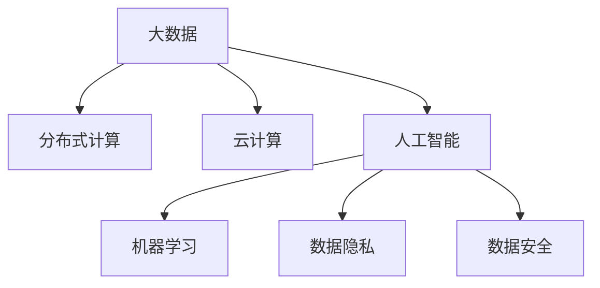

                 

# 大数据时代：人类计算的机遇与挑战并存

## 1. 背景介绍

### 1.1 问题由来
进入21世纪以来，大数据技术在全球范围内迅猛发展，已经深刻改变了人类社会的生产方式和生活方式。无论是经济、医疗、教育、交通等领域，还是科学研究、政府治理等社会活动，都离不开对海量数据的收集、存储、分析和应用。大数据不仅仅是数据的集合，更是挖掘数据的巨大潜力，让数据发挥出前所未有的价值。

在数据驱动的时代，人类计算正面临着前所未有的机遇与挑战。机遇在于，大数据使得人类能够更加深入地理解和把握客观世界的规律，提升决策的科学性和精准性。挑战在于，海量数据的管理和分析变得复杂，数据质量参差不齐，数据隐私和安全问题日益凸显。

面对这些机遇与挑战，如何更好地利用大数据，同时解决数据相关的问题，是当前技术界和学术界共同关注的焦点。本文将从大数据时代的数据处理、计算技术、数据隐私和安全等方面进行深入探讨，剖析人类计算的机遇与挑战并存，为后续章节的深入分析打下基础。

### 1.2 问题核心关键点
大数据时代下，人类计算的机遇与挑战主要体现在以下几个方面：

1. 数据规模和速度：数据的快速增长和实时性要求，对计算资源的巨大需求。
2. 数据质量和多样性：数据质量的保证、数据源的多样性，对数据清洗和处理的复杂性要求。
3. 数据安全与隐私：数据隐私保护、数据安全风险的防范。
4. 计算效率与精度：高效的计算算法和模型，高精度的数据分析和预测。
5. 计算资源与服务：计算资源的分布与共享、计算服务的标准化与扩展。

这些核心关键点构成了大数据时代人类计算的核心议题，深入理解和解决这些问题，将有助于全面发挥大数据的价值，推动社会的全面进步。

## 2. 核心概念与联系

### 2.1 核心概念概述

为更好地理解大数据时代人类计算的机遇与挑战，本节将介绍几个密切相关的核心概念：

- **大数据**：指数据量规模巨大，通常以PetaBytes或ExaBytes计，且数据复杂多样，处理和分析难度大。
- **分布式计算**：指将大规模计算任务分布到多个计算节点上并行处理，以提高计算效率和可靠性。
- **云计算**：指将计算资源通过网络提供给用户使用，支持弹性计算、资源共享和快速扩展。
- **人工智能**：指利用算法和模型，对大量数据进行分析和处理，从而模拟人类智能行为，进行预测、决策等任务。
- **机器学习**：指通过数据训练模型，使模型能够从数据中自动学习和优化，提升分析的精度和泛化能力。
- **数据隐私**：指保护数据不被未授权访问和泄露，保护个人和组织的权益。
- **数据安全**：指防范数据被恶意篡改和破坏，保护数据的完整性和可用性。

这些核心概念之间的逻辑关系可以通过以下Mermaid流程图来展示：



这个流程图展示了大数据时代人类计算的核心概念及其之间的关系：

1. 大数据是数据处理和计算的基础。
2. 分布式计算和云计算为大数据提供了高效的存储和计算能力。
3. 人工智能和机器学习在大数据基础上进行高级分析和预测。
4. 数据隐私和安全是应用大数据的关键保障。

这些概念共同构成了大数据时代人类计算的基础框架，使我们能够更好地理解和把握大数据带来的机遇与挑战。

## 3. 核心算法原理 & 具体操作步骤
### 3.1 算法原理概述

在数据驱动的时代，计算的核心任务之一是处理和分析海量数据。这一过程通常涉及以下几个步骤：

1. **数据采集**：从多个数据源收集数据，包括结构化数据、非结构化数据等。
2. **数据清洗**：对数据进行去重、纠错、处理缺失值等预处理操作，确保数据质量。
3. **数据存储**：将数据存储在高效可靠的分布式存储系统中，如Hadoop、NoSQL等。
4. **数据计算**：对数据进行分布式计算，包括数据清洗、特征提取、模型训练等操作。
5. **数据分析**：利用机器学习模型对数据进行高级分析，如分类、聚类、回归等。
6. **数据应用**：将分析结果转化为具体的业务应用，如推荐系统、风险评估等。

这些步骤构成了大数据时代人类计算的核心流程。理解这些步骤中的算法原理和具体操作步骤，有助于我们更好地设计和实现数据处理和计算系统。

### 3.2 算法步骤详解

以下是具体的数据处理和计算流程，以及每个步骤中的关键算法和操作步骤：

**Step 1: 数据采集**
- **算法原理**：使用网络爬虫、API接口等方式从互联网、社交媒体、传感器等数据源中获取数据。
- **操作步骤**：设置爬虫规则，避免非法爬取；使用API获取数据，实现高效的数据收集。

**Step 2: 数据清洗**
- **算法原理**：对数据进行去重、去噪、处理缺失值等操作，确保数据一致性和完整性。
- **操作步骤**：编写数据清洗脚本，使用正则表达式、MapReduce等技术对数据进行预处理。

**Step 3: 数据存储**
- **算法原理**：将数据存储在高效可靠的分布式存储系统中，如Hadoop、NoSQL等。
- **操作步骤**：选择适合的存储系统，配置存储参数，如分区、备份等。

**Step 4: 数据计算**
- **算法原理**：使用分布式计算框架，如Apache Spark、Apache Flink等，对数据进行分布式计算。
- **操作步骤**：搭建分布式计算环境，编写计算脚本，并行化计算任务。

**Step 5: 数据分析**
- **算法原理**：使用机器学习模型，对数据进行分类、聚类、回归等高级分析。
- **操作步骤**：选择适合的机器学习算法，训练模型，使用交叉验证等技术优化模型。

**Step 6: 数据应用**
- **算法原理**：将数据分析结果转化为具体的业务应用，如推荐系统、风险评估等。
- **操作步骤**：设计业务逻辑，实现数据应用，进行实时监控和反馈。

### 3.3 算法优缺点

大数据时代下的数据处理和计算技术，具有以下优点：

1. 高效性：分布式计算和云计算能够高效处理海量数据，缩短计算时间。
2. 可扩展性：通过水平扩展计算节点，可以满足不断增长的数据处理需求。
3. 灵活性：数据存储和计算框架可以根据需求进行调整和优化。

然而，这些技术也存在一些缺点：

1. 复杂性：分布式计算和云计算系统的设计和维护较为复杂，需要专业的技术团队支持。
2. 成本高：初期建设成本较高，尤其是在硬件和网络设施上。
3. 数据隐私和安全问题：数据的存储和传输过程中存在隐私泄露和数据安全风险。
4. 数据质量问题：数据的清洗和预处理需要耗费大量时间和资源，且效果可能不理想。
5. 计算效率问题：大数据的处理和分析对计算资源要求高，容易受到资源瓶颈的制约。

了解这些优缺点，有助于我们更好地权衡和使用这些技术，发挥其最大的优势。

### 3.4 算法应用领域

基于大数据时代的数据处理和计算技术，已经在多个领域得到广泛应用，包括：

- **电子商务**：利用大数据进行用户行为分析，实现个性化推荐、广告投放等。
- **金融科技**：通过大数据进行风险评估、信用评估等，提升金融服务的精准性和安全性。
- **医疗健康**：利用大数据进行疾病预测、基因分析等，提升医疗诊断和治疗的效率和精度。
- **智能制造**：通过大数据进行设备状态监测、故障预测等，实现智能制造和自动化生产。
- **智慧城市**：利用大数据进行城市管理、交通管理等，提升城市运行的效率和安全性。

这些领域的应用展示了大数据时代数据处理和计算技术的巨大潜力，为社会的全面进步提供了强有力的支持。

## 4. 数学模型和公式 & 详细讲解 & 举例说明

### 4.1 数学模型构建

在数据处理和计算过程中，我们需要构建相应的数学模型来描述和分析数据。以下是几个常见的数学模型及其构建过程：

1. **线性回归模型**：用于预测连续型变量的线性关系。模型表达式为 $y = \beta_0 + \beta_1x_1 + \beta_2x_2 + ... + \beta_nx_n + \epsilon$。其中 $\beta_i$ 为回归系数，$\epsilon$ 为误差项。

2. **逻辑回归模型**：用于预测二分类问题的概率模型。模型表达式为 $P(y=1|x) = \frac{1}{1+\exp(-\beta_0 - \beta_1x_1 - \beta_2x_2 - ... - \beta_nx_n)}$。其中 $\beta_i$ 为回归系数。

3. **随机森林模型**：用于分类和回归问题的集成学习模型。模型由多个决策树组成，通过对各决策树结果进行投票或平均，得出最终的预测结果。

4. **卷积神经网络(CNN)**：用于图像识别和处理的深度学习模型。模型由卷积层、池化层、全连接层等组成，通过卷积和池化操作提取图像特征，并通过全连接层进行分类或回归。

### 4.2 公式推导过程

以下是几个数学模型的公式推导过程：

**线性回归模型的推导**：

设样本集为 $\{(x_1,y_1),(x_2,y_2),...(x_n,y_n)\}$，其中 $x_i = (x_{i1},x_{i2},...,x_{in})^T$，$y_i$ 为连续型变量，$i=1,2,...,n$。

最小二乘法求解回归系数 $\beta_i$：

$$
\min \sum_{i=1}^n (y_i - (\beta_0 + \beta_1x_{i1} + \beta_2x_{i2} + ... + \beta_nx_{in}))^2
$$

对回归系数求偏导数并令其为0，得到：

$$
\begin{cases}
\frac{\partial \sum_{i=1}^n (y_i - (\beta_0 + \beta_1x_{i1} + \beta_2x_{i2} + ... + \beta_nx_{in}))^2}{\partial \beta_0} = 0 \\
\frac{\partial \sum_{i=1}^n (y_i - (\beta_0 + \beta_1x_{i1} + \beta_2x_{i2} + ... + \beta_nx_{in}))^2}{\partial \beta_1} = 0 \\
\frac{\partial \sum_{i=1}^n (y_i - (\beta_0 + \beta_1x_{i1} + \beta_2x_{i2} + ... + \beta_nx_{in}))^2}{\partial \beta_2} = 0 \\
... \\
\frac{\partial \sum_{i=1}^n (y_i - (\beta_0 + \beta_1x_{i1} + \beta_2x_{i2} + ... + \beta_nx_{in}))^2}{\partial \beta_n} = 0
\end{cases}
$$

解上述方程组，即可得到回归系数 $\beta_i$ 的估计值。

**逻辑回归模型的推导**：

设样本集为 $\{(x_1,y_1),(x_2,y_2),...(x_n,y_n)\}$，其中 $x_i = (x_{i1},x_{i2},...,x_{in})^T$，$y_i$ 为二分类变量，$i=1,2,...,n$。

使用最大似然估计求解回归系数 $\beta_i$：

$$
\max \prod_{i=1}^n P(y_i|\beta_0,\beta_1,x_{i1},x_{i2},...,x_{in})
$$

对回归系数求偏导数并令其为0，得到：

$$
\begin{cases}
\frac{\partial \ln \prod_{i=1}^n P(y_i|\beta_0,\beta_1,x_{i1},x_{i2},...,x_{in})}{\partial \beta_0} = 0 \\
\frac{\partial \ln \prod_{i=1}^n P(y_i|\beta_0,\beta_1,x_{i1},x_{i2},...,x_{in})}{\partial \beta_1} = 0 \\
... \\
\frac{\partial \ln \prod_{i=1}^n P(y_i|\beta_0,\beta_1,x_{i1},x_{i2},...,x_{in})}{\partial \beta_n} = 0
\end{cases}
$$

解上述方程组，即可得到回归系数 $\beta_i$ 的估计值。

### 4.3 案例分析与讲解

**线性回归模型案例分析**：

设有一组房屋价格数据 $(x_i,y_i)$，其中 $x_i = \text{房屋面积}_i$，$y_i = \text{房屋价格}_i$。使用线性回归模型进行房价预测：

1. 数据收集：从房地产网站收集房屋面积和价格数据。
2. 数据清洗：去除异常值，处理缺失值。
3. 数据建模：构建线性回归模型 $y = \beta_0 + \beta_1x + \epsilon$。
4. 模型训练：使用最小二乘法求解回归系数 $\beta_0$ 和 $\beta_1$。
5. 模型验证：在测试集上评估模型预测精度。

**逻辑回归模型案例分析**：

设有一组疾病诊断数据 $(x_i,y_i)$，其中 $x_i = \text{症状}_i$，$y_i$ 为二分类变量（是否患有某疾病）。使用逻辑回归模型进行疾病诊断：

1. 数据收集：从医院收集疾病症状数据。
2. 数据清洗：去除重复数据，处理缺失值。
3. 数据建模：构建逻辑回归模型 $P(y=1|x) = \frac{1}{1+\exp(-\beta_0 - \beta_1x_1 - \beta_2x_2 - ... - \beta_nx_n)}$。
4. 模型训练：使用最大似然估计求解回归系数 $\beta_i$。
5. 模型验证：在测试集上评估模型分类准确率。

## 5. 项目实践：代码实例和详细解释说明

### 5.1 开发环境搭建

在进行数据处理和计算实践前，我们需要准备好开发环境。以下是使用Python进行PyTorch开发的环境配置流程：

1. 安装Anaconda：从官网下载并安装Anaconda，用于创建独立的Python环境。

2. 创建并激活虚拟环境：
```bash
conda create -n pytorch-env python=3.8 
conda activate pytorch-env
```

3. 安装PyTorch：根据CUDA版本，从官网获取对应的安装命令。例如：
```bash
conda install pytorch torchvision torchaudio cudatoolkit=11.1 -c pytorch -c conda-forge
```

4. 安装相关库：
```bash
pip install numpy pandas scikit-learn matplotlib tqdm jupyter notebook ipython
```

完成上述步骤后，即可在`pytorch-env`环境中开始实践。

### 5.2 源代码详细实现

我们以线性回归模型为例，给出使用PyTorch进行数据处理和计算的PyTorch代码实现。

首先，定义数据处理函数：

```python
import torch
from torch.utils.data import TensorDataset, DataLoader
from sklearn.model_selection import train_test_split
import pandas as pd
import numpy as np

def load_data(file_path, sep=','):
    data = pd.read_csv(file_path, sep=sep)
    x = data.drop('y', axis=1).values
    y = data['y'].values
    return x, y

def train_val_test_split(x, y, test_size=0.2, val_size=0.2):
    x_train, x_val_test, y_train, y_val_test = train_test_split(x, y, test_size=test_size, random_state=42)
    x_val, x_test, y_val, y_test = train_test_split(x_val_test, y_val_test, test_size=val_size, random_state=42)
    return x_train, x_val, x_test, y_train, y_val, y_test

def get_data_loader(x_train, y_train, x_val, y_val, x_test, y_test, batch_size=64):
    train_dataset = TensorDataset(torch.from_numpy(x_train), torch.from_numpy(y_train))
    val_dataset = TensorDataset(torch.from_numpy(x_val), torch.from_numpy(y_val))
    test_dataset = TensorDataset(torch.from_numpy(x_test), torch.from_numpy(y_test))
    
    train_loader = DataLoader(train_dataset, batch_size=batch_size, shuffle=True)
    val_loader = DataLoader(val_dataset, batch_size=batch_size, shuffle=False)
    test_loader = DataLoader(test_dataset, batch_size=batch_size, shuffle=False)
    
    return train_loader, val_loader, test_loader
```

然后，定义模型和优化器：

```python
from torch import nn
from torch.optim import Adam

class LinearRegression(nn.Module):
    def __init__(self, input_dim):
        super(LinearRegression, self).__init__()
        self.linear = nn.Linear(input_dim, 1)

    def forward(self, x):
        return self.linear(x)

model = LinearRegression(input_dim=1)

optimizer = Adam(model.parameters(), lr=0.01)
```

接着，定义训练和评估函数：

```python
def train(model, train_loader, val_loader, optimizer, num_epochs=100):
    model.train()
    for epoch in range(num_epochs):
        for batch_idx, (inputs, targets) in enumerate(train_loader):
            optimizer.zero_grad()
            outputs = model(inputs)
            loss = nn.MSELoss()(outputs, targets)
            loss.backward()
            optimizer.step()
            if (batch_idx + 1) % 10 == 0:
                print(f'Epoch [{epoch+1}/{num_epochs}], Step [{batch_idx+1}/{len(train_loader)}], Loss: {loss.item():.4f}')

    model.eval()
    val_loss = 0
    with torch.no_grad():
        for batch_idx, (inputs, targets) in enumerate(val_loader):
            outputs = model(inputs)
            loss = nn.MSELoss()(outputs, targets)
            val_loss += loss.item()
    print(f'Validation Loss: {val_loss/len(val_loader):.4f}')

def evaluate(model, test_loader):
    model.eval()
    test_loss = 0
    with torch.no_grad():
        for batch_idx, (inputs, targets) in enumerate(test_loader):
            outputs = model(inputs)
            loss = nn.MSELoss()(outputs, targets)
            test_loss += loss.item()
    print(f'Test Loss: {test_loss/len(test_loader):.4f}')
```

最后，启动训练流程并在测试集上评估：

```python
x_train, x_val, x_test, y_train, y_val, y_test = load_data('data.csv')
train_loader, val_loader, test_loader = get_data_loader(x_train, y_train, x_val, y_val, x_test, y_test)

for epoch in range(100):
    train(model, train_loader, val_loader, optimizer)
    evaluate(model, test_loader)
```

以上就是使用PyTorch进行线性回归模型数据处理和计算的完整代码实现。可以看到，得益于PyTorch的强大封装，我们可以用相对简洁的代码完成模型的构建和训练。

### 5.3 代码解读与分析

让我们再详细解读一下关键代码的实现细节：

**load_data函数**：
- 加载数据集，并分割为训练集、验证集和测试集。

**train_val_test_split函数**：
- 将数据集进一步分割为训练集和验证集，以及验证集和测试集。

**get_data_loader函数**：
- 将数据集转化为TensorDataset，并根据数据大小，划分为训练集、验证集和测试集的数据加载器。

**LinearRegression模型定义**：
- 定义线性回归模型，包含一个线性层。

**模型训练和评估函数**：
- 使用梯度下降算法训练模型，并计算训练集和验证集的损失。
- 在测试集上评估模型性能，并输出结果。

可以看到，PyTorch的自动微分机制大大简化了模型的构建和训练过程，开发者可以将更多精力放在数据处理和模型优化上，而不必过多关注底层的实现细节。

当然，工业级的系统实现还需考虑更多因素，如模型的保存和部署、超参数的自动搜索、更灵活的模型定义等。但核心的数据处理和计算流程基本与此类似。

## 6. 实际应用场景

### 6.1 电子商务

在电子商务领域，大数据技术广泛应用于用户行为分析、推荐系统和广告投放等。通过大数据分析，电商平台可以实时了解用户的购物习惯、偏好和需求，从而进行个性化推荐，提升用户体验和销售转化率。

具体而言，电商平台可以收集用户浏览历史、购买记录、搜索关键词等数据，构建用户画像，通过机器学习算法进行推荐系统训练。推荐系统可以根据用户的个性化需求，推荐最适合的商品，提高用户满意度和销售额。

### 6.2 金融科技

金融科技领域对大数据的需求同样巨大，主要应用于风险评估、信用评估和反欺诈等。通过大数据分析，金融机构可以更精准地评估贷款风险、客户信用和交易行为，防范潜在的金融风险。

具体而言，金融机构可以收集用户的交易记录、信用评分、社交网络信息等数据，构建风险评估模型。模型可以根据用户的行为和背景，评估其还款能力和信用风险，从而优化贷款审批流程，降低坏账率。

### 6.3 智慧城市

智慧城市建设离不开大数据的支持，主要应用于交通管理、环境监测和公共安全等。通过大数据分析，城市管理者可以实时监控交通状况、环境质量和安全事件，提升城市管理的效率和质量。

具体而言，城市管理者可以收集交通流量数据、环境监测数据、公共安全事件数据等，构建智慧城市平台。平台可以根据实时数据，优化交通信号灯设置、污染源监控和公共安全预警，提升城市运行的智能化水平。

## 7. 工具和资源推荐

### 7.1 学习资源推荐

为了帮助开发者系统掌握大数据时代人类计算的机遇与挑战，这里推荐一些优质的学习资源：

1. **《Python数据科学手册》**：介绍Python在数据科学中的应用，包括数据处理、机器学习等。
2. **《深度学习》（Goodfellow等著）**：深入介绍深度学习理论和实践，涵盖神经网络、卷积神经网络、循环神经网络等。
3. **《大数据技术与应用》**：介绍大数据处理和计算的核心技术和应用场景，涵盖分布式计算、数据仓库、实时计算等。
4. **《数据科学与统计分析》**：介绍数据科学与统计分析的基本原理和实践技能，涵盖数据清洗、数据可视化、模型评估等。
5. **《机器学习实战》**：介绍机器学习算法和实践，涵盖回归、分类、聚类等常见问题。

通过对这些资源的学习实践，相信你一定能够快速掌握大数据时代人类计算的核心技能，并用于解决实际问题。

### 7.2 开发工具推荐

高效的开发离不开优秀的工具支持。以下是几款用于大数据时代人类计算开发的常用工具：

1. **Apache Hadoop**：分布式计算框架，支持大规模数据处理和存储。
2. **Apache Spark**：分布式计算框架，支持高效的数据处理和分析。
3. **Apache Flink**：分布式流处理框架，支持实时数据处理。
4. **TensorFlow**：深度学习框架，支持大规模机器学习模型训练。
5. **PyTorch**：深度学习框架，支持灵活的模型构建和训练。
6. **Jupyter Notebook**：交互式编程环境，支持Python、R等语言开发。

合理利用这些工具，可以显著提升大数据时代人类计算的开发效率，加速创新迭代的步伐。

### 7.3 相关论文推荐

大数据时代人类计算的研究源于学界的持续研究。以下是几篇奠基性的相关论文，推荐阅读：

1. **《Gilbert Strang的线性代数》**：介绍线性代数的核心概念和应用，涵盖矩阵、线性方程组、特征值等。
2. **《统计学习方法》（李航著）**：介绍统计学习的基本概念和算法，涵盖回归、分类、聚类等。
3. **《深度学习》（Ian Goodfellow等著）**：介绍深度学习的核心概念和算法，涵盖神经网络、卷积神经网络、循环神经网络等。
4. **《机器学习》（Tom Mitchell著）**：介绍机器学习的基本概念和算法，涵盖监督学习、非监督学习、强化学习等。
5. **《大数据技术与应用》（刘建平等著）**：介绍大数据处理和计算的核心技术和应用场景，涵盖分布式计算、数据仓库、实时计算等。

这些论文代表了大数据时代人类计算的研究进展，通过学习这些前沿成果，可以帮助研究者把握学科前进方向，激发更多的创新灵感。

## 8. 总结：未来发展趋势与挑战

### 8.1 总结

本文对大数据时代人类计算的机遇与挑战进行了全面系统的介绍。首先阐述了大数据时代的技术背景和应用前景，明确了数据处理和计算的核心任务。其次，从算法原理和操作步骤两个方面，详细讲解了数据处理和计算的核心算法，给出了代码实例和详细解释。同时，本文还探讨了大数据时代数据处理和计算技术在不同领域的应用场景，展示了其巨大的价值。

通过本文的系统梳理，可以看到，大数据时代人类计算面临着前所未有的机遇与挑战，具有广泛的应用前景。大数据处理和计算技术为社会各个领域带来了深刻的变革，将助力社会的全面进步。

### 8.2 未来发展趋势

展望未来，大数据时代人类计算将呈现以下几个发展趋势：

1. **数据处理技术的演进**：随着计算资源的丰富和算法的优化，数据处理效率将进一步提升，能够处理更复杂、更大规模的数据。
2. **计算模型的多样化**：除了传统的机器学习模型，深度学习、图神经网络、强化学习等模型将得到广泛应用，提升数据处理的精度和效率。
3. **数据治理的加强**：数据治理技术将进一步发展，包括数据质量管理、数据隐私保护、数据安全管理等，提升数据应用的安全性和可信度。
4. **数据驱动决策的普及**：数据驱动决策将成为各行各业的标配，大数据将深度融入决策制定和业务运营的各个环节。
5. **计算资源的分布与共享**：计算资源的分布与共享将更加高效，提升数据处理的灵活性和扩展性。

这些趋势凸显了大数据时代人类计算的广阔前景，未来将有更多新的技术和应用涌现，推动社会的全面进步。

### 8.3 面临的挑战

尽管大数据时代人类计算的前景广阔，但仍然面临诸多挑战：

1. **数据隐私和安全问题**：大数据的应用中，数据隐私和安全问题始终是核心挑战。如何在保证数据隐私和安全的前提下，实现数据的共享和利用，是未来的研究方向。
2. **数据质量问题**：数据质量的不一致性和噪声，将影响数据分析的准确性和可靠性。如何提升数据质量，是实现高效数据分析的关键。
3. **计算资源的瓶颈**：尽管计算资源在不断丰富，但在处理大规模数据时，仍面临资源瓶颈，制约了数据处理和计算的效率。
4. **算法模型的不完备性**：现有的算法模型在处理某些复杂问题时，仍存在局限性，如何提升算法模型的完备性，是实现高效数据分析的挑战。
5. **数据治理的复杂性**：数据治理涉及多个环节，包括数据收集、存储、清洗、分析等，如何高效管理数据全生命周期，是实现数据驱动决策的关键。

面对这些挑战，需要不断推动技术创新和优化，提升数据处理和计算的效率和效果，为社会各个领域带来更深远的影响。

### 8.4 研究展望

面向未来，大数据时代人类计算的研究需要在以下几个方面寻求新的突破：

1. **数据隐私保护技术**：开发更高效、更安全的数据隐私保护技术，确保数据的隐私和安全。
2. **高效数据处理算法**：开发更高效、更灵活的数据处理算法，提升数据处理的效率和效果。
3. **通用人工智能模型**：开发更通用、更智能的算法模型，提升数据处理的精度和泛化能力。
4. **计算资源的优化**：开发更高效、更经济的计算资源管理技术，提升数据处理的灵活性和扩展性。
5. **数据驱动决策的普及**：推动数据驱动决策在各行各业的应用，提升决策的科学性和精准性。

这些研究方向将推动大数据时代人类计算技术不断进步，为社会的全面进步提供更强大的支持。

## 9. 附录：常见问题与解答

**Q1：大数据时代人类计算面临的最大挑战是什么？**

A: 大数据时代人类计算面临的最大挑战是数据隐私和安全问题。尽管数据处理和计算技术取得了显著进展，但数据隐私和安全问题始终是核心挑战。如何在保证数据隐私和安全的前提下，实现数据的共享和利用，是未来的研究方向。

**Q2：大数据时代人类计算对计算资源的要求有哪些？**

A: 大数据时代人类计算对计算资源的要求包括：
1. 高性能的计算集群：支持大规模数据的存储和处理。
2. 高效的计算框架：支持分布式计算、流处理等。
3. 高可扩展的计算资源：支持动态调整和扩展计算资源。
4. 高容错的计算环境：支持数据冗余和容错，保证数据处理的高可靠性。

**Q3：大数据时代人类计算的应用场景有哪些？**

A: 大数据时代人类计算在多个领域得到了广泛应用，包括：
1. 电子商务：用户行为分析、推荐系统、广告投放等。
2. 金融科技：风险评估、信用评估、反欺诈等。
3. 智慧城市：交通管理、环境监测、公共安全等。
4. 医疗健康：疾病预测、基因分析、医疗影像等。
5. 智能制造：设备状态监测、故障预测、自动化生产等。

这些应用场景展示了大数据时代人类计算的巨大潜力，为社会的全面进步提供了强有力的支持。

**Q4：如何提升大数据时代人类计算的效率？**

A: 提升大数据时代人类计算的效率可以从以下几个方面入手：
1. 优化算法模型：选择更高效、更灵活的算法模型，提升数据处理的精度和效率。
2. 分布式计算：利用分布式计算框架，如Apache Hadoop、Apache Spark等，提升数据处理的扩展性和灵活性。
3. 数据清洗和预处理：对数据进行清洗和预处理，提升数据质量和一致性，减少数据处理的时间。
4. 实时数据处理：利用流处理框架，如Apache Flink等，实现实时数据处理和分析。
5. 计算资源的优化：优化计算资源的管理和使用，提升数据处理的效率和可靠性。

这些措施可以有效提升大数据时代人类计算的效率，推动数据驱动决策在各行各业的应用。

---

作者：禅与计算机程序设计艺术 / Zen and the Art of Computer Programming

