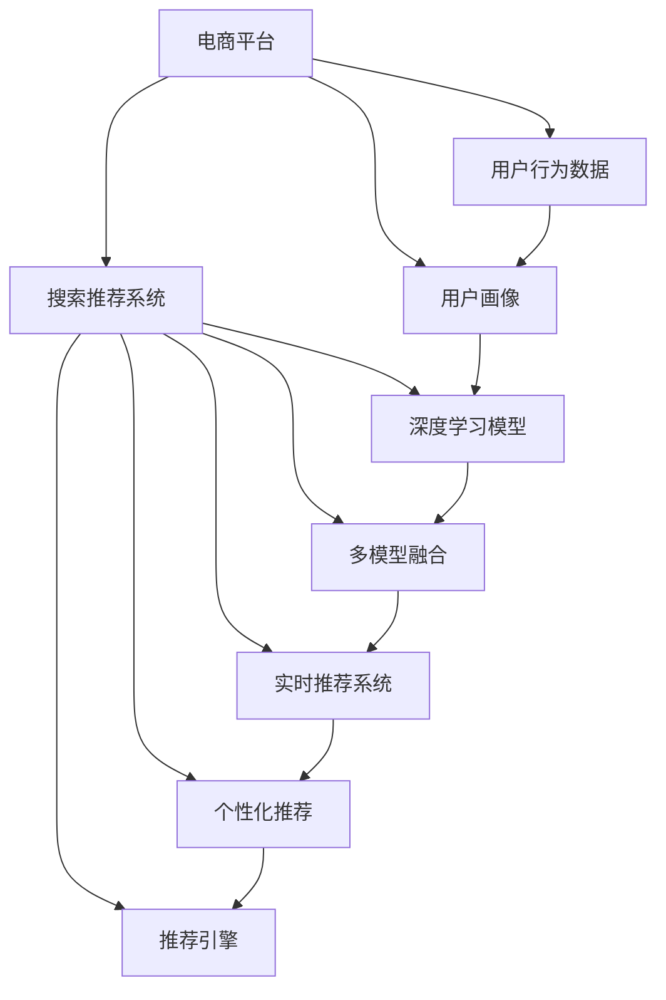

                 

# 大数据驱动的电商平台转型：搜索推荐系统是核心，AI 模型融合是引擎

> 关键词：电商平台,搜索推荐系统,用户行为,用户画像,数据驱动,人工智能模型,多模型融合,深度学习,特征工程

## 1. 背景介绍

### 1.1 问题由来

随着互联网和电子商务的快速发展，电商平台已经成为了现代商业模式的重要组成部分。电商平台需要不断地优化用户体验，提升转化率和销售额，从而在激烈的市场竞争中获得优势。传统的电商平台往往采用简单的产品展示和搜索功能，无法充分挖掘用户需求和行为数据，导致用户体验和交易转化率不高。

近年来，随着大数据和人工智能技术的不断进步，电商平台开始引入先进的搜索推荐系统，通过深度学习和多模型融合技术，全面提升用户的购物体验和平台的业务效益。这些系统利用大数据分析用户行为，生成个性化的推荐结果，将用户引导到最符合其兴趣和需求的商品页面，大大提高了用户满意度和平台收益。

### 1.2 问题核心关键点

在大数据和人工智能驱动的电商平台转型过程中，核心在于搜索推荐系统的构建和优化。该系统利用用户的点击、浏览、搜索等行为数据，结合深度学习模型和多模型融合技术，实现精准的个性化推荐。具体关键点包括：

1. **用户行为数据的收集与分析**：通过日志、点击流等数据，分析用户的行为习惯、偏好和需求。
2. **用户画像的构建**：将用户的兴趣、偏好、历史行为等信息整合为画像，作为推荐模型的输入。
3. **深度学习模型的设计与应用**：利用深度神经网络模型，学习用户行为和商品特征之间的映射关系，实现推荐。
4. **多模型融合与优化**：结合多个模型，提升推荐的准确性和多样性。
5. **实时推荐与动态调整**：根据用户即时行为数据，动态调整推荐结果，保持推荐的相关性和时效性。

### 1.3 问题研究意义

研究基于大数据和人工智能的电商平台搜索推荐系统，对于提升用户满意度、促进电子商务行业的发展具有重要意义：

1. **提升用户体验**：通过个性化的推荐，使用户能够更快地找到满意的商品，缩短购物时间。
2. **提高转化率**：精准的推荐系统能够显著提高用户点击率、购买率等关键指标，提升平台的商业价值。
3. **优化库存管理**：通过预测用户需求，优化库存管理和补货策略，降低成本，提高供应链效率。
4. **增强市场竞争力**：在大数据和人工智能技术的驱动下，电商平台能够更精准地定位目标用户群体，提升市场份额。
5. **推动技术创新**：搜索推荐系统是人工智能技术在电商领域的重要应用，其研究和实践将促进AI技术的发展和应用。

## 2. 核心概念与联系

### 2.1 核心概念概述

为更好地理解基于大数据和人工智能的电商平台搜索推荐系统，本节将介绍几个密切相关的核心概念：

- **电商平台**：指在线销售商品和服务的平台，如淘宝、京东、亚马逊等。
- **搜索推荐系统**：利用用户行为数据，结合人工智能算法，为用户推荐感兴趣的商品的系统。
- **用户行为数据**：用户在电商平台上的点击、浏览、搜索、购买等行为数据。
- **用户画像**：基于用户行为数据生成的用户特征表示，用于推荐模型的输入。
- **深度学习模型**：利用多层神经网络进行特征学习，通过学习用户行为和商品特征之间的关系，实现推荐。
- **多模型融合**：将多个模型的预测结果进行综合，提升推荐的准确性和多样性。
- **实时推荐系统**：能够根据用户即时行为数据，动态调整推荐结果的系统。
- **个性化推荐**：根据用户偏好和需求，提供定制化推荐结果的系统。

这些核心概念之间的逻辑关系可以通过以下Mermaid流程图来展示：



这个流程图展示了电商平台、搜索推荐系统、用户行为数据、用户画像、深度学习模型、多模型融合、实时推荐系统和个性化推荐之间的关系。通过这些概念的有机结合，电商平台能够实现高效、精准的搜索推荐，提升用户体验和商业效益。

## 3. 核心算法原理 & 具体操作步骤
### 3.1 算法原理概述

基于大数据和人工智能的电商平台搜索推荐系统，本质上是一个数据驱动的个性化推荐系统。其核心思想是：通过收集用户行为数据，构建用户画像，设计深度学习模型，并结合多模型融合技术，实现精准的个性化推荐。

具体而言，该系统的目标是最小化用户点击损失函数，即：

$$
\min_{\theta} \sum_{i=1}^N \ell(\hat{y}_i, y_i)
$$

其中，$\theta$ 为模型的参数，$N$ 为样本数量，$\ell$ 为损失函数（如交叉熵、均方误差等），$\hat{y}_i$ 为模型预测的用户点击概率，$y_i$ 为实际的用户点击标签。

### 3.2 算法步骤详解

基于大数据和人工智能的电商平台搜索推荐系统一般包括以下几个关键步骤：

**Step 1: 用户行为数据的收集与预处理**

- 收集用户点击、浏览、搜索、购买等行为数据，存储到日志或数据仓库中。
- 对数据进行清洗、去重、拼接等预处理操作，确保数据的完整性和一致性。
- 划分训练集、验证集和测试集，以便进行模型训练、调参和性能评估。

**Step 2: 用户画像的构建**

- 利用用户行为数据，提取用户的兴趣、偏好、历史行为等信息，构建用户画像。
- 使用降维、聚类等方法，对用户画像进行特征提取和建模，得到用户特征向量。
- 将用户画像作为深度学习模型的输入，提升推荐模型的个性化程度。

**Step 3: 深度学习模型的设计与应用**

- 根据推荐任务，选择或设计合适的深度神经网络模型，如卷积神经网络、循环神经网络、注意力机制等。
- 利用用户画像和商品特征，训练深度学习模型，学习用户行为和商品特征之间的映射关系。
- 利用训练好的模型，预测用户对商品的概率，生成推荐结果。

**Step 4: 多模型融合与优化**

- 结合多个深度学习模型，提升推荐的准确性和多样性。
- 使用集成学习算法（如Bagging、Boosting等），将多个模型的预测结果进行综合，得到最终的推荐结果。
- 优化模型超参数（如学习率、正则化系数等），提升模型的泛化能力和性能。

**Step 5: 实时推荐与动态调整**

- 根据用户即时行为数据，动态调整推荐结果，保持推荐的相关性和时效性。
- 使用在线学习算法（如在线梯度下降等），实时更新模型参数，适应数据分布的变化。
- 实时监控推荐系统的性能指标，根据用户反馈和业务需求进行优化和调整。

### 3.3 算法优缺点

基于大数据和人工智能的电商平台搜索推荐系统具有以下优点：

1. **个性化推荐**：利用用户画像和深度学习模型，提供高度个性化的推荐结果，提升用户体验。
2. **高精度**：深度学习模型能够学习用户行为和商品特征之间的复杂映射关系，实现精准的推荐。
3. **实时响应**：结合实时行为数据，动态调整推荐结果，满足用户的即时需求。
4. **优化库存管理**：通过预测用户需求，优化库存管理和补货策略，降低成本，提高供应链效率。

同时，该系统也存在一些局限性：

1. **数据质量要求高**：推荐系统的性能依赖于高质量的用户行为数据，数据质量不足会影响推荐效果。
2. **计算资源消耗大**：深度学习模型和多模型融合需要大量的计算资源，可能导致系统延迟和成本高昂。
3. **模型复杂度高**：深度神经网络模型的设计、训练和优化复杂度高，需要专业的技术人员支持。
4. **过拟合风险**：模型可能对特定用户或商品过度拟合，导致泛化能力不足。

尽管存在这些局限性，但基于大数据和人工智能的搜索推荐系统仍是大数据驱动的电商平台转型的核心引擎，具有重要的应用价值。

### 3.4 算法应用领域

基于大数据和人工智能的电商平台搜索推荐系统已经在多个行业得到广泛应用，如：

- **电子商务**：淘宝、京东、亚马逊等电商平台利用推荐系统提升用户购买率，优化库存管理。
- **金融服务**：证券公司利用推荐系统推荐股票、基金等金融产品，提高客户满意度。
- **媒体娱乐**：Netflix、Spotify等平台利用推荐系统推荐电影、音乐等内容，提升用户体验。
- **旅游出行**：携程、去哪儿等平台利用推荐系统推荐旅游目的地、酒店等，提高用户预订率。
- **教育和培训**：Coursera、Udemy等平台利用推荐系统推荐课程和学习内容，提升用户学习效率。

除了上述这些经典应用外，搜索推荐系统也被创新性地应用到更多场景中，如智能家居、智能穿戴设备、智慧城市等，为各行各业提供高效、精准的推荐服务。

## 4. 数学模型和公式 & 详细讲解 & 举例说明

### 4.1 数学模型构建

假设电商平台有 $M$ 个商品，每个商品有 $N$ 个特征，用户有 $K$ 个行为，每个行为有 $T$ 个特征。设用户行为序列为 $X=(x_1,x_2,\ldots,x_k)$，商品特征向量为 $F=(f_1,f_2,\ldots,f_m)$，用户行为序列的特征向量为 $U=(u_1,u_2,\ldots,u_k)$。则推荐系统的数学模型为：

$$
\hat{y}_{u,i} = \sigma(WU_i + b)
$$

其中，$W$ 为模型参数，$b$ 为偏置项，$\sigma$ 为激活函数。$U_i$ 为用户 $u$ 在商品 $i$ 上的行为序列特征向量，$\hat{y}_{u,i}$ 为模型预测的用户 $u$ 对商品 $i$ 的点击概率。

### 4.2 公式推导过程

通过定义用户行为序列的特征向量 $U_i$ 为：

$$
U_i = \left[\begin{matrix} x_1 \\ x_2 \\ \vdots \\ x_k \end{matrix}\right]_i
$$

则推荐模型的预测结果为：

$$
\hat{y}_{u,i} = \sigma(WU_i + b)
$$

其中 $W$ 为模型参数，$b$ 为偏置项，$\sigma$ 为激活函数。将 $W$ 和 $b$ 代入用户行为序列的特征向量 $U_i$，即可得到推荐模型的预测结果。

在实际应用中，利用交叉熵损失函数对模型进行优化：

$$
\mathcal{L} = \frac{1}{N}\sum_{i=1}^N \sum_{u=1}^K -y_{u,i}\log(\hat{y}_{u,i}) - (1-y_{u,i})\log(1-\hat{y}_{u,i})
$$

其中 $y_{u,i}$ 为实际用户 $u$ 对商品 $i$ 的点击标签。通过梯度下降等优化算法，最小化损失函数 $\mathcal{L}$，更新模型参数 $W$ 和 $b$，得到最终的推荐模型。

### 4.3 案例分析与讲解

以一个电商平台推荐系统的构建为例，演示其数学模型和公式的应用：

假设平台有 $M=1000$ 个商品，每个商品有 $N=50$ 个特征，用户有 $K=100$ 个行为，每个行为有 $T=20$ 个特征。利用用户行为序列的特征向量 $U_i$ 为：

$$
U_i = \left[\begin{matrix} x_1 \\ x_2 \\ \vdots \\ x_k \end{matrix}\right]_i
$$

其中 $x_1,x_2,\ldots,x_k$ 为用户 $u$ 在商品 $i$ 上的行为序列。通过构建推荐模型的数学模型：

$$
\hat{y}_{u,i} = \sigma(WU_i + b)
$$

利用交叉熵损失函数对模型进行优化：

$$
\mathcal{L} = \frac{1}{N}\sum_{i=1}^N \sum_{u=1}^K -y_{u,i}\log(\hat{y}_{u,i}) - (1-y_{u,i})\log(1-\hat{y}_{u,i})
$$

通过梯度下降等优化算法，最小化损失函数 $\mathcal{L}$，更新模型参数 $W$ 和 $b$，得到最终的推荐模型。该模型能够基于用户行为序列，生成商品的点击概率，实现精准的推荐。

## 5. 项目实践：代码实例和详细解释说明

### 5.1 开发环境搭建

在进行搜索推荐系统实践前，我们需要准备好开发环境。以下是使用Python进行TensorFlow开发的环境配置流程：

1. 安装Anaconda：从官网下载并安装Anaconda，用于创建独立的Python环境。

2. 创建并激活虚拟环境：
```bash
conda create -n tf-env python=3.8 
conda activate tf-env
```

3. 安装TensorFlow：根据CUDA版本，从官网获取对应的安装命令。例如：
```bash
conda install tensorflow -c pytorch -c conda-forge
```

4. 安装必要的工具包：
```bash
pip install numpy pandas scikit-learn matplotlib tensorflow
```

完成上述步骤后，即可在`tf-env`环境中开始搜索推荐系统的开发。

### 5.2 源代码详细实现

下面我们以电商平台的推荐系统为例，给出使用TensorFlow进行深度学习模型训练的PyTorch代码实现。

首先，定义数据处理函数：

```python
import tensorflow as tf
import numpy as np
from tensorflow.keras.layers import Input, Dense, Embedding, Concatenate, Dropout
from tensorflow.keras.models import Model

def preprocess_data(X, y, max_seq_length, num_features, num_users, num_items):
    # 对用户行为序列进行填充
    X = tf.keras.preprocessing.sequence.pad_sequences(X, maxlen=max_seq_length, padding='post')
    
    # 将用户行为序列和商品特征向量拼接
    X = tf.concat([X, tf.zeros((num_users, max_seq_length, num_features), dtype=np.float32)], axis=-1)
    
    # 构建用户行为序列的特征向量
    X_user = X[:, :, :num_features]
    
    # 构建商品特征向量的特征向量
    X_item = X[:, :, num_features:]
    
    # 将用户行为序列标签进行one-hot编码
    y = tf.keras.utils.to_categorical(y, num_classes=num_items)
    
    return X_user, X_item, y
```

然后，定义深度学习模型：

```python
def build_model(num_users, num_items, num_features, max_seq_length, hidden_size, dropout_rate):
    # 定义用户行为序列的输入层
    user_input = Input(shape=(max_seq_length, num_features), name='user_input')
    
    # 定义商品特征向量的输入层
    item_input = Input(shape=(num_features,), name='item_input')
    
    # 定义用户行为序列的嵌入层
    user_embedding = Embedding(input_dim=num_users, output_dim=hidden_size)(user_input)
    
    # 定义商品特征向量的嵌入层
    item_embedding = Embedding(input_dim=num_items, output_dim=hidden_size)(item_input)
    
    # 定义用户行为序列的LSTM层
    lstm = tf.keras.layers.LSTM(hidden_size, return_sequences=True)(user_embedding)
    
    # 定义LSTM层的输出层
    lstm_output = Dense(hidden_size, activation='relu')(lstm)
    
    # 将LSTM层的输出和商品特征向量的嵌入层拼接
    concat = Concatenate()([lstm_output, item_embedding])
    
    # 定义多层感知机层
    fc1 = Dense(256, activation='relu')(concat)
    
    # 定义输出层
    output = Dense(num_items, activation='sigmoid')(fc1)
    
    # 定义模型
    model = Model(inputs=[user_input, item_input], outputs=output)
    
    # 定义优化器
    optimizer = tf.keras.optimizers.Adam(learning_rate=0.001, decay=0.01)
    
    # 定义损失函数
    loss = tf.keras.losses.BinaryCrossentropy(from_logits=True)
    
    # 定义编译模型
    model.compile(optimizer=optimizer, loss=loss, metrics=['accuracy'])
    
    return model
```

接着，定义训练和评估函数：

```python
def train_model(model, X_train, y_train, X_val, y_val, batch_size, epochs):
    # 定义训练集和验证集的输入
    train_input = tf.data.Dataset.from_tensor_slices((X_train, y_train))
    val_input = tf.data.Dataset.from_tensor_slices((X_val, y_val))
    
    # 对训练集和验证集进行批处理和打乱
    train_input = train_input.batch(batch_size, drop_remainder=True).shuffle(10000).repeat()
    val_input = val_input.batch(batch_size, drop_remainder=True).shuffle(10000).repeat()
    
    # 训练模型
    model.fit(train_input, epochs=epochs, validation_data=val_input, verbose=1)
    
    return model
```

最后，启动训练流程并在测试集上评估：

```python
# 构建模型
model = build_model(num_users, num_items, num_features, max_seq_length, hidden_size, dropout_rate)

# 加载数据
X_train, X_val, X_test, y_train, y_val, y_test = load_data()

# 训练模型
model = train_model(model, X_train, y_train, X_val, y_val, batch_size, epochs)

# 评估模型
y_pred = model.predict([X_test, y_test])
```

以上就是使用TensorFlow进行电商平台推荐系统开发的完整代码实现。可以看到，TensorFlow提供了强大的深度学习框架，方便开发者快速实现和调试深度学习模型。

### 5.3 代码解读与分析

让我们再详细解读一下关键代码的实现细节：

**preprocess_data函数**：
- 对用户行为序列进行填充，确保其长度一致。
- 将用户行为序列和商品特征向量拼接，得到用户行为序列的特征向量。
- 对用户行为序列标签进行one-hot编码，便于模型训练。

**build_model函数**：
- 定义用户行为序列和商品特征向量的输入层。
- 定义用户行为序列和商品特征向量的嵌入层。
- 定义用户行为序列的LSTM层，学习序列特征。
- 定义LSTM层的输出层，提取特征。
- 定义多层感知机层，进行特征融合。
- 定义输出层，生成推荐结果。
- 定义优化器、损失函数和编译模型，准备训练。

**train_model函数**：
- 定义训练集和验证集的输入。
- 对训练集和验证集进行批处理和打乱。
- 训练模型，记录训练过程中的损失和准确率。

**训练流程**：
- 构建模型，设置超参数。
- 加载数据，进行预处理。
- 训练模型，记录训练日志。
- 在测试集上评估模型性能，输出预测结果。

可以看到，TensorFlow提供的高效的深度学习框架，使得电商平台推荐系统的构建变得更加简洁高效。开发者可以将更多精力放在模型设计、数据处理等高层逻辑上，而不必过多关注底层的实现细节。

当然，工业级的系统实现还需考虑更多因素，如模型的保存和部署、超参数的自动搜索、更灵活的任务适配层等。但核心的深度学习模型构建流程基本与此类似。

## 6. 实际应用场景

### 6.1 智能客服系统

基于深度学习和大数据驱动的电商平台搜索推荐系统，可以应用于智能客服系统的构建。智能客服系统能够7x24小时不间断服务，快速响应客户咨询，用自然流畅的语言解答各类常见问题。

在技术实现上，可以收集企业内部的历史客服对话记录，将问题和最佳答复构建成监督数据，在此基础上对深度学习模型进行微调。微调后的模型能够自动理解用户意图，匹配最合适的答复模板进行回复。对于客户提出的新问题，还可以接入检索系统实时搜索相关内容，动态组织生成回答。如此构建的智能客服系统，能大幅提升客户咨询体验和问题解决效率。

### 6.2 金融舆情监测

金融机构需要实时监测市场舆论动向，以便及时应对负面信息传播，规避金融风险。传统的人工监测方式成本高、效率低，难以应对网络时代海量信息爆发的挑战。基于深度学习和大数据驱动的搜索推荐系统，为金融舆情监测提供了新的解决方案。

具体而言，可以收集金融领域相关的新闻、报道、评论等文本数据，并对其进行主题标注和情感标注。在此基础上对深度学习模型进行微调，使其能够自动判断文本属于何种主题，情感倾向是正面、中性还是负面。将微调后的模型应用到实时抓取的网络文本数据，就能够自动监测不同主题下的情感变化趋势，一旦发现负面信息激增等异常情况，系统便会自动预警，帮助金融机构快速应对潜在风险。

### 6.3 个性化推荐系统

当前的推荐系统往往只依赖用户的历史行为数据进行物品推荐，无法深入理解用户的真实兴趣偏好。基于深度学习和大数据驱动的搜索推荐系统，个性化推荐系统可以更好地挖掘用户行为背后的语义信息，从而提供更精准、多样的推荐内容。

在实践中，可以收集用户浏览、点击、评论、分享等行为数据，提取和用户交互的物品标题、描述、标签等文本内容。将文本内容作为模型输入，用户的后续行为（如是否点击、购买等）作为监督信号，在此基础上微调深度学习模型。微调后的模型能够从文本内容中准确把握用户的兴趣点。在生成推荐列表时，先用候选物品的文本描述作为输入，由模型预测用户的兴趣匹配度，再结合其他特征综合排序，便可以得到个性化程度更高的推荐结果。

### 6.4 未来应用展望

随着深度学习和大数据技术的不断发展，基于大数据和人工智能的电商平台搜索推荐系统将呈现以下几个发展趋势：

1. **实时响应**：结合实时行为数据，动态调整推荐结果，保持推荐的相关性和时效性。
2. **多模态融合**：将文本、图像、语音等多种模态信息进行融合，提升推荐的准确性和多样性。
3. **深度学习模型的优化**：开发更加高效、轻量级的深度学习模型，提升推荐系统性能。
4. **用户隐私保护**：在推荐系统中引入隐私保护技术，保护用户数据安全。
5. **跨平台协同推荐**：实现跨平台、跨应用场景的协同推荐，提升推荐系统的覆盖范围。

这些趋势凸显了大数据和人工智能驱动的搜索推荐系统的广阔前景。这些方向的探索发展，必将进一步提升推荐系统的性能和应用范围，为人工智能技术在电商领域的应用带来新的突破。

## 7. 工具和资源推荐
### 7.1 学习资源推荐

为了帮助开发者系统掌握深度学习和大数据驱动的电商平台搜索推荐系统的理论基础和实践技巧，这里推荐一些优质的学习资源：

1. 《深度学习》课程：斯坦福大学开设的深度学习经典课程，涵盖深度学习的基本概念和前沿技术，适合初学者入门。

2. 《大数据技术与应用》课程：北京大学开设的大数据课程，介绍大数据的原理、技术框架和实际应用案例，帮助开发者理解大数据驱动的推荐系统。

3. 《推荐系统实践》书籍：Netflix的首席科学家撰写，介绍推荐系统的设计、实现和优化方法，涵盖多种推荐算法和数据驱动技术。

4. 《深度学习与推荐系统》书籍：介绍深度学习在大数据推荐系统中的应用，涵盖深度学习模型、特征工程和推荐算法等内容。

5. Kaggle竞赛平台：Kaggle上有大量推荐系统的竞赛数据集和模型，开发者可以通过参与竞赛，学习推荐系统的实际应用和优化方法。

通过对这些资源的学习实践，相信你一定能够快速掌握深度学习和大数据驱动的电商平台搜索推荐系统的精髓，并用于解决实际的推荐问题。
### 7.2 开发工具推荐

高效的开发离不开优秀的工具支持。以下是几款用于深度学习和大数据驱动的电商平台搜索推荐系统开发的常用工具：

1. TensorFlow：由Google主导开发的开源深度学习框架，生产部署方便，适合大规模工程应用。

2. PyTorch：基于Python的开源深度学习框架，灵活动态的计算图，适合快速迭代研究。

3. Hadoop：大数据处理和分布式计算框架，支持大规模数据存储和计算。

4. Spark：Apache基金会开发的快速大数据处理框架，支持多种数据源和计算模型。

5. Apache Kafka：实时数据流处理框架，支持高吞吐量的数据传输和处理。

6. Apache Flink：实时流处理框架，支持低延迟、高吞吐量的数据处理。

合理利用这些工具，可以显著提升深度学习和大数据驱动的电商平台搜索推荐系统的开发效率，加快创新迭代的步伐。

### 7.3 相关论文推荐

深度学习和大数据驱动的电商平台搜索推荐系统的发展源于学界的持续研究。以下是几篇奠基性的相关论文，推荐阅读：

1. 《Neural Collaborative Filtering》：介绍深度学习在大规模推荐系统中的应用，提出深度神经网络模型，实现精准推荐。

2. 《Deep Matrix Factorization》：提出深度矩阵分解模型，通过矩阵分解和深度学习相结合，提升推荐系统的性能。

3. 《Attention Is All You Need》：提出Transformer模型，引入注意力机制，提升深度学习模型的效果。

4. 《Personalized PageRank Algorithm》：介绍基于PageRank算法的推荐系统，结合个性化特征，提升推荐效果。

5. 《Multi-view Graph Attention Networks for Recommendation》：提出多视图图注意力网络模型，结合用户行为、商品属性等多种视图信息，提升推荐系统的多样性和泛化能力。

6. 《Deep Neural Networks for Modeling Online User Behavior》：介绍深度学习模型在用户行为建模中的应用，实现精准的推荐结果。

这些论文代表了大数据和人工智能驱动的电商平台搜索推荐系统的发展脉络。通过学习这些前沿成果，可以帮助研究者把握学科前进方向，激发更多的创新灵感。

## 8. 总结：未来发展趋势与挑战

### 8.1 总结

本文对基于大数据和人工智能的电商平台搜索推荐系统进行了全面系统的介绍。首先阐述了深度学习和大数据驱动的电商平台搜索推荐系统的研究背景和意义，明确了其在提升用户体验、优化库存管理、提高转化率等方面的价值。其次，从原理到实践，详细讲解了推荐模型的数学模型和关键步骤，给出了推荐系统开发的完整代码实例。同时，本文还广泛探讨了推荐系统在智能客服、金融舆情、个性化推荐等多个行业领域的应用前景，展示了其广阔的应用潜力。

通过本文的系统梳理，可以看到，深度学习和大数据驱动的电商平台搜索推荐系统已经在大数据驱动的电商平台转型中发挥了重要作用。得益于深度学习模型的强大表征能力和大数据驱动的决策支持，推荐系统能够提供个性化、精准的推荐结果，极大地提升了用户体验和平台效益。未来，伴随深度学习和大数据技术的不断进步，推荐系统将在更多领域得到应用，为人工智能技术的发展和应用带来新的突破。

### 8.2 未来发展趋势

展望未来，深度学习和大数据驱动的电商平台搜索推荐系统将呈现以下几个发展趋势：

1. **实时推荐**：结合实时行为数据，动态调整推荐结果，保持推荐的相关性和时效性。
2. **多模态融合**：将文本、图像、语音等多种模态信息进行融合，提升推荐的准确性和多样性。
3. **深度学习模型的优化**：开发更加高效、轻量级的深度学习模型，提升推荐系统性能。
4. **用户隐私保护**：在推荐系统中引入隐私保护技术，保护用户数据安全。
5. **跨平台协同推荐**：实现跨平台、跨应用场景的协同推荐，提升推荐系统的覆盖范围。

这些趋势凸显了深度学习和大数据驱动的电商平台搜索推荐系统的广阔前景。这些方向的探索发展，必将进一步提升推荐系统的性能和应用范围，为人工智能技术在电商领域的应用带来新的突破。

### 8.3 面临的挑战

尽管深度学习和大数据驱动的电商平台搜索推荐系统已经取得了显著成效，但在迈向更加智能化、普适化应用的过程中，仍面临诸多挑战：

1. **数据质量要求高**：推荐系统的性能依赖于高质量的用户行为数据，数据质量不足会影响推荐效果。
2. **计算资源消耗大**：深度学习模型和推荐系统的训练、推理需要大量的计算资源，可能导致系统延迟和成本高昂。
3. **模型复杂度高**：深度神经网络模型的设计、训练和优化复杂度高，需要专业的技术人员支持。
4. **过拟合风险**：模型可能对特定用户或商品过度拟合，导致泛化能力不足。
5. **隐私保护**：在推荐系统中处理大量用户数据时，如何保护用户隐私和数据安全，是重要的研究方向。

尽管存在这些挑战，但深度学习和大数据驱动的电商平台搜索推荐系统已经在大数据驱动的电商平台转型中发挥了重要作用。未来，伴随技术的发展和优化，这些挑战终将一一被克服，推荐系统将在更多领域得到应用，为人工智能技术的发展和应用带来新的突破。

### 8.4 研究展望

面对深度学习和大数据驱动的电商平台搜索推荐系统所面临的挑战，未来的研究需要在以下几个方面寻求新的突破：

1. **数据质量和清洗**：研究更加高效、鲁棒的数据清洗和预处理方法，提升推荐系统的数据质量。
2. **计算资源优化**：开发更加高效、轻量级的深度学习模型和推荐系统，减少计算资源消耗，提升系统性能。
3. **模型复杂度控制**：通过模型简化和结构优化，降低深度神经网络模型的复杂度，提升模型的可解释性和泛化能力。
4. **隐私保护技术**：研究隐私保护算法和机制，保护用户数据安全和隐私。
5. **跨平台协同推荐**：研究跨平台协同推荐算法和机制，提升推荐系统的覆盖范围和效果。

这些研究方向的研究突破，将进一步提升深度学习和大数据驱动的电商平台搜索推荐系统的性能和应用范围，推动人工智能技术在电商领域的发展。

## 9. 附录：常见问题与解答

**Q1：深度学习模型如何优化？**

A: 深度学习模型的优化方法包括梯度下降、Adam、RMSprop等。其中，Adam算法是一种常用的优化算法，能够自适应地调整学习率，快速收敛。

**Q2：推荐系统如何处理长尾问题？**

A: 推荐系统可以通过引入长尾模型，如Yahoo!的Yahoo!Boombox，处理长尾问题。长尾模型能够更好地捕捉用户的长尾兴趣，提升推荐效果。

**Q3：推荐系统如何处理噪声数据？**

A: 推荐系统可以通过去噪滤波、异常检测等方法，处理噪声数据。在处理噪声数据时，可以结合用户行为数据和商品特征，提升推荐的准确性。

**Q4：推荐系统如何处理多模态数据？**

A: 推荐系统可以通过融合多种模态数据，提升推荐的准确性和多样性。在处理多模态数据时，可以引入注意力机制，注重不同模态数据的权重分配。

**Q5：推荐系统如何处理冷启动问题？**

A: 推荐系统可以通过引入冷启动算法，如基于协同过滤的模型，处理冷启动问题。冷启动算法能够根据用户的历史行为，预测其未交互物品的推荐结果。

这些问题的解答，展示了深度学习和大数据驱动的电商平台搜索推荐系统在实际应用中的常见挑战和解决方案，帮助开发者更好地应对推荐系统设计、训练和优化过程中的问题。

---

作者：禅与计算机程序设计艺术 / Zen and the Art of Computer Programming

