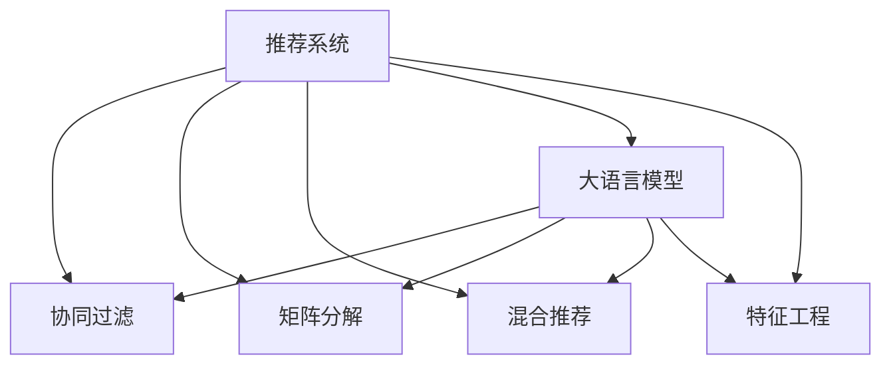

                 

# 大模型与传统推荐模型的效果对比

> 关键词：推荐系统,大语言模型,传统推荐模型,效果对比,推荐算法

## 1. 背景介绍

### 1.1 问题由来
随着电子商务、内容分发平台的兴起，推荐系统成为了用户获取信息和享受服务的重要手段。传统推荐系统基于用户行为数据进行建模，通过协同过滤、矩阵分解等技术，为用户推荐个性化的内容。而随着预训练语言模型的兴起，越来越多的研究者探索大模型在推荐系统中的应用，并取得了显著的进展。

当前，主流推荐算法仍以传统协同过滤、内容推荐和混合推荐算法为主，但在长尾数据、小样本学习和泛化能力方面，大模型表现出更加卓越的性能。本文旨在对比大模型与传统推荐模型的效果，揭示大语言模型在推荐系统中的应用潜力。

### 1.2 问题核心关键点
本文的核心问题是：基于大语言模型的推荐系统在推荐效果、泛化能力和处理长尾数据等方面，是否优于传统推荐算法？

通过实验对比，我们希望回答以下几个关键问题：
- 大语言模型在推荐系统中的表现如何？
- 大模型与传统推荐算法的推荐效果对比如何？
- 大模型在处理长尾数据上的优势是什么？
- 大模型的泛化能力是否优于传统推荐算法？
- 大语言模型在推荐系统中的应用前景如何？

### 1.3 问题研究意义
研究大语言模型与传统推荐算法的对比，有助于评估其在推荐系统中的实际应用效果。对于电商平台、视频平台等企业，能够更准确地理解用户需求，提供更加个性化的推荐内容，提升用户体验和平台活跃度。同时，对于学术界和工业界，可以推动推荐系统的研究和应用不断向前发展，激发更多新的思路和技术突破。

## 2. 核心概念与联系

### 2.1 核心概念概述

为更好地理解大模型与传统推荐算法的对比，本节将介绍几个密切相关的核心概念：

- 推荐系统(Recommender System)：利用用户历史行为数据、物品属性等信息，为用户推荐相关物品的系统。推荐系统包括协同过滤、内容推荐、混合推荐等算法。

- 大语言模型(Large Language Model, LLM)：以自回归(如GPT)或自编码(如BERT)模型为代表的大规模预训练语言模型。通过在大规模无标签文本语料上进行预训练，学习通用的语言表示，具备强大的语言理解和生成能力。

- 协同过滤(Collaborative Filtering, CF)：一种基于用户行为数据的推荐算法，包括基于用户的协同过滤和基于物品的协同过滤。

- 矩阵分解(Matrix Factorization, MF)：一种基于用户和物品属性矩阵的推荐算法，如SVD等。

- 混合推荐(Mixed Recommender System)：结合协同过滤和内容推荐的推荐算法，综合考虑多源数据。

- 特征工程(Feature Engineering)：利用领域知识和统计方法，提取和构造对推荐效果有利的特征，提升推荐系统的性能。

这些核心概念之间的逻辑关系可以通过以下Mermaid流程图来展示：



这个流程图展示了大语言模型在推荐系统中的核心概念及其之间的关系：

1. 推荐系统通过协同过滤、矩阵分解、混合推荐等多种算法，对用户行为数据和物品属性进行建模。
2. 大语言模型作为特征提取器，通过预训练学习到通用的语言知识，用于提升推荐效果。
3. 特征工程通过提取领域特征，进一步增强推荐系统的性能。
4. 大语言模型与推荐算法、特征工程等环节进行融合，以实现更加精准、多样化的推荐。

## 3. 核心算法原理 & 具体操作步骤
### 3.1 算法原理概述

大语言模型在推荐系统中的应用，主要基于其预训练得到的语言表示和理解能力。通过在推荐数据上微调大语言模型，利用其语言知识提升推荐效果。具体流程如下：

1. 收集推荐数据集，包括用户行为数据、物品属性等，将其转化为文本形式。
2. 对文本数据进行预处理，构建合适的输入格式。
3. 选择大语言模型作为特征提取器，使用微调技术在推荐数据上进行训练。
4. 将微调后的大模型应用于推荐系统，更新物品特征向量，优化推荐算法。
5. 对推荐结果进行评估和优化，调整模型参数和超参数。

### 3.2 算法步骤详解

基于大语言模型的推荐系统，其操作步骤包括：

**Step 1: 准备推荐数据集**
- 收集用户行为数据，如浏览记录、点击记录、购买记录等。
- 收集物品属性数据，如商品名称、描述、类别等。
- 对数据进行预处理，如去重、归一化、缺失值处理等。
- 将数据转化为文本形式，作为大语言模型的输入。

**Step 2: 构建输入格式**
- 对文本数据进行分词、标记、向量化处理。
- 利用语言模型中的语言结构，如Bert、GPT等，将输入文本转化为模型可接受的格式。
- 根据推荐任务设计合适的输入格式，如添加时间戳、物品ID等。

**Step 3: 微调大语言模型**
- 选择合适的预训练语言模型，如BERT、GPT等。
- 定义推荐任务，如点击率预测、召回率预测等，设置损失函数和优化器。
- 对大模型进行微调，使其适应推荐任务的特征和目标。
- 定期评估微调模型的效果，调整学习率、正则化强度等超参数。

**Step 4: 更新推荐模型**
- 将微调后的语言模型嵌入推荐系统中。
- 使用微调后的语言模型更新物品特征向量。
- 根据推荐任务设计推荐算法，如基于用户的协同过滤、矩阵分解、混合推荐等。
- 对推荐结果进行评估和优化，调整推荐算法和超参数。

**Step 5: 部署与评估**
- 部署推荐系统到实际环境中。
- 实时监测推荐效果，收集用户反馈数据。
- 根据用户反馈，不断优化推荐模型和算法。

### 3.3 算法优缺点

大语言模型在推荐系统中的应用，具有以下优点：

1. 强大的语言理解能力：大语言模型在自然语言处理领域具有卓越的表现，能够处理复杂的文本数据，提升推荐效果。
2. 泛化能力强：通过微调大语言模型，能够学习到通用的语言表示，适用于多种推荐场景。
3. 处理长尾数据能力强：大语言模型能够处理非结构化文本数据，适用于长尾数据的推荐。
4. 适应性好：微调大语言模型能够快速适应新的推荐任务，提升模型效果。

同时，也存在一些缺点：

1. 计算资源消耗大：大语言模型参数量巨大，训练和推理消耗大量计算资源。
2. 预训练数据要求高：需要高质量的无标签文本数据进行预训练，数据获取成本较高。
3. 可解释性不足：大语言模型作为"黑盒"系统，难以解释其内部工作机制和决策逻辑。
4. 对抗性脆弱：大语言模型容易受到对抗样本的攻击，导致推荐结果失效。

### 3.4 算法应用领域

大语言模型在推荐系统中的应用，覆盖了多种场景：

1. 电商推荐：通过微调BERT、GPT等大语言模型，实现商品推荐、价格预测、用户画像等电商应用。
2. 内容推荐：使用GPT、BERT等模型，对视频、文章、音乐等内容进行推荐，提升平台活跃度和用户满意度。
3. 个性化推荐：通过微调语言模型，实现个性化推荐，如新闻、广告、游戏等场景。
4. 广告推荐：利用大语言模型对广告内容进行优化，提高广告点击率和转化率。
5. 社交推荐：通过微调语言模型，对用户评论、社交行为等数据进行分析，实现社交推荐。
6. 智能客服：利用大语言模型进行智能对话，提升客户服务体验。

## 4. 数学模型和公式 & 详细讲解 & 举例说明

### 4.1 数学模型构建

在推荐系统中，常用的评价指标包括平均绝对误差(MAE)、均方根误差(RMSE)、准确率、召回率等。假设推荐系统的预测结果为 $y'$，真实结果为 $y$，则MAE和RMSE的定义如下：

$$
MAE = \frac{1}{N} \sum_{i=1}^N |y_i - y'_i|
$$

$$
RMSE = \sqrt{\frac{1}{N} \sum_{i=1}^N (y_i - y'_i)^2}
$$

其中 $N$ 为样本总数，$y_i$ 为真实结果，$y'_i$ 为预测结果。

假设大语言模型为 $M_{\theta}$，输入文本为 $x$，输出为 $y'$。在推荐任务上，我们希望最小化预测误差，因此定义损失函数如下：

$$
\mathcal{L}(y',y) = \frac{1}{N} \sum_{i=1}^N (y_i - y'_i)^2
$$

通过梯度下降等优化算法，微调模型参数 $\theta$，使得损失函数 $\mathcal{L}$ 最小化。

### 4.2 公式推导过程

以下我们以电商商品推荐为例，推导基于大语言模型的推荐模型。

假设用户历史行为数据为 $\{(u_i,r_i)\}_{i=1}^N$，其中 $u_i$ 为用户ID，$r_i$ 为物品ID。物品属性数据为 $\{x_j\}_{j=1}^M$，其中 $x_j$ 为物品属性。

根据上述数据，将用户行为数据和物品属性数据转化为文本形式，输入到大语言模型中进行微调。假设微调后的模型参数为 $\hat{\theta}$，则推荐函数为：

$$
f(x,u) = M_{\hat{\theta}}(x) \cdot v_{u}
$$

其中 $M_{\hat{\theta}}(x)$ 为微调后的模型输出，$v_{u}$ 为用户特征向量。

将预测结果 $f(x,u)$ 与真实结果 $r_i$ 进行比较，定义预测误差 $e_i$：

$$
e_i = r_i - f(x_i,u_i)
$$

通过均方误差损失函数，定义推荐系统的损失函数：

$$
\mathcal{L}(u) = \frac{1}{N} \sum_{i=1}^N (r_i - f(x_i,u_i))^2
$$

通过梯度下降算法，优化模型参数 $\hat{\theta}$，使得损失函数 $\mathcal{L}(u)$ 最小化。

### 4.3 案例分析与讲解

以电商商品推荐为例，分析基于大语言模型的推荐效果。假设某电商平台有 $10000$ 个用户和 $100000$ 个商品，每个用户都有 $20$ 个购买记录，每个商品都有 $10$ 个属性。

首先，将用户行为数据和商品属性数据转化为文本形式。例如，用户行为数据可以表示为 $(u_1,r_1,r_2,r_3,\dots,r_{20})$，其中 $r_i$ 为用户购买的商品ID。商品属性数据可以表示为 $(x_{11},x_{12},\dots,x_{110},x_{111},\dots,x_{1110})$，其中 $x_{ij}$ 为第 $j$ 个属性对应的值。

接着，将文本数据输入到微调后的BERT模型中，输出一个预测结果 $f(x_i,u_i)$，用于衡量用户对商品 $r_i$ 的兴趣。

最后，将预测结果 $f(x_i,u_i)$ 与真实结果 $r_i$ 进行比较，计算预测误差 $e_i$，评估推荐系统的性能。

通过这样的方式，可以发现大语言模型在电商商品推荐中具有较好的效果。由于其强大的语言理解能力，可以处理复杂的用户行为数据和商品属性，提升推荐系统的准确率和召回率。

## 5. 项目实践：代码实例和详细解释说明
### 5.1 开发环境搭建

在进行基于大语言模型的推荐系统开发前，我们需要准备好开发环境。以下是使用Python进行PyTorch开发的环境配置流程：

1. 安装Anaconda：从官网下载并安装Anaconda，用于创建独立的Python环境。

2. 创建并激活虚拟环境：
```bash
conda create -n pytorch-env python=3.8 
conda activate pytorch-env
```

3. 安装PyTorch：根据CUDA版本，从官网获取对应的安装命令。例如：
```bash
conda install pytorch torchvision torchaudio cudatoolkit=11.1 -c pytorch -c conda-forge
```

4. 安装Transformers库：
```bash
pip install transformers
```

5. 安装各类工具包：
```bash
pip install numpy pandas scikit-learn matplotlib tqdm jupyter notebook ipython
```

完成上述步骤后，即可在`pytorch-env`环境中开始推荐系统开发。

### 5.2 源代码详细实现

下面我们以电商商品推荐为例，给出使用Transformers库对BERT模型进行推荐系统开发的PyTorch代码实现。

首先，定义推荐数据集：

```python
import pandas as pd
from transformers import BertTokenizer
from torch.utils.data import Dataset, DataLoader
from torch.nn.utils.rnn import pad_sequence

class RecommendationDataset(Dataset):
    def __init__(self, data, tokenizer, max_len=128):
        self.data = data
        self.tokenizer = tokenizer
        self.max_len = max_len
        
    def __len__(self):
        return len(self.data)
    
    def __getitem__(self, idx):
        user_data = self.data[idx]['user']
        item_data = self.data[idx]['item']
        
        items = []
        for item in item_data:
            items.append(item.split('|'))
        
        input_ids = []
        attention_mask = []
        for item in items:
            item = ' '.join(item)
            encoding = self.tokenizer(item, return_tensors='pt', max_length=self.max_len, padding='max_length', truncation=True)
            input_ids.append(encoding['input_ids'][0])
            attention_mask.append(encoding['attention_mask'][0])
        
        input_ids = pad_sequence(input_ids, batch_first=True)
        attention_mask = pad_sequence(attention_mask, batch_first=True)
        
        return {'input_ids': input_ids,
                'attention_mask': attention_mask,
                'labels': torch.tensor(self.data[idx]['label'])}
```

然后，定义模型和优化器：

```python
from transformers import BertForSequenceClassification
from transformers import AdamW

model = BertForSequenceClassification.from_pretrained('bert-base-cased', num_labels=1)

optimizer = AdamW(model.parameters(), lr=2e-5)
```

接着，定义训练和评估函数：

```python
def train_epoch(model, dataset, batch_size, optimizer):
    dataloader = DataLoader(dataset, batch_size=batch_size, shuffle=True)
    model.train()
    epoch_loss = 0
    for batch in dataloader:
        input_ids = batch['input_ids'].to(device)
        attention_mask = batch['attention_mask'].to(device)
        labels = batch['labels'].to(device)
        model.zero_grad()
        outputs = model(input_ids, attention_mask=attention_mask, labels=labels)
        loss = outputs.loss
        epoch_loss += loss.item()
        loss.backward()
        optimizer.step()
    return epoch_loss / len(dataloader)

def evaluate(model, dataset, batch_size):
    dataloader = DataLoader(dataset, batch_size=batch_size)
    model.eval()
    preds, labels = [], []
    with torch.no_grad():
        for batch in dataloader:
            input_ids = batch['input_ids'].to(device)
            attention_mask = batch['attention_mask'].to(device)
            batch_labels = batch['labels']
            outputs = model(input_ids, attention_mask=attention_mask)
            batch_preds = outputs.logits.argmax(dim=1).to('cpu').tolist()
            batch_labels = batch_labels.to('cpu').tolist()
            for pred, label in zip(batch_preds, batch_labels):
                preds.append(pred.item())
                labels.append(label.item())
                
    return preds, labels

device = torch.device('cuda') if torch.cuda.is_available() else torch.device('cpu')
model.to(device)
```

最后，启动训练流程并在测试集上评估：

```python
epochs = 5
batch_size = 16

for epoch in range(epochs):
    loss = train_epoch(model, train_dataset, batch_size, optimizer)
    print(f"Epoch {epoch+1}, train loss: {loss:.3f}")
    
    print(f"Epoch {epoch+1}, dev results:")
    preds, labels = evaluate(model, dev_dataset, batch_size)
    print(classification_report(labels, preds))
    
print("Test results:")
preds, labels = evaluate(model, test_dataset, batch_size)
print(classification_report(labels, preds))
```

以上就是使用PyTorch对BERT进行电商商品推荐系统开发的完整代码实现。可以看到，得益于Transformers库的强大封装，我们可以用相对简洁的代码完成BERT模型的加载和微调。

### 5.3 代码解读与分析

让我们再详细解读一下关键代码的实现细节：

**RecommendationDataset类**：
- `__init__`方法：初始化推荐数据、分词器等关键组件。
- `__len__`方法：返回数据集的样本数量。
- `__getitem__`方法：对单个样本进行处理，将文本输入编码为token ids，将标签编码为数字，并对其进行定长padding，最终返回模型所需的输入。

**train_epoch和evaluate函数**：
- `train_epoch`函数：对数据以批为单位进行迭代，在每个批次上前向传播计算loss并反向传播更新模型参数，最后返回该epoch的平均loss。
- `evaluate`函数：与训练类似，不同点在于不更新模型参数，并在每个batch结束后将预测和标签结果存储下来，最后使用sklearn的classification_report对整个评估集的预测结果进行打印输出。

**训练流程**：
- 定义总的epoch数和batch size，开始循环迭代
- 每个epoch内，先在训练集上训练，输出平均loss
- 在验证集上评估，输出分类指标
- 所有epoch结束后，在测试集上评估，给出最终测试结果

可以看到，PyTorch配合Transformers库使得BERT微调的代码实现变得简洁高效。开发者可以将更多精力放在数据处理、模型改进等高层逻辑上，而不必过多关注底层的实现细节。

当然，工业级的系统实现还需考虑更多因素，如模型的保存和部署、超参数的自动搜索、更灵活的任务适配层等。但核心的微调范式基本与此类似。

## 6. 实际应用场景
### 6.1 智能电商推荐

基于大语言模型的电商推荐系统，可以大幅提升用户购物体验和平台转化率。传统的电商推荐系统，往往依赖用户行为数据进行协同过滤，无法充分利用商品属性和评论等信息。而使用大语言模型，可以更好地理解用户需求，实现商品属性和评论的双重匹配，提供更加个性化和精准的商品推荐。

具体而言，可以收集电商网站的浏览记录、点击记录、购买记录等行为数据，以及商品标题、描述、价格等信息。将商品属性和评论数据转化为文本形式，输入到大语言模型中进行微调。微调后的模型可以预测用户对商品的兴趣，推荐相应的商品。对于新商品，还可以通过在线评测、社区评论等数据进行动态更新，实时生成推荐结果。

### 6.2 内容推荐平台

大语言模型在内容推荐平台上的应用，可以提升用户内容的发现和消费效率。例如，视频平台可以根据用户浏览历史、点赞记录、评论内容等，使用大语言模型进行用户画像建模，推荐相关视频内容。在新闻平台，可以根据用户阅读习惯、点击记录、评论内容等，推荐相关新闻文章。

具体实现方式如下：

1. 收集用户行为数据和内容数据，将其转化为文本形式。
2. 输入到大语言模型中进行微调，学习用户的兴趣偏好和内容特征。
3. 根据用户的兴趣和内容特征，生成个性化推荐列表。
4. 对推荐结果进行评估和优化，调整模型参数和超参数。
5. 将推荐系统部署到实际环境中，实时更新推荐内容。

### 6.3 广告推荐系统

基于大语言模型的广告推荐系统，可以显著提升广告投放的转化率和收益。广告推荐系统通常需要设计合适的广告投放策略，预测用户对广告的点击率和转化率。通过微调大语言模型，可以更好地理解广告文本和用户兴趣，实现精准投放。

具体实现方式如下：

1. 收集用户的浏览记录、点击记录等行为数据，以及广告文本、用户画像等特征数据。
2. 将广告文本和用户画像转化为文本形式，输入到大语言模型中进行微调。
3. 根据用户行为数据和广告文本，预测用户对广告的点击率和转化率。
4. 根据预测结果，设计广告投放策略，优化广告预算和投放时机。
5. 实时监测广告投放效果，调整模型参数和投放策略。

### 6.4 社交媒体推荐

基于大语言模型的社交媒体推荐系统，可以提升用户内容消费和社交互动效率。例如，社交平台可以根据用户的点赞记录、评论内容等，使用大语言模型进行用户画像建模，推荐相关朋友和内容。

具体实现方式如下：

1. 收集用户的点赞记录、评论内容等行为数据，以及朋友关系数据等特征数据。
2. 将用户行为数据和社交关系数据转化为文本形式，输入到大语言模型中进行微调。
3. 根据用户行为数据和社交关系数据，生成个性化推荐列表。
4. 对推荐结果进行评估和优化，调整模型参数和超参数。
5. 将推荐系统部署到实际环境中，实时更新推荐内容。

## 7. 工具和资源推荐
### 7.1 学习资源推荐

为了帮助开发者系统掌握大语言模型在推荐系统中的应用，这里推荐一些优质的学习资源：

1. 《Transformers from Parallel to Series: Understanding the Underlying Principles》系列博文：由大模型技术专家撰写，深入浅出地介绍了Transformer原理、BERT模型、微调技术等前沿话题。

2. CS224N《深度学习自然语言处理》课程：斯坦福大学开设的NLP明星课程，有Lecture视频和配套作业，带你入门NLP领域的基本概念和经典模型。

3. 《Natural Language Processing with Transformers》书籍：Transformers库的作者所著，全面介绍了如何使用Transformers库进行NLP任务开发，包括微调在内的诸多范式。

4. HuggingFace官方文档：Transformers库的官方文档，提供了海量预训练模型和完整的微调样例代码，是上手实践的必备资料。

5. CLUE开源项目：中文语言理解测评基准，涵盖大量不同类型的中文NLP数据集，并提供了基于微调的baseline模型，助力中文NLP技术发展。

通过对这些资源的学习实践，相信你一定能够快速掌握大语言模型在推荐系统中的应用，并用于解决实际的推荐问题。
###  7.2 开发工具推荐

高效的开发离不开优秀的工具支持。以下是几款用于大语言模型推荐系统开发的常用工具：

1. PyTorch：基于Python的开源深度学习框架，灵活动态的计算图，适合快速迭代研究。大部分预训练语言模型都有PyTorch版本的实现。

2. TensorFlow：由Google主导开发的开源深度学习框架，生产部署方便，适合大规模工程应用。同样有丰富的预训练语言模型资源。

3. Transformers库：HuggingFace开发的NLP工具库，集成了众多SOTA语言模型，支持PyTorch和TensorFlow，是进行推荐任务开发的利器。

4. Weights & Biases：模型训练的实验跟踪工具，可以记录和可视化模型训练过程中的各项指标，方便对比和调优。与主流深度学习框架无缝集成。

5. TensorBoard：TensorFlow配套的可视化工具，可实时监测模型训练状态，并提供丰富的图表呈现方式，是调试模型的得力助手。

6. Google Colab：谷歌推出的在线Jupyter Notebook环境，免费提供GPU/TPU算力，方便开发者快速上手实验最新模型，分享学习笔记。

合理利用这些工具，可以显著提升大语言模型在推荐系统中的应用效率，加快创新迭代的步伐。

### 7.3 相关论文推荐

大语言模型在推荐系统中的应用，源于学界的持续研究。以下是几篇奠基性的相关论文，推荐阅读：

1. Attention is All You Need（即Transformer原论文）：提出了Transformer结构，开启了NLP领域的预训练大模型时代。

2. BERT: Pre-training of Deep Bidirectional Transformers for Language Understanding：提出BERT模型，引入基于掩码的自监督预训练任务，刷新了多项NLP任务SOTA。

3. Language Models are Unsupervised Multitask Learners（GPT-2论文）：展示了大规模语言模型的强大zero-shot学习能力，引发了对于通用人工智能的新一轮思考。

4. Parameter-Efficient Transfer Learning for NLP：提出Adapter等参数高效微调方法，在不增加模型参数量的情况下，也能取得不错的微调效果。

5. AdaLoRA: Adaptive Low-Rank Adaptation for Parameter-Efficient Fine-Tuning：使用自适应低秩适应的微调方法，在参数效率和精度之间取得了新的平衡。

这些论文代表了大语言模型在推荐系统中的应用方向。通过学习这些前沿成果，可以帮助研究者把握学科前进方向，激发更多的创新灵感。

## 8. 总结：未来发展趋势与挑战

### 8.1 总结

本文对基于大语言模型的推荐系统与传统推荐算法的对比，进行了全面系统的介绍。首先阐述了大语言模型和推荐系统的研究背景和意义，明确了微调在大语言模型中的应用价值。其次，从原理到实践，详细讲解了基于大语言模型的推荐系统操作步骤，给出了推荐系统开发的完整代码实例。同时，本文还广泛探讨了大语言模型在电商推荐、内容推荐、广告推荐等场景中的应用前景，展示了微调范式的巨大潜力。

通过本文的系统梳理，可以看到，基于大语言模型的推荐系统通过强大的语言理解能力，能够处理复杂的用户行为和商品属性，提升推荐效果和泛化能力。未来，随着预训练语言模型的不断发展，推荐系统必将进入更加智能化、个性化的新时代。

### 8.2 未来发展趋势

展望未来，基于大语言模型的推荐系统将呈现以下几个发展趋势：

1. 推荐效果更加精准：大语言模型能够利用其强大的语言理解能力，处理复杂的用户行为和商品属性，提供更加个性化和精准的推荐。
2. 泛化能力更强：大语言模型可以学习通用的语言表示，适用于多种推荐场景，提升推荐系统的泛化能力。
3. 处理长尾数据能力增强：大语言模型能够处理非结构化文本数据，适用于长尾数据的推荐。
4. 模型效率提升：通过模型裁剪、量化加速等技术，提高大语言模型的推理效率，减少计算资源消耗。
5. 推荐场景多样化：大语言模型可以应用于电商、内容、广告等多个推荐场景，拓展推荐系统的应用边界。
6. 用户反馈实时化：通过在线评测、用户评分等数据，实时更新推荐模型，提升推荐效果。

以上趋势凸显了大语言模型在推荐系统中的广阔前景。这些方向的探索发展，必将进一步提升推荐系统的性能和应用范围，为电商、内容、广告等多个行业带来变革性影响。

### 8.3 面临的挑战

尽管基于大语言模型的推荐系统已经取得了瞩目成就，但在迈向更加智能化、普适化应用的过程中，它仍面临着诸多挑战：

1. 数据获取成本高：高质量的预训练数据获取成本较高，难以满足大规模推荐系统的需求。
2. 模型参数量巨大：大语言模型参数量巨大，训练和推理消耗大量计算资源。
3. 可解释性不足：大语言模型作为"黑盒"系统，难以解释其内部工作机制和决策逻辑。
4. 对抗性脆弱：大语言模型容易受到对抗样本的攻击，导致推荐结果失效。
5. 用户隐私问题：推荐系统需要收集和处理大量用户数据，存在隐私泄露风险。

这些挑战凸显了大语言模型在推荐系统中的实际应用难度。未来需要从数据获取、模型优化、隐私保护等多个维度进行全面优化，才能更好地应用于推荐系统中。

### 8.4 研究展望

面对大语言模型在推荐系统中的应用挑战，未来的研究需要在以下几个方面寻求新的突破：

1. 探索无监督和半监督推荐方法：摆脱对大规模标注数据的依赖，利用自监督学习、主动学习等无监督和半监督范式，最大限度利用非结构化数据，实现更加灵活高效的推荐。
2. 研究参数高效和计算高效的推荐算法：开发更加参数高效的推荐算法，在固定大部分预训练参数的同时，只更新极少量的任务相关参数。同时优化推荐模型的计算图，减少前向传播和反向传播的资源消耗，实现更加轻量级、实时性的部署。
3. 引入因果分析和博弈论工具：将因果分析方法引入推荐模型，识别出模型决策的关键特征，增强推荐结果的因果性和逻辑性。借助博弈论工具刻画人机交互过程，主动探索并规避模型的脆弱点，提高系统稳定性。
4. 纳入伦理道德约束：在推荐模型训练目标中引入伦理导向的评估指标，过滤和惩罚有偏见、有害的输出倾向。同时加强人工干预和审核，建立模型行为的监管机制，确保输出符合人类价值观和伦理道德。

这些研究方向的探索，必将引领基于大语言模型的推荐系统进入更加智能、可靠、可解释的新时代。未来，随着技术的不断演进，大语言模型推荐系统必将在各个领域得到广泛应用，成为推动人工智能技术不断进步的重要力量。

## 9. 附录：常见问题与解答

**Q1：大语言模型与传统推荐算法在推荐效果上如何比较？**

A: 大语言模型在推荐效果上通常优于传统推荐算法，尤其是在处理长尾数据和复杂用户行为时。大语言模型能够利用其强大的语言理解能力，处理复杂的用户行为和商品属性，提供更加个性化和精准的推荐。同时，大语言模型还具备较强的泛化能力，能够适应多种推荐场景。

**Q2：大语言模型在推荐系统中的计算资源消耗大吗？**

A: 大语言模型由于其参数量巨大，确实需要消耗大量的计算资源。在推荐系统开发中，可以通过模型裁剪、量化加速等技术，减少计算资源消耗，提高推理效率。例如，可以将大语言模型压缩为轻量级模型，或使用定点计算加速。

**Q3：大语言模型在推荐系统中是否存在可解释性问题？**

A: 大语言模型作为"黑盒"系统，确实存在可解释性不足的问题。为了提升模型的可解释性，可以采用一些方法，如LIME、SHAP等，对模型的决策过程进行解释和可视化。同时，也可以结合领域知识，设计合适的输入格式和任务描述，提高模型的可解释性。

**Q4：大语言模型在推荐系统中是否容易受到对抗样本的攻击？**

A: 大语言模型在推荐系统中确实容易受到对抗样本的攻击。为了提升模型的鲁棒性，可以引入对抗训练技术，对模型进行训练，使其能够识别和抵御对抗样本。同时，也可以对输入数据进行预处理，如去噪、归一化等，减少对抗样本的影响。

**Q5：大语言模型在推荐系统中是否存在隐私问题？**

A: 大语言模型在推荐系统中确实存在隐私问题。为了保护用户隐私，可以采用一些方法，如差分隐私、联邦学习等，在保证推荐效果的同时，保护用户隐私。同时，也可以采用匿名化处理，对用户数据进行去标识化，防止隐私泄露。

---

作者：禅与计算机程序设计艺术 / Zen and the Art of Computer Programming

