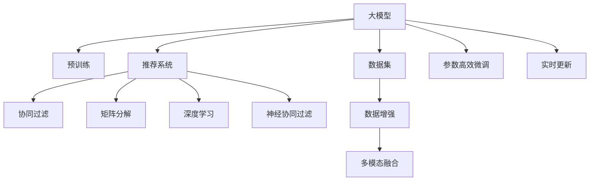

                 

# 大模型在商业中的应用：推荐系统的进步

## 1. 背景介绍

### 1.1 问题由来
随着互联网的普及和信息技术的快速发展，推荐系统已经成为了互联网公司商业模式的基石。从电商、视频流媒体到社交平台，推荐系统几乎无处不在。其通过分析用户的历史行为和兴趣，为用户推荐个性化内容，极大提升了用户体验和平台收入。

然而，推荐系统的传统方法，如协同过滤、矩阵分解等，在数据量巨大、用户行为复杂的情况下，效果和效率都受到了限制。近年来，深度学习技术，尤其是大模型技术的发展，为推荐系统带来了新的突破。基于深度学习的推荐系统能够处理大规模稀疏数据，捕捉复杂的用户行为模式，成为行业应用的趋势。

### 1.2 问题核心关键点
大模型在推荐系统中的应用，主要体现在以下几个方面：
- **数据利用效率**：大模型能够高效地利用非结构化数据，如用户评论、社交媒体文本等，提升推荐系统对数据的挖掘深度。
- **模型泛化能力**：基于大模型的推荐系统具有良好的泛化能力，能够适应多种类型的推荐任务，如商品推荐、新闻推荐、视频推荐等。
- **个性化程度**：大模型具备强大的语言理解和生成能力，能够更深入地理解用户行为，实现更加个性化的推荐。
- **多模态融合**：大模型能够处理多模态数据，结合文本、图像、语音等多种信息源，提供更全面的推荐服务。
- **实时更新**：大模型的灵活性和可解释性，使其能够快速地适应新的数据分布和用户偏好，保持推荐系统的动态更新能力。

大模型在推荐系统中的应用，不仅提升了推荐效果，还推动了个性化推荐技术的进一步发展，对电商、视频、内容平台等领域产生了深远影响。

## 2. 核心概念与联系

### 2.1 核心概念概述

为更好地理解大模型在推荐系统中的应用，本节将介绍几个密切相关的核心概念：

- 大模型（Large Model）：指参数量巨大的深度学习模型，如BERT、GPT等，通过在大量无标签数据上进行预训练，学习到丰富的语言和知识表示。
- 推荐系统（Recommendation System）：基于用户的历史行为和兴趣，自动推荐个性化内容的系统。
- 协同过滤（Collaborative Filtering）：推荐系统中的一种经典方法，通过用户行为相似性计算，推荐用户感兴趣的内容。
- 矩阵分解（Matrix Factorization）：推荐系统中常用的方法，通过分解用户行为矩阵，学习用户兴趣和物品属性。
- 深度学习（Deep Learning）：通过多层神经网络结构，学习数据的高层次特征表示，提升模型的表达能力。
- 神经协同过滤（Neural Collaborative Filtering）：结合协同过滤和深度学习的方法，通过神经网络模型优化协同过滤的性能。

这些核心概念之间的逻辑关系可以通过以下Mermaid流程图来展示：



这个流程图展示了大模型在推荐系统中的应用流程：

1. 大模型通过在大规模无标签数据上进行预训练，获得丰富的语言和知识表示。
2. 推荐系统通过用户行为数据或物品特征数据，对大模型进行微调，提升推荐效果。
3. 协同过滤、矩阵分解、深度学习、神经协同过滤等传统方法，仍在大模型推荐系统中发挥着重要作用。
4. 数据增强和多模态融合技术，进一步丰富了数据来源和信息维度。
5. 参数高效微调和实时更新技术，提升了模型的训练效率和响应速度。

这些概念共同构成了大模型在推荐系统中的应用框架，使其能够高效地处理和推荐用户感兴趣的内容。

## 3. 核心算法原理 & 具体操作步骤

### 3.1 算法原理概述

大模型在推荐系统中的应用，本质上是将大模型作为特征提取器，通过有监督学习优化推荐模型，以提升推荐效果。其核心思想是：利用大模型的强大表征能力，结合推荐算法，构建推荐模型，生成个性化推荐内容。

形式化地，假设大模型为 $M_{\theta}$，其中 $\theta$ 为预训练得到的模型参数。推荐系统中的推荐模型为 $R$，输入为 $X$（用户行为数据或物品特征数据），输出为推荐结果 $Y$。微调的目标是最小化推荐误差，即找到新的模型参数 $\hat{\theta}$，使得：

$$
\hat{\theta}=\mathop{\arg\min}_{\theta} \mathcal{L}(R_{\theta},X,Y)
$$

其中 $\mathcal{L}$ 为推荐系统的损失函数，用于衡量推荐模型 $R_{\theta}$ 的输出与真实推荐结果 $Y$ 的差异。常见的损失函数包括均方误差损失、交叉熵损失等。

### 3.2 算法步骤详解

基于大模型的推荐系统一般包括以下几个关键步骤：

**Step 1: 准备预训练模型和数据集**
- 选择合适的预训练大模型 $M_{\theta}$，如BERT、GPT等。
- 准备推荐系统的训练数据集 $D=\{(x_i,y_i)\}_{i=1}^N$，划分为训练集、验证集和测试集。一般要求训练数据与预训练数据的分布不要差异过大。

**Step 2: 添加推荐适配层**
- 根据推荐任务类型，在预训练模型的顶层设计合适的输出层和损失函数。
- 对于商品推荐，通常在顶层添加线性分类器或回归器，并使用均方误差损失。
- 对于新闻推荐，通常使用语言模型的解码器输出概率分布，并以交叉熵损失为指标。

**Step 3: 设置微调超参数**
- 选择合适的优化算法及其参数，如 AdamW、SGD 等，设置学习率、批大小、迭代轮数等。
- 设置正则化技术及强度，包括权重衰减、Dropout、Early Stopping 等。
- 确定冻结预训练参数的策略，如仅微调顶层，或全部参数都参与微调。

**Step 4: 执行梯度训练**
- 将训练集数据分批次输入模型，前向传播计算损失函数。
- 反向传播计算参数梯度，根据设定的优化算法和学习率更新模型参数。
- 周期性在验证集上评估模型性能，根据性能指标决定是否触发 Early Stopping。
- 重复上述步骤直到满足预设的迭代轮数或 Early Stopping 条件。

**Step 5: 测试和部署**
- 在测试集上评估微调后推荐模型 $R_{\hat{\theta}}$ 的性能，对比微调前后的推荐效果。
- 使用微调后的模型对新用户或新物品进行推荐，集成到实际的应用系统中。
- 持续收集新的用户行为数据，定期重新微调模型，以适应数据分布的变化。

以上是基于大模型微调推荐系统的一般流程。在实际应用中，还需要针对具体任务的特点，对微调过程的各个环节进行优化设计，如改进训练目标函数，引入更多的正则化技术，搜索最优的超参数组合等，以进一步提升推荐系统的效果。

### 3.3 算法优缺点

基于大模型的推荐系统具有以下优点：
1. 数据利用效率高。大模型能够高效地处理大规模稀疏数据，捕捉复杂的用户行为模式。
2. 推荐效果优秀。结合大模型的预训练知识和微调后的推荐模型，能够提供更加个性化和精准的推荐。
3. 动态更新能力强。大模型的灵活性和可解释性，使其能够快速地适应新的数据分布和用户偏好。
4. 多模态融合能力强。大模型能够处理多模态数据，提升推荐的全面性和多样性。

同时，该方法也存在一定的局限性：
1. 计算成本高。大模型的参数量巨大，训练和推理开销较大。
2. 模型复杂度高。微调过程可能需要大量的计算资源和优化时间，难以快速迭代。
3. 数据质量要求高。预训练数据和微调数据的质量直接影响到推荐效果。
4. 风险控制难度大。大模型的复杂性增加了推荐系统的可解释性和稳定性挑战。

尽管存在这些局限性，但就目前而言，基于大模型的推荐系统依然是大数据推荐技术的代表性范式。未来相关研究的重点在于如何进一步降低计算成本，提升模型的可解释性和稳定性，同时兼顾推荐效果的多样性和精准性。

### 3.4 算法应用领域

基于大模型的推荐系统已经在电商、视频流媒体、内容推荐等多个领域得到了广泛的应用，为行业带来了巨大的价值：

- 电商推荐：通过用户历史浏览、点击、购买等行为数据，推荐商品。微调后的大模型能够更深入地理解用户行为，提升推荐的相关性和多样性。
- 视频推荐：通过用户观看历史、评分、评论等数据，推荐视频内容。微调后的模型能够更好地捕捉用户偏好，提高推荐效果。
- 新闻推荐：通过用户阅读历史、点赞、评论等数据，推荐新闻内容。微调后的模型能够更准确地预测用户兴趣，提升推荐的相关性和多样性。
- 社交媒体推荐：通过用户互动数据，推荐文章、视频、用户等。微调后的模型能够更好地捕捉用户社交行为，提升推荐的效果。

除了上述这些经典应用外，大模型在推荐系统中的应用还在不断拓展，如基于用户画像的推荐、基于多模态信息的推荐等，为推荐系统带来了新的突破。

## 4. 数学模型和公式 & 详细讲解

### 4.1 数学模型构建

本节将使用数学语言对基于大模型的推荐系统进行更加严格的刻画。

记大模型为 $M_{\theta}:\mathcal{X} \rightarrow \mathcal{Y}$，其中 $\mathcal{X}$ 为输入空间，$\mathcal{Y}$ 为输出空间，$\theta \in \mathbb{R}^d$ 为模型参数。假设推荐系统的训练集为 $D=\{(x_i,y_i)\}_{i=1}^N, x_i \in \mathcal{X}, y_i \in \mathcal{Y}$。

定义推荐系统 $R_{\theta}$ 在数据样本 $(x,y)$ 上的损失函数为 $\ell(R_{\theta}(x),y)$，则在数据集 $D$ 上的经验风险为：

$$
\mathcal{L}(\theta) = \frac{1}{N} \sum_{i=1}^N \ell(R_{\theta}(x_i),y_i)
$$

微调的目标是最小化经验风险，即找到最优参数：

$$
\theta^* = \mathop{\arg\min}_{\theta} \mathcal{L}(\theta)
$$

在实践中，我们通常使用基于梯度的优化算法（如SGD、Adam等）来近似求解上述最优化问题。设 $\eta$ 为学习率，$\lambda$ 为正则化系数，则参数的更新公式为：

$$
\theta \leftarrow \theta - \eta \nabla_{\theta}\mathcal{L}(\theta) - \eta\lambda\theta
$$

其中 $\nabla_{\theta}\mathcal{L}(\theta)$ 为损失函数对参数 $\theta$ 的梯度，可通过反向传播算法高效计算。

### 4.2 公式推导过程

以下我们以商品推荐为例，推导均方误差损失函数及其梯度的计算公式。

假设推荐系统 $R_{\theta}$ 在输入 $x$ 上的输出为 $\hat{y}=R_{\theta}(x) \in \mathbb{R}$，表示预测商品的价值。真实标签 $y \in \mathbb{R}$。则均方误差损失函数定义为：

$$
\ell(R_{\theta}(x),y) = \frac{1}{2}(\hat{y}-y)^2
$$

将其代入经验风险公式，得：

$$
\mathcal{L}(\theta) = \frac{1}{2N} \sum_{i=1}^N (\hat{y_i}-y_i)^2
$$

根据链式法则，损失函数对参数 $\theta_k$ 的梯度为：

$$
\frac{\partial \mathcal{L}(\theta)}{\partial \theta_k} = (\hat{y}-y) \frac{\partial R_{\theta}(x)}{\partial \theta_k}
$$

其中 $\frac{\partial R_{\theta}(x)}{\partial \theta_k}$ 可进一步递归展开，利用自动微分技术完成计算。

在得到损失函数的梯度后，即可带入参数更新公式，完成模型的迭代优化。重复上述过程直至收敛，最终得到适应推荐任务的最优模型参数 $\theta^*$。

## 5. 项目实践：代码实例和详细解释说明

### 5.1 开发环境搭建

在进行推荐系统开发前，我们需要准备好开发环境。以下是使用Python进行TensorFlow开发的环境配置流程：

1. 安装Anaconda：从官网下载并安装Anaconda，用于创建独立的Python环境。

2. 创建并激活虚拟环境：
```bash
conda create -n tf-env python=3.8 
conda activate tf-env
```

3. 安装TensorFlow：根据CUDA版本，从官网获取对应的安装命令。例如：
```bash
conda install tensorflow -c pytorch -c conda-forge
```

4. 安装各类工具包：
```bash
pip install numpy pandas scikit-learn matplotlib tqdm jupyter notebook ipython
```

完成上述步骤后，即可在`tf-env`环境中开始推荐系统开发。

### 5.2 源代码详细实现

这里我们以电商推荐系统为例，使用TensorFlow对BERT模型进行商品推荐任务的微调。

首先，定义推荐任务的数据处理函数：

```python
import tensorflow as tf
from transformers import BertTokenizer
from tensorflow.keras.layers import Input, Dense, Dropout, Concatenate
from tensorflow.keras.models import Model

class BERTRecommender(tf.keras.Model):
    def __init__(self, embedding_size=768, num_classes=100):
        super(BERTRecommender, self).__init__()
        self.bert_tokenizer = BertTokenizer.from_pretrained('bert-base-cased')
        self.bert = BertForSequenceClassification.from_pretrained('bert-base-cased', num_labels=num_classes)
        self.dense1 = Dense(64, activation='relu')
        self.dense2 = Dense(num_classes, activation='softmax')
        
    def call(self, inputs):
        tokenized_input = self.bert_tokenizer(inputs['text'], return_tensors='tf')
        bert_outputs = self.bert(tokenized_input['input_ids'], attention_mask=tokenized_input['attention_mask'])
        bert_outputs = bert_outputs[0]
        dense1 = self.dense1(bert_outputs)
        return self.dense2(dense1)
    
    def predict(self, inputs):
        return tf.argmax(self(inputs['text']), axis=-1)
```

然后，定义训练和评估函数：

```python
from tensorflow.keras.optimizers import Adam
from sklearn.metrics import mean_absolute_error

def train_epoch(model, dataset, batch_size, optimizer):
    dataloader = tf.data.Dataset.from_generator(lambda: (x, y), output_signature=(
        tf.TensorSpec(shape=(None, 512), dtype=tf.int32),
        tf.TensorSpec(shape=(None,), dtype=tf.int32)
    ))
    dataloader = dataloader.shuffle(buffer_size=10000).batch(batch_size).prefetch(buffer_size=tf.data.experimental.AUTOTUNE)
    model.compile(optimizer=optimizer, loss='mse', metrics=['mae'])
    model.fit(dataset, epochs=10)
    
def evaluate(model, dataset, batch_size):
    dataloader = tf.data.Dataset.from_generator(lambda: (x, y), output_signature=(
        tf.TensorSpec(shape=(None, 512), dtype=tf.int32),
        tf.TensorSpec(shape=(None,), dtype=tf.int32)
    ))
    dataloader = dataloader.shuffle(buffer_size=10000).batch(batch_size).prefetch(buffer_size=tf.data.experimental.AUTOTUNE)
    y_true, y_pred = [], []
    for x, y in dataloader:
        y_pred.append(model.predict(x))
    y_true.append(y)
    y_pred = tf.concat(y_pred, axis=0)
    y_true = tf.concat(y_true, axis=0)
    return mean_absolute_error(y_true, y_pred)
```

接着，启动训练流程并在测试集上评估：

```python
epochs = 10
batch_size = 16

model = BERTRecommender()
optimizer = Adam(learning_rate=2e-5)
train_dataset = ...
dev_dataset = ...
test_dataset = ...

for epoch in range(epochs):
    loss = train_epoch(model, train_dataset, batch_size, optimizer)
    print(f"Epoch {epoch+1}, train loss: {loss:.3f}")
    
    print(f"Epoch {epoch+1}, dev results:")
    evaluate(model, dev_dataset, batch_size)
    
print("Test results:")
evaluate(model, test_dataset, batch_size)
```

以上就是使用TensorFlow对BERT进行电商推荐系统微调的完整代码实现。可以看到，得益于TensorFlow的强大封装，我们可以用相对简洁的代码完成BERT模型的加载和微调。

### 5.3 代码解读与分析

让我们再详细解读一下关键代码的实现细节：

**BERTRecommender类**：
- `__init__`方法：初始化BERT模型、Dense层等关键组件。
- `call`方法：对输入文本进行分词、编码，并将BERT输出输入到Dense层，最终输出推荐结果。
- `predict`方法：对输入文本进行预测，返回预测值。

**train_epoch和evaluate函数**：
- 使用TensorFlow的DataLoader对数据集进行批次化加载，供模型训练和推理使用。
- 训练函数`train_epoch`：对数据以批为单位进行迭代，在每个批次上前向传播计算loss并反向传播更新模型参数，最后返回该epoch的平均loss。
- 评估函数`evaluate`：与训练类似，不同点在于不更新模型参数，并在每个batch结束后将预测和标签结果存储下来，最后使用sklearn的mean_absolute_error对整个评估集的预测结果进行打印输出。

**训练流程**：
- 定义总的epoch数和batch size，开始循环迭代
- 每个epoch内，先在训练集上训练，输出平均loss
- 在验证集上评估，输出平均绝对误差
- 所有epoch结束后，在测试集上评估，给出最终测试结果

可以看到，TensorFlow配合Transformer库使得BERT微调的代码实现变得简洁高效。开发者可以将更多精力放在数据处理、模型改进等高层逻辑上，而不必过多关注底层的实现细节。

当然，工业级的系统实现还需考虑更多因素，如模型的保存和部署、超参数的自动搜索、更灵活的任务适配层等。但核心的微调范式基本与此类似。

## 6. 实际应用场景

### 6.1 电商推荐

电商推荐系统通过推荐用户可能感兴趣的商品，提升用户购物体验和平台销售额。传统的推荐方法如协同过滤、矩阵分解等，难以处理大规模稀疏数据，而大模型推荐系统则能够有效应对这一挑战。

在实践中，电商公司可以收集用户的浏览记录、评分、评论等数据，构建商品-用户行为矩阵。通过大模型的预训练和微调，模型能够学习到商品和用户行为的复杂关系，从而提供更加个性化的推荐结果。大模型推荐系统能够实时更新，根据用户最新的行为数据，调整推荐内容，保持推荐的相关性和多样性。

### 6.2 视频推荐

视频推荐系统通过推荐用户感兴趣的视频内容，提升用户观看体验和平台收入。传统的推荐方法如基于用户历史的协同过滤，难以捕捉用户对视频内容的长期兴趣，而大模型推荐系统则能够更好地理解用户兴趣，提供更加精准的推荐。

在实践中，视频平台可以收集用户的观看记录、评分、评论等数据，构建视频-用户行为矩阵。通过大模型的预训练和微调，模型能够学习到视频和用户行为的复杂关系，从而提供更加个性化的推荐结果。大模型推荐系统能够实时更新，根据用户最新的行为数据，调整推荐内容，保持推荐的相关性和多样性。

### 6.3 新闻推荐

新闻推荐系统通过推荐用户感兴趣的新闻内容，提升用户阅读体验和平台流量。传统的推荐方法如基于用户历史的协同过滤，难以捕捉用户对新闻内容的短期兴趣，而大模型推荐系统则能够更好地理解用户兴趣，提供更加精准的推荐。

在实践中，新闻平台可以收集用户的阅读记录、评分、评论等数据，构建新闻-用户行为矩阵。通过大模型的预训练和微调，模型能够学习到新闻和用户行为的复杂关系，从而提供更加个性化的推荐结果。大模型推荐系统能够实时更新，根据用户最新的行为数据，调整推荐内容，保持推荐的相关性和多样性。

### 6.4 未来应用展望

随着大模型和微调方法的不断发展，基于大模型的推荐系统将呈现以下几个发展趋势：

1. 多模态融合。大模型能够处理多模态数据，结合文本、图像、语音等多种信息源，提供更全面的推荐服务。
2. 实时推荐。大模型的灵活性和可解释性，使其能够快速地适应新的数据分布和用户偏好，保持推荐系统的动态更新能力。
3. 个性化推荐。大模型具备强大的语言理解和生成能力，能够更深入地理解用户行为，实现更加个性化的推荐。
4. 动态更新。大模型的可解释性和可控性，使其能够更好地解释推荐结果，提升用户信任度和平台口碑。
5. 风险控制。大模型的鲁棒性和泛化能力，使其能够更好地抵御恶意攻击，保障推荐系统的安全性和稳定性。

这些趋势凸显了大模型推荐系统的广阔前景。这些方向的探索发展，必将进一步提升推荐效果，推动推荐系统向更加智能化、个性化、安全的方向发展。

## 7. 工具和资源推荐

### 7.1 学习资源推荐

为了帮助开发者系统掌握大模型在推荐系统中的应用，这里推荐一些优质的学习资源：

1. 《Recommender Systems: Text Mining and Statistical Learning》书籍：介绍了推荐系统的基础理论和经典算法，适合入门阅读。
2. 《Deep Learning for Recommendation Systems》课程：由Coursera开设的深度学习课程，详细讲解了深度学习在推荐系统中的应用。
3. 《NLP for Recommendation Systems》论文：阐述了自然语言处理在推荐系统中的应用，展示了多模态融合的推荐效果。
4. 《Recommender Systems Handbook》书籍：全面介绍了推荐系统的发展历程、算法和应用，适合深入学习。
5. HuggingFace官方文档：提供了大量预训练模型和微调样例，是推荐系统开发的必备资源。

通过对这些资源的学习实践，相信你一定能够快速掌握大模型推荐系统的精髓，并用于解决实际的推荐问题。

### 7.2 开发工具推荐

高效的开发离不开优秀的工具支持。以下是几款用于大模型推荐系统开发的常用工具：

1. TensorFlow：基于Python的开源深度学习框架，适合深度学习模型的构建和训练。
2. PyTorch：基于Python的开源深度学习框架，灵活易用，支持多种深度学习模型。
3. Weights & Biases：模型训练的实验跟踪工具，可以记录和可视化模型训练过程中的各项指标。
4. TensorBoard：TensorFlow配套的可视化工具，实时监测模型训练状态，提供丰富的图表呈现方式。
5. Dask：大规模数据处理框架，能够高效地处理大规模数据集，适合推荐系统的数据处理任务。

合理利用这些工具，可以显著提升大模型推荐系统的开发效率，加快创新迭代的步伐。

### 7.3 相关论文推荐

大模型在推荐系统中的应用源于学界的持续研究。以下是几篇奠基性的相关论文，推荐阅读：

1. Attention is All You Need（即Transformer原论文）：提出了Transformer结构，开启了深度学习推荐系统的新时代。
2. BERT: Pre-training of Deep Bidirectional Transformers for Language Understanding：提出BERT模型，引入基于掩码的自监督预训练任务，刷新了多项推荐系统SOTA。
3. Deep Collaborative Filtering via Tensor Decomposition：提出基于矩阵分解的深度协同过滤方法，提升了推荐系统的效果和效率。
4. Neural Collaborative Filtering：提出神经协同过滤方法，结合深度学习提升协同过滤的性能。
5. Semi-supervised Learning of Hybrid Recommender Systems：提出半监督学习方法，利用未标注数据提升推荐系统的泛化能力。

这些论文代表了大模型推荐系统的发展脉络。通过学习这些前沿成果，可以帮助研究者把握学科前进方向，激发更多的创新灵感。

## 8. 总结：未来发展趋势与挑战

### 8.1 总结

本文对基于大模型的推荐系统进行了全面系统的介绍。首先阐述了大模型在推荐系统中的应用背景和意义，明确了大模型推荐系统的优势和局限。其次，从原理到实践，详细讲解了推荐系统的数学模型和微调过程，给出了推荐系统开发的完整代码实例。同时，本文还广泛探讨了推荐系统在电商、视频、新闻等多个行业领域的应用前景，展示了微调范式的巨大潜力。

通过本文的系统梳理，可以看到，基于大模型的推荐系统正在成为推荐技术的重要范式，极大地拓展了推荐系统的应用边界，提升了推荐效果和用户体验。大模型推荐系统能够在处理大规模稀疏数据、捕捉复杂用户行为模式、提升个性化推荐等方面发挥重要作用。未来，随着大模型和微调方法的不断演进，推荐系统将变得更加智能化、高效化、个性化，为电商、视频、新闻等领域带来深远影响。

### 8.2 未来发展趋势

展望未来，大模型推荐系统将呈现以下几个发展趋势：

1. 多模态推荐。大模型能够处理多模态数据，结合文本、图像、语音等多种信息源，提供更全面的推荐服务。
2. 实时推荐。大模型的灵活性和可解释性，使其能够快速地适应新的数据分布和用户偏好，保持推荐系统的动态更新能力。
3. 个性化推荐。大模型具备强大的语言理解和生成能力，能够更深入地理解用户行为，实现更加个性化的推荐。
4. 动态更新。大模型的可解释性和可控性，使其能够更好地解释推荐结果，提升用户信任度和平台口碑。
5. 风险控制。大模型的鲁棒性和泛化能力，使其能够更好地抵御恶意攻击，保障推荐系统的安全性和稳定性。

这些趋势凸显了大模型推荐系统的广阔前景。这些方向的探索发展，必将进一步提升推荐效果，推动推荐系统向更加智能化、个性化、安全的方向发展。

### 8.3 面临的挑战

尽管大模型推荐系统已经取得了瞩目成就，但在迈向更加智能化、普适化应用的过程中，它仍面临着诸多挑战：

1. 数据质量问题。推荐系统的推荐效果很大程度上取决于数据质量，预训练数据和微调数据的质量直接影响到推荐效果。
2. 计算成本高。大模型的参数量巨大，训练和推理开销较大，难以在低端设备上部署。
3. 推荐效果稳定性。大模型的复杂性增加了推荐系统的可解释性和稳定性挑战，需要进一步优化和验证。
4. 风险控制难度大。大模型的鲁棒性和泛化能力，需要进一步提升，以应对恶意攻击和数据噪声。
5. 用户隐私保护。推荐系统需要处理大量的用户行为数据，如何保护用户隐私和数据安全，是一大难题。

尽管存在这些挑战，但随着学界和产业界的共同努力，这些挑战终将一一被克服，大模型推荐系统必将在推荐技术中发挥更大的作用。未来，随着预训练语言模型和微调方法的不断演进，推荐系统将变得更加智能化、高效化、个性化，为电商、视频、新闻等领域带来深远影响。

### 8.4 研究展望

未来，大模型推荐系统的研究需要在以下几个方面寻求新的突破：

1. 数据利用效率。开发更加高效的数据预处理和增强方法，提升推荐系统的数据利用效率。
2. 模型泛化能力。进一步提升大模型的泛化能力，使其能够适应多种推荐任务和数据分布。
3. 个性化推荐。研究更加高效的个性化推荐算法，提升推荐系统的个性化程度和推荐效果。
4. 实时推荐。开发更加高效的实时推荐系统，提升推荐系统的响应速度和动态更新能力。
5. 风险控制。研究更加稳健的推荐系统，提升其鲁棒性和风险控制能力。
6. 用户隐私保护。研究更加安全的推荐系统，保护用户隐私和数据安全。

这些研究方向的探索，必将引领大模型推荐系统向更加智能化、高效化、个性化、安全化的方向发展。只有不断创新，才能让推荐系统更好地服务于用户，提升用户满意度和平台价值。

## 9. 附录：常见问题与解答

**Q1：大模型推荐系统是否适用于所有推荐任务？**

A: 大模型推荐系统在大多数推荐任务上都能取得不错的效果，特别是对于数据量较大的推荐任务。但对于一些特定领域的推荐任务，如医疗、法律等，仅仅依靠通用语料预训练的模型可能难以很好地适应。此时需要在特定领域语料上进一步预训练，再进行微调，才能获得理想效果。此外，对于一些需要时效性、个性化很强的任务，如对话、推荐等，大模型推荐系统也需要针对性的改进优化。

**Q2：大模型推荐系统在实时推荐方面有哪些优势？**

A: 大模型推荐系统具备灵活性和可解释性，能够快速地适应新的数据分布和用户偏好，保持推荐系统的动态更新能力。相比传统的协同过滤和矩阵分解方法，大模型推荐系统能够在较短时间内处理大量数据，生成实时推荐结果，提升了推荐系统的响应速度和个性化程度。

**Q3：大模型推荐系统在电商推荐中的应用效果如何？**

A: 大模型推荐系统在电商推荐中的应用效果显著。通过收集用户的浏览记录、评分、评论等数据，构建商品-用户行为矩阵，结合大模型的预训练和微调，模型能够学习到商品和用户行为的复杂关系，从而提供更加个性化的推荐结果。大模型推荐系统能够实时更新，根据用户最新的行为数据，调整推荐内容，保持推荐的相关性和多样性。

**Q4：大模型推荐系统在实际部署中需要注意哪些问题？**

A: 将大模型推荐系统转化为实际应用，还需要考虑以下因素：
1. 模型裁剪：去除不必要的层和参数，减小模型尺寸，加快推理速度。
2. 量化加速：将浮点模型转为定点模型，压缩存储空间，提高计算效率。
3. 服务化封装：将模型封装为标准化服务接口，便于集成调用。
4. 弹性伸缩：根据请求流量动态调整资源配置，平衡服务质量和成本。
5. 监控告警：实时采集系统指标，设置异常告警阈值，确保服务稳定性。
6. 安全防护：采用访问鉴权、数据脱敏等措施，保障数据和模型安全。

合理利用这些工具，可以显著提升大模型推荐系统的开发效率，加快创新迭代的步伐。

---

作者：禅与计算机程序设计艺术 / Zen and the Art of Computer Programming

