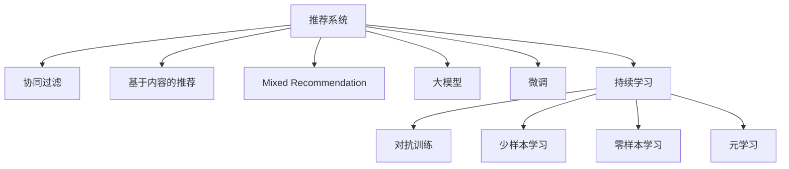

                 

# 大模型在商业：推荐系统进步

## 1. 背景介绍

推荐系统在商业世界中的应用无处不在，从电商平台、社交平台到新闻网站，推荐算法已经成为提升用户体验、增加用户黏性和促成交易的重要手段。然而，传统推荐算法基于单一特征，在数据量增大、维度提升、用户行为复杂化等情况下，表现不佳。近年来，随着大模型技术的发展，基于深度学习、自然语言处理和大规模语料预训练的推荐系统，展现了前所未有的性能提升和应用潜力。

## 2. 核心概念与联系

### 2.1 核心概念概述

本节将介绍几个关键的推荐系统概念：

- **推荐系统(Recommender System)**：通过分析用户行为和物品属性，自动为用户推荐感兴趣的商品、内容或服务的技术体系。
- **协同过滤(Collaborative Filtering)**：基于用户之间、物品之间的相似性，预测用户对物品的兴趣或物品的受欢迎程度，是推荐系统的基本方法之一。
- **基于内容的推荐(Content-based Recommendation)**：根据物品的属性特征与用户兴趣点进行推荐，适合于新闻、音乐等用户行为与物品属性相关性较高的场景。
- **混合推荐(Mixed Recommendation)**：将多种推荐算法结合，取长补短，提升推荐系统的整体性能。
- **大模型(Pre-trained Models)**：通过在大规模无标签文本数据上进行自监督预训练，学习到强大的语言表征，具备理解复杂文本和上下文的能力。
- **微调(Fine-tuning)**：在预训练模型的基础上，使用下游推荐任务的少量标注数据，通过有监督学习优化模型在特定推荐任务上的性能。
- **持续学习(Continual Learning)**：使推荐模型能够不断学习新知识，同时保持已学习的知识，以适应数据分布的变化。
- **对抗训练(Adversarial Training)**：在训练过程中，引入对抗样本，提高模型鲁棒性。
- **少样本学习(Few-shot Learning)**：在只有少量标注样本的情况下，模型能够快速适应新任务。
- **零样本学习(Zero-shot Learning)**：模型在没有见过任何特定任务的训练样本的情况下，仅凭任务描述就能够执行新任务。
- **元学习(Meta-learning)**：通过学习如何学习，提升模型的泛化能力和适应性。

这些核心概念之间的逻辑关系可以通过以下Mermaid流程图来展示：



这个流程图展示了大模型在推荐系统中的核心概念及其之间的关系：

1. 推荐系统通过协同过滤、基于内容等多种方法构建推荐策略。
2. 大模型通过大规模语料预训练获得语言表示，用于提升推荐模型的理解和生成能力。
3. 微调利用少量标注数据，优化模型在特定推荐任务上的性能。
4. 持续学习使模型能够适应不断变化的用户行为和市场环境。
5. 对抗训练、少样本学习、零样本学习等技术手段进一步增强模型的鲁棒性和泛化能力。
6. 元学习提升模型的学习效率和适应性，支持更广泛的推荐场景。

这些概念共同构成了现代推荐系统的发展框架，使得基于大模型的推荐技术不断突破传统限制，展现出更强的应用潜力。

## 3. 核心算法原理 & 具体操作步骤

### 3.1 算法原理概述

基于大模型的推荐系统，本质上是一种深度学习驱动的推荐方法。其核心思想是：将大模型作为推荐引擎的核心组件，利用预训练语言模型在文本数据上的强大表示能力，提升推荐系统对用户行为和物品属性的理解深度。在此基础上，使用少量标注数据进行微调，优化模型在特定推荐任务上的性能。

具体来说，假设预训练语言模型为 $M_{\theta}$，其中 $\theta$ 为预训练得到的模型参数。给定推荐任务 $T$ 的标注数据集 $D=\{(x_i, y_i)\}_{i=1}^N$，推荐系统的目标是通过微调得到新的模型参数 $\hat{\theta}$，使得模型输出 $M_{\hat{\theta}}(x)$ 与推荐任务 $T$ 的标注结果 $y_i$ 尽可能一致，即：

$$
\hat{\theta}=\mathop{\arg\min}_{\theta} \mathcal{L}(M_{\theta},D)
$$

其中 $\mathcal{L}$ 为针对推荐任务 $T$ 设计的损失函数，用于衡量模型预测输出与推荐标签之间的差异。常见的损失函数包括交叉熵损失、均方误差损失等。

通过梯度下降等优化算法，微调过程不断更新模型参数 $\theta$，最小化损失函数 $\mathcal{L}$，使得模型输出逼近推荐任务标签。由于 $\theta$ 已经通过预训练获得了较强的语言表示能力，因此即便在推荐任务数据集规模较小的情况下，也能较快收敛到理想的模型参数 $\hat{\theta}$。

### 3.2 算法步骤详解

基于大模型的推荐系统一般包括以下几个关键步骤：

**Step 1: 准备预训练模型和数据集**
- 选择合适的预训练语言模型 $M_{\theta}$ 作为初始化参数，如 BERT、GPT 等。
- 准备推荐任务 $T$ 的标注数据集 $D$，划分为训练集、验证集和测试集。一般要求标注数据与预训练数据的分布不要差异过大。

**Step 2: 添加推荐适配层**
- 根据推荐任务类型，在预训练模型顶层设计合适的输出层和损失函数。
- 对于推荐任务，通常使用交叉熵损失函数，将模型输出与推荐标签对比，计算损失。
- 对于排序任务，则使用均方误差损失函数，将模型输出与推荐标签之间的绝对误差作为损失。

**Step 3: 设置微调超参数**
- 选择合适的优化算法及其参数，如 AdamW、SGD 等，设置学习率、批大小、迭代轮数等。
- 设置正则化技术及强度，包括权重衰减、Dropout、Early Stopping等。
- 确定冻结预训练参数的策略，如仅微调顶层，或全部参数都参与微调。

**Step 4: 执行梯度训练**
- 将训练集数据分批次输入模型，前向传播计算损失函数。
- 反向传播计算参数梯度，根据设定的优化算法和学习率更新模型参数。
- 周期性在验证集上评估模型性能，根据性能指标决定是否触发 Early Stopping。
- 重复上述步骤直到满足预设的迭代轮数或 Early Stopping 条件。

**Step 5: 测试和部署**
- 在测试集上评估微调后模型 $M_{\hat{\theta}}$ 的性能，对比微调前后的精度提升。
- 使用微调后的模型对新样本进行推理预测，集成到实际的应用系统中。
- 持续收集新的数据，定期重新微调模型，以适应数据分布的变化。

以上是基于大模型微调推荐系统的典型流程。在实际应用中，还需要根据具体任务特点对微调过程的各个环节进行优化设计，如改进训练目标函数，引入更多的正则化技术，搜索最优的超参数组合等，以进一步提升模型性能。

### 3.3 算法优缺点

基于大模型的推荐系统具有以下优点：
1. 语言表示能力强。大模型通过大规模语料预训练，具备强大的语言理解和生成能力，能够更好地理解用户行为和物品属性。
2. 可解释性好。大模型的训练过程和输出结果具有可解释性，能够提供更准确的推荐理由。
3. 性能提升明显。相比于传统推荐算法，基于大模型的推荐系统在多个推荐任务上取得了显著的精度提升。
4. 可扩展性强。大模型能够支持多种推荐任务，包括个性化推荐、广告推荐、搜索结果排序等。
5. 数据驱动。大模型能够自动学习用户行为和物品属性之间的关系，减少人工特征工程的工作量。

但该方法也存在一些局限性：
1. 计算资源消耗大。大模型参数量庞大，训练和推理速度较慢，对计算资源需求较高。
2. 依赖标注数据。微调性能受标注数据质量和数量的影响较大，获取高质量标注数据的成本较高。
3. 过拟合风险高。由于模型复杂度高，容易出现过拟合问题，尤其是在标注数据不足的情况下。
4. 模型解释性不足。大模型的输出往往难以解释，难以对其内部工作机制进行调试和优化。

尽管存在这些局限性，但大模型推荐系统在推荐质量、用户体验和自动化程度等方面展现了显著优势，已经成为现代推荐系统的重要发展方向。

### 3.4 算法应用领域

基于大模型的推荐系统已经在多个领域得到应用，例如：

- 电子商务：利用大模型推荐引擎，提升商品推荐、广告推荐、促销活动推荐等业务效果，增加用户转化率和复购率。
- 内容推荐：为新闻网站、视频平台、音乐平台等提供个性化内容推荐，提升用户粘性和满意度。
- 金融产品推荐：通过大模型推荐系统，为金融产品销售提供个性化推荐，提高转化率和盈利能力。
- 社交媒体：在微博、微信等社交平台上，利用大模型推荐系统为用户推荐可能感兴趣的内容、用户或群组。
- 旅游出行：为旅游平台提供个性化推荐，提升用户预订体验和转化率。

除了上述这些经典应用外，大模型推荐系统还被创新性地应用到更多场景中，如医疗健康、房产交易、健康饮食等，为各行各业带来新的增长点。

## 4. 数学模型和公式 & 详细讲解

### 4.1 数学模型构建

本节将使用数学语言对基于大模型的推荐系统进行更加严格的刻画。

记推荐任务的数据集为 $D=\{(x_i,y_i)\}_{i=1}^N, x_i \in \mathcal{X}, y_i \in \mathcal{Y}$，其中 $x_i$ 为推荐输入，$y_i$ 为推荐标签。假设预训练语言模型为 $M_{\theta}$，其中 $\theta$ 为预训练得到的模型参数。

定义模型 $M_{\theta}$ 在输入 $x$ 上的推荐输出为 $\hat{y}=M_{\theta}(x) \in [0,1]$，表示物品被用户点击的概率。推荐损失函数为 $\ell(y_i,\hat{y})$，例如交叉熵损失：

$$
\ell(y_i,\hat{y}) = -y_i\log \hat{y} - (1-y_i)\log(1-\hat{y})
$$

在数据集 $D$ 上的经验风险为：

$$
\mathcal{L}(\theta) = \frac{1}{N}\sum_{i=1}^N \ell(y_i,\hat{y}_i)
$$

微调的优化目标是最小化经验风险，即找到最优参数：

$$
\theta^* = \mathop{\arg\min}_{\theta} \mathcal{L}(\theta)
$$

在实践中，我们通常使用基于梯度的优化算法（如SGD、Adam等）来近似求解上述最优化问题。设 $\eta$ 为学习率，$\lambda$ 为正则化系数，则参数的更新公式为：

$$
\theta \leftarrow \theta - \eta \nabla_{\theta}\mathcal{L}(\theta) - \eta\lambda\theta
$$

其中 $\nabla_{\theta}\mathcal{L}(\theta)$ 为损失函数对参数 $\theta$ 的梯度，可通过反向传播算法高效计算。

### 4.2 公式推导过程

以下我们以二分类推荐任务为例，推导交叉熵损失函数及其梯度的计算公式。

假设模型 $M_{\theta}$ 在输入 $x$ 上的推荐输出为 $\hat{y}=M_{\theta}(x) \in [0,1]$，表示物品被用户点击的概率。真实标签 $y \in \{0,1\}$。则二分类交叉熵损失函数定义为：

$$
\ell(y_i,\hat{y}) = -[y_i\log \hat{y} + (1-y_i)\log (1-\hat{y})]
$$

将其代入经验风险公式，得：

$$
\mathcal{L}(\theta) = -\frac{1}{N}\sum_{i=1}^N [y_i\log \hat{y}_i+(1-y_i)\log(1-\hat{y}_i)]
$$

根据链式法则，损失函数对参数 $\theta_k$ 的梯度为：

$$
\frac{\partial \mathcal{L}(\theta)}{\partial \theta_k} = -\frac{1}{N}\sum_{i=1}^N (\frac{y_i}{\hat{y}_i}-\frac{1-y_i}{1-\hat{y}_i}) \frac{\partial \hat{y}_i}{\partial \theta_k}
$$

其中 $\frac{\partial \hat{y}_i}{\partial \theta_k}$ 可进一步递归展开，利用自动微分技术完成计算。

在得到损失函数的梯度后，即可带入参数更新公式，完成模型的迭代优化。重复上述过程直至收敛，最终得到适应推荐任务的最优模型参数 $\theta^*$。

## 5. 项目实践：代码实例和详细解释说明

### 5.1 开发环境搭建

在进行推荐系统开发前，我们需要准备好开发环境。以下是使用Python进行PyTorch开发的环境配置流程：

1. 安装Anaconda：从官网下载并安装Anaconda，用于创建独立的Python环境。

2. 创建并激活虚拟环境：
```bash
conda create -n pytorch-env python=3.8 
conda activate pytorch-env
```

3. 安装PyTorch：根据CUDA版本，从官网获取对应的安装命令。例如：
```bash
conda install pytorch torchvision torchaudio cudatoolkit=11.1 -c pytorch -c conda-forge
```

4. 安装相关库：
```bash
pip install torchtext transformers scikit-learn pandas
```

5. 安装PyTorch Lightning：用于高效管理训练过程和部署模型。
```bash
pip install pytorch-lightning
```

完成上述步骤后，即可在`pytorch-env`环境中开始推荐系统开发。

### 5.2 源代码详细实现

下面我们以电商商品推荐系统为例，给出使用PyTorch和Transformers库对BERT模型进行推荐系统微调的代码实现。

首先，定义推荐数据集：

```python
from torchtext.data import Field, TabularDataset
import torch
from transformers import BertTokenizer

# 定义输入和目标字段
TEXT = Field(tokenize='spacy', lower=True)
LABEL = Field(sequential=False, use_vocab=False, tokenize=None)

# 加载数据集
train_data, test_data = TabularDataset.splits(path='./data', format='csv', train='train.csv', test='test.csv')
train_data = train_data.set_fields(text=TEXT, label=LABEL)
test_data = test_data.set_fields(text=TEXT, label=LABEL)

# 定义分词器和特征提取器
tokenizer = BertTokenizer.from_pretrained('bert-base-cased')
```

然后，定义模型和优化器：

```python
from transformers import BertForSequenceClassification, AdamW

# 加载预训练BERT模型
model = BertForSequenceClassification.from_pretrained('bert-base-cased', num_labels=2)

# 定义优化器
optimizer = AdamW(model.parameters(), lr=2e-5)
```

接着，定义训练和评估函数：

```python
from torch.utils.data import DataLoader
from tqdm import tqdm

# 定义训练函数
def train_epoch(model, train_data, optimizer):
    dataloader = DataLoader(train_data, batch_size=32, shuffle=True)
    model.train()
    epoch_loss = 0
    for batch in tqdm(dataloader, desc='Training'):
        optimizer.zero_grad()
        text, label = batch.text, batch.label
        input_ids = tokenizer(text, padding='max_length', max_length=128, return_tensors='pt')['input_ids']
        attention_mask = tokenizer(text, padding='max_length', max_length=128, return_tensors='pt')['attention_mask']
        output = model(input_ids=input_ids, attention_mask=attention_mask)
        loss = output.loss
        epoch_loss += loss.item()
        loss.backward()
        optimizer.step()
    return epoch_loss / len(dataloader)

# 定义评估函数
def evaluate(model, test_data):
    dataloader = DataLoader(test_data, batch_size=32)
    model.eval()
    predictions = []
    targets = []
    with torch.no_grad():
        for batch in tqdm(dataloader, desc='Evaluating'):
            text, label = batch.text, batch.label
            input_ids = tokenizer(text, padding='max_length', max_length=128, return_tensors='pt')['input_ids']
            attention_mask = tokenizer(text, padding='max_length', max_length=128, return_tensors='pt')['attention_mask']
            output = model(input_ids=input_ids, attention_mask=attention_mask)
            predictions.append(output.logits.argmax(dim=1).cpu().numpy())
            targets.append(label.cpu().numpy())
    print(classification_report(targets, predictions))
```

最后，启动训练流程并在测试集上评估：

```python
epochs = 5
batch_size = 32

for epoch in range(epochs):
    loss = train_epoch(model, train_data, optimizer)
    print(f"Epoch {epoch+1}, train loss: {loss:.3f}")
    
    print(f"Epoch {epoch+1}, test results:")
    evaluate(model, test_data)
    
print("All epochs finished.")
```

以上就是使用PyTorch和Transformers库对BERT模型进行电商推荐系统微调的完整代码实现。可以看到，得益于Transformers库的强大封装，我们可以用相对简洁的代码完成BERT模型的加载和微调。

### 5.3 代码解读与分析

让我们再详细解读一下关键代码的实现细节：

**推荐数据集定义**：
- 定义文本和标签字段，并进行分词和转换。
- 使用TabularDataset加载CSV格式的数据集，并设置输入和标签字段。

**模型和优化器定义**：
- 使用BertForSequenceClassification从预训练BERT模型中加载模型。
- 定义AdamW优化器，设置学习率为2e-5。

**训练和评估函数**：
- 使用DataLoader对数据集进行批次化加载，供模型训练和推理使用。
- 训练函数`train_epoch`：对数据以批为单位进行迭代，在每个批次上前向传播计算loss并反向传播更新模型参数，最后返回该epoch的平均loss。
- 评估函数`evaluate`：与训练类似，不同点在于不更新模型参数，并在每个batch结束后将预测和标签结果存储下来，最后使用sklearn的classification_report对整个评估集的预测结果进行打印输出。

**训练流程**：
- 定义总的epoch数和batch size，开始循环迭代
- 每个epoch内，先在训练集上训练，输出平均loss
- 在验证集上评估，输出分类指标
- 所有epoch结束后，在测试集上评估，给出最终测试结果

可以看到，PyTorch配合Transformers库使得BERT微调的代码实现变得简洁高效。开发者可以将更多精力放在数据处理、模型改进等高层逻辑上，而不必过多关注底层的实现细节。

当然，工业级的系统实现还需考虑更多因素，如模型的保存和部署、超参数的自动搜索、更灵活的任务适配层等。但核心的微调范式基本与此类似。

## 6. 实际应用场景
### 6.1 电商推荐

电商推荐系统是推荐系统应用最广泛的领域之一。传统电商推荐基于用户的浏览、购买历史等行为数据，使用协同过滤算法为用户推荐相关商品。然而，协同过滤算法对数据稀疏性敏感，难以处理用户行为复杂多变的情况。

基于大模型的电商推荐系统则不同，其核心思想是利用预训练语言模型理解用户行为和物品属性，提升推荐精度。具体来说，可以收集用户浏览、搜索、评价等行为数据，将这些行为数据转换为推荐输入，通过微调语言模型，得到用户对物品的评分或点击概率，最后利用评分排序算法，为用户推荐最可能感兴趣的物品。

在技术实现上，可以构建一个统一的输入空间，将用户行为数据和物品属性数据整合成结构化数据，使用Transformer模型进行微调。微调后的模型能够自动学习用户和物品之间的相似性，生成精准的推荐结果。

### 6.2 新闻推荐

新闻推荐系统为用户提供个性化内容推荐，提升用户的阅读体验和平台粘性。传统新闻推荐基于用户的点击历史，使用协同过滤算法推荐相关新闻。但协同过滤算法对用户行为数据依赖较大，难以应对大规模用户和新闻推荐需求。

基于大模型的新闻推荐系统则可以利用语言模型理解新闻文本和用户行为，提供更加多样化和高质量的推荐。具体来说，可以收集用户浏览、点击、评论等行为数据，提取新闻标题、摘要、关键词等文本内容，将这些数据整合成推荐输入，通过微调语言模型，得到用户对新闻的兴趣评分，最后利用评分排序算法，为用户推荐最可能感兴趣的新闻。

在技术实现上，可以使用BERT等大模型进行微调，得到一个能够理解新闻文本和用户行为的推荐引擎。微调后的模型能够从语言模型中学习新闻的语义信息，提供更加个性化的推荐结果。

### 6.3 广告推荐

广告推荐系统是互联网广告业务的重要组成部分，帮助广告主精准投放广告，提高广告点击率和转化率。传统广告推荐系统基于用户的历史点击行为，使用协同过滤算法推荐相关广告。但协同过滤算法对数据稀疏性敏感，难以应对大规模用户和广告推荐需求。

基于大模型的广告推荐系统则可以利用语言模型理解广告文本和用户行为，提供更加精准和高效的广告推荐。具体来说，可以收集用户的历史点击行为，将广告文本和用户行为数据整合成推荐输入，通过微调语言模型，得到用户对广告的兴趣评分，最后利用评分排序算法，为用户推荐最可能点击的广告。

在技术实现上，可以使用BERT等大模型进行微调，得到一个能够理解广告文本和用户行为的推荐引擎。微调后的模型能够从语言模型中学习广告的语义信息，提供更加个性化的推荐结果。

### 6.4 未来应用展望

随着大模型和微调技术的不断发展，基于大模型的推荐系统将在更多领域得到应用，为各行各业带来变革性影响。

在智慧医疗领域，利用大模型推荐系统，可以为患者推荐最合适的诊疗方案和治疗建议，提高医疗服务的质量和效率。

在智能教育领域，基于大模型的推荐系统可以为用户推荐最合适的学习资源和课程，促进个性化教育的发展。

在智慧城市治理中，利用大模型推荐系统，可以为城市管理者推荐最优的交通路线和公共服务，提高城市管理的智能化水平。

此外，在金融理财、健康饮食、旅游出行等众多领域，基于大模型的推荐系统也将不断涌现，为经济社会发展注入新的动力。相信随着技术的日益成熟，推荐系统必将在更广泛的领域大放异彩，为人类认知智能的进化带来深远影响。

## 7. 工具和资源推荐
### 7.1 学习资源推荐

为了帮助开发者系统掌握大模型推荐系统的理论基础和实践技巧，这里推荐一些优质的学习资源：

1. 《深度学习与自然语言处理》系列博文：由大模型技术专家撰写，深入浅出地介绍了深度学习在自然语言处理中的各种应用。

2. 《Transformer from Scratch》书籍：Transformer模型的源码解读和实现，适合有一定深度学习基础的读者。

3. 《Deep Learning for NLP》课程：斯坦福大学开设的NLP深度学习课程，涵盖NLP中的经典任务和算法。

4. 《Python for Data Analysis》书籍：Python数据分析的经典教材，适合学习Python和数据处理。

5. PyTorch官方文档：PyTorch框架的官方文档，包含丰富的教程和样例，适合快速上手。

6. HuggingFace官方文档：Transformers库的官方文档，提供海量预训练模型和微调样例，适合系统学习和实践。

通过对这些资源的学习实践，相信你一定能够快速掌握大模型推荐系统的精髓，并用于解决实际的推荐问题。

### 7.2 开发工具推荐

高效的开发离不开优秀的工具支持。以下是几款用于大模型推荐系统开发的常用工具：

1. PyTorch：基于Python的开源深度学习框架，灵活动态的计算图，适合快速迭代研究。

2. TensorFlow：由Google主导开发的开源深度学习框架，生产部署方便，适合大规模工程应用。

3. PyTorch Lightning：PyTorch的封装库，简化模型训练和部署过程。

4. HuggingFace Transformers：NLP工具库，集成了众多预训练模型，支持多种深度学习框架。

5. TensorBoard：TensorFlow配套的可视化工具，可实时监测模型训练状态，并提供丰富的图表呈现方式。

6. Weights & Biases：模型训练的实验跟踪工具，可以记录和可视化模型训练过程中的各项指标。

合理利用这些工具，可以显著提升大模型推荐系统的开发效率，加快创新迭代的步伐。

### 7.3 相关论文推荐

大模型和推荐系统的发展源于学界的持续研究。以下是几篇奠基性的相关论文，推荐阅读：

1. Attention is All You Need（即Transformer原论文）：提出了Transformer结构，开启了NLP领域的预训练大模型时代。

2. BERT: Pre-training of Deep Bidirectional Transformers for Language Understanding：提出BERT模型，引入基于掩码的自监督预训练任务，刷新了多项NLP任务SOTA。

3. Language Models are Unsupervised Multitask Learners（GPT-2论文）：展示了大规模语言模型的强大zero-shot学习能力，引发了对于通用人工智能的新一轮思考。

4. Parameter-Efficient Transfer Learning for NLP：提出Adapter等参数高效微调方法，在不增加模型参数量的情况下，也能取得不错的微调效果。

5. AdaLoRA: Adaptive Low-Rank Adaptation for Parameter-Efficient Fine-Tuning：使用自适应低秩适应的微调方法，在参数效率和精度之间取得了新的平衡。

这些论文代表了大模型和推荐系统的发展脉络。通过学习这些前沿成果，可以帮助研究者把握学科前进方向，激发更多的创新灵感。

## 8. 总结：未来发展趋势与挑战

### 8.1 总结

本文对基于大模型的推荐系统进行了全面系统的介绍。首先阐述了大模型和推荐系统的研究背景和意义，明确了大模型推荐系统在推荐质量、用户体验和自动化程度等方面展现了显著优势，已经成为现代推荐系统的重要发展方向。其次，从原理到实践，详细讲解了大模型推荐系统的数学原理和关键步骤，给出了推荐系统开发的完整代码实例。同时，本文还广泛探讨了大模型推荐系统在电商、新闻、广告等众多领域的应用前景，展示了推荐系统范式的巨大潜力。此外，本文精选了大模型推荐系统的各类学习资源，力求为读者提供全方位的技术指引。

通过本文的系统梳理，可以看到，基于大模型的推荐系统正在成为推荐系统的重要范式，极大地拓展了推荐算法的应用边界，催生了更多的落地场景。受益于大规模语料的预训练和深度学习的能力，推荐系统在推荐质量和用户体验上取得了显著的进步，大大提升了用户满意度和平台黏性。未来，伴随大模型和微调方法的持续演进，基于大模型的推荐系统必将在更多领域得到应用，为人类认知智能的进化带来深远影响。

### 8.2 未来发展趋势

展望未来，大模型推荐系统将呈现以下几个发展趋势：

1. 模型规模持续增大。随着算力成本的下降和数据规模的扩张，预训练语言模型的参数量还将持续增长。超大规模语言模型蕴含的丰富语言知识，有望支撑更加复杂多变的推荐任务。

2. 推荐策略多样化。除了传统的协同过滤和基于内容的推荐外，未来会涌现更多推荐策略，如基于知识的推荐、基于图的推荐等，取长补短，提升推荐系统的整体性能。

3. 持续学习成为常态。随着数据分布的不断变化，推荐模型也需要持续学习新知识以保持性能。如何在不遗忘原有知识的同时，高效吸收新样本信息，将成为重要的研究课题。

4. 多模态推荐崛起。当前的推荐系统往往只关注文本数据，未来会进一步拓展到图像、视频、语音等多模态数据推荐。多模态信息的融合，将显著提升推荐系统对复杂场景的理解能力。

5. 推荐系统个性化增强。大模型推荐系统能够更好地理解用户行为和物品属性，提供更加个性化和精准的推荐结果。未来推荐系统将更加注重个性化定制，提升用户满意度和平台黏性。

6. 推荐系统商业化加速。随着技术的不断成熟和应用的深入，推荐系统将不断融入商业流程，为各行各业带来新的增长点。

以上趋势凸显了大模型推荐系统的广阔前景。这些方向的探索发展，必将进一步提升推荐系统的性能和应用范围，为人类认知智能的进化带来深远影响。

### 8.3 面临的挑战

尽管大模型推荐系统已经取得了瞩目成就，但在迈向更加智能化、普适化应用的过程中，它仍面临着诸多挑战：

1. 数据需求增加。虽然大模型推荐系统能够自动学习用户行为和物品属性之间的关系，但随着推荐任务复杂度的提升，数据需求也在增加。如何高效获取和利用推荐数据，仍是一个需要解决的问题。

2. 推荐算法效率。尽管大模型推荐系统在推荐精度上有所提升，但训练和推理速度较慢，对计算资源需求较高。如何在保证推荐质量的同时，提高推荐算法的效率，是一个重要挑战。

3. 推荐公平性。大模型推荐系统往往对用户和物品的属性有较强的依赖，可能导致推荐不公平的问题。如何在推荐过程中避免歧视和偏见，是一个亟待解决的问题。

4. 用户隐私保护。推荐系统需要收集大量的用户数据，如何保护用户隐私，避免数据泄露，是一个重要挑战。

5. 推荐模型解释性。大模型推荐系统往往缺乏可解释性，难以对其内部工作机制和决策逻辑进行解释。如何在推荐系统中加入更多解释性信息，提高模型的可解释性，是一个亟待解决的问题。

尽管存在这些挑战，但大模型推荐系统在推荐质量、用户体验和自动化程度等方面展现了显著优势，已经成为现代推荐系统的重要发展方向。

### 8.4 研究展望

面对大模型推荐系统所面临的挑战，未来的研究需要在以下几个方面寻求新的突破：

1. 探索无监督和半监督推荐方法。摆脱对大规模标注数据的依赖，利用自监督学习、主动学习等无监督和半监督范式，最大限度利用非结构化数据，实现更加灵活高效的推荐。

2. 研究参数高效和计算高效的推荐范式。开发更加参数高效的推荐方法，在固定大部分预训练参数的情况下，只更新极少量的任务相关参数。同时优化推荐算法的计算图，减少前向传播和反向传播的资源消耗，实现更加轻量级、实时性的部署。

3. 引入因果推断和对比学习范式。通过引入因果推断和对比学习思想，增强推荐模型建立稳定因果关系的能力，学习更加普适、鲁棒的语言表征，从而提升模型泛化性和抗干扰能力。

4. 融合符号化的先验知识。将符号化的先验知识，如知识图谱、逻辑规则等，与神经网络模型进行巧妙融合，引导推荐过程学习更准确、合理的推荐结果。

5. 结合因果分析和博弈论工具。将因果分析方法引入推荐模型，识别出推荐决策的关键特征，增强推荐结果的因果性和逻辑性。借助博弈论工具刻画人机交互过程，主动探索并规避推荐系统的脆弱点，提高系统稳定性。

6. 纳入伦理道德约束。在推荐系统训练目标中引入伦理导向的评估指标，过滤和惩罚有偏见、有害的推荐结果，确保推荐系统符合社会价值观和伦理道德。

这些研究方向的探索，必将引领大模型推荐系统迈向更高的台阶，为构建安全、可靠、可解释、可控的推荐系统铺平道路。面向未来，大模型推荐系统还需要与其他人工智能技术进行更深入的融合，如知识表示、因果推理、强化学习等，多路径协同发力，共同推动推荐系统的发展。只有勇于创新、敢于突破，才能不断拓展推荐算法的边界，让智能技术更好地服务于人类社会。

## 9. 附录：常见问题与解答

**Q1：大模型推荐系统是否适用于所有推荐任务？**

A: 大模型推荐系统在大多数推荐任务上都能取得不错的效果，特别是对于数据量较小的任务。但对于一些特定领域的任务，如医学、法律等，仅仅依靠通用语料预训练的模型可能难以很好地适应。此时需要在特定领域语料上进一步预训练，再进行微调，才能获得理想效果。此外，对于一些需要时效性、个性化很强的任务，如对话、推荐等，推荐系统也需要针对性的改进优化。

**Q2：推荐系统中的交叉熵损失函数是否可以替换成其他损失函数？**

A: 在推荐系统中，交叉熵损失函数是最常用的损失函数之一。但不同的推荐任务可能需要使用不同的损失函数，如均方误差损失、对数损失等。选择损失函数时需要根据具体任务的特点进行调整，确保推荐模型的准确性和鲁棒性。

**Q3：如何处理推荐系统中的冷启动问题？**

A: 冷启动问题是推荐系统面临的常见问题，即在新用户或新物品加入时，推荐系统无法提供准确的推荐结果。为了解决冷启动问题，可以采用以下方法：
1. 利用预训练语言模型进行预训练，提升推荐模型的初始化效果。
2. 利用用户画像和物品属性进行相似度计算，为新用户或新物品提供初始推荐。
3. 利用协同过滤算法，从其他用户和物品的历史行为中推断新用户或新物品的兴趣。

这些方法可以结合使用，最大化提升推荐系统的冷启动效果。

**Q4：推荐系统中的推荐算法是否需要定期更新？**

A: 推荐算法需要定期更新，以适应数据分布的变化和用户行为的变化。定期更新可以通过重新训练模型、微调模型参数等方法实现。但需要根据实际场景和需求，合理设置更新频率，避免频繁更新带来的计算资源消耗和模型不稳定。

**Q5：如何提高推荐系统的推荐效率？**

A: 提高推荐系统的推荐效率可以从以下几个方面入手：
1. 使用GPU或TPU等高性能设备，提升训练和推理速度。
2. 使用分布式训练和推理，减少计算资源消耗，提高系统吞吐量。
3. 使用模型剪枝和量化技术，减少模型大小，提升推理速度。
4. 优化推荐算法的计算图，减少前向传播和反向传播的资源消耗。
5. 使用缓存技术，减少重复计算和数据读取，提高系统响应速度。

合理利用这些技术，可以显著提升推荐系统的效率，优化用户体验。

总之，大模型推荐系统在推荐质量、用户体验和自动化程度等方面展现了显著优势，已经成为现代推荐系统的重要发展方向。未来，伴随大模型和微调方法的持续演进，基于大模型的推荐系统必将在更多领域得到应用，为人类认知智能的进化带来深远影响。

---

作者：禅与计算机程序设计艺术 / Zen and the Art of Computer Programming

