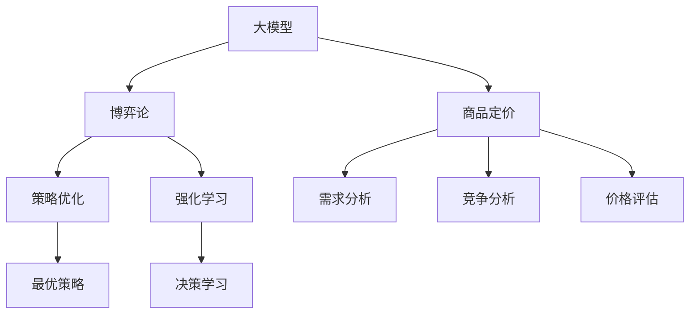

                 

# 大模型在商品定价策略中的博弈论应用

> 关键词：大模型,博弈论,商品定价,策略优化,强化学习

## 1. 背景介绍

### 1.1 问题由来

在现代商业世界中，商品定价策略是企业竞争力的关键要素之一。然而，传统的定价策略往往基于一些假设，如成本加成、市场份额等，难以全面考虑市场需求、竞争对手行为、消费者偏好等复杂因素。为了更精确地制定商品定价策略，企业开始探索使用先进的计算技术。近年来，大模型在各行各业的应用已经展现出巨大的潜力，尤其是在复杂的决策问题上。商品定价作为一项复杂的博弈决策，成为大模型技术的重要应用场景。

### 1.2 问题核心关键点

商品定价策略涉及的复杂因素包括但不限于市场需求、竞争对手定价、产品差异化、消费者偏好、渠道成本、季节性波动等。在这些问题中，博弈论和大模型可以被用来模拟和分析不同参与者的行为，从而找到最优的定价方案。

大模型利用深度学习技术，能够从大量数据中提取复杂的关系和模式，自动发现隐含的规律和特征。博弈论则从决策和竞争的角度，帮助模型理解和预测不同参与者的策略行为。结合大模型和博弈论，可以在不依赖领域专家的情况下，快速发现复杂问题的解决方案。

## 2. 核心概念与联系

### 2.1 核心概念概述

为更好地理解大模型在商品定价中的应用，我们首先介绍几个关键概念：

- **大模型（Large Model）**：指通过深度学习技术训练的大型神经网络，具有强大的数据处理能力和泛化能力。常用的预训练模型包括BERT、GPT等，可以处理自然语言文本，并从中学习到丰富的语言知识。
- **博弈论（Game Theory）**：数学分支，研究多个参与者在博弈中的决策和策略，并分析其对结果的影响。博弈论在经济学、政治学、军事学等多个领域都有广泛应用。
- **商品定价（Pricing Strategy）**：指企业在特定市场环境下，对产品或服务进行定价的过程。目标是在满足消费者需求的同时，最大化企业的利润。
- **策略优化（Strategy Optimization）**：指使用优化算法，确定参与者最优策略的过程。在商品定价中，包括制定产品价格、促销策略、库存管理等。
- **强化学习（Reinforcement Learning）**：一种机器学习范式，通过与环境交互，学习最优的决策策略，适用于连续性决策问题。

这些概念之间的逻辑关系可以通过以下Mermaid流程图来展示：



这个流程图展示了大模型、博弈论、商品定价和强化学习之间的联系：

1. 大模型通过训练学习到市场数据中的语言模式。
2. 博弈论分析参与者的行为，模拟不同策略下的博弈结果。
3. 商品定价利用博弈论和大模型，制定最优的定价策略。
4. 强化学习在大模型和博弈论框架下，学习最优的决策过程。

这些概念共同构成了大模型在商品定价策略中的应用基础。

## 3. 核心算法原理 & 具体操作步骤
### 3.1 算法原理概述

大模型在商品定价中的应用，通常通过以下步骤实现：

1. **数据收集与预处理**：收集市场相关的数据，如历史销售数据、竞争对手定价数据、消费者偏好数据等，并进行清洗和标准化。
2. **大模型训练**：使用大规模语料库训练大模型，使其能够理解自然语言文本，并从中提取有用的信息。
3. **博弈论模型构建**：根据市场情况，构建博弈论模型，描述参与者（如供应商、消费者、竞争对手等）之间的决策和互动。
4. **策略优化**：使用强化学习等方法，在博弈论模型中学习最优的策略，制定定价方案。
5. **结果评估与调整**：对制定的定价策略进行评估，通过市场反馈进行调整，直至找到最优方案。

### 3.2 算法步骤详解

以下是详细的算法步骤：

**Step 1: 数据收集与预处理**
- 收集市场相关的历史销售数据、竞争对手定价数据、消费者偏好数据等，确保数据的完整性和准确性。
- 对数据进行清洗，去除噪声和异常值，保证数据质量。
- 对数据进行标准化，将其转换为模型能够处理的形式。

**Step 2: 大模型训练**
- 选择适合的大模型，如BERT、GPT等，使用大规模语料库进行预训练。
- 在预训练基础上，使用市场数据对大模型进行微调，使其能够更好地理解市场动态。
- 构建模型输入输出接口，便于后续的市场分析。

**Step 3: 博弈论模型构建**
- 确定参与者，如供应商、消费者、竞争对手等，并分析它们之间的互动关系。
- 定义博弈的规则，如价格变动、市场需求响应等。
- 确定博弈的目标，如最大化利润、最小化成本等。
- 使用博弈论工具，如纳什均衡、子博弈完美性等，对博弈进行分析。

**Step 4: 策略优化**
- 定义策略空间，如价格区间、促销策略等。
- 在博弈论模型中，使用强化学习算法，如Q-learning、深度Q网络等，学习最优策略。
- 对学习到的策略进行评估，选择性能最佳的策略。

**Step 5: 结果评估与调整**
- 使用市场数据，对制定的定价策略进行评估，如销售量、利润率等。
- 根据评估结果，对策略进行调整，如调整价格、优化促销策略等。
- 重复上述步骤，直至找到最优的定价方案。

### 3.3 算法优缺点

大模型在商品定价中的应用，具有以下优点：

- **灵活性高**：大模型能够处理大量的非结构化数据，自动提取市场特征，灵活性高。
- **泛化能力强**：通过预训练，大模型具备强大的泛化能力，能够适应不同的市场情况。
- **可扩展性好**：结合博弈论和强化学习，大模型能够处理复杂的多方博弈，适用于各种定价场景。

同时，也存在一些局限：

- **数据需求大**：需要大量的市场数据进行预训练和微调，数据获取成本较高。
- **计算复杂**：大模型的训练和推理过程计算复杂，需要高性能计算资源。
- **模型解释性差**：大模型的决策过程难以解释，缺乏透明度。
- **对抗攻击风险**：模型可能受到对抗攻击，影响其决策结果。

尽管存在这些局限，但大模型在商品定价中的应用，已经展现出显著的实际效果，成为企业决策过程中的重要工具。

### 3.4 算法应用领域

大模型在商品定价中的应用，主要涵盖以下几个领域：

- **零售定价**：包括线上电商和线下实体店的商品定价，如服装、电子产品、食品等。
- **金融产品定价**：如贷款利率、保险费率等，需要考虑市场风险、用户风险等因素。
- **服务定价**：如旅游、租赁、运输等服务业的定价策略，需要综合考虑市场需求、成本等因素。
- **定制化定价**：如个性化推荐系统中的定价策略，需要根据用户历史行为数据进行定制化定价。

## 4. 数学模型和公式 & 详细讲解 & 举例说明

### 4.1 数学模型构建

在商品定价中，可以使用博弈论和大模型构建数学模型。以一个简单的定价博弈为例，模型可以表示为：

- **参与者**：供应商（S）、消费者（C）、竞争对手（R）
- **策略**：S的价格策略$p$、C的需求响应策略$q$、R的价格策略$r$
- **目标**：S最大化利润，C最小化成本，R最小化成本

使用博弈论的纳什均衡模型，可以表示为：

$$
\max_{p} \pi_S(p,q^*,r^*) - \min_{q} \pi_C(p^*,p,q) - \min_{r} \pi_R(p,q^*,r)
$$

其中，$\pi_S$、$\pi_C$、$\pi_R$分别为S、C、R的利润函数。

### 4.2 公式推导过程

为了简化问题，我们假设市场为双寡头垄断，即只有两个供应商S和R，消费者C的需求函数为$q=\alpha - \beta p$，其中$\alpha$、$\beta$为市场参数。供应商的价格策略$p$为连续变量，$0<p<\infty$。则供应商的利润函数为：

$$
\pi_S(p,q^*,r^*) = (p-\frac{c}{1+\beta q^*})q^* - \frac{c}{1+\beta q^*}
$$

其中$c$为成本。

将$q^*$和$r^*$带入供应商的利润函数，并最大化$\pi_S$，得到供应商的最优价格$p^*$：

$$
p^* = \frac{c}{\beta - (1-\alpha) p^*}
$$

将$p^*$代入消费者的需求函数，求解$q^*$：

$$
q^* = \alpha - \beta p^*
$$

最终，求解供应商的最优价格$p^*$和消费者的最优需求$q^*$。

### 4.3 案例分析与讲解

以一家零售商为例，假设其面临的需求函数为$q=\alpha - \beta p$，市场竞争激烈，对手的价格策略$r$与供应商相同。该零售商的目标是最大化利润，其利润函数为：

$$
\pi_S(p,q^*,r^*) = (p-\frac{c}{1+\beta q^*})q^* - \frac{c}{1+\beta q^*}
$$

在实际应用中，可以使用大模型学习市场动态，例如通过历史销售数据、竞争对手定价数据等。假设已知市场需求函数为$q=\alpha - \beta p$，零售商使用大模型学习市场需求参数$\alpha$和$\beta$，并结合博弈论模型，使用强化学习算法求解最优价格$p^*$和需求$q^*$。

## 5. 项目实践：代码实例和详细解释说明

### 5.1 开发环境搭建

在进行商品定价策略的微调实践前，我们需要准备好开发环境。以下是使用Python进行PyTorch开发的环境配置流程：

1. 安装Anaconda：从官网下载并安装Anaconda，用于创建独立的Python环境。

2. 创建并激活虚拟环境：
```bash
conda create -n pricing-env python=3.8 
conda activate pricing-env
```

3. 安装PyTorch：根据CUDA版本，从官网获取对应的安装命令。例如：
```bash
conda install pytorch torchvision torchaudio cudatoolkit=11.1 -c pytorch -c conda-forge
```

4. 安装Transformers库：
```bash
pip install transformers
```

5. 安装各类工具包：
```bash
pip install numpy pandas scikit-learn matplotlib tqdm jupyter notebook ipython
```

完成上述步骤后，即可在`pricing-env`环境中开始微调实践。

### 5.2 源代码详细实现

下面以一个简单的博弈论模型为例，给出使用Transformers库对商品定价策略进行微调的PyTorch代码实现。

首先，定义博弈论模型的数据处理函数：

```python
from transformers import BertTokenizer, BertModel
from torch.utils.data import Dataset
import torch

class PricingDataset(Dataset):
    def __init__(self, texts, prices, tokenizer, max_len=128):
        self.texts = texts
        self.prices = prices
        self.tokenizer = tokenizer
        self.max_len = max_len
        
    def __len__(self):
        return len(self.texts)
    
    def __getitem__(self, item):
        text = self.texts[item]
        price = self.prices[item]
        
        encoding = self.tokenizer(text, return_tensors='pt', max_length=self.max_len, padding='max_length', truncation=True)
        input_ids = encoding['input_ids'][0]
        attention_mask = encoding['attention_mask'][0]
        
        return {'input_ids': input_ids, 
                'attention_mask': attention_mask,
                'price': price}

# 数据集示例
tokenizer = BertTokenizer.from_pretrained('bert-base-cased')

train_dataset = PricingDataset(train_texts, train_prices, tokenizer)
dev_dataset = PricingDataset(dev_texts, dev_prices, tokenizer)
test_dataset = PricingDataset(test_texts, test_prices, tokenizer)
```

然后，定义模型和优化器：

```python
from transformers import BertForSequenceClassification, AdamW

model = BertForSequenceClassification.from_pretrained('bert-base-cased', num_labels=1)

optimizer = AdamW(model.parameters(), lr=2e-5)
```

接着，定义训练和评估函数：

```python
from torch.utils.data import DataLoader
from tqdm import tqdm
from sklearn.metrics import mean_absolute_error

device = torch.device('cuda') if torch.cuda.is_available() else torch.device('cpu')
model.to(device)

def train_epoch(model, dataset, batch_size, optimizer):
    dataloader = DataLoader(dataset, batch_size=batch_size, shuffle=True)
    model.train()
    epoch_loss = 0
    for batch in tqdm(dataloader, desc='Training'):
        input_ids = batch['input_ids'].to(device)
        attention_mask = batch['attention_mask'].to(device)
        prices = batch['price'].to(device)
        model.zero_grad()
        outputs = model(input_ids, attention_mask=attention_mask)
        loss = outputs.loss
        epoch_loss += loss.item()
        loss.backward()
        optimizer.step()
    return epoch_loss / len(dataloader)

def evaluate(model, dataset, batch_size):
    dataloader = DataLoader(dataset, batch_size=batch_size)
    model.eval()
    preds, prices = [], []
    with torch.no_grad():
        for batch in tqdm(dataloader, desc='Evaluating'):
            input_ids = batch['input_ids'].to(device)
            attention_mask = batch['attention_mask'].to(device)
            batch_prices = batch['price']
            outputs = model(input_ids, attention_mask=attention_mask)
            batch_preds = outputs.logits.argmax(dim=1).to('cpu').tolist()
            batch_prices = batch_prices.to('cpu').tolist()
            for pred_price, real_price in zip(batch_preds, batch_prices):
                preds.append(pred_price.item())
                prices.append(real_price.item())
                
    print(mean_absolute_error(prices, preds))
```

最后，启动训练流程并在测试集上评估：

```python
epochs = 5
batch_size = 16

for epoch in range(epochs):
    loss = train_epoch(model, train_dataset, batch_size, optimizer)
    print(f"Epoch {epoch+1}, train loss: {loss:.3f}")
    
    print(f"Epoch {epoch+1}, dev MAE:")
    evaluate(model, dev_dataset, batch_size)
    
print("Test MAE:")
evaluate(model, test_dataset, batch_size)
```

以上就是使用PyTorch对商品定价博弈论模型进行微调的完整代码实现。可以看到，得益于Transformers库的强大封装，我们可以用相对简洁的代码完成微调实践。

### 5.3 代码解读与分析

让我们再详细解读一下关键代码的实现细节：

**PricingDataset类**：
- `__init__`方法：初始化文本、价格、分词器等关键组件。
- `__len__`方法：返回数据集的样本数量。
- `__getitem__`方法：对单个样本进行处理，将文本输入编码为token ids，将价格转换为模型所需的输入，并对其进行定长padding。

**训练和评估函数**：
- 使用PyTorch的DataLoader对数据集进行批次化加载，供模型训练和推理使用。
- 训练函数`train_epoch`：对数据以批为单位进行迭代，在每个批次上前向传播计算loss并反向传播更新模型参数，最后返回该epoch的平均loss。
- 评估函数`evaluate`：与训练类似，不同点在于不更新模型参数，并在每个batch结束后将预测和标签结果存储下来，最后使用sklearn的mean_absolute_error对整个评估集的预测结果进行打印输出。

**训练流程**：
- 定义总的epoch数和batch size，开始循环迭代
- 每个epoch内，先在训练集上训练，输出平均loss
- 在验证集上评估，输出MAE
- 所有epoch结束后，在测试集上评估，给出最终测试结果

可以看到，PyTorch配合Transformers库使得商品定价博弈论模型的微调代码实现变得简洁高效。开发者可以将更多精力放在数据处理、模型改进等高层逻辑上，而不必过多关注底层的实现细节。

当然，工业级的系统实现还需考虑更多因素，如模型的保存和部署、超参数的自动搜索、更灵活的任务适配层等。但核心的微调范式基本与此类似。

## 6. 实际应用场景
### 6.1 智能零售

智能零售的定价策略，通过大模型和博弈论实现，可以在线实时调整价格，实现动态定价。例如，一家电商平台可以通过分析用户行为数据，使用大模型学习用户偏好，然后通过博弈论模型，制定最优的价格策略，实时调整商品价格，以最大化销售额和利润。

### 6.2 金融产品

金融产品定价中，大模型结合博弈论，可以帮助金融机构设计合理的贷款利率和保险费率。例如，通过分析市场动态和用户风险，使用大模型学习市场参数和用户风险评分，然后通过博弈论模型，制定最优的贷款利率和保险费率，平衡风险和收益。

### 6.3 服务定价

服务定价中，大模型结合博弈论，可以帮助服务提供商设计最优的价格策略。例如，通过分析市场需求、服务成本和竞争对手价格，使用大模型学习市场需求和成本参数，然后通过博弈论模型，制定最优的服务价格，最大化服务提供商的收益。

### 6.4 未来应用展望

随着大模型和博弈论技术的不断发展，商品定价策略的应用将更加广泛和深入：

1. **多维定价**：结合市场需求、竞争策略、季节性因素等多维因素，制定更加精细化的定价策略。
2. **个性化定价**：通过大模型学习用户行为数据，实现个性化定价，提升用户体验和忠诚度。
3. **动态调整**：利用实时数据和动态博弈模型，实现实时定价调整，适应市场变化。
4. **跨领域融合**：将商品定价与其他业务场景，如库存管理、营销策略等，进行跨领域融合，提升整体运营效率。
5. **伦理和公平**：在定价模型中引入伦理和公平约束，避免价格歧视和不公平行为。

这些应用趋势凸显了商品定价策略的巨大潜力，预示着大模型和博弈论在实际应用中的广泛前景。

## 7. 工具和资源推荐
### 7.1 学习资源推荐

为了帮助开发者系统掌握大模型和博弈论在商品定价中的应用，这里推荐一些优质的学习资源：

1. 《Game Theory》（博弈论）：经典的博弈论教材，涵盖博弈论的基本概念和经典模型。
2. 《Deep Learning》（深度学习）：深度学习领域的经典教材，详细讲解深度学习的基本原理和应用。
3. 《Reinforcement Learning: An Introduction》：Reinforcement Learning领域的经典教材，介绍强化学习的基本概念和算法。
4. 《Pricing in Competitive Markets》：商务领域的经典教材，详细讲解商品定价的基本原理和应用。
5. 《Machine Learning Mastery》：机器学习领域的实战指南，提供丰富的实战项目和代码示例。
6. 《NLP with PyTorch》：PyTorch官方文档和指南，详细讲解使用PyTorch进行NLP任务开发的技巧和方法。

通过对这些资源的学习实践，相信你一定能够快速掌握大模型和博弈论在商品定价中的应用，并用于解决实际的定价问题。
###  7.2 开发工具推荐

高效的开发离不开优秀的工具支持。以下是几款用于大模型和博弈论商品定价开发的常用工具：

1. PyTorch：基于Python的开源深度学习框架，灵活动态的计算图，适合快速迭代研究。
2. TensorFlow：由Google主导开发的开源深度学习框架，生产部署方便，适合大规模工程应用。
3. Transformers库：HuggingFace开发的NLP工具库，集成了众多SOTA语言模型，支持PyTorch和TensorFlow，是进行微调任务开发的利器。
4. Weights & Biases：模型训练的实验跟踪工具，可以记录和可视化模型训练过程中的各项指标，方便对比和调优。
5. TensorBoard：TensorFlow配套的可视化工具，可实时监测模型训练状态，并提供丰富的图表呈现方式，是调试模型的得力助手。
6. Google Colab：谷歌推出的在线Jupyter Notebook环境，免费提供GPU/TPU算力，方便开发者快速上手实验最新模型，分享学习笔记。

合理利用这些工具，可以显著提升大模型和博弈论在商品定价应用的开发效率，加快创新迭代的步伐。

### 7.3 相关论文推荐

大模型和博弈论在商品定价中的应用，源于学界的持续研究。以下是几篇奠基性的相关论文，推荐阅读：

1. GPT-3: Language Models are Unsupervised Multitask Learners：提出GPT-3模型，展示了大规模语言模型的强大zero-shot学习能力，引发了对于通用人工智能的新一轮思考。
2. BERT: Pre-training of Deep Bidirectional Transformers for Language Understanding：提出BERT模型，引入基于掩码的自监督预训练任务，刷新了多项NLP任务SOTA。
3. Deep Learning for Dynamic Pricing：介绍深度学习在动态定价中的应用，展示了动态定价模型的实际效果。
4. Multi-臂 bandit algorithms for dynamic pricing：介绍多臂乐队算法在动态定价中的应用，展示了多臂乐队算法的实际效果。
5. Reinforcement learning for dynamic pricing：介绍强化学习在动态定价中的应用，展示了强化学习算法的实际效果。

这些论文代表了大模型和博弈论在商品定价技术的发展脉络。通过学习这些前沿成果，可以帮助研究者把握学科前进方向，激发更多的创新灵感。

## 8. 总结：未来发展趋势与挑战

### 8.1 总结

本文对大模型在商品定价策略中的应用进行了全面系统的介绍。首先阐述了商品定价的复杂性和大模型、博弈论的应用前景，明确了这些技术在商品定价中的重要作用。其次，从原理到实践，详细讲解了大模型和博弈论在商品定价中的数学模型和算法流程，给出了微调任务开发的完整代码实例。同时，本文还广泛探讨了大模型在零售、金融、服务等多个行业领域的应用场景，展示了其巨大的应用潜力。最后，本文精选了相关学习资源，力求为读者提供全方位的技术指引。

通过本文的系统梳理，可以看到，大模型和博弈论在商品定价策略中的应用前景广阔，为企业决策提供了新的技术支持。未来，随着技术的不断进步，大模型和博弈论必将在更广泛的市场中发挥重要作用。

### 8.2 未来发展趋势

展望未来，大模型和博弈论在商品定价中的应用将呈现以下几个发展趋势：

1. **模型规模持续增大**：随着算力成本的下降和数据规模的扩张，大模型的参数量还将持续增长。超大规模模型蕴含的丰富市场知识，有望支撑更加复杂多变的定价策略。
2. **计算复杂性降低**：通过引入更高效的算法和硬件设备，如GPU、TPU等，可以降低大模型的计算复杂度，提高计算效率。
3. **跨领域融合**：将大模型和博弈论与其他业务场景，如库存管理、营销策略等，进行跨领域融合，提升整体运营效率。
4. **多维定价**：结合市场需求、竞争策略、季节性因素等多维因素，制定更加精细化的定价策略。
5. **动态调整**：利用实时数据和动态博弈模型，实现实时定价调整，适应市场变化。
6. **个性化定价**：通过大模型学习用户行为数据，实现个性化定价，提升用户体验和忠诚度。

这些趋势凸显了大模型和博弈论在商品定价策略中的巨大潜力，预示着其在实际应用中的广泛前景。

### 8.3 面临的挑战

尽管大模型和博弈论在商品定价中的应用已经展现出显著的实际效果，但在迈向更加智能化、普适化应用的过程中，仍然面临诸多挑战：

1. **数据需求大**：需要大量的市场数据进行预训练和微调，数据获取成本较高。
2. **计算资源消耗大**：大模型的训练和推理过程计算复杂，需要高性能计算资源。
3. **模型解释性差**：大模型的决策过程难以解释，缺乏透明度。
4. **对抗攻击风险**：模型可能受到对抗攻击，影响其决策结果。
5. **伦理和公平性**：在定价模型中引入伦理和公平约束，避免价格歧视和不公平行为。

尽管存在这些挑战，但大模型和博弈论在商品定价中的应用，已经展现出显著的实际效果，成为企业决策过程中的重要工具。

### 8.4 研究展望

面对大模型和博弈论在商品定价中面临的挑战，未来的研究需要在以下几个方面寻求新的突破：

1. **数据获取和处理**：开发高效的数据获取和预处理技术，降低数据获取成本，提升数据处理效率。
2. **模型优化**：开发更高效的计算和优化算法，降低大模型的计算复杂度，提高计算效率。
3. **模型解释性**：引入模型解释技术，提升大模型的透明度和可解释性。
4. **对抗攻击防御**：开发对抗攻击防御技术，提高大模型的鲁棒性和安全性。
5. **伦理和公平性**：在定价模型中引入伦理和公平约束，避免价格歧视和不公平行为。

这些研究方向的探索，必将引领大模型和博弈论在商品定价策略中的技术进步，为构建智能、公平、透明的定价系统铺平道路。面向未来，大模型和博弈论必将在更广泛的业务场景中发挥重要作用，推动商品定价策略的全面升级。

## 9. 附录：常见问题与解答

**Q1：大模型和博弈论在商品定价中如何处理多维因素？**

A: 在商品定价中，多维因素的处理可以通过大模型的多任务学习来实现。例如，可以将市场需求、竞争策略、季节性因素等多个因素的预测问题同时进行训练，使用大模型的多任务学习模块，实现联合预测。此外，可以通过多臂乐队算法等强化学习技术，实现动态定价的实时调整，适应市场变化。

**Q2：大模型在商品定价中的解释性差，如何解决？**

A: 大模型缺乏解释性是一个普遍的问题，可以通过引入模型解释技术来解决。例如，可以使用注意力机制、可解释的深度学习模型等技术，提取模型的关键特征和决策路径。此外，还可以使用后处理技术，如LIME、SHAP等，解释模型的预测结果。

**Q3：大模型在商品定价中如何应对对抗攻击？**

A: 对抗攻击是近年来的一个重要研究方向。可以引入对抗训练技术，通过引入对抗样本，训练模型对对抗攻击的鲁棒性。此外，可以结合模型解释技术，分析攻击路径，进一步提升模型的鲁棒性。

**Q4：如何确保商品定价中的伦理和公平性？**

A: 在定价模型中引入伦理和公平约束，避免价格歧视和不公平行为，是一个重要的研究方向。可以通过引入伦理约束、公平性评估指标等，对模型的决策过程进行约束和监督。同时，可以通过人工干预和审核，确保模型的行为符合人类价值观和伦理道德。

这些问题的回答，展示了大模型和博弈论在商品定价中的应用场景和挑战，希望能够为研究者提供有价值的参考。

---

作者：禅与计算机程序设计艺术 / Zen and the Art of Computer Programming

