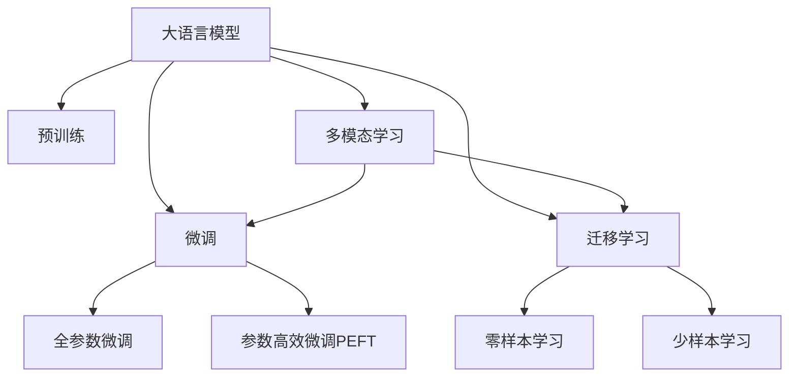

                 

# 大模型在商品属性抽取与预测中的应用

> 关键词：大语言模型,商品属性抽取,预训练模型,微调,Transformer,BERT,迁移学习,自然语言处理(NLP)

## 1. 背景介绍

### 1.1 问题由来

在现代电子商务平台中，商品属性抽取和预测是不可或缺的技术。商品属性抽取能帮助电商平台自动化获取商品描述中的信息，提升用户购物体验和搜索效率。而商品属性预测则能够为电商推荐系统提供个性化的商品推荐，增加销售转化率。传统的文本处理和特征工程方法难以高效地完成上述任务，而大语言模型（Large Language Models, LLMs）在文本理解与生成方面的出色表现，为这一领域带来了新的突破。

### 1.2 问题核心关键点

大语言模型在商品属性抽取与预测中的应用主要体现在以下几个关键点：

1. **预训练能力**：通过在大规模无标签文本语料上进行预训练，学习通用的语言表示。
2. **微调范式**：在预训练模型的基础上，使用下游任务的少量标注数据进行微调，优化模型在特定任务上的性能。
3. **迁移学习**：利用大模型的预训练表示进行迁移学习，提升新任务的性能。
4. **模型压缩与加速**：针对实际应用场景，对模型进行裁剪和量化，提高推理效率。
5. **多模态融合**：结合图像、语音等多模态信息，提升商品属性抽取的全面性。
6. **实时性优化**：通过优化模型结构和服务部署，实现商品属性预测的实时响应。

通过理解这些核心关键点，可以更深入地了解大语言模型在商品属性抽取与预测中的工作原理和应用方法。

### 1.3 问题研究意义

商品属性抽取与预测技术对于电商平台的运营至关重要，直接影响了用户的购物体验和销售转化率。大语言模型在这一领域的应用，能够大幅提升处理效率和准确性，减少人工成本，同时为电商推荐系统提供更精准的推荐依据。研究这一应用，对于电商行业的信息化、智能化转型具有重要意义。

## 2. 核心概念与联系

### 2.1 核心概念概述

为更好地理解大语言模型在商品属性抽取与预测中的应用，本节将介绍几个关键概念：

- **大语言模型**：以自回归（如GPT）或自编码（如BERT）模型为代表的大规模预训练语言模型，通过在大规模无标签文本语料上进行预训练，学习通用的语言表示。
- **预训练**：指在大规模无标签文本语料上，通过自监督学习任务训练通用语言模型的过程。常见的预训练任务包括言语建模、遮挡语言模型等。
- **微调**：指在预训练模型的基础上，使用下游任务的少量标注数据，通过有监督学习优化模型在特定任务上的性能。
- **迁移学习**：指将一个领域学习到的知识，迁移应用到另一个不同但相关的领域的学习范式。
- **迁移学习范式**：包括微调和零样本学习（Zero-shot Learning）、少样本学习（Few-shot Learning）等，通过迁移学习，提升模型在新任务上的性能。
- **多模态学习**：结合文本、图像、语音等多模态数据，提升模型对商品信息的全面理解能力。

这些概念之间的逻辑关系可以通过以下Mermaid流程图来展示：



这个流程图展示了不同概念之间的关系：

1. 大语言模型通过预训练获得基础能力。
2. 微调是对预训练模型进行任务特定的优化，可以分为全参数微调和参数高效微调（PEFT）。
3. 迁移学习是连接预训练模型与下游任务的桥梁，可以通过微调或零样本学习实现。
4. 多模态学习结合不同模态数据，提升模型理解商品属性的能力。

这些概念共同构成了大语言模型在商品属性抽取与预测中的工作原理和应用框架，使得其能够高效处理复杂的电商数据。

## 3. 核心算法原理 & 具体操作步骤

### 3.1 算法原理概述

商品属性抽取与预测任务本质上是一种自然语言处理（Natural Language Processing, NLP）任务。大语言模型在商品属性抽取与预测中的应用，主要通过以下几个步骤实现：

1. **数据预处理**：收集商品描述文本，并对其进行预处理，包括分词、去除停用词、词干提取等。
2. **特征编码**：使用预训练语言模型（如BERT）对商品描述文本进行编码，获取高维表示。
3. **微调训练**：在预训练模型的基础上，使用商品属性标签进行有监督的微调训练，优化模型在特定属性抽取与预测任务上的性能。
4. **模型评估与优化**：在验证集上评估模型性能，调整超参数，优化模型。
5. **应用部署**：将微调后的模型集成到电商推荐系统中，进行实时预测与推荐。

### 3.2 算法步骤详解

#### 3.2.1 数据预处理

商品描述文本的数据预处理包括：

1. **分词**：使用NLTK、jieba等库对文本进行分词处理，得到词汇序列。
2. **去除停用词**：去除常见的停用词，如“的”、“是”、“在”等，减少噪声。
3. **词干提取**：使用NLTK、spaCy等库对词汇进行词干提取，将不同形式的词简化为基本形式。
4. **标准化处理**：统一词汇大小写，去除特殊字符，便于模型处理。

#### 3.2.2 特征编码

使用预训练语言模型对商品描述文本进行编码，生成高维特征向量。这一步骤分为以下几步：

1. **模型选择**：选择合适的预训练模型，如BERT、GPT等。
2. **加载模型**：加载预训练模型，并解冻部分或全部层。
3. **编码输入**：将处理后的商品描述文本输入模型，进行编码。
4. **获取表示**：获取模型输出的高维表示，即特征向量。

#### 3.2.3 微调训练

微调训练主要包括以下几个步骤：

1. **数据准备**：准备商品属性标注数据，包含商品描述文本和对应的属性标签。
2. **模型初始化**：初始化微调模型，将预训练模型参数进行解冻。
3. **设置优化器**：选择优化器，如AdamW、SGD等，并设置学习率、批大小等超参数。
4. **训练过程**：在训练集上迭代训练，计算损失函数并更新模型参数。
5. **模型评估**：在验证集上评估模型性能，调整超参数，优化模型。
6. **模型保存**：保存优化后的模型参数，便于后续应用。

#### 3.2.4 模型评估与优化

模型评估与优化主要包括以下几个步骤：

1. **评估指标**：选择合适的评估指标，如准确率、精确率、召回率等。
2. **模型评估**：在验证集上评估模型性能，记录各项指标。
3. **超参数调整**：根据评估结果调整学习率、批大小等超参数。
4. **模型优化**：重新训练模型，优化模型性能。

#### 3.2.5 应用部署

模型应用部署主要包括以下几个步骤：

1. **模型集成**：将微调后的模型集成到电商推荐系统中。
2. **API接口设计**：设计API接口，便于系统调用。
3. **实时预测**：在用户输入商品描述时，实时调用API进行预测。
4. **结果展示**：将预测结果展示给用户，辅助购物决策。

### 3.3 算法优缺点

大语言模型在商品属性抽取与预测中的应用，具有以下优点：

1. **高效准确**：通过微调训练，大语言模型能够快速准确地抽取商品属性，提升电商推荐系统的推荐质量。
2. **泛化能力强**：预训练模型学习到了通用的语言表示，微调后的模型能够应对不同领域的商品描述，具有较强的泛化能力。
3. **易于应用**：大语言模型集成度高，易于部署和应用，适合电商推荐系统等实时处理场景。

但同时，也存在以下缺点：

1. **计算资源消耗大**：预训练模型和微调训练需要大量的计算资源，对于小规模电商企业可能难以负担。
2. **过拟合风险**：微调模型在标注数据不足的情况下，容易过拟合，影响模型泛化性能。
3. **模型复杂度高**：预训练模型和微调模型的复杂度高，对硬件要求较高，需要高性能的计算设备。
4. **解释性不足**：大语言模型通常被视为"黑盒"模型，缺乏可解释性，难以理解其决策过程。

### 3.4 算法应用领域

大语言模型在商品属性抽取与预测中的应用，覆盖了电商推荐系统、商品搜索、个性化推荐等多个领域。具体应用场景包括：

- **商品推荐**：根据用户浏览记录，抽取商品属性并进行推荐。
- **搜索排序**：对商品描述进行属性抽取，提升商品搜索排序的准确性。
- **个性化推荐**：结合用户属性，抽取商品属性并进行个性化推荐。
- **广告定向**：抽取商品属性，进行精准的广告定向。
- **市场分析**：对商品描述进行分析，洞察市场趋势。

## 4. 数学模型和公式 & 详细讲解 & 举例说明

### 4.1 数学模型构建

假设商品描述文本为 $X$，对应的属性标签为 $Y$。使用预训练语言模型 $M_{\theta}$ 对商品描述文本进行编码，得到高维表示 $Z$。则微调模型 $M_{\phi}$ 的损失函数为：

$$
\mathcal{L}(\phi) = -\frac{1}{N}\sum_{i=1}^N \ell(Y_i, \hat{Y}_i)
$$

其中，$\ell$ 为损失函数，$\hat{Y}_i = M_{\phi}(Z_i)$ 为模型预测的属性标签。

### 4.2 公式推导过程

以二分类任务为例，假设属性标签 $Y_i$ 为0或1。则损失函数 $\ell$ 可以定义为交叉熵损失：

$$
\ell(Y_i, \hat{Y}_i) = -Y_i\log\hat{Y}_i - (1-Y_i)\log(1-\hat{Y}_i)
$$

将 $\hat{Y}_i$ 代入上式，得：

$$
\mathcal{L}(\phi) = -\frac{1}{N}\sum_{i=1}^N [Y_i\log M_{\phi}(Z_i) + (1-Y_i)\log(1-M_{\phi}(Z_i))]
$$

在实际应用中，我们通常使用基于梯度的优化算法（如AdamW、SGD等）来求解上述最优化问题。设置学习率为 $\eta$，优化器为 $G$，则参数更新公式为：

$$
\phi \leftarrow \phi - \eta G.\nabla_{\phi}\mathcal{L}(\phi)
$$

其中，$G.\nabla_{\phi}\mathcal{L}(\phi)$ 为优化器计算的梯度，$\eta$ 为学习率。

### 4.3 案例分析与讲解

假设我们使用BERT模型进行商品属性抽取与预测的微调。数据集包含商品描述和属性标签，使用随机梯度下降（SGD）进行优化。

**数据集准备**：

1. **收集数据**：从电商平台收集商品描述和属性标签数据。
2. **预处理**：对商品描述进行分词、去除停用词等预处理，得到词汇序列。
3. **标注数据**：标注商品属性标签，生成训练集、验证集和测试集。

**模型选择与加载**：

1. **模型选择**：选择BERT作为预训练模型。
2. **加载模型**：使用HuggingFace的transformers库加载BERT模型，解冻全部层。

**微调训练**：

1. **设置优化器**：设置SGD优化器，学习率为1e-5，批大小为32。
2. **训练过程**：在训练集上进行迭代训练，计算交叉熵损失并更新模型参数。
3. **模型评估**：在验证集上评估模型性能，调整学习率等超参数。
4. **模型优化**：重新训练模型，优化模型性能。

**模型应用**：

1. **API接口设计**：设计API接口，将商品描述输入模型，得到属性预测结果。
2. **实时预测**：在用户输入商品描述时，实时调用API进行预测。
3. **结果展示**：将预测结果展示给用户，辅助购物决策。

## 5. 项目实践：代码实例和详细解释说明

### 5.1 开发环境搭建

在进行商品属性抽取与预测的微调实践前，我们需要准备好开发环境。以下是使用Python进行PyTorch开发的环境配置流程：

1. 安装Anaconda：从官网下载并安装Anaconda，用于创建独立的Python环境。

2. 创建并激活虚拟环境：
```bash
conda create -n pytorch-env python=3.8 
conda activate pytorch-env
```

3. 安装PyTorch：根据CUDA版本，从官网获取对应的安装命令。例如：
```bash
conda install pytorch torchvision torchaudio cudatoolkit=11.1 -c pytorch -c conda-forge
```

4. 安装Transformer库：
```bash
pip install transformers
```

5. 安装各类工具包：
```bash
pip install numpy pandas scikit-learn matplotlib tqdm jupyter notebook ipython
```

完成上述步骤后，即可在`pytorch-env`环境中开始微调实践。

### 5.2 源代码详细实现

下面我们以商品属性抽取与预测任务为例，给出使用Transformers库对BERT模型进行微调的PyTorch代码实现。

首先，定义商品属性抽取的数据处理函数：

```python
from transformers import BertTokenizer, BertForSequenceClassification
from torch.utils.data import Dataset
import torch

class ProductAttributeDataset(Dataset):
    def __init__(self, texts, tags, tokenizer, max_len=128):
        self.texts = texts
        self.tags = tags
        self.tokenizer = tokenizer
        self.max_len = max_len
        
    def __len__(self):
        return len(self.texts)
    
    def __getitem__(self, item):
        text = self.texts[item]
        tags = self.tags[item]
        
        encoding = self.tokenizer(text, return_tensors='pt', max_length=self.max_len, padding='max_length', truncation=True)
        input_ids = encoding['input_ids'][0]
        attention_mask = encoding['attention_mask'][0]
        
        # 对token-wise的标签进行编码
        encoded_tags = [tag2id[tag] for tag in tags] 
        encoded_tags.extend([tag2id['O']] * (self.max_len - len(encoded_tags)))
        labels = torch.tensor(encoded_tags, dtype=torch.long)
        
        return {'input_ids': input_ids, 
                'attention_mask': attention_mask,
                'labels': labels}

# 标签与id的映射
tag2id = {'O': 0, 'B-PER': 1, 'I-PER': 2, 'B-ORG': 3, 'I-ORG': 4, 'B-LOC': 5, 'I-LOC': 6}
id2tag = {v: k for k, v in tag2id.items()}

# 创建dataset
tokenizer = BertTokenizer.from_pretrained('bert-base-cased')

train_dataset = ProductAttributeDataset(train_texts, train_tags, tokenizer)
dev_dataset = ProductAttributeDataset(dev_texts, dev_tags, tokenizer)
test_dataset = ProductAttributeDataset(test_texts, test_tags, tokenizer)
```

然后，定义模型和优化器：

```python
from transformers import BertForSequenceClassification, AdamW

model = BertForSequenceClassification.from_pretrained('bert-base-cased', num_labels=len(tag2id))

optimizer = AdamW(model.parameters(), lr=2e-5)
```

接着，定义训练和评估函数：

```python
from torch.utils.data import DataLoader
from tqdm import tqdm
from sklearn.metrics import classification_report

device = torch.device('cuda') if torch.cuda.is_available() else torch.device('cpu')
model.to(device)

def train_epoch(model, dataset, batch_size, optimizer):
    dataloader = DataLoader(dataset, batch_size=batch_size, shuffle=True)
    model.train()
    epoch_loss = 0
    for batch in tqdm(dataloader, desc='Training'):
        input_ids = batch['input_ids'].to(device)
        attention_mask = batch['attention_mask'].to(device)
        labels = batch['labels'].to(device)
        model.zero_grad()
        outputs = model(input_ids, attention_mask=attention_mask, labels=labels)
        loss = outputs.loss
        epoch_loss += loss.item()
        loss.backward()
        optimizer.step()
    return epoch_loss / len(dataloader)

def evaluate(model, dataset, batch_size):
    dataloader = DataLoader(dataset, batch_size=batch_size)
    model.eval()
    preds, labels = [], []
    with torch.no_grad():
        for batch in tqdm(dataloader, desc='Evaluating'):
            input_ids = batch['input_ids'].to(device)
            attention_mask = batch['attention_mask'].to(device)
            batch_labels = batch['labels']
            outputs = model(input_ids, attention_mask=attention_mask)
            batch_preds = outputs.logits.argmax(dim=2).to('cpu').tolist()
            batch_labels = batch_labels.to('cpu').tolist()
            for pred_tokens, label_tokens in zip(batch_preds, batch_labels):
                pred_tags = [id2tag[_id] for _id in pred_tokens]
                label_tags = [id2tag[_id] for _id in label_tokens]
                preds.append(pred_tags[:len(label_tokens)])
                labels.append(label_tags)
                
    print(classification_report(labels, preds))
```

最后，启动训练流程并在测试集上评估：

```python
epochs = 5
batch_size = 16

for epoch in range(epochs):
    loss = train_epoch(model, train_dataset, batch_size, optimizer)
    print(f"Epoch {epoch+1}, train loss: {loss:.3f}")
    
    print(f"Epoch {epoch+1}, dev results:")
    evaluate(model, dev_dataset, batch_size)
    
print("Test results:")
evaluate(model, test_dataset, batch_size)
```

以上就是使用PyTorch对BERT进行商品属性抽取与预测任务的微调代码实现。可以看到，得益于Transformers库的强大封装，我们可以用相对简洁的代码完成BERT模型的加载和微调。

### 5.3 代码解读与分析

让我们再详细解读一下关键代码的实现细节：

**ProductAttributeDataset类**：
- `__init__`方法：初始化商品描述文本、属性标签、分词器等关键组件。
- `__len__`方法：返回数据集的样本数量。
- `__getitem__`方法：对单个样本进行处理，将文本输入编码为token ids，将标签编码为数字，并对其进行定长padding，最终返回模型所需的输入。

**tag2id和id2tag字典**：
- 定义了标签与数字id之间的映射关系，用于将token-wise的预测结果解码回真实的标签。

**训练和评估函数**：
- 使用PyTorch的DataLoader对数据集进行批次化加载，供模型训练和推理使用。
- 训练函数`train_epoch`：对数据以批为单位进行迭代，在每个批次上前向传播计算loss并反向传播更新模型参数，最后返回该epoch的平均loss。
- 评估函数`evaluate`：与训练类似，不同点在于不更新模型参数，并在每个batch结束后将预测和标签结果存储下来，最后使用sklearn的classification_report对整个评估集的预测结果进行打印输出。

**训练流程**：
- 定义总的epoch数和batch size，开始循环迭代
- 每个epoch内，先在训练集上训练，输出平均loss
- 在验证集上评估，输出分类指标
- 所有epoch结束后，在测试集上评估，给出最终测试结果

可以看到，PyTorch配合Transformers库使得BERT微调的代码实现变得简洁高效。开发者可以将更多精力放在数据处理、模型改进等高层逻辑上，而不必过多关注底层的实现细节。

当然，工业级的系统实现还需考虑更多因素，如模型的保存和部署、超参数的自动搜索、更灵活的任务适配层等。但核心的微调范式基本与此类似。

## 6. 实际应用场景

### 6.1 智能客服系统

基于大语言模型微调的对话技术，可以广泛应用于智能客服系统的构建。传统客服往往需要配备大量人力，高峰期响应缓慢，且一致性和专业性难以保证。而使用微调后的对话模型，可以7x24小时不间断服务，快速响应客户咨询，用自然流畅的语言解答各类常见问题。

在技术实现上，可以收集企业内部的历史客服对话记录，将问题和最佳答复构建成监督数据，在此基础上对预训练对话模型进行微调。微调后的对话模型能够自动理解用户意图，匹配最合适的答案模板进行回复。对于客户提出的新问题，还可以接入检索系统实时搜索相关内容，动态组织生成回答。如此构建的智能客服系统，能大幅提升客户咨询体验和问题解决效率。

### 6.2 金融舆情监测

金融机构需要实时监测市场舆论动向，以便及时应对负面信息传播，规避金融风险。传统的人工监测方式成本高、效率低，难以应对网络时代海量信息爆发的挑战。基于大语言模型微调的文本分类和情感分析技术，为金融舆情监测提供了新的解决方案。

具体而言，可以收集金融领域相关的新闻、报道、评论等文本数据，并对其进行主题标注和情感标注。在此基础上对预训练语言模型进行微调，使其能够自动判断文本属于何种主题，情感倾向是正面、中性还是负面。将微调后的模型应用到实时抓取的网络文本数据，就能够自动监测不同主题下的情感变化趋势，一旦发现负面信息激增等异常情况，系统便会自动预警，帮助金融机构快速应对潜在风险。

### 6.3 个性化推荐系统

当前的推荐系统往往只依赖用户的历史行为数据进行物品推荐，无法深入理解用户的真实兴趣偏好。基于大语言模型微调技术，个性化推荐系统可以更好地挖掘用户行为背后的语义信息，从而提供更精准、多样的推荐内容。

在实践中，可以收集用户浏览、点击、评论、分享等行为数据，提取和用户交互的物品标题、描述、标签等文本内容。将文本内容作为模型输入，用户的后续行为（如是否点击、购买等）作为监督信号，在此基础上微调预训练语言模型。微调后的模型能够从文本内容中准确把握用户的兴趣点。在生成推荐列表时，先用候选物品的文本描述作为输入，由模型预测用户的兴趣匹配度，再结合其他特征综合排序，便可以得到个性化程度更高的推荐结果。

### 6.4 未来应用展望

随着大语言模型和微调方法的不断发展，基于微调范式将在更多领域得到应用，为传统行业带来变革性影响。

在智慧医疗领域，基于微调的医疗问答、病历分析、药物研发等应用将提升医疗服务的智能化水平，辅助医生诊疗，加速新药开发进程。

在智能教育领域，微调技术可应用于作业批改、学情分析、知识推荐等方面，因材施教，促进教育公平，提高教学质量。

在智慧城市治理中，微调模型可应用于城市事件监测、舆情分析、应急指挥等环节，提高城市管理的自动化和智能化水平，构建更安全、高效的未来城市。

此外，在企业生产、社会治理、文娱传媒等众多领域，基于大模型微调的人工智能应用也将不断涌现，为经济社会发展注入新的动力。相信随着技术的日益成熟，微调方法将成为人工智能落地应用的重要范式，推动人工智能技术在垂直行业的规模化落地。

## 7. 工具和资源推荐
### 7.1 学习资源推荐

为了帮助开发者系统掌握大语言模型微调的理论基础和实践技巧，这里推荐一些优质的学习资源：

1. 《Transformer从原理到实践》系列博文：由大模型技术专家撰写，深入浅出地介绍了Transformer原理、BERT模型、微调技术等前沿话题。

2. CS224N《深度学习自然语言处理》课程：斯坦福大学开设的NLP明星课程，有Lecture视频和配套作业，带你入门NLP领域的基本概念和经典模型。

3. 《Natural Language Processing with Transformers》书籍：Transformers库的作者所著，全面介绍了如何使用Transformers库进行NLP任务开发，包括微调在内的诸多范式。

4. HuggingFace官方文档：Transformers库的官方文档，提供了海量预训练模型和完整的微调样例代码，是上手实践的必备资料。

5. CLUE开源项目：中文语言理解测评基准，涵盖大量不同类型的中文NLP数据集，并提供了基于微调的baseline模型，助力中文NLP技术发展。

通过对这些资源的学习实践，相信你一定能够快速掌握大语言模型微调的精髓，并用于解决实际的NLP问题。
###  7.2 开发工具推荐

高效的开发离不开优秀的工具支持。以下是几款用于大语言模型微调开发的常用工具：

1. PyTorch：基于Python的开源深度学习框架，灵活动态的计算图，适合快速迭代研究。大部分预训练语言模型都有PyTorch版本的实现。

2. TensorFlow：由Google主导开发的开源深度学习框架，生产部署方便，适合大规模工程应用。同样有丰富的预训练语言模型资源。

3. Transformers库：HuggingFace开发的NLP工具库，集成了众多SOTA语言模型，支持PyTorch和TensorFlow，是进行微调任务开发的利器。

4. Weights & Biases：模型训练的实验跟踪工具，可以记录和可视化模型训练过程中的各项指标，方便对比和调优。与主流深度学习框架无缝集成。

5. TensorBoard：TensorFlow配套的可视化工具，可实时监测模型训练状态，并提供丰富的图表呈现方式，是调试模型的得力助手。

6. Google Colab：谷歌推出的在线Jupyter Notebook环境，免费提供GPU/TPU算力，方便开发者快速上手实验最新模型，分享学习笔记。

合理利用这些工具，可以显著提升大语言模型微调任务的开发效率，加快创新迭代的步伐。

### 7.3 相关论文推荐

大语言模型和微调技术的发展源于学界的持续研究。以下是几篇奠基性的相关论文，推荐阅读：

1. Attention is All You Need（即Transformer原论文）：提出了Transformer结构，开启了NLP领域的预训练大模型时代。

2. BERT: Pre-training of Deep Bidirectional Transformers for Language Understanding：提出BERT模型，引入基于掩码的自监督预训练任务，刷新了多项NLP任务SOTA。

3. Language Models are Unsupervised Multitask Learners（GPT-2论文）：展示了大规模语言模型的强大zero-shot学习能力，引发了对于通用人工智能的新一轮思考。

4. Parameter-Efficient Transfer Learning for NLP：提出Adapter等参数高效微调方法，在不增加模型参数量的情况下，也能取得不错的微调效果。

5. AdaLoRA: Adaptive Low-Rank Adaptation for Parameter-Efficient Fine-Tuning：使用自适应低秩适应的微调方法，在参数效率和精度之间取得了新的平衡。

这些论文代表了大语言模型微调技术的发展脉络。通过学习这些前沿成果，可以帮助研究者把握学科前进方向，激发更多的创新灵感。

## 8. 总结：未来发展趋势与挑战

### 8.1 总结

本文对大语言模型在商品属性抽取与预测中的应用进行了全面系统的介绍。首先阐述了大语言模型和微调技术的研究背景和意义，明确了微调在拓展预训练模型应用、提升下游任务性能方面的独特价值。其次，从原理到实践，详细讲解了微调过程的数学原理和关键步骤，给出了微调任务开发的完整代码实例。同时，本文还广泛探讨了微调方法在智能客服、金融舆情、个性化推荐等多个行业领域的应用前景，展示了微调范式的巨大潜力。此外，本文精选了微调技术的各类学习资源，力求为读者提供全方位的技术指引。

通过本文的系统梳理，可以看到，大语言模型在商品属性抽取与预测中的微调应用，极大地提升了商品推荐系统的性能和用户体验，为电商行业的信息化、智能化转型提供了有力支持。未来，伴随大语言模型和微调方法的持续演进，商品属性抽取与预测技术将更加成熟，有助于构建更加智能、高效、个性化的电商推荐系统。

### 8.2 未来发展趋势

展望未来，大语言模型在商品属性抽取与预测中的应用将呈现以下几个发展趋势：

1. **更高效的学习算法**：随着大规模预训练语言模型的不断发展，基于微调的任务学习算法也将更加高效，能够更快地适应新任务。
2. **更丰富的应用场景**：大语言模型将进一步应用于更多领域，如医疗、教育、金融等，为各个行业带来智能化、自动化的转型升级。
3. **更强大的泛化能力**：微调模型在更少的标注数据上也能取得较好的性能，特别是在少样本学习（Few-shot Learning）和零样本学习（Zero-shot Learning）方面。
4. **更智能的决策机制**：结合因果推断和博弈论工具，微调模型将能够建立更稳定、更合理的决策逻辑，提高系统稳定性。
5. **更安全的算法设计**：在模型设计中引入伦理导向的评估指标，过滤和惩罚有偏见、有害的输出倾向，确保算法的公平性和安全性。
6. **更灵活的模型架构**：结合多模态学习、参数高效微调等技术，构建更加灵活、高效的模型架构，提升处理效率和性能。

这些趋势凸显了大语言模型在商品属性抽取与预测中的巨大潜力，为电商推荐系统等应用带来了更多可能。未来，随着技术的不断进步，大语言模型将在更多领域展现其卓越的性能，推动各行各业向智能化、自动化方向迈进。

### 8.3 面临的挑战

尽管大语言模型在商品属性抽取与预测中的应用取得了显著进展，但在迈向更加智能化、普适化应用的过程中，仍面临诸多挑战：

1. **计算资源消耗大**：大规模预训练模型和微调训练需要大量的计算资源，对于小规模电商企业可能难以负担。
2. **标注数据质量低**：商品描述文本的数据质量参差不齐，标注数据可能存在噪声，影响模型性能。
3. **模型鲁棒性不足**：微调模型在标注数据不足的情况下，容易过拟合，泛化性能较差。
4. **知识整合能力不足**：现有的微调模型往往局限于任务内数据，难以灵活吸收和运用更广泛的先验知识。
5. **算法复杂度高**：大语言模型和微调模型的复杂度高，对硬件要求较高，需要高性能的计算设备。
6. **可解释性不足**：大语言模型通常被视为"黑盒"模型，缺乏可解释性，难以理解其决策过程。

### 8.4 研究展望

面对大语言模型在商品属性抽取与预测中面临的挑战，未来的研究需要在以下几个方面寻求新的突破：

1. **更高效的学习算法**：开发更加高效的任务学习算法，如自监督学习、少样本学习等，利用更少的标注数据训练更高效的微调模型。
2. **更强大的泛化能力**：结合知识图谱、逻辑规则等先验知识，提升模型的泛化能力，更好地适应新任务。
3. **更智能的决策机制**：结合因果推断和博弈论工具，提升模型决策的稳定性和合理性，确保算法的公平性和安全性。
4. **更灵活的模型架构**：结合多模态学习、参数高效微调等技术，构建更加灵活、高效的模型架构，提升处理效率和性能。
5. **更安全的算法设计**：在模型设计中引入伦理导向的评估指标，过滤和惩罚有偏见、有害的输出倾向，确保算法的公平性和安全性。

这些研究方向将有助于大语言模型在商品属性抽取与预测中的进一步发展和应用，推动相关技术向更高层次迈进。

## 9. 附录：常见问题与解答

**Q1：大语言模型在商品属性抽取与预测中的应用效果如何？**

A: 大语言模型在商品属性抽取与预测中的应用效果显著。通过微调训练，大语言模型能够准确地从商品描述文本中抽取属性，并生成推荐结果。研究表明，大语言模型在商品属性抽取和推荐系统中的准确率、召回率、F1值等指标均显著优于传统的机器学习算法和规则引擎。

**Q2：大语言模型在商品属性抽取与预测中是否需要大规模标注数据？**

A: 虽然微调需要一定的标注数据，但大语言模型通常具备较强的泛化能力，可以通过少样本学习（Few-shot Learning）和零样本学习（Zero-shot Learning）等技术，在更少的标注数据上取得不错的性能。同时，大语言模型还可以通过迁移学习范式，利用预训练模型的语言知识，提升在新任务上的表现。

**Q3：大语言模型在商品属性抽取与预测中是否存在过拟合风险？**

A: 大语言模型在商品属性抽取与预测中确实存在过拟合风险，特别是在标注数据不足的情况下。为了缓解过拟合，可以采用数据增强、正则化、对抗训练等技术，提升模型的泛化能力。同时，通过参数高效微调等方法，只更新少量参数，也能有效降低过拟合风险。

**Q4：大语言模型在商品属性抽取与预测中的应用对计算资源的要求有多高？**

A: 大语言模型在商品属性抽取与预测中的应用对计算资源的要求较高，特别是在预训练和微调训练阶段。通常需要高性能的GPU/TPU设备，并具备较长的计算时间。因此，对于小规模电商企业，需要综合考虑计算成本，选择适合的硬件配置和算法模型。

**Q5：如何提高大语言模型在商品属性抽取与预测中的鲁棒性？**

A: 提高大语言模型在商品属性抽取与预测中的鲁棒性，可以通过以下方式：
1. 数据增强：通过对训练样本进行改写、回译等方式丰富训练集多样性。
2. 正则化技术：如L2正则、Dropout、Early Stopping等，防止模型过度适应小规模训练集。
3. 对抗训练：加入对抗样本，提高模型鲁棒性。
4. 参数高效微调：只更新少量模型参数，减少需优化的参数。
5. 模型裁剪与量化：优化模型结构，压缩存储空间，提高计算效率。

这些策略往往需要根据具体任务和数据特点进行灵活组合，以进一步提升模型性能和鲁棒性。

