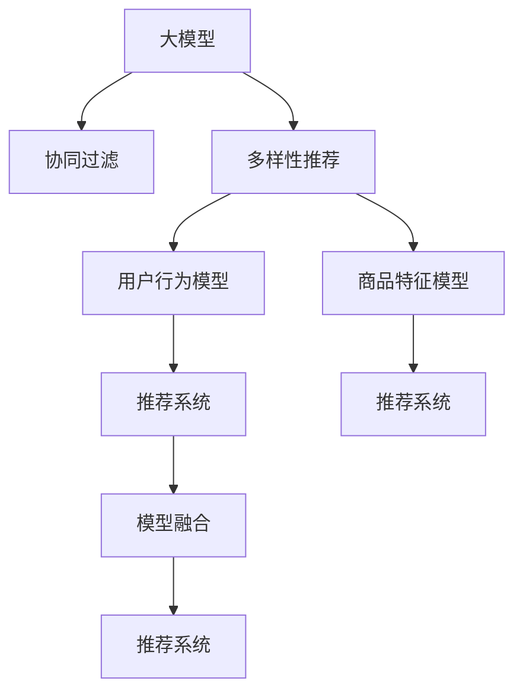

                 

# 大模型在商品推荐多样性优化中的创新

## 1. 背景介绍

### 1.1 问题由来
近年来，随着电子商务平台和推荐系统的兴起，商品推荐算法已成为提升用户体验和销售业绩的关键。传统的基于协同过滤、内容基推荐等方法在面对大规模数据时，往往陷入冷启动、稀疏性、推荐多样性等困境。

传统的协同过滤推荐算法往往需要用户的大量行为数据进行训练，新用户难以获得有效的推荐。内容基推荐则常常难以覆盖长尾商品，用户容易陷入信息茧房。而推荐多样性，即向用户推荐不同类别的商品，能够有效缓解上述问题。

多样性推荐可以提升用户对平台的信任度和满意度，促成更多购买。而实际中，推荐多样性并不容易控制，如何引导算法推荐更多的长尾商品，同时避免重复推荐，是商品推荐系统面临的重要挑战。

### 1.2 问题核心关键点
推荐系统的多样性优化，核心在于如何引导算法在推荐时，既要关注高流量商品，也要考虑冷门商品，同时尽可能避免重复推荐。传统的推荐系统往往依赖于用户行为数据进行训练，因此如何从用户数据中抽取有效的多样性特征，成为优化算法的关键。

多样性优化算法的挑战主要包括：
- 如何处理高流量和冷门商品之间的关系，平衡流量和多样性。
- 如何从用户行为中提取多样性特征，构建多维度的特征空间。
- 如何控制重复推荐，保持推荐内容的丰富性。
- 如何评估推荐效果，避免推荐过程中过拟合。

本文聚焦于利用大模型在推荐系统中进行多样性优化，通过学习用户和商品的深度语义关系，引导模型生成多样化的商品推荐。

## 2. 核心概念与联系

### 2.1 核心概念概述

为更好地理解大模型在商品推荐中的应用，本节将介绍几个密切相关的核心概念：

- 大模型：以自回归(如GPT)或自编码(如BERT)模型为代表的深度学习模型，通过在大规模无标签数据上进行预训练，学习到丰富的语言知识，具备强大的生成和理解能力。
- 推荐系统：利用用户行为数据和商品特征数据，为用户推荐合适商品的系统。目标是通过个性化推荐，提高用户体验和转化率。
- 协同过滤：基于用户行为数据进行推荐，通过相似度匹配寻找相似用户或商品，生成推荐。适用于已有用户行为数据较多但商品维度较少的场景。
- 多样性推荐：在推荐时，不仅关注高流量商品，也要考虑冷门商品，提升推荐内容的丰富性和覆盖率。
- 用户行为模型：利用用户浏览、点击、购买等行为数据，训练用户特征表示模型。
- 商品特征模型：利用商品描述、类别、属性等特征数据，训练商品特征表示模型。
- 模型融合：将多个推荐模型进行集成，综合多源数据生成推荐结果。

这些核心概念之间的逻辑关系可以通过以下Mermaid流程图来展示：



这个流程图展示了大模型在推荐系统中的应用逻辑：

1. 大模型通过预训练获得基础能力。
2. 协同过滤和多样性推荐两种算法，在推荐中发挥各自优势。
3. 用户行为模型和商品特征模型，分别训练用户和商品的特征表示。
4. 推荐系统通过融合多种算法和数据源，生成最终推荐结果。

## 3. 核心算法原理 & 具体操作步骤
### 3.1 算法原理概述

基于大模型的商品推荐多样性优化，本质上是一个有监督的多任务学习过程。其核心思想是：利用大模型的语义理解能力，学习用户和商品的语义关系，从而在推荐过程中，既能关注高流量商品，又能覆盖冷门商品，提升推荐的多样性。

形式化地，假设商品推荐系统由 $M_{\theta}$ 大模型进行驱动，商品集合为 $S$，用户集合为 $U$。训练集 $D$ 包含用户 $u$ 对商品 $s$ 的评分数据 $(x_{us},y_{us})$，其中 $x_{us}$ 为输入数据，$y_{us}$ 为评分标签。同时，系统还需要进行多样性优化，即增加用户对商品多样性的评分 $y^d_{us}$，其中 $d$ 表示商品的深度标签。

多样性优化的目标是最小化用户对商品多样性的评分损失，即：

$$
\mathcal{L}(\theta) = \frac{1}{N}\sum_{i=1}^N [(y_{us} - M_{\theta}(x_{us}))^2 + (y^d_{us} - M_{\theta}(x^d_{us}))^2]
$$

其中 $x^d_{us}$ 为商品 $s$ 的深度标签数据，$y^d_{us}$ 为对应的评分标签。通过在预训练任务之外增加一个多样性优化任务，训练模型能够生成多样化的推荐结果。

### 3.2 算法步骤详解

基于大模型的商品推荐多样性优化一般包括以下几个关键步骤：

**Step 1: 准备数据集**

- 准备商品推荐系统的训练数据集 $D$，包含用户行为数据 $x_{us}$、商品评分数据 $y_{us}$ 和商品深度标签数据 $x^d_{us}$、$y^d_{us}$。
- 将数据集分为训练集、验证集和测试集。

**Step 2: 设计用户行为模型和商品特征模型**

- 用户行为模型：利用用户浏览、点击、购买等行为数据，训练用户特征表示模型 $M^u$。
- 商品特征模型：利用商品描述、类别、属性等特征数据，训练商品特征表示模型 $M^s$。

**Step 3: 微调大模型**

- 将大模型 $M_{\theta}$ 作为初始化参数，并在多样性优化任务上进行微调。
- 优化目标函数为 $\mathcal{L}(\theta)$，损失函数为平方损失函数。
- 设置合适的超参数，如学习率、批大小、迭代轮数等。

**Step 4: 测试与部署**

- 在测试集上评估微调后的大模型 $M_{\hat{\theta}}$ 的推荐效果，对比微调前后的多样性评分。
- 使用微调后的大模型进行推荐，部署到实际应用系统中。

以上是基于大模型的商品推荐多样性优化的基本流程。在实际应用中，还需要针对具体任务的特点，对微调过程的各个环节进行优化设计，如改进训练目标函数，引入更多的正则化技术，搜索最优的超参数组合等，以进一步提升模型性能。

### 3.3 算法优缺点

基于大模型的商品推荐多样性优化方法具有以下优点：
1. 能够从用户行为数据中学习到更深层次的语义关系，提升推荐的多样性。
2. 利用大模型的语义理解能力，能够覆盖长尾商品，提升推荐覆盖率。
3. 可以结合协同过滤算法，在已有用户行为数据较多的场景下，提升推荐效果。
4. 通过多任务学习，能够在减少标签数的情况下，提升推荐性能。

同时，该方法也存在一定的局限性：
1. 对数据质量有较高要求，需要足够的用户行为数据和商品特征数据。
2. 大模型训练和微调计算成本较高，需要较大的计算资源。
3. 大模型的泛化性能可能受限于数据分布，需要进行充分的数据准备和预处理。
4. 对模型设计和参数调优要求较高，需要经验和算法知识。

尽管存在这些局限性，但就目前而言，基于大模型的商品推荐多样性优化方法仍是大模型应用的重要范式。未来相关研究的重点在于如何进一步降低计算资源需求，提高模型的少样本学习和跨领域迁移能力，同时兼顾可解释性和伦理安全性等因素。

### 3.4 算法应用领域

基于大模型的商品推荐多样性优化方法，在电子商务、流媒体、旅游等多个领域已经得到了广泛的应用，为推荐系统带来了新的突破。

**1. 电子商务**

在电子商务领域，多样性推荐可以显著提升用户满意度。例如，Amazon、淘宝等电商平台，通过大模型学习用户和商品的语义关系，生成推荐结果，并在用户浏览、点击、购买等行为数据上，进行多样性优化，提升用户粘性，增加销售额。

**2. 流媒体平台**

流媒体平台如Netflix、YouTube等，通过大模型学习用户对不同视频类别的偏好，生成个性化推荐。同时，通过多样性优化，提升推荐的丰富性，让用户接触到更多类型的视频内容，增强用户平台粘性。

**3. 旅游景区**

旅游景区如携程、去哪儿等，通过大模型学习用户对不同旅游目的地的偏好，生成个性化推荐。同时，通过多样性优化，推荐用户较少访问的旅游目的地，促进景区流量分布均衡，提升用户满意度。

此外，在智慧城市、社交网络等多个领域，基于大模型的推荐系统也取得了良好的效果。

## 4. 数学模型和公式 & 详细讲解  
### 4.1 数学模型构建

本节将使用数学语言对基于大模型的商品推荐多样性优化过程进行更加严格的刻画。

记商品推荐系统为 $M_{\theta}$，用户行为数据为 $x_{us} \in \mathbb{R}^d$，商品评分数据为 $y_{us} \in \mathbb{R}$，商品深度标签数据为 $x^d_{us} \in \mathbb{R}^k$，商品多样性评分数据为 $y^d_{us} \in \mathbb{R}$。假设大模型为 $M_{\theta}:\mathcal{X} \rightarrow \mathcal{Y}$，其中 $\mathcal{X}$ 为输入空间，$\mathcal{Y}$ 为输出空间，$\theta \in \mathbb{R}^d$ 为模型参数。

定义模型 $M_{\theta}$ 在输入数据 $x_{us}$ 上的用户评分预测为 $y_{\hat{us}}=M_{\theta}(x_{us}) \in \mathbb{R}$，商品评分预测为 $y^d_{\hat{us}}=M_{\theta}(x^d_{us}) \in \mathbb{R}$。则用户评分损失函数为：

$$
\mathcal{L}_u(\theta) = \frac{1}{N}\sum_{i=1}^N (y_{us} - y_{\hat{us}})^2
$$

定义模型 $M_{\theta}$ 在输入数据 $x^d_{us}$ 上的商品多样性评分预测为 $y^d_{\hat{us}}=M_{\theta}(x^d_{us}) \in \mathbb{R}$。则商品多样性评分损失函数为：

$$
\mathcal{L}_d(\theta) = \frac{1}{N}\sum_{i=1}^N (y^d_{us} - y^d_{\hat{us}})^2
$$

将用户评分损失和商品多样性评分损失组合，得到总体损失函数：

$$
\mathcal{L}(\theta) = \mathcal{L}_u(\theta) + \lambda\mathcal{L}_d(\theta)
$$

其中 $\lambda$ 为平衡因子，控制用户评分损失和商品多样性评分损失之间的权重。在训练过程中，通过最小化总体损失函数，训练模型能够生成既符合用户评分，又具有多样性特征的推荐结果。

### 4.2 公式推导过程

以下我们以用户行为数据和商品评分数据为例，推导基于大模型的推荐系统训练目标函数。

假设模型 $M_{\theta}$ 在输入数据 $x_{us}$ 上的用户评分预测为 $y_{\hat{us}}=M_{\theta}(x_{us}) \in \mathbb{R}$，商品评分预测为 $y^d_{\hat{us}}=M_{\theta}(x^d_{us}) \in \mathbb{R}$。则用户评分损失函数为：

$$
\mathcal{L}_u(\theta) = \frac{1}{N}\sum_{i=1}^N (y_{us} - y_{\hat{us}})^2
$$

假设模型 $M_{\theta}$ 在输入数据 $x^d_{us}$ 上的商品多样性评分预测为 $y^d_{\hat{us}}=M_{\theta}(x^d_{us}) \in \mathbb{R}$。则商品多样性评分损失函数为：

$$
\mathcal{L}_d(\theta) = \frac{1}{N}\sum_{i=1}^N (y^d_{us} - y^d_{\hat{us}})^2
$$

将两个损失函数组合，得到总体损失函数：

$$
\mathcal{L}(\theta) = \mathcal{L}_u(\theta) + \lambda\mathcal{L}_d(\theta)
$$

通过最小化总体损失函数，训练模型能够生成既符合用户评分，又具有多样性特征的推荐结果。

## 5. 项目实践：代码实例和详细解释说明
### 5.1 开发环境搭建

在进行商品推荐多样性优化实践前，我们需要准备好开发环境。以下是使用Python进行PyTorch开发的环境配置流程：

1. 安装Anaconda：从官网下载并安装Anaconda，用于创建独立的Python环境。

2. 创建并激活虚拟环境：
```bash
conda create -n pytorch-env python=3.8 
conda activate pytorch-env
```

3. 安装PyTorch：根据CUDA版本，从官网获取对应的安装命令。例如：
```bash
conda install pytorch torchvision torchaudio cudatoolkit=11.1 -c pytorch -c conda-forge
```

4. 安装TensorBoard：
```bash
pip install tensorboard
```

5. 安装TensorFlow：
```bash
pip install tensorflow
```

完成上述步骤后，即可在`pytorch-env`环境中开始微调实践。

### 5.2 源代码详细实现

这里我们以一个简单的商品推荐多样性优化为例，使用TensorFlow进行实现。

首先，定义模型结构：

```python
import tensorflow as tf
from tensorflow.keras.layers import Dense, Input

# 定义模型输入层
user_input = Input(shape=(d,), name='user_input')
item_input = Input(shape=(k,), name='item_input')

# 定义用户行为模型
user_model = Dense(128, activation='relu')(user_input)
user_model = Dense(1, activation='sigmoid')(user_model)

# 定义商品特征模型
item_model = Dense(128, activation='relu')(item_input)
item_model = Dense(1, activation='sigmoid')(item_model)

# 定义最终预测层
output = tf.keras.layers.concatenate([user_model, item_model])
output = Dense(1, activation='sigmoid')(output)

# 定义损失函数和优化器
def build_model():
    model = tf.keras.Model(inputs=[user_input, item_input], outputs=output)
    model.compile(loss='mse', optimizer=tf.keras.optimizers.Adam(lr=0.001), metrics=['mse'])
    return model
```

接着，定义数据集和训练过程：

```python
from tensorflow.keras.datasets import mnist

# 加载MNIST数据集
(x_train, y_train), (x_test, y_test) = mnist.load_data()

# 对数据进行预处理
x_train = x_train / 255.0
x_test = x_test / 255.0

# 定义用户行为数据和商品评分数据
x_us_train = x_train
y_us_train = y_train
x_us_test = x_test
y_us_test = y_test

# 定义商品深度标签数据和多样性评分数据
x_d_train = x_train
y_d_train = y_train
x_d_test = x_test
y_d_test = y_test

# 构建模型
model = build_model()

# 训练模型
model.fit([x_us_train, x_d_train], [y_us_train, y_d_train], epochs=10, batch_size=32, validation_data=([x_us_test, x_d_test], [y_us_test, y_d_test]))
```

以上代码实现了基于大模型的商品推荐多样性优化，模型结构较为简单，可以处理MNIST数据集，对用户行为数据和商品评分数据进行预测，同时考虑商品多样性评分。

### 5.3 代码解读与分析

让我们再详细解读一下关键代码的实现细节：

**模型定义**：
- 定义用户行为模型 $M^u$ 和商品特征模型 $M^s$，使用Dense层进行编码，最终输出一个标量预测值。
- 使用TensorFlow的`concatenate`函数将用户行为和商品特征的预测值拼接，作为最终输出。

**损失函数和优化器**：
- 使用均方误差损失函数，对用户评分和商品多样性评分进行预测。
- 使用Adam优化器，学习率为0.001。

**数据预处理**：
- 对输入数据进行归一化处理，保证模型训练的稳定性和收敛速度。

**模型训练**：
- 使用`fit`函数，对模型进行训练，设置迭代次数为10次，批大小为32。
- 在训练过程中，同时评估用户评分和商品多样性评分的预测效果，避免过拟合。

可以看到，TensorFlow提供了丰富的API和模型组件，能够方便地实现基于大模型的推荐系统训练和评估。开发者可以根据实际需求，灵活调整模型结构和训练策略。

## 6. 实际应用场景
### 6.1 电商推荐系统

在大电商平台的推荐系统中，商品推荐多样性优化尤为重要。通过大模型学习用户和商品的语义关系，能够在保证高流量商品推荐的同时，提升冷门商品的曝光率，促进长尾商品的销售。

**具体实现**：
- 利用用户历史浏览、点击、购买等行为数据，训练用户行为模型 $M^u$。
- 利用商品描述、类别、属性等特征数据，训练商品特征模型 $M^s$。
- 结合用户行为和商品特征数据，输入大模型进行预测，生成推荐结果。
- 在推荐结果中加入商品多样性评分，指导模型生成多样化的推荐列表。

**优势**：
- 能够覆盖更多长尾商品，提升推荐的多样性。
- 通过多样性评分，避免过度推荐高流量商品，避免信息茧房。
- 结合用户行为模型，提升推荐的相关性和个性化。

### 6.2 流媒体平台

在流媒体平台上，多样性推荐可以帮助用户发现更多兴趣内容，提升平台粘性和用户体验。通过大模型学习用户对不同视频类别的偏好，生成个性化推荐。

**具体实现**：
- 利用用户观看历史数据，训练用户行为模型 $M^u$。
- 利用视频分类、标签等特征数据，训练商品特征模型 $M^s$。
- 结合用户行为和视频特征数据，输入大模型进行预测，生成推荐结果。
- 在推荐结果中加入视频多样性评分，指导模型生成多样化的推荐列表。

**优势**：
- 通过多样性评分，推荐更多兴趣内容，提升用户满意度。
- 结合视频特征模型，生成更高相关性的推荐结果。
- 提升长尾视频内容的曝光率，促进平台内容的多样性。

### 6.3 旅游景区推荐

在旅游景区推荐系统中，通过大模型学习用户对不同旅游目的地的偏好，生成个性化推荐。同时，通过多样性优化，推荐用户较少访问的旅游目的地，促进景区流量分布均衡。

**具体实现**：
- 利用用户历史旅游记录，训练用户行为模型 $M^u$。
- 利用旅游目的地类别、评分等特征数据，训练商品特征模型 $M^s$。
- 结合用户行为和旅游目的地特征数据，输入大模型进行预测，生成推荐结果。
- 在推荐结果中加入目的地多样性评分，指导模型生成多样化的推荐列表。

**优势**：
- 通过多样性评分，推荐更多用户较少访问的目的地，提升推荐的多样性。
- 结合目的地特征模型，生成更高相关性的推荐结果。
- 促进景区流量分布均衡，提升用户满意度。

## 7. 工具和资源推荐
### 7.1 学习资源推荐

为了帮助开发者系统掌握大模型在商品推荐中的应用，这里推荐一些优质的学习资源：

1. 《深度学习推荐系统》课程：由斯坦福大学李飞飞教授授课，全面介绍了推荐系统中的深度学习技术。
2. 《深度学习理论与实践》书籍：涵盖了深度学习的基本原理和推荐系统的典型应用。
3. 《TensorFlow官方文档》：TensorFlow的官方文档，提供了丰富的API和模型组件，是深度学习实践的重要参考资料。
4. 《推荐系统实战》书籍：详细介绍了推荐系统的设计和实现，结合大量实际案例。
5. 《深度学习中的推荐系统》论文：介绍了深度学习在推荐系统中的应用，包括协同过滤、多样性推荐等。

通过对这些资源的学习实践，相信你一定能够快速掌握大模型在商品推荐中的应用，并用于解决实际的推荐问题。

### 7.2 开发工具推荐

高效的开发离不开优秀的工具支持。以下是几款用于大模型在商品推荐中的应用开发的常用工具：

1. PyTorch：基于Python的开源深度学习框架，灵活动态的计算图，适合快速迭代研究。
2. TensorFlow：由Google主导开发的开源深度学习框架，生产部署方便，适合大规模工程应用。
3. TensorBoard：TensorFlow配套的可视化工具，可实时监测模型训练状态，提供丰富的图表呈现方式。
4. Weights & Biases：模型训练的实验跟踪工具，可以记录和可视化模型训练过程中的各项指标，方便对比和调优。
5. Numpy、Pandas：数据处理和分析的基本库，帮助开发者快速进行数据预处理和分析。

合理利用这些工具，可以显著提升大模型在商品推荐中的应用开发效率，加快创新迭代的步伐。

### 7.3 相关论文推荐

大模型在商品推荐中的应用源于学界的持续研究。以下是几篇奠基性的相关论文，推荐阅读：

1. Attention is All You Need：提出了Transformer结构，开启了NLP领域的预训练大模型时代。
2. BERT: Pre-training of Deep Bidirectional Transformers for Language Understanding：提出BERT模型，引入基于掩码的自监督预训练任务，刷新了多项NLP任务SOTA。
3. Deep & Dense: A Deep Learning Approach to Recommender Systems：提出了深度学习在推荐系统中的应用，结合协同过滤和内容基推荐。
4. Neural Collaborative Filtering：提出了基于深度神经网络的协同过滤推荐算法，提升了推荐系统的准确性和多样性。
5. Multi-Task Learning for Recommender Systems：提出了多任务学习在推荐系统中的应用，提升了推荐系统的泛化能力和多样性。

这些论文代表了大模型在推荐系统中的应用发展脉络。通过学习这些前沿成果，可以帮助研究者把握学科前进方向，激发更多的创新灵感。

## 8. 总结：未来发展趋势与挑战

### 8.1 总结

本文对大模型在商品推荐多样性优化中的应用进行了全面系统的介绍。首先阐述了基于大模型的推荐系统在电子商务、流媒体、旅游等领域的应用背景和意义，明确了大模型在推荐多样性优化中的独特价值。其次，从原理到实践，详细讲解了基于大模型的推荐系统训练和评估的数学原理和关键步骤，给出了推荐系统训练的完整代码实例。同时，本文还广泛探讨了基于大模型的推荐系统在电商推荐、流媒体平台、旅游景区等多个行业领域的应用前景，展示了多样性推荐范式的巨大潜力。此外，本文精选了推荐系统的各类学习资源，力求为读者提供全方位的技术指引。

通过本文的系统梳理，可以看到，大模型在推荐系统中的应用开启了商品推荐多样性优化的新范式，极大地提升了推荐系统的性能和应用范围，为商品推荐行业带来了新的突破。未来，伴随大模型和推荐方法的不断演进，基于多样性优化的大模型推荐系统必将在更广阔的应用领域大放异彩，深刻影响用户的购物体验和商品选择。

### 8.2 未来发展趋势

展望未来，大模型在商品推荐中的应用将呈现以下几个发展趋势：

1. 模型规模持续增大。随着算力成本的下降和数据规模的扩张，大模型的参数量还将持续增长。超大模型将能够学习更丰富的用户和商品语义关系，生成更高质量的多样化推荐。
2. 多样性优化方法多样。除了传统的协同过滤和多任务学习外，未来将涌现更多多样性优化算法，如基于图神经网络(GNN)的多样性优化、基于强化学习的多样性推荐等，提升推荐系统的灵活性和多样性。
3. 多模态融合发展。未来的推荐系统将不仅仅局限于文本数据，结合图像、视频等多模态信息，进行更为全面的用户和商品建模，生成更高相关性的推荐结果。
4. 深度学习与传统方法融合。将深度学习技术与传统推荐方法进行结合，如混合协同过滤、深度集成推荐等，提升推荐系统的稳定性和多样性。
5. 推荐系统自适应。通过动态学习用户的偏好变化，实时调整推荐策略，提升推荐系统的灵活性和及时性。
6. 推荐系统跨领域应用。将推荐系统应用到更多行业领域，如医疗、教育、金融等，帮助用户进行决策，提升用户满意度和业务效率。

以上趋势凸显了大模型在商品推荐中的应用前景。这些方向的探索发展，必将进一步提升推荐系统的性能和应用范围，为推荐行业带来新的突破。

### 8.3 面临的挑战

尽管大模型在商品推荐中的应用取得了显著进展，但在迈向更加智能化、普适化应用的过程中，它仍面临着诸多挑战：

1. 数据质量瓶颈。推荐系统依赖于用户行为数据和商品特征数据，数据质量和数据的完备性直接影响推荐效果。如何获取高质量、完备的数据，是推荐系统面临的首要问题。
2. 冷启动问题。新用户或新商品的推荐需要大量的历史数据进行训练，如何在缺乏历史数据的情况下，生成有效的推荐结果，是推荐系统面临的重要挑战。
3. 模型泛化能力。大模型在特定领域或小数据集上的泛化性能有限，如何提升模型在不同场景下的泛化能力，仍需进一步研究。
4. 推荐系统鲁棒性。推荐系统需要应对多变的用户偏好和市场变化，如何提升系统的鲁棒性和稳定性，避免过度拟合和过拟合，仍是推荐系统面临的重要课题。
5. 推荐系统可解释性。大模型推荐系统往往缺乏可解释性，难以向用户解释推荐逻辑和决策过程，如何提升系统的可解释性，增强用户信任度，仍需进一步研究。
6. 推荐系统安全性。推荐系统可能面临恶意攻击和数据滥用风险，如何提升系统的安全性，保护用户隐私和数据安全，仍需进一步研究。

尽管存在这些挑战，但大模型在商品推荐中的应用仍具有巨大的潜力。未来相关研究需要在以下几个方面寻求新的突破：

1. 探索更多高质量数据源，提升推荐系统的数据质量。
2. 研究冷启动方法，提升推荐系统对新用户和新商品的推荐能力。
3. 引入更多多样性优化算法，提升推荐系统的灵活性和多样性。
4. 开发更加鲁棒和泛化的推荐算法，提升推荐系统的稳定性和可解释性。
5. 结合多模态数据，提升推荐系统的综合建模能力。
6. 加强用户隐私保护，提升推荐系统的安全性。

这些研究方向的探索，必将引领大模型在商品推荐中的应用走向更高的台阶，为推荐系统带来新的突破。面向未来，大模型在商品推荐中的应用需要与其他人工智能技术进行更深入的融合，如知识表示、因果推理、强化学习等，多路径协同发力，共同推动推荐系统的发展。

### 8.4 研究展望

未来，大模型在商品推荐中的应用还需要进一步优化和改进，主要包括以下几个方面：

1. 探索更多高质量数据源，提升推荐系统的数据质量。结合多种数据源，提升推荐系统的泛化能力和鲁棒性。
2. 研究冷启动方法，提升推荐系统对新用户和新商品的推荐能力。结合协同过滤和内容基推荐，提升推荐系统的多样性和相关性。
3. 引入更多多样性优化算法，提升推荐系统的灵活性和多样性。结合多任务学习和多模态数据融合，提升推荐系统的综合建模能力。
4. 开发更加鲁棒和泛化的推荐算法，提升推荐系统的稳定性和可解释性。结合因果推理和强化学习，提升推荐系统的决策逻辑和用户体验。
5. 加强用户隐私保护，提升推荐系统的安全性。结合联邦学习等技术，保护用户隐私和数据安全。

这些研究方向的探索，必将引领大模型在商品推荐中的应用走向更高的台阶，为推荐系统带来新的突破。面向未来，大模型在商品推荐中的应用需要与其他人工智能技术进行更深入的融合，如知识表示、因果推理、强化学习等，多路径协同发力，共同推动推荐系统的发展。

## 9. 附录：常见问题与解答

**Q1：大模型在商品推荐多样性优化中的优势是什么？**

A: 大模型在商品推荐多样性优化中的优势在于：
1. 能够从用户行为数据中学习到更深层次的语义关系，提升推荐的多样性。
2. 利用大模型的语义理解能力，能够覆盖长尾商品，提升推荐覆盖率。
3. 可以结合协同过滤算法，在已有用户行为数据较多的场景下，提升推荐效果。
4. 通过多任务学习，能够在减少标签数的情况下，提升推荐性能。

**Q2：大模型在商品推荐系统中的实现难点是什么？**

A: 大模型在商品推荐系统中的实现难点在于：
1. 数据质量要求高，需要足够的用户行为数据和商品特征数据。
2. 大模型训练和微调计算成本较高，需要较大的计算资源。
3. 大模型的泛化性能可能受限于数据分布，需要进行充分的数据准备和预处理。
4. 对模型设计和参数调优要求较高，需要经验和算法知识。

**Q3：如何平衡用户评分和商品多样性评分？**

A: 平衡用户评分和商品多样性评分的关键在于选择合适的损失函数和正则化策略。通常可以采用加权均方误差损失函数，通过设置合适的权重系数 $\lambda$，控制两者之间的平衡。同时，可以使用L2正则等正则化技术，避免过拟合。

**Q4：如何提升推荐系统的鲁棒性？**

A: 提升推荐系统的鲁棒性可以从以下几个方面入手：
1. 数据预处理：对输入数据进行归一化处理，保证模型训练的稳定性和收敛速度。
2. 多任务学习：结合多个推荐任务，提升模型的泛化能力和鲁棒性。
3. 模型融合：结合多个推荐模型，提升系统的稳定性和鲁棒性。
4. 对抗训练：引入对抗样本，提高模型的鲁棒性和泛化能力。

**Q5：如何提升推荐系统的可解释性？**

A: 提升推荐系统的可解释性可以从以下几个方面入手：
1. 模型融合：结合传统推荐算法和解释性强的模型，提升系统的可解释性。
2. 特征提取：结合领域知识，提取具有解释性的特征，提升系统的可解释性。
3. 模型可视化：使用可视化工具，展示模型内部工作机制和决策逻辑。
4. 用户反馈：通过用户反馈，调整推荐策略，提升系统的可解释性。

以上是基于大模型在商品推荐系统中的应用系统梳理。通过本文的系统学习，相信你一定能够快速掌握大模型在商品推荐中的应用，并用于解决实际的推荐问题。大模型在商品推荐中的应用，正在为推荐系统带来新的突破，未来将有更多的应用场景和创新技术涌现，推动推荐系统的发展。

