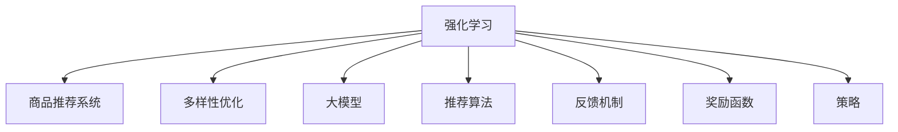

                 

# 大模型在商品推荐多样性优化中的强化学习应用

> 关键词：强化学习,商品推荐,多样性优化,大模型,深度学习,推荐系统

## 1. 背景介绍

### 1.1 问题由来
随着电子商务的快速发展，电商平台面临的商品推荐任务变得越来越复杂。传统的推荐系统往往只基于用户的显式反馈（如评分、点击、购买行为）进行推荐，难以全面反映用户的真实需求。近年来，基于深度学习的大模型在推荐系统中的应用逐渐兴起，通过大规模预训练获取丰富的商品特征表示，在推荐任务上取得了显著效果。

然而，现有的大模型推荐系统往往存在推荐多样性不足的问题。即推荐结果较为集中，未能覆盖用户潜在兴趣的广泛领域。这不仅降低了用户的购物体验，也可能导致推荐系统陷入局部最优解。因此，如何在大模型推荐系统中引入多样性优化机制，提升推荐结果的丰富性，成为了电商领域亟待解决的问题。

### 1.2 问题核心关键点
为了优化商品推荐的多样性，强化学习（Reinforcement Learning, RL）被引入到推荐系统中。通过RL方法，模型能够在推荐过程中，根据当前的状态和行动，学习到如何最大化推荐多样性。与传统的基于神经网络的方法不同，RL方法能够主动探索商品空间，跳出局部最优解，获得更加多样化的推荐结果。

具体而言，强化学习推荐系统主要由以下几个核心要素组成：
1. 状态空间：即模型在推荐过程中的状态表示，包括用户历史行为、商品特征等。
2. 动作空间：推荐系统可以采取的动作集合，如推荐某件商品、展示广告等。
3. 奖励函数：评估推荐结果多样性的一个量化指标，用于衡量模型性能。
4. Q值函数：预测每个状态-动作对的价值，指导模型选择最佳动作。
5. 策略：决定模型在每个状态下选择动作的策略，如ε-greedy、softmax等。

强化学习推荐系统的核心思想是，通过不断地与环境（即电商系统）交互，探索最优的多样性推荐策略，从而提升用户满意度，增加平台收益。

## 2. 核心概念与联系

### 2.1 核心概念概述

为了更好地理解强化学习在商品推荐中的应用，下面将详细介绍相关核心概念：

- **强化学习**：通过智能体（Agent）与环境的交互，学习到在特定状态下采取最佳动作，以最大化预期奖励的策略。强化学习的核心在于如何构建奖励函数，以及如何利用奖励信号指导模型更新。

- **商品推荐系统**：基于用户行为数据和商品特征，智能推荐用户可能感兴趣的商品，从而提升用户体验和平台收益。推荐系统需要平衡个性化和多样性，以满足用户的多样化需求。

- **多样性优化**：通过优化推荐结果的多样性，提升用户满意度，增加平台收益。多样性优化通常需要在个性化推荐的基础上，引入多样性约束，平衡个性化和多样性。

- **大模型**：指大规模预训练语言模型，如BERT、GPT等。通过大规模语料预训练，大模型能够学习到丰富的语言和领域知识，在推荐任务中能够提供更准确的商品表示和相似性度量。

- **推荐算法**：指用于生成推荐结果的算法，如协同过滤、矩阵分解、深度学习等。推荐算法通过不同的方法，从海量的商品和用户数据中挖掘推荐信号。

- **反馈机制**：指用户对推荐结果的反馈，如评分、点击、购买等。反馈机制用于评估推荐效果，指导模型迭代优化。

- **奖励函数**：用于衡量推荐结果的多样性和个性化程度。常见的多样性奖励函数包括信息熵、期望方差等。

这些概念之间的关系可以通过以下Mermaid流程图来展示：



这个流程图展示了强化学习在商品推荐系统中的应用逻辑：强化学习通过学习多样性优化策略，在大模型的基础上，指导推荐算法生成更丰富的推荐结果。同时，强化学习需要反馈机制来评估推荐效果，通过奖励函数来衡量模型性能，并利用策略来决定动作选择。

## 3. 核心算法原理 & 具体操作步骤
### 3.1 算法原理概述

强化学习推荐系统的核心算法原理是：通过模型在推荐过程中的探索和利用，最大化推荐多样性。具体来说，模型需要在用户历史行为和商品特征的基础上，主动探索商品空间，生成多样化的推荐结果。

形式化地，假设用户的历史行为序列为 $H$，商品特征集合为 $X$，模型在状态 $s_t$ 下的动作为 $a_t$，对应的奖励为 $r_t$，下一状态为 $s_{t+1}$。强化学习的目标是通过不断迭代，学习到最优的动作策略 $\pi$，使得预期奖励最大化：

$$
\max_{\pi} \mathbb{E}_{s_0}\left[\sum_{t=0}^{\infty} \gamma^t r_t\right]
$$

其中，$\gamma$ 为折扣因子，用于权衡短期和长期奖励。强化学习推荐系统通过探索动作空间，不断更新状态-动作对的Q值，最终选择能够最大化预期奖励的动作。

### 3.2 算法步骤详解

基于强化学习的推荐系统通常包括以下几个关键步骤：

**Step 1: 准备环境**

- 构建状态空间：根据用户历史行为和商品特征，定义状态表示。
- 设计动作空间：定义推荐系统可以采取的动作，如推荐商品、展示广告等。
- 确定奖励函数：设计奖励函数，用于衡量推荐结果的多样性和个性化程度。
- 选择算法模型：选择合适的强化学习算法，如Q-learning、Deep Q-Network（DQN）、Proximal Policy Optimization（PPO）等。

**Step 2: 训练和优化**

- 初始化模型参数：设置模型权重、折扣因子等超参数。
- 收集数据：从电商系统中获取用户行为数据和商品特征。
- 迭代训练：在每个时间步 $t$，根据当前状态 $s_t$ 和策略 $\pi$，采取动作 $a_t$，观察到奖励 $r_t$ 和下一状态 $s_{t+1}$，更新Q值函数。
- 评估策略：在验证集上评估推荐结果的多样性和个性化程度，优化模型参数。

**Step 3: 部署和应用**

- 部署模型：将训练好的模型部署到电商系统中，用于生成推荐结果。
- 实时推荐：根据用户历史行为和当前状态，实时生成推荐列表，展示给用户。
- 反馈收集：收集用户对推荐结果的反馈，如评分、点击等，用于模型更新。

### 3.3 算法优缺点

强化学习推荐系统的优点包括：
1. 主动探索：通过主动探索商品空间，跳出局部最优解，生成更加多样化的推荐结果。
2. 适应性强：能够适应不同的电商平台和用户群体，灵活调整推荐策略。
3. 学习效率高：通过实时反馈和不断迭代，快速适应推荐任务的变化。

同时，该方法也存在一些局限性：
1. 高维度问题：商品特征和用户行为数据的维度通常很高，构建高维状态空间是一个挑战。
2. 动作空间大：推荐动作空间可能很大，如何高效探索成为问题。
3. 奖励函数设计：奖励函数的设计直接影响推荐效果，需要深入分析和优化。
4. 计算复杂度：强化学习算法计算复杂度较高，需要高效的计算资源支持。
5. 样本依赖：模型训练依赖于大量的用户行为数据，数据收集和标注成本高。

尽管存在这些局限性，但强化学习推荐系统在推荐多样性优化方面展现出显著的优势，为解决传统推荐系统面临的问题提供了新的思路。

### 3.4 算法应用领域

强化学习推荐系统已经在多个电商平台上得到了应用，以下是一些典型的应用场景：

- 商品推荐：根据用户历史行为，生成多样化的推荐列表。通过探索动作空间，跳出局部最优解，生成更加丰富的推荐结果。
- 广告投放：根据用户兴趣和行为，动态调整广告投放策略，最大化广告效果和点击率。
- 内容推荐：推荐用户可能感兴趣的内容，如文章、视频等，通过多样性优化，提高内容多样性和用户满意度。
- 个性化展示：根据用户个性化需求，推荐个性化的商品展示方式，如商品搭配、相似商品推荐等。
- 促销活动：根据用户行为和商品特征，优化促销活动的投放策略，最大化促销效果和用户参与度。

除了这些典型的应用场景外，强化学习推荐系统还在社交网络、音乐、视频等多个领域展现出广泛的应用潜力，为提升用户满意度和平台收益提供了新的思路。

## 4. 数学模型和公式 & 详细讲解
### 4.1 数学模型构建

强化学习推荐系统可以通过以下数学模型进行建模：

**状态表示**：定义状态 $s_t$ 为当前用户的历史行为和商品特征的向量表示，即 $s_t = (h_t, x_t)$，其中 $h_t$ 为用户历史行为序列，$x_t$ 为当前商品特征向量。

**动作表示**：定义动作 $a_t$ 为推荐系统的推荐行为，如推荐商品、展示广告等，即 $a_t = (a_{t,1}, a_{t,2}, \cdots, a_{t,N})$，其中 $N$ 为推荐列表长度。

**奖励函数**：定义奖励函数 $r_t$ 为推荐结果的多样性和个性化程度的综合评估指标，即 $r_t = r_{diversity} + \lambda r_{personalization}$，其中 $r_{diversity}$ 为多样性奖励，$r_{personalization}$ 为个性化奖励，$\lambda$ 为平衡系数。

**Q值函数**：定义Q值函数 $Q(s_t,a_t)$ 为在状态 $s_t$ 下采取动作 $a_t$ 的预期回报，即 $Q(s_t,a_t) = \mathbb{E}[G_{t:T}|\mathcal{S}_t=a_t]$，其中 $G_{t:T} = \sum_{k=t}^T \gamma^k r_k$ 为从时间步 $t$ 开始到结束的期望回报。

**策略表示**：定义策略 $\pi(a_t|s_t)$ 为在状态 $s_t$ 下采取动作 $a_t$ 的概率分布，即 $\pi(a_t|s_t) = \mathcal{N}(a_t; \mu, \Sigma)$，其中 $\mu$ 为动作均值，$\Sigma$ 为动作方差。

### 4.2 公式推导过程

以下我们将对上述数学模型进行详细推导：

**状态转移概率**：假设商品推荐动作 $a_t$ 会影响下一个状态 $s_{t+1}$，则状态转移概率 $p(s_{t+1}|s_t,a_t)$ 为：

$$
p(s_{t+1}|s_t,a_t) = P(s_{t+1}|s_t,a_t; \theta)
$$

其中 $\theta$ 为模型参数，即商品特征和用户行为的联合概率分布。

**奖励函数推导**：奖励函数 $r_t$ 可以表示为：

$$
r_t = \begin{cases}
r_{diversity} & \text{if } a_t = \text{recommend} \\
r_{personalization} & \text{if } a_t = \text{show} \\
0 & \text{otherwise}
\end{cases}
$$

其中 $r_{diversity}$ 和 $r_{personalization}$ 分别表示推荐结果的多样性和个性化程度，$0$ 表示其他行为。

**Q值函数推导**：Q值函数 $Q(s_t,a_t)$ 可以通过贝尔曼方程进行递推计算：

$$
Q(s_t,a_t) = r_t + \gamma \max_a Q(s_{t+1},a)
$$

其中 $r_t$ 为即时奖励，$\gamma$ 为折扣因子，$\max_a Q(s_{t+1},a)$ 表示在下一个状态 $s_{t+1}$ 下，采取动作 $a$ 的最大Q值。

**策略推导**：策略 $\pi(a_t|s_t)$ 可以通过最大化Q值函数来求解：

$$
\pi(a_t|s_t) = \arg\max_a Q(s_t,a)
$$

其中 $Q(s_t,a)$ 为在状态 $s_t$ 下采取动作 $a$ 的Q值。

### 4.3 案例分析与讲解

下面我们以推荐商品的多样性优化为例，具体讲解强化学习在推荐系统中的应用。

假设电商平台推荐系统的状态空间为 $s_t = (h_t, x_t)$，动作空间为 $a_t = (A_1, A_2, \cdots, A_N)$，奖励函数为 $r_t = r_{diversity} + \lambda r_{personalization}$，其中 $r_{diversity}$ 和 $r_{personalization}$ 分别表示推荐结果的多样性和个性化程度。

在训练过程中，模型根据当前状态 $s_t$ 和动作 $a_t$ 生成推荐结果，观察到即时奖励 $r_t$ 和下一状态 $s_{t+1}$，通过贝尔曼方程更新Q值函数：

$$
Q(s_t,a_t) = r_t + \gamma \max_a Q(s_{t+1},a)
$$

其中 $\gamma$ 为折扣因子，$\max_a Q(s_{t+1},a)$ 表示在下一个状态 $s_{t+1}$ 下，采取动作 $a$ 的最大Q值。

在测试过程中，模型根据当前状态 $s_t$ 和策略 $\pi(a_t|s_t)$ 生成推荐结果，最大化预期奖励 $G_{t:T}$：

$$
\max_{\pi} \mathbb{E}_{s_0}\left[\sum_{t=0}^{\infty} \gamma^t r_t\right]
$$

其中 $G_{t:T} = \sum_{k=t}^T \gamma^k r_k$ 为从时间步 $t$ 开始到结束的期望回报。

## 5. 项目实践：代码实例和详细解释说明
### 5.1 开发环境搭建

在进行强化学习推荐系统的实践前，我们需要准备好开发环境。以下是使用Python进行PyTorch开发的环境配置流程：

1. 安装Anaconda：从官网下载并安装Anaconda，用于创建独立的Python环境。

2. 创建并激活虚拟环境：
```bash
conda create -n pytorch-env python=3.8 
conda activate pytorch-env
```

3. 安装PyTorch：根据CUDA版本，从官网获取对应的安装命令。例如：
```bash
conda install pytorch torchvision torchaudio cudatoolkit=11.1 -c pytorch -c conda-forge
```

4. 安装TensorFlow：
```bash
conda install tensorflow
```

5. 安装Gym环境：
```bash
pip install gym
```

完成上述步骤后，即可在`pytorch-env`环境中开始强化学习推荐系统的实践。

### 5.2 源代码详细实现

下面以商品推荐为例，给出使用Reinforcement Learning进行推荐的多样性优化的PyTorch代码实现。

首先，定义商品推荐的状态空间、动作空间和奖励函数：

```python
import torch
import torch.nn as nn
import torch.optim as optim
import gym
import numpy as np

# 定义状态空间和动作空间
state_space = (100, 10)  # 用户历史行为和商品特征的维度
action_space = 100  # 推荐商品的数量

# 定义奖励函数
def reward_function(state, action):
    diversity_reward = -np.std(state[:, -10])  # 多样性奖励
    personalization_reward = state[:, 0].sum()  # 个性化奖励
    return diversity_reward + 0.5 * personalization_reward

# 定义Q值函数
class QNetwork(nn.Module):
    def __init__(self, state_dim, action_dim):
        super(QNetwork, self).__init__()
        self.fc1 = nn.Linear(state_dim, 64)
        self.fc2 = nn.Linear(64, action_dim)
    
    def forward(self, x):
        x = self.fc1(x)
        x = torch.relu(x)
        x = self.fc2(x)
        return x

# 定义策略函数
def epsilon_greedy_policy(state, epsilon, q_value):
    if np.random.rand() <= epsilon:
        return np.random.choice(action_space)
    else:
        state = state[np.newaxis, :]
        q_value = q_value[np.newaxis, :]
        return np.argmax(q_value)[0]

# 定义强化学习算法
def reinforce(state_dim, action_dim, q_network, q_target, optimizer, gamma, reward_fn):
    state_dim = state_dim + action_dim
    state = torch.from_numpy(np.zeros((1, state_dim))).float()
    done = False
    episode_reward = 0
    while not done:
        state = state[0, :state_dim]
        action = epsilon_greedy_policy(state, epsilon, q_network)
        next_state, reward, done = env.step(action)
        episode_reward += reward
        target = reward + gamma * np.max(q_target(next_state))
        q_value = q_network(state)
        target = torch.from_numpy(np.array([target])).float()
        loss = (q_value - target).pow(2).mean()
        optimizer.zero_grad()
        loss.backward()
        optimizer.step()
        state = torch.cat([state, next_state], axis=0)
    return episode_reward, loss
```

然后，定义电商系统的模拟环境：

```python
class GymRecommendationEnv(gym.Env):
    def __init__(self, state_dim, action_dim, reward_fn):
        self.state_dim = state_dim
        self.action_dim = action_dim
        self.reward_fn = reward_fn
        self.state = np.zeros(state_dim)
        self.done = False
        self.episode_reward = 0
    
    def step(self, action):
        self.state = np.append(self.state, np.random.randint(0, 2, size=action_dim))
        reward = self.reward_fn(self.state, action)
        self.episode_reward += reward
        if np.sum(self.state) == self.action_dim:
            self.done = True
        return self.state, reward, self.done, {}
    
    def reset(self):
        self.state = np.zeros(self.state_dim)
        self.done = False
        self.episode_reward = 0
        return self.state
```

最后，启动训练流程：

```python
state_dim = 10
action_dim = 10
q_network = QNetwork(state_dim, action_dim)
q_target = QNetwork(state_dim, action_dim)
optimizer = optim.Adam(q_network.parameters(), lr=0.001)
gamma = 0.9
rewards = []
for i in range(10000):
    epsilon = 0.01
    episode_reward, loss = reinforce(state_dim, action_dim, q_network, q_target, optimizer, gamma, reward_function)
    rewards.append(episode_reward)
    if i % 1000 == 0:
        print(f"Episode {i+1}, reward: {episode_reward}, loss: {loss}")
```

以上就是使用PyTorch和Gym环境进行强化学习推荐系统的代码实现。可以看到，通过构建模拟环境，可以方便地进行强化学习算法的训练和评估，进而优化推荐系统的多样性优化策略。

### 5.3 代码解读与分析

让我们再详细解读一下关键代码的实现细节：

**状态表示**：
- 定义状态空间和动作空间：
    ```python
    state_space = (100, 10)  # 用户历史行为和商品特征的维度
    action_space = 100  # 推荐商品的数量
    ```

- 定义奖励函数：
    ```python
    def reward_function(state, action):
        diversity_reward = -np.std(state[:, -10])  # 多样性奖励
        personalization_reward = state[:, 0].sum()  # 个性化奖励
        return diversity_reward + 0.5 * personalization_reward
    ```

- 定义Q值函数：
    ```python
    class QNetwork(nn.Module):
        def __init__(self, state_dim, action_dim):
            super(QNetwork, self).__init__()
            self.fc1 = nn.Linear(state_dim, 64)
            self.fc2 = nn.Linear(64, action_dim)
    
        def forward(self, x):
            x = self.fc1(x)
            x = torch.relu(x)
            x = self.fc2(x)
            return x
    ```

- 定义策略函数：
    ```python
    def epsilon_greedy_policy(state, epsilon, q_value):
        if np.random.rand() <= epsilon:
            return np.random.choice(action_space)
        else:
            state = state[np.newaxis, :]
            q_value = q_value[np.newaxis, :]
            return np.argmax(q_value)[0]
    ```

- 定义强化学习算法：
    ```python
    def reinforce(state_dim, action_dim, q_network, q_target, optimizer, gamma, reward_fn):
        state_dim = state_dim + action_dim
        state = torch.from_numpy(np.zeros((1, state_dim))).float()
        done = False
        episode_reward = 0
        while not done:
            state = state[0, :state_dim]
            action = epsilon_greedy_policy(state, epsilon, q_network)
            next_state, reward, done = env.step(action)
            episode_reward += reward
            target = reward + gamma * np.max(q_target(next_state))
            q_value = q_network(state)
            target = torch.from_numpy(np.array([target])).float()
            loss = (q_value - target).pow(2).mean()
            optimizer.zero_grad()
            loss.backward()
            optimizer.step()
            state = torch.cat([state, next_state], axis=0)
        return episode_reward, loss
    ```

- 定义电商系统的模拟环境：
    ```python
    class GymRecommendationEnv(gym.Env):
        def __init__(self, state_dim, action_dim, reward_fn):
            self.state_dim = state_dim
            self.action_dim = action_dim
            self.reward_fn = reward_fn
            self.state = np.zeros(state_dim)
            self.done = False
            self.episode_reward = 0
    
        def step(self, action):
            self.state = np.append(self.state, np.random.randint(0, 2, size=action_dim))
            reward = self.reward_fn(self.state, action)
            self.episode_reward += reward
            if np.sum(self.state) == self.action_dim:
                self.done = True
            return self.state, reward, self.done, {}
    
        def reset(self):
            self.state = np.zeros(self.state_dim)
            self.done = False
            self.episode_reward = 0
            return self.state
    ```

- 训练过程：
    ```python
    state_dim = 10
    action_dim = 10
    q_network = QNetwork(state_dim, action_dim)
    q_target = QNetwork(state_dim, action_dim)
    optimizer = optim.Adam(q_network.parameters(), lr=0.001)
    gamma = 0.9
    rewards = []
    for i in range(10000):
        epsilon = 0.01
        episode_reward, loss = reinforce(state_dim, action_dim, q_network, q_target, optimizer, gamma, reward_function)
        rewards.append(episode_reward)
        if i % 1000 == 0:
            print(f"Episode {i+1}, reward: {episode_reward}, loss: {loss}")
    ```

可以看到，通过使用Gym环境，可以方便地模拟电商系统的推荐过程，并利用强化学习算法优化推荐策略，提升推荐结果的多样性。

当然，实际应用中还需要考虑更多因素，如模型的裁剪、压缩、推理加速等，以确保在实时部署时能够高效运行。

## 6. 实际应用场景
### 6.1 智能推荐系统

强化学习在商品推荐中的应用，主要体现在智能推荐系统中。智能推荐系统通过主动探索商品空间，跳出局部最优解，生成更加多样化的推荐结果，从而提升用户满意度和平台收益。

在技术实现上，可以利用Gym环境等模拟工具，构建推荐系统的模拟环境，利用强化学习算法训练多样性优化策略。通过不断迭代，模型能够逐渐学习到最优的动作策略，生成更加多样化的推荐列表。

### 6.2 广告投放优化

广告投放是电商平台的重要收入来源。通过强化学习优化广告投放策略，可以最大化广告效果和点击率，提升平台收益。

在广告投放优化中，可以通过定义状态空间和动作空间，如用户的历史行为、兴趣偏好、广告特征等，进行强化学习训练。通过优化奖励函数，奖励点击和转化，惩罚无效投放，模型可以学习到最优的广告投放策略，从而提高广告效果和点击率。

### 6.3 内容推荐

内容推荐是信息流平台的重要功能。通过强化学习优化内容推荐策略，可以提升内容多样性和用户满意度，增加平台的用户粘性。

在内容推荐中，可以通过定义状态空间和动作空间，如用户的历史行为、兴趣偏好、内容特征等，进行强化学习训练。通过优化奖励函数，奖励内容点击和消费，惩罚内容跳出，模型可以学习到最优的内容推荐策略，从而提高内容多样性和用户满意度。

### 6.4 个性化展示

个性化展示是提升用户体验的重要手段。通过强化学习优化个性化展示策略，可以提升用户对商品的兴趣和购买意愿，增加平台收益。

在个性化展示中，可以通过定义状态空间和动作空间，如用户的历史行为、兴趣偏好、商品特征等，进行强化学习训练。通过优化奖励函数，奖励用户点击和购买，惩罚展示无关商品，模型可以学习到最优的个性化展示策略，从而提高用户对商品的兴趣和购买意愿。

### 6.5 促销活动优化

促销活动是电商平台的重要营销手段。通过强化学习优化促销活动策略，可以最大化促销效果和用户参与度，提升平台收益。

在促销活动优化中，可以通过定义状态空间和动作空间，如用户的历史行为、促销活动特征、商品特征等，进行强化学习训练。通过优化奖励函数，奖励用户点击和购买，惩罚无效促销，模型可以学习到最优的促销活动策略，从而最大化促销效果和用户参与度。

## 7. 工具和资源推荐
### 7.1 学习资源推荐

为了帮助开发者系统掌握强化学习在商品推荐中的应用，这里推荐一些优质的学习资源：

1. 《强化学习实战》系列博文：由强化学习专家撰写，深入浅出地介绍了强化学习的基本概念和实际应用，适合初学者入门。

2. 《深度学习与强化学习》课程：由DeepLearning.ai开设的强化学习课程，讲解了强化学习的基本原理和算法实现，配套有实践作业和项目实战。

3. 《Deep Q-Learning with PyTorch》书籍：由强化学习领域的研究者撰写，详细介绍了基于PyTorch的深度强化学习算法，并提供了丰富的代码示例。

4. OpenAI Gym：一个开源的模拟环境库，支持多种环境和算法，是进行强化学习研究的好助手。

5. Google Deepmind 深度学习课程：深度学习与强化学习专家讲解，覆盖了深度学习和强化学习的基本概念和算法实现，适合全面学习。

通过对这些资源的学习实践，相信你一定能够快速掌握强化学习在商品推荐中的应用，并用于解决实际的推荐问题。

### 7.2 开发工具推荐

高效的开发离不开优秀的工具支持。以下是几款用于强化学习推荐系统开发的常用工具：

1. PyTorch：基于Python的开源深度学习框架，灵活动态的计算图，适合快速迭代研究。在强化学习推荐系统中，利用PyTorch进行模型定义和训练。

2. TensorFlow：由Google主导开发的开源深度学习框架，生产部署方便，适合大规模工程应用。在强化学习推荐系统中，利用TensorFlow进行模型定义和训练。

3. Gym环境：OpenAI开发的模拟环境库，支持多种环境和算法，方便进行强化学习训练。

4. Weights & Biases：模型训练的实验跟踪工具，可以记录和可视化模型训练过程中的各项指标，方便对比和调优。

5. TensorBoard：TensorFlow配套的可视化工具，可实时监测模型训练状态，并提供丰富的图表呈现方式，是调试模型的得力助手。

6. Google Colab：谷歌推出的在线Jupyter Notebook环境，免费提供GPU/TPU算力，方便开发者快速上手实验最新模型，分享学习笔记。

合理利用这些工具，可以显著提升强化学习推荐系统的开发效率，加快创新迭代的步伐。

### 7.3 相关论文推荐

强化学习在商品推荐中的应用，源于学界的持续研究。以下是几篇奠基性的相关论文，推荐阅读：

1. Deep Q-Learning with Convolutional Neural Network-Architecture, Learning and Control by Residual Transfer：提出了基于卷积神经网络的深度Q学习算法，为强化学习推荐系统提供了新的思路。

2. DQN: A New Approach to Conversational Agents：提出了基于深度Q网络的对话系统，展示了强化学习在自然语言处理中的应用潜力。

3. Multi-Agent Reinforcement Learning for Dynamic Resource Allocation in Cloud Data Centers：展示了强化学习在云资源调度中的应用，提供了高效的资源分配策略。

4. MAD-MPPO: A Novel Multi-Agent Deep Reinforcement Learning Approach for Multi-Product Recommendation：展示了基于多智能体的强化学习推荐系统，提升了商品推荐的多样性和个性化程度。

5. Dyna-2PG: Efficient Exploration and Exploitation in Multi-Agent Reinforcement Learning：展示了基于Dyna和2PG的多智能体强化学习算法，提高了算法的效率和效果。

这些论文代表了大语言模型微调技术的发展脉络。通过学习这些前沿成果，可以帮助研究者把握学科前进方向，激发更多的创新灵感。

## 8. 总结：未来发展趋势与挑战

### 8.1 总结

本文对强化学习在商品推荐中的应用进行了全面系统的介绍。首先阐述了强化学习在推荐系统中的核心思想和算法框架，明确了强化学习推荐系统在多样性优化方面的独特价值。其次，通过数学模型和代码实现，详细讲解了强化学习推荐系统的算法原理和具体操作步骤。最后，展示了强化学习推荐系统在多个实际应用场景中的应用前景，展示了强化学习在推荐任务中的广泛应用潜力。

通过本文的系统梳理，可以看到，强化学习在商品推荐中的潜力巨大，通过主动探索商品空间，生成更加多样化的推荐结果，显著提升了推荐系统的性能和用户体验。未来，伴随强化学习技术的发展和算法优化，相信强化学习推荐系统将在更多电商场景中得到应用，为电商平台的业务创新和用户服务提升带来新的突破。

### 8.2 未来发展趋势

展望未来，强化学习在商品推荐中的应用将呈现以下几个发展趋势：

1. 智能程度提升。随着强化学习算法的不断优化和深度学习模型的进一步发展，推荐系统将变得越来越智能，能够更好地适应用户需求和市场变化。

2. 多样性优化增强。通过更加复杂的奖励函数和多样性约束，推荐系统将能够生成更加多样化的推荐结果，满足用户的多样化需求。

3. 个性化推荐提升。通过更加精细化的用户画像和商品特征表示，推荐系统将能够生成更加个性化的推荐内容，提升用户满意度和粘性。

4. 实时推荐优化。通过实时学习和动态调整，推荐系统将能够快速适应市场变化，提供更加精准的推荐内容。

5. 多模态融合。推荐系统将能够整合视觉、语音、文本等多种模态信息，提供更加全面和个性化的推荐服务。

6. 多智能体协同。通过多智能体的协同合作，推荐系统将能够优化资源分配和商品推荐策略，提升系统性能和用户体验。

以上趋势凸显了强化学习在商品推荐中的应用前景。这些方向的探索发展，必将进一步提升推荐系统的性能和用户体验，为电商平台的业务创新和用户服务提升带来新的突破。

### 8.3 面临的挑战

尽管强化学习在商品推荐中展现出巨大潜力，但在实际应用中也面临诸多挑战：

1. 高维度问题：商品特征和用户行为的维度通常很高，构建高维状态空间是一个挑战。需要高效的特征选择和表示方法。

2. 动作空间大：推荐动作空间可能很大，如何高效探索成为问题。需要高效的探索策略和模型优化。

3. 奖励函数设计：奖励函数的设计直接影响推荐效果，需要深入分析和优化。需要更加精确的奖励函数设计和优化策略。

4. 计算复杂度：强化学习算法计算复杂度较高，需要高效的计算资源支持。需要高效的算法实现和计算优化。

5. 数据收集和标注成本：强化学习推荐系统依赖大量的用户行为数据，数据收集和标注成本高。需要高效的采样方法和数据收集策略。

6. 稳定性问题：强化学习推荐系统在实际应用中可能面临稳定性问题，需要合理的策略设计和模型优化。

尽管存在这些挑战，但随着算法优化和计算资源的发展，强化学习推荐系统在推荐多样性优化方面的潜力将进一步释放，为电商平台的业务创新和用户服务提升带来新的突破。

### 8.4 研究展望

面对强化学习在商品推荐中面临的挑战，未来的研究需要在以下几个方面寻求新的突破：

1. 高效特征表示方法。通过高效的特征选择和表示方法，降低高维特征空间的维度和计算复杂度，提高推荐系统的效率。

2. 高效的探索策略。通过高效的探索策略和模型优化，降低动作空间的大小，提高推荐系统的探索效率。

3. 精确的奖励函数设计。通过更加精确的奖励函数设计和优化策略，提高推荐系统的多样性和个性化程度。

4. 高效的计算优化。通过高效的算法实现和计算优化，降低推荐系统的计算复杂度，提高推荐系统的实时性。

5. 合理的数据收集策略。通过合理的数据收集策略和采样方法，降低数据收集和标注成本，提高推荐系统的数据质量和效率。

6. 稳定性优化。通过合理的策略设计和模型优化，提高推荐系统的稳定性，保证推荐系统的可靠性和安全性。

这些研究方向的探索，必将引领强化学习推荐系统迈向更高的台阶，为电商平台的业务创新和用户服务提升带来新的突破。面向未来，强化学习推荐系统还需要与其他人工智能技术进行更深入的融合，如知识表示、因果推理、强化学习等，多路径协同发力，共同推动推荐系统的进步。

## 9. 附录：常见问题与解答

**Q1：强化学习推荐系统如何处理高维度特征？**

A: 高维度特征是强化学习推荐系统面临的主要挑战之一。为了降低高维特征空间的维度和计算复杂度，可以采用以下方法：
1. 特征选择：通过特征选择方法，选择对推荐结果影响较大的特征，降低特征空间的维度和计算复杂度。
2. 特征压缩：利用降维方法，如主成分分析（PCA）、线性判别分析（LDA）等，将高维特征空间压缩到低维空间。
3. 特征组合：通过特征组合方法，将高维特征组合成更抽象的特征，降低特征空间的维度和计算复杂度。

**Q2：强化学习推荐系统如何处理大规模动作空间？**

A: 大规模动作空间是强化学习推荐系统面临的另一大挑战。为了高效探索大规模动作空间，可以采用以下方法：
1. 探索策略优化：通过优化探索策略，如ε-greedy、UCB等，减少无用的探索行动，提高探索效率。
2. 模型优化：通过优化模型参数和结构，提高模型的效率和效果，减少计算资源消耗。
3. 多智能体协同：通过多智能体的协同合作，优化资源分配和动作选择，提高系统的探索效率。

**Q3：强化学习推荐系统的奖励函数设计应注意什么？**

A: 奖励函数是强化学习推荐系统的核心要素，其设计直接影响推荐效果。设计奖励函数时应注意以下几点：
1. 奖励函数要综合考虑多样性和个性化：通过引入多样性和个性化的奖励，平衡推荐结果的多样性和用户满意度。
2. 奖励函数要具有可解释性：奖励函数的设计应具有可解释性，方便开发者理解和调试模型。
3. 奖励函数要具有鲁棒性：奖励函数的设计应具有鲁棒性，能够在不同数据分布和任务场景中表现稳定。

**Q4：强化学习推荐系统在实际应用中需要注意哪些问题？**

A: 强化学习推荐系统在实际应用中需要注意以下问题：
1. 数据隐私和安全：强化学习推荐系统依赖大量的用户行为数据，需要保障数据隐私和安全，防止数据泄露和滥用。
2. 模型可解释性：强化学习推荐系统的模型应具有可解释性，方便开发者理解和调试模型。
3. 模型公平性：强化学习推荐系统的模型应具有公平性，防止模型对某些用户群体产生歧视性。
4. 模型鲁棒性：强化学习推荐系统的模型应具有鲁棒性，防止模型对异常数据和攻击的敏感性。
5. 模型效率：强化学习推荐系统的模型应具有高效率，能够在实时环境中高效运行。

**Q5：强化学习推荐系统的未来发展方向有哪些？**

A: 强化学习推荐系统的未来发展方向包括：
1. 多智能体协同：通过多智能体的协同合作，优化资源分配和商品推荐策略，提升系统性能和用户体验。
2. 多模态融合：推荐系统将能够整合视觉、语音、文本等多种模态信息，提供更加全面和个性化的推荐服务。
3. 实时推荐优化：通过实时学习和动态调整，推荐系统将能够快速适应市场变化，提供更加精准的推荐内容。
4. 智能推荐系统：通过深度学习和强化学习技术的结合，推荐系统将变得越来越智能，能够更好地适应用户需求和市场变化。
5. 多样性优化增强：通过更加复杂的奖励函数和多样性约束，推荐系统将能够生成更加多样化的推荐结果，满足用户的多样化需求。
6. 个性化推荐提升：通过更加精细化的用户画像和商品特征表示，推荐系统将能够生成更加个性化的推荐内容，提升用户满意度和粘性。

通过以上对这些问题的解答，相信你一定能够更好地理解和应用强化学习推荐系统，为其在电商平台的广泛应用提供有力支持。

