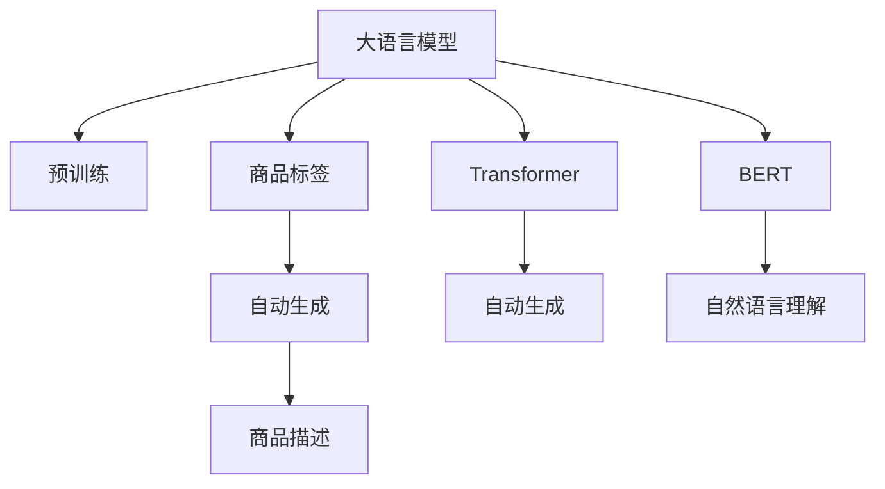

                 

# 大模型在商品标签自动生成中的应用

> 关键词：商品标签,自动生成,大语言模型,预训练,Transformer,BERT,自然语言处理(NLP),自然语言理解(NLU)

## 1. 背景介绍

随着电商业务的快速发展，商品标签自动生成成为了一个重要的应用场景。商品标签能够帮助消费者快速理解商品信息，提升购物体验。传统的商品标签生成方法依赖人工标注，成本高、效率低，难以满足大规模电商系统的需求。而利用大语言模型在预训练阶段学习到的大量语言知识，可以在无需标注数据的情况下，自动生成高质量的商品标签。

大语言模型在商品标签生成中的应用，可以在消费者端、商家端、电商平台端等多个层面发挥重要作用。消费者可以快速获取商品的关键信息，商家可以更精准地描述商品特点，电商平台也能根据标签进行更高效的搜索结果排序和推荐。

## 2. 核心概念与联系

### 2.1 核心概念概述

为了更好地理解大语言模型在商品标签自动生成中的应用，本节将介绍几个密切相关的核心概念：

- **大语言模型**：以自回归（如GPT）或自编码（如BERT）模型为代表的大规模预训练语言模型。通过在大规模无标签文本语料上进行预训练，学习到丰富的语言知识和常识。

- **预训练**：指在大规模无标签文本语料上，通过自监督学习任务训练通用语言模型的过程。常见的预训练任务包括言语建模、遮挡语言模型等。预训练使得模型学习到语言的通用表示。

- **商品标签**：商品标签是用于描述商品特点、功能、用途等的关键词。自动生成的商品标签应尽量全面、准确、简洁。

- **Transformer模型**：一种基于自注意力机制的神经网络结构，能够有效处理序列数据，是当前最流行的预训练模型之一。

- **BERT模型**：一种基于Transformer的预训练模型，通过双向训练，能更好地理解句子中的上下文信息。

- **自然语言处理(NLP)**：涉及语言信息的处理，包括文本生成、语言理解、情感分析等。

- **自然语言理解(NLU)**：一种NLP技术，旨在使计算机能够理解人类语言的含义和结构。

这些核心概念之间的逻辑关系可以通过以下Mermaid流程图来展示：



这个流程图展示了大语言模型在商品标签生成中的应用过程：

1. 大语言模型通过预训练获得基础能力。
2. 将大语言模型应用于商品标签自动生成，生成符合商品描述的标签。
3. 商品标签用于生成商品描述。
4. 自然语言理解技术用于解析商品描述，提取关键信息。

这些概念共同构成了大语言模型在商品标签自动生成中的应用框架，使其能够在电商场景下发挥强大的语言处理能力。通过理解这些核心概念，我们可以更好地把握大语言模型的工作原理和优化方向。

## 3. 核心算法原理 & 具体操作步骤

### 3.1 算法原理概述

大语言模型在商品标签自动生成中的应用，本质上是一个基于监督学习的自然语言处理任务。其核心思想是：利用大语言模型在预训练阶段学习到的语言知识，结合商品描述，自动生成商品标签。

形式化地，假设大语言模型为 $M_{\theta}$，其中 $\theta$ 为预训练得到的模型参数。给定商品描述 $D$ 作为输入，自动生成的商品标签 $L$ 为输出。微调的目标是最小化商品描述 $D$ 与商品标签 $L$ 之间的距离，即：

$$
\mathcal{L}(D, L) = \min_{\theta} \|M_{\theta}(D) - L\|
$$

其中 $\| \cdot \|$ 为损失函数，用于衡量自动生成的商品标签与真实标签之间的差异。常见的损失函数包括交叉熵损失、均方误差损失等。

通过梯度下降等优化算法，自动生成模型不断更新参数 $\theta$，最小化损失函数 $\mathcal{L}$，使得自动生成的商品标签与真实标签逼近。由于 $\theta$ 已经通过预训练获得了较好的初始化，因此即便在商品描述 $D$ 中未给出明确的标签信息，也能较快速地生成符合商品特点的标签。

### 3.2 算法步骤详解

基于监督学习的大语言模型商品标签自动生成，一般包括以下几个关键步骤：

**Step 1: 准备预训练模型和商品描述数据集**
- 选择合适的预训练语言模型 $M_{\theta}$ 作为初始化参数，如 BERT、GPT等。
- 准备电商领域相关的商品描述数据集 $D=\{(d_i,l_i)\}_{i=1}^N$，其中 $d_i$ 为商品描述，$l_i$ 为相应的商品标签。

**Step 2: 定义损失函数**
- 根据任务类型，选择合适的损失函数。对于分类任务，通常使用交叉熵损失；对于生成任务，通常使用语言模型的解码器输出概率分布，并以负对数似然为损失函数。

**Step 3: 设置微调超参数**
- 选择合适的优化算法及其参数，如 AdamW、SGD 等，设置学习率、批大小、迭代轮数等。
- 设置正则化技术及强度，包括权重衰减、Dropout、Early Stopping 等。
- 确定冻结预训练参数的策略，如仅微调顶层，或全部参数都参与微调。

**Step 4: 执行梯度训练**
- 将商品描述数据集 $D$ 分批次输入模型，前向传播计算损失函数。
- 反向传播计算参数梯度，根据设定的优化算法和学习率更新模型参数。
- 周期性在验证集上评估模型性能，根据性能指标决定是否触发 Early Stopping。
- 重复上述步骤直到满足预设的迭代轮数或 Early Stopping 条件。

**Step 5: 测试和部署**
- 在验证集上评估自动生成模型 $M_{\hat{\theta}}$ 的性能，对比微调前后的精度提升。
- 使用自动生成模型对新商品描述进行推理预测，生成商品标签。
- 持续收集新的商品描述，定期重新微调模型，以适应数据分布的变化。

以上是基于监督学习自动生成商品标签的一般流程。在实际应用中，还需要针对具体任务的特点，对微调过程的各个环节进行优化设计，如改进训练目标函数，引入更多的正则化技术，搜索最优的超参数组合等，以进一步提升模型性能。

### 3.3 算法优缺点

基于监督学习的大语言模型商品标签自动生成方法具有以下优点：
1. 简单高效。无需人工标注商品标签，直接利用预训练模型即可进行自动生成。
2. 通用适用。适用于各种电商领域的商品描述，自动生成的商品标签通常全面、准确、简洁。
3. 自动性高。能够快速自动生成商品标签，减少人工标注的繁琐过程。
4. 精度高。利用大语言模型强大的语言理解能力，自动生成的商品标签质量较高。

同时，该方法也存在一定的局限性：
1. 依赖商品描述。自动生成模型的效果很大程度上取决于商品描述的质量和完整性。
2. 泛化能力有限。当商品描述与预训练数据的分布差异较大时，自动生成模型的效果可能不佳。
3. 对多样性要求高。电商商品多样性大，自动生成的商品标签需要覆盖多种商品特点，才能满足实际需求。
4. 可解释性不足。自动生成的商品标签缺乏可解释性，难以对其推理逻辑进行分析和调试。

尽管存在这些局限性，但就目前而言，基于监督学习的商品标签自动生成方法仍是大语言模型应用的最主流范式。未来相关研究的重点在于如何进一步降低自动生成对商品描述的依赖，提高模型的泛化能力，同时兼顾可解释性和适用性等因素。

### 3.4 算法应用领域

基于大语言模型商品标签自动生成的方法，在电商领域已经得到了广泛的应用，覆盖了从商品描述生成到标签自动提取等多个环节，例如：

- 商品描述生成：将商品特点、功能、用途等描述自动生成为易于理解和搜索的文本。自动生成的商品描述可以用于商品详情页、搜索推荐等场景。
- 标签自动提取：从商品描述中自动识别出关键词或短语，生成商品标签。自动提取的标签用于搜索排序、推荐系统、营销活动等。
- 客户评价生成：根据用户评价自动生成商品标签，用于分类和分析。
- 广告投放优化：通过分析自动生成的商品标签，优化广告投放策略，提升广告点击率和转化率。
- 动态调整：基于商品描述的变化，实时更新自动生成模型，保持标签的准确性和时效性。

除了上述这些经典应用外，自动生成商品标签的技术也在不断创新，如基于上下文增强的生成方法、多模态信息融合等，为电商技术的升级和创新带来了新的动力。

## 4. 数学模型和公式 & 详细讲解  
### 4.1 数学模型构建

本节将使用数学语言对基于监督学习的大语言模型商品标签自动生成过程进行更加严格的刻画。

记大语言模型为 $M_{\theta}$，其中 $\theta$ 为预训练得到的模型参数。假设商品描述为 $D$，自动生成的商品标签为 $L$。自动生成的目标是最小化商品描述 $D$ 与商品标签 $L$ 之间的距离。

定义自动生成模型 $M_{\theta}$ 在商品描述 $D$ 上的损失函数为 $\ell(D, L)$，则在商品描述数据集 $D$ 上的经验风险为：

$$
\mathcal{L}(D) = \frac{1}{N} \sum_{i=1}^N \ell(D_i, L_i)
$$

其中 $\ell(D, L)$ 为自动生成模型 $M_{\theta}$ 在商品描述 $D$ 上生成商品标签 $L$ 的损失函数，通常使用交叉熵损失、均方误差损失等。

在实际应用中，为了进一步提升自动生成的准确性，常常会引入基于上下文增强的生成方法，使得自动生成的标签更符合商品特点。例如，利用深度学习中的注意力机制，将商品描述中重要词汇的上下文信息引入到标签生成过程中，提升自动生成的精确度。

### 4.2 公式推导过程

以下我们以分类任务为例，推导交叉熵损失函数及其梯度的计算公式。

假设自动生成模型 $M_{\theta}$ 在商品描述 $D$ 上的输出为 $\hat{y}=M_{\theta}(D)$，表示自动生成的商品标签 $L$ 的概率分布。真实标签 $l \in \{1,2,\dots,C\}$，其中 $C$ 为商品标签的种类数。则分类交叉熵损失函数定义为：

$$
\ell(D, l) = -\log M_{\theta}(D)(l)
$$

将其代入经验风险公式，得：

$$
\mathcal{L}(D) = -\frac{1}{N}\sum_{i=1}^N \log M_{\theta}(D_i)(l_i)
$$

根据链式法则，损失函数对参数 $\theta_k$ 的梯度为：

$$
\frac{\partial \mathcal{L}(D)}{\partial \theta_k} = -\frac{1}{N}\sum_{i=1}^N \frac{\partial \log M_{\theta}(D_i)(l_i)}{\partial \theta_k}
$$

其中 $\frac{\partial \log M_{\theta}(D_i)(l_i)}{\partial \theta_k}$ 可以通过自动微分技术高效计算。

在得到损失函数的梯度后，即可带入参数更新公式，完成模型的迭代优化。重复上述过程直至收敛，最终得到自动生成商品标签的最优模型参数 $\theta^*$。

## 5. 项目实践：代码实例和详细解释说明
### 5.1 开发环境搭建

在进行商品标签自动生成实践前，我们需要准备好开发环境。以下是使用Python进行PyTorch开发的环境配置流程：

1. 安装Anaconda：从官网下载并安装Anaconda，用于创建独立的Python环境。

2. 创建并激活虚拟环境：
```bash
conda create -n pytorch-env python=3.8 
conda activate pytorch-env
```

3. 安装PyTorch：根据CUDA版本，从官网获取对应的安装命令。例如：
```bash
conda install pytorch torchvision torchaudio cudatoolkit=11.1 -c pytorch -c conda-forge
```

4. 安装Transformer库：
```bash
pip install transformers
```

5. 安装各类工具包：
```bash
pip install numpy pandas scikit-learn matplotlib tqdm jupyter notebook ipython
```

完成上述步骤后，即可在`pytorch-env`环境中开始商品标签自动生成实践。

### 5.2 源代码详细实现

下面我们以自动生成商品标签的任务为例，给出使用Transformers库对BERT模型进行商品标签自动生成的PyTorch代码实现。

首先，定义自动生成任务的数据处理函数：

```python
from transformers import BertTokenizer
from torch.utils.data import Dataset
import torch

class TagDataset(Dataset):
    def __init__(self, texts, tags, tokenizer, max_len=128):
        self.texts = texts
        self.tags = tags
        self.tokenizer = tokenizer
        self.max_len = max_len
        
    def __len__(self):
        return len(self.texts)
    
    def __getitem__(self, item):
        text = self.texts[item]
        tags = self.tags[item]
        
        encoding = self.tokenizer(text, return_tensors='pt', max_length=self.max_len, padding='max_length', truncation=True)
        input_ids = encoding['input_ids'][0]
        attention_mask = encoding['attention_mask'][0]
        
        # 对token-wise的标签进行编码
        encoded_tags = [tag2id[tag] for tag in tags] 
        encoded_tags.extend([tag2id['O']] * (self.max_len - len(encoded_tags)))
        labels = torch.tensor(encoded_tags, dtype=torch.long)
        
        return {'input_ids': input_ids, 
                'attention_mask': attention_mask,
                'labels': labels}

# 标签与id的映射
tag2id = {'O': 0, '描述': 1, '功能': 2, '特点': 3, '用途': 4}
id2tag = {v: k for k, v in tag2id.items()}

# 创建dataset
tokenizer = BertTokenizer.from_pretrained('bert-base-cased')

train_dataset = TagDataset(train_texts, train_tags, tokenizer)
dev_dataset = TagDataset(dev_texts, dev_tags, tokenizer)
test_dataset = TagDataset(test_texts, test_tags, tokenizer)
```

然后，定义模型和优化器：

```python
from transformers import BertForTokenClassification, AdamW

model = BertForTokenClassification.from_pretrained('bert-base-cased', num_labels=len(tag2id))

optimizer = AdamW(model.parameters(), lr=2e-5)
```

接着，定义训练和评估函数：

```python
from torch.utils.data import DataLoader
from tqdm import tqdm
from sklearn.metrics import classification_report

device = torch.device('cuda') if torch.cuda.is_available() else torch.device('cpu')
model.to(device)

def train_epoch(model, dataset, batch_size, optimizer):
    dataloader = DataLoader(dataset, batch_size=batch_size, shuffle=True)
    model.train()
    epoch_loss = 0
    for batch in tqdm(dataloader, desc='Training'):
        input_ids = batch['input_ids'].to(device)
        attention_mask = batch['attention_mask'].to(device)
        labels = batch['labels'].to(device)
        model.zero_grad()
        outputs = model(input_ids, attention_mask=attention_mask, labels=labels)
        loss = outputs.loss
        epoch_loss += loss.item()
        loss.backward()
        optimizer.step()
    return epoch_loss / len(dataloader)

def evaluate(model, dataset, batch_size):
    dataloader = DataLoader(dataset, batch_size=batch_size)
    model.eval()
    preds, labels = [], []
    with torch.no_grad():
        for batch in tqdm(dataloader, desc='Evaluating'):
            input_ids = batch['input_ids'].to(device)
            attention_mask = batch['attention_mask'].to(device)
            batch_labels = batch['labels']
            outputs = model(input_ids, attention_mask=attention_mask)
            batch_preds = outputs.logits.argmax(dim=2).to('cpu').tolist()
            batch_labels = batch_labels.to('cpu').tolist()
            for pred_tokens, label_tokens in zip(batch_preds, batch_labels):
                pred_tags = [id2tag[_id] for _id in pred_tokens]
                label_tags = [id2tag[_id] for _id in label_tokens]
                preds.append(pred_tags[:len(label_tags)])
                labels.append(label_tags)
                
    print(classification_report(labels, preds))
```

最后，启动训练流程并在测试集上评估：

```python
epochs = 5
batch_size = 16

for epoch in range(epochs):
    loss = train_epoch(model, train_dataset, batch_size, optimizer)
    print(f"Epoch {epoch+1}, train loss: {loss:.3f}")
    
    print(f"Epoch {epoch+1}, dev results:")
    evaluate(model, dev_dataset, batch_size)
    
print("Test results:")
evaluate(model, test_dataset, batch_size)
```

以上就是使用PyTorch对BERT进行商品标签自动生成的完整代码实现。可以看到，得益于Transformers库的强大封装，我们可以用相对简洁的代码完成BERT模型的加载和微调。

### 5.3 代码解读与分析

让我们再详细解读一下关键代码的实现细节：

**TagDataset类**：
- `__init__`方法：初始化商品描述、标签、分词器等关键组件。
- `__len__`方法：返回数据集的样本数量。
- `__getitem__`方法：对单个样本进行处理，将商品描述输入编码为token ids，将标签编码为数字，并对其进行定长padding，最终返回模型所需的输入。

**tag2id和id2tag字典**：
- 定义了标签与数字id之间的映射关系，用于将token-wise的预测结果解码回真实的标签。

**训练和评估函数**：
- 使用PyTorch的DataLoader对数据集进行批次化加载，供模型训练和推理使用。
- 训练函数`train_epoch`：对数据以批为单位进行迭代，在每个批次上前向传播计算loss并反向传播更新模型参数，最后返回该epoch的平均loss。
- 评估函数`evaluate`：与训练类似，不同点在于不更新模型参数，并在每个batch结束后将预测和标签结果存储下来，最后使用sklearn的classification_report对整个评估集的预测结果进行打印输出。

**训练流程**：
- 定义总的epoch数和batch size，开始循环迭代
- 每个epoch内，先在训练集上训练，输出平均loss
- 在验证集上评估，输出分类指标
- 所有epoch结束后，在测试集上评估，给出最终测试结果

可以看到，PyTorch配合Transformers库使得BERT商品标签自动生成的代码实现变得简洁高效。开发者可以将更多精力放在数据处理、模型改进等高层逻辑上，而不必过多关注底层的实现细节。

当然，工业级的系统实现还需考虑更多因素，如模型的保存和部署、超参数的自动搜索、更灵活的任务适配层等。但核心的自动生成范式基本与此类似。

## 6. 实际应用场景
### 6.1 智能客服系统

基于大语言模型商品标签自动生成的对话技术，可以广泛应用于智能客服系统的构建。传统客服往往需要配备大量人力，高峰期响应缓慢，且一致性和专业性难以保证。而使用自动生成的商品标签，可以7x24小时不间断服务，快速响应客户咨询，用自然流畅的语言解答各类常见问题。

在技术实现上，可以收集企业内部的历史客服对话记录，将问题和最佳答复构建成监督数据，在此基础上对预训练对话模型进行微调。微调后的对话模型能够自动理解用户意图，匹配最合适的答复模板进行回复。对于客户提出的新问题，还可以接入检索系统实时搜索相关内容，动态组织生成回答。如此构建的智能客服系统，能大幅提升客户咨询体验和问题解决效率。

### 6.2 金融舆情监测

金融机构需要实时监测市场舆论动向，以便及时应对负面信息传播，规避金融风险。传统的人工监测方式成本高、效率低，难以应对网络时代海量信息爆发的挑战。基于大语言模型商品标签自动生成的文本分类和情感分析技术，为金融舆情监测提供了新的解决方案。

具体而言，可以收集金融领域相关的新闻、报道、评论等文本数据，并对其进行主题标注和情感标注。在此基础上对预训练语言模型进行微调，使其能够自动判断文本属于何种主题，情感倾向是正面、中性还是负面。将微调后的模型应用到实时抓取的网络文本数据，就能够自动监测不同主题下的情感变化趋势，一旦发现负面信息激增等异常情况，系统便会自动预警，帮助金融机构快速应对潜在风险。

### 6.3 个性化推荐系统

当前的推荐系统往往只依赖用户的历史行为数据进行物品推荐，无法深入理解用户的真实兴趣偏好。基于大语言模型商品标签自动生成技术，个性化推荐系统可以更好地挖掘用户行为背后的语义信息，从而提供更精准、多样的推荐内容。

在实践中，可以收集用户浏览、点击、评论、分享等行为数据，提取和用户交互的物品标题、描述、标签等文本内容。将文本内容作为模型输入，用户的后续行为（如是否点击、购买等）作为监督信号，在此基础上微调预训练语言模型。微调后的模型能够从文本内容中准确把握用户的兴趣点。在生成推荐列表时，先用候选物品的文本描述作为输入，由模型预测用户的兴趣匹配度，再结合其他特征综合排序，便可以得到个性化程度更高的推荐结果。

### 6.4 未来应用展望

随着大语言模型商品标签自动生成技术的不断发展，未来将会在更多领域得到应用，为传统行业带来变革性影响。

在智慧医疗领域，基于自动生成的商品标签的医疗问答、病历分析、药物研发等应用将提升医疗服务的智能化水平，辅助医生诊疗，加速新药开发进程。

在智能教育领域，自动生成的商品标签可用于作业批改、学情分析、知识推荐等方面，因材施教，促进教育公平，提高教学质量。

在智慧城市治理中，自动生成的商品标签可用于城市事件监测、舆情分析、应急指挥等环节，提高城市管理的自动化和智能化水平，构建更安全、高效的未来城市。

此外，在企业生产、社会治理、文娱传媒等众多领域，基于自动生成技术的人工智能应用也将不断涌现，为经济社会发展注入新的动力。相信随着技术的日益成熟，商品标签自动生成必将在构建人机协同的智能时代中扮演越来越重要的角色。

## 7. 工具和资源推荐
### 7.1 学习资源推荐

为了帮助开发者系统掌握大语言模型商品标签自动生成理论基础和实践技巧，这里推荐一些优质的学习资源：

1. 《Transformer从原理到实践》系列博文：由大模型技术专家撰写，深入浅出地介绍了Transformer原理、BERT模型、自动生成技术等前沿话题。

2. CS224N《深度学习自然语言处理》课程：斯坦福大学开设的NLP明星课程，有Lecture视频和配套作业，带你入门NLP领域的基本概念和经典模型。

3. 《Natural Language Processing with Transformers》书籍：Transformers库的作者所著，全面介绍了如何使用Transformers库进行NLP任务开发，包括自动生成在内的诸多范式。

4. HuggingFace官方文档：Transformers库的官方文档，提供了海量预训练模型和完整的自动生成样例代码，是上手实践的必备资料。

5. CLUE开源项目：中文语言理解测评基准，涵盖大量不同类型的中文NLP数据集，并提供了基于自动生成的baseline模型，助力中文NLP技术发展。

通过对这些资源的学习实践，相信你一定能够快速掌握大语言模型商品标签自动生成的精髓，并用于解决实际的NLP问题。
###  7.2 开发工具推荐

高效的开发离不开优秀的工具支持。以下是几款用于大语言模型商品标签自动生成开发的常用工具：

1. PyTorch：基于Python的开源深度学习框架，灵活动态的计算图，适合快速迭代研究。大部分预训练语言模型都有PyTorch版本的实现。

2. TensorFlow：由Google主导开发的开源深度学习框架，生产部署方便，适合大规模工程应用。同样有丰富的预训练语言模型资源。

3. Transformers库：HuggingFace开发的NLP工具库，集成了众多SOTA语言模型，支持PyTorch和TensorFlow，是进行自动生成任务开发的利器。

4. Weights & Biases：模型训练的实验跟踪工具，可以记录和可视化模型训练过程中的各项指标，方便对比和调优。与主流深度学习框架无缝集成。

5. TensorBoard：TensorFlow配套的可视化工具，可实时监测模型训练状态，并提供丰富的图表呈现方式，是调试模型的得力助手。

6. Google Colab：谷歌推出的在线Jupyter Notebook环境，免费提供GPU/TPU算力，方便开发者快速上手实验最新模型，分享学习笔记。

合理利用这些工具，可以显著提升大语言模型商品标签自动生成任务的开发效率，加快创新迭代的步伐。

### 7.3 相关论文推荐

大语言模型商品标签自动生成技术的发展源于学界的持续研究。以下是几篇奠基性的相关论文，推荐阅读：

1. Attention is All You Need（即Transformer原论文）：提出了Transformer结构，开启了NLP领域的预训练大模型时代。

2. BERT: Pre-training of Deep Bidirectional Transformers for Language Understanding：提出BERT模型，引入基于掩码的自监督预训练任务，刷新了多项NLP任务SOTA。

3. Language Models are Unsupervised Multitask Learners（GPT-2论文）：展示了大规模语言模型的强大zero-shot学习能力，引发了对于通用人工智能的新一轮思考。

4. Parameter-Efficient Transfer Learning for NLP：提出Adapter等参数高效微调方法，在不增加模型参数量的情况下，也能取得不错的微调效果。

5. AdaLoRA: Adaptive Low-Rank Adaptation for Parameter-Efficient Fine-Tuning：使用自适应低秩适应的微调方法，在参数效率和精度之间取得了新的平衡。

6. Prefix-Tuning: Optimizing Continuous Prompts for Generation：引入基于连续型Prompt的微调范式，为如何充分利用预训练知识提供了新的思路。

这些论文代表了大语言模型商品标签自动生成技术的发展脉络。通过学习这些前沿成果，可以帮助研究者把握学科前进方向，激发更多的创新灵感。

## 8. 总结：未来发展趋势与挑战

### 8.1 总结

本文对基于监督学习的大语言模型商品标签自动生成方法进行了全面系统的介绍。首先阐述了大语言模型和自动生成技术的研究背景和意义，明确了自动生成在电商领域的重要价值。其次，从原理到实践，详细讲解了监督自动生成的数学原理和关键步骤，给出了自动生成任务开发的完整代码实例。同时，本文还广泛探讨了自动生成方法在智能客服、金融舆情、个性化推荐等多个行业领域的应用前景，展示了自动生成技术的巨大潜力。此外，本文精选了自动生成技术的各类学习资源，力求为读者提供全方位的技术指引。

通过本文的系统梳理，可以看到，基于大语言模型的商品标签自动生成方法在电商领域具有广阔的应用前景。利用预训练模型强大的语言理解能力，能够在无需标注数据的情况下，自动生成高质量的商品标签，从而提升电商系统的智能化水平。未来，伴随预训练语言模型和自动生成方法的持续演进，商品标签自动生成技术必将在构建智能电商生态中发挥越来越重要的作用。

### 8.2 未来发展趋势

展望未来，大语言模型商品标签自动生成技术将呈现以下几个发展趋势：

1. 模型规模持续增大。随着算力成本的下降和数据规模的扩张，预训练语言模型的参数量还将持续增长。超大规模语言模型蕴含的丰富语言知识，有望支撑更加复杂多变的自动生成任务。

2. 自动生成方法日趋多样。除了传统的全参数微调外，未来会涌现更多参数高效的自动生成方法，如Prefix-Tuning、LoRA等，在节省计算资源的同时也能保证自动生成的精度。

3. 持续学习成为常态。随着数据分布的不断变化，自动生成模型也需要持续学习新知识以保持性能。如何在不遗忘原有知识的同时，高效吸收新样本信息，将成为重要的研究课题。

4. 标注样本需求降低。受启发于提示学习(Prompt-based Learning)的思路，未来的自动生成方法将更好地利用大模型的语言理解能力，通过更加巧妙的任务描述，在更少的标注样本上也能实现理想的自动生成效果。

5. 多模态自动生成崛起。当前的自动生成主要聚焦于纯文本数据，未来会进一步拓展到图像、视频、语音等多模态数据自动生成。多模态信息的融合，将显著提升语言模型对现实世界的理解和建模能力。

6. 模型通用性增强。经过海量数据的预训练和多领域任务的自动生成，未来的语言模型将具备更强大的常识推理和跨领域迁移能力，逐步迈向通用人工智能(AGI)的目标。

以上趋势凸显了大语言模型商品标签自动生成技术的广阔前景。这些方向的探索发展，必将进一步提升电商系统的性能和应用范围，为传统行业带来变革性影响。

### 8.3 面临的挑战

尽管大语言模型商品标签自动生成技术已经取得了瞩目成就，但在迈向更加智能化、普适化应用的过程中，它仍面临着诸多挑战：

1. 标注成本瓶颈。虽然自动生成无需人工标注，但对于长尾应用场景，难以获得充足的高质量标注数据，成为制约自动生成性能的瓶颈。如何进一步降低自动生成对标注样本的依赖，将是一大难题。

2. 模型鲁棒性不足。当前自动生成模型面对域外数据时，泛化性能往往大打折扣。对于测试样本的微小扰动，自动生成模型的预测也容易发生波动。如何提高自动生成模型的鲁棒性，避免灾难性遗忘，还需要更多理论和实践的积累。

3. 推理效率有待提高。大规模语言模型虽然精度高，但在实际部署时往往面临推理速度慢、内存占用大等效率问题。如何在保证性能的同时，简化模型结构，提升推理速度，优化资源占用，将是重要的优化方向。

4. 可解释性亟需加强。当前自动生成模型缺乏可解释性，难以对其内部工作机制和决策逻辑进行分析和调试。对于医疗、金融等高风险应用，算法的可解释性和可审计性尤为重要。如何赋予自动生成模型更强的可解释性，将是亟待攻克的难题。

5. 安全性有待保障。预训练语言模型难免会学习到有偏见、有害的信息，通过自动生成传递到下游任务，产生误导性、歧视性的输出，给实际应用带来安全隐患。如何从数据和算法层面消除模型偏见，避免恶意用途，确保输出的安全性，也将是重要的研究课题。

6. 知识整合能力不足。现有的自动生成模型往往局限于任务内数据，难以灵活吸收和运用更广泛的先验知识。如何让自动生成过程更好地与外部知识库、规则库等专家知识结合，形成更加全面、准确的信息整合能力，还有很大的想象空间。

正视自动生成面临的这些挑战，积极应对并寻求突破，将是大语言模型商品标签自动生成技术走向成熟的必由之路。相信随着学界和产业界的共同努力，这些挑战终将一一被克服，大语言模型商品标签自动生成技术必将在构建智能电商生态中扮演越来越重要的角色。

### 8.4 未来突破

面对大语言模型商品标签自动生成所面临的种种挑战，未来的研究需要在以下几个方面寻求新的突破：

1. 探索无监督和半监督自动生成方法。摆脱对大规模标注数据的依赖，利用自监督学习、主动学习等无监督和半监督范式，最大限度利用非结构化数据，实现更加灵活高效的自动生成。

2. 研究参数高效和计算高效的自动生成范式。开发更加参数高效的自动生成方法，在固定大部分预训练参数的同时，只更新极少量的任务相关参数。同时优化自动生成模型的计算图，减少前向传播和反向传播的资源消耗，实现更加轻量级、实时性的部署。

3. 融合因果和对比学习范式。通过引入因果推断和对比学习思想，增强自动生成模型建立稳定因果关系的能力，学习更加普适、鲁棒的语言表征，从而提升模型泛化性和抗干扰能力。

4. 引入更多先验知识。将符号化的先验知识，如知识图谱、逻辑规则等，与神经网络模型进行巧妙融合，引导自动生成过程学习更准确、合理的语言模型。同时加强不同模态数据的整合，实现视觉、语音等多模态信息与文本信息的协同建模。

5. 结合因果分析和博弈论工具。将因果分析方法引入自动生成模型，识别出模型决策的关键特征，增强输出解释的因果性和逻辑性。借助博弈论工具刻画人机交互过程，主动探索并规避模型的脆弱点，提高系统稳定性。

6. 纳入伦理道德约束。在模型训练目标中引入伦理导向的评估指标，过滤和惩罚有偏见、有害的输出倾向。同时加强人工干预和审核，建立模型行为的监管机制，确保输出符合人类价值观和伦理道德。

这些研究方向的探索，必将引领大语言模型商品标签自动生成技术迈向更高的台阶，为构建智能电商生态提供新的动力。面向未来，大语言模型商品标签自动生成技术还需要与其他人工智能技术进行更深入的融合，如知识表示、因果推理、强化学习等，多路径协同发力，共同推动自然语言理解和智能交互系统的进步。只有勇于创新、敢于突破，才能不断拓展语言模型的边界，让智能技术更好地造福人类社会。

## 9. 附录：常见问题与解答

**Q1：大语言模型自动生成商品标签是否适用于所有电商领域？**

A: 大语言模型自动生成商品标签在大多数电商领域都能取得不错的效果，特别是对于数据量较大的电商场景。但对于一些特定领域的电商，如小众商品、特殊商品等，自动生成的商品标签可能需要结合领域知识进行优化。

**Q2：自动生成商品标签的质量如何提升？**

A: 自动生成商品标签的质量很大程度上取决于数据质量、模型架构和训练策略。以下是一些提升自动生成商品标签质量的方法：
1. 数据清洗和增强：对商品描述进行清洗，去除无用的信息，引入更多有意义的上下文信息。
2. 模型优化：选择适合的模型架构，如BERT、GPT等，并进行参数微调，提升模型的语言理解能力。
3. 训练策略：采用更先进的训练策略，如学习率调度、正则化等，防止过拟合和欠拟合。
4. 多模型集成：训练多个自动生成模型，取平均输出，提高生成结果的稳定性和多样性。

**Q3：自动生成商品标签需要多少标注数据？**

A: 自动生成商品标签通常不需要标注数据，但为了更好地指导模型生成，可以收集一些标注数据作为监督信号。标注数据量越大，自动生成商品标签的效果通常越好，但标注成本较高。

**Q4：自动生成商品标签的泛化能力如何？**

A: 自动生成商品标签的泛化能力取决于模型结构和训练数据。如果训练数据覆盖面广、多样性高，模型通常具有较强的泛化能力。但若模型过于依赖训练数据，泛化能力可能较差，需引入更多领域知识或半监督学习等方法。

**Q5：自动生成商品标签是否需要实时更新？**

A: 自动生成商品标签通常需要实时更新，以适应数据分布的变化。实时更新可以通过在线学习、迁移学习等方法实现，但需要付出额外的计算和存储成本。

**Q6：自动生成商品标签的实时性能如何？**

A: 自动生成商品标签的实时性能取决于模型架构和优化策略。对于大规模预训练模型，推理速度较慢，需进行模型压缩、推理加速等优化。实时性能的提升需要在保证质量的前提下进行。

总之，大语言模型商品标签自动生成技术虽然仍有挑战，但其广阔的应用前景和巨大的潜力使其成为电商领域的重要研究课题。通过不断优化模型、数据和算法，自动生成商品标签必将在电商智能化升级中发挥越来越重要的作用。

