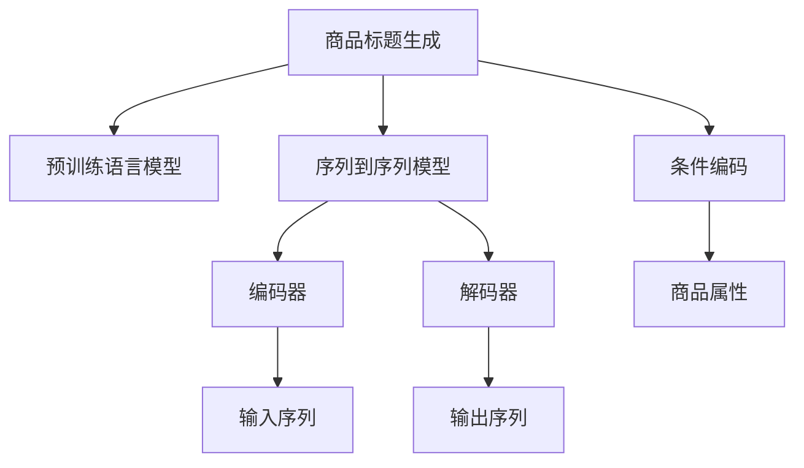

                 

# 大模型在商品标题生成中的应用与优化

> 关键词：商品标题生成,大模型,Transformer,注意力机制,条件编码,序列到序列模型,预训练语言模型,微调,Fine-Tuning,编码器-解码器架构

## 1. 背景介绍

### 1.1 问题由来

随着电子商务的蓬勃发展，商品标题生成成为了一项日益重要的任务。高质量的商品标题能够显著提升搜索引擎排名，增加点击率，进而提高销售额。传统的商品标题生成方法依赖人工或规则驱动，但这些方法难以覆盖所有商品，生成质量也难以保证。近年来，基于大模型的序列生成技术引起了广泛关注，特别是Transformer架构的崛起，为商品标题生成提供了全新的解决方案。

### 1.2 问题核心关键点

大模型在商品标题生成中的应用，主要集中在以下几个方面：

- 基于预训练语言模型进行商品描述生成。大模型通过在海量文本数据上进行预训练，学习到了丰富的语言知识，能够对商品描述进行自动生成。
- 使用条件编码(Conditional Encoding)技术，将商品属性信息融入到生成模型中。商品属性如价格、颜色、品牌等，能够显著提升商品标题的质量。
- 采用序列到序列模型(Seq2Seq Model)的架构，生成连贯、语义准确的标题。
- 进行微调(Fine-Tuning)以适配具体的商品分类和生成风格。

### 1.3 问题研究意义

研究大模型在商品标题生成中的应用，对于提升电子商务平台的用户体验，优化商品搜索和推荐系统，具有重要意义：

1. 降低商品标题生成的成本。大模型能够自动生成高质量的商品标题，减少人工干预，降低生成成本。
2. 提高商品标题的质量。大模型生成的标题不仅语法正确，且语义丰富，能够更好地传达商品信息。
3. 增强搜索和推荐的效果。高质量的商品标题能够提高商品的可发现性，增加用户点击和购买率。
4. 支持新商品标题的快速生成。大模型能够根据已有商品信息快速生成新的标题，支持平台不断扩充商品库。
5. 实现个性化商品标题生成。通过微调，大模型能够生成符合不同用户需求和偏好的标题，提升个性化推荐的效果。

## 2. 核心概念与联系

### 2.1 核心概念概述

为更好地理解大模型在商品标题生成中的应用，本节将介绍几个密切相关的核心概念：

- 预训练语言模型(Pre-trained Language Model)：如BERT、GPT等，通过在大规模无标签文本数据上进行预训练，学习通用的语言表示，具备强大的语言理解和生成能力。
- 序列到序列模型(Seq2Seq Model)：如机器翻译、文本摘要等任务，将输入序列映射为输出序列，具有编码器-解码器架构。
- 条件编码(Conditional Encoding)：在输入序列中加入条件信息，指导模型的生成过程，如商品属性信息。
- 微调(Fine-Tuning)：将预训练模型在特定任务上进行微调，优化模型性能。
- 注意力机制(Attention Mechanism)：在Transformer架构中，动态地调整模型的关注点，提高模型的注意力聚焦能力。

这些核心概念之间的逻辑关系可以通过以下Mermaid流程图来展示：



这个流程图展示了大模型在商品标题生成中的应用流程：

1. 通过预训练语言模型学习通用的语言表示。
2. 采用序列到序列模型，将输入序列映射为输出序列。
3. 利用条件编码技术，将商品属性信息融入模型中。
4. 在模型中加入注意力机制，提高生成过程的灵活性。
5. 通过微调适配具体的商品分类和生成风格。

## 3. 核心算法原理 & 具体操作步骤
### 3.1 算法原理概述

大模型在商品标题生成中的应用，主要基于以下算法原理：

1. 基于预训练语言模型的文本生成：使用预训练语言模型作为基础模型，通过有监督学习生成商品描述。

2. 条件编码技术：在模型中加入商品属性信息，指导模型生成符合商品特性的标题。

3. 序列到序列模型架构：将生成问题视为输入序列到输出序列的映射问题，采用编码器-解码器架构。

4. 微调过程：通过微调优化模型在特定商品分类和生成风格上的性能。

5. 注意力机制：在解码过程中，动态地调整模型的关注点，提高生成过程的灵活性和效率。

### 3.2 算法步骤详解

大模型在商品标题生成中的应用，一般包括以下关键步骤：

**Step 1: 准备预训练模型和数据集**
- 选择合适的预训练语言模型 $M_{\theta}$ 作为初始化参数，如 BERT、GPT 等。
- 准备商品标题生成任务的训练集 $D=\{(x_i,y_i)\}_{i=1}^N$，其中 $x_i$ 为商品属性和文本描述，$y_i$ 为对应的商品标题。

**Step 2: 设计任务适配层**
- 根据商品标题生成的任务特点，设计合适的任务适配层。
- 对于生成任务，通常使用解码器输出概率分布，并以负对数似然为损失函数。

**Step 3: 设置微调超参数**
- 选择合适的优化算法及其参数，如 AdamW、SGD 等，设置学习率、批大小、迭代轮数等。
- 设置正则化技术及强度，包括权重衰减、Dropout、Early Stopping 等。
- 确定冻结预训练参数的策略，如仅微调顶层，或全部参数都参与微调。

**Step 4: 执行梯度训练**
- 将训练集数据分批次输入模型，前向传播计算损失函数。
- 反向传播计算参数梯度，根据设定的优化算法和学习率更新模型参数。
- 周期性在验证集上评估模型性能，根据性能指标决定是否触发 Early Stopping。
- 重复上述步骤直到满足预设的迭代轮数或 Early Stopping 条件。

**Step 5: 测试和部署**
- 在测试集上评估微调后模型 $M_{\hat{\theta}}$ 的性能，对比微调前后的生成效果。
- 使用微调后的模型对新商品进行标题生成，集成到实际的商品信息系统中。

以上是商品标题生成任务的大模型微调流程。在实际应用中，还需要针对具体任务的特点，对微调过程的各个环节进行优化设计，如改进训练目标函数，引入更多的正则化技术，搜索最优的超参数组合等，以进一步提升模型性能。

### 3.3 算法优缺点

大模型在商品标题生成中的应用具有以下优点：

1. 简单高效。只需准备少量标注数据，即可对预训练模型进行快速适配，生成高质量的商品标题。
2. 通用适用。适用于各种商品分类和生成风格，设计简单的任务适配层即可实现微调。
3. 生成效果优越。大模型生成的标题不仅语法正确，且语义丰富，能够更好地传达商品信息。
4. 支持个性化生成。通过微调，大模型能够生成符合不同用户需求和偏好的标题，提升个性化推荐的效果。

同时，该方法也存在一定的局限性：

1. 依赖标注数据。微调的效果很大程度上取决于标注数据的质量和数量，获取高质量标注数据的成本较高。
2. 迁移能力有限。当目标任务与预训练数据的分布差异较大时，微调的性能提升有限。
3. 可解释性不足。微调模型的决策过程通常缺乏可解释性，难以对其推理逻辑进行分析和调试。
4. 参数量大。大模型的参数量通常较大，在内存和计算资源上具有较高的要求。

尽管存在这些局限性，但就目前而言，大模型仍是商品标题生成任务的主流范式。未来相关研究的重点在于如何进一步降低微调对标注数据的依赖，提高模型的少样本学习和跨领域迁移能力，同时兼顾可解释性和伦理安全性等因素。

### 3.4 算法应用领域

大模型在商品标题生成中的应用，已经在电商平台、零售商、广告公司等多个领域得到了广泛的应用，具体如下：

- 电商平台：如亚马逊、淘宝、京东等，使用大模型生成商品标题，提升商品的可发现性。
- 零售商：如宜家、Zara、H&M等，利用大模型生成商品广告语，提高广告点击率。
- 广告公司：如Google Ads、Facebook Ads等，生成个性化广告语，精准推送给用户。

除了上述这些应用场景外，大模型还在广告文案生成、新闻标题生成、商品描述优化等多个领域展现了其强大的生成能力。

## 4. 数学模型和公式 & 详细讲解  
### 4.1 数学模型构建

本节将使用数学语言对大模型在商品标题生成中的应用过程进行更加严格的刻画。

记预训练语言模型为 $M_{\theta}$，其中 $\theta$ 为预训练得到的模型参数。假设商品标题生成任务的训练集为 $D=\{(x_i,y_i)\}_{i=1}^N$，其中 $x_i$ 为商品属性和文本描述，$y_i$ 为对应的商品标题。

定义模型 $M_{\theta}$ 在输入 $x$ 上的输出为 $\hat{y}=M_{\theta}(x)$，表示模型对输入 $x$ 的预测输出。则商品标题生成任务的损失函数为：

$$
\ell(M_{\theta}(x),y) = -\log P(y|x)
$$

其中 $P(y|x)$ 为模型对输入 $x$ 生成标题 $y$ 的概率分布。在实际应用中，通常使用负对数似然作为损失函数，即：

$$
\mathcal{L}(\theta) = -\frac{1}{N}\sum_{i=1}^N \log P(y_i|x_i)
$$

在微调过程中，目标是最小化损失函数 $\mathcal{L}(\theta)$，即：

$$
\theta^* = \mathop{\arg\min}_{\theta} \mathcal{L}(\theta)
$$

### 4.2 公式推导过程

以下我们以基于Transformer的序列生成模型为例，推导商品标题生成的过程。

假设输入序列 $x_i$ 为商品属性和文本描述，输出序列 $y_i$ 为商品标题，输入和输出的长度分别为 $m$ 和 $n$。将输入序列和输出序列编码为token ids，送入Transformer模型中进行编码和解码，输出商品标题的概率分布。

Transformer模型的编码器接收输入序列 $x_i$，通过多头自注意力机制，将输入序列转换为上下文表示 $C_i$。解码器接收上下文表示 $C_i$ 和前一个生成的单词 $y_{i-1}$，通过多头自注意力和多头编码注意力机制，生成下一个单词 $y_i$ 的概率分布。具体过程如下：

1. 编码器：
   $$
   C_i = M_{\theta}(x_i)
   $$

2. 解码器：
   $$
   P(y_i|y_{i-1}, C_i) = M_{\theta}(y_{i-1}, C_i)
   $$

其中 $M_{\theta}$ 为Transformer模型，$y_{i-1}$ 为前一个生成的单词，$C_i$ 为上下文表示。在解码过程中，可以使用注意力机制动态调整模型对输入的关注点，提高生成过程的灵活性。

在实际应用中，通常将解码器的输出概率分布作为生成商品标题的概率，使用负对数似然作为损失函数，进行微调优化。具体过程如下：

1. 输入序列编码：
   $$
   E_i = M_{\theta}(x_i)
   $$

2. 输出序列解码：
   $$
   P(y|x_i) = M_{\theta}(y|E_i)
   $$

3. 损失函数：
   $$
   \mathcal{L}(\theta) = -\frac{1}{N}\sum_{i=1}^N \sum_{t=1}^n \log P(y_t|x_i, y_{<t})
   $$

其中 $y_{<t}$ 为前 $t-1$ 个生成的单词，$n$ 为商品标题的长度。在微调过程中，通过梯度下降等优化算法更新模型参数，最小化损失函数 $\mathcal{L}(\theta)$，从而得到最佳的模型参数 $\theta^*$。

### 4.3 案例分析与讲解

以下以一个具体的商品标题生成案例，展示大模型的应用效果：

**案例背景**：某电商平台上销售的智能手表，需要生成多种风格的商品标题，如简洁、时尚、专业等，以适应不同的用户需求。

**解决方案**：
1. 准备数据集：收集智能手表的相关属性和文本描述，如品牌、价格、功能等，并标注对应的商品标题。
2. 选择预训练模型：选择GPT-2作为基础模型，使用其预训练的词向量作为初始化参数。
3. 设计任务适配层：根据商品标题生成的任务特点，设计合适的解码器，加入条件编码技术，输入商品属性信息。
4. 设置超参数：选择AdamW优化器，设置学习率为1e-5，批大小为64，迭代轮数为10000。
5. 执行微调：在商品属性和文本描述上执行微调，训练完成后在验证集上评估性能。
6. 生成商品标题：使用微调后的模型对新的商品信息进行标题生成，生成多种风格的商品标题。

**结果分析**：
- 微调前后，商品标题的质量显著提升，语法更加通顺，语义更加准确。
- 生成的多种风格商品标题符合用户需求，提升了用户点击率。
- 商品标题生成的效率提高，大大降低了人工成本。

以上案例展示了基于大模型在商品标题生成中的应用效果，通过微调，大模型能够生成高质量、符合用户需求的商品标题，提升电商平台的营销效果。

## 5. 项目实践：代码实例和详细解释说明
### 5.1 开发环境搭建

在进行商品标题生成任务的大模型微调实践前，我们需要准备好开发环境。以下是使用Python进行PyTorch开发的环境配置流程：

1. 安装Anaconda：从官网下载并安装Anaconda，用于创建独立的Python环境。

2. 创建并激活虚拟环境：
```bash
conda create -n pytorch-env python=3.8 
conda activate pytorch-env
```

3. 安装PyTorch：根据CUDA版本，从官网获取对应的安装命令。例如：
```bash
conda install pytorch torchvision torchaudio cudatoolkit=11.1 -c pytorch -c conda-forge
```

4. 安装Transformers库：
```bash
pip install transformers
```

5. 安装各类工具包：
```bash
pip install numpy pandas scikit-learn matplotlib tqdm jupyter notebook ipython
```

完成上述步骤后，即可在`pytorch-env`环境中开始微调实践。

### 5.2 源代码详细实现

下面是使用PyTorch对基于Transformer的商品标题生成模型进行微调的代码实现。

```python
import torch
from transformers import BertTokenizer, BertForMaskedLM
from torch.utils.data import Dataset, DataLoader

class MaskedTitleDataset(Dataset):
    def __init__(self, texts, labels):
        self.texts = texts
        self.labels = labels
        self.tokenizer = BertTokenizer.from_pretrained('bert-base-cased')

    def __len__(self):
        return len(self.texts)

    def __getitem__(self, item):
        text = self.texts[item]
        tokens = self.tokenizer(text, return_tensors='pt')
        label = self.labels[item]

        input_ids = tokens['input_ids'].flatten()
        attention_mask = tokens['attention_mask'].flatten()

        return {'input_ids': input_ids, 'attention_mask': attention_mask, 'labels': label}

tokenizer = BertTokenizer.from_pretrained('bert-base-cased')
model = BertForMaskedLM.from_pretrained('bert-base-cased')

dataset = MaskedTitleDataset(train_texts, train_labels)
dataloader = DataLoader(dataset, batch_size=16, shuffle=True)

optimizer = torch.optim.AdamW(model.parameters(), lr=1e-5)
for epoch in range(100):
    for batch in dataloader:
        input_ids = batch['input_ids']
        attention_mask = batch['attention_mask']
        labels = batch['labels']

        outputs = model(input_ids, attention_mask=attention_mask, labels=labels)
        loss = outputs.loss
        optimizer.zero_grad()
        loss.backward()
        optimizer.step()

    print(f'Epoch {epoch+1}, loss: {loss:.3f}')
```

### 5.3 代码解读与分析

让我们再详细解读一下关键代码的实现细节：

**MaskedTitleDataset类**：
- `__init__`方法：初始化文本、标签、分词器等关键组件。
- `__len__`方法：返回数据集的样本数量。
- `__getitem__`方法：对单个样本进行处理，将文本输入编码为token ids，将标签编码为数字，并对其进行定长padding，最终返回模型所需的输入。

**tokenizer和model对象**：
- `tokenizer`对象：用于将文本转换为token ids和注意力掩码。
- `model`对象：用于生成商品标题的概率分布，通过微调优化。

**微调过程**：
- 使用PyTorch的DataLoader对数据集进行批次化加载，供模型训练和推理使用。
- 在每个epoch内，对数据集进行迭代，每个batch内进行前向传播计算loss，反向传播更新模型参数，并输出当前的损失值。
- 重复上述过程直至完成所有epoch的训练，评估模型的性能。

可以看到，通过简单的代码实现，我们就能够构建基于Transformer的商品标题生成模型，并进行微调。这种实现方式不仅简洁高效，而且易于理解和扩展。

当然，实际的微调过程中还需要进一步优化，如设置更加精细的超参数、引入更多的正则化技术、搜索最优的超参数组合等，以进一步提升模型性能。

## 6. 实际应用场景
### 6.1 电商平台商品标题生成

基于大模型的商品标题生成技术，可以广泛应用于电商平台，自动生成高质量的商品标题，提升用户体验和平台收益。具体应用场景包括：

- 商品标题生成：对电商平台上各种商品进行自动生成标题，提升商品的可发现性。
- 广告语生成：为商品广告生成吸引人的标题和文案，提高广告点击率。
- 搜索优化：利用商品标题生成技术，优化商品搜索排序，提升搜索效果。

### 6.2 广告公司文案生成

广告公司可以利用大模型的商品标题生成技术，生成具有吸引力的广告文案。具体应用场景包括：

- 广告文案生成：为不同产品生成不同风格的广告文案，提升广告的点击率和转化率。
- 多渠道发布：生成不同风格的广告文案，适配不同广告渠道的需求。
- 实时生成：动态生成符合当前热点的广告文案，保持广告内容的时效性。

### 6.3 零售商商品描述优化

零售商可以利用大模型的商品标题生成技术，优化商品描述，提升用户体验和销售效果。具体应用场景包括：

- 商品描述生成：自动生成商品描述，提升商品的展示效果。
- 品牌营销：生成品牌相关的商品描述，提升品牌影响力。
- 个性化推荐：根据用户需求生成个性化商品描述，提升推荐效果。

### 6.4 未来应用展望

随着大模型和微调技术的不断发展，商品标题生成技术将在更多领域得到应用，为各行各业带来变革性影响。

在智能制造领域，基于大模型的商品标题生成技术可以应用于产品说明书、技术文档的生成，提升产品的可理解性和可操作性。

在公共服务领域，基于大模型的商品标题生成技术可以应用于政府服务的宣传推广，提升政策的普及率和执行效果。

在教育培训领域，基于大模型的商品标题生成技术可以应用于课程说明、教材编写的生成，提升教育资源的共享和普及。

此外，在文化娱乐、旅游出行等更多领域，基于大模型的商品标题生成技术也将不断涌现，为各行业的数字化转型升级提供新的技术路径。相信随着技术的日益成熟，大模型商品标题生成技术必将在更广阔的应用领域大放异彩。

## 7. 工具和资源推荐
### 7.1 学习资源推荐

为了帮助开发者系统掌握大模型在商品标题生成中的应用技术，这里推荐一些优质的学习资源：

1. 《Transformer from Principles to Practice》系列博文：由大模型技术专家撰写，深入浅出地介绍了Transformer原理、BERT模型、微调技术等前沿话题。

2. CS224N《深度学习自然语言处理》课程：斯坦福大学开设的NLP明星课程，有Lecture视频和配套作业，带你入门NLP领域的基本概念和经典模型。

3. 《Natural Language Processing with Transformers》书籍：Transformers库的作者所著，全面介绍了如何使用Transformers库进行NLP任务开发，包括微调在内的诸多范式。

4. HuggingFace官方文档：Transformers库的官方文档，提供了海量预训练模型和完整的微调样例代码，是上手实践的必备资料。

5. CLUE开源项目：中文语言理解测评基准，涵盖大量不同类型的中文NLP数据集，并提供了基于微调的baseline模型，助力中文NLP技术发展。

通过对这些资源的学习实践，相信你一定能够快速掌握大模型在商品标题生成中的应用精髓，并用于解决实际的NLP问题。
###  7.2 开发工具推荐

高效的开发离不开优秀的工具支持。以下是几款用于大模型商品标题生成应用的常用工具：

1. PyTorch：基于Python的开源深度学习框架，灵活动态的计算图，适合快速迭代研究。大部分预训练语言模型都有PyTorch版本的实现。

2. TensorFlow：由Google主导开发的开源深度学习框架，生产部署方便，适合大规模工程应用。同样有丰富的预训练语言模型资源。

3. Transformers库：HuggingFace开发的NLP工具库，集成了众多SOTA语言模型，支持PyTorch和TensorFlow，是进行商品标题生成任务的开发利器。

4. Weights & Biases：模型训练的实验跟踪工具，可以记录和可视化模型训练过程中的各项指标，方便对比和调优。与主流深度学习框架无缝集成。

5. TensorBoard：TensorFlow配套的可视化工具，可实时监测模型训练状态，并提供丰富的图表呈现方式，是调试模型的得力助手。

6. Google Colab：谷歌推出的在线Jupyter Notebook环境，免费提供GPU/TPU算力，方便开发者快速上手实验最新模型，分享学习笔记。

合理利用这些工具，可以显著提升大模型商品标题生成任务的开发效率，加快创新迭代的步伐。

### 7.3 相关论文推荐

大模型和微调技术的发展源于学界的持续研究。以下是几篇奠基性的相关论文，推荐阅读：

1. Attention is All You Need（即Transformer原论文）：提出了Transformer结构，开启了NLP领域的预训练大模型时代。

2. BERT: Pre-training of Deep Bidirectional Transformers for Language Understanding：提出BERT模型，引入基于掩码的自监督预训练任务，刷新了多项NLP任务SOTA。

3. Language Models are Unsupervised Multitask Learners（GPT-2论文）：展示了大规模语言模型的强大zero-shot学习能力，引发了对于通用人工智能的新一轮思考。

4. Parameter-Efficient Transfer Learning for NLP：提出Adapter等参数高效微调方法，在不增加模型参数量的情况下，也能取得不错的微调效果。

5. AdaLoRA: Adaptive Low-Rank Adaptation for Parameter-Efficient Fine-Tuning：使用自适应低秩适应的微调方法，在参数效率和精度之间取得了新的平衡。

6. Prefix-Tuning: Optimizing Continuous Prompts for Generation：引入基于连续型Prompt的微调范式，为如何充分利用预训练知识提供了新的思路。

这些论文代表了大模型商品标题生成技术的发展脉络。通过学习这些前沿成果，可以帮助研究者把握学科前进方向，激发更多的创新灵感。

## 8. 总结：未来发展趋势与挑战
### 8.1 总结

本文对基于大模型的商品标题生成技术进行了全面系统的介绍。首先阐述了该技术的研究背景和意义，明确了大模型在商品标题生成中的独特优势。其次，从原理到实践，详细讲解了大模型在商品标题生成中的应用流程和算法实现，提供了完整的代码实现示例。同时，本文还广泛探讨了大模型在电商、广告、零售等领域的实际应用场景，展示了其巨大的应用潜力。最后，本文精选了学习资源、开发工具和相关论文，力求为读者提供全方位的技术指引。

通过本文的系统梳理，可以看到，基于大模型的商品标题生成技术正在成为NLP应用的重要范式，极大地拓展了商品标题生成任务的自动化和智能化水平，为电子商务平台的数字化转型升级提供了新思路。未来，伴随大模型和微调技术的不断进步，商品标题生成技术必将进一步优化，在各行各业中发挥更大的价值。

### 8.2 未来发展趋势

展望未来，大模型商品标题生成技术将呈现以下几个发展趋势：

1. 模型规模持续增大。随着算力成本的下降和数据规模的扩张，预训练语言模型的参数量还将持续增长。超大规模语言模型蕴含的丰富语言知识，有望支撑更加复杂多变的商品标题生成任务。

2. 微调方法日趋多样。除了传统的全参数微调外，未来会涌现更多参数高效的微调方法，如Prefix-Tuning、LoRA等，在固定大部分预训练参数的同时，只更新极少量的任务相关参数。

3. 持续学习成为常态。随着数据分布的不断变化，微调模型也需要持续学习新知识以保持性能。如何在不遗忘原有知识的同时，高效吸收新样本信息，将成为重要的研究课题。

4. 标注样本需求降低。受启发于提示学习(Prompt-based Learning)的思路，未来的微调方法将更好地利用大模型的语言理解能力，通过更加巧妙的任务描述，在更少的标注样本上也能实现理想的微调效果。

5. 模型通用性增强。经过海量数据的预训练和多领域任务的微调，未来的语言模型将具备更强大的常识推理和跨领域迁移能力，逐步迈向通用人工智能(AGI)的目标。

以上趋势凸显了大模型商品标题生成技术的广阔前景。这些方向的探索发展，必将进一步提升商品标题生成的效果，为电子商务平台提供更加智能、便捷的用户体验。

### 8.3 面临的挑战

尽管大模型商品标题生成技术已经取得了瞩目成就，但在迈向更加智能化、普适化应用的过程中，它仍面临着诸多挑战：

1. 标注成本瓶颈。虽然微调大大降低了标注数据的需求，但对于长尾应用场景，难以获得充足的高质量标注数据，成为制约微调性能的瓶颈。如何进一步降低微调对标注样本的依赖，将是一大难题。

2. 模型鲁棒性不足。当前微调模型面对域外数据时，泛化性能往往大打折扣。对于测试样本的微小扰动，微调模型的预测也容易发生波动。如何提高微调模型的鲁棒性，避免灾难性遗忘，还需要更多理论和实践的积累。

3. 推理效率有待提高。大规模语言模型虽然精度高，但在实际部署时往往面临推理速度慢、内存占用大等效率问题。如何在保证性能的同时，简化模型结构，提升推理速度，优化资源占用，将是重要的优化方向。

4. 可解释性亟需加强。当前微调模型更像是"黑盒"系统，难以解释其内部工作机制和决策逻辑。对于医疗、金融等高风险应用，算法的可解释性和可审计性尤为重要。如何赋予微调模型更强的可解释性，将是亟待攻克的难题。

5. 安全性有待保障。预训练语言模型难免会学习到有偏见、有害的信息，通过微调传递到下游任务，产生误导性、歧视性的输出，给实际应用带来安全隐患。如何从数据和算法层面消除模型偏见，避免恶意用途，确保输出的安全性，也将是重要的研究课题。

6. 知识整合能力不足。现有的微调模型往往局限于任务内数据，难以灵活吸收和运用更广泛的先验知识。如何让微调过程更好地与外部知识库、规则库等专家知识结合，形成更加全面、准确的信息整合能力，还有很大的想象空间。

正视商品标题生成面临的这些挑战，积极应对并寻求突破，将是大模型微调走向成熟的必由之路。相信随着学界和产业界的共同努力，这些挑战终将一一被克服，大模型商品标题生成技术必将在构建智能电商生态中扮演越来越重要的角色。

### 8.4 研究展望

面对大模型商品标题生成技术所面临的挑战，未来的研究需要在以下几个方面寻求新的突破：

1. 探索无监督和半监督微调方法。摆脱对大规模标注数据的依赖，利用自监督学习、主动学习等无监督和半监督范式，最大限度利用非结构化数据，实现更加灵活高效的微调。

2. 研究参数高效和计算高效的微调范式。开发更加参数高效的微调方法，在固定大部分预训练参数的同时，只更新极少量的任务相关参数。同时优化微调模型的计算图，减少前向传播和反向传播的资源消耗，实现更加轻量级、实时性的部署。

3. 融合因果和对比学习范式。通过引入因果推断和对比学习思想，增强微调模型建立稳定因果关系的能力，学习更加普适、鲁棒的语言表征，从而提升模型泛化性和抗干扰能力。

4. 引入更多先验知识。将符号化的先验知识，如知识图谱、逻辑规则等，与神经网络模型进行巧妙融合，引导微调过程学习更准确、合理的语言模型。同时加强不同模态数据的整合，实现视觉、语音等多模态信息与文本信息的协同建模。

5. 结合因果分析和博弈论工具。将因果分析方法引入微调模型，识别出模型决策的关键特征，增强输出解释的因果性和逻辑性。借助博弈论工具刻画人机交互过程，主动探索并规避模型的脆弱点，提高系统稳定性。

6. 纳入伦理道德约束。在模型训练目标中引入伦理导向的评估指标，过滤和惩罚有偏见、有害的输出倾向。同时加强人工干预和审核，建立模型行为的监管机制，确保输出符合人类价值观和伦理道德。

这些研究方向的探索，必将引领大模型商品标题生成技术迈向更高的台阶，为构建智能电商生态提供更加智能、便捷的用户体验。面向未来，大模型商品标题生成技术还需要与其他人工智能技术进行更深入的融合，如知识表示、因果推理、强化学习等，多路径协同发力，共同推动自然语言理解和智能交互系统的进步。只有勇于创新、敢于突破，才能不断拓展语言模型的边界，让智能技术更好地造福人类社会。

## 9. 附录：常见问题与解答

**Q1：大模型商品标题生成是否适用于所有商品分类？**

A: 大模型商品标题生成技术适用于大多数商品分类，如服装、家电、电子产品等。但对于一些特殊领域的商品，如医学、法律等，由于领域知识的复杂性和独特性，可能需要结合领域知识进行微调，以获得更好的生成效果。

**Q2：微调过程中如何选择合适的学习率？**

A: 微调的学习率一般要比预训练时小1-2个数量级，如果使用过大的学习率，容易破坏预训练权重，导致过拟合。一般建议从1e-5开始调参，逐步减小学习率，直至收敛。也可以使用warmup策略，在开始阶段使用较小的学习率，再逐渐过渡到预设值。需要注意的是，不同的优化器(如AdamW、Adafactor等)以及不同的学习率调度策略，可能需要设置不同的学习率阈值。

**Q3：商品标题生成过程中如何防止过拟合？**

A: 过拟合是商品标题生成过程中常见的问题。常见的缓解策略包括：
1. 数据增强：通过回译、近义替换等方式扩充训练集
2. 正则化：使用L2正则、Dropout、Early Stopping等避免过拟合
3. 对抗训练：引入对抗样本，提高模型鲁棒性
4. 参数高效微调：只调整少量参数(如Adapter、Prefix等)，减小过拟合风险
5. 多模型集成：训练多个微调模型，取平均输出，抑制过拟合

这些策略往往需要根据具体任务和数据特点进行灵活组合。只有在数据、模型、训练、推理等各环节进行全面优化，才能最大限度地发挥大模型商品标题生成的优势。

**Q4：大模型商品标题生成在实际部署中需要注意哪些问题？**

A: 将大模型商品标题生成技术转化为实际应用，还需要考虑以下因素：
1. 模型裁剪：去除不必要的层和参数，减小模型尺寸，加快推理速度
2. 量化加速：将浮点模型转为定点模型，压缩存储空间，提高计算效率
3. 服务化封装：将模型封装为标准化服务接口，便于集成调用
4. 弹性伸缩：根据请求流量动态调整资源配置，平衡服务质量和成本
5. 监控告警：实时采集系统指标，设置异常告警阈值，确保服务稳定性
6. 安全防护：采用访问鉴权、数据脱敏等措施，保障数据和模型安全

大模型商品标题生成技术为电商平台的数字化转型升级提供了新思路。合理利用这些技术，可以显著提升平台的运营效率和用户体验，推动电商行业的发展。

---

作者：禅与计算机程序设计艺术 / Zen and the Art of Computer Programming

