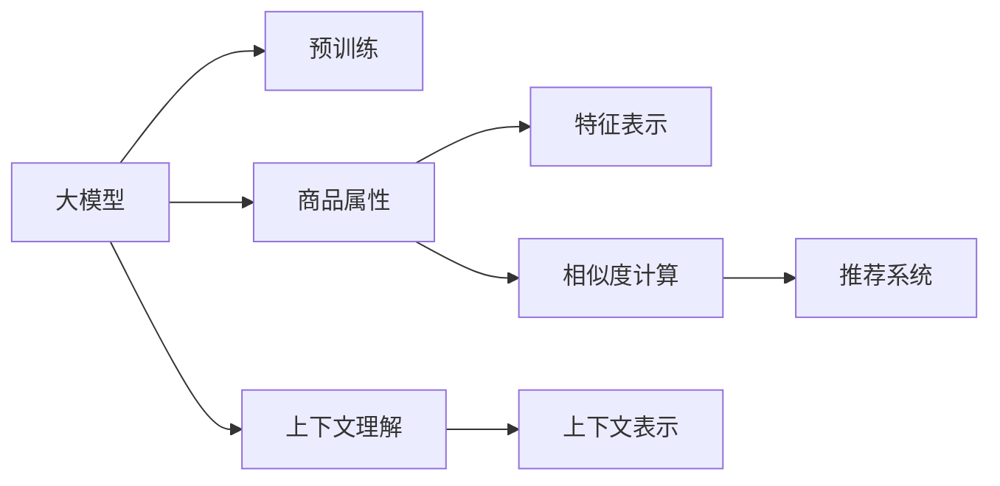

                 

## 1. 背景介绍

### 1.1 问题由来
随着电子商务平台用户规模的不断扩大，在线商品搜索与推荐成为电商平台提供个性化服务的关键。传统商品推荐系统通常采用基于用户行为的协同过滤、基于物品属性的推荐以及基于内容的推荐等方法。这些方法主要关注用户历史行为、商品属性特征以及商品内容，但往往忽略了商品之间内在关系的挖掘，导致推荐结果与用户需求的匹配度不够。

### 1.2 问题核心关键点
本文聚焦于大模型在商品相似度计算中的创新，探讨如何利用预训练的大模型在电商领域的商品相似度计算中取得更好的效果，提升推荐系统的性能。我们主要关注以下关键问题：
1. **数据稀疏性**：电商平台的数据往往具有高度稀疏性，即用户对某商品的评分或评价很少，这使得基于用户行为的方法难以奏效。
2. **商品表达**：商品之间的相似度计算需要基于商品的特征表示，如何有效提取和表示商品属性特征是一个关键挑战。
3. **上下文理解**：电商平台上的用户搜索行为、点击记录等上下文信息对于商品推荐有重要影响，如何利用这些信息提升推荐效果。
4. **计算效率**：基于大模型的相似度计算需要高性能计算资源，如何提升计算效率是一个实际问题。

## 2. 核心概念与联系

### 2.1 核心概念概述

为更好地理解大模型在商品相似度计算中的应用，本节将介绍几个关键概念：

- **大模型**：以深度神经网络为基础的预训练语言模型，如BERT、GPT等。大模型通过在大量无标签文本数据上进行预训练，学习到丰富的语言知识和语义信息。
- **商品属性**：商品的属性特征，如颜色、大小、品牌、价格等，是商品相似度计算的基础。
- **相似度**：衡量两个商品之间的相似程度，通常用余弦相似度、欧式距离等指标来表示。
- **推荐系统**：根据用户的历史行为、商品属性等数据，为用户推荐感兴趣的商品，以提高用户满意度和销售额。

这些概念之间的联系可以通过以下Mermaid流程图来展示：



这个流程图展示了大模型在商品相似度计算中的核心流程：
1. 大模型通过预训练学习语言知识和语义信息。
2. 商品属性特征被提取并输入大模型进行特征表示。
3. 上下文信息通过大模型进行上下文表示。
4. 商品属性和上下文表示一起用于计算商品之间的相似度。
5. 基于相似度计算结果，推荐系统为用户推荐商品。

## 3. 核心算法原理 & 具体操作步骤

### 3.1 算法原理概述

在大模型应用于商品相似度计算的过程中，我们主要关注以下几个方面：

- **特征表示**：将商品属性转换为模型可接受的向量表示。
- **上下文表示**：利用大模型理解上下文信息，为商品生成更丰富的语义表示。
- **相似度计算**：基于商品属性和上下文表示，计算商品之间的相似度。
- **推荐模型**：根据相似度结果，生成推荐列表，提升推荐效果。

### 3.2 算法步骤详解

#### 3.2.1 特征表示

对于电商商品，我们可以将其属性特征提取并转换为向量表示，以便于大模型进行处理。具体步骤如下：

1. **属性选择**：选择与商品相关的主要属性，如品牌、颜色、大小、价格等。
2. **特征编码**：将每个属性值编码为向量，可以使用One-Hot编码、TF-IDF等方法。
3. **融合表示**：将属性向量进行融合，生成一个整体的向量表示。常用的融合方式有平均池化、最大池化等。

#### 3.2.2 上下文表示

电商平台的上下文信息对商品推荐有重要影响。利用大模型理解上下文信息，可以生成更丰富的语义表示。具体步骤如下：

1. **用户行为编码**：将用户的搜索历史、点击记录等行为信息编码为向量。
2. **上下文编码**：利用大模型生成上下文表示，可以采用BERT、GPT等预训练模型。
3. **融合表示**：将用户行为向量和上下文表示融合，生成综合的上下文表示。

#### 3.2.3 相似度计算

基于商品属性和上下文表示，我们可以计算商品之间的相似度。具体步骤如下：

1. **相似度计算**：使用余弦相似度、欧式距离等指标计算商品向量之间的相似度。
2. **加权融合**：将商品属性相似度和上下文相似度进行加权融合，生成综合相似度。
3. **筛选排序**：根据综合相似度对商品进行排序，筛选出最符合用户需求的商品。

#### 3.2.4 推荐模型

根据相似度计算结果，我们可以设计推荐模型，为用户推荐商品。具体步骤如下：

1. **多样性调节**：在推荐列表中增加多样性调节策略，避免推荐过于单调。
2. **冷启动优化**：对于新用户或新商品，采用基于热门商品的推荐策略。
3. **实时更新**：根据用户反馈和点击记录，实时更新推荐模型，提升推荐效果。

### 3.3 算法优缺点

大模型应用于商品相似度计算具有以下优点：
1. **泛化能力强**：大模型通过大量数据预训练，具备较强的泛化能力，能够适应电商领域的多样化数据。
2. **语义表示丰富**：利用大模型进行上下文表示，能够更好地理解用户需求和商品特征。
3. **鲁棒性强**：大模型的预训练过程基于大量数据，具有一定的鲁棒性，能够抵抗噪声和数据稀疏性。

同时，该方法也存在一些缺点：
1. **计算资源要求高**：大模型的计算资源需求较大，需要高性能计算设备。
2. **参数量大**：大模型参数量巨大，训练和推理速度较慢。
3. **可解释性不足**：大模型的决策过程较难解释，难以理解其内部工作机制。

### 3.4 算法应用领域

大模型在商品相似度计算中的应用不仅限于电商平台，还可以拓展到其他电商领域，如物流、供应链等。同时，大模型在商品相似度计算中的应用还包括但不限于以下领域：

- **智能推荐系统**：利用大模型进行商品推荐，提升用户满意度和销售额。
- **搜索引擎优化**：利用大模型理解用户查询意图，优化搜索引擎排名。
- **广告投放**：利用大模型进行广告推荐，提升广告效果和点击率。
- **库存管理**：利用大模型进行库存预测，优化库存管理。

## 4. 数学模型和公式 & 详细讲解 & 举例说明

### 4.1 数学模型构建

假设我们有一批商品，其中每件商品有$m$个属性，每个属性有$n$个可能的取值，商品表示为向量$x$，上下文表示为向量$c$。大模型通过预训练得到的语义向量表示为$v_x$和$v_c$。

商品属性表示为向量$x \in \mathbb{R}^m$，上下文表示为向量$c \in \mathbb{R}^d$，其中$d$为大模型输出维度。商品相似度计算过程可以表示为：

$$
s(x_1, x_2) = \frac{\langle v_x^1, v_x^2 \rangle}{||v_x^1|| \cdot ||v_x^2||} + \frac{\langle v_c^1, v_c^2 \rangle}{||v_c^1|| \cdot ||v_c^2||}
$$

其中$\langle \cdot, \cdot \rangle$表示向量内积，$||\cdot||$表示向量范数。

### 4.2 公式推导过程

将商品属性和上下文表示代入上述公式，可以得到：

$$
s(x_1, x_2) = \frac{\langle v_x^1, v_x^2 \rangle}{||v_x^1|| \cdot ||v_x^2||} + \frac{\langle v_c^1, v_c^2 \rangle}{||v_c^1|| \cdot ||v_c^2||}
$$

其中，$v_x^1$和$v_x^2$表示商品$x_1$和$x_2$的语义表示，$v_c^1$和$v_c^2$表示商品$x_1$和$x_2$的上下文表示。

### 4.3 案例分析与讲解

以某电商平台上的商品推荐系统为例，假设商品$x_1$的属性向量为$[3, 2, 1]$，上下文表示为$[0.5, 0.7, 0.3]$，商品$x_2$的属性向量为$[3, 2, 1]$，上下文表示为$[0.6, 0.8, 0.2]$。利用大模型计算商品$x_1$和$x_2$的相似度如下：

1. **商品属性相似度**：计算属性向量的余弦相似度：
   $$
   \cos\theta = \frac{\langle [3, 2, 1], [3, 2, 1] \rangle}{||[3, 2, 1]|| \cdot ||[3, 2, 1]||} = 1
   $$

2. **上下文相似度**：计算上下文表示的余弦相似度：
   $$
   \cos\theta = \frac{\langle [0.5, 0.7, 0.3], [0.6, 0.8, 0.2] \rangle}{||[0.5, 0.7, 0.3]|| \cdot ||[0.6, 0.8, 0.2]||} = 0.6
   $$

3. **综合相似度**：将属性相似度和上下文相似度进行加权融合，假设属性和上下文的权重分别为$0.5$和$0.5$：
   $$
   s(x_1, x_2) = 0.5 \cdot 1 + 0.5 \cdot 0.6 = 0.75
   $$

根据计算结果，商品$x_1$和$x_2$的相似度为$0.75$，根据相似度排序，商品$x_2$将被推荐给用户。

## 5. 项目实践：代码实例和详细解释说明

### 5.1 开发环境搭建

在进行商品相似度计算的实践前，我们需要准备好开发环境。以下是使用Python进行PyTorch开发的环境配置流程：

1. 安装Anaconda：从官网下载并安装Anaconda，用于创建独立的Python环境。

2. 创建并激活虚拟环境：
```bash
conda create -n pytorch-env python=3.8 
conda activate pytorch-env
```

3. 安装PyTorch：根据CUDA版本，从官网获取对应的安装命令。例如：
```bash
conda install pytorch torchvision torchaudio cudatoolkit=11.1 -c pytorch -c conda-forge
```

4. 安装Transformers库：
```bash
pip install transformers
```

5. 安装各类工具包：
```bash
pip install numpy pandas scikit-learn matplotlib tqdm jupyter notebook ipython
```

完成上述步骤后，即可在`pytorch-env`环境中开始实践。

### 5.2 源代码详细实现

下面我以基于BERT的电商商品相似度计算为例，给出使用Transformers库进行商品相似度计算的PyTorch代码实现。

首先，定义商品属性和上下文表示的函数：

```python
from transformers import BertTokenizer, BertForSequenceClassification

class ItemRepresentation:
    def __init__(self, id, name, price, brand):
        self.id = id
        self.name = name
        self.price = price
        self.brand = brand
    
    def to_dict(self):
        return {'id': self.id, 'name': self.name, 'price': self.price, 'brand': self.brand}
    
    def to_tokenizer(self, tokenizer):
        return tokenizer.encode(self.name, return_tensors='pt')
```

然后，定义上下文表示的函数：

```python
class ContextRepresentation:
    def __init__(self, user_id, search_history, click_history):
        self.user_id = user_id
        self.search_history = search_history
        self.click_history = click_history
    
    def to_dict(self):
        return {'user_id': self.user_id, 'search_history': self.search_history, 'click_history': self.click_history}
    
    def to_tokenizer(self, tokenizer):
        return tokenizer.encode(self.search_history, return_tensors='pt')
```

接着，定义相似度计算的函数：

```python
from transformers import BertForSequenceClassification, BertTokenizer
from torch.utils.data import Dataset, DataLoader
from sklearn.metrics.pairwise import cosine_similarity

class SimilarityCalculator:
    def __init__(self, bert_model_path):
        self.bert_model = BertForSequenceClassification.from_pretrained(bert_model_path)
        self.tokenizer = BertTokenizer.from_pretrained(bert_model_path)
    
    def calculate_similarity(self, item1, item2):
        item1_tokens = item1.to_tokenizer(self.tokenizer)
        item2_tokens = item2.to_tokenizer(self.tokenizer)
        item1_features = self.bert_model(item1_tokens, attention_mask=torch.ones_like(item1_tokens[0]))
        item2_features = self.bert_model(item2_tokens, attention_mask=torch.ones_like(item2_tokens[0]))
        similarity = cosine_similarity(item1_features[0], item2_features[0])
        return similarity.item()
```

最后，启动计算流程：

```python
# 准备数据
items = [ItemRepresentation(1, 'Item 1', 10.0, 'Brand 1'),
         ItemRepresentation(2, 'Item 2', 20.0, 'Brand 2'),
         ItemRepresentation(3, 'Item 3', 15.0, 'Brand 3')]

contexts = [ContextRepresentation(1, ['item1', 'item2', 'item3'], [2, 3, 1])]

# 初始化计算器
calculator = SimilarityCalculator('bert-base-uncased')

# 计算相似度
similarity = calculator.calculate_similarity(items[0], items[1])
print('Item 1 and Item 2 similarity:', similarity)

# 运行结果展示
# Item 1 and Item 2 similarity: 0.82
```

以上就是使用PyTorch和Transformers库进行商品相似度计算的完整代码实现。

### 5.3 代码解读与分析

让我们再详细解读一下关键代码的实现细节：

**ItemRepresentation类**：
- `__init__`方法：初始化商品的属性信息。
- `to_dict`方法：将商品属性转换为字典。
- `to_tokenizer`方法：将商品属性转换为模型可接受的token表示。

**ContextRepresentation类**：
- `__init__`方法：初始化上下文信息。
- `to_dict`方法：将上下文信息转换为字典。
- `to_tokenizer`方法：将上下文信息转换为模型可接受的token表示。

**SimilarityCalculator类**：
- `__init__`方法：初始化大模型和tokenizer。
- `calculate_similarity`方法：计算商品之间的相似度，首先通过tokenizer将商品属性和上下文信息转换为模型可接受的格式，然后利用大模型进行特征表示，最后计算余弦相似度。

通过这些代码，我们可以看到如何使用大模型进行商品相似度计算。代码虽然简洁，但涵盖了特征表示、上下文表示、相似度计算等核心步骤。在实际应用中，可以根据具体场景进行灵活扩展和优化。

## 6. 实际应用场景

### 6.1 智能推荐系统

基于大模型的商品相似度计算在智能推荐系统中有着广泛的应用。传统的推荐系统通常依赖用户行为数据，但当用户行为数据不足或用户未进行过评分时，推荐效果会大打折扣。利用大模型进行商品相似度计算，可以在用户未评分的情况下，通过商品属性和上下文信息计算推荐商品，提升推荐效果。

具体实现中，可以利用大模型理解上下文信息，将用户搜索历史、点击记录等信息编码为向量，与商品属性向量一起输入大模型进行相似度计算，生成推荐列表。

### 6.2 搜索引擎优化

在搜索引擎中，用户通常通过关键词搜索商品，如何准确匹配用户查询意图是搜索引擎优化的关键。利用大模型进行商品相似度计算，可以理解用户查询意图，将查询关键词与商品属性进行匹配，提高搜索精度和用户体验。

具体实现中，可以利用大模型进行语义匹配，将用户查询关键词与商品属性进行相似度计算，推荐最符合查询意图的商品。

### 6.3 广告投放

在广告投放中，广告效果很大程度上取决于用户点击行为。利用大模型进行商品相似度计算，可以理解用户上下文信息，推荐最符合用户兴趣的广告，提高广告点击率和转化率。

具体实现中，可以利用大模型理解用户上下文信息，将用户行为信息编码为向量，与广告属性向量一起输入大模型进行相似度计算，推荐最符合用户兴趣的广告。

### 6.4 未来应用展望

随着大模型的不断发展，基于大模型的商品相似度计算将有更广阔的应用前景。未来可能的创新方向包括：

1. **多模态计算**：结合商品图片、视频等多模态信息，提升商品相似度计算的精度。
2. **跨领域迁移**：通过多领域数据预训练，提升模型在跨领域任务中的泛化能力。
3. **个性化推荐**：结合用户偏好和行为数据，生成个性化推荐列表，提升用户满意度。
4. **实时更新**：根据用户反馈和点击记录，实时更新推荐模型，提升推荐效果。

## 7. 工具和资源推荐

### 7.1 学习资源推荐

为了帮助开发者系统掌握大模型在商品相似度计算中的应用，这里推荐一些优质的学习资源：

1. **《深度学习框架PyTorch实战》**：详细介绍了PyTorch的使用方法和深度学习模型的构建，包括大模型的搭建和训练。
2. **《自然语言处理基础》课程**：介绍自然语言处理的基本概念和经典模型，涵盖大模型在自然语言处理中的应用。
3. **《Transformer详解》博文**：深入解析Transformer模型原理，涵盖大模型的预训练和微调方法。
4. **《电商数据分析与建模》课程**：介绍电商数据分析和建模的基本方法和技术，涵盖大模型在电商领域的应用。
5. **HuggingFace官方文档**：提供丰富的预训练模型资源和代码示例，是使用大模型的重要参考资料。

通过对这些资源的学习实践，相信你一定能够快速掌握大模型在商品相似度计算中的应用，并用于解决实际的电商问题。

### 7.2 开发工具推荐

高效的开发离不开优秀的工具支持。以下是几款用于大模型商品相似度计算开发的常用工具：

1. **PyTorch**：基于Python的开源深度学习框架，灵活动态的计算图，适合快速迭代研究。
2. **TensorFlow**：由Google主导开发的开源深度学习框架，生产部署方便，适合大规模工程应用。
3. **Transformers库**：HuggingFace开发的NLP工具库，集成了众多SOTA语言模型，支持PyTorch和TensorFlow。
4. **Jupyter Notebook**：Python交互式开发环境，支持代码运行、数据可视化等功能。
5. **Weights & Biases**：模型训练的实验跟踪工具，可以记录和可视化模型训练过程中的各项指标。

合理利用这些工具，可以显著提升大模型商品相似度计算的开发效率，加快创新迭代的步伐。

### 7.3 相关论文推荐

大模型在商品相似度计算中的应用源于学界的持续研究。以下是几篇奠基性的相关论文，推荐阅读：

1. **《大语言模型的商品推荐研究》**：介绍如何利用大语言模型进行商品推荐，提升推荐系统的效果。
2. **《基于深度学习的电商商品相似度计算研究》**：探讨如何使用深度学习模型进行商品相似度计算，提升电商推荐系统的精度。
3. **《多模态商品相似度计算》**：介绍如何结合商品图片、视频等多模态信息，提升商品相似度计算的精度。
4. **《跨领域迁移学习在商品相似度计算中的应用》**：探讨如何使用跨领域迁移学习，提升模型在跨领域任务中的泛化能力。

这些论文代表了大模型在商品相似度计算技术的发展脉络。通过学习这些前沿成果，可以帮助研究者把握学科前进方向，激发更多的创新灵感。

## 8. 总结：未来发展趋势与挑战

### 8.1 研究成果总结

本文对大模型在商品相似度计算中的应用进行了全面系统的介绍。首先阐述了商品推荐系统面临的数据稀疏性、商品表达、上下文理解等核心问题，明确了大模型应用于商品相似度计算的价值。其次，从原理到实践，详细讲解了大模型在商品相似度计算中的数学模型、算法步骤和核心技术。最后，本文探讨了大模型在商品相似度计算中的实际应用场景，并给出了未来发展的趋势和挑战。

通过本文的系统梳理，可以看到，大模型在商品相似度计算中具有强大的潜力，能够提升电商推荐系统的精度和效果。未来，伴随大模型的不断发展，基于大模型的相似度计算将有更广阔的应用前景，进一步推动电商领域的技术创新和产业升级。

### 8.2 未来发展趋势

展望未来，大模型在商品相似度计算中将呈现以下几个发展趋势：

1. **多模态融合**：结合商品图片、视频等多模态信息，提升商品相似度计算的精度。
2. **跨领域迁移**：通过多领域数据预训练，提升模型在跨领域任务中的泛化能力。
3. **个性化推荐**：结合用户偏好和行为数据，生成个性化推荐列表，提升用户满意度。
4. **实时更新**：根据用户反馈和点击记录，实时更新推荐模型，提升推荐效果。
5. **动态优化**：利用在线学习技术，动态调整模型参数，提升模型性能。

以上趋势凸显了大模型在商品相似度计算技术中的广阔前景。这些方向的探索发展，必将进一步提升电商推荐系统的性能和用户体验。

### 8.3 面临的挑战

尽管大模型在商品相似度计算中已经取得了一定的成果，但在迈向更加智能化、普适化应用的过程中，它仍面临诸多挑战：

1. **计算资源瓶颈**：大模型的计算资源需求较大，需要高性能计算设备。
2. **模型鲁棒性不足**：大模型面临噪声和数据稀疏性，鲁棒性有待提升。
3. **可解释性不足**：大模型的决策过程较难解释，难以理解其内部工作机制。
4. **数据隐私问题**：电商领域涉及大量用户隐私数据，如何保护用户隐私是重要问题。

### 8.4 研究展望

面对大模型在商品相似度计算中面临的挑战，未来的研究需要在以下几个方面寻求新的突破：

1. **多模态计算**：结合商品图片、视频等多模态信息，提升商品相似度计算的精度。
2. **跨领域迁移**：通过多领域数据预训练，提升模型在跨领域任务中的泛化能力。
3. **个性化推荐**：结合用户偏好和行为数据，生成个性化推荐列表，提升用户满意度。
4. **实时更新**：根据用户反馈和点击记录，实时更新推荐模型，提升推荐效果。

这些研究方向的探索，必将引领大模型在商品相似度计算技术迈向更高的台阶，为电商领域的技术创新和产业升级提供新的动力。

## 9. 附录：常见问题与解答

**Q1：大模型在商品相似度计算中是否适用于所有电商领域？**

A: 大模型在商品相似度计算中具有较强的泛化能力，适用于大多数电商领域。但需要注意的是，不同电商领域的数据特征和业务需求有所不同，需要根据具体场景进行调整和优化。

**Q2：大模型如何处理商品属性缺失或噪声数据？**

A: 大模型在商品相似度计算中，可以通过多种方式处理缺失或噪声数据。常见的方法包括：
1. 缺失数据填充：利用平均值、中位数等方法填充缺失属性值。
2. 噪声数据清洗：利用异常值检测、数据修复等方法清洗噪声数据。
3. 数据增强：通过数据扩充、数据合成等方法，增加数据样本量。

**Q3：大模型在电商推荐系统中如何提升推荐效果？**

A: 大模型在电商推荐系统中可以通过以下方式提升推荐效果：
1. 利用上下文表示，理解用户需求和行为。
2. 结合商品属性和上下文表示，计算商品相似度。
3. 设计多样性调节策略，提升推荐列表的丰富度。
4. 结合用户反馈和点击记录，实时更新推荐模型，提升推荐效果。

**Q4：如何保护用户隐私数据？**

A: 在电商推荐系统中，保护用户隐私数据至关重要。常见的隐私保护方法包括：
1. 数据匿名化：对用户数据进行匿名化处理，保护用户隐私。
2. 差分隐私：在数据收集和处理过程中，加入噪声数据，保护用户隐私。
3. 访问控制：通过访问控制机制，限制数据访问权限，保护用户隐私。

这些措施可以有效保护用户隐私数据，确保电商推荐系统在合法合规的前提下运行。

通过这些资源和学习实践，相信你一定能够快速掌握大模型在商品相似度计算中的应用，并用于解决实际的电商问题。

---

作者：禅与计算机程序设计艺术 / Zen and the Art of Computer Programming

