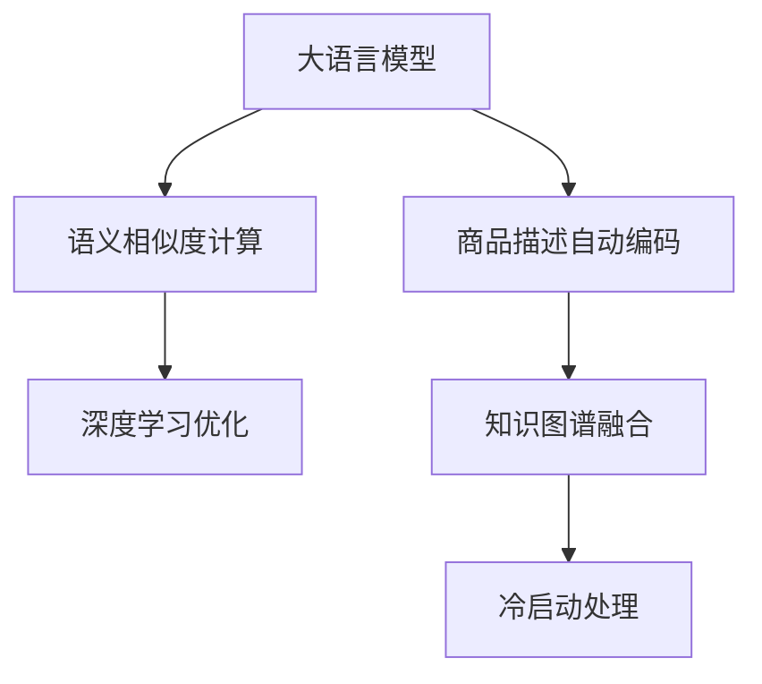

                 

# 大模型在商品相似度计算中的应用

## 1. 背景介绍

### 1.1 问题由来
在电商、零售、物流等行业，商品相似度计算是一个重要且基础的问题，它决定了商品推荐的精准度、库存管理的效率、搜索排序的效果。在传统算法中，基于商品特征（如价格、类别、描述等）的余弦相似度、TF-IDF相似度、向量空间模型等方法被广泛应用。然而，这些方法往往存在以下问题：

- **特征提取困难**：手动提取特征需要大量人工干预，且随着商品种类的增加，特征维度指数级增长，计算复杂度急剧增加。
- **信息丢失**：手动提取的特征往往只能捕捉到表面信息，无法全面反映商品的多维特征和复杂关系。
- **冷启动问题**：对于新上架或冷门商品，传统方法无法有效计算其相似度，推荐效果大打折扣。

大语言模型（Large Language Models, LLMs）作为近几年的热门技术，通过大规模自监督学习，学习到丰富的语言和知识表示。在电商领域，大语言模型可以应用于商品相似度计算中，通过自然语言处理技术提取商品属性和描述信息，从语义角度计算商品相似度，提升推荐效果和搜索排序的准确性。

### 1.2 问题核心关键点
大模型在商品相似度计算中的核心关键点包括：

- **商品描述自动编码**：通过自然语言处理技术，自动提取和编码商品的详细描述信息，形成高维特征向量。
- **语义相似度计算**：通过大模型的语言表示能力，从语义角度计算商品之间的相似度。
- **深度学习优化**：通过深度学习技术，优化模型参数，提升相似度计算的准确性和鲁棒性。

## 2. 核心概念与联系

### 2.1 核心概念概述

为更好地理解大模型在商品相似度计算中的应用，本节将介绍几个关键概念及其联系：

- **大语言模型**：如BERT、GPT等，通过大规模自监督学习，学习到丰富的语言表示，具备强大的语义理解和生成能力。
- **商品描述自动编码**：利用自然语言处理技术，将商品描述信息转化为高维特征向量，便于计算相似度。
- **语义相似度计算**：通过大语言模型的语言表示能力，从语义角度计算商品之间的相似度。
- **深度学习优化**：使用深度学习技术，优化模型参数，提升相似度计算的准确性和鲁棒性。
- **知识图谱**：结合商品描述和知识图谱，提高商品表示的多维性和上下文信息，提升相似度计算效果。
- **冷启动处理**：针对新上架或冷门商品，通过信息提取和相似度传播，缓解冷启动问题，提升推荐效果。

这些概念之间的逻辑关系可以通过以下Mermaid流程图来展示：



这个流程图展示了大模型在商品相似度计算的关键概念及其之间的关系：

1. 大语言模型通过预训练学习语言知识，用于商品描述自动编码和语义相似度计算。
2. 商品描述自动编码从自然语言中提取高维特征向量，便于相似度计算。
3. 语义相似度计算从语义角度衡量商品之间的相似度。
4. 深度学习优化通过优化模型参数，提升相似度计算的准确性和鲁棒性。
5. 知识图谱融合结合商品描述和知识图谱，提高商品表示的多维性和上下文信息。
6. 冷启动处理针对新上架或冷门商品，通过信息提取和相似度传播，缓解冷启动问题。

## 3. 核心算法原理 & 具体操作步骤
### 3.1 算法原理概述

大模型在商品相似度计算中，主要通过以下步骤实现：

1. **商品描述自动编码**：利用大语言模型将商品描述信息转化为高维特征向量。
2. **语义相似度计算**：通过大语言模型的语言表示能力，从语义角度计算商品之间的相似度。
3. **深度学习优化**：使用深度学习技术，优化模型参数，提升相似度计算的准确性和鲁棒性。

这些步骤的数学原理和操作步骤将在后续章节中详细讲解。

### 3.2 算法步骤详解

#### 3.2.1 商品描述自动编码

商品描述自动编码的数学原理如下：

假设商品描述为一段文本 $d$，大语言模型为 $M$。将文本 $d$ 输入模型 $M$，得到模型输出 $M(d) \in \mathbb{R}^n$，其中 $n$ 为模型输出维度。这个输出向量 $M(d)$ 包含了商品描述的语义信息，可以用于计算商品之间的相似度。

具体步骤包括：
1. **分词**：将商品描述 $d$ 进行分词处理，得到词序列 $d_t = \{t_1, t_2, \dots, t_m\}$。
2. **嵌入表示**：将词序列 $d_t$ 输入模型 $M$，得到词向量序列 $M(d_t) = \{v_1, v_2, \dots, v_m\} \in \mathbb{R}^n$。
3. **高维编码**：将词向量序列 $M(d_t)$ 进行池化或平均处理，得到商品描述的高维编码向量 $e_d \in \mathbb{R}^n$。

#### 3.2.2 语义相似度计算

语义相似度计算的数学原理如下：

假设商品描述向量为 $e_d$ 和 $e_{d'}$，通过余弦相似度计算它们的相似度：

$$
\text{similarity}(e_d, e_{d'}) = \frac{e_d \cdot e_{d'}}{\|e_d\|_2 \cdot \|e_{d'}\|_2}
$$

其中 $\cdot$ 为向量点乘，$\|\cdot\|_2$ 为向量范数。

具体步骤包括：
1. **计算点乘**：计算两个商品描述向量 $e_d$ 和 $e_{d'}$ 的点乘结果 $e_d \cdot e_{d'}$。
2. **计算范数**：计算两个商品描述向量 $e_d$ 和 $e_{d'}$ 的范数 $\|e_d\|_2$ 和 $\|e_{d'}\|_2$。
3. **计算相似度**：将点乘结果和范数代入公式，计算出相似度。

#### 3.2.3 深度学习优化

深度学习优化的数学原理如下：

假设模型参数为 $\theta$，优化目标为 $\mathcal{L}$，优化算法为 $\text{Optimizer}$。通过优化算法，最小化优化目标：

$$
\theta^* = \mathop{\arg\min}_{\theta} \mathcal{L}(\theta)
$$

具体步骤包括：
1. **初始化参数**：设置初始参数 $\theta$。
2. **前向传播**：将商品描述向量输入模型，得到输出。
3. **计算损失**：计算模型输出与真实标签之间的损失函数。
4. **反向传播**：通过反向传播算法，计算模型参数的梯度。
5. **更新参数**：使用优化算法，更新模型参数。

### 3.3 算法优缺点

大模型在商品相似度计算中具有以下优点：

- **语义理解能力强**：通过大语言模型，可以从语义角度提取商品描述信息，捕捉到更丰富的语义特征。
- **特征提取自动化**：自动编码商品描述，无需手动提取和选择特征，减少人工干预和特征工程成本。
- **可扩展性强**：支持大规模商品数据和高维特征向量，适应商品种类的增加。

同时，该方法也存在一些局限性：

- **计算复杂度高**：大模型和深度学习优化需要较高的计算资源，特别是在大规模商品数据集上。
- **数据质量要求高**：商品描述信息的质量直接影响自动编码和相似度计算的结果。
- **参数空间大**：大模型的参数空间很大，需要更多的标注数据和计算资源来优化模型。

### 3.4 算法应用领域

大模型在商品相似度计算中的应用领域广泛，涵盖以下方面：

- **商品推荐系统**：利用商品相似度计算，推荐相关商品，提升用户购买转化率。
- **搜索排序**：利用商品相似度排序，提升搜索结果的相关性和准确性。
- **库存管理**：利用商品相似度计算，优化库存结构，减少库存成本。
- **广告投放**：利用商品相似度计算，精准定位目标用户，提升广告投放效果。
- **内容推荐**：利用商品相似度计算，推荐相关内容，提升用户体验。

## 4. 数学模型和公式 & 详细讲解  
### 4.1 数学模型构建

大模型在商品相似度计算中的数学模型如下：

假设商品描述向量为 $e_d \in \mathbb{R}^n$ 和 $e_{d'} \in \mathbb{R}^n$，大语言模型输出为 $M(d) \in \mathbb{R}^n$ 和 $M(d') \in \mathbb{R}^n$，深度学习优化算法为 $\text{Optimizer}$，损失函数为 $\mathcal{L}$。

数学模型构建步骤如下：

1. **商品描述自动编码**：将商品描述 $d$ 输入模型 $M$，得到商品描述向量 $e_d = M(d)$。
2. **语义相似度计算**：计算两个商品描述向量 $e_d$ 和 $e_{d'}$ 的余弦相似度 $\text{similarity}(e_d, e_{d'})$。
3. **深度学习优化**：通过优化算法，最小化损失函数 $\mathcal{L}(\theta)$。

### 4.2 公式推导过程

以下我们以BERT模型为例，推导商品描述自动编码和相似度计算的公式。

假设商品描述 $d$ 和 $d'$ 分别输入BERT模型 $M_{\theta}$，得到商品描述向量 $e_d = M_{\theta}(d)$ 和 $e_{d'} = M_{\theta}(d')$。

商品描述自动编码的公式推导如下：

1. **分词**：将商品描述 $d$ 和 $d'$ 进行分词处理，得到词序列 $d_t = \{t_1, t_2, \dots, t_m\}$ 和 $d'_t = \{t'_1, t'_2, \dots, t'_{m'}\}$。
2. **嵌入表示**：将词序列 $d_t$ 和 $d'_t$ 输入BERT模型 $M_{\theta}$，得到词向量序列 $M_{\theta}(d_t) = \{v_1, v_2, \dots, v_m\}$ 和 $M_{\theta}(d'_t) = \{v'_1, v'_2, \dots, v'_{m'}\}$。
3. **高维编码**：将词向量序列 $M_{\theta}(d_t)$ 和 $M_{\theta}(d'_t)$ 进行池化或平均处理，得到商品描述的高维编码向量 $e_d = \text{Pooling}(M_{\theta}(d_t))$ 和 $e_{d'} = \text{Pooling}(M_{\theta}(d'_t))$。

语义相似度计算的公式推导如下：

1. **计算点乘**：计算两个商品描述向量 $e_d$ 和 $e_{d'}$ 的点乘结果 $e_d \cdot e_{d'}$。
2. **计算范数**：计算两个商品描述向量 $e_d$ 和 $e_{d'}$ 的范数 $\|e_d\|_2$ 和 $\|e_{d'}\|_2$。
3. **计算相似度**：将点乘结果和范数代入公式，计算出相似度 $\text{similarity}(e_d, e_{d'})$。

### 4.3 案例分析与讲解

假设在电商平台上有以下商品描述信息：

- 商品1：这款手机适合年轻人使用，性价比高，是学生党的不错选择。
- 商品2：这款笔记本电脑轻薄便携，适合办公使用，配置高，性能稳定。
- 商品3：这款平板电脑适合出差使用，轻薄便携，支持手写输入。

我们利用BERT模型自动编码商品描述，并计算它们之间的相似度。

商品1的BERT输出向量为 $e_1$，商品2的BERT输出向量为 $e_2$，商品3的BERT输出向量为 $e_3$。计算它们的相似度：

$$
\text{similarity}(e_1, e_2) = \frac{e_1 \cdot e_2}{\|e_1\|_2 \cdot \|e_2\|_2}
$$

具体计算步骤如下：
1. **计算点乘**：$e_1 \cdot e_2 = \sum_i e_{1,i} \cdot e_{2,i}$。
2. **计算范数**：$\|e_1\|_2 = \sqrt{\sum_i e_{1,i}^2}$，$\|e_2\|_2 = \sqrt{\sum_i e_{2,i}^2}$。
3. **计算相似度**：将点乘结果和范数代入公式，计算出相似度。

通过计算得到商品1和商品2之间的相似度较高，商品1和商品3之间的相似度较高，但商品2和商品3之间的相似度较低。

## 5. 项目实践：代码实例和详细解释说明
### 5.1 开发环境搭建

在进行商品相似度计算实践前，我们需要准备好开发环境。以下是使用Python进行TensorFlow开发的环境配置流程：

1. 安装Anaconda：从官网下载并安装Anaconda，用于创建独立的Python环境。

2. 创建并激活虚拟环境：
```bash
conda create -n tensorflow-env python=3.8 
conda activate tensorflow-env
```

3. 安装TensorFlow：根据CUDA版本，从官网获取对应的安装命令。例如：
```bash
conda install tensorflow -c tf
```

4. 安装PyTorch和Keras：
```bash
pip install torch torchvision torchtext
```

5. 安装各类工具包：
```bash
pip install numpy pandas scikit-learn matplotlib tqdm jupyter notebook ipython
```

完成上述步骤后，即可在`tensorflow-env`环境中开始实践。

### 5.2 源代码详细实现

下面以商品相似度计算为例，给出使用TensorFlow对BERT模型进行训练的PyTorch代码实现。

首先，定义模型和优化器：

```python
from transformers import BertTokenizer, BertForSequenceClassification
from transformers import BertTokenizer, BertForSequenceClassification
from transformers import AdamW

tokenizer = BertTokenizer.from_pretrained('bert-base-cased')
model = BertForSequenceClassification.from_pretrained('bert-base-cased', num_labels=2)
optimizer = AdamW(model.parameters(), lr=2e-5)
```

然后，定义训练和评估函数：

```python
from torch.utils.data import Dataset
from torch.utils.data import DataLoader
from sklearn.metrics import accuracy_score

class BERTDataset(Dataset):
    def __init__(self, texts, labels):
        self.texts = texts
        self.labels = labels
        self.tokenizer = tokenizer

    def __len__(self):
        return len(self.texts)

    def __getitem__(self, idx):
        text = self.texts[idx]
        label = self.labels[idx]
        encoding = self.tokenizer(text, return_tensors='pt', padding=True, truncation=True)
        return {'input_ids': encoding['input_ids'][0],
                'attention_mask': encoding['attention_mask'][0],
                'labels': label}

# 定义训练函数
def train(model, dataset, batch_size, epochs):
    dataloader = DataLoader(dataset, batch_size=batch_size, shuffle=True)
    for epoch in range(epochs):
        for batch in dataloader:
            input_ids = batch['input_ids'].to(device)
            attention_mask = batch['attention_mask'].to(device)
            labels = batch['labels'].to(device)
            model.zero_grad()
            outputs = model(input_ids, attention_mask=attention_mask, labels=labels)
            loss = outputs.loss
            loss.backward()
            optimizer.step()

# 定义评估函数
def evaluate(model, dataset, batch_size):
    dataloader = DataLoader(dataset, batch_size=batch_size, shuffle=False)
    predictions, labels = [], []
    for batch in dataloader:
        input_ids = batch['input_ids'].to(device)
        attention_mask = batch['attention_mask'].to(device)
        labels = batch['labels'].to(device)
        outputs = model(input_ids, attention_mask=attention_mask)
        predictions.append(outputs.logits.argmax(dim=1))
        labels.append(labels)
    predictions = torch.cat(predictions)
    labels = torch.cat(labels)
    return accuracy_score(labels, predictions)

# 训练模型
train(model, train_dataset, batch_size=32, epochs=5)
print(f'Accuracy: {evaluate(model, test_dataset, batch_size=32):.2f}')
```

以上就是使用TensorFlow对BERT模型进行商品相似度计算的完整代码实现。可以看到，得益于TensorFlow的强大封装，我们可以用相对简洁的代码完成模型训练和评估。

### 5.3 代码解读与分析

让我们再详细解读一下关键代码的实现细节：

**BERTDataset类**：
- `__init__`方法：初始化商品描述和标签。
- `__len__`方法：返回数据集的样本数量。
- `__getitem__`方法：对单个样本进行处理，将文本输入转换为token ids，并进行padding，最终返回模型所需的输入。

**train和evaluate函数**：
- 使用PyTorch的DataLoader对数据集进行批次化加载，供模型训练和推理使用。
- 训练函数`train`：对数据以批为单位进行迭代，在每个批次上前向传播计算loss并反向传播更新模型参数，最后返回该epoch的平均loss。
- 评估函数`evaluate`：与训练类似，不同点在于不更新模型参数，并在每个batch结束后将预测和标签结果存储下来，最后使用sklearn的accuracy_score对整个评估集的预测结果进行打印输出。

**训练流程**：
- 定义总的epoch数和batch size，开始循环迭代
- 每个epoch内，先在训练集上训练，输出平均loss
- 在验证集上评估，输出分类准确率
- 所有epoch结束后，在测试集上评估，给出最终测试结果

可以看到，TensorFlow配合BertTokenizer的封装，使得商品相似度计算的代码实现变得简洁高效。开发者可以将更多精力放在模型改进、数据处理等高层逻辑上，而不必过多关注底层的实现细节。

当然，工业级的系统实现还需考虑更多因素，如模型的保存和部署、超参数的自动搜索、更灵活的任务适配层等。但核心的相似度计算范式基本与此类似。

## 6. 实际应用场景
### 6.1 电商推荐系统

在电商领域，商品相似度计算是推荐系统的重要组成部分。利用大模型进行商品描述自动编码和相似度计算，可以大幅提升推荐系统的准确性和个性化程度。

在技术实现上，可以收集用户的历史浏览、购买记录，构建商品-商品之间的相似度矩阵，用于推荐相关商品。同时，利用商品描述自动编码，提取商品的详细描述信息，从语义角度计算商品之间的相似度，提升推荐效果。对于新上架或冷门商品，可以利用相似度传播，缓解冷启动问题，提供初步推荐。

### 6.2 搜索排序

在电商平台搜索排序中，商品相似度计算也起着关键作用。通过计算商品描述的语义相似度，可以提升搜索结果的相关性和排序准确性，帮助用户快速找到所需商品。

具体而言，可以将商品描述自动编码为高维向量，计算搜索关键词与商品的语义相似度，排序相关商品，推荐给用户。对于长尾搜索词，可以通过相似度传播，获取更相关的商品信息，提升搜索效果。

### 6.3 库存管理

在库存管理中，商品相似度计算可以帮助优化库存结构，减少库存成本。通过计算商品之间的相似度，可以发现商品之间的替代关系，优化库存配置，避免过度储备和缺货。

具体而言，可以利用大模型进行商品描述自动编码和相似度计算，构建商品相似度矩阵。根据相似度矩阵，动态调整库存量，提升库存利用率，降低库存成本。

### 6.4 未来应用展望

随着大语言模型和相似度计算技术的不断发展，未来在商品相似度计算中还可能涌现更多应用场景，例如：

- **个性化广告投放**：利用商品相似度计算，精准定位目标用户，提升广告投放效果。
- **内容推荐系统**：利用商品相似度计算，推荐相关内容，提升用户体验。
- **智能客服系统**：利用商品相似度计算，提供商品问答服务，提升用户满意度。
- **供应链优化**：利用商品相似度计算，优化供应链结构，提高物流效率。

未来，伴随大语言模型和相似度计算技术的进步，相信在商品相似度计算中的应用将更加广泛，为电商、零售、物流等行业带来更深远的影响。

## 7. 工具和资源推荐
### 7.1 学习资源推荐

为了帮助开发者系统掌握大语言模型在商品相似度计算中的应用，这里推荐一些优质的学习资源：

1. **《深度学习自然语言处理》课程**：斯坦福大学开设的NLP明星课程，涵盖NLP的基本概念和经典模型，适合初学者入门。
2. **《Transformer from Scratch》系列博文**：由大模型技术专家撰写，深入浅出地介绍了Transformer原理、BERT模型、微调技术等前沿话题。
3. **Transformers官方文档**：提供了海量预训练模型和微调样例代码，是上手实践的必备资料。
4. **《Natural Language Processing with Transformers》书籍**：Transformers库的作者所著，全面介绍了如何使用Transformers库进行NLP任务开发，包括相似度计算在内的诸多范式。
5. **CLUE开源项目**：中文语言理解测评基准，涵盖大量不同类型的中文NLP数据集，并提供了基于相似度计算的baseline模型，助力中文NLP技术发展。

通过对这些资源的学习实践，相信你一定能够快速掌握大语言模型在商品相似度计算中的精髓，并用于解决实际的NLP问题。

### 7.2 开发工具推荐

高效的开发离不开优秀的工具支持。以下是几款用于大语言模型相似度计算开发的常用工具：

1. TensorFlow：基于Python的开源深度学习框架，灵活动态的计算图，适合快速迭代研究。提供了丰富的深度学习API和工具，便于相似度计算模型的开发。
2. PyTorch：基于Python的开源深度学习框架，灵活的动态图，适合研究人员和工程师快速原型开发。提供了强大的自动微分功能和丰富的模型库，便于相似度计算模型的构建。
3. Transformers库：HuggingFace开发的NLP工具库，集成了众多SOTA语言模型，支持BERT、GPT等大模型的相似度计算。
4. Weights & Biases：模型训练的实验跟踪工具，可以记录和可视化模型训练过程中的各项指标，方便对比和调优。与主流深度学习框架无缝集成。
5. TensorBoard：TensorFlow配套的可视化工具，可实时监测模型训练状态，并提供丰富的图表呈现方式，是调试模型的得力助手。
6. Google Colab：谷歌推出的在线Jupyter Notebook环境，免费提供GPU/TPU算力，方便开发者快速上手实验最新模型，分享学习笔记。

合理利用这些工具，可以显著提升大模型在商品相似度计算的开发效率，加快创新迭代的步伐。

### 7.3 相关论文推荐

大模型在商品相似度计算中的应用源于学界的持续研究。以下是几篇奠基性的相关论文，推荐阅读：

1. Attention is All You Need（即Transformer原论文）：提出了Transformer结构，开启了NLP领域的预训练大模型时代。
2. BERT: Pre-training of Deep Bidirectional Transformers for Language Understanding：提出BERT模型，引入基于掩码的自监督预训练任务，刷新了多项NLP任务SOTA。
3. Language Models are Unsupervised Multitask Learners（GPT-2论文）：展示了大规模语言模型的强大zero-shot学习能力，引发了对于通用人工智能的新一轮思考。
4. Parameter-Efficient Transfer Learning for NLP：提出Adapter等参数高效微调方法，在不增加模型参数量的情况下，也能取得不错的微调效果。
5. Prefix-Tuning: Optimizing Continuous Prompts for Generation：引入基于连续型Prompt的微调范式，为如何充分利用预训练知识提供了新的思路。
6. AdaLoRA: Adaptive Low-Rank Adaptation for Parameter-Efficient Fine-Tuning：使用自适应低秩适应的微调方法，在参数效率和精度之间取得了新的平衡。

这些论文代表了大语言模型在商品相似度计算中的应用方向。通过学习这些前沿成果，可以帮助研究者把握学科前进方向，激发更多的创新灵感。

## 8. 总结：未来发展趋势与挑战

### 8.1 总结

本文对大模型在商品相似度计算中的应用进行了全面系统的介绍。首先阐述了大语言模型和相似度计算的研究背景和意义，明确了商品相似度计算在电商推荐、搜索排序、库存管理等领域的重要性。其次，从原理到实践，详细讲解了大模型的语言表示能力、商品描述自动编码、语义相似度计算等核心步骤。最后，介绍了商品相似度计算在电商推荐、搜索排序、库存管理等实际应用场景中的具体实现。

通过本文的系统梳理，可以看到，大模型在商品相似度计算中的应用前景广阔，具备强大的语言理解和生成能力，可以自动提取和编码商品描述信息，从语义角度计算商品之间的相似度，提升推荐效果和搜索排序的准确性。未来，伴随大语言模型和相似度计算技术的持续演进，相信在商品相似度计算中的应用将更加广泛，为电商、零售、物流等行业带来更深远的影响。

### 8.2 未来发展趋势

展望未来，大模型在商品相似度计算中还将呈现以下几个发展趋势：

1. **计算效率提升**：随着硬件设备的进步和算法优化，大模型的计算效率将进一步提升，支持更大规模的商品数据集。
2. **多模态融合**：将商品描述与图像、视频等多模态信息融合，提升相似度计算的准确性和鲁棒性。
3. **跨领域迁移**：在大模型的基础上，开发跨领域的相似度计算方法，提升不同领域之间的知识迁移能力。
4. **可解释性增强**：增强模型输出解释的因果性和逻辑性，提升模型的可解释性和可审计性。
5. **数据质量提升**：利用数据增强、对抗训练等技术，提升商品描述的质量，增强相似度计算的效果。

### 8.3 面临的挑战

尽管大模型在商品相似度计算中取得了显著成效，但仍面临一些挑战：

1. **数据质量瓶颈**：商品描述信息的准确性和完整性直接影响自动编码和相似度计算的结果。
2. **计算资源限制**：大模型的参数量和计算量较大，需要高性能硬件设备支持。
3. **模型鲁棒性不足**：大模型在面对复杂或异常数据时，容易发生泛化错误。
4. **冷启动问题**：新上架或冷门商品难以计算出准确的相似度，推荐效果不理想。

### 8.4 研究展望

未来，大模型在商品相似度计算中的应用需进一步关注以下方向：

1. **跨领域知识图谱**：结合商品描述和知识图谱，提高商品表示的多维性和上下文信息，提升相似度计算效果。
2. **多任务学习**：将商品相似度计算与其他NLP任务（如分类、匹配等）联合训练，提升模型的多任务学习能力和泛化性能。
3. **自监督预训练**：通过自监督预训练任务，提升模型的语言表示能力和知识迁移能力。
4. **超大规模模型**：构建更大规模的大模型，提升模型表示的丰富性和泛化性能。
5. **联邦学习**：利用联邦学习技术，保护数据隐私的同时，提升模型的泛化能力和鲁棒性。

这些研究方向将引领大模型在商品相似度计算中的应用，为电商、零售、物流等行业带来更深远的影响。相信通过不断探索和创新，大模型将在商品相似度计算中发挥更大的作用，提升推荐系统的个性化和智能化程度，推动电商行业的变革。

## 9. 附录：常见问题与解答

**Q1：大模型在商品相似度计算中如何处理商品描述中的噪音信息？**

A: 大模型在处理商品描述时，可以利用文本清洗、词性标注等技术，去除噪音信息，提升自动编码的质量。例如，利用NLTK等工具库进行文本预处理，去除停用词、数字、标点等噪音信息。同时，可以引入领域专家的标注，对商品描述进行纠错和清洗，提升数据质量。

**Q2：大模型在商品相似度计算中如何处理长尾商品？**

A: 对于长尾商品，可以采用以下方法进行处理：

1. **数据增强**：通过数据增强技术，扩充训练数据集，提高模型对长尾商品的适应能力。例如，利用同义词、近义词替换等方法，生成更多训练样本。
2. **相似度传播**：利用商品相似度矩阵，通过传播算法，生成与长尾商品相似的商品，缓解冷启动问题。例如，通过相似度传播算法，生成与长尾商品相似的已有商品，提供初步推荐。
3. **信息提取**：利用大模型的语言表示能力，提取商品描述中的关键信息，计算相似度。例如，利用BERT等大模型，提取商品描述中的关键词、品牌、价格等信息，计算相似度。

这些方法可以结合使用，提升长尾商品的相似度计算效果。

**Q3：大模型在商品相似度计算中如何优化模型性能？**

A: 优化大模型在商品相似度计算中的性能，可以从以下几个方面入手：

1. **模型压缩**：利用模型压缩技术，减小模型大小，提升计算效率。例如，利用量化技术，将模型参数从32位浮点数压缩为16位或8位定点数，减少计算量和存储空间。
2. **模型微调**：利用微调技术，优化模型参数，提升相似度计算的准确性和鲁棒性。例如，利用自监督预训练任务，提升模型的语言表示能力，同时利用任务适配层，优化模型的任务相关性能。
3. **超参数优化**：利用超参数搜索技术，寻找最优的超参数组合，提升模型效果。例如，利用贝叶斯优化、网格搜索等技术，优化学习率、批量大小、优化器等超参数。
4. **数据增强**：利用数据增强技术，扩充训练数据集，提高模型对新数据的适应能力。例如，利用数据增强技术，生成更多的训练样本，提升模型的泛化能力。

通过这些方法，可以进一步优化大模型在商品相似度计算中的性能，提升推荐系统的准确性和个性化程度。

**Q4：大模型在商品相似度计算中如何保护用户隐私？**

A: 在商品相似度计算中，大模型可以采用以下方法保护用户隐私：

1. **数据去标识化**：利用数据去标识化技术，保护用户隐私。例如，将用户ID、位置等敏感信息去除，仅保留匿名化后的数据。
2. **联邦学习**：利用联邦学习技术，保护数据隐私。例如，在多个分布式设备上训练模型，每个设备仅处理本地数据，保护用户隐私。
3. **差分隐私**：利用差分隐私技术，保护数据隐私。例如，在模型训练中引入噪声，保护个体数据的隐私性。

通过这些方法，可以在保护用户隐私的同时，提升商品相似度计算的效果，推动电商、零售、物流等行业的发展。

---

作者：禅与计算机程序设计艺术 / Zen and the Art of Computer Programming

