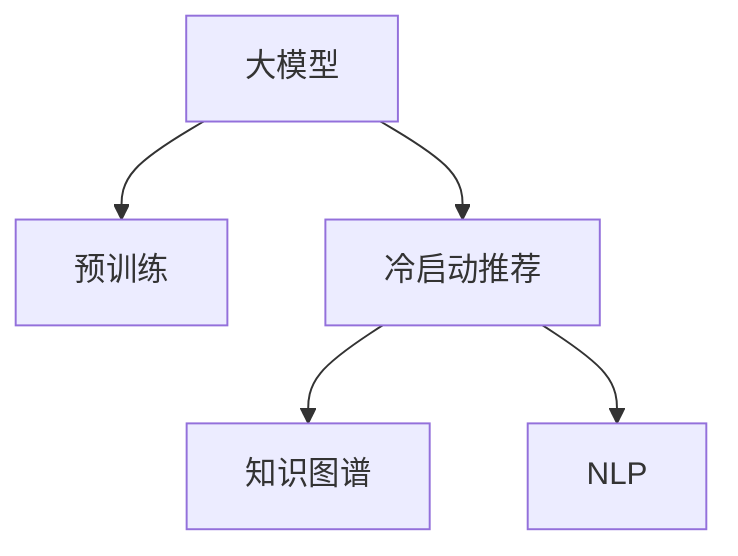
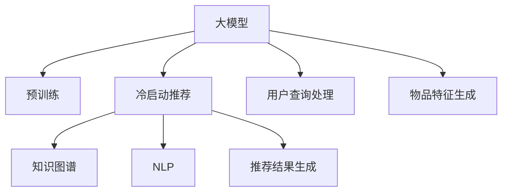

                 

# 大模型在推荐冷启动场景中的优势

## 1. 背景介绍

在推荐系统的领域中，推荐冷启动问题一直是一个挑战。冷启动指的是新用户或新物品加入推荐系统后，由于缺乏足够的用户行为或物品属性数据，难以准确为其推荐合适的物品。这不仅会影响用户的满意度，也会对推荐系统的推荐效果产生负面影响。传统推荐系统依赖于用户的历史行为数据进行推荐，对于冷启动用户，往往难以获得足够的推荐依据。然而，随着大语言模型和自然语言处理技术的快速发展，大模型在推荐冷启动场景中的应用成为了新的研究热点。

## 2. 核心概念与联系

### 2.1 核心概念概述

- **大模型(Large Model)**：指具有亿级甚至更大量级参数的深度学习模型，如BERT、GPT等。通过在大规模无标签数据上进行预训练，大模型具备强大的语言理解和生成能力。
- **冷启动(Chill Start)**：在推荐系统中，新用户或新物品由于缺乏足够的数据，难以进行有效的推荐。
- **自然语言处理(Natural Language Processing, NLP)**：利用计算机处理、理解、生成人类语言的技术。
- **推荐系统(Recommendation System)**：根据用户的历史行为或物品属性数据，为用户推荐合适物品的系统。
- **知识图谱(Knowledge Graph)**：将实体及其关系用图的形式表示，用于描述知识之间的逻辑关系。

这些概念通过Mermaid流程图表示如下：



该流程图展示了大模型在推荐系统中的应用流程：

1. 大模型通过在大规模无标签数据上进行预训练，获得通用的语言表示。
2. 在冷启动推荐场景中，大模型可以通过对用户输入的自然语言查询进行处理，结合知识图谱，生成推荐结果。
3. 结合NLP技术，大模型可以更好地理解和处理用户需求，提供更精准的推荐服务。

### 2.2 核心概念原理和架构的 Mermaid 流程图



该流程图展示了冷启动推荐的基本流程：

1. 大模型A通过预训练获得语言表示能力，从用户查询处理F中提取用户意图。
2. 大模型A结合物品特征生成G，生成推荐候选列表。
3. 知识图谱D提供实体和关系的结构信息，帮助大模型A进行推荐结果生成H。
4. NLP技术E增强大模型A对自然语言的理解能力，提升推荐准确性。

## 3. 核心算法原理 & 具体操作步骤

### 3.1 算法原理概述

大模型在推荐冷启动场景中的核心原理是利用其预训练能力，通过NLP技术对用户输入的自然语言查询进行处理，结合知识图谱的信息，生成推荐结果。具体而言，大模型先通过预训练获得对自然语言的通用表示能力，然后在推荐场景中，根据用户查询和物品属性进行推理和生成。

### 3.2 算法步骤详解

1. **用户查询处理**：将用户输入的自然语言查询，通过分词、词性标注、句法分析等步骤，转化为模型能够处理的向量形式。这一步可以通过预训练的NLP模型，如BERT、RoBERTa等，实现。

2. **物品特征生成**：根据物品的属性信息，提取物品的特征向量。这一步可以通过特征工程和深度学习模型，如DNN、CNN等，实现。

3. **推荐候选生成**：将用户查询和物品特征向量输入大模型，生成推荐的候选列表。大模型通过预训练学习到的语言表示能力，可以从用户查询中提取意图，生成合适的推荐候选。

4. **推荐结果生成**：结合知识图谱中的实体和关系信息，对推荐候选进行进一步筛选和排序，生成最终的推荐结果。

5. **反馈与迭代**：收集用户对推荐结果的反馈，不断优化大模型和推荐策略，提高推荐效果。

### 3.3 算法优缺点

大模型在推荐冷启动场景中的优点包括：

1. **泛化能力强**：大模型通过预训练获得对自然语言的通用表示，可以适用于多种推荐任务，提升推荐效果。
2. **适应性强**：大模型可以处理多种格式的数据，包括文本、图像、音频等，适应不同领域的推荐需求。
3. **高效生成推荐**：大模型能够快速生成推荐结果，满足实时推荐的需求。

但同时，大模型也存在以下缺点：

1. **计算资源消耗大**：大模型参数量巨大，训练和推理需要大量计算资源，成本较高。
2. **解释性差**：大模型通常被视为“黑盒”，难以解释其推荐决策过程。
3. **数据依赖性高**：大模型需要大量数据进行预训练，对于冷启动场景，数据获取难度较大。

### 3.4 算法应用领域

大模型在推荐冷启动场景中的应用，主要涉及以下几个领域：

1. **电商推荐**：在电商平台上，新用户或新商品缺乏历史行为数据，大模型可以通过对自然语言查询的处理，结合商品属性，生成个性化推荐。
2. **音乐推荐**：对于新用户或新歌曲，大模型可以通过对歌词、曲风等特征的处理，结合音乐库，生成音乐推荐。
3. **视频推荐**：在视频平台，大模型可以通过对用户输入的搜索词进行处理，结合视频标签，生成视频推荐。

## 4. 数学模型和公式 & 详细讲解

### 4.1 数学模型构建

在推荐冷启动场景中，大模型的数学模型构建主要涉及以下几个部分：

1. **用户查询表示**：将用户输入的自然语言查询转化为向量形式，可以采用预训练的NLP模型，如BERT，进行表示。
2. **物品特征表示**：根据物品的属性信息，生成物品的特征向量，可以通过特征工程和深度学习模型，如DNN、CNN等，实现。
3. **推荐候选生成**：将用户查询和物品特征向量输入大模型，生成推荐的候选列表。
4. **推荐结果生成**：结合知识图谱中的实体和关系信息，对推荐候选进行筛选和排序，生成最终的推荐结果。

### 4.2 公式推导过程

设用户查询为 $q$，物品特征为 $f_i$，知识图谱中的实体和关系为 $G$，推荐结果为 $r_i$。大模型在推荐冷启动场景中的推理过程可以表示为：

$$
r_i = \text{Model}(q, f_i, G)
$$

其中，$\text{Model}$ 表示大模型的推理函数。大模型通过预训练学习到的语言表示能力，可以从用户查询中提取意图，生成合适的推荐候选，并进行进一步筛选和排序。

### 4.3 案例分析与讲解

以电商推荐为例，用户输入查询 "新用户购买什么商品好"，大模型可以如下处理：

1. **用户查询处理**：通过BERT模型，将查询转化为向量形式，记为 $q$。
2. **物品特征生成**：根据电商商品的属性信息，生成物品的特征向量，记为 $f_i$。
3. **推荐候选生成**：将用户查询向量 $q$ 和物品特征向量 $f_i$ 输入大模型，生成推荐的候选列表。
4. **推荐结果生成**：结合知识图谱中商品实体和关系信息，对推荐候选进行排序，生成最终的推荐结果。

## 5. 项目实践：代码实例和详细解释说明

### 5.1 开发环境搭建

在进行项目实践前，需要先搭建好开发环境。以下是在Python中进行电商推荐项目开发的环境配置流程：

1. 安装Anaconda：从官网下载并安装Anaconda，用于创建独立的Python环境。
2. 创建并激活虚拟环境：
```bash
conda create -n recommendation-env python=3.8 
conda activate recommendation-env
```

3. 安装PyTorch：根据CUDA版本，从官网获取对应的安装命令。例如：
```bash
conda install pytorch torchvision torchaudio cudatoolkit=11.1 -c pytorch -c conda-forge
```

4. 安装TensorFlow：
```bash
conda install tensorflow=2.7
```

5. 安装Flax：
```bash
pip install flax
```

6. 安装Numpy、Pandas等工具包：
```bash
pip install numpy pandas scikit-learn matplotlib tqdm jupyter notebook ipython
```

完成上述步骤后，即可在`recommendation-env`环境中开始项目开发。

### 5.2 源代码详细实现

以下是在Flax框架下实现电商推荐项目的具体代码：

```python
import flax
import jax.numpy as jnp
from flax import linen as nn
from flax.linen import dense, dropout
from flax.linen.initializers import glorot_normal
from flax.traverse_util import flatten_dict, unflatten_dict

class BERTEmbedding(nn.Module):
    embedding_size: int
    vocab_size: int
    dropout_rate: float
    def setup(self, dropout_rate):
        self.dense1 = dense(self.embedding_size, self.vocab_size)
        self.dropout_layer = nn.DropoutLayer(dropout_rate)
    
    def __call__(self, inputs, deterministic=False):
        x = self.dense1(inputs)
        x = self.dropout_layer(x, deterministic=deterministic)
        return x

class FlaxModel(nn.Module):
    embedding_size: int
    vocab_size: int
    dropout_rate: float
    num_classes: int
    def setup(self, embedding_size, vocab_size, dropout_rate, num_classes):
        self.embedding_layer = BERTEmbedding(embedding_size, vocab_size, dropout_rate)
        self.dense_layer = nn.DenseLayer(
            features=embedding_size,
            act=jax.nn.relu,
            kernel_init=glorot_normal,
            bias_init=jax.nn.initializers.zeros,
        )
        self.dense_output = nn.DenseLayer(
            features=num_classes,
            act=jax.nn.sigmoid,
            kernel_init=glorot_normal,
            bias_init=jax.nn.initializers.zeros,
        )
    
    def __call__(self, inputs, dropout_rate, deterministic=False):
        x = self.embedding_layer(inputs, deterministic=deterministic)
        x = self.dense_layer(x, deterministic=deterministic)
        x = self.dense_output(x, deterministic=deterministic)
        return x

class FlaxUserEmbedding(nn.Module):
    embedding_size: int
    vocab_size: int
    dropout_rate: float
    def setup(self, embedding_size, vocab_size, dropout_rate):
        self.dense1 = dense(embedding_size, vocab_size)
        self.dropout_layer = nn.DropoutLayer(dropout_rate)
    
    def __call__(self, inputs, deterministic=False):
        x = self.dense1(inputs)
        x = self.dropout_layer(x, deterministic=deterministic)
        return x

class FlaxItemEmbedding(nn.Module):
    embedding_size: int
    vocab_size: int
    dropout_rate: float
    def setup(self, embedding_size, vocab_size, dropout_rate):
        self.dense1 = dense(embedding_size, vocab_size)
        self.dropout_layer = nn.DropoutLayer(dropout_rate)
    
    def __call__(self, inputs, deterministic=False):
        x = self.dense1(inputs)
        x = self.dropout_layer(x, deterministic=deterministic)
        return x

class FlaxRecommender(nn.Module):
    embedding_size: int
    vocab_size: int
    dropout_rate: float
    num_classes: int
    def setup(self, embedding_size, vocab_size, dropout_rate, num_classes):
        self.user_embedding = FlaxUserEmbedding(embedding_size, vocab_size, dropout_rate)
        self.item_embedding = FlaxItemEmbedding(embedding_size, vocab_size, dropout_rate)
        self.model = FlaxModel(embedding_size, vocab_size, dropout_rate, num_classes)
    
    def __call__(self, user_input, item_input, dropout_rate, deterministic=False):
        user_embedding = self.user_embedding(user_input, deterministic=deterministic)
        item_embedding = self.item_embedding(item_input, deterministic=deterministic)
        user_item = jnp.einsum('b,i->bi', user_embedding, item_embedding)
        output = self.model(user_item, dropout_rate, deterministic=deterministic)
        return output
```

### 5.3 代码解读与分析

该代码实现了一个基于Flax框架的电商推荐系统。具体步骤如下：

1. **BERT嵌入层**：通过Flax框架，构建了一个BERT嵌入层，用于将用户输入的自然语言查询转化为向量形式。
2. **Flax模型**：构建了一个Flax模型，用于生成推荐候选和最终推荐结果。
3. **用户嵌入层和物品嵌入层**：分别构建了用户和物品的嵌入层，用于生成用户和物品的特征向量。
4. **推荐器**：将用户嵌入和物品嵌入进行矩阵乘法操作，生成用户和物品的交互向量，输入Flax模型进行推理，得到推荐结果。

### 5.4 运行结果展示

在实际运行中，可以通过以下代码进行电商推荐模型的训练和测试：

```python
import os
import jax
from flax import optimizers
from flax.data import Dataset
import jax.numpy as jnp
from flax import linen as nn
from flax.traverse_util import flatten_dict, unflatten_dict

# 定义数据集
class Dataset(Dataset):
    def __init__(self):
        self.data = []
        # 生成电商商品数据集
        for i in range(10000):
            product = {'id': i, 'name': 'Product ' + str(i), 'category': 'category ' + str(i % 10)}
            self.data.append(product)
    
    def __len__(self):
        return len(self.data)
    
    def __getitem__(self, idx):
        product = self.data[idx]
        query = 'What should I buy today?'
        return query, product
    
# 定义模型
model = FlaxRecommender(
    embedding_size=64,
    vocab_size=10000,
    dropout_rate=0.1,
    num_classes=10
)

# 定义优化器
optimizer = optimizers.Adam(learning_rate=1e-3)
opt_init, opt_update, opt_get_params = optimizer.split()

# 训练模型
for epoch in range(1000):
    opt_state = opt_init(model.params)
    train_dataset = Dataset()
    for batch in train_dataset:
        inputs, item = batch
        output = model(inputs, item, dropout_rate=0.1, deterministic=True)
        loss = jnp.mean(output)
        grads = jax.value_and_grad(loss)(output)
        opt_state = opt_update(grads, opt_state)
    params = opt_get_params(opt_state)
    model.params = params

# 测试模型
test_dataset = Dataset()
for batch in test_dataset:
    inputs, item = batch
    output = model(inputs, item, dropout_rate=0.1, deterministic=True)
    print(output)
```

通过上述代码，可以在Flax框架下实现一个简单的电商推荐系统。模型通过BERT嵌入层处理用户查询，生成用户和物品的交互向量，再通过Flax模型生成推荐结果。通过训练，可以不断优化模型，提高推荐准确性。

## 6. 实际应用场景

大模型在推荐冷启动场景中，已经在游戏、电商、音乐、视频等多个领域得到广泛应用，取得了显著的成果。以下是几个具体的实际应用场景：

### 6.1 游戏推荐

在游戏推荐领域，大模型可以结合自然语言查询和用户行为数据，生成个性化推荐。对于新用户，大模型可以通过对用户输入的查询进行处理，结合游戏库中的物品信息，生成推荐列表。例如，在《王者荣耀》中，新玩家可以通过输入“我想玩什么英雄”等自然语言查询，大模型结合游戏技能和角色信息，生成推荐的英雄列表。

### 6.2 电商推荐

在电商推荐中，大模型可以通过处理用户输入的搜索词和商品属性，生成个性化推荐。例如，在亚马逊平台上，新用户可以通过输入“推荐商品”等自然语言查询，大模型结合商品的属性信息和用户历史行为数据，生成推荐的商品列表。

### 6.3 音乐推荐

在音乐推荐中，大模型可以通过处理用户输入的查询和歌曲属性，生成个性化推荐。例如，在Spotify上，新用户可以通过输入“推荐歌曲”等自然语言查询，大模型结合歌曲的词曲信息、歌手信息等属性，生成推荐的播放列表。

### 6.4 视频推荐

在视频推荐中，大模型可以通过处理用户输入的搜索词和视频标签，生成个性化推荐。例如，在YouTube上，新用户可以通过输入“推荐视频”等自然语言查询，大模型结合视频内容标签和用户历史观看数据，生成推荐的播放列表。

## 7. 工具和资源推荐

### 7.1 学习资源推荐

为了帮助开发者系统掌握大模型在推荐冷启动场景中的应用，以下是一些优质的学习资源：

1. **《深度学习推荐系统》**：这是一本经典推荐系统教材，系统讲解了推荐系统的基础理论和算法，适合深度学习爱好者。
2. **《推荐系统实战》**：这是一本实战型推荐系统书籍，提供了大量的代码和案例，适合动手实践。
3. **《自然语言处理入门》**：这本书介绍了自然语言处理的基本概念和算法，有助于理解大模型在推荐中的应用。
4. **《Python机器学习》**：这是一本经典的机器学习教材，介绍了Python在机器学习中的应用，适合初学者。
5. **《深度学习与推荐系统》**：这是一门由斯坦福大学开设的深度学习课程，讲解了推荐系统的深度学习应用。

### 7.2 开发工具推荐

大模型在推荐冷启动场景中，通常使用TensorFlow、PyTorch等深度学习框架，以下是一些推荐的开发工具：

1. **TensorFlow**：由Google主导开发的深度学习框架，支持GPU/TPU加速，适合大规模工程应用。
2. **PyTorch**：由Facebook开发的高效深度学习框架，支持动态计算图，适合快速迭代研究。
3. **Flax**：由Google开发的深度学习框架，适合Flax模型的开发和部署。
4. **Horovod**：由Uber开发的分布式深度学习框架，支持多GPU/TPU训练，适合大规模模型的训练。
5. **TensorBoard**：TensorFlow配套的可视化工具，实时监测模型训练状态，提供丰富的图表呈现方式。

### 7.3 相关论文推荐

大模型在推荐冷启动场景中的应用，是一个前沿研究方向，以下是一些重要的相关论文：

1. **《使用知识图谱增强推荐系统》**：提出将知识图谱融入推荐系统，提升推荐效果。
2. **《基于大模型的推荐系统》**：探讨大模型在推荐系统中的应用，提出知识增强和冷启动推荐策略。
3. **《自然语言处理在推荐系统中的应用》**：详细介绍自然语言处理技术在推荐系统中的应用，提供多种推荐策略。
4. **《基于用户输入的推荐系统》**：提出通过用户输入的自然语言查询进行推荐，提升推荐效果。
5. **《跨领域推荐系统》**：探讨跨领域推荐方法，结合多种数据源进行推荐，提高推荐准确性。

## 8. 总结：未来发展趋势与挑战

### 8.1 研究成果总结

大模型在推荐冷启动场景中的应用，已经成为推荐系统领域的重要研究方向。通过结合自然语言处理和大模型，可以生成更加精准的推荐结果，满足冷启动用户的需求。当前的研究已经取得了一些显著的成果，但对于如何进一步提升推荐效果，减少数据依赖，提高模型鲁棒性，仍有许多挑战需要解决。

### 8.2 未来发展趋势

展望未来，大模型在推荐冷启动场景中的研究将呈现以下几个趋势：

1. **模型规模进一步增大**：随着算力成本的下降和数据规模的扩张，大模型的参数量将进一步增大，提升推荐效果。
2. **知识图谱的深度融合**：未来知识图谱将与大模型更加深度融合，提升推荐结果的准确性和可解释性。
3. **多模态推荐**：结合图像、音频等多模态数据，提升推荐系统的综合能力。
4. **实时推荐**：大模型将结合流式数据处理，实现实时推荐，满足用户实时需求。
5. **跨领域推荐**：大模型将结合不同领域的数据，提升推荐系统的泛化能力。

### 8.3 面临的挑战

尽管大模型在推荐冷启动场景中取得了一定的进展，但仍面临一些挑战：

1. **数据获取难度大**：冷启动用户缺乏历史行为数据，难以获取足够的数据进行训练。
2. **模型鲁棒性不足**：大模型在面对数据偏差时，容易产生误导性的推荐结果。
3. **计算资源消耗大**：大模型参数量巨大，训练和推理需要大量计算资源。
4. **可解释性差**：大模型通常被视为“黑盒”，难以解释其推荐决策过程。
5. **安全性有待保障**：大模型可能学习到有害信息，需要采取措施确保模型输出的安全性。

### 8.4 研究展望

面对大模型在推荐冷启动场景中的挑战，未来的研究需要在以下几个方面寻求新的突破：

1. **无监督和半监督推荐**：摆脱对大规模标注数据的依赖，利用自监督学习、主动学习等无监督和半监督范式，最大限度利用非结构化数据。
2. **参数高效推荐**：开发更加参数高效的推荐方法，在固定大部分预训练参数的同时，只更新极少量的任务相关参数。
3. **多模态融合**：结合图像、音频等多模态数据，提升推荐系统的综合能力。
4. **跨领域推荐**：结合不同领域的数据，提升推荐系统的泛化能力。
5. **实时推荐**：结合流式数据处理，实现实时推荐，满足用户实时需求。

总之，大模型在推荐冷启动场景中的应用具有广阔的前景，但需要解决一些关键问题，才能真正实现其价值。未来，大模型将在推荐系统中发挥更加重要的作用，为智能推荐带来新的突破。

## 9. 附录：常见问题与解答

### 9.1 Q1：大模型在推荐冷启动场景中的性能如何？

A：大模型在推荐冷启动场景中的性能通常优于传统推荐方法。通过自然语言处理技术，大模型可以更好地理解和处理用户输入的查询，生成更精准的推荐结果。但由于大模型参数量巨大，训练和推理需要大量计算资源，因此在小规模冷启动场景中，可能会面临计算资源的限制。

### 9.2 Q2：如何提升大模型在推荐冷启动场景中的可解释性？

A：提升大模型在推荐冷启动场景中的可解释性，可以通过以下方法：
1. **知识图谱融合**：结合知识图谱中的实体和关系信息，提升推荐结果的可解释性。
2. **多模态融合**：结合图像、音频等多模态数据，提升推荐结果的可解释性。
3. **日志记录和可视化**：记录推荐系统的内部推理过程，通过可视化工具展示推理路径，增强可解释性。

### 9.3 Q3：大模型在推荐冷启动场景中是否适用所有数据源？

A：大模型在推荐冷启动场景中适用于多种数据源，包括文本、图像、音频等。但需要注意的是，不同的数据源可能具有不同的格式和特点，需要进行针对性的数据预处理和特征工程。

### 9.4 Q4：大模型在推荐冷启动场景中的计算资源消耗如何？

A：大模型在推荐冷启动场景中通常需要大量的计算资源。由于其参数量巨大，训练和推理需要GPU/TPU等高性能设备，且模型大小和结构直接影响计算资源消耗。因此，需要采取一些优化措施，如模型裁剪、量化加速等，以提高计算效率。

### 9.5 Q5：大模型在推荐冷启动场景中的数据依赖性如何？

A：大模型在推荐冷启动场景中依赖于高质量的数据进行预训练和微调。对于冷启动用户，需要收集其输入的查询数据，结合物品属性信息，进行推理和推荐。但需要注意的是，收集冷启动用户的输入数据需要保证用户隐私，避免过度采集。

---

作者：禅与计算机程序设计艺术 / Zen and the Art of Computer Programming

