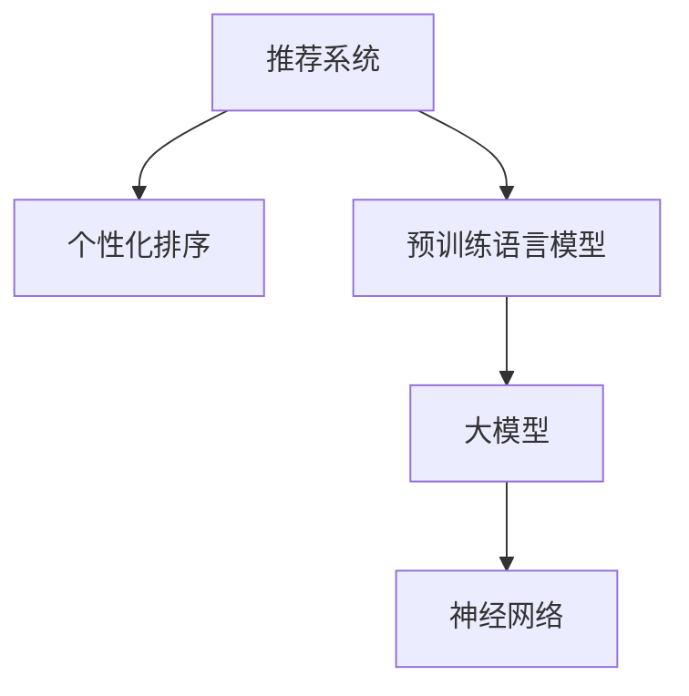

                 

# 大模型在推荐系统个性化排序中的应用

> 关键词：推荐系统,个性化排序,预训练语言模型,大模型,神经网络

## 1. 背景介绍

### 1.1 问题由来
推荐系统作为电子商务平台、视频网站、社交网络等互联网应用的核心引擎，承担着提升用户满意度、增强用户体验的重任。传统的推荐算法，如协同过滤、基于内容的推荐等，多依赖用户行为历史数据和物品属性信息，难以在复杂多变的环境中捕捉用户和物品的动态关系。

近年来，大模型在推荐系统中的应用，为推荐技术带来了全新的突破。通过在大规模无标签数据上进行预训练，大模型可以学习到丰富的用户和物品表征，并在个性化排序中充分运用这些表征，实现精准匹配和推荐。其中最具代表性的大模型包括GPT-3、BERT、T5等。

然而，大模型通常具有庞大的参数量，在推荐系统中直接应用会带来严重的计算和存储负担。此外，如何合理利用预训练大模型的知识，发挥其最大的性能优势，仍然是一个亟待解决的问题。本文将聚焦于大模型在推荐系统个性化排序中的应用，探讨如何有效整合预训练知识，优化推荐效果。

## 2. 核心概念与联系

### 2.1 核心概念概述

为了更好地理解大模型在推荐系统中的应用，本节将介绍几个密切相关的核心概念：

- 推荐系统(Recommendation System)：使用机器学习技术为用户推荐感兴趣物品的系统。推荐系统应用广泛，涉及电商、视频、社交等多个领域。
- 个性化排序(Personalized Ranking)：通过学习用户和物品的复杂关系，对候选物品进行评分排序，推荐最符合用户偏好的物品。
- 预训练语言模型(Pre-trained Language Model)：在大量无标签文本数据上进行预训练，学习语言表征的模型。如BERT、GPT等。
- 大模型(Large Model)：具有大规模参数量，通常超亿级别，用于学习复杂关系和大规模知识。
- 神经网络(Neural Network)：由大量人工神经元构成的计算模型，广泛应用于深度学习中。

这些概念之间的逻辑关系可以通过以下Mermaid流程图来展示：



这个流程图展示了大模型与推荐系统的核心概念及其之间的关系：

1. 推荐系统通过学习用户和物品的复杂关系，为用户推荐感兴趣物品。
2. 个性化排序通过评分排序，实现最符合用户偏好的物品推荐。
3. 预训练语言模型通过大量无标签数据预训练，学习语言表示。
4. 大模型通过堆叠多个预训练语言模型层，学习复杂的关系和大规模知识。
5. 神经网络作为推荐算法的核心，构建模型结构，进行评分计算。

这些概念共同构成了推荐系统的技术框架，使得推荐系统能够通过大模型知识，实现更精准、更具个性化的推荐。

## 3. 核心算法原理 & 具体操作步骤
### 3.1 算法原理概述

大模型在推荐系统个性化排序中的主要思想是：利用大模型学习到的用户和物品的复杂关系，构建用户和物品的语义表征，并结合神经网络模型，计算物品的评分，进而进行个性化排序。

形式化地，假设用户和物品的语义表示分别为 $U=(u_1,u_2,...,u_m)$ 和 $I=(i_1,i_2,...,i_n)$，其中 $u_m$ 和 $i_n$ 分别表示用户和物品的特征向量。设推荐系统的目标是为每个用户推荐 $k$ 个物品，推荐排序可以表示为：

$$
R = \mathop{\arg\min}_{I_{u,k}}\{\mathcal{L}(I_{u,k},U,I)\}
$$

其中 $I_{u,k}$ 表示用户 $u$ 的推荐物品集合，$\mathcal{L}$ 为推荐系统的损失函数，用于衡量推荐结果与真实偏好之间的差异。通常采用的损失函数包括平均绝对误差、交叉熵等。

### 3.2 算法步骤详解

大模型在推荐系统个性化排序中的主要步骤包括：

**Step 1: 准备预训练模型和数据集**
- 选择合适的预训练语言模型 $M_{\theta}$ 作为初始化参数，如 BERT、GPT等。
- 准备推荐系统的训练集、验证集和测试集，包括用户和物品的特征向量 $U$ 和 $I$。

**Step 2: 构建推荐模型**
- 根据任务需求，选择合适的神经网络模型 $N_\theta$，如多层感知机、深度神经网络等。
- 将用户和物品的语义表征 $U$ 和 $I$ 作为输入，传入神经网络模型，计算物品评分。

**Step 3: 设置模型超参数**
- 选择合适的优化算法及其参数，如 Adam、SGD 等，设置学习率、批大小、迭代轮数等。
- 设置正则化技术及强度，包括权重衰减、Dropout、Early Stopping等。
- 确定冻结预训练参数的策略，如仅微调顶层，或全部参数都参与微调。

**Step 4: 执行梯度训练**
- 将训练集数据分批次输入模型，前向传播计算损失函数。
- 反向传播计算参数梯度，根据设定的优化算法和学习率更新模型参数。
- 周期性在验证集上评估模型性能，根据性能指标决定是否触发 Early Stopping。
- 重复上述步骤直到满足预设的迭代轮数或 Early Stopping 条件。

**Step 5: 测试和部署**
- 在测试集上评估微调后模型 $N_{\hat{\theta}}$ 的性能，对比微调前后的精度提升。
- 使用微调后的模型对新物品进行评分预测，集成到实际的应用系统中。
- 持续收集新的数据，定期重新微调模型，以适应数据分布的变化。

以上是利用大模型进行推荐系统个性化排序的一般流程。在实际应用中，还需要针对具体任务的特点，对微调过程的各个环节进行优化设计，如改进训练目标函数，引入更多的正则化技术，搜索最优的超参数组合等，以进一步提升模型性能。

### 3.3 算法优缺点

利用大模型进行推荐系统个性化排序，具有以下优点：

1. 鲁棒性强。大模型已经在大规模数据上预训练，具备较强的泛化能力，对不同领域的推荐任务都能取得不错的性能。
2. 表现优异。在大规模预训练数据和神经网络结构的加持下，推荐模型的精度和个性化程度得到显著提升。
3. 易于扩展。大模型的结构可扩展性高，可以灵活添加新的用户和物品特征，适应动态变化的数据。

同时，该方法也存在一定的局限性：

1. 数据依赖性高。推荐模型的性能高度依赖于数据的质量和数量，获取高质量数据成本较高。
2. 计算资源消耗大。大模型的参数量巨大，训练和推理时计算资源消耗大。
3. 实时性较差。推荐系统需要实时响应，大模型推理速度较慢，难以满足实时要求。
4. 可解释性不足。大模型作为黑盒，难以解释其内部的推理过程和决策机制。

尽管存在这些局限性，但就目前而言，大模型在推荐系统中的应用已取得了显著成效，成为推荐技术的重要发展方向。未来相关研究的重点在于如何进一步降低推荐模型对数据和计算资源的依赖，提高模型的实时性和可解释性，同时兼顾可扩展性和泛化性等因素。

### 3.4 算法应用领域

利用大模型进行推荐系统个性化排序，已经在电商、视频、社交等多个领域取得了广泛应用：

- 电商推荐：通过用户购买历史、浏览行为等信息，推荐用户感兴趣的商品。大模型能够捕捉用户的多样化需求，推荐效果显著。
- 视频推荐：根据用户观看历史、评分记录等信息，推荐用户喜欢的视频内容。大模型具备处理文本和图像的能力，在视频推荐中表现优异。
- 社交推荐：利用用户评论、互动信息，推荐用户可能感兴趣的内容和关系。大模型能够理解复杂的社交关系，推荐结果更加贴合用户需求。

此外，大模型还被创新性地应用于音乐推荐、新闻推荐、游戏推荐等多个场景中，为推荐技术带来了新的突破。随着大模型和推荐技术的不断进步，未来推荐系统的性能和应用范围将进一步拓展，提升用户体验和满意度。

## 4. 数学模型和公式 & 详细讲解  
### 4.1 数学模型构建

本节将使用数学语言对大模型在推荐系统中的应用进行更加严格的刻画。

设用户 $u$ 和物品 $i$ 的语义表征分别为 $U$ 和 $I$，推荐模型的输入为 $(U, I)$，输出为物品的评分 $y$。推荐模型的训练目标为：

$$
\mathcal{L}(N_{\theta}(U, I), y) = \frac{1}{N}\sum_{i=1}^N \ell(N_{\theta}(U, I), y)
$$

其中 $N$ 为训练样本数量，$\ell$ 为损失函数。

假设推荐模型为多层感知机(Multilayer Perceptron, MLP)，结构为 $(D_1, H_1, H_2, ..., H_{L-1}, D_2)$，其中 $D_1$ 为输入维度，$D_2$ 为输出维度，$H_i$ 为第 $i$ 层的神经元个数。

推荐模型的前向传播计算过程为：

$$
\begin{aligned}
h_1 &= \sigma(W_1U + b_1) \\
h_2 &= \sigma(W_2h_1 + b_2) \\
&... \\
h_L &= \sigma(W_Lh_{L-1} + b_L)
\end{aligned}
$$

其中 $W_i$ 和 $b_i$ 分别为第 $i$ 层的权重和偏置向量，$\sigma$ 为激活函数。

模型的输出为：

$$
y = W_2h_L + b_2
$$

模型的损失函数通常采用交叉熵损失：

$$
\ell(y, y') = -\sum_{i=1}^N [y_i \log y'_i + (1-y_i) \log (1-y'_i)]
$$

其中 $y'$ 为模型预测的评分，$y_i$ 为真实评分。

### 4.2 公式推导过程

以下我们以推荐模型的交叉熵损失函数及其梯度计算为例，推导其具体形式。

推荐模型的交叉熵损失函数为：

$$
\mathcal{L}(N_{\theta}(U, I), y) = \frac{1}{N}\sum_{i=1}^N \ell(N_{\theta}(U, I), y_i)
$$

其中 $y_i$ 为真实评分。

前向传播计算过程为：

$$
\begin{aligned}
h_1 &= \sigma(W_1U + b_1) \\
h_2 &= \sigma(W_2h_1 + b_2) \\
&... \\
h_L &= \sigma(W_Lh_{L-1} + b_L)
\end{aligned}
$$

模型的输出为：

$$
y = W_2h_L + b_2
$$

模型的梯度计算过程为：

$$
\frac{\partial \mathcal{L}}{\partial W_2} = \frac{1}{N}\sum_{i=1}^N \frac{\partial \ell}{\partial y'} \frac{\partial y'}{\partial h_L} \frac{\partial h_L}{\partial h_{L-1}} ... \frac{\partial h_1}{\partial U}
$$

其中 $\frac{\partial y'}{\partial h_L} = W_2$，$\frac{\partial h_{i+1}}{\partial h_i} = W_i$，$\frac{\partial \ell}{\partial y'} = y_i - y'_i$。

在得到损失函数的梯度后，即可带入参数更新公式，完成模型的迭代优化。重复上述过程直至收敛，最终得到适应推荐任务的最优模型参数 $\theta$。

## 5. 项目实践：代码实例和详细解释说明
### 5.1 开发环境搭建

在进行推荐系统微调实践前，我们需要准备好开发环境。以下是使用Python进行PyTorch开发的环境配置流程：

1. 安装Anaconda：从官网下载并安装Anaconda，用于创建独立的Python环境。

2. 创建并激活虚拟环境：
```bash
conda create -n pytorch-env python=3.8 
conda activate pytorch-env
```

3. 安装PyTorch：根据CUDA版本，从官网获取对应的安装命令。例如：
```bash
conda install pytorch torchvision torchaudio cudatoolkit=11.1 -c pytorch -c conda-forge
```

4. 安装TensorBoard：
```bash
pip install tensorboard
```

5. 安装各类工具包：
```bash
pip install numpy pandas scikit-learn matplotlib tqdm jupyter notebook ipython
```

完成上述步骤后，即可在`pytorch-env`环境中开始微调实践。

### 5.2 源代码详细实现

这里我们以电商推荐任务为例，给出使用PyTorch对大模型进行推荐系统微调的PyTorch代码实现。

首先，定义推荐任务的数据处理函数：

```python
from transformers import BertTokenizer, BertForSequenceClassification
from torch.utils.data import Dataset
import torch

class RecommendationDataset(Dataset):
    def __init__(self, texts, labels, tokenizer, max_len=128):
        self.texts = texts
        self.labels = labels
        self.tokenizer = tokenizer
        self.max_len = max_len
        
    def __len__(self):
        return len(self.texts)
    
    def __getitem__(self, item):
        text = self.texts[item]
        label = self.labels[item]
        
        encoding = self.tokenizer(text, return_tensors='pt', max_length=self.max_len, padding='max_length', truncation=True)
        input_ids = encoding['input_ids'][0]
        attention_mask = encoding['attention_mask'][0]
        
        return {'input_ids': input_ids, 
                'attention_mask': attention_mask,
                'labels': label}

# 标签与id的映射
label2id = {'buy': 0, 'ignore': 1, 'notbuy': 2}
id2label = {v: k for k, v in label2id.items()}

# 创建dataset
tokenizer = BertTokenizer.from_pretrained('bert-base-cased')

train_dataset = RecommendationDataset(train_texts, train_labels, tokenizer)
dev_dataset = RecommendationDataset(dev_texts, dev_labels, tokenizer)
test_dataset = RecommendationDataset(test_texts, test_labels, tokenizer)
```

然后，定义模型和优化器：

```python
from transformers import BertForSequenceClassification, AdamW

model = BertForSequenceClassification.from_pretrained('bert-base-cased', num_labels=len(label2id))

optimizer = AdamW(model.parameters(), lr=2e-5)
```

接着，定义训练和评估函数：

```python
from torch.utils.data import DataLoader
from tqdm import tqdm
from sklearn.metrics import accuracy_score

device = torch.device('cuda') if torch.cuda.is_available() else torch.device('cpu')
model.to(device)

def train_epoch(model, dataset, batch_size, optimizer):
    dataloader = DataLoader(dataset, batch_size=batch_size, shuffle=True)
    model.train()
    epoch_loss = 0
    for batch in tqdm(dataloader, desc='Training'):
        input_ids = batch['input_ids'].to(device)
        attention_mask = batch['attention_mask'].to(device)
        labels = batch['labels'].to(device)
        model.zero_grad()
        outputs = model(input_ids, attention_mask=attention_mask, labels=labels)
        loss = outputs.loss
        epoch_loss += loss.item()
        loss.backward()
        optimizer.step()
    return epoch_loss / len(dataloader)

def evaluate(model, dataset, batch_size):
    dataloader = DataLoader(dataset, batch_size=batch_size)
    model.eval()
    preds, labels = [], []
    with torch.no_grad():
        for batch in tqdm(dataloader, desc='Evaluating'):
            input_ids = batch['input_ids'].to(device)
            attention_mask = batch['attention_mask'].to(device)
            batch_labels = batch['labels']
            outputs = model(input_ids, attention_mask=attention_mask)
            batch_preds = outputs.logits.argmax(dim=2).to('cpu').tolist()
            batch_labels = batch_labels.to('cpu').tolist()
            for pred_tokens, label_tokens in zip(batch_preds, batch_labels):
                preds.append(pred_tokens[:len(label_tokens)])
                labels.append(label_tokens)
                
    print('Accuracy: {:.4f}'.format(accuracy_score(labels, preds)))
```

最后，启动训练流程并在测试集上评估：

```python
epochs = 5
batch_size = 16

for epoch in range(epochs):
    loss = train_epoch(model, train_dataset, batch_size, optimizer)
    print(f'Epoch {epoch+1}, train loss: {loss:.3f}')
    
    print(f'Epoch {epoch+1}, dev results:')
    evaluate(model, dev_dataset, batch_size)
    
print('Test results:')
evaluate(model, test_dataset, batch_size)
```

以上就是使用PyTorch对BERT进行电商推荐任务微调的完整代码实现。可以看到，得益于Transformers库的强大封装，我们可以用相对简洁的代码完成BERT模型的加载和微调。

### 5.3 代码解读与分析

让我们再详细解读一下关键代码的实现细节：

**RecommendationDataset类**：
- `__init__`方法：初始化文本、标签、分词器等关键组件。
- `__len__`方法：返回数据集的样本数量。
- `__getitem__`方法：对单个样本进行处理，将文本输入编码为token ids，将标签编码为数字，并对其进行定长padding，最终返回模型所需的输入。

**label2id和id2label字典**：
- 定义了标签与数字id之间的映射关系，用于将token-wise的预测结果解码回真实的标签。

**训练和评估函数**：
- 使用PyTorch的DataLoader对数据集进行批次化加载，供模型训练和推理使用。
- 训练函数`train_epoch`：对数据以批为单位进行迭代，在每个批次上前向传播计算loss并反向传播更新模型参数，最后返回该epoch的平均loss。
- 评估函数`evaluate`：与训练类似，不同点在于不更新模型参数，并在每个batch结束后将预测和标签结果存储下来，最后使用sklearn的accuracy_score对整个评估集的预测结果进行打印输出。

**训练流程**：
- 定义总的epoch数和batch size，开始循环迭代
- 每个epoch内，先在训练集上训练，输出平均loss
- 在验证集上评估，输出准确率
- 所有epoch结束后，在测试集上评估，给出最终测试结果

可以看到，PyTorch配合Transformers库使得BERT微调的代码实现变得简洁高效。开发者可以将更多精力放在数据处理、模型改进等高层逻辑上，而不必过多关注底层的实现细节。

当然，工业级的系统实现还需考虑更多因素，如模型的保存和部署、超参数的自动搜索、更灵活的任务适配层等。但核心的微调范式基本与此类似。

## 6. 实际应用场景
### 6.1 电商推荐

基于大模型微调的推荐系统，可以显著提升电商平台的推荐效果，帮助用户快速找到满意的商品。

在技术实现上，可以收集用户的浏览、点击、购买历史等行为数据，将数据经过文本化处理后，作为推荐模型的输入，在大量标注数据上进行微调。微调后的推荐模型能够根据用户的历史行为和兴趣，生成个性化的商品推荐列表。用户浏览网页时，实时调用推荐模型，动态更新推荐结果，以最贴合用户需求的商品推荐提升转化率。

### 6.2 视频推荐

在视频推荐中，用户通常使用一些简单的关键字进行搜索，描述他们的观看偏好。大模型可以通过对用户搜索关键字和历史行为数据的分析，捕捉用户的兴趣点，推荐适合的视频内容。推荐模型可以利用大模型的语义表示能力，理解用户查询和视频标题的语义关系，推荐更加贴近用户需求的视频。

### 6.3 社交推荐

社交推荐系统通过分析用户与内容的互动数据，为用户推荐可能感兴趣的内容和关系。大模型可以通过对用户互动数据的分析，捕捉用户的兴趣和关系模式，推荐更加精准的内容。此外，大模型还可以理解社交关系的多样性和复杂性，推荐符合用户社交习惯的内容，提升用户满意度。

### 6.4 未来应用展望

随着大模型和推荐技术的不断发展，基于微调范式将在更多领域得到应用，为推荐系统带来新的突破。

在智慧医疗领域，基于微调的推荐系统可以辅助医生推荐合适的治疗方案，提升诊疗效果。在智慧教育领域，推荐系统可以推荐合适的学习资料和课程，帮助学生高效学习。在智慧城市治理中，推荐系统可以推荐合适的城市规划和公共服务，提高城市管理效率。

此外，在企业生产、社会治理、文娱传媒等众多领域，基于大模型微调的推荐系统也将不断涌现，为社会各行业带来变革性影响。相信随着技术的日益成熟，微调方法将成为推荐系统的重要发展方向，推动推荐技术的产业化进程。

## 7. 工具和资源推荐
### 7.1 学习资源推荐

为了帮助开发者系统掌握大模型微调的理论基础和实践技巧，这里推荐一些优质的学习资源：

1. 《Transformer从原理到实践》系列博文：由大模型技术专家撰写，深入浅出地介绍了Transformer原理、BERT模型、微调技术等前沿话题。

2. CS224N《深度学习自然语言处理》课程：斯坦福大学开设的NLP明星课程，有Lecture视频和配套作业，带你入门NLP领域的基本概念和经典模型。

3. 《Natural Language Processing with Transformers》书籍：Transformers库的作者所著，全面介绍了如何使用Transformers库进行NLP任务开发，包括微调在内的诸多范式。

4. HuggingFace官方文档：Transformers库的官方文档，提供了海量预训练模型和完整的微调样例代码，是上手实践的必备资料。

5. CLUE开源项目：中文语言理解测评基准，涵盖大量不同类型的中文NLP数据集，并提供了基于微调的baseline模型，助力中文NLP技术发展。

通过对这些资源的学习实践，相信你一定能够快速掌握大模型微调的精髓，并用于解决实际的NLP问题。
###  7.2 开发工具推荐

高效的开发离不开优秀的工具支持。以下是几款用于大模型微调开发的常用工具：

1. PyTorch：基于Python的开源深度学习框架，灵活动态的计算图，适合快速迭代研究。大部分预训练语言模型都有PyTorch版本的实现。

2. TensorFlow：由Google主导开发的开源深度学习框架，生产部署方便，适合大规模工程应用。同样有丰富的预训练语言模型资源。

3. Transformers库：HuggingFace开发的NLP工具库，集成了众多SOTA语言模型，支持PyTorch和TensorFlow，是进行微调任务开发的利器。

4. Weights & Biases：模型训练的实验跟踪工具，可以记录和可视化模型训练过程中的各项指标，方便对比和调优。与主流深度学习框架无缝集成。

5. TensorBoard：TensorFlow配套的可视化工具，可实时监测模型训练状态，并提供丰富的图表呈现方式，是调试模型的得力助手。

6. Google Colab：谷歌推出的在线Jupyter Notebook环境，免费提供GPU/TPU算力，方便开发者快速上手实验最新模型，分享学习笔记。

合理利用这些工具，可以显著提升大模型微调的开发效率，加快创新迭代的步伐。

### 7.3 相关论文推荐

大语言模型和微调技术的发展源于学界的持续研究。以下是几篇奠基性的相关论文，推荐阅读：

1. Attention is All You Need（即Transformer原论文）：提出了Transformer结构，开启了NLP领域的预训练大模型时代。

2. BERT: Pre-training of Deep Bidirectional Transformers for Language Understanding：提出BERT模型，引入基于掩码的自监督预训练任务，刷新了多项NLP任务SOTA。

3. Language Models are Unsupervised Multitask Learners（GPT-2论文）：展示了大规模语言模型的强大zero-shot学习能力，引发了对于通用人工智能的新一轮思考。

4. Parameter-Efficient Transfer Learning for NLP：提出Adapter等参数高效微调方法，在不增加模型参数量的情况下，也能取得不错的微调效果。

5. Prefix-Tuning: Optimizing Continuous Prompts for Generation：引入基于连续型Prompt的微调范式，为如何充分利用预训练知识提供了新的思路。

6. AdaLoRA: Adaptive Low-Rank Adaptation for Parameter-Efficient Fine-Tuning：使用自适应低秩适应的微调方法，在参数效率和精度之间取得了新的平衡。

这些论文代表了大模型微调技术的发展脉络。通过学习这些前沿成果，可以帮助研究者把握学科前进方向，激发更多的创新灵感。

## 8. 总结：未来发展趋势与挑战

### 8.1 总结

本文对大模型在推荐系统个性化排序中的应用进行了全面系统的介绍。首先阐述了大模型在推荐系统中的应用背景和意义，明确了微调在推荐系统中的独特价值。其次，从原理到实践，详细讲解了微调的具体步骤和关键技术，给出了微调任务开发的完整代码实例。同时，本文还广泛探讨了大模型在电商、视频、社交等多个领域的应用前景，展示了微调范式的巨大潜力。此外，本文精选了微调技术的各类学习资源，力求为读者提供全方位的技术指引。

通过本文的系统梳理，可以看到，大模型微调在推荐系统中有着广阔的应用前景。其强大的语言理解和生成能力，使得推荐系统能够更精准地捕捉用户和物品的复杂关系，提供个性化的推荐结果。未来，随着大模型的不断进步和微调技术的多样化发展，推荐系统将进一步拓展其应用领域，提升用户体验和满意度。

### 8.2 未来发展趋势

展望未来，大模型微调在推荐系统中的应用将呈现以下几个发展趋势：

1. 模型规模持续增大。随着算力成本的下降和数据规模的扩张，预训练语言模型的参数量还将持续增长。超大规模语言模型蕴含的丰富语言知识，有望支撑更加复杂多变的推荐任务微调。

2. 微调方法日趋多样。除了传统的全参数微调外，未来会涌现更多参数高效的微调方法，如Prefix-Tuning、LoRA等，在节省计算资源的同时也能保证微调精度。

3. 持续学习成为常态。随着数据分布的不断变化，微调模型也需要持续学习新知识以保持性能。如何在不遗忘原有知识的同时，高效吸收新样本信息，将成为重要的研究课题。

4. 标注样本需求降低。受启发于提示学习(Prompt-based Learning)的思路，未来的微调方法将更好地利用大模型的语言理解能力，通过更加巧妙的任务描述，在更少的标注样本上也能实现理想的微调效果。

5. 实时性提升。现有的微调模型推理速度较慢，难以满足实时要求。未来需要优化模型结构和计算图，提升推理效率，实现实时推荐。

6. 可解释性增强。大模型作为黑盒，难以解释其内部的推理过程和决策机制。未来需要结合符号化知识库和规则库，增强推荐模型的可解释性。

这些趋势凸显了大模型微调技术在推荐系统中的广阔前景。这些方向的探索发展，必将进一步提升推荐系统的性能和应用范围，提升用户体验和满意度。

### 8.3 面临的挑战

尽管大模型微调在推荐系统中的应用已取得了显著成效，但在迈向更加智能化、普适化应用的过程中，它仍面临着诸多挑战：

1. 数据依赖性高。推荐模型的性能高度依赖于数据的质量和数量，获取高质量数据成本较高。如何进一步降低推荐模型对标注样本的依赖，将是一大难题。

2. 计算资源消耗大。大模型的参数量巨大，训练和推理时计算资源消耗大。

3. 实时性较差。推荐系统需要实时响应，大模型推理速度较慢，难以满足实时要求。

4. 可解释性不足。大模型作为黑盒，难以解释其内部的推理过程和决策机制。

尽管存在这些局限性，但就目前而言，大模型在推荐系统中的应用已取得了显著成效，成为推荐技术的重要发展方向。未来相关研究的重点在于如何进一步降低推荐模型对数据和计算资源的依赖，提高模型的实时性和可解释性，同时兼顾可扩展性和泛化性等因素。

### 8.4 研究展望

面对大模型微调面临的挑战，未来的研究需要在以下几个方面寻求新的突破：

1. 探索无监督和半监督微调方法。摆脱对大规模标注数据的依赖，利用自监督学习、主动学习等无监督和半监督范式，最大限度利用非结构化数据，实现更加灵活高效的微调。

2. 研究参数高效和计算高效的微调范式。开发更加参数高效的微调方法，在固定大部分预训练参数的同时，只更新极少量的任务相关参数。同时优化微调模型的计算图，减少前向传播和反向传播的资源消耗，实现更加轻量级、实时性的部署。

3. 融合因果和对比学习范式。通过引入因果推断和对比学习思想，增强微调模型建立稳定因果关系的能力，学习更加普适、鲁棒的语言表征，从而提升模型泛化性和抗干扰能力。

4. 引入更多先验知识。将符号化的先验知识，如知识图谱、逻辑规则等，与神经网络模型进行巧妙融合，引导微调过程学习更准确、合理的语言模型。同时加强不同模态数据的整合，实现视觉、语音等多模态信息与文本信息的协同建模。

5. 结合因果分析和博弈论工具。将因果分析方法引入微调模型，识别出模型决策的关键特征，增强输出解释的因果性和逻辑性。借助博弈论工具刻画人机交互过程，主动探索并规避模型的脆弱点，提高系统稳定性。

6. 纳入伦理道德约束。在模型训练目标中引入伦理导向的评估指标，过滤和惩罚有偏见、有害的输出倾向。同时加强人工干预和审核，建立模型行为的监管机制，确保输出符合人类价值观和伦理道德。

这些研究方向的探索，必将引领大模型微调技术迈向更高的台阶，为构建安全、可靠、可解释、可控的智能系统铺平道路。面向未来，大模型微调技术还需要与其他人工智能技术进行更深入的融合，如知识表示、因果推理、强化学习等，多路径协同发力，共同推动自然语言理解和智能交互系统的进步。只有勇于创新、敢于突破，才能不断拓展语言模型的边界，让智能技术更好地造福人类社会。

## 9. 附录：常见问题与解答

**Q1：大模型微调是否适用于所有推荐任务？**

A: 大模型微调在大多数推荐任务上都能取得不错的效果，特别是对于数据量较小的任务。但对于一些特定领域的任务，如医学、法律等，仅仅依靠通用语料预训练的模型可能难以很好地适应。此时需要在特定领域语料上进一步预训练，再进行微调，才能获得理想效果。此外，对于一些需要时效性、个性化很强的任务，如对话、推荐等，微调方法也需要针对性的改进优化。

**Q2：如何选择合适的微调模型？**

A: 选择微调模型时，需要考虑以下因素：
1. 任务类型：不同的任务类型，如文本推荐、视频推荐、音乐推荐等，适合的微调模型也有所不同。
2. 数据规模：微调模型的选择也需要考虑数据规模，通常超大规模的模型对数据分布的变化更加鲁棒。
3. 计算资源：计算资源限制也需要考虑，微调大模型需要较高的计算资源，难以在低计算环境下应用。
4. 可解释性需求：对于需要可解释性的推荐任务，如医疗、金融等，需要选择可解释性较高的模型。
5. 实时性需求：对于需要实时响应的推荐任务，如电商推荐、视频推荐等，需要选择推理速度较快的模型。

通过综合考虑这些因素，可以选择最适合自己应用场景的微调模型。

**Q3：大模型微调过程中如何避免过拟合？**

A: 避免过拟合是微调过程中需要注意的重要问题。常用的方法包括：
1. 数据增强：通过回译、近义替换等方式扩充训练集。
2. 正则化：使用L2正则、Dropout、Early Stopping等避免模型过拟合。
3. 对抗训练：引入对抗样本，提高模型鲁棒性。
4. 参数高效微调：只更新少量任务相关参数，减小过拟合风险。
5. 多模型集成：训练多个微调模型，取平均输出，抑制过拟合。

这些方法可以根据具体任务和数据特点进行灵活组合，在微调过程中进行有效的正则化。

**Q4：如何评估微调后的推荐模型效果？**

A: 评估微调后的推荐模型效果，通常需要以下几个指标：
1. 准确率：衡量推荐结果与真实偏好的接近程度。
2. 召回率：衡量推荐系统推荐的物品中，真实感兴趣物品的占比。
3. F1值：综合准确率和召回率的指标，通常用于评估推荐模型的综合性能。
4. 覆盖率：衡量推荐模型覆盖所有推荐候选物品的程度。
5. 多样性：衡量推荐结果的多样性程度，避免推荐结果过于集中。

可以通过A/B测试、用户反馈等方法，综合这些指标进行模型效果评估。

**Q5：大模型微调在推荐系统中的优势和劣势是什么？**

A: 大模型微调在推荐系统中的优势包括：
1. 鲁棒性强：大模型已经在大规模数据上预训练，具备较强的泛化能力。
2. 表现优异：大模型能够捕捉用户和物品的复杂关系，推荐效果显著。
3. 易于扩展：大模型的结构可扩展性高，可以灵活添加新的用户和物品特征。

劣势包括：
1. 数据依赖性高：推荐模型的性能高度依赖于数据的质量和数量，获取高质量数据成本较高。
2. 计算资源消耗大：大模型的参数量巨大，训练和推理时计算资源消耗大。
3. 实时性较差：推荐系统需要实时响应，大模型推理速度较慢，难以满足实时要求。
4. 可解释性不足：大模型作为黑盒，难以解释其内部的推理过程和决策机制。

尽管存在这些局限性，但大模型微调在推荐系统中的应用已取得了显著成效，成为推荐技术的重要发展方向。未来需要进一步降低推荐模型对数据和计算资源的依赖，提高模型的实时性和可解释性，同时兼顾可扩展性和泛化性等因素。

---

作者：禅与计算机程序设计艺术 / Zen and the Art of Computer Programming

