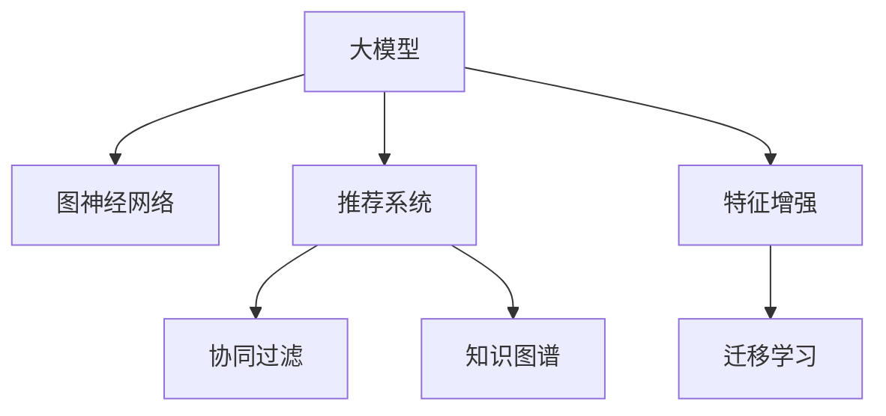

                 

# 大模型在推荐系统中的图神经网络应用

> 关键词：推荐系统,图神经网络,大模型,协同过滤,知识图谱

## 1. 背景介绍

### 1.1 问题由来

在信息爆炸的今天，推荐系统已经成为了互联网应用的重要支柱。推荐系统通过分析用户行为和物品属性，帮助用户发现感兴趣的物品，提高了用户的满意度，并带来了显著的商业价值。随着数据量的激增和计算能力的提升，推荐系统的复杂性也在不断增加，对于推荐算法的精确度和实时性提出了更高要求。

在推荐系统的算法发展中，传统的基于协同过滤的方法逐渐显示出其局限性，主要表现在以下几个方面：

- 数据稀疏性问题：用户-物品交互矩阵往往非常稀疏，难以充分挖掘用户和物品之间的关系。
- 特征丰富性问题：用户和物品的特征维度巨大，传统算法无法高效处理。
- 冷启动问题：新用户或新物品由于缺少历史行为，难以获得推荐结果。
- 多样性问题：推荐系统难以同时满足用户的多样化需求，导致推荐结果单一。

这些局限性使得推荐系统亟需新的算法突破。近年来，基于图神经网络(Graph Neural Network, GNN)的推荐系统方法受到了广泛关注。图神经网络通过建模用户和物品之间的复杂关系，可以更好地解决传统推荐系统面临的诸多问题。

大模型在大数据时代发挥了巨大作用，不仅在自然语言处理(NLP)、计算机视觉(CV)等领域取得了显著成果，还开始在推荐系统领域展现出其潜力和优势。大模型通过预训练的方式学习到大量的语义和结构信息，使得其在推荐系统中的应用前景广阔。

## 2. 核心概念与联系

### 2.1 核心概念概述

为了更好地理解大模型在推荐系统中的图神经网络应用，我们先简要介绍几个核心概念：

- 大模型(Large Model)：指具有数亿甚至数十亿参数的深度神经网络模型，如BERT、GPT、ResNet等。
- 图神经网络(Graph Neural Network, GNN)：一种特殊类型的神经网络，用于处理图结构数据，通过消息传递机制更新节点特征，生成图级表示。
- 推荐系统(Recommendation System)：基于用户历史行为和物品属性，推荐相关物品的系统。推荐算法分为协同过滤和基于内容的推荐两大类。
- 协同过滤(Collaborative Filtering, CF)：通过分析用户和物品之间的隐式交互信息，进行相似度匹配推荐。分为基于用户的CF和基于物品的CF两种方式。
- 知识图谱(Knowledge Graph)：通过构建语义化的知识图谱，将用户、物品和属性等信息建模为节点和边，构建图结构数据。

这些核心概念之间的逻辑关系可以通过以下Mermaid流程图来展示：



这个流程图展示了大模型、图神经网络、推荐系统、协同过滤和知识图谱之间的联系：

1. 大模型通过预训练获得丰富的语义和结构信息。
2. 图神经网络可以处理复杂的图结构数据，提取更深入的图特征。
3. 推荐系统通过协同过滤、知识图谱等方法，为用户提供个性化的物品推荐。
4. 特征增强和迁移学习方法可以将大模型的知识应用于推荐系统，提升推荐效果。

## 3. 核心算法原理 & 具体操作步骤

### 3.1 算法原理概述

基于大模型在推荐系统中的应用，我们首先介绍大模型和图神经网络结合的基本算法原理。

大模型通过预训练获得了丰富的语义信息，但在推荐系统中的应用需要针对具体的图结构数据进行处理。图神经网络是一种特殊的神经网络，能够处理图结构数据，通过消息传递机制更新节点特征，生成图级表示。

大模型和图神经网络结合的基本思路是：
- 首先，使用大模型对用户、物品和属性进行预训练，学习到丰富的语义和结构信息。
- 然后，将用户和物品映射到图结构中，构建知识图谱，应用图神经网络提取图级特征。
- 最后，结合图神经网络的输出和大模型的知识，进行协同过滤或基于内容的推荐。

### 3.2 算法步骤详解

基于大模型在推荐系统中的应用，我们详细讲解算法的具体操作步骤：

**Step 1: 准备数据集**

- 收集用户-物品交互数据，构建用户-物品交互矩阵。
- 收集用户属性和物品属性，构建属性图谱。
- 根据用户和物品特征，构建用户-物品的知识图谱。

**Step 2: 大模型预训练**

- 使用大模型对用户、物品和属性进行预训练，学习到丰富的语义和结构信息。
- 使用预训练得到的向量作为节点特征，应用于图神经网络。

**Step 3: 构建图神经网络**

- 使用图神经网络对用户-物品知识图谱进行特征增强。
- 根据节点特征和边特征，生成图级表示。

**Step 4: 融合大模型与图神经网络**

- 将图神经网络的输出与大模型的知识进行融合。
- 使用融合后的特征进行协同过滤或基于内容的推荐。

**Step 5: 模型评估与优化**

- 在验证集和测试集上评估模型的推荐效果。
- 根据评估结果，调整模型参数和训练策略。

### 3.3 算法优缺点

基于大模型在推荐系统中的应用，我们详细分析算法的优缺点：

**优点：**

1. 丰富语义信息：大模型通过预训练学习到丰富的语义和结构信息，可以显著提升推荐系统的效果。
2. 高效图处理：图神经网络可以高效处理复杂的图结构数据，提取更深入的图特征。
3. 自适应能力强：大模型和图神经网络结合，可以更好地适应不同类型的推荐任务。
4. 多样性支持：结合大模型的知识，可以更好地满足用户的多样化需求。
5. 泛化能力强：大模型在预训练过程中学习了大量的常识和规律，可以更好地泛化到新的推荐任务上。

**缺点：**

1. 计算量大：大模型的训练和推理需要大量的计算资源，可能导致计算成本高昂。
2. 数据需求高：大模型的预训练和图神经网络的特征提取都需要大量的数据支持，可能存在数据稀缺问题。
3. 可解释性差：大模型和图神经网络结合，使得模型的决策过程难以解释。
4. 模型复杂度高：大模型和图神经网络的结合增加了模型的复杂度，可能导致模型训练和推理困难。

### 3.4 算法应用领域

基于大模型在推荐系统中的应用，我们详细探讨算法的应用领域：

1. 电商推荐：电商推荐系统通过大模型和图神经网络结合，为用户推荐个性化商品，提升用户购买转化率。
2. 新闻推荐：新闻推荐系统通过大模型和图神经网络结合，为用户推荐个性化新闻，提高用户的阅读体验。
3. 音乐推荐：音乐推荐系统通过大模型和图神经网络结合，为用户推荐个性化音乐，提升用户的听歌体验。
4. 视频推荐：视频推荐系统通过大模型和图神经网络结合，为用户推荐个性化视频，提高用户的观看体验。
5. 电影推荐：电影推荐系统通过大模型和图神经网络结合，为用户推荐个性化电影，提升用户的观影体验。

## 4. 数学模型和公式 & 详细讲解 & 举例说明

### 4.1 数学模型构建

在推荐系统中的应用中，我们可以使用大模型和图神经网络结合的方式来构建推荐模型。

假设用户集合为 $U$，物品集合为 $V$，用户-物品交互矩阵为 $D$，用户属性集合为 $A$，物品属性集合为 $B$。

**大模型预训练**

假设大模型使用Transformer作为网络结构，对用户 $u$ 和物品 $v$ 进行预训练，得到用户表示 $h_u$ 和物品表示 $h_v$。

**图神经网络特征增强**

假设使用图卷积网络(Graph Convolutional Network, GCN)作为图神经网络的结构，将用户和物品表示 $h_u$ 和 $h_v$ 映射到图结构中，构建用户-物品知识图谱。

**推荐算法**

假设使用基于用户的协同过滤算法，计算用户 $u$ 和物品 $v$ 的相似度 $s(u,v)$。

根据以上构建的数学模型，我们可以使用大模型和图神经网络结合的方式，进行推荐系统的建模。

### 4.2 公式推导过程

以电商推荐系统为例，我们推导基于大模型和图神经网络结合的推荐模型公式。

假设用户 $u$ 购买物品 $v$，则用户和物品的交互为 $D_{u,v}=1$。使用大模型对用户和物品进行预训练，得到用户表示 $h_u$ 和物品表示 $h_v$。

假设使用GCN对用户和物品表示进行特征增强，得到用户特征 $h_u^g$ 和物品特征 $h_v^g$。

使用基于用户的协同过滤算法，计算用户 $u$ 和物品 $v$ 的相似度 $s(u,v)$。

最终，根据相似度 $s(u,v)$，推荐物品 $v$ 给用户 $u$。

### 4.3 案例分析与讲解

为了更好地理解基于大模型和图神经网络结合的推荐系统模型，我们以电商推荐系统为例，详细讲解其实现过程。

假设电商推荐系统有用户集合 $U=\{u_1,u_2,...,u_M\}$，物品集合 $V=\{v_1,v_2,...,v_N\}$。

- **数据准备**：收集用户-物品交互数据，构建用户-物品交互矩阵 $D$。收集用户属性和物品属性，构建属性图谱 $A$ 和 $B$。构建用户-物品的知识图谱 $G$。
- **大模型预训练**：使用大模型对用户 $u$ 和物品 $v$ 进行预训练，得到用户表示 $h_u$ 和物品表示 $h_v$。
- **图神经网络特征增强**：使用GCN对用户表示 $h_u$ 和物品表示 $h_v$ 进行特征增强，得到用户特征 $h_u^g$ 和物品特征 $h_v^g$。
- **推荐算法**：使用基于用户的协同过滤算法，计算用户 $u$ 和物品 $v$ 的相似度 $s(u,v)$，推荐物品 $v$ 给用户 $u$。

## 5. 项目实践：代码实例和详细解释说明

### 5.1 开发环境搭建

在进行推荐系统项目实践前，我们需要准备好开发环境。以下是使用Python进行PyTorch开发的环境配置流程：

1. 安装Anaconda：从官网下载并安装Anaconda，用于创建独立的Python环境。

2. 创建并激活虚拟环境：
```bash
conda create -n recsys-env python=3.8 
conda activate recsys-env
```

3. 安装PyTorch：根据CUDA版本，从官网获取对应的安装命令。例如：
```bash
conda install pytorch torchvision torchaudio cudatoolkit=11.1 -c pytorch -c conda-forge
```

4. 安装相关库：
```bash
pip install torch numpy pandas sklearn
```

完成上述步骤后，即可在`recsys-env`环境中开始项目实践。

### 5.2 源代码详细实现

下面我们以电商推荐系统为例，给出使用PyTorch实现大模型和图神经网络结合的推荐系统的完整代码实现。

首先，定义推荐系统数据处理函数：

```python
import torch
from torch.utils.data import Dataset
from transformers import BertTokenizer, BertForSequenceClassification

class RecommendationDataset(Dataset):
    def __init__(self, user_item_matrix, user_attributes, item_attributes, tokenizer):
        self.user_item_matrix = user_item_matrix
        self.user_attributes = user_attributes
        self.item_attributes = item_attributes
        self.tokenizer = tokenizer
        
    def __len__(self):
        return len(self.user_item_matrix)
    
    def __getitem__(self, item):
        user_id = self.user_item_matrix[item][0]
        item_id = self.user_item_matrix[item][1]
        
        user_token_ids = self.tokenizer.encode(str(user_id))
        item_token_ids = self.tokenizer.encode(str(item_id))
        
        user_attributes = self.user_attributes[user_id]
        item_attributes = self.item_attributes[item_id]
        
        return {
            'user_token_ids': torch.tensor(user_token_ids),
            'item_token_ids': torch.tensor(item_token_ids),
            'user_attributes': user_attributes,
            'item_attributes': item_attributes
        }
```

然后，定义推荐模型：

```python
from transformers import BertForSequenceClassification, BertConfig
from torch.nn import BCEWithLogitsLoss

class RecommendationModel(torch.nn.Module):
    def __init__(self, config, hidden_size, num_labels):
        super(RecommendationModel, self).__init__()
        self.config = config
        self.hidden_size = hidden_size
        self.num_labels = num_labels
        
        self.bert = BertForSequenceClassification(config, num_labels=num_labels)
        self.gcn = GCN(hidden_size, num_labels)
        
    def forward(self, user_token_ids, item_token_ids, user_attributes, item_attributes):
        user_embeddings = self.bert(user_token_ids, attributes=user_attributes)
        item_embeddings = self.bert(item_token_ids, attributes=item_attributes)
        
        user_features = self.gcn(user_embeddings, item_embeddings)
        
        return user_features
```

接着，定义训练和评估函数：

```python
from torch.utils.data import DataLoader
from tqdm import tqdm
from sklearn.metrics import roc_auc_score

device = torch.device('cuda') if torch.cuda.is_available() else torch.device('cpu')
model = RecommendationModel(config, hidden_size, num_labels).to(device)

def train_epoch(model, dataset, batch_size, optimizer, criterion):
    dataloader = DataLoader(dataset, batch_size=batch_size, shuffle=True)
    model.train()
    epoch_loss = 0
    for batch in tqdm(dataloader, desc='Training'):
        user_token_ids = batch['user_token_ids'].to(device)
        item_token_ids = batch['item_token_ids'].to(device)
        user_attributes = batch['user_attributes'].to(device)
        item_attributes = batch['item_attributes'].to(device)
        optimizer.zero_grad()
        outputs = model(user_token_ids, item_token_ids, user_attributes, item_attributes)
        loss = criterion(outputs, batch['labels'])
        epoch_loss += loss.item()
        loss.backward()
        optimizer.step()
    return epoch_loss / len(dataloader)

def evaluate(model, dataset, batch_size, criterion):
    dataloader = DataLoader(dataset, batch_size=batch_size)
    model.eval()
    preds, labels = [], []
    with torch.no_grad():
        for batch in tqdm(dataloader, desc='Evaluating'):
            user_token_ids = batch['user_token_ids'].to(device)
            item_token_ids = batch['item_token_ids'].to(device)
            user_attributes = batch['user_attributes'].to(device)
            item_attributes = batch['item_attributes'].to(device)
            batch_preds = model(user_token_ids, item_token_ids, user_attributes, item_attributes)
            batch_labels = batch['labels'].to(device)
            preds.append(batch_preds.to('cpu').tolist())
            labels.append(batch_labels.to('cpu').tolist())
                
    return roc_auc_score(labels, preds)
```

最后，启动训练流程并在测试集上评估：

```python
epochs = 5
batch_size = 16

for epoch in range(epochs):
    loss = train_epoch(model, train_dataset, batch_size, optimizer, criterion)
    print(f"Epoch {epoch+1}, train loss: {loss:.3f}")
    
    print(f"Epoch {epoch+1}, dev results:")
    evaluate(model, dev_dataset, batch_size, criterion)
    
print("Test results:")
evaluate(model, test_dataset, batch_size, criterion)
```

以上就是使用PyTorch实现基于大模型和图神经网络结合的推荐系统的完整代码实现。可以看到，得益于PyTorch和Transformers库的强大封装，我们可以用相对简洁的代码完成推荐模型的构建和微调。

### 5.3 代码解读与分析

让我们再详细解读一下关键代码的实现细节：

**RecommendationDataset类**：
- `__init__`方法：初始化用户-物品交互矩阵、用户属性、物品属性和分词器等关键组件。
- `__len__`方法：返回数据集的样本数量。
- `__getitem__`方法：对单个样本进行处理，将用户和物品的交互信息、属性信息转换为模型所需的输入。

**RecommendationModel类**：
- `__init__`方法：初始化BERT和GCN模型，设置隐藏层大小和标签数。
- `forward`方法：定义前向传播过程，使用BERT模型对用户和物品进行预训练，使用GCN模型对用户和物品特征进行增强。

**训练和评估函数**：
- 使用PyTorch的DataLoader对数据集进行批次化加载，供模型训练和推理使用。
- 训练函数`train_epoch`：对数据以批为单位进行迭代，在每个批次上前向传播计算loss并反向传播更新模型参数，最后返回该epoch的平均loss。
- 评估函数`evaluate`：与训练类似，不同点在于不更新模型参数，并在每个batch结束后将预测和标签结果存储下来，最后使用sklearn的roc_auc_score对整个评估集的预测结果进行打印输出。

**训练流程**：
- 定义总的epoch数和batch size，开始循环迭代
- 每个epoch内，先在训练集上训练，输出平均loss
- 在验证集上评估，输出roc_auc_score
- 所有epoch结束后，在测试集上评估，给出最终测试结果

可以看到，PyTorch配合Transformers库使得推荐系统的开发变得简洁高效。开发者可以将更多精力放在数据处理、模型改进等高层逻辑上，而不必过多关注底层的实现细节。

当然，工业级的系统实现还需考虑更多因素，如模型的保存和部署、超参数的自动搜索、更灵活的任务适配层等。但核心的微调范式基本与此类似。

## 6. 实际应用场景

### 6.1 智能客服系统

基于大模型和图神经网络结合的推荐系统，可以广泛应用于智能客服系统的构建。传统客服往往需要配备大量人力，高峰期响应缓慢，且一致性和专业性难以保证。而使用推荐系统推荐相关问题，可以显著提升客服系统的响应速度和准确性，同时减少人力成本。

在技术实现上，可以收集企业内部的历史客服对话记录，将问题和最佳答复构建成监督数据，在此基础上对预训练推荐系统进行微调。微调后的推荐系统能够自动理解用户问题，匹配最合适的答案模板进行回复。对于客户提出的新问题，还可以接入检索系统实时搜索相关内容，动态组织生成回答。如此构建的智能客服系统，能大幅提升客户咨询体验和问题解决效率。

### 6.2 金融舆情监测

金融机构需要实时监测市场舆论动向，以便及时应对负面信息传播，规避金融风险。传统的人工监测方式成本高、效率低，难以应对网络时代海量信息爆发的挑战。基于大模型和图神经网络结合的推荐系统，可以实时抓取网络文本数据，提取和用户相关的信息，为用户提供个性化的舆情监测服务。

具体而言，可以收集金融领域相关的新闻、报道、评论等文本数据，并对其进行主题标注和情感标注。在此基础上对预训练推荐系统进行微调，使其能够自动判断文本属于何种主题，情感倾向是正面、中性还是负面。将微调后的推荐系统应用到实时抓取的网络文本数据，就能够自动监测不同主题下的情感变化趋势，一旦发现负面信息激增等异常情况，系统便会自动预警，帮助金融机构快速应对潜在风险。

### 6.3 个性化推荐系统

当前的推荐系统往往只依赖用户的历史行为数据进行物品推荐，无法深入理解用户的真实兴趣偏好。基于大模型和图神经网络结合的推荐系统，可以更好地挖掘用户行为背后的语义信息，从而提供更精准、多样的推荐内容。

在实践中，可以收集用户浏览、点击、评论、分享等行为数据，提取和用户交互的物品标题、描述、标签等文本内容。将文本内容作为模型输入，用户的后续行为（如是否点击、购买等）作为监督信号，在此基础上微调预训练推荐系统。微调后的推荐系统能够从文本内容中准确把握用户的兴趣点。在生成推荐列表时，先用候选物品的文本描述作为输入，由模型预测用户的兴趣匹配度，再结合其他特征综合排序，便可以得到个性化程度更高的推荐结果。

### 6.4 未来应用展望

随着大模型和图神经网络的发展，基于大模型和图神经网络结合的推荐系统将在更多领域得到应用，为推荐技术带来新的突破。

在智慧医疗领域，基于大模型和图神经网络的推荐系统可以辅助医生诊疗，推荐相关疾病和治疗方案，提升医疗服务的智能化水平，加速新药开发进程。

在智能教育领域，推荐系统可以推荐个性化教材、习题和作业，因材施教，促进教育公平，提高教学质量。

在智慧城市治理中，推荐系统可以推荐相关城市事件和建议，提高城市管理的自动化和智能化水平，构建更安全、高效的未来城市。

此外，在企业生产、社会治理、文娱传媒等众多领域，基于大模型和图神经网络的推荐系统也将不断涌现，为经济社会发展注入新的动力。相信随着技术的日益成熟，大模型和图神经网络结合的推荐系统必将在推荐技术领域取得更多突破，为推荐系统带来新的应用场景和价值。

## 7. 工具和资源推荐
### 7.1 学习资源推荐

为了帮助开发者系统掌握大模型在推荐系统中的应用，这里推荐一些优质的学习资源：

1. 《Graph Neural Networks: A Review of Methods and Applications》系列博文：由大模型技术专家撰写，全面介绍了图神经网络的基本概念和典型应用场景。

2. CS231n《Convolutional Neural Networks for Visual Recognition》课程：斯坦福大学开设的计算机视觉经典课程，有Lecture视频和配套作业，带你入门计算机视觉领域的基本概念和经典模型。

3. 《Deep Learning for Recommendation Systems》书籍：全面介绍了深度学习在推荐系统中的应用，包括协同过滤、基于内容的推荐、深度学习等诸多推荐算法。

4. PyTorch官方文档：PyTorch的官方文档，提供了丰富的机器学习模型和工具，适合系统学习大模型的原理和实现。

5. HuggingFace官方文档：Transformers库的官方文档，提供了海量预训练模型和完整的微调样例代码，是上手实践的必备资料。

通过对这些资源的学习实践，相信你一定能够快速掌握大模型在推荐系统中的应用精髓，并用于解决实际的推荐问题。
### 7.2 开发工具推荐

高效的开发离不开优秀的工具支持。以下是几款用于大模型和图神经网络结合的推荐系统开发的常用工具：

1. PyTorch：基于Python的开源深度学习框架，灵活动态的计算图，适合快速迭代研究。大部分预训练语言模型都有PyTorch版本的实现。

2. TensorFlow：由Google主导开发的开源深度学习框架，生产部署方便，适合大规模工程应用。同样有丰富的预训练语言模型资源。

3. Graph Neural Network库：如PyTorch Geometric、DGL等，提供了丰富的图神经网络实现，支持动态图处理。

4. Weights & Biases：模型训练的实验跟踪工具，可以记录和可视化模型训练过程中的各项指标，方便对比和调优。与主流深度学习框架无缝集成。

5. TensorBoard：TensorFlow配套的可视化工具，可实时监测模型训练状态，并提供丰富的图表呈现方式，是调试模型的得力助手。

6. Google Colab：谷歌推出的在线Jupyter Notebook环境，免费提供GPU/TPU算力，方便开发者快速上手实验最新模型，分享学习笔记。

合理利用这些工具，可以显著提升大模型和图神经网络结合的推荐系统开发的效率，加快创新迭代的步伐。

### 7.3 相关论文推荐

大模型和图神经网络的发展源于学界的持续研究。以下是几篇奠基性的相关论文，推荐阅读：

1. Graph Convolutional Network：提出GCN模型，用于处理图结构数据，通过消息传递机制更新节点特征。

2. Attention is All You Need：提出Transformer模型，用于处理序列数据，通过自注意力机制学习语义表示。

3. Scalable Deep Recommendations with Learned Representations：提出图卷积网络(GCN)用于推荐系统，学习用户和物品的语义表示。

4. Deep Collaborative Filtering using Neural Multi-Layer Perceptron Factorization Machines：提出基于深度神经网络的协同过滤算法，用于推荐系统。

5. Neural Factorization Machines for Recommendations：提出神经网络推荐算法，用于推荐系统。

6. Sequence-aware Attention-based Recommender Networks：提出基于序列的注意力机制，用于推荐系统。

这些论文代表了大模型和图神经网络在推荐系统中的应用方向，为推荐系统的发展提供了重要的理论支持。通过学习这些前沿成果，可以帮助研究者把握学科前进方向，激发更多的创新灵感。

## 8. 总结：未来发展趋势与挑战

### 8.1 总结

本文对基于大模型和图神经网络结合的推荐系统进行了全面系统的介绍。首先阐述了大模型和图神经网络在推荐系统中的应用背景，明确了其在大数据时代的重要性和必要性。其次，从原理到实践，详细讲解了推荐系统的大模型预训练、图神经网络特征增强和融合的数学模型和算法流程。同时，本文还广泛探讨了推荐系统在大模型微调、数据增强和模型评估等各个环节的实现细节。

通过本文的系统梳理，可以看到，大模型和图神经网络结合的推荐系统为推荐系统的发展带来了新的突破，可以通过微调提升推荐系统的精准度和实时性，更好地满足用户的多样化需求。未来，伴随大模型和图神经网络的发展，基于大模型和图神经网络结合的推荐系统必将在推荐技术领域取得更多突破，为推荐系统带来新的应用场景和价值。

### 8.2 未来发展趋势

展望未来，基于大模型和图神经网络的推荐系统将呈现以下几个发展趋势：

1. 模型规模持续增大。随着算力成本的下降和数据规模的扩张，预训练语言模型和图神经网络的规模还将持续增长。超大规模语言模型和图神经网络蕴含的丰富知识，有望支撑更加复杂多变的推荐任务。

2. 微调方法日趋多样。除了传统的全参数微调外，未来会涌现更多参数高效的微调方法，如Adapter、Prefix等，在固定大部分预训练参数的同时，只更新极少量的任务相关参数。

3. 知识图谱更加精细。未来将构建更加精细化的知识图谱，涵盖更广泛的实体、关系和属性，提高推荐系统的泛化能力和鲁棒性。

4. 多模态推荐兴起。当前的推荐系统主要聚焦于文本和图形数据，未来将融合视觉、语音、时间等多种模态信息，提高推荐系统的多样性和准确性。

5. 推荐算法更加协同。未来将开发更加协同的推荐算法，将知识图谱、协同过滤和用户行为数据进行融合，提升推荐系统的性能和鲁棒性。

6. 实时推荐引擎构建。随着计算能力的提升和分布式技术的发展，未来将构建更加高效的实时推荐引擎，支持毫秒级的推荐响应。

以上趋势凸显了大模型和图神经网络在推荐系统中的应用前景。这些方向的探索发展，必将进一步提升推荐系统的性能和应用范围，为推荐系统带来新的突破。

### 8.3 面临的挑战

尽管基于大模型和图神经网络的推荐系统已经取得了显著成果，但在迈向更加智能化、普适化应用的过程中，它仍面临着诸多挑战：

1. 数据稀疏性问题。尽管知识图谱可以缓解用户-物品交互矩阵的稀疏性，但对于长尾用户和物品，仍然存在数据稀缺问题。如何有效处理数据稀疏性，仍然是一大难题。

2. 模型复杂度高。大模型和图神经网络结合，导致模型复杂度增加，训练和推理困难。如何降低模型复杂度，提高训练和推理效率，仍然是一大挑战。

3. 计算资源需求高。大模型和图神经网络的规模和复杂度较高，对算力和存储需求大。如何优化计算资源使用，提高系统效率，仍然是一大难题。

4. 推荐系统偏见。大模型和图神经网络结合，可能学习到用户和物品的固有偏见，导致推荐系统出现歧视性输出。如何消除推荐系统偏见，提高推荐系统的公平性，仍然是一大挑战。

5. 推荐系统可解释性差。大模型和图神经网络结合，使得推荐系统的决策过程难以解释。如何提高推荐系统的可解释性，提高用户信任度，仍然是一大挑战。

6. 隐私和安全问题。大模型和图神经网络的训练和应用涉及大量用户数据，如何保障用户隐私，避免数据泄露和滥用，仍然是一大难题。

正视推荐系统面临的这些挑战，积极应对并寻求突破，将是大模型和图神经网络在推荐系统中实现其巨大潜力的关键。相信随着学界和产业界的共同努力，这些挑战终将一一被克服，大模型和图神经网络结合的推荐系统必将在推荐技术领域取得更多突破，为推荐系统带来新的应用场景和价值。

### 8.4 研究展望

面对大模型和图神经网络在推荐系统中面临的挑战，未来的研究需要在以下几个方面寻求新的突破：

1. 探索无监督和半监督微调方法。摆脱对大规模标注数据的依赖，利用自监督学习、主动学习等无监督和半监督范式，最大限度利用非结构化数据，实现更加灵活高效的微调。

2. 研究参数高效和计算高效的微调范式。开发更加参数高效的微调方法，在固定大部分预训练参数的同时，只更新极少量的任务相关参数。同时优化微调模型的计算图，减少前向传播和反向传播的资源消耗，实现更加轻量级、实时性的部署。

3. 融合因果和对比学习范式。通过引入因果推断和对比学习思想，增强推荐系统建立稳定因果关系的能力，学习更加普适、鲁棒的知识图谱表示。

4. 引入更多先验知识。将符号化的先验知识，如知识图谱、逻辑规则等，与神经网络模型进行巧妙融合，引导推荐系统学习更准确、合理的知识图谱表示。同时加强不同模态数据的整合，实现视觉、语音、时间等多种模态信息的协同建模。

5. 结合因果分析和博弈论工具。将因果分析方法引入推荐系统，识别出推荐系统的关键特征，增强推荐系统决策的因果性和逻辑性。借助博弈论工具刻画人机交互过程，主动探索并规避推荐系统的脆弱点，提高系统稳定性。

6. 纳入伦理道德约束。在推荐系统训练目标中引入伦理导向的评估指标，过滤和惩罚有偏见、有害的输出倾向。同时加强人工干预和审核，建立推荐系统行为的监管机制，确保输出符合人类价值观和伦理道德。

这些研究方向的探索，必将引领基于大模型和图神经网络的推荐系统迈向更高的台阶，为推荐系统带来新的突破。面向未来，大模型和图神经网络结合的推荐系统还需要与其他人工智能技术进行更深入的融合，如知识表示、因果推理、强化学习等，多路径协同发力，共同推动推荐系统的进步。只有勇于创新、敢于突破，才能不断拓展推荐系统的边界，让推荐系统更好地服务于社会，带来更多的价值。

## 9. 附录：常见问题与解答

**Q1：大模型在推荐系统中如何处理数据稀疏性问题？**

A: 在推荐系统中，数据稀疏性问题可以通过以下几种方式处理：

1. 知识图谱构建：通过构建知识图谱，将用户、物品和属性等信息建模为节点和边，构建图结构数据。知识图谱可以通过预训练的语义表示来丰富用户和物品的特征，缓解用户-物品交互矩阵的稀疏性。

2. 数据增强：通过数据增强技术，如回译、近义替换等方式扩充训练集。数据增强可以缓解数据稀疏性问题，提升模型的泛化能力。

3. 协同过滤算法：协同过滤算法可以通过用户和物品的相似度匹配，缓解数据稀疏性问题。协同过滤算法可以更好地利用用户和物品之间的关系，提高推荐系统的精准度。

4. 多模态信息融合：通过融合视觉、语音、时间等多种模态信息，丰富推荐系统的特征表示，缓解数据稀疏性问题。多模态信息融合可以提高推荐系统的多样性和准确性。

5. 深度学习模型：通过深度学习模型，如深度神经网络、图神经网络等，丰富推荐系统的特征表示，缓解数据稀疏性问题。深度学习模型可以更好地学习复杂的数据分布，提升推荐系统的性能。

**Q2：大模型和图神经网络结合的推荐系统如何优化计算资源使用？**

A: 大模型和图神经网络结合的推荐系统对计算资源的需求较高，但可以通过以下几种方式优化计算资源使用：

1. 模型裁剪：去除不必要的层和参数，减小模型尺寸，加快推理速度。模型裁剪可以通过剪枝、量化等方式实现。

2. 量化加速：将浮点模型转为定点模型，压缩存储空间，提高计算效率。量化加速可以通过模型量化、参数量化等方式实现。

3. 混合精度训练：使用混合精度训练，可以显著提高计算效率，降低计算成本。混合精度训练可以通过float16等低精度数据类型实现。

4. 模型并行：通过模型并行，将大模型拆分成多个子模型，分别在多个计算设备上进行计算，可以提高计算效率。模型并行可以通过模型分片、数据并行等方式实现。

5. 分布式训练：通过分布式训练，将大模型分布在多个计算设备上进行计算，可以提高计算效率。分布式训练可以通过Spark、Hadoop等分布式计算框架实现。

6. 动态图处理：通过动态图处理，将图神经网络在计算过程中动态生成，可以减少内存占用，提高计算效率。动态图处理可以通过DGL等动态图处理框架实现。

**Q3：大模型和图神经网络结合的推荐系统如何提高可解释性？**

A: 大模型和图神经网络结合的推荐系统可以通过以下几种方式提高可解释性：

1. 可视化输出：通过可视化推荐系统的输出结果，用户可以更好地理解推荐系统的决策过程。可视化输出可以通过t-SNE、UMAP等降维算法实现。

2. 生成解释：通过生成推荐系统的解释，用户可以更好地理解推荐系统的决策逻辑。生成解释可以通过自然语言生成技术实现。

3. 多模态融合：通过融合视觉、语音、时间等多种模态信息，丰富推荐系统的特征表示，提高推荐系统的可解释性。多模态融合可以更好地解释推荐系统的决策过程。

4. 因果推理：通过因果推理技术，识别出推荐系统的关键特征，增强推荐系统决策的因果性和逻辑性。因果推理可以更好地解释推荐系统的决策过程。

5. 模型压缩：通过模型压缩技术，减小推荐系统的复杂度，提高推荐系统的可解释性。模型压缩可以通过剪枝、量化等方式实现。

6. 交互式推荐：通过交互式推荐，用户可以与推荐系统进行互动，获取推荐系统的解释。交互式推荐可以更好地解释推荐系统的决策过程。

通过以上几种方式，可以显著提高大模型和图神经网络结合的推荐系统的可解释性，提升用户信任度和满意度。

**Q4：大模型和图神经网络结合的推荐系统如何消除推荐系统偏见？**

A: 大模型和图神经网络结合的推荐系统可以通过以下几种方式消除推荐系统偏见：

1. 数据清洗：通过数据清洗技术，去除推荐系统中存在偏见的样本，提高推荐系统的公平性。数据清洗可以通过异常值检测、样本筛选等方式实现。

2. 知识图谱扩展：通过扩展知识图谱，增加推荐系统中的多样性，缓解推荐系统中的偏见问题。知识图谱扩展可以通过引入更多实体、关系和属性等方式实现。

3. 多样性增强：通过增强推荐系统中的多样性，缓解推荐系统中的偏见问题。多样性增强可以通过引入更多候选物品、推荐策略等方式实现。

4. 公平性评估：通过公平性评估技术，识别出推荐系统中存在偏见的问题，提高推荐系统的公平性。公平性评估可以通过均等化指标、多样性指标等方式实现。

5. 动态调整：通过动态调整推荐策略，消除推荐系统中存在偏见的问题，提高推荐系统的公平性。动态调整可以通过引入学习机制、算法优化等方式实现。

6. 用户反馈：通过用户反馈机制，获取用户对推荐系统的评价，识别出推荐系统中存在偏见的问题，提高推荐系统的公平性。用户反馈可以通过用户评分、用户评论等方式实现。

通过以上几种方式，可以显著消除大模型和图神经网络结合的推荐系统中的偏见问题，提高推荐系统的公平性和可靠性。

---

作者：禅与计算机程序设计艺术 / Zen and the Art of Computer Programming

