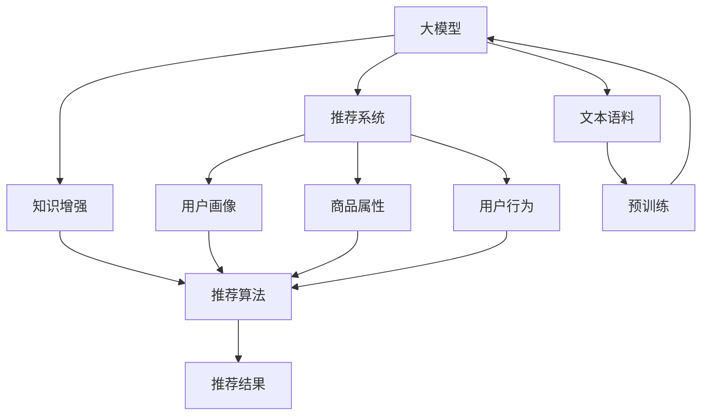

                 

## 1. 背景介绍

推荐系统是现代信息时代的重要组成部分，用于帮助用户发现感兴趣的内容，提升用户体验。传统的推荐系统主要基于用户行为数据，如点击、浏览、评分等，使用机器学习算法构建用户兴趣模型，预测用户可能感兴趣的商品或内容。然而，这种方法存在数据稀疏、冷启动问题，难以捕获用户深层次的兴趣偏好，特别是对于新用户和老用户，推荐效果大打折扣。

近年来，随着深度学习和大规模预训练语言模型的发展，推荐系统也迎来了新的机遇。大模型作为推荐系统的"知识增强器"，可以从海量的无标签文本数据中提取丰富的知识，用于辅助推荐决策。利用预训练语言模型强大的语义理解能力，推荐系统可以在有限的标注数据下，提升推荐效果，增加推荐的个性化和多样性。

## 2. 核心概念与联系

### 2.1 核心概念概述

为更好地理解大模型在推荐系统中的知识增强与推理，本节将介绍几个密切相关的核心概念：

- 大模型(Large Model)：以BERT、GPT等深度学习模型为代表的大规模预训练模型，能够从海量的无标签文本数据中学习到丰富的语言知识和常识。
- 推荐系统(Recommendation System)：基于用户行为数据或产品特征，通过推荐算法为用户推荐感兴趣内容或商品的系统。
- 知识增强(Knowledge Augmentation)：通过引入外部知识，如语义信息、用户画像、商品属性等，提升推荐系统的效果和性能。
- 推理(Inference)：利用大模型的语义理解能力，根据用户输入和上下文信息，生成合理的推荐结果。

这些核心概念之间存在密切联系，共同构成了大模型在推荐系统中的应用框架。具体而言，推荐系统可以利用大模型作为"知识增强器"，提取并融合外部知识，提升推荐质量；利用大模型的推理能力，生成更具个性化的推荐结果，从而提高用户的满意度和粘性。

### 2.2 核心概念原理和架构的 Mermaid 流程图



该流程图展示了核心概念之间的联系：

1. 大模型(A)通过预训练(I)学习丰富的语言知识和常识，可以作为推荐系统的"知识增强器"。
2. 推荐系统(B)根据用户画像(E)、商品属性(F)、用户行为(G)等输入，结合大模型的知识增强结果，进行推荐决策。
3. 推荐算法(D)利用大模型的推理能力，生成个性化的推荐结果(J)。

## 3. 核心算法原理 & 具体操作步骤

### 3.1 算法原理概述

大模型在推荐系统中的知识增强与推理，本质上是一种基于预训练语言模型的推荐范式。其核心思想是：利用大模型强大的语义理解能力，提取并融合外部知识，提升推荐系统的效果和性能。

具体而言，推荐系统可以分为两个阶段：

1. **知识增强阶段**：通过预训练大模型对用户画像、商品属性等外部知识进行编码，生成高维特征向量。
2. **推理阶段**：根据用户输入和上下文信息，利用大模型的推理能力生成推荐结果。

在知识增强阶段，大模型对外部知识进行编码，得到高维特征向量。这些特征向量包含了知识的内在结构，有助于推荐系统的模型理解。在推理阶段，模型根据用户的输入和上下文信息，对编码后的知识进行推理，生成个性化的推荐结果。

### 3.2 算法步骤详解

大模型在推荐系统中的应用，一般包括以下几个关键步骤：

**Step 1: 准备数据集**

- 收集用户画像、商品属性、用户行为等数据，构建推荐系统所需的全量数据集。
- 将文本数据进行预处理，如分词、去除停用词、标准化等操作。

**Step 2: 预训练大模型**

- 选择合适的大模型，如BERT、GPT等，在预定义的语料上进行预训练。
- 使用自监督学习任务，如掩码语言模型、NCE等，学习语言知识。

**Step 3: 知识增强**

- 对用户画像、商品属性等文本数据进行编码，得到高维特征向量。
- 将编码后的特征向量输入大模型，生成更深层的语义表示。
- 利用BERT、GPT等模型的可微性，通过反向传播更新模型参数。

**Step 4: 推荐算法**

- 选择合适的推荐算法，如协同过滤、基于内容的推荐等。
- 将大模型的语义表示与用户画像、商品属性等特征向量结合，进行推荐决策。
- 使用离线评估指标(如准确率、召回率、F1值等)评估模型性能。

**Step 5: 部署与优化**

- 将训练好的模型部署到生产环境。
- 持续收集用户反馈，进行在线A/B测试，优化推荐策略。
- 利用实时数据动态更新模型参数，提升推荐效果。

### 3.3 算法优缺点

基于大模型的推荐系统具有以下优点：

1. **语义理解能力**：大模型能够理解复杂的文本信息，提取内在语义结构，提升推荐的质量。
2. **多模态融合**：大模型可以处理文本、图像、音频等多种模态数据，实现多模态推荐。
3. **个性化推荐**：利用大模型对用户兴趣进行深度刻画，生成更个性化的推荐结果。
4. **自动特征提取**：大模型能够自动提取和融合外部知识，减少人工特征工程的复杂度。

然而，该方法也存在一些局限性：

1. **计算资源需求高**：大模型需要大量计算资源进行训练和推理，对于小型推荐系统可能难以支持。
2. **实时性问题**：大模型的推理时间较长，难以满足实时推荐的需求。
3. **数据隐私问题**：大模型需要访问用户画像、商品属性等敏感数据，存在数据隐私风险。
4. **模型泛化能力**：大模型的预训练和微调过程依赖于特定的数据集，可能对新领域数据泛化能力不足。

尽管存在这些局限性，但大模型在推荐系统中的应用已经展现出了巨大的潜力。未来相关研究的方向是如何在保持高表现的同时，降低计算成本，提升实时性，同时保护数据隐私，提高模型的泛化能力。

### 3.4 算法应用领域

基于大模型的推荐系统已经在诸多实际应用中得到了验证，涵盖了各种行业，包括但不限于：

1. **电商推荐**：根据用户浏览、购买历史，结合商品属性，生成个性化推荐。
2. **新闻推荐**：根据用户阅读习惯，生成个性化新闻文章推荐。
3. **音乐推荐**：根据用户听歌历史，生成个性化音乐推荐。
4. **视频推荐**：根据用户观看历史，生成个性化视频推荐。
5. **旅游推荐**：根据用户旅行历史和兴趣，生成个性化旅游目的地推荐。
6. **金融推荐**：根据用户财务数据，生成个性化金融产品推荐。

## 4. 数学模型和公式 & 详细讲解

### 4.1 数学模型构建

大模型在推荐系统中的应用，可以表示为如下框架：

假设推荐系统中的用户画像向量为 $u$，商品属性向量为 $v$，用户行为向量为 $i$，大模型的语义表示向量为 $w$。则推荐系统的目标函数可以表示为：

$$
f(u, v, i, w) = MSE(u, w) + MSE(v, w) + MSE(i, w)
$$

其中 $MSE$ 为均方误差损失函数。

### 4.2 公式推导过程

大模型对用户画像、商品属性等文本数据进行编码，得到高维特征向量 $z$。将 $z$ 输入到大模型中，得到语义表示向量 $w$。则大模型对用户画像、商品属性的编码过程可以表示为：

$$
z = \text{Encoder}(z)
$$

其中 $\text{Encoder}$ 为预训练大模型的编码器部分。

### 4.3 案例分析与讲解

假设有一个电商推荐系统，利用BERT模型进行知识增强和推理。系统收集用户浏览历史和商品属性信息，进行编码得到特征向量 $u$ 和 $v$，然后输入到BERT模型中，得到语义表示向量 $w$。利用用户浏览历史向量 $i$ 与语义表示向量 $w$，通过一个简单的线性回归模型进行推荐。推荐模型可以表示为：

$$
\hat{y} = \text{Linear}(i, w)
$$

其中 $\text{Linear}$ 为线性回归模型。

推荐系统的目标函数可以表示为：

$$
\text{Loss} = \frac{1}{N}\sum_{n=1}^N (y_n - \hat{y}_n)^2
$$

其中 $y_n$ 为用户对商品的真实评分，$\hat{y}_n$ 为推荐模型的预测评分。

## 5. 项目实践：代码实例和详细解释说明

### 5.1 开发环境搭建

在进行项目实践前，我们需要准备好开发环境。以下是使用Python进行PyTorch开发的环境配置流程：

1. 安装Anaconda：从官网下载并安装Anaconda，用于创建独立的Python环境。

2. 创建并激活虚拟环境：
```bash
conda create -n pytorch-env python=3.8 
conda activate pytorch-env
```

3. 安装PyTorch：根据CUDA版本，从官网获取对应的安装命令。例如：
```bash
conda install pytorch torchvision torchaudio cudatoolkit=11.1 -c pytorch -c conda-forge
```

4. 安装其他必要的Python库：
```bash
pip install pandas numpy scikit-learn torch
```

完成上述步骤后，即可在`pytorch-env`环境中开始项目实践。

### 5.2 源代码详细实现

下面我们以一个电商推荐系统为例，给出使用PyTorch进行BERT模型知识增强和推理的完整代码实现。

首先，定义推荐系统的数据处理函数：

```python
import pandas as pd
from transformers import BertTokenizer, BertForSequenceClassification, AdamW

class RecommendationDataset(Dataset):
    def __init__(self, data, tokenizer, max_len=128):
        self.data = data
        self.tokenizer = tokenizer
        self.max_len = max_len
        
    def __len__(self):
        return len(self.data)
    
    def __getitem__(self, idx):
        title = self.data.iloc[idx]['title']
        description = self.data.iloc[idx]['description']
        label = self.data.iloc[idx]['label']
        
        encoding = self.tokenizer(title + ' ' + description, return_tensors='pt', max_length=self.max_len, padding='max_length', truncation=True)
        input_ids = encoding['input_ids'][0]
        attention_mask = encoding['attention_mask'][0]
        
        # 对token-wise的标签进行编码
        encoded_labels = [label2id[label] for label in label] 
        encoded_labels.extend([label2id['O']] * (self.max_len - len(encoded_labels)))
        labels = torch.tensor(encoded_labels, dtype=torch.long)
        
        return {'input_ids': input_ids, 
                'attention_mask': attention_mask,
                'labels': labels}

# 标签与id的映射
label2id = {'O': 0, 'buy': 1, 'read': 2}
id2label = {v: k for k, v in label2id.items()}

# 创建dataset
tokenizer = BertTokenizer.from_pretrained('bert-base-uncased')
data = pd.read_csv('data.csv')
train_dataset = RecommendationDataset(data, tokenizer, max_len=128)
test_dataset = RecommendationDataset(data, tokenizer, max_len=128)
```

然后，定义模型和优化器：

```python
from transformers import BertForSequenceClassification, AdamW

model = BertForSequenceClassification.from_pretrained('bert-base-uncased', num_labels=len(label2id))

optimizer = AdamW(model.parameters(), lr=2e-5)
```

接着，定义训练和评估函数：

```python
from torch.utils.data import DataLoader
from tqdm import tqdm
from sklearn.metrics import accuracy_score

device = torch.device('cuda') if torch.cuda.is_available() else torch.device('cpu')
model.to(device)

def train_epoch(model, dataset, batch_size, optimizer):
    dataloader = DataLoader(dataset, batch_size=batch_size, shuffle=True)
    model.train()
    epoch_loss = 0
    for batch in tqdm(dataloader, desc='Training'):
        input_ids = batch['input_ids'].to(device)
        attention_mask = batch['attention_mask'].to(device)
        labels = batch['labels'].to(device)
        model.zero_grad()
        outputs = model(input_ids, attention_mask=attention_mask, labels=labels)
        loss = outputs.loss
        epoch_loss += loss.item()
        loss.backward()
        optimizer.step()
    return epoch_loss / len(dataloader)

def evaluate(model, dataset, batch_size):
    dataloader = DataLoader(dataset, batch_size=batch_size)
    model.eval()
    preds, labels = [], []
    with torch.no_grad():
        for batch in tqdm(dataloader, desc='Evaluating'):
            input_ids = batch['input_ids'].to(device)
            attention_mask = batch['attention_mask'].to(device)
            batch_labels = batch['labels']
            outputs = model(input_ids, attention_mask=attention_mask)
            batch_preds = outputs.logits.argmax(dim=2).to('cpu').tolist()
            batch_labels = batch_labels.to('cpu').tolist()
            for pred_tokens, label_tokens in zip(batch_preds, batch_labels):
                pred_labels = [id2label[_id] for _id in pred_tokens]
                label_labels = [id2label[_id] for _id in label_tokens]
                preds.append(pred_labels[:len(label_labels)])
                labels.append(label_labels)
                
    return accuracy_score(labels, preds)

# 训练过程
epochs = 5
batch_size = 16

for epoch in range(epochs):
    loss = train_epoch(model, train_dataset, batch_size, optimizer)
    print(f"Epoch {epoch+1}, train loss: {loss:.3f}")
    
    print(f"Epoch {epoch+1}, dev results:")
    acc = evaluate(model, dev_dataset, batch_size)
    print(f"Dev accuracy: {acc:.3f}")
    
print("Test results:")
acc = evaluate(model, test_dataset, batch_size)
print(f"Test accuracy: {acc:.3f}")
```

以上就是使用PyTorch对BERT进行电商推荐系统知识增强和推理的完整代码实现。可以看到，PyTorch结合了Transformers库，使得模型训练和推理变得非常简单高效。

### 5.3 代码解读与分析

让我们再详细解读一下关键代码的实现细节：

**RecommendationDataset类**：
- `__init__`方法：初始化数据、分词器等组件，同时对标签进行编码。
- `__len__`方法：返回数据集的样本数量。
- `__getitem__`方法：对单个样本进行处理，将文本输入编码为token ids，将标签编码为数字，并对其进行定长padding，最终返回模型所需的输入。

**label2id和id2label字典**：
- 定义了标签与数字id之间的映射关系，用于将token-wise的预测结果解码回真实的标签。

**训练和评估函数**：
- 使用PyTorch的DataLoader对数据集进行批次化加载，供模型训练和推理使用。
- 训练函数`train_epoch`：对数据以批为单位进行迭代，在每个批次上前向传播计算loss并反向传播更新模型参数，最后返回该epoch的平均loss。
- 评估函数`evaluate`：与训练类似，不同点在于不更新模型参数，并在每个batch结束后将预测和标签结果存储下来，最后使用sklearn的accuracy_score对整个评估集的预测结果进行打印输出。

**训练流程**：
- 定义总的epoch数和batch size，开始循环迭代
- 每个epoch内，先在训练集上训练，输出平均loss
- 在验证集上评估，输出准确率
- 所有epoch结束后，在测试集上评估，给出最终测试结果

可以看到，PyTorch结合Transformers库使得模型训练和推理变得非常简单高效。开发者可以将更多精力放在数据处理、模型改进等高层逻辑上，而不必过多关注底层的实现细节。

## 6. 实际应用场景

### 6.1 电商推荐

电商推荐系统是最典型的应用场景之一。传统的电商推荐系统主要基于用户历史行为数据，如浏览、购买、评分等，使用协同过滤、基于内容的推荐等算法生成推荐。然而，这些方法存在数据稀疏、冷启动等问题，难以捕获用户的深层次兴趣。利用大模型的知识增强和推理能力，电商推荐系统可以在有限的标注数据下，提升推荐效果，增加推荐的多样性和个性化。

在实践中，可以收集用户的浏览历史、购买历史、评分记录等数据，将商品属性和描述作为输入，利用大模型提取特征向量，与用户画像向量结合进行推荐。微调后的模型可以根据用户输入生成个性化的商品推荐，提升用户的购物体验。

### 6.2 新闻推荐

新闻推荐系统用于为用户推荐感兴趣的新闻文章。传统的推荐系统主要基于用户阅读历史，使用协同过滤、基于内容的推荐等算法进行推荐。然而，这些方法存在推荐同质化严重、冷启动问题等缺陷。利用大模型的知识增强和推理能力，新闻推荐系统可以提升推荐的个性化和多样化。

在实践中，可以收集用户的阅读历史，将新闻文章标题和内容作为输入，利用大模型提取特征向量，与用户画像向量结合进行推荐。微调后的模型可以根据用户输入生成个性化的新闻推荐，提高用户的阅读体验。

### 6.3 音乐推荐

音乐推荐系统用于为用户推荐感兴趣的音乐作品。传统的推荐系统主要基于用户听歌历史，使用协同过滤、基于内容的推荐等算法进行推荐。然而，这些方法存在推荐同质化严重、冷启动问题等缺陷。利用大模型的知识增强和推理能力，音乐推荐系统可以提升推荐的个性化和多样化。

在实践中，可以收集用户的听歌历史，将音乐作品的标题、歌词、评论等作为输入，利用大模型提取特征向量，与用户画像向量结合进行推荐。微调后的模型可以根据用户输入生成个性化的音乐推荐，提升用户的听歌体验。

### 6.4 视频推荐

视频推荐系统用于为用户推荐感兴趣的视频内容。传统的推荐系统主要基于用户观看历史，使用协同过滤、基于内容的推荐等算法进行推荐。然而，这些方法存在推荐同质化严重、冷启动问题等缺陷。利用大模型的知识增强和推理能力，视频推荐系统可以提升推荐的个性化和多样化。

在实践中，可以收集用户的观看历史，将视频内容的标题、描述、标签等作为输入，利用大模型提取特征向量，与用户画像向量结合进行推荐。微调后的模型可以根据用户输入生成个性化的视频推荐，提高用户的观看体验。

### 6.5 旅游推荐

旅游推荐系统用于为用户推荐感兴趣的旅游目的地。传统的推荐系统主要基于用户的浏览历史和查询记录，使用协同过滤、基于内容的推荐等算法进行推荐。然而，这些方法存在推荐同质化严重、冷启动问题等缺陷。利用大模型的知识增强和推理能力，旅游推荐系统可以提升推荐的个性化和多样化。

在实践中，可以收集用户的查询记录，将旅游目的地的描述、评论、评分等作为输入，利用大模型提取特征向量，与用户画像向量结合进行推荐。微调后的模型可以根据用户输入生成个性化的旅游推荐，提升用户的旅游体验。

### 6.6 金融推荐

金融推荐系统用于为用户推荐适合的金融产品。传统的推荐系统主要基于用户的财务数据，使用协同过滤、基于内容的推荐等算法进行推荐。然而，这些方法存在推荐同质化严重、冷启动问题等缺陷。利用大模型的知识增强和推理能力，金融推荐系统可以提升推荐的个性化和多样化。

在实践中，可以收集用户的财务数据，将金融产品的描述、评级、收益等作为输入，利用大模型提取特征向量，与用户画像向量结合进行推荐。微调后的模型可以根据用户输入生成个性化的金融推荐，提升用户的理财体验。

## 7. 工具和资源推荐

### 7.1 学习资源推荐

为了帮助开发者系统掌握大模型在推荐系统中的应用，这里推荐一些优质的学习资源：

1. 《深度学习与推荐系统》书籍：详细介绍了推荐系统的发展历程、常用算法和最新技术，是推荐系统学习的经典入门书籍。

2. 《推荐系统实战》书籍：由一线推荐系统工程师撰写，结合实际项目案例，介绍了推荐系统的工程实践和优化技巧。

3 CS193N《深度学习基础》课程：斯坦福大学开设的深度学习入门课程，有Lecture视频和配套作业，带你了解深度学习的基础原理。

4 CS229《机器学习》课程：斯坦福大学开设的机器学习经典课程，深入浅出地介绍了机器学习的理论基础和常用算法。

5 Weights & Biases：模型训练的实验跟踪工具，可以记录和可视化模型训练过程中的各项指标，方便对比和调优。与主流深度学习框架无缝集成。

6 TensorBoard：TensorFlow配套的可视化工具，可实时监测模型训练状态，并提供丰富的图表呈现方式，是调试模型的得力助手。

通过对这些资源的学习实践，相信你一定能够快速掌握大模型在推荐系统中的应用精髓，并用于解决实际的推荐问题。

### 7.2 开发工具推荐

高效的开发离不开优秀的工具支持。以下是几款用于大模型推荐系统开发的常用工具：

1. PyTorch：基于Python的开源深度学习框架，灵活动态的计算图，适合快速迭代研究。大部分预训练语言模型都有PyTorch版本的实现。

2. TensorFlow：由Google主导开发的开源深度学习框架，生产部署方便，适合大规模工程应用。同样有丰富的预训练语言模型资源。

3. Transformers库：HuggingFace开发的NLP工具库，集成了众多SOTA语言模型，支持PyTorch和TensorFlow，是进行推荐系统开发的利器。

4. Weights & Biases：模型训练的实验跟踪工具，可以记录和可视化模型训练过程中的各项指标，方便对比和调优。与主流深度学习框架无缝集成。

5. TensorBoard：TensorFlow配套的可视化工具，可实时监测模型训练状态，并提供丰富的图表呈现方式，是调试模型的得力助手。

6. Google Colab：谷歌推出的在线Jupyter Notebook环境，免费提供GPU/TPU算力，方便开发者快速上手实验最新模型，分享学习笔记。

合理利用这些工具，可以显著提升大模型在推荐系统中的开发效率，加快创新迭代的步伐。

### 7.3 相关论文推荐

大模型在推荐系统中的应用源于学界的持续研究。以下是几篇奠基性的相关论文，推荐阅读：

1. Attention is All You Need：提出了Transformer结构，开启了NLP领域的预训练大模型时代。

2. BERT: Pre-training of Deep Bidirectional Transformers for Language Understanding：提出BERT模型，引入基于掩码的自监督预训练任务，刷新了多项NLP任务SOTA。

3 Language Models are Unsupervised Multitask Learners：展示了大规模语言模型的强大zero-shot学习能力，引发了对于通用人工智能的新一轮思考。

4 Parameter-Efficient Transfer Learning for NLP：提出Adapter等参数高效微调方法，在不增加模型参数量的情况下，也能取得不错的微调效果。

5 Adaptive Low-Rank Adaptation for Parameter-Efficient Fine-Tuning：使用自适应低秩适应的微调方法，在参数效率和精度之间取得了新的平衡。

这些论文代表了大模型在推荐系统中的应用方向。通过学习这些前沿成果，可以帮助研究者把握学科前进方向，激发更多的创新灵感。

## 8. 总结：未来发展趋势与挑战

### 8.1 总结

本文对大模型在推荐系统中的应用进行了全面系统的介绍。首先阐述了大模型和推荐系统的发展背景和意义，明确了知识增强和推理在推荐系统中的重要价值。其次，从原理到实践，详细讲解了大模型的知识增强与推理过程，给出了推荐系统的完整代码实例。同时，本文还广泛探讨了知识增强和推理在电商推荐、新闻推荐、音乐推荐等多个推荐场景中的应用，展示了微调方法在推荐系统中的巨大潜力。

通过本文的系统梳理，可以看到，大模型在推荐系统中的应用前景广阔，既提升了推荐质量，又增强了推荐的个性化和多样化。大模型在推荐系统中的实践，也为我们提供了更多思考和探索的方向，值得深入研究和推广。

### 8.2 未来发展趋势

展望未来，大模型在推荐系统中的应用将呈现以下几个发展趋势：

1. **多模态推荐**：结合视觉、音频、文本等多模态数据，提升推荐系统的综合表现。多模态融合技术的发展，使得大模型能够更全面地理解用户需求。

2. **个性化推荐**：利用大模型对用户兴趣进行深度刻画，生成更个性化的推荐结果。深度学习模型的自适应能力，使得大模型能够不断更新推荐策略，适应用户兴趣的变化。

3. **实时推荐**：通过分布式计算、模型剪枝、优化器加速等技术，提高大模型的推理速度，实现实时推荐。

4. **自适应推荐**：利用大模型的自适应能力，根据用户行为动态调整推荐策略，提高推荐的相关性和多样性。

5. **知识图谱增强**：结合知识图谱技术，利用大模型的语义理解能力，进行实体链接、关系抽取等任务，增强推荐系统的知识表示能力。

6. **元学习**：利用大模型的元学习能力，学习推荐模型的迁移能力，减少对新领域的冷启动问题。

以上趋势凸显了大模型在推荐系统中的应用前景。这些方向的探索发展，必将进一步提升推荐系统的效果和性能，为用户带来更优质的体验。

### 8.3 面临的挑战

尽管大模型在推荐系统中的应用已经取得了显著效果，但在迈向更加智能化、普适化应用的过程中，它仍面临着诸多挑战：

1. **计算资源瓶颈**：大模型需要大量计算资源进行训练和推理，对于小型推荐系统可能难以支持。如何提高模型推理速度，降低计算成本，成为一大挑战。

2. **实时性问题**：大模型的推理时间较长，难以满足实时推荐的需求。如何优化模型结构，提升推理速度，实现实时推荐，也是当前亟待解决的问题。

3. **数据隐私问题**：大模型需要访问用户画像、商品属性等敏感数据，存在数据隐私风险。如何在保护用户隐私的同时，实现有效的知识增强和推理，需要进一步探索。

4. **模型泛化能力**：大模型的预训练和微调过程依赖于特定的数据集，可能对新领域数据泛化能力不足。如何提高大模型的泛化能力，使其在新领域也能发挥良好的性能，是当前的研究热点。

5. **对抗攻击问题**：大模型在推荐系统中的应用存在被对抗攻击的风险，如恶意用户通过篡改输入数据，影响推荐结果。如何提高大模型的鲁棒性，抵御对抗攻击，也是一个重要挑战。

6. **公平性问题**：大模型的训练数据可能存在偏差，导致推荐结果的不公平。如何通过算法设计，确保推荐系统的公平性，是一个需要深入研究的问题。

尽管存在这些挑战，但大模型在推荐系统中的应用已经展现出了巨大的潜力。未来相关研究需要在多个方向上进行探索，才能进一步提升推荐系统的性能和公平性，为用户带来更好的体验。

### 8.4 研究展望

面对大模型在推荐系统中的挑战，未来的研究需要在以下几个方面寻求新的突破：

1. **多模态推荐**：结合视觉、音频、文本等多模态数据，提升推荐系统的综合表现。多模态融合技术的发展，使得大模型能够更全面地理解用户需求。

2. **个性化推荐**：利用大模型对用户兴趣进行深度刻画，生成更个性化的推荐结果。深度学习模型的自适应能力，使得大模型能够不断更新推荐策略，适应用户兴趣的变化。

3. **实时推荐**：通过分布式计算、模型剪枝、优化器加速等技术，提高大模型的推理速度，实现实时推荐。

4. **自适应推荐**：利用大模型的自适应能力，根据用户行为动态调整推荐策略，提高推荐的相关性和多样性。

5. **知识图谱增强**：结合知识图谱技术，利用大模型的语义理解能力，进行实体链接、关系抽取等任务，增强推荐系统的知识表示能力。

6. **元学习**：利用大模型的元学习能力，学习推荐模型的迁移能力，减少对新领域的冷启动问题。

这些研究方向将推动大模型在推荐系统中的应用不断深化，为用户提供更优质的推荐服务。面向未来，大模型在推荐系统中的应用将带来更多新的机遇和挑战，值得我们持续关注和探索。

## 9. 附录：常见问题与解答

**Q1：大模型在推荐系统中如何克服数据稀疏问题？**

A: 数据稀疏是推荐系统面临的常见问题之一。传统的推荐系统主要基于用户历史行为数据，如点击、浏览、评分等，使用协同过滤、基于内容的推荐等算法生成推荐。然而，这些方法存在数据稀疏、冷启动等问题，难以捕获用户的深层次兴趣。利用大模型的知识增强和推理能力，可以在有限的标注数据下，提升推荐效果，增加推荐的多样性和个性化。具体方法包括：

1. **数据增强**：利用协同过滤算法对用户和商品进行补全，生成更多的交互数据。
2. **预训练编码器**：使用预训练编码器对用户画像、商品属性等文本数据进行编码，得到高维特征向量，减少数据的稀疏性。
3. **多任务学习**：利用多任务学习，同时优化多个推荐目标，提升推荐模型的泛化能力。
4. **零样本学习**：利用大模型的零样本学习能力，对新领域进行推荐。

这些方法可以有效地解决推荐系统中的数据稀疏问题，提升推荐效果。

**Q2：大模型在推荐系统中的应用有哪些具体实例？**

A: 大模型在推荐系统中的应用已经覆盖了多个领域，以下是一些具体实例：

1. **电商推荐**：利用大模型提取用户画像和商品属性信息，生成个性化商品推荐。
2. **新闻推荐**：利用大模型提取新闻文章标题和内容信息，生成个性化新闻推荐。
3. **音乐推荐**：利用大模型提取音乐作品标题、歌词、评论等信息，生成个性化音乐推荐。
4. **视频推荐**：利用大模型提取视频内容标题、描述、标签等信息，生成个性化视频推荐。
5. **旅游推荐**：利用大模型提取旅游目的地描述、评论、评分等信息，生成个性化旅游推荐。
6. **金融推荐**：利用大模型提取金融产品描述、评级、收益等信息，生成个性化金融推荐。

这些实例展示了大模型在推荐系统中的应用前景，提升了用户的体验和满意度。

**Q3：大模型在推荐系统中的应用是否需要大规模标注数据？**

A: 大模型在推荐系统中的应用，通常需要一定量的标注数据进行微调。然而，与传统的推荐系统相比，大模型可以利用预训练知识进行零样本学习或少样本学习，对标注数据的需求较低。具体方法包括：

1. **数据增强**：利用协同过滤算法对用户和商品进行补全，生成更多的交互数据。
2. **预训练编码器**：使用预训练编码器对用户画像、商品属性等文本数据进行编码，得到高维特征向量，减少数据的稀疏性。
3. **少样本学习**：利用大模型的少样本学习能力，对少量标注数据进行微调。
4. **知识增强**：结合外部知识，如知识图谱、逻辑规则等，增强推荐系统的知识表示能力。

这些方法可以有效地降低大模型在推荐系统中的应用对标注数据的需求，提高推荐效果。

**Q4：大模型在推荐系统中的应用是否存在数据隐私问题？**

A: 大模型在推荐系统中的应用，需要访问用户画像、商品属性等敏感数据，存在数据隐私风险。为保护用户隐私，可以采取以下措施：

1. **数据脱敏**：对用户画像、商品属性等敏感数据进行脱敏处理，去除个人信息。
2. **差分隐私**：使用差分隐私技术，保护用户隐私的同时，保留推荐系统的效果。
3. **联邦学习**：利用联邦学习技术，在本地设备上进行模型训练，不共享原始数据。
4. **安全多方计算**：利用安全多方计算技术，在多方不共享数据的情况下，进行联合推荐。

这些措施可以有效保护用户隐私，同时保证推荐系统的效果。

**Q5：大模型在推荐系统中的应用是否需要大规模计算资源？**

A: 大模型在推荐系统中的应用，需要大量计算资源进行训练和推理，对于小型推荐系统可能难以支持。为降低计算资源需求，可以采取以下措施：

1. **模型剪枝**：对大模型进行剪枝，减少模型参数量，提高推理速度。
2. **模型量化**：利用模型量化技术，将浮点模型转为定点模型，压缩存储空间，提高计算效率。
3. **分布式计算**：利用分布式计算技术，将大模型训练和推理任务分布到多个设备上进行，提高计算效率。
4. **模型压缩**：利用模型压缩技术，将大模型进行压缩，减小存储空间和计算资源需求。

这些措施可以有效降低大模型在推荐系统中的应用对计算资源的需求，提高推荐系统的实用性和可行性。

**Q6：大模型在推荐系统中的应用是否存在对抗攻击问题？**

A: 大模型在推荐系统中的应用，存在被对抗攻击的风险，如恶意用户通过篡改输入数据，影响推荐结果。为防止对抗攻击，可以采取以下措施：

1. **对抗训练**：利用对抗训练技术，训练大模型对对抗攻击具有鲁棒性。
2. **模型检测**：使用模型检测技术，检测输入数据的异常情况，防止对抗攻击。
3. **数据清洗**：对输入数据进行清洗，去除恶意攻击的干扰。

这些措施可以有效防止大模型在推荐系统中的应用受到对抗攻击，提高推荐系统的安全性。

**Q7：大模型在推荐系统中的应用是否存在公平性问题？**

A: 大模型的训练数据可能存在偏差，导致推荐结果的不公平。为确保推荐系统的公平性，可以采取以下措施：

1. **公平性约束**：在训练过程中加入公平性约束，避免模型对某些群体的歧视。
2. **数据重采样**：对训练数据进行重采样，平衡不同群体的样本数量。
3. **解释性分析**：对推荐系统的决策过程进行解释性分析，检测和纠正偏差。

这些措施可以有效确保大模型在推荐系统中的公平性，提高推荐系统的可信赖性。

总之，大模型在推荐系统中的应用具有广阔的前景和巨大的潜力。未来，随着技术的不断进步，大模型在推荐系统中的应用将更加高效、智能和普适。通过持续的探索和创新，大模型必将在推荐系统中发挥更大的作用，为用户带来更优质的体验。

---

作者：禅与计算机程序设计艺术 / Zen and the Art of Computer Programming

